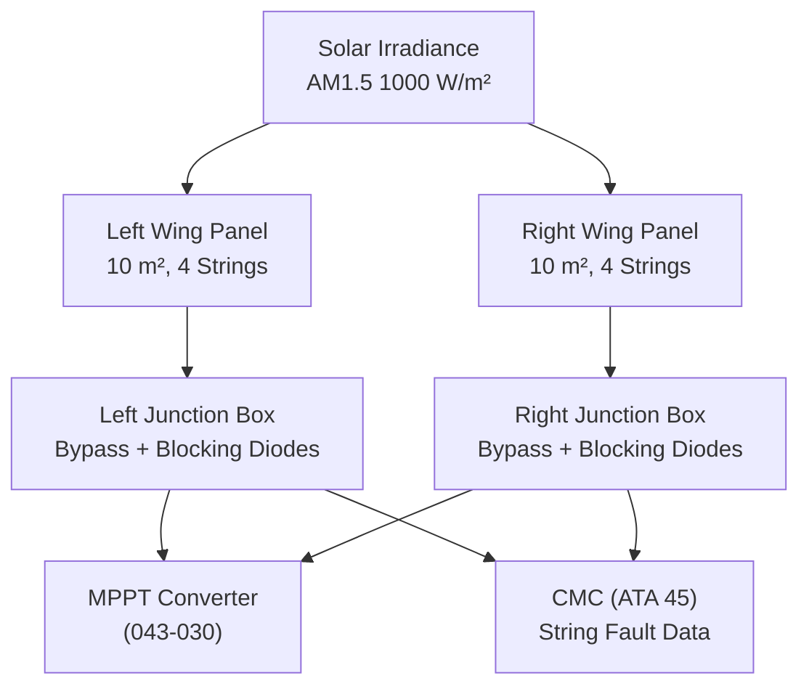
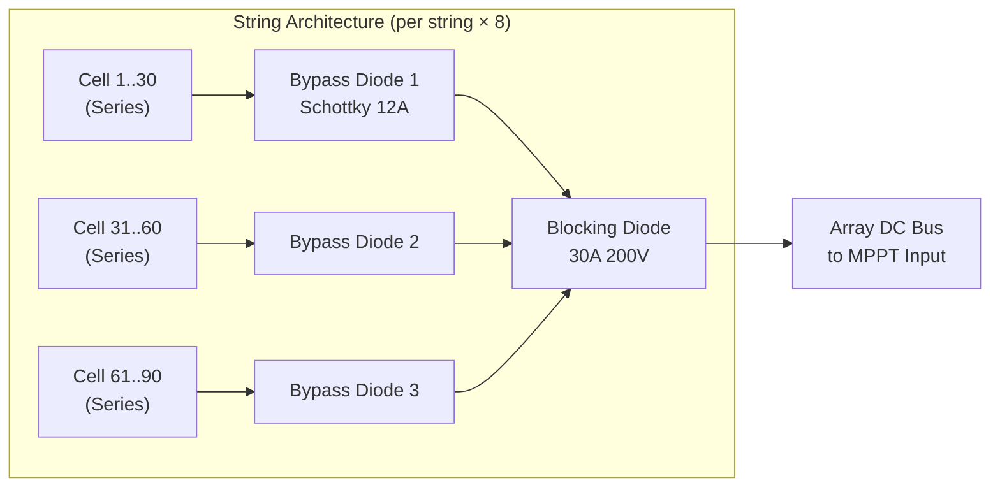
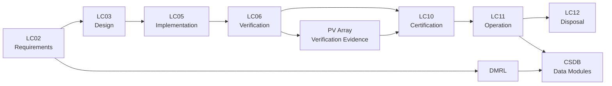

# ATLAS 040-049 · Section 04 · Subsection 043 · 010 — Emergency Solar Panel Arrays

## 0. Hyperlink Policy

All internal cross-references use relative Markdown links within the Q+ATLANTIDE CSDB repository. External regulatory citations marked . Parent: [043-000 General](./043-000-Emergency-Solar-Panel-System-General.md).

---

## 1. Purpose

This document defines the design, specification, and qualification requirements for the photovoltaic (PV) array assemblies constituting the light-capturing elements of the [PROGRAMME-AIRCRAFT] ESPS. It covers cell technology selection, array electrical architecture, environmental protection, and integration requirements to ensure reliable emergency power generation throughout the aircraft operational envelope.

---

## 2. Applicability

| Attribute | Value |
|-----------|-------|
| Aircraft Program | programme-defined aircraft type |
| ATA Reference | ATA 43.010 — Emergency Solar Panel Arrays |
| Applicable Standards | IEC 61215; IEC 61853; DO-160G; CS-25 §25.1309 |
| Design Assurance Level | PV Array: DAL C; Bypass Diode Circuit: DAL C |
| Configuration | [PROGRAMME-AIRCRAFT] Build Standard 1.0+ |

---

## 3. System / Function Overview

The ESPS array consists of GaAs triple-junction (3J) photovoltaic cells laminated into lightweight CFRP-backed panel assemblies. Two wing panels (left and right) each carry 10 m² of active PV area for a total deployed area of ≈ 20 m². Each wing panel is divided into four independent strings of series-connected cells, each string protected by a bypass diode to limit power loss due to partial shading. The array is covered by a high-transmittance, anti-reflective borosilicate glass to provide environmental protection and minimise reflective glare hazard.

Array electrical parameters at Standard Test Conditions (STC; AM1.5, 1000 W/m², 25°C):
- **Open-circuit voltage (Voc):** 145 V (per string)
- **Short-circuit current (Isc):** 7.1 A (per string)
- **Maximum power point voltage (Vmpp):** 118 V (per string)
- **Maximum power point current (Impp):** 6.7 A (per string)
- **String peak power:** ≈ 790 W; total array peak power: ≈ 8 kW (8 strings)

---

## 4. Scope

### 4.1 Included

- GaAs 3J PV cell specification and qualification criteria.
- String and array electrical architecture.
- Bypass diode and blocking diode circuit design.
- Panel substrate, encapsulant, and cover glass materials.
- Cell-to-panel integration process and lamination quality requirements.
- Anti-reflective coating and electromagnetic compatibility of the array.
- Array performance at non-STC conditions (partial irradiance, temperature variation, oblique incidence).

### 4.2 Excluded

- EMA deployment mechanism (043-020).
- MPPT power conditioner design (043-030).
- Wing structural integration (ATA 57; referenced only).

---

## 5. Architecture Description

**Cell Technology:** GaAs triple-junction concentrator cells adapted for 1-sun operation achieve conversion efficiency η ≥ 30% at STC. Cells measure 60 mm × 40 mm; each string consists of 90 series-connected cells (Vmpp per cell ≈ 1.31 V; Voc per cell ≈ 1.61 V). Cells are laser-scribed and interconnected by silver micro-contact strips with ±0.5% IV matching per string.

**Panel Substrate:** CFRP (carbon fibre reinforced polymer) 1.5 mm thick structural substrate provides mechanical support. Total panel mass per wing ≤ 18 kg (including cover glass and encapsulant). Aluminium honeycomb edge frame provides hinge attachment points for EMA.

**Encapsulant:** Ethylene Vinyl Acetate (EVA) encapsulant, 0.45 mm front sheet and 0.45 mm rear sheet. Passed UL 790 flame spread requirements. Operating temperature range: -55°C to +125°C.

**Cover Glass:** 3.2 mm borosilicate glass, solar transmittance ≥ 94% at 400–1100 nm. Anti-reflective (AR) coating double-layer MgF₂/SiO₂ reduces reflectance to <1% at 600 nm. Glass surface treated with hydrophobic/oleophobic coating to resist fouling.

**Electrical Architecture:** Each wing panel: 4 strings × 90 cells in series. All strings independent with bypass diodes (Schottky, 12 A, 200 V) across each cell string. Blocking diodes at string output prevent reverse current under shading conditions. Panel junction box IP67 sealed with ARINC 400-series electrical connector.

---

## 6. Functional Breakdown

| Function ID | Function Name | Description | DAL | Owner |
|-------------|---------------|-------------|-----|-------|
| F-043-01-01 | Solar Energy Capture | Convert solar irradiance to DC electrical power at η ≥ 30% (STC); provide 8 kW total array peak power | C | Q-GREENTECH |
| F-043-01-02 | String Bypass Protection | Limit power loss due to localised shading via bypass diodes; maintain remaining string output | C | Q-GREENTECH |
| F-043-01-03 | Array Environmental Protection | Protect PV cells from rain, hail, FOD, contamination, and UV degradation over 30,000 FH service life | C | Q-MECHANICS |
| F-043-01-04 | Performance Monitoring Support | Provide accessible string IV characteristic for MPPT input and diagnostic I-V curve sweep | C | Q-DATAGOV |
| F-043-01-05 | Thermal Self-Regulation | Limit cell temperature rise through conductive dissipation to panel substrate; maintain η loss <15% at Tcell=60°C | C | Q-GREENTECH |

---

## 7. Mermaid — Array System Context

---

## 8. Mermaid — Internal String Architecture

---

## 9. Mermaid — Lifecycle Traceability

---

## 10. Interfaces

| Interface ID | Name | Type | Counterpart | Protocol | Direction |
|--------------|------|------|-------------|----------|-----------|
| IF-043-01-01 | Array to MPPT Converter | Electrical | MPPT Converter (043-030) | DC HV bus, 8 strings | Output |
| IF-043-01-02 | Array to CMC (string health) | Data | CMC (ATA 45) | ARINC 429 string fault word | Output |
| IF-043-01-03 | Array to Diagnostic Tool | Data | Ground IV Analyser | Breakout connector at JB | Output |
| IF-043-01-04 | Array to Wing Structure | Mechanical | Wing Upper Surface (ATA 57) | Panel hinge; bonding strap | Physical |
| IF-043-01-05 | Array to EMA (panel load) | Mechanical | Deployment EMA (043-020) | Hinge attachment frame | Physical |
| IF-043-01-06 | Array to Thermal Model | Thermal | EPC thermal model | Temperature sensor output | Output |

---

## 11. Operating Modes

| Mode | Name | Description | Entry Condition | Exit Condition |
|------|------|-------------|-----------------|----------------|
| M1 | Stowed — No Generation | Panel stowed flush with wing; cells protected; no DC output | Normal flight or ground | Deployment commanded |
| M2 | Deploying | Panel in transit; partial cell exposure; DC output not yet connected | Deployment commanded | Panels fully deployed |
| M3 | Emergency Generation | Panels deployed; cells producing DC power; output connected to MPPT | Deployment complete | Stow command |
| M4 | Partial Generation (Shaded) | One or more strings bypassed due to shading; reduced power output | Cloud shadow event | Shading cleared |
| M5 | Degraded — Cell Fault | String isolation fault; one or more strings disconnected; power reduced | String fault detected | Maintenance |

---

## 12. Monitoring and Diagnostics

- **String Voltage Monitoring:** Each string output voltage monitored at 4 Hz; string Voc drop >20% from expected (given irradiance sensor reading) flags open-circuit fault to CMC.
- **String Current Monitoring:** String current monitored at 4 Hz; current >Isc×1.1 flags short-circuit bypass diode fault.
- **Irradiance Reference Sensor:** Calibrated reference PV cell (GaAs, same type) mounted on panel provides irradiance measurement (±5%) for normalised performance calculation.
- **I-V Curve Sweep:** Maintenance mode initiates string-by-string I-V curve sweep using variable electronic load in MPPT; compares to baseline characteristic; reports fill factor and Pmpp delta.
- **Cell Temperature Monitoring:** Three Pt100 RTDs per panel measure substrate temperature; temperature >85°C triggers power derating (-0.2%/°C above 25°C is nominal; additional derating at >85°C).
- **Annual Degradation Tracking:** Pmpp at STC compared annually to baseline; degradation >1%/year triggers advisory; >5% total degradation triggers replacement recommendation.
- **Shading Event Log:** All bypass diode activation events (inferred from string current drop) logged with timestamp and duration in CMC fault log.

---

## 13. Maintenance Concept

| Task ID | Task Description | Interval | Access | Skill Level |
|---------|-----------------|----------|--------|-------------|
| MC-043-01-01 | PV array visual inspection (glass, seal, connector) | A-Check | Wing upper surface | Line Mechanic |
| MC-043-01-02 | I-V curve sweep all 8 strings; compare to baseline | C-Check | Solar IV analyser | Avionics Engineer |
| MC-043-01-03 | Cover glass cleaning and anti-reflective coating assessment | B-Check | Cleaning kit | Line Mechanic |
| MC-043-01-04 | Junction box seal integrity and connector torque check | A-Check | Wing access | Line Mechanic |
| MC-043-01-05 | Cell degradation trend analysis and PHM report review | Annual | CMC / QAR data | Avionics Engineer |

---

## 14. S1000D / CSDB Mapping

| DMC | Title | Type | SNS |
|-----|-------|------|-----|
| QATL-A-043-10-00-00AAA-040A-A | PV Array Description and Specification | AMM | 043-010 |
| QATL-A-043-10-00-00AAA-520A-A | I-V Curve Sweep Procedure | AMM | 043-010 |
| QATL-A-043-10-00-00AAA-920A-A | PV Array Fault Isolation | FIM | 043-010 |
| QATL-A-043-10-00-00AAA-941A-A | PV Array Illustrated Parts Data | IPD | 043-010 |

---

## 15. Footprints

### 15.1 Physical

| Parameter | Value |
|-----------|-------|
| Total Active PV Area | ≈ 20 m² (10 m² per wing panel) |
| Cell Technology | GaAs triple-junction |
| Panel Thickness (stowed) | ≈ 12 mm |
| Panel Mass (each) | ≤ 18 kg |

### 15.2 Electrical

| Parameter | Value |
|-----------|-------|
| Peak Array Power (STC) | ≈ 8 kW |
| String Count | 8 (4 per wing) |
| String Vmpp | ≈ 118 V |
| String Impp | ≈ 6.7 A |

### 15.3 Maintenance

| Parameter | Value |
|-----------|-------|
| I-V Sweep Duration (all strings) | <30 min |
| Panel Replacement Time | <4 hours |
| Cover Glass Replacement | <8 hours |

### 15.4 Data

| Parameter | Value |
|-----------|-------|
| String Monitoring Sample Rate | 4 Hz |
| Irradiance Reference Accuracy | ±5% |
| Cell Temperature Sensor Count | 6 (3 per panel) |

---

## 16. Safety and Certification Considerations

- **IEC 61215 Qualification:** PV module assembly to be type-approved per IEC 61215 damp heat, thermal cycling, UV exposure, and hail impact tests. Additional DO-160G qualification for aircraft-specific environmental conditions (vibration, humidity, altitude).
- **High Voltage Arc Prevention:** Array maximum Voc at -40°C ≤ 1260 V (8 strings in parallel; single string Voc ≤ 160 V); arc distance requirements for junction box clearances verified to IEC 60664.
- **FOD Strike Risk:** Borosilicate glass panel withstands 1-inch diameter hail at 80 kts per IEC 61215 §10.17; panel remains intact with no cell exposure on single impact.
- **Reflective Glare:** Anti-reflective coating reduces panel reflectance to <2% at all solar angles; glare hazard assessment performed per EASA AMC 25-11.
- **GaAs Material Safety:** Gallium arsenide is classified as hazardous; cell fracture release of particulates requires containment within EVA encapsulant per IEC 61215 §10.6.
- **Service Life:** Array certified for 30,000 FH service life with ≤10% total power degradation. Annual degradation tracking mandatory.

---

## 17. Verification and Validation

| V&V ID | Requirement | Method | Evidence | Status |
|--------|-------------|--------|----------|--------|
| VV-043-01-01 | Array peak power ≥ 8 kW at STC | Test | Solar simulator test report |  |
| VV-043-01-02 | Cell conversion efficiency η ≥ 30% at STC | Test | Cell efficiency measurement |  |
| VV-043-01-03 | Bypass diode prevents single string shading from reducing power >15% | Test | Shading test with bypass diode |  |
| VV-043-01-04 | IEC 61215 hail impact — panel integrity maintained | Test | IEC 61215 §10.17 test |  |
| VV-043-01-05 | DO-160G vibration qualification — no cell fracture | Test | DO-160G §8 vibration test |  |
| VV-043-01-06 | Cover glass solar transmittance ≥ 94% | Test | Spectrophotometry |  |
| VV-043-01-07 | Power degradation ≤ 1%/year over 30,000 FH | Analysis | Accelerated degradation test extrapolation |  |

---

## 18. Glossary

| Term | Acronym | Definition |
|------|---------|------------|
| Triple-Junction Cell | 3J | PV cell with three p-n junctions tuned to different solar spectrum bands; achieves η > 30% |
| Standard Test Conditions | STC | AM1.5, 1000 W/m² irradiance, 25°C cell temperature per IEC 61215 |
| Bypass Diode | — | Schottky diode placed antiparallel across PV cell string; conducts on shading to prevent hotspot |
| Blocking Diode | — | Series diode preventing reverse current flow into shaded string from other strings |
| Fill Factor | FF | Ratio of maximum power to Voc × Isc product; characterises IV curve ideality; target >80% |
| Open-Circuit Voltage | Voc | Cell or string terminal voltage at zero current (no load) |
| Short-Circuit Current | Isc | Cell or string current at zero terminal voltage (shorted terminals) |
| Maximum Power Point | MPP | Operating point (Vmpp, Impp) at which power output is maximised |
| EVA | — | Ethylene Vinyl Acetate; transparent polymer encapsulant laminating PV cells to glass |
| AM1.5 | — | Air Mass 1.5; standard solar spectrum at 48.2° zenith angle; 1000 W/m² global irradiance |

---

## 19. Citations

| Ref ID | Standard | Applicability | Status |
|--------|----------|---------------|--------|
| CIT-043-01-01 | IEC 61215, Terrestrial PV Modules — Design Qualification | Array type qualification |  |
| CIT-043-01-02 | IEC 61853, PV Module Performance Testing and Energy Rating | Non-STC performance characterisation |  |
| CIT-043-01-03 | RTCA DO-160G, Environmental Conditions | Aircraft environmental qualification |  |
| CIT-043-01-04 | EASA CS-25 §25.1309 | Safety probability requirements |  |
| CIT-043-01-05 | IEC 60664, Insulation Coordination | Junction box creepage/clearance |  |
| CIT-043-01-06 | EASA AMC 25-11, Electronic Flight Instrument Systems | Glare hazard assessment |  |
| CIT-043-01-07 | SAE ARP4754B, Aircraft Development Guidelines | DAL C allocation rationale |  |
| CIT-043-01-08 | IEC 61215 §10.17, Hail Impact Test | Panel structural integrity |  |

---

## 20. References

| Ref ID | Document | Version | Status |
|--------|----------|---------|--------|
| REF-043-01-01 | ESPS General (043-000) | 1.0 |  |
| REF-043-01-02 | MPPT Conditioner (043-030) | 1.0 |  |
| REF-043-01-03 | GaAs Cell Supplier Datasheet | Rev A |  |

---

## 21. Open Issues

| Issue ID | Description | Owner | Status |
|----------|-------------|-------|--------|
| OI-043-01-01 | GaAs cell supplier selection and IEC 61215 qualification status | Q-GREENTECH |  |
| OI-043-01-02 | Anti-reflective coating longevity at aircraft cleaning fluid exposure to be validated | Q-GREENTECH |  |
| OI-043-01-03 | Array performance model at angles of incidence >60° to be verified | Q-AIR |  |

---

## 22. Change Log

| Version | Date | Author | Description |
|---------|------|--------|-------------|
| 1.0.0 | 2025-01-01 | Q+ Team/Amedeo Pelliccia + AI | Initial baseline release |  |
