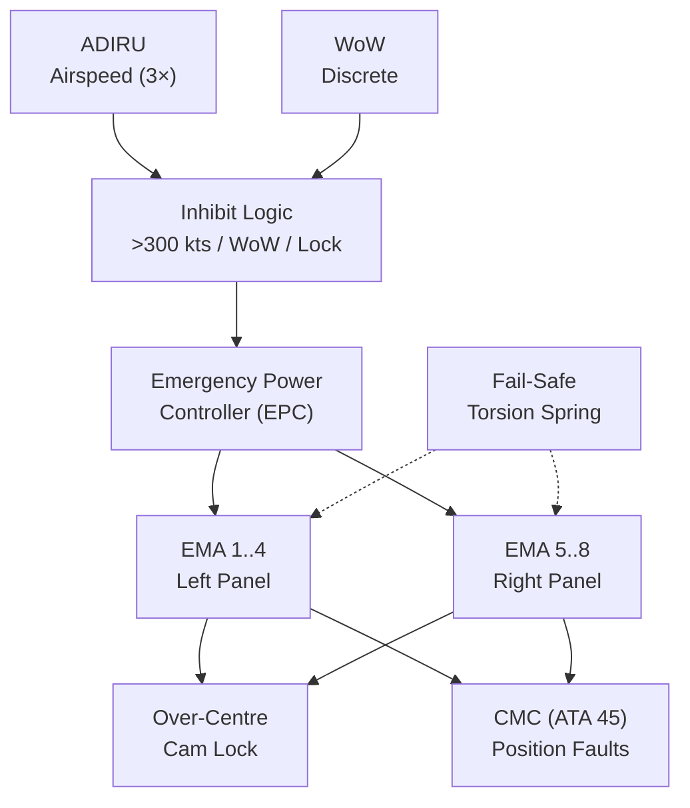
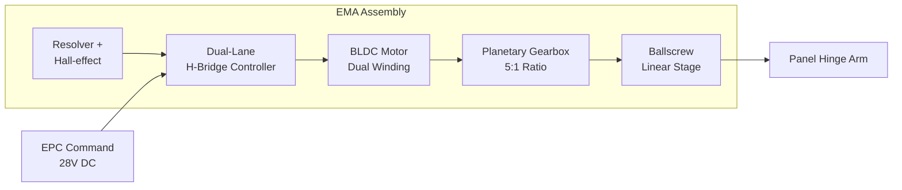
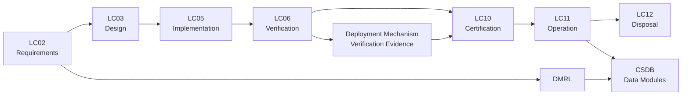

# ATLAS 040-049 · Section 04 · Subsection 043 · 020 — Deployment and Retraction Mechanisms

## 0. Hyperlink Policy

Internal cross-references use relative Markdown links. External regulatory citations marked . Parent: [043-000 General](./043-000-Emergency-Solar-Panel-System-General.md).

---

## 1. Purpose

This document defines the design, specification, qualification, and safety requirements for the electromechanical deployment and retraction mechanisms of the AMPEL360E Emergency Solar Panel System (ESPS). The deployment mechanism must reliably deploy the PV array within 30 seconds of generator loss detection and retract it on command, maintaining the deployed position against aerodynamic loads throughout the emergency flight phase.

---

## 2. Applicability

| Attribute | Value |
|-----------|-------|
| Aircraft Program | AMPEL360E eWTW |
| ATA Reference | ATA 43.020 — Deployment and Retraction Mechanisms |
| Applicable Standards | DO-160G; DO-254; ARP4754B; CS-25 §25.1309; CS-25 §25.629 |
| Design Assurance Level | EMA Control Electronics: DAL B; Mechanical: DAL C |
| Configuration | AMPEL360E Build Standard 1.0+ |

---

## 3. System / Function Overview

The ESPS deployment mechanism uses eight Electromechanical Actuators (EMAs), four per wing panel, driven by the Emergency Power Controller (EPC). Each EMA consists of a brushless DC motor (BLDC) driving a ballscrew linear stage with integrated position feedback via Hall-effect sensor and resolver. The ballscrew converts rotary motor output to linear panel-hinge extension.

Key mechanism parameters:
- **Deployment time (full extension from stowed):** <30 seconds at nominal voltage (28 V DC).
- **Retraction time (full retraction from deployed):** <45 seconds at nominal voltage.
- **EMA stroke:** 120 mm (corresponding to full panel deployment angle 85°).
- **EMA peak force:** 4500 N (deployment against aerodynamic and spring loads).
- **Fail-safe spring-return:** Pre-loaded torsion springs at hinge ensure passive stow on EMA power loss.
- **Deployment inhibit:** Deployment command inhibited above 300 kts CAS and when stow-lock is engaged.
- **Lock mechanism:** Mechanical over-centre cam lock engages at full deployment; holds position passively without continuous EMA power.

---

## 4. Scope

### 4.1 Included

- EMA design and specification (motor, ballscrew, position sensor).
- Hinge assembly and panel attachment interface.
- Over-centre cam deployment lock.
- Fail-safe spring return.
- EMA motor drive electronics and motor controller.
- EPC deployment logic and deployment/retract sequencing.
- Deployment position sensing and indication.
- Airspeed and stow-lock inhibit logic.

### 4.2 Excluded

- PV panel assembly (043-010).
- MPPT converter (043-030).
- Wing structural hard points (ATA 57; referenced).
- Emergency Power Controller hardware description (covered in 043-080).

---

## 5. Architecture Description

**EMA Assembly:** Each EMA is self-contained: BLDC motor + planetary gearbox (5:1) → ballscrew → linear output rod. Rod connects to panel hinge arm via clevis joint. Motor windings are independently redundant (dual-wound, two-channel drive). In normal deployment, both channels energised; loss of one channel results in reduced torque but deployment still completes in <45 seconds (degraded mode).

**Hinge Assembly:** Each panel hinges about a titanium piano-hinge along the forward panel edge, parallel to the leading edge. Eight EMA rods attach to the rear edge of the panel hinge arm. A pre-loaded torsion spring (k = 45 N·m/rad) provides fail-safe stow torque: if all EMA power is lost during deployment, spring retracts panel passively within 20 seconds.

**Over-Centre Lock:** At full deployment (85°), a cam follower on the hinge arm engages a roller lock on the wing spar bracket. The lock is self-latching and held by aerodynamic load geometry (panel produces a moment that keeps the lock engaged). Retraction requires EPC to first unlock (via unlock solenoid) before commanding EMA retraction.

**Motor Controller:** Each EMA motor controller is a dual-lane H-bridge PWM driver (28 V DC, peak 50 A per lane). Controller implements closed-loop position control (PID) with velocity feedforward. Current limit (45 A) protects motor winding from stall. Fault detection: over-current, over-temperature, resolver disagreement, and position error >5° trigger EMA fault flag.

**Inhibit Logic (DAL B):** Deployment command inhibited when: (a) airspeed from ADIRU >300 kts CAS (validated against single ADIRU failure; 2-of-3 ADIRU voting); (b) stow-lock pin engaged (landing gear ground safety pin interlock); (c) weight-on-wheels discrete active. Auto-retract commanded on WoW transition (air→ground).

---

## 6. Functional Breakdown

| Function ID | Function Name | Description | DAL | Owner |
|-------------|---------------|-------------|-----|-------|
| F-043-02-01 | EMA Deployment | On EPC deployment command: unlock solenoid release; power EMA motors; deploy panels to 85° in <30 s; engage over-centre lock | B | Q-GREENTECH |
| F-043-02-02 | EMA Retraction | On cockpit or auto-retract command: unlock solenoid release; power EMA motors to retract panels to 0°; disengage lock; confirm stowed | B | Q-GREENTECH |
| F-043-02-03 | Deployment Inhibit | Inhibit deployment command when airspeed >300 kts, stow-lock engaged, or WoW active; inhibit log recorded | B | Q-GREENTECH |
| F-043-02-04 | Fail-Safe Spring Return | On loss of EMA power during deployment: torsion spring passively retracts panels within 20 s | C | Q-MECHANICS |
| F-043-02-05 | Position Sensing and Indication | Continuous position feedback via resolver; deployed/stowed limit sensing via Hall-effect; position data to CMC and ECAM | B | Q-DATAGOV |

---

## 7. Mermaid — Deployment System Context

---

## 8. Mermaid — EMA Internal Architecture

---

## 9. Mermaid — Lifecycle Traceability

---

## 10. Interfaces

| Interface ID | Name | Type | Counterpart | Protocol | Direction |
|--------------|------|------|-------------|----------|-----------|
| IF-043-02-01 | EMA to EPC Command | Data/Power | EPC (043-080) | 28 V DC PWM; RS-422 command | Input |
| IF-043-02-02 | EMA to EPC Position Feedback | Data | EPC (043-080) | Resolver synchro; ARINC 429 position | Output |
| IF-043-02-03 | EMA to CMC Fault Status | Data | CMC (ATA 45) | ARINC 429 fault word | Output |
| IF-043-02-04 | EMA to ECAM Panel Position | Data | ECAM (ATA 31) | AFDX VL discrete | Output |
| IF-043-02-05 | EMA to Wing Hinge Hardpoint | Mechanical | Wing Spar (ATA 57) | EMA clevis attachment | Physical |
| IF-043-02-06 | EMA to ADIRU (Inhibit) | Data | ADIRU (ATA 34) | ARINC 429 airspeed | Input |

---

## 11. Operating Modes

| Mode | Name | Description | Entry Condition | Exit Condition |
|------|------|-------------|-----------------|----------------|
| M1 | Stowed (Spring Loaded) | EMA de-energised; spring holding panel stowed; stow-lock cam engaged | Normal operations | Deployment command |
| M2 | Deploying | EMA energised; panels extending to 85°; lock not yet engaged | EPC deploys command | Full deployment detected |
| M3 | Deployed and Locked | Panel at 85°; over-centre lock engaged; EMA de-energised; spring on release detent | Lock engaged confirmed | Retract command |
| M4 | Retracting | Unlock solenoid fired; EMA retracting panels; spring assists retraction | Retract command | Stowed position confirmed |
| M5 | EMA Fault — Partial Deployment | EMA fault; panels at intermediate position; spring return initiated; CMC alert | EMA over-current / resolver fault | Maintenance |

---

## 12. Monitoring and Diagnostics

- **EMA Motor Current Monitoring:** Motor current per winding channel monitored at 100 Hz; over-current (>150% nominal) triggers current limit and fault flag.
- **Position Disagreement:** Resolver and Hall-effect sensor position compared at 10 Hz; disagreement >5° triggers position fault and CMC alert.
- **Deployment Time Monitoring:** Deployment sequence timed from command; >35 s to full deployment triggers CMC caution (mechanism slow).
- **Lock Engagement Confirmation:** Cam lock engagement detected by dedicated microswitch; failure to confirm lock within 2 s of reaching 85° triggers CMC fault.
- **Motor Temperature:** BLDC winding temperature measured by embedded NTC; >150°C triggers thermal cut-out and CMC alert.
- **Spring Pre-load Monitoring:** Spring pre-load checked at C-Check via torque measurement; <90% of nominal torque triggers spring replacement advisory.
- **Hinge Wear Tracking:** PHM tracks cumulative EMA actuation cycles; >500 deploy/retract cycles (design life) triggers maintenance advisory.
- **Stow Inhibit Log:** All inhibited deployment attempts logged with timestamp and inhibit cause (airspeed / WoW / stow-lock).

---

## 13. Maintenance Concept

| Task ID | Task Description | Interval | Access | Skill Level |
|---------|-----------------|----------|--------|-------------|
| MC-043-02-01 | EMA visual inspection (rod, clevis, seals) | A-Check | Wing upper access | Line Mechanic |
| MC-043-02-02 | EMA BITE and deploy/retract cycle test | A-Check | Ground; EPC test mode | Avionics Technician |
| MC-043-02-03 | Spring pre-load torque measurement | C-Check | Hinge bay access | Structures Engineer |
| MC-043-02-04 | Resolver and Hall sensor calibration check | C-Check | ESPS diagnostic tool | Avionics Technician |
| MC-043-02-05 | Over-centre lock cam wear inspection and lubrication | B-Check | Hinge bay | Structures Engineer |

---

## 14. S1000D / CSDB Mapping

| DMC | Title | Type | SNS |
|-----|-------|------|-----|
| QATL-A-043-20-00-00AAA-040A-A | Deployment Mechanism Description | AMM | 043-020 |
| QATL-A-043-20-00-00AAA-520A-A | EMA Functional Test Procedure | AMM | 043-020 |
| QATL-A-043-20-00-00AAA-920A-A | Deployment Mechanism Fault Isolation | FIM | 043-020 |
| QATL-A-043-20-00-00AAA-941A-A | Deployment Mechanism Parts Data | IPD | 043-020 |

---

## 15. Footprints

### 15.1 Physical

| Parameter | Value |
|-----------|-------|
| EMA Count | 8 (4 per wing) |
| EMA Stroke | 120 mm |
| EMA Peak Force | 4500 N |
| EMA Mass (each) | ≤ 2.3 kg |

### 15.2 Electrical

| Parameter | Value |
|-----------|-------|
| EMA Operating Voltage | 28 V DC |
| EMA Peak Current (per EMA) | 50 A (dual-wound) |
| Total EMA Peak Power | 8 × 50 A × 28 V = 11.2 kW (deployment transient) |
| Standby Power | <5 W (position sensing only) |

### 15.3 Maintenance

| Parameter | Value |
|-----------|-------|
| Design Life (deploy/retract cycles) | 500 cycles |
| EMA Replacement Time | <2 hours |
| Functional Test Duration | <10 min |

### 15.4 Timing

| Parameter | Value |
|-----------|-------|
| Nominal Deployment Time | <30 s |
| Degraded Deployment Time (one winding failed) | <45 s |
| Retraction Time | <45 s |
| Spring Return Time (EMA power loss) | <20 s |

---

## 16. Safety and Certification Considerations

- **CS-25 §25.1309 — Spurious Deployment:** Spurious deployment above 300 kts is a Hazardous failure condition; probability <10⁻⁷/FH required. Inhibit logic uses 2-of-3 ADIRU airspeed voting with DAL B integrity.
- **CS-25 §25.629 — Aeroelastic Stability:** Deployed panel flutter margin ≥15% above VD/MD; aeroelastic analysis by Q-AIR confirms no flutter instability with panels deployed at Vmo/Mmo.
- **Fail-Safe Spring:** Passive spring return ensures panels stow on EMA power loss without flight crew action, preventing Catastrophic condition from panels departing aircraft.
- **Lock Positive Engagement:** Over-centre lock prevents panel flutter and cyclic loading on EMA during deployed phase; single mechanical failure of lock treated as Major (panel may oscillate; aerodynamic drag increase).
- **EMA Battery Separation:** EMA power supply comes from emergency bus; adequate bus voltage during deployment transient confirmed by power budget analysis (REF-043-02-02).
- **Ground Safety:** Stow-lock pin (maintenance) prevents deployment during ground maintenance; removal of pin disables maintenance inhibit and enables automatic deployment on generator loss.

---

## 17. Verification and Validation

| V&V ID | Requirement | Method | Evidence | Status |
|--------|-------------|--------|----------|--------|
| VV-043-02-01 | Deployment within 30 s — nominal | Test | Iron-bird deployment timing |  |
| VV-043-02-02 | Deployment inhibited above 300 kts (2-of-3 ADIRU) | Test | ADIRU fault injection test |  |
| VV-043-02-03 | Spring return completes in <20 s on EMA power loss | Test | EMA power-cut test |  |
| VV-043-02-04 | Over-centre lock engaged and confirmed after deployment | Test | Lock engagement functional test |  |
| VV-043-02-05 | EMA motor current limit prevents winding damage | Test | Stall current test |  |
| VV-043-02-06 | DO-160G §8 vibration — no EMA degradation | Test | DO-160G vibration test |  |
| VV-043-02-07 | CS-25 §25.629 flutter margin ≥15% above VD | Analysis | Aeroelastic analysis report |  |

---

## 18. Glossary

| Term | Acronym | Definition |
|------|---------|------------|
| Electromechanical Actuator | EMA | Motor-driven linear actuator converting electrical power to mechanical force/displacement |
| Brushless DC Motor | BLDC | DC motor without commutator brushes; uses electronic commutation; higher reliability |
| Ballscrew | — | Linear stage converting rotary motor torque to linear force via helical screw-nut |
| Over-Centre Lock | — | Mechanical cam/detent that locks at a geometric position; self-latching under load |
| Fail-Safe Spring | — | Pre-loaded torsion spring providing passive restoring force to stowed position on power loss |
| Resolver | — | Rotary position sensor based on rotary transformer; provides absolute angle measurement |
| Hall-Effect Sensor | — | Magnetic field sensor detecting rotor position; used for commutation and limit detection |
| Dual-Lane Controller | — | Motor controller with two independent power channels; provides fault tolerance |
| Stow-Lock | — | Ground safety pin mechanically preventing panel deployment during maintenance |
| Inhibit Logic | — | Control logic preventing deployment when unsafe conditions exist (airspeed, WoW, stow-lock) |

---

## 19. Citations

| Ref ID | Standard | Applicability | Status |
|--------|----------|---------------|--------|
| CIT-043-02-01 | EASA CS-25 §25.1309 | Spurious deployment probability requirement |  |
| CIT-043-02-02 | EASA CS-25 §25.629 | Aeroelastic flutter margin deployed panels |  |
| CIT-043-02-03 | RTCA DO-160G §8 | EMA vibration qualification |  |
| CIT-043-02-04 | RTCA DO-254 | EMA controller hardware DAL B |  |
| CIT-043-02-05 | SAE ARP4754B | DAL allocation for inhibit logic |  |
| CIT-043-02-06 | RTCA DO-160G §16 | EMI qualification EMA motor controller |  |
| CIT-043-02-07 | ASTM F3003, Qualification of Composite Structures | CFRP panel hinge arm qualification |  |
| CIT-043-02-08 | MIL-PRF-8500, Actuator Requirements | EMA mechanical life 500 cycles |  |

---

## 20. References

| Ref ID | Document | Version | Status |
|--------|----------|---------|--------|
| REF-043-02-01 | ESPS General (043-000) | 1.0 |  |
| REF-043-02-02 | AMPEL360E Emergency Bus Power Budget Analysis | 1.0 |  |
| REF-043-02-03 | AMPEL360E ESPS Aeroelastic Analysis | 1.0 |  |

---

## 21. Open Issues

| Issue ID | Description | Owner | Status |
|----------|-------------|-------|--------|
| OI-043-02-01 | EMA mechanical life 500 cycles adequate for 30,000 FH service life (assume 1 deployment per 60 FH average) — to be confirmed by ops analysis | Q-GREENTECH |  |
| OI-043-02-02 | Panel flutter margin analysis at Vmmo to be validated by wind tunnel test | Q-AIR |  |
| OI-043-02-03 | Emergency bus voltage during EMA deployment transient (11.2 kW peak) to be confirmed by full power budget | Q-GREENTECH |  |

---

## 22. Change Log

| Version | Date | Author | Description |
|---------|------|--------|-------------|
| 1.0.0 | 2025-01-01 | Q+ Team/Amedeo Pelliccia + AI | Initial baseline release |  |
