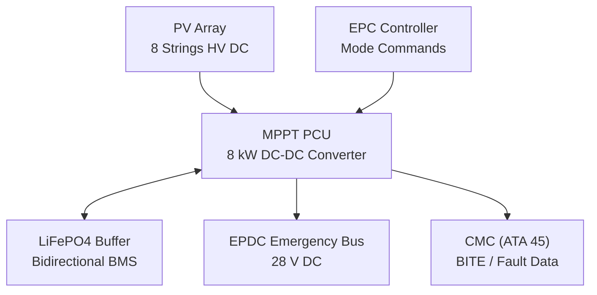
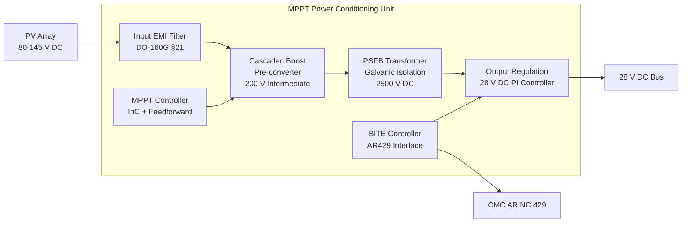
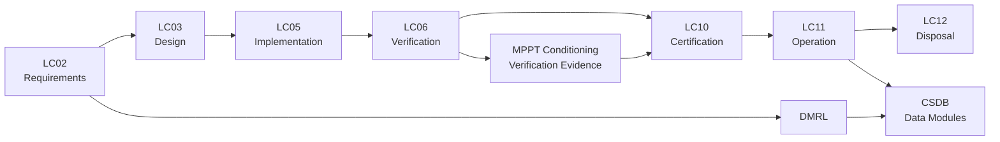

# ATLAS 040-049 · Section 04 · Subsection 043 · 030 — Power Conditioning and Regulation

## 0. Hyperlink Policy

Internal cross-references use relative Markdown links. External citations marked . Parent: [043-000 General](./043-000-Emergency-Solar-Panel-System-General.md).

---

## 1. Purpose

This document defines the design, specification, safety, and qualification requirements for the Maximum Power Point Tracking (MPPT) power conditioning and voltage regulation subsystem of the AMPEL360E ESPS. The power conditioner extracts maximum available power from the GaAs PV array, converts it to a regulated 28 V DC bus output, and interfaces with the aircraft Emergency Power Distribution Centre (EPDC) and LiFePO4 buffer battery.

---

## 2. Applicability

| Attribute | Value |
|-----------|-------|
| Aircraft Program | AMPEL360E eWTW |
| ATA Reference | ATA 43.030 — Power Conditioning and Regulation |
| Applicable Standards | DO-160G §21 (EMI); DO-254; DO-178C; MIL-STD-704F (28 V DC power quality) |
| Design Assurance Level | MPPT Control Software: DAL B; Hardware: DAL B |
| Configuration | AMPEL360E Build Standard 1.0+ |

---

## 3. System / Function Overview

The ESPS MPPT Power Conditioning Unit (PCU) is a DC-DC boost converter that operates the GaAs PV array at its maximum power point across the full irradiance range (50–1200 W/m²) and cell temperature range (-20°C to +85°C). The PCU output is regulated to 28 V DC (MIL-STD-704F compliant) and connects to the aircraft EPDC Emergency Bus via an OR-ing diode.

Key PCU parameters:
- **Input voltage range:** 80–145 V DC (PV array string Vmpp range across irradiance/temperature).
- **Output voltage:** 28.0 V DC ± 0.5 V (regulated, MIL-STD-704F).
- **Peak output power:** 8 kW at STC.
- **MPPT efficiency:** ≥95% across 20–100% irradiance range (Perturb-and-Observe algorithm with irradiance feedforward).
- **Galvanic isolation:** Flyback transformer stage provides galvanic isolation between PV array and 28 V bus (I/O isolation >2500 V DC).
- **Conversion efficiency (electrical):** η_PCU ≥ 95% from PV input to 28 V DC output at rated power.
- **EMI compliance:** DO-160G §20 (radiated) and §21 (conducted).

---

## 4. Scope

### 4.1 Included

- MPPT algorithm specification and implementation.
- DC-DC boost converter topology and galvanic isolation stage.
- 28 V DC output voltage regulation and protection.
- Input surge suppression and EMI filter design.
- PCU thermal management (baseplate cooling, heat dissipation).
- PCU BITE and fault reporting.
- Interface to LiFePO4 buffer battery bidirectional charge controller.

### 4.2 Excluded

- PV array assembly (043-010).
- LiFePO4 buffer battery chemistry and design (043-040).
- EPDC switching logic (ATA 24).
- EMA motor controller power (043-020, separate converter).

---

## 5. Architecture Description

**Converter Topology:** Two-stage architecture: (1) Input stage — Cascaded Boost pre-converter elevates string voltage to 200 V DC regulated intermediate bus, with input EMI filter (LC differential-mode + common-mode filter to DO-160G §21). (2) Isolation stage — Phase-shifted full-bridge (PSFB) DC-DC converter with 200 V:28 V flyback transformer providing galvanic isolation and 28 V output regulation.

**MPPT Algorithm:** Incremental Conductance (InC) with irradiance feedforward from calibrated reference cell on PV panel. Operating at 10 kHz switching frequency (input stage), MPPT scan period 100 ms. At cloud shadow transition, irradiance feedforward allows MPPT operating point to track shadow within 2 scan periods without significant power loss.

**MPPT Sweep (Diagnostic):** On command (EPC diagnostic request or maintenance mode), PCU performs full I-V curve sweep from Voc to Isc across each string independently; sweep data transmitted to CMC via ARINC 429 for analysis and comparison to baseline.

**Output Regulation:** 28 V output regulated by PI voltage controller (inner current loop, outer voltage loop). Output protection: over-voltage trip at 29.5 V (250 ms delay), under-voltage trip at 26.0 V (100 ms delay), over-current trip at 120% of rated current (instantaneous). All trips latch until reset by EPC command or PCU power cycle.

**Galvanic Isolation:** PSFB transformer leakage inductance resonates with MOSFET output capacitance to achieve zero-voltage switching (ZVS) at rated load, minimising switching losses. Transformer isolation rating: 2500 V DC, 1 min per UL 1741.

**Thermal Management:** PCU housed in conduction-cooled aluminium enclosure. Baseplate thermally coupled to aircraft structure via thermal compound and M6 fasteners. Maximum baseplate temperature: +85°C. Power dissipation at rated output: ≈400 W (5% of 8 kW). Derating curve: −2% per °C above +70°C baseplate temperature.

---

## 6. Functional Breakdown

| Function ID | Function Name | Description | DAL | Owner |
|-------------|---------------|-------------|-----|-------|
| F-043-03-01 | Maximum Power Point Tracking | Continuously adjust PV array operating voltage to maximise power extraction across 20–100% irradiance range; efficiency ≥95% | B | Q-GREENTECH |
| F-043-03-02 | DC-DC Conversion and Isolation | Convert PV array HV DC (80–145 V) to 28 V DC with galvanic isolation; η ≥ 95%; DO-160G §21 EMI compliant | B | Q-GREENTECH |
| F-043-03-03 | Output Voltage Regulation | Regulate 28 V DC ± 0.5 V; implement OVP, UVP, OCP protection; report output status to EPC | B | Q-GREENTECH |
| F-043-03-04 | Battery Interface | Interface bidirectional charge controller for LiFePO4 buffer battery; enable solar energy storage when EPDC load < array output | B | Q-GREENTECH |
| F-043-03-05 | BITE and Diagnostics | Execute PCU self-test on EPC request; provide efficiency, fault, temperature, and IV curve data to CMC via ARINC 429 | B | Q-DATAGOV |

---

## 7. Mermaid — PCU System Context

---

## 8. Mermaid — PCU Internal Architecture

---

## 9. Mermaid — Lifecycle Traceability

---

## 10. Interfaces

| Interface ID | Name | Type | Counterpart | Protocol | Direction |
|--------------|------|------|-------------|----------|-----------|
| IF-043-03-01 | PCU to PV Array Input | Electrical | PV Array (043-010) | HV DC, 80–145 V, 8 strings | Input |
| IF-043-03-02 | PCU to EPDC Emergency Bus | Electrical | EPDC (ATA 24) | 28 V DC, OR-ing diode | Output |
| IF-043-03-03 | PCU to LiFePO4 Buffer | Electrical | Buffer Battery (043-040) | 28 V DC bidirectional | Bidirectional |
| IF-043-03-04 | PCU to EPC (Mode/Command) | Data | EPC (043-080) | ARINC 429; discrete control | Input |
| IF-043-03-05 | PCU to CMC (Diagnostics) | Data | CMC (ATA 45) | ARINC 429 status/fault | Output |
| IF-043-03-06 | PCU Baseplate to Structure | Thermal | Aircraft Structure | Conduction, thermal compound | Physical |

---

## 11. Operating Modes

| Mode | Name | Description | Entry Condition | Exit Condition |
|------|------|-------------|-----------------|----------------|
| M1 | Standby | PCU powered; self-test passed; waiting for array connection | EPC standby command | Array connected; EPC enable |
| M2 | MPPT Active — Full Power | MPPT tracking; full array output to EPDC bus; battery charging if surplus | Array deployed; irradiance available | Irradiance <50 W/m² or EPC disable |
| M3 | MPPT Active — Reduced Irradiance | Tracking at low irradiance; output <rated; battery discharging to supplement EPDC | Irradiance 50–200 W/m² | Irradiance returns >200 W/m² |
| M4 | Diagnostic / I-V Sweep | Full I-V curve sweep per string; MPPT suspended; diagnostic data to CMC | EPC diagnostic command | Sweep complete |
| M5 | Fault / Isolated | PCU output protection tripped; OR-ing diode reverse-biased; EPDC on battery/RAT | OVP/OCP trip; PCU fault | EPC reset command |

---

## 12. Monitoring and Diagnostics

- **MPPT Efficiency:** Computed as P_out/(Irradiance × Array_area × η_cell); efficiency <90% triggers diagnostic I-V sweep.
- **Input Voltage Monitoring:** PV array voltage monitored per string at 10 Hz; string voltage out of expected Vmpp band ±15% triggers MPPT alert.
- **Output Voltage Regulation:** Output voltage accuracy monitored at 100 Hz; deviation >0.5 V for >250 ms triggers OVP/UVP protection.
- **Over-Current Monitoring:** Output current monitored at 100 Hz; >120% rated current triggers OCP trip.
- **Transformer Temperature:** Transformer core temperature monitored; >120°C triggers power derating; >140°C triggers PCU shutdown.
- **EMI Filter Integrity:** Input EMI filter leakage inductance measured at maintenance; <90% of nominal triggers advisory.
- **Conversion Efficiency Tracking:** η_PCU computed hourly; degradation trend >0.5% per 1000 FH triggers PCU inspection advisory.
- **I-V Sweep Archive:** All I-V curve sweep results stored in CMC with timestamp; retrievable via Ground Station for trend analysis.

---

## 13. Maintenance Concept

| Task ID | Task Description | Interval | Access | Skill Level |
|---------|-----------------|----------|--------|-------------|
| MC-043-03-01 | PCU visual inspection (connectors, heatsink, seals) | A-Check | PCU bay access | Line Mechanic |
| MC-043-03-02 | PCU BITE and output power test | A-Check | GSE test set | Avionics Technician |
| MC-043-03-03 | PCU efficiency measurement at 50%, 75%, 100% load | C-Check | Power measurement equipment | Avionics Engineer |
| MC-043-03-04 | EMI filter leakage inductance measurement | C-Check | LCR meter | Avionics Technician |
| MC-043-03-05 | PCU replacement on degradation advisory | On-Condition | PCU bay; LRU exchange | Avionics Technician |

---

## 14. S1000D / CSDB Mapping

| DMC | Title | Type | SNS |
|-----|-------|------|-----|
| QATL-A-043-30-00-00AAA-040A-A | MPPT PCU Description and Specification | AMM | 043-030 |
| QATL-A-043-30-00-00AAA-520A-A | PCU BITE and Output Power Test Procedure | AMM | 043-030 |
| QATL-A-043-30-00-00AAA-920A-A | PCU Fault Isolation | FIM | 043-030 |
| QATL-A-043-30-00-00AAA-941A-A | PCU Illustrated Parts Data | IPD | 043-030 |

---

## 15. Footprints

### 15.1 Physical

| Parameter | Value |
|-----------|-------|
| PCU Dimensions (L×W×H) | 380 × 250 × 90 mm |
| PCU Mass | ≤ 6 kg |
| PCU Housing | Aluminium 6061-T6 conduction-cooled |
| Connector Standard | MIL-DTL-38999 Series III |

### 15.2 Electrical

| Parameter | Value |
|-----------|-------|
| Input Voltage Range | 80–145 V DC |
| Output Voltage | 28.0 V DC ± 0.5 V |
| Peak Output Power | 8 kW |
| Conversion Efficiency | ≥95% at rated power |

### 15.3 Maintenance

| Parameter | Value |
|-----------|-------|
| MTBF Estimate | >50,000 hours |
| BITE Test Duration | <3 min |
| LRU Replacement Time | <30 min |

### 15.4 Data

| Parameter | Value |
|-----------|-------|
| MPPT Scan Period | 100 ms |
| Output Monitoring Rate | 100 Hz |
| I-V Sweep Duration | <3 min per string |

---

## 16. Safety and Certification Considerations

- **MIL-STD-704F 28 V DC Compliance:** PCU output meets MIL-STD-704F Essential Power steady-state voltage, transient overshoot, and noise requirements ensuring compatibility with aircraft 28 V DC loads.
- **Galvanic Isolation Safety:** 2500 V DC galvanic isolation prevents high-voltage PV array (up to 145 V) from appearing on 28 V aircraft bus in fault conditions; isolation resistance >10 MΩ verified quarterly.
- **EMI / DO-160G §21:** Conducted EMI from PCU switching (10 kHz) attenuated by input LC filter to DO-160G Category M limits; protects avionics from PV switching interference.
- **Over-Voltage Protection:** Hardware OVP (independent of software) trips output relay at 29.5 V within 5 ms to prevent EPDC bus overvoltage.
- **Single-Fault Tolerance:** PCU output failure (short-circuit or open-circuit) does not cascade to EPDC bus; OR-ing diode protects bus; load continues from RAT/battery. PCU failure is a Major failure condition (reduces emergency power, does not cause loss of flight).
- **DO-178C DAL B Software:** MPPT control firmware qualified to DO-178C DAL B; 100% statement and decision coverage; qualified tool (compiler) substantiation.

---

## 17. Verification and Validation

| V&V ID | Requirement | Method | Evidence | Status |
|--------|-------------|--------|----------|--------|
| VV-043-03-01 | Peak output ≥ 8 kW at STC array input | Test | PCU power measurement at rated input |  |
| VV-043-03-02 | MPPT efficiency ≥ 95% at 20%, 50%, 100% irradiance | Test | MPPT efficiency measurement |  |
| VV-043-03-03 | Output voltage 28 V ± 0.5 V steady state | Test | Output regulation measurement |  |
| VV-043-03-04 | Galvanic isolation >2500 V DC | Test | Hi-pot test per UL 1741 |  |
| VV-043-03-05 | DO-160G §21 conducted EMI compliance | Test | EMI test report |  |
| VV-043-03-06 | OVP trips at 29.5 V within 5 ms (HW) | Test | OVP functional test |  |
| VV-043-03-07 | DO-178C DAL B software evidence complete | Inspection | DAL B lifecycle records |  |

---

## 18. Glossary

| Term | Acronym | Definition |
|------|---------|------------|
| Maximum Power Point Tracking | MPPT | Control algorithm continuously adjusting PV operating point to maximise power output |
| Power Conditioning Unit | PCU | LRU performing MPPT, DC-DC conversion, and voltage regulation |
| Phase-Shifted Full Bridge | PSFB | DC-DC converter topology with zero-voltage switching for high efficiency at rated load |
| Zero-Voltage Switching | ZVS | MOSFET switching when drain-source voltage is zero, eliminating switching losses |
| Galvanic Isolation | — | Electrical separation between input and output with no DC path; provided by transformer |
| Incremental Conductance | InC | MPPT algorithm comparing incremental conductance dI/dV to -I/V at MPP |
| OR-ing Diode | — | Diode allowing multiple power sources to share a bus without back-feeding each other |
| Over-Voltage Protection | OVP | Hardware or software circuit tripping output at threshold to prevent bus overvoltage |
| Over-Current Protection | OCP | Hardware circuit limiting or tripping output current at threshold |
| MIL-STD-704F | — | Aircraft Electric Power Characteristics; defines 28 V DC steady-state and transient limits |

---

## 19. Citations

| Ref ID | Standard | Applicability | Status |
|--------|----------|---------------|--------|
| CIT-043-03-01 | MIL-STD-704F, Aircraft Electric Power Characteristics | 28 V DC bus quality requirements |  |
| CIT-043-03-02 | RTCA DO-160G §21, Conducted Susceptibility/Emissions | PCU EMI qualification |  |
| CIT-043-03-03 | RTCA DO-254, Airborne Electronic Hardware | PCU hardware DAL B |  |
| CIT-043-03-04 | RTCA DO-178C, Software Considerations | MPPT firmware DAL B |  |
| CIT-043-03-05 | UL 1741, Standard for Inverters, Converters, Controllers | Galvanic isolation hi-pot test |  |
| CIT-043-03-06 | SAE ARP4754B, Aircraft Development Guidelines | DAL B allocation rationale |  |
| CIT-043-03-07 | EASA CS-25 §25.1309 | PCU failure probability requirements |  |
| CIT-043-03-08 | IEC 62109, Safety for Power Converters | Power electronics safety |  |

---

## 20. References

| Ref ID | Document | Version | Status |
|--------|----------|---------|--------|
| REF-043-03-01 | ESPS General (043-000) | 1.0 |  |
| REF-043-03-02 | PV Array (043-010) | 1.0 |  |
| REF-043-03-03 | Emergency Energy Storage Interface (043-040) | 1.0 |  |

---

## 21. Open Issues

| Issue ID | Description | Owner | Status |
|----------|-------------|-------|--------|
| OI-043-03-01 | PSFB ZVS range across full irradiance and temperature to be verified by circuit simulation | Q-GREENTECH |  |
| OI-043-03-02 | Cloud shadow MPPT tracking speed requirement (<200 ms) to be validated against irradiance feedforward design | Q-GREENTECH |  |
| OI-043-03-03 | PCU baseplate temperature budget under worst-case avionics bay temperature (+70°C ambient) to be confirmed | Q-MECHANICS |  |

---

## 22. Change Log

| Version | Date | Author | Description |
|---------|------|--------|-------------|
| 1.0.0 | 2025-01-01 | Q-GREENTECH | Initial baseline release |  |
