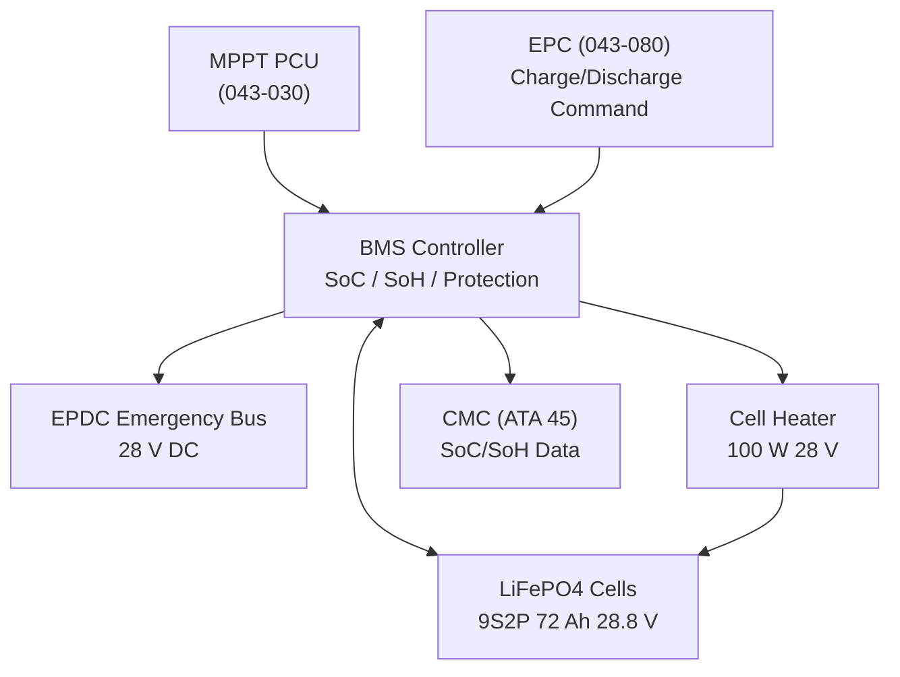
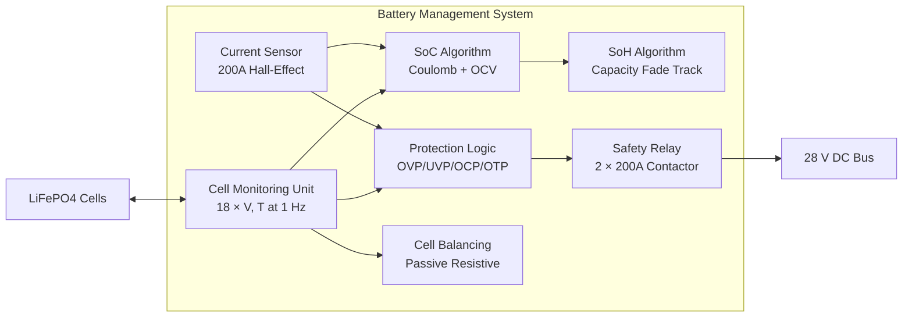
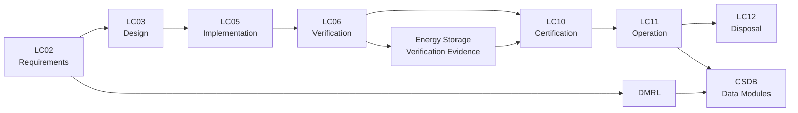

# ATLAS 040-049 · Section 04 · Subsection 043 · 040 — Emergency Energy Storage Interface

## 0. Hyperlink Policy

Internal cross-references use relative Markdown links. External citations marked . Parent: [043-000 General](./043-000-Emergency-Solar-Panel-System-General.md).

---

## 1. Purpose

This document defines the design, specification, safety, and qualification requirements for the LiFePO4 buffer battery and bidirectional Battery Management System (BMS) that constitute the ESPS Emergency Energy Storage Interface. The buffer battery smooths bus voltage transients during PV irradiance variations (cloud shadows) and provides supplementary energy during peak demand events that exceed instantaneous PV array output.

---

## 2. Applicability

| Attribute | Value |
|-----------|-------|
| Aircraft Program | AMPEL360E eWTW |
| ATA Reference | ATA 43.040 — Emergency Energy Storage Interface |
| Applicable Standards | DO-160G; IEC 62619 (safety LiFePO4); DO-254; DO-178C; CS-25 §25.1309; AS5698 |
| Design Assurance Level | BMS Software: DAL B; BMS Hardware: DAL B |
| Configuration | AMPEL360E Build Standard 1.0+ |

---

## 3. System / Function Overview

The ESPS buffer battery is a LiFePO4 (Lithium Iron Phosphate) cell-based assembly providing 2 kWh of usable energy at 28 V nominal bus voltage. LiFePO4 chemistry is selected for its high thermal stability (no thermal runaway at overcharge), long cycle life (>3000 cycles at 80% DoD), and low self-discharge. The BMS manages charge/discharge, cell balancing, state of charge (SoC) estimation, state of health (SoH) monitoring, and safety protection functions.

Key battery parameters:
- **Nominal capacity:** 72 Ah at 28 V nominal (2.0 kWh usable).
- **Nominal voltage:** 28.8 V (nominal cell 3.2 V × 9 cells in series = 28.8 V).
- **Operating SoC range:** 10–95% (usable depth of discharge 85%).
- **Charge voltage limit:** 29.7 V (3.3 V/cell × 9 cells).
- **Discharge cut-off voltage:** 25.2 V (2.8 V/cell × 9 cells).
- **Maximum continuous charge/discharge current:** 150 A (C/0.48 at 72 Ah).
- **Operating temperature range:** -20°C to +60°C (discharge); 0°C to +45°C (charge).
- **Cold soak (storage, non-operational):** -55°C to +70°C.

---

## 4. Scope

### 4.1 Included

- LiFePO4 cell module specification and configuration.
- BMS hardware (cell monitoring, balancing, protection switches).
- SoC estimation algorithm (Coulomb counting + OCV correction).
- SoH monitoring and capacity fade tracking.
- Thermal management (battery heater for cold start; passive cooling).
- BMS BITE and CMC reporting.
- Emergency bus interface and bidirectional power flow management.
- Battery replacement criteria and handling procedures.

### 4.2 Excluded

- MPPT PCU design (043-030, interfaces only referenced).
- Aircraft emergency battery (ATA 24) — separate system.
- Aircraft Emergency Power Distribution Centre (EPDC, ATA 24).

---

## 5. Architecture Description

**Cell Configuration:** Battery assembly: 9 cells in series (9S1P) × 2 modules in parallel = 9S2P total. Total 18 cells per battery pack. Each module: 9 × LiFePO4 prismatic 36 Ah cells (CATL or equivalent aerospace-grade) → 9S1P = 28.8 V / 36 Ah per module. Two modules in parallel → 28.8 V / 72 Ah. Cell matching criterion: capacity match ±2%, internal resistance match ±5%.

**BMS Architecture:** BMS consists of: (1) Cell Monitoring Unit (CMU) — per-cell voltage (±1 mV) and temperature (±0.5°C) measurement at 1 Hz; (2) Current Sensor — hall-effect 200 A bidirectional (±0.5% accuracy) for coulomb counting; (3) Passive Cell Balancing — resistive bypass per cell activated at V_cell >3.25 V; (4) Safety Relay Assembly — two series contactors (main+, main−) rated 200 A; (5) BMS Controller — DAL B software running SoC and SoH algorithms.

**SoC Estimation:** Primary: Coulomb counting at 1 Hz with initial SoC from resting OCV lookup table. Correction: OCV cross-check at rest periods; SoC drift correction <1% over 1000 FH. SoC accuracy target: ±3% across operational temperature range.

**SoH Monitoring:** Capacity fade tracked by comparing measured Ah throughput against nominal Ah at full charge cycle. SoH = Q_measured/Q_nominal × 100%. Battery replacement recommended at SoH <80% (capacity <57.6 Ah from nominal 72 Ah).

**Thermal Management:** Integrated silicone rubber heating pad (100 W, 28 V DC) activates at cell temperature <0°C to enable charging without lithium plating. Passive conduction cooling via aluminium battery enclosure baseplate; maximum temperature 60°C (continuous operation). Over-temperature protection: BMS disconnects load and charge at T_cell >65°C.

**Bidirectional Power Flow:** When ESPS PV array output exceeds EPDC load demand, PCU diverts surplus power to charge battery (charge mode, limited to 150 A). When PV output insufficient (low irradiance), battery supplements EPDC via BMS discharge control (discharge mode). BMS arbitrates charge/discharge via EPDC load signal from EPC.

---

## 6. Functional Breakdown

| Function ID | Function Name | Description | DAL | Owner |
|-------------|---------------|-------------|-----|-------|
| F-043-04-01 | Energy Buffering | Absorb PV surplus (charge) and supplement EPDC during low irradiance (discharge); smooth bus voltage transients <100 ms | B | Q-GREENTECH |
| F-043-04-02 | SoC Estimation | Coulomb counting with OCV correction; report SoC ±3% to EPC and CMC | B | Q-DATAGOV |
| F-043-04-03 | SoH Monitoring | Track capacity fade; report SoH and replacement advisory at SoH <80% | B | Q-DATAGOV |
| F-043-04-04 | Cell Protection | Protect cells from over-voltage (>3.30 V/cell), under-voltage (<2.80 V/cell), over-current (>150 A), and over-temperature (>65°C) | B | Q-GREENTECH |
| F-043-04-05 | Cold Soak Conditioning | Activate heating pad at T <0°C to bring cells to charge-safe temperature before enabling charge current | B | Q-GREENTECH |

---

## 7. Mermaid — Battery System Context

---

## 8. Mermaid — BMS Internal Architecture

---

## 9. Mermaid — Lifecycle Traceability

---

## 10. Interfaces

| Interface ID | Name | Type | Counterpart | Protocol | Direction |
|--------------|------|------|-------------|----------|-----------|
| IF-043-04-01 | Battery to PCU (Charge) | Electrical | MPPT PCU (043-030) | 28 V DC, 150 A max charge | Input |
| IF-043-04-02 | Battery to EPDC (Discharge) | Electrical | EPDC (ATA 24) | 28 V DC, 150 A max discharge | Output |
| IF-043-04-03 | BMS to EPC (SoC/SoH Status) | Data | EPC (043-080) | ARINC 429 status word | Output |
| IF-043-04-04 | BMS to CMC (Diagnostics) | Data | CMC (ATA 45) | ARINC 429 fault/SoH | Output |
| IF-043-04-05 | BMS to Cell Heater | Electrical | Silicone Heater Pad | 28 V DC on/off discrete | Output |
| IF-043-04-06 | Battery to Structure | Mechanical | Avionics Bay Rack | Battery tray, M8 retention | Physical |

---

## 11. Operating Modes

| Mode | Name | Description | Entry Condition | Exit Condition |
|------|------|-------------|-----------------|----------------|
| M1 | Standby | BMS powered; cells at rest; SoC maintained; no charge/discharge current | ESPS in Normal Stowed mode | Charge/discharge command |
| M2 | Charging | PCU surplus power charging cells; balancing active; SoC increasing | PV surplus detected by EPC | SoC ≥95% or EPC disable |
| M3 | Discharging | Cells supplying EPDC supplement; SoC decreasing; load management active | EPC discharge command | SoC ≤10% or EPC disable |
| M4 | Cold Conditioning | Heater active warming cells; charge inhibited until T_cell ≥0°C | T_cell <0°C at ground | T_cell ≥0°C |
| M5 | Fault — Protected | Safety relay open; cells isolated; CMC alert; EPC reverts to RAT+emergency battery | OVP/UVP/OCP/OTP trip | EPC reset after maintenance |

---

## 12. Monitoring and Diagnostics

- **Per-Cell Voltage:** Each of 18 cells monitored at 1 Hz; cell voltage out of 2.80–3.30 V range triggers individual cell fault and BMS protection response.
- **SoC Reporting:** SoC reported to EPC at 1 Hz; SoC <20% triggers CMC advisory (low buffer reserve); SoC <10% triggers EPC load shedding tier escalation.
- **SoH Tracking:** Accumulated Ah throughput and measured capacity at last full cycle recorded; SoH reported on CMC at each power-up; SoH <80% triggers replacement advisory.
- **Cell Temperature:** Per-module temperature (2 sensors per module, 4 total) monitored at 1 Hz; T >65°C triggers over-temperature protection.
- **Cell Balancing Status:** Passive balancing activation per cell reported in CMC fault log; excessive imbalance (>50 mV spread) triggers advisory for cell matching inspection.
- **Current Accuracy Check:** Hall-effect current sensor drift validated at maintenance against shunt reference; drift >1% triggers sensor replacement.
- **Contactor Weld Check:** Safety relay contactor pre-charge test at each EPC enable checks for welded contacts.
- **Cycle Count:** Deploy/charge cycle count tracked by BMS; >3000 cycles triggers battery replacement advisory.

---

## 13. Maintenance Concept

| Task ID | Task Description | Interval | Access | Skill Level |
|---------|-----------------|----------|--------|-------------|
| MC-043-04-01 | Battery visual inspection (case, connectors, vents) | A-Check | Battery bay access | Line Mechanic |
| MC-043-04-02 | BMS BITE, SoC, SoH check | A-Check | CMC ground terminal | Avionics Technician |
| MC-043-04-03 | Full charge-discharge cycle and capacity measurement | 2-year / On-Condition | Battery test bench | Avionics Technician |
| MC-043-04-04 | Cell voltage balance inspection | B-Check | CMC data download | Avionics Technician |
| MC-043-04-05 | Battery replacement (SoH <80%) | On-Condition | Battery bay; LRU exchange | Avionics Technician |

---

## 14. S1000D / CSDB Mapping

| DMC | Title | Type | SNS |
|-----|-------|------|-----|
| QATL-A-043-40-00-00AAA-040A-A | Energy Storage Interface Description | AMM | 043-040 |
| QATL-A-043-40-00-00AAA-520A-A | Battery BITE and SoH Check Procedure | AMM | 043-040 |
| QATL-A-043-40-00-00AAA-920A-A | Battery Fault Isolation | FIM | 043-040 |
| QATL-A-043-40-00-00AAA-941A-A | Battery Illustrated Parts Data | IPD | 043-040 |

---

## 15. Footprints

### 15.1 Physical

| Parameter | Value |
|-----------|-------|
| Battery Assembly Dimensions | 350 × 250 × 120 mm |
| Battery Assembly Mass | ≤ 12 kg |
| Cell Chemistry | LiFePO4 prismatic |
| Cell Configuration | 9S2P (18 cells) |

### 15.2 Electrical

| Parameter | Value |
|-----------|-------|
| Nominal Capacity | 72 Ah |
| Usable Energy | 2 kWh (SoC 10–95%) |
| Nominal Voltage | 28.8 V |
| Max Continuous Current | 150 A charge/discharge |

### 15.3 Maintenance

| Parameter | Value |
|-----------|-------|
| Design Cycle Life | >3000 cycles at 80% DoD |
| Replacement Trigger | SoH <80% or cycle count >3000 |
| Battery Replacement Time | <1 hour |

### 15.4 Data

| Parameter | Value |
|-----------|-------|
| SoC Estimation Accuracy | ±3% |
| CMU Sample Rate | 1 Hz |
| SoC Report Rate to EPC | 1 Hz |

---

## 16. Safety and Certification Considerations

- **IEC 62619 Compliance:** LiFePO4 cells and battery assembly qualified per IEC 62619 safety requirements; includes overcharge, over-discharge, external short-circuit, crush, and thermal abuse tests.
- **AS5698 — Lithium Battery Airworthiness:** Battery assembly complies with SAE AS5698 guidance for airworthiness approval of lithium batteries in civil aircraft; includes thermal runaway containment demonstration.
- **Thermal Runaway Containment:** LiFePO4 chemistry has thermally stable cathode; no thermal runaway propagation demonstrated by cell-to-cell thermal test; battery enclosure rated to contain single-cell venting without structure damage.
- **Overcharge Prevention:** Hardware OVP independent of BMS software trips contactor at 3.30 V/cell; single point of failure protection maintained.
- **Disposal — Lithium Regulation:** LiFePO4 cells contain lithium; disposal per IATA Dangerous Goods Regulations §4.3.3 and applicable environmental regulations; disposal plan in CSDB.
- **EMC:** Battery and BMS emission per DO-160G §21; conducted noise on 28 V bus within MIL-STD-704F limits.

---

## 17. Verification and Validation

| V&V ID | Requirement | Method | Evidence | Status |
|--------|-------------|--------|----------|--------|
| VV-043-04-01 | Battery delivers 2 kWh usable (SoC 10–95%) at 25°C | Test | Capacity discharge test |  |
| VV-043-04-02 | SoC estimation accuracy ±3% across -20°C to +60°C | Test | Thermocouple-controlled SoC test |  |
| VV-043-04-03 | Cell voltage OVP trips at 3.30 V (HW) | Test | OVP functional test |  |
| VV-043-04-04 | IEC 62619 overcharge safety test — no fire/explosion | Test | IEC 62619 §8.3.4 test |  |
| VV-043-04-05 | Thermal runaway non-propagation (single cell) | Test | Cell-to-cell thermal test |  |
| VV-043-04-06 | Cycle life >3000 cycles at 80% DoD | Test | Accelerated cycle life test |  |
| VV-043-04-07 | Cold soak heater enables charging above 0°C | Test | Cold soak conditioning test |  |

---

## 18. Glossary

| Term | Acronym | Definition |
|------|---------|------------|
| Lithium Iron Phosphate | LiFePO4 | Lithium battery cathode chemistry; high thermal stability; long cycle life |
| Battery Management System | BMS | Electronic system monitoring, protecting, and balancing lithium battery cells |
| State of Charge | SoC | Current energy level of battery; expressed as % of rated capacity |
| State of Health | SoH | Measure of battery capacity relative to nominal; SoH=100% at beginning of life |
| Coulomb Counting | CC | SoC estimation by integrating measured current over time |
| Open Circuit Voltage | OCV | Battery terminal voltage at zero current; function of SoC used for OCV correction |
| Depth of Discharge | DoD | Fraction of capacity discharged; 80% DoD means 80% of nominal capacity used |
| Cell Balancing | — | Equalisation of cell SoC within a series string to prevent cell voltage divergence |
| Thermal Runaway | TR | Exothermic chain reaction in lithium cell leading to rapid temperature rise and venting |
| AS5698 | — | SAE standard for airworthiness approval of lithium batteries in civil aircraft |

---

## 19. Citations

| Ref ID | Standard | Applicability | Status |
|--------|----------|---------------|--------|
| CIT-043-04-01 | IEC 62619, Safety Requirements for Secondary Lithium Cells | LiFePO4 safety qualification |  |
| CIT-043-04-02 | SAE AS5698, Airworthiness Approval Lithium Batteries | Airworthiness approval |  |
| CIT-043-04-03 | RTCA DO-160G, Environmental Qualification | Battery environmental tests |  |
| CIT-043-04-04 | RTCA DO-254, Electronic Hardware | BMS hardware DAL B |  |
| CIT-043-04-05 | RTCA DO-178C, Software Considerations | BMS software DAL B |  |
| CIT-043-04-06 | EASA CS-25 §25.1309 | Failure probability requirements |  |
| CIT-043-04-07 | IATA DGR §4.3.3, Lithium Batteries | Battery transport and disposal |  |
| CIT-043-04-08 | MIL-STD-704F | 28 V DC bus noise requirements |  |

---

## 20. References

| Ref ID | Document | Version | Status |
|--------|----------|---------|--------|
| REF-043-04-01 | ESPS General (043-000) | 1.0 |  |
| REF-043-04-02 | MPPT PCU (043-030) | 1.0 |  |
| REF-043-04-03 | AMPEL360E Emergency Power Budget Analysis | 1.0 |  |

---

## 21. Open Issues

| Issue ID | Description | Owner | Status |
|----------|-------------|-------|--------|
| OI-043-04-01 | LiFePO4 cell supplier (CATL or equivalent) selection and AS5698 qualification status | Q-GREENTECH |  |
| OI-043-04-02 | Cold soak thermal model: time to reach 0°C from -55°C at 100 W heater power to be modelled | Q-GREENTECH |  |
| OI-043-04-03 | Battery enclosure venting path design for thermal runaway single-cell event to be finalised | Q-MECHANICS |  |

---

## 22. Change Log

| Version | Date | Author | Description |
|---------|------|--------|-------------|
| 1.0.0 | 2025-01-01 | Q-GREENTECH | Initial baseline release |  |
