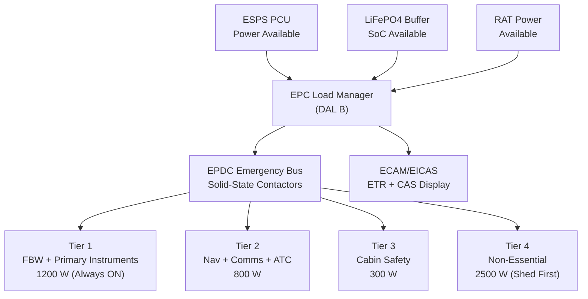
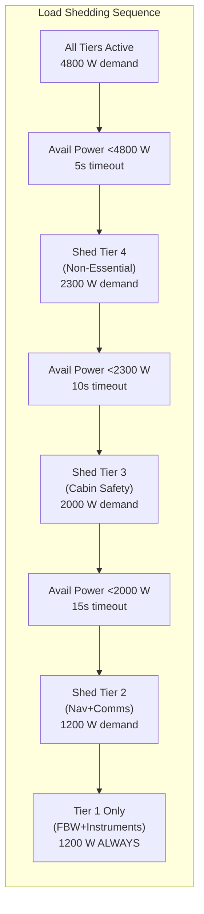
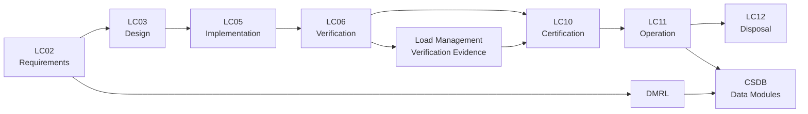

# ATLAS 040-049 · Section 04 · Subsection 043 · 050 — Emergency Load Prioritization and Distribution

## 0. Hyperlink Policy

Internal cross-references use relative Markdown links. External citations marked . Parent: [043-000 General](./043-000-Emergency-Solar-Panel-System-General.md).

---

## 1. Purpose

This document defines the design, logic, safety requirements, and certification approach for the ESPS Emergency Load Prioritization and Distribution function, which determines how available emergency electrical power (from ESPS PV array, LiFePO4 buffer battery, RAT, and emergency battery) is allocated to aircraft loads under generator-loss conditions. The function implements a four-tier load shedding architecture ensuring that flight-critical loads are sustained for ≥30 minutes irrespective of available solar irradiance.

---

## 2. Applicability

| Attribute | Value |
|-----------|-------|
| Aircraft Program | programme-defined aircraft type |
| ATA Reference | ATA 43.050 — Emergency Load Prioritization and Distribution |
| Applicable Standards | CS-25 §25.1351; DO-178C DAL B; DO-254 DAL B; ARP4754B |
| Design Assurance Level | Load Manager Software: DAL B; EPDC switching: DAL B |
| Configuration | [PROGRAMME-AIRCRAFT] Build Standard 1.0+ |

---

## 3. System / Function Overview

Under generator loss, the ESPS Emergency Power Controller (EPC) activates the Load Manager function. Total available emergency power sources (ESPS + RAT + Battery) are monitored continuously. The Load Manager implements automatic load shedding in four tiers, ordered by criticality, to ensure available power meets minimum load requirements throughout the emergency phase:

**Load Budget Summary (all tiers active, minimum loads):**
- Tier 1 (Flight Critical, always on): FBW computers (DAL A) + Primary Flight Instruments + Essential Avionics = 1200 W.
- Tier 2 (Navigation & Communication): Navigation displays + VHF/HF comms + ATC transponder = 800 W.
- Tier 3 (Cabin Safety): Cabin lighting (emergency) + cabin crew interphone + PA system = 300 W.
- Tier 4 (Non-Essential): Passenger cabin IFE + environmental control non-critical + galley = 2500 W (shed first).
- **Total minimum (Tiers 1–3): 2300 W** — sustained by RAT alone; ESPS provides reserve margin.
- **Total with all tiers: 4800 W** — sustained by ESPS + RAT combined at ≥50% irradiance.

Required endurance ≥30 minutes at minimum (Tiers 1–3 active, partial irradiance 200 W/m²).

---

## 4. Scope

### 4.1 Included

- Four-tier load shedding architecture and tier assignment table.
- Automatic shedding logic triggered by power source availability.
- Manual override capability for flight crew (cockpit ESPS panel).
- Endurance calculation and display (estimated time remaining on emergency power).
- Inter-system coordination with EPDC and RAT controller.
- Load restoration sequence on ESPS output recovery.

### 4.2 Excluded

- EPDC hardware design (ATA 24).
- RAT system (ATA 24).
- Aircraft emergency battery management (ATA 24 — separate BMS).

---

## 5. Architecture Description

**Load Manager Software:** Runs on the Emergency Power Controller (EPC) IMA partition (DAL B). Inputs: ESPS PCU power output (kW), buffer battery SoC (%), RAT output power (kW), emergency battery SoC (%), EPDC total load current (A). Outputs: Load shed tier commands (discrete to EPDC solid-state contactors), estimated time remaining (ECAM display), and CMC advisory messages.

**Tier Logic:** Load Manager operates a hysteresis-based tier control:
- **Tier 4 shed trigger:** Available power < Tier 1+2+3+4 demand for >5 s.
- **Tier 3 shed trigger:** Available power < Tier 1+2+3 demand for >10 s (after Tier 4 already shed).
- **Tier 2 shed trigger:** Available power < Tier 1+2 demand for >15 s (emergency — RAT + battery only).
- **Tier 1 always maintained** (FBW, flight instruments); shed of Tier 1 is a Catastrophic failure condition prevented by hardware architecture.

**Restoration Logic:** When available power recovers (irradiance increase or battery SoC recovered), Load Manager restores tiers in reverse order (Tier 3 first, then 2, then 4) with 30-second stabilisation delay between restorations.

**Estimated Time Remaining (ETR):** EPC computes ETR = (Battery_SoC × Battery_capacity + Solar_remaining_estimate) / Current_load. ETR displayed on ECAM/EICAS emergency power page, updated at 1 Hz. ETR <15 min triggers amber CAS; ETR <5 min triggers red CAS.

**Manual Override:** Cockpit ESPS control panel provides: (a) manual load shed tier selection (force shed any tier); (b) manual tier restoration. Manual actions logged in QAR. EPC enforces Tier 1 cannot be shed by manual command.

---

## 6. Functional Breakdown

| Function ID | Function Name | Description | DAL | Owner |
|-------------|---------------|-------------|-----|-------|
| F-043-05-01 | Power Source Monitoring | Monitor ESPS PCU, battery SoC, RAT, and emergency battery outputs at 1 Hz; compute total available power | B | Q-DATAGOV |
| F-043-05-02 | Automatic Load Shedding | Implement 4-tier automatic load shedding based on available power; ensure Tier 1 always powered | B | Q-AIR |
| F-043-05-03 | Load Restoration | Restore shed tiers in priority order when available power recovers; stabilisation delay 30 s | B | Q-AIR |
| F-043-05-04 | ETR Computation and Display | Compute and display estimated time remaining on emergency power; trigger CAS at <15 min and <5 min | B | Q-DATAGOV |
| F-043-05-05 | Manual Override | Accept and process cockpit manual tier shed/restore commands; log in QAR; enforce Tier 1 protection | B | Q-AIR |

---

## 7. Mermaid — Load Management Context

---

## 8. Mermaid — Load Shedding Sequence Logic

---

## 9. Mermaid — Lifecycle Traceability

---

## 10. Interfaces

| Interface ID | Name | Type | Counterpart | Protocol | Direction |
|--------------|------|------|-------------|----------|-----------|
| IF-043-05-01 | Load Manager to EPDC (Shed Commands) | Data | EPDC (ATA 24) | Discrete to solid-state contactors | Output |
| IF-043-05-02 | Load Manager to ECAM/EICAS (ETR + CAS) | Data | ECAM (ATA 31) | AFDX VL; ETR value + CAS messages | Output |
| IF-043-05-03 | Load Manager from PCU (Power Available) | Data | MPPT PCU (043-030) | ARINC 429 power word | Input |
| IF-043-05-04 | Load Manager from Battery (SoC) | Data | BMS (043-040) | ARINC 429 SoC word | Input |
| IF-043-05-05 | Load Manager from RAT (Power Available) | Data | RAT Controller (ATA 24) | ARINC 429 power word | Input |
| IF-043-05-06 | Load Manager to QAR (Manual Actions Log) | Data | QAR (ATA 31) | AFDX VL; discrete log record | Output |

---

## 11. Operating Modes

| Mode | Name | Description | Entry Condition | Exit Condition |
|------|------|-------------|-----------------|----------------|
| M1 | Normal — All Tiers Active | All 4 tiers powered from emergency bus (generators have failed, ESPS + RAT fully operational) | ESPS deployed; full power available | Power shortfall detected |
| M2 | Tier 4 Shed | Non-essential loads disconnected; Tiers 1–3 powered | Available power <4800 W for 5 s | Power recovers >4800 W |
| M3 | Tiers 3+4 Shed | Cabin safety + non-essential shed; Tiers 1+2 powered | Available power <2300 W for 10 s | Power recovers or further shed |
| M4 | Tiers 2+3+4 Shed | Only FBW + primary instruments powered; RAT+battery minimum | Available power <2000 W for 15 s | ETR reached or landing |
| M5 | Manual Override Active | Flight crew has manually shed or restored a tier | Cockpit ESPS manual command | Crew command or auto-shed |

---

## 12. Monitoring and Diagnostics

- **Power Balance Monitoring:** Total available power vs total EPDC load computed at 1 Hz; power deficit triggers shed sequence.
- **Shed Tier Status Reporting:** Current shed tier status reported to ECAM and CMC in real time; logged in QAR.
- **ETR Trend Monitoring:** ETR trend (improving/degrading) displayed on ECAM; rapid ETR decrease (<1 min/min decrease rate) triggers additional CAS advisory.
- **Tier 4 Restoration Monitoring:** Tier 4 restoration after recovery verified by EPDC contactor feedback; failure to restore within 5 s triggers CMC caution (contactor fault).
- **Tier 1 Integrity Monitoring:** FBW and primary instrument bus voltage monitored continuously; bus drop below 26 V for >100 ms triggers Tier 1 undervoltage CMC alert.
- **Manual Override Logging:** All manual cockpit override commands timestamped and recorded in QAR for post-flight review.
- **Load Prediction Model:** EPC maintains load model based on known aircraft load profiles; model compared to actual EPDC current measurements; discrepancy >15% triggers load model advisory.
- **ETR Display Accuracy:** ETR computation validated against actual energy consumed per flight; maximum ETR display error ±2 min.

---

## 13. Maintenance Concept

| Task ID | Task Description | Interval | Access | Skill Level |
|---------|-----------------|----------|--------|-------------|
| MC-043-05-01 | EPDC contactor functional test (all 4 tier contactors) | A-Check | GSE; EPC test mode | Avionics Technician |
| MC-043-05-02 | Load Manager BITE and power balance test | A-Check | CMC ground terminal | Avionics Technician |
| MC-043-05-03 | ETR computation accuracy validation | C-Check | ESPS test harness | Avionics Engineer |
| MC-043-05-04 | Full shedding sequence functional test (iron-bird or aircraft) | C-Check | ESPS integration test | Avionics Engineer |
| MC-043-05-05 | QAR manual override log review | Post-Flight (conditional) | CMC/QAR download | Avionics Technician |

---

## 14. S1000D / CSDB Mapping

| DMC | Title | Type | SNS |
|-----|-------|------|-----|
| QATL-A-043-50-00-00AAA-040A-A | Load Prioritization Architecture Description | AMM | 043-050 |
| QATL-A-043-50-00-00AAA-520A-A | EPDC Contactor and Load Shedding Test | AMM | 043-050 |
| QATL-A-043-50-00-00AAA-920A-A | Load Manager Fault Isolation | FIM | 043-050 |
| QATL-A-043-50-00-00AAA-941A-A | EPDC Contactor Illustrated Parts | IPD | 043-050 |

---

## 15. Footprints

### 15.1 Electrical

| Tier | Loads | Power (W) |
|------|-------|-----------|
| Tier 1 (Always ON) | FBW, primary instruments, essential avionics | 1200 |
| Tier 2 | Navigation, VHF/HF comms, ATC transponder | 800 |
| Tier 3 | Cabin emergency lighting, PA, interphone | 300 |
| Tier 4 (Shed First) | IFE, galley, non-essential ECS | 2500 |

### 15.2 Software

| Parameter | Value |
|-----------|-------|
| Load Manager Software DAL | B |
| Scan Period | 1 Hz (1000 ms) |
| Shed Decision Timeout (Tier 4) | 5 s |
| Shed Decision Timeout (Tier 3) | 10 s |

### 15.3 Maintenance

| Parameter | Value |
|-----------|-------|
| EPDC Contactor Count (shed tiers) | 4 (one per tier) |
| Contactor Test Duration | <5 min |
| Full Sequence Test Duration | <20 min |

### 15.4 Data

| Parameter | Value |
|-----------|-------|
| ETR Update Rate | 1 Hz |
| ETR Display Accuracy | ±2 min |
| QAR Log Entry Size | 32 bytes per event |

---

## 16. Safety and Certification Considerations

- **CS-25 §25.1351 Compliance:** ESPS load management supports CS-25 §25.1351 emergency electrical power requirements; Tier 1 loads correspond to §25.1351(b)(1) essential loads.
- **DAL B Load Manager:** Load Manager software developed to DO-178C DAL B with 100% decision coverage; failure of Load Manager to execute shed (result: overloaded bus) is a Major failure condition.
- **Tier 1 Hardware Protection:** Tier 1 bus (FBW, instruments) protected by hardware relay independent of Load Manager software; prevents software failure from causing loss of FBW.
- **Endurance Margin:** Power budget analysis demonstrates ≥30 min endurance at Tier 1+2+3 loads from ESPS + RAT + buffer battery combined at 200 W/m² irradiance (worst-case overcast).
- **Manual Override Governance:** Flight crew may manually shed Tier 4 or Tier 3; Tier 1 hardware lock prevents crew from shedding flight-critical loads. Manual Tier 2 shed requires specific procedure (abnormal checklist).
- **No Single Point Failure:** No single failure in Load Manager hardware or software causes simultaneous loss of Tier 1 + Tier 2 loads; verified by FHA and fault tree analysis.

---

## 17. Verification and Validation

| V&V ID | Requirement | Method | Evidence | Status |
|--------|-------------|--------|----------|--------|
| VV-043-05-01 | Tier 4 shedding within 5 s of power deficit detection | Test | Load shed timing test (iron-bird) |  |
| VV-043-05-02 | Tier 1 never shed under any Load Manager failure | Test + Analysis | FHA + fault injection test |  |
| VV-043-05-03 | Endurance ≥30 min at 200 W/m² irradiance (Tiers 1–3) | Analysis | Power budget analysis |  |
| VV-043-05-04 | ETR displayed within ±2 min of actual remaining time | Test | ETR accuracy measurement |  |
| VV-043-05-05 | ETR <15 min triggers amber CAS; <5 min triggers red CAS | Test | ETR CAS functional test |  |
| VV-043-05-06 | Manual override cockpit commands processed within 500 ms | Test | Command response time test |  |
| VV-043-05-07 | DO-178C DAL B software evidence complete (Load Manager) | Inspection | DAL B lifecycle records |  |

---

## 18. Glossary

| Term | Acronym | Definition |
|------|---------|------------|
| Emergency Power Distribution Centre | EPDC | Aircraft switching unit distributing emergency electrical power to load buses |
| Load Shedding | — | Disconnecting non-critical loads to reduce total bus demand when power is limited |
| Estimated Time Remaining | ETR | Predicted time until complete depletion of available emergency energy; displayed on ECAM |
| Crew Alerting System | CAS | Standardised cockpit message system for abnormal/emergency conditions; amber/red messages |
| Solid-State Contactor | SSC | Electronic power switch with no moving parts; controls load bus connection |
| Tier 1 | — | Highest priority load group: FBW, primary flight instruments, essential avionics |
| Tier 4 | — | Lowest priority load group: IFE, galley, non-essential ECS; first to be shed |
| Power Budget | — | Analysis accounting for all power sources and loads to determine endurance |
| DAL B | — | Design Assurance Level B per ARP4754B; required when system failure is Hazardous |
| Quick Access Recorder | QAR | Airborne data recorder storing flight operational data for post-flight analysis |

---

## 19. Citations

| Ref ID | Standard | Applicability | Status |
|--------|----------|---------------|--------|
| CIT-043-05-01 | EASA CS-25 §25.1351, Emergency Electrical Power | Essential load requirements |  |
| CIT-043-05-02 | RTCA DO-178C, Software Considerations | Load Manager DAL B software |  |
| CIT-043-05-03 | RTCA DO-254, Airborne Electronic Hardware | EPDC contactor controller DAL B |  |
| CIT-043-05-04 | SAE ARP4754B, Aircraft Development Guidelines | DAL B allocation rationale |  |
| CIT-043-05-05 | EASA CS-25 §25.1309 | Load Manager failure probability |  |
| CIT-043-05-06 | SAE ARP4761, Safety Assessment Methods | FHA and fault tree for load management |  |
| CIT-043-05-07 | EASA CS-25 §25.1353, Electrical Equipment Protection | Bus protection requirements |  |
| CIT-043-05-08 | MIL-STD-704F, Aircraft Electric Power | Bus voltage quality under shedding |  |

---

## 20. References

| Ref ID | Document | Version | Status |
|--------|----------|---------|--------|
| REF-043-05-01 | ESPS General (043-000) | 1.0 |  |
| REF-043-05-02 | Emergency Energy Storage Interface (043-040) | 1.0 |  |
| REF-043-05-03 | [PROGRAMME-AIRCRAFT] Emergency Power Budget Analysis | 1.0 |  |

---

## 21. Open Issues

| Issue ID | Description | Owner | Status |
|----------|-------------|-------|--------|
| OI-043-05-01 | Exact Tier 1 load value (currently estimated 1200 W) to be confirmed by FBW and avionics power analysis | Q-AIR |  |
| OI-043-05-02 | EPDC solid-state contactor supplier and DO-254 qualification status to be confirmed | Q-GREENTECH |  |
| OI-043-05-03 | Manual override Tier 2 shed procedure (abnormal checklist) to be developed with flight ops | Q-AIR |  |

---

## 22. Change Log

| Version | Date | Author | Description |
|---------|------|--------|-------------|
| 1.0.0 | 2025-01-01 | Q+ Team/Amedeo Pelliccia + AI | Initial baseline release |  |
