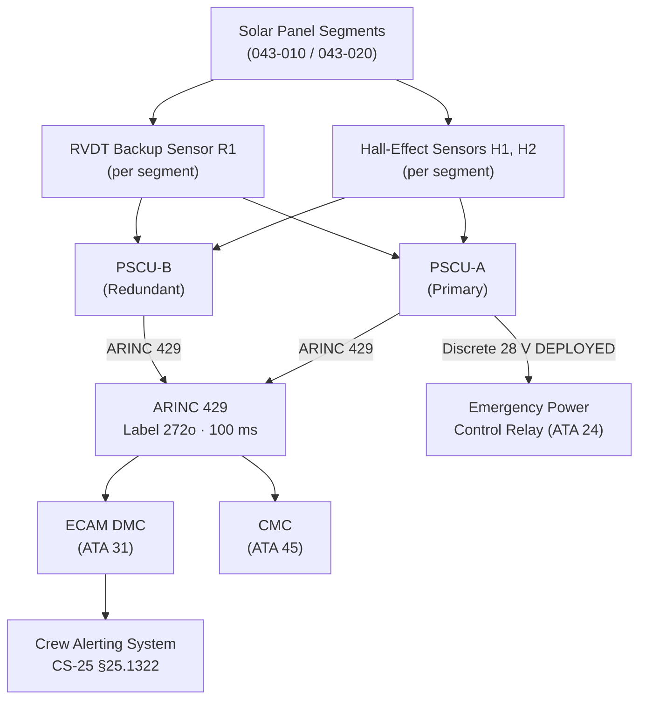
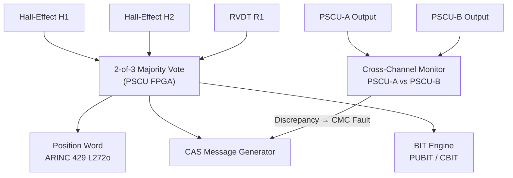
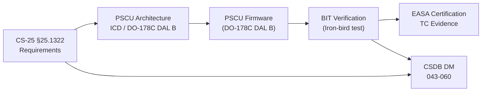

# ATLAS 040-049 · Section 04 · Subsection 043 · 060 — Panel Position Indication and Warning

## 0. Hyperlink Policy

All internal cross-references use relative Markdown links within the Q+ATLANTIDE CSDB repository. External regulatory citations in §19/§20 marked TBD. Parent context: [ATLAS 043 README](./README.md).

---

## 1. Purpose

This document defines the panel position indication and warning functions of the Emergency Solar Panel System (ESPS) for the programme-defined aircraft type. It covers cockpit indication of panel deployment/stow state, position sensor architecture, crew alerting system (CAS) message generation, built-in test (BIT), and ECAM/EICAS display integration.

Key governance areas:
- Position sensor architecture (primary Hall-effect + redundant RVDT).
- ECAM/EICAS panel state display and CAS message catalogue.
- BIT coverage for the position sensing channel (PUBIT/CBIT).
- ARINC 429 position data output to CMC and ACMS.
- CS-25 §25.1322 flight-crew alerting compliance.

---

## 2. Applicability

| Attribute | Value |
|-----------|-------|
| Aircraft Program | programme-defined aircraft type |
| ATA Chapter | ATA 43 (ATLAS 043) — Emergency Solar Panel System |
| Certification Basis | CS-25 Amendment 28; CS-25 §25.1322; DO-160G |
| Applicable Standards | DO-160G; DO-178C; ARP4754B |
| Design Assurance Level | Position Sensor FPGA Logic: DAL B |
| S1000D SNS | 043-060 |

---

## 3. System / Function Overview

Panel position indication provides a continuous, authoritative signal to the flight deck of each solar panel array's deployment state (Stowed / Deploying / Deployed / Retracting / Fault). Position sensors (primary: Hall-effect, secondary: RVDT) are installed at each deployment pivot. The Position Signal Conditioning Unit (PSCU) processes raw sensor data, applies 2-of-3 majority-vote logic per array, and outputs a validated position word on ARINC 429 label 272o. The PSCU interfaces with the ECAM Display Management Computer (DMC) and the CAS to generate standardised advisory and warning messages.

---

## 4. Scope

### 4.1 In-Scope

- Hall-effect (primary) and RVDT (backup) position sensor installation per panel segment.
- Position Signal Conditioning Unit (PSCU-A / PSCU-B dual-redundant) processing and 2-of-3 vote logic.
- ARINC 429 position word output (label 272o, 100 ms refresh).
- ECAM/EICAS panel state display page.
- CAS message catalogue (advisory / caution / warning).
- BIT coverage: PUBIT at power-on; CBIT at 1 Hz.
- CMC integration for position fault reporting.
- Hard-wired DEPLOYED discrete to emergency power control relay.

### 4.2 Out-of-Scope

- Deployment actuator control (see 043-020).
- MPPT power conditioning (see 043-030).
- Load prioritization logic (see 043-050).
- Structural load certification of sensor mounts (see 043-070).

---

## 5. Architecture Description

Position sensing uses a 3-channel architecture per panel segment: two Hall-effect sensors (H1, H2) and one RVDT (R1). The PSCU reads all three channels, performs 2-of-3 majority vote, and outputs a consolidated ARINC 429 panel position word at 100 ms. A discrete hard-wired signal (DEPLOYED confirmed, 28 V DC) is provided to the emergency power control relay chain, allowing deployment confirmation independently of software. PSCU-A and PSCU-B are dual-redundant with cross-channel monitoring over RS-422. The ECAM DMC receives the ARINC 429 position word and renders a synthetic panel state diagram on the ECAM Systems page.

---

## 6. Functional Breakdown

| Function ID | Function | Description | DAL | Standard |
|-------------|----------|-------------|-----|----------|
| F-043-06-01 | Position Signal Acquisition | Read Hall-effect and RVDT sensors for all panel segments | B | DO-160G §8 |
| F-043-06-02 | 2-of-3 Majority Voting | Validate position state using triple-sensor majority vote per segment | B | ARP4754B |
| F-043-06-03 | ARINC 429 Position Word Output | Transmit panel position label 272o at 100 ms to ECAM DMC and CMC | B | ARINC 429 |
| F-043-06-04 | CAS Message Generation | Generate CS-25 §25.1322-compliant advisory/caution/warning messages | B | CS-25 §25.1322 |
| F-043-06-05 | BIT Execution | Run PUBIT at power-on and CBIT at 1 Hz; isolate faulty sensor channel | C | DO-178C |

---

## 7. Mermaid — System Context Diagram

---

## 8. Mermaid — Internal Functional Architecture

---

## 9. Mermaid — Lifecycle Traceability

---

## 10. Interfaces

| Interface ID | Counterpart | Protocol | Direction | Data |
|-------------|-------------|----------|-----------|------|
| IF-043-06-01 | ECAM DMC (ATA 31) | ARINC 429, label 272o, 100 ms | Output | Panel state (Stowed / Deploying / Deployed / Fault) |
| IF-043-06-02 | CMC (ATA 45) | ARINC 429 | Output | PSCU BIT fail code |
| IF-043-06-03 | Emergency Power Relay (ATA 24) | Discrete 28 V | Output | DEPLOYED confirmed |
| IF-043-06-04 | Hall-effect sensors | Analog 0–5 V | Input | Angular position per segment |
| IF-043-06-05 | RVDT sensors | Analog resolver (ARINC 628) | Input | Redundant angular position |
| IF-043-06-06 | PSCU-B (cross-channel) | RS-422 | Bidirectional | Cross-channel monitoring data |

---

## 11. Operating Modes

| Mode | Name | Description | Entry Condition | Exit Condition |
|------|------|-------------|-----------------|----------------|
| M1 | Normal — Panels Stowed | All panels confirmed stowed; ECAM shows green/normal | Aircraft ground or normal flight (generators on) | Emergency deployment command |
| M2 | Deploying | Panels in transit to deployed position; ECAM shows "ESPS DEPLOYING" amber advisory | Deployment command issued | All panels DEPLOYED confirmed |
| M3 | Deployed — Generating | All panels in deployed position; ECAM shows "ESPS DEPLOYED" green status | DEPLOYED discrete confirmed | Retract command or fault |
| M4 | Retracting | Panels in transit to stowed position | Retract command | All panels STOWED confirmed |
| M5 | Fault — Sensor Fail | One or more sensor channels failed; BIT reports fault; degraded indication | 2-of-3 vote fails (sensor disagree) | Sensor replacement / BIT pass |

---

## 12. Monitoring and Diagnostics

- **PUBIT:** Executed at each power-on; verifies Hall-effect and RVDT signal ranges; ARINC 429 output framing; cross-channel PSCU-A/B consistency.
- **CBIT:** Runs at 1 Hz during operation; re-verifies 2-of-3 vote consistency; detects stuck-at faults in sensor channels.
- **Cross-Channel Monitoring:** PSCU-A and PSCU-B compare position outputs over RS-422; discrepancy >5° for >500 ms triggers CMC caution "ESPS PSCU DISAGREE".
- **CAS Messages:** "ESPS PANEL DISAGREE" (amber caution), "ESPS DEPLOYED" (green advisory), "ESPS SENSOR FAULT" (amber caution), "ESPS INDICATION FAIL" (amber caution on ARINC 429 TX loss).
- **ARINC 429 TX Monitor:** PSCU monitors own ARINC 429 output continuity; loss of transmission triggers "ESPS INDICATION FAIL" (amber caution).

---

## 13. Maintenance Concept

| Task ID | Task | Interval | Access | Skill Level |
|---------|------|----------|--------|-------------|
| MC-043-06-01 | Hall-effect sensor functional check (all segments) | A-Check | GSE; PSCU test mode | Avionics Technician |
| MC-043-06-02 | PSCU PUBIT pass verification (ground power) | A-Check | CMC ground terminal | Avionics Technician |
| MC-043-06-03 | RVDT calibration verification | C-Check | PSCU calibration fixture | Avionics Engineer |
| MC-043-06-04 | Full 2-of-3 vote logic functional test | C-Check | Iron-bird or test bench | Avionics Engineer |
| MC-043-06-05 | CAS message display verification | A-Check | Cockpit display check | Avionics Technician |

---

## 14. S1000D / CSDB Mapping

| DMC | Title | Type | SNS |
|-----|-------|------|-----|
| QATL-A-043-60-00-00AAA-040A-A | Panel Position Indication Architecture Description | AMM | 043-060 |
| QATL-A-043-60-00-00AAA-520A-A | PSCU BIT and Sensor Functional Test | AMM | 043-060 |
| QATL-A-043-60-00-00AAA-720A-A | Hall-Effect Sensor Replacement | AMM | 043-060 |
| QATL-A-043-60-00-00AAA-920A-A | PSCU Fault Isolation Procedure | FIM | 043-060 |
| QATL-A-043-60-00-00AAA-941A-A | PSCU and Sensor Illustrated Parts | IPD | 043-060 |

---

## 15. Footprints

### 15.1 Physical Footprint

| Item | Quantity | Mass (kg each) | Location |
|------|----------|----------------|----------|
| Hall-effect sensors (H1, H2) | 2 per panel segment | 0.05 | Wing upper surface pivot |
| RVDT backup sensors (R1) | 1 per panel segment | 0.12 | Wing upper surface pivot |
| PSCU-A | 1 | 0.80 | Avionics bay E1 |
| PSCU-B | 1 | 0.80 | Avionics bay E2 (segregated) |

### 15.2 Electrical / Data Footprint

| Parameter | Value |
|-----------|-------|
| PSCU power consumption | 12 W per unit (24 W total) |
| ARINC 429 bus count | 2 (one per PSCU) |
| RS-422 cross-channel link | 1 pair |

### 15.3 Maintenance Footprint

| Parameter | Value |
|-----------|-------|
| PSCU PUBIT duration | TBD (target < 45 s) |
| Sensor calibration interval | C-Check (6 years) |
| Sensor MTBUR | TBD (target > 40 000 FH) |

### 15.4 Data Footprint

| Parameter | Value |
|-----------|-------|
| ARINC 429 position word refresh rate | 100 ms |
| CMC fault record size | 16 bytes per BIT fail event |
| QAR log entry size | 8 bytes per mode transition |

---

## 16. Safety and Certification

- **CS-25 §25.1322 Compliance:** CAS messages classified per guidance material — amber for caution, green for normal advisory; "ESPS SENSOR FAULT" classified amber (Caution).
- **CS-25 §25.1309:** Dual PSCU failure (both PSCU-A and PSCU-B) causing complete loss of position indication: failure probability target < 10⁻⁵/FH (Major); achieved by independent power supplies and physically segregated routing.
- **DAL B PSCU Firmware:** Majority-vote and CAS generation firmware developed to DO-178C DAL B; incorrect position indication is a Major failure condition per FHA.
- **Hard-Wired DEPLOYED Discrete:** Emergency power relay receives hard-wired discrete independent of the ARINC 429 software path, preventing software failure from blocking emergency power activation.
- **DO-160G Sensor Qualification:** Hall-effect and RVDT sensors qualified to DO-160G §4 (temperature), §6 (humidity), §8 (vibration), and §20 (EMI).

---

## 17. Verification and Validation

| V&V ID | Requirement | Method | Evidence | Status |
|--------|-------------|--------|----------|--------|
| VV-043-06-01 | 2-of-3 vote correctly resolves single sensor failure | Test | Fault injection on iron-bird | TBD |
| VV-043-06-02 | ARINC 429 position word transmitted within 100 ms | Test | Bus analyser measurement | TBD |
| VV-043-06-03 | CAS "ESPS SENSOR FAULT" displayed within 500 ms of sensor failure | Test | Cockpit display timing test | TBD |
| VV-043-06-04 | PUBIT completes within 45 s at power-on | Test | Timed PUBIT execution | TBD |
| VV-043-06-05 | Hard-wired DEPLOYED discrete functional independent of ARINC 429 | Test | Relay closure test with ARINC 429 disconnected | TBD |
| VV-043-06-06 | DO-178C DAL B evidence complete for PSCU firmware | Inspection | DAL B lifecycle records | TBD |
| VV-043-06-07 | Sensor qualification to DO-160G §4/6/8/20 | Test | DO-160G test reports | TBD |

---

## 18. Glossary

| Term | Acronym | Definition |
|------|---------|------------|
| Position Signal Conditioning Unit | PSCU | LRU that processes raw sensor signals, performs majority voting, and outputs ARINC 429 position words |
| Hall-Effect Sensor | — | Magnetic position sensor measuring angular displacement via Hall voltage; contactless, no mechanical wear |
| Rotary Variable Differential Transformer | RVDT | Analog angular position sensor providing redundant measurement; backup to Hall-effect sensors |
| Majority Vote Logic | — | 2-of-3 voting scheme: at least 2 of 3 sensor channels must agree for a valid position output |
| Power-Up Built-In Test | PUBIT | BIT executed at system initialisation to verify sensor and logic integrity before operational use |
| Continuous Built-In Test | CBIT | BIT running at 1 Hz during normal operation to detect intermittent or latent faults |
| Crew Alerting System | CAS | Standardised cockpit message display for abnormal/emergency conditions per CS-25 §25.1322 |
| Display Management Computer | DMC | Avionics LRU managing ECAM/EICAS display content, page rendering, and CAS message presentation |
| Cross-Channel Monitoring | — | RS-422 comparison of outputs between PSCU-A and PSCU-B to detect independent channel failures |
| Discrete Signal | — | Binary (ON/OFF) hard-wired electrical signal used for safety-critical inter-system signalling independent of software |

---

## 19. Citations

| Ref ID | Standard | Applicability | Status |
|--------|----------|---------------|--------|
| CIT-043-06-01 | EASA CS-25 §25.1322, Flight-Crew Alerting | CAS message classification requirements | TBD |
| CIT-043-06-02 | RTCA DO-178C, Software Considerations in Airborne Systems | PSCU DAL B firmware development | TBD |
| CIT-043-06-03 | RTCA DO-160G §4/6/8/20 | Sensor environmental qualification | TBD |
| CIT-043-06-04 | SAE ARP4754B, Guidelines for Development of Civil Aircraft and Systems | DAL B allocation rationale | TBD |
| CIT-043-06-05 | EASA CS-25 §25.1309, Equipment, Systems and Installations | PSCU failure probability target | TBD |
| CIT-043-06-06 | ARINC 429, Part 1, Mark 33 Digital Information Transfer System | ARINC 429 label 272o definition | TBD |

---

## 20. References

| Ref ID | Document | Version | Status |
|--------|----------|---------|--------|
| REF-043-06-01 | ESPS General (043-000) | 1.0 | TBD |
| REF-043-06-02 | Deployment and Retraction Mechanisms (043-020) | 1.0 | TBD |
| REF-043-06-03 | [PROGRAMME-AIRCRAFT] PSCU Interface Control Document (ICD) | TBD | TBD |
| REF-043-06-04 | [PROGRAMME-AIRCRAFT] CAS Message Catalogue | TBD | TBD |

---

## 21. Open Issues

| Issue ID | Description | Owner | Status |
|----------|-------------|-------|--------|
| OI-043-06-01 | Hall-effect sensor model selection pending supplier qualification | Q-GREENTECH | TBD |
| OI-043-06-02 | ARINC 429 label 272o allocation to be coordinated with ARINC 429 bus master ICD | Q-DATAGOV | TBD |
| OI-043-06-03 | CAS message priority classification to be reviewed with flight operations | Q-AIR | TBD |

---

## 22. Change Log

| Version | Date | Author | Description | Status |
|---------|------|--------|-------------|--------|
| 1.0.0 | 2026-05-10 | Q+ Team/Amedeo Pelliccia + AI | Initial baseline release | TBD |
