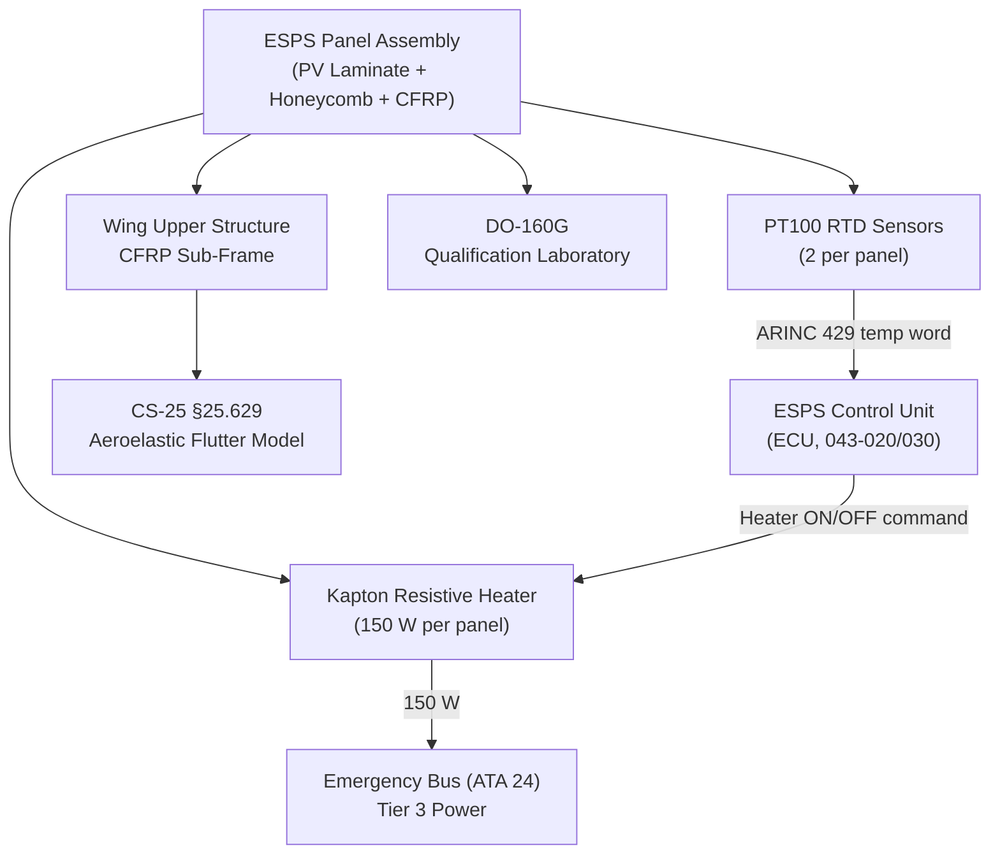
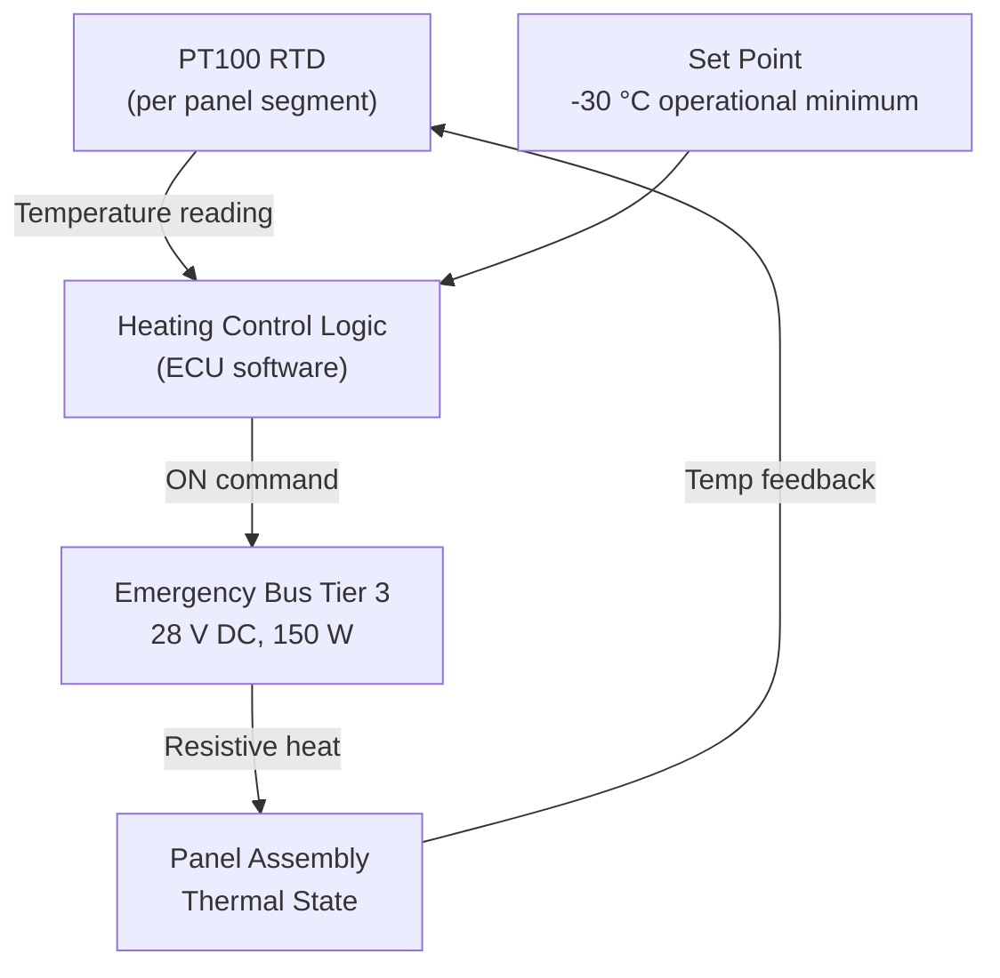
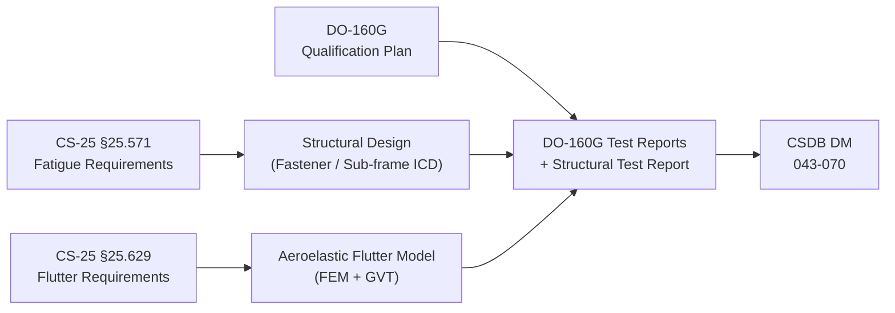

# ATLAS 040-049 · Section 04 · Subsection 043 · 070 — Thermal, Environmental and Structural Interfaces

## 0. Hyperlink Policy

All internal cross-references use relative Markdown links within the Q+ATLANTIDE CSDB repository. External regulatory citations in §19/§20 marked TBD. Parent context: [ATLAS 043 README](./README.md).

---

## 1. Purpose

This document defines the thermal management, environmental qualification, and structural integration requirements for the Emergency Solar Panel System (ESPS) of the AMPEL360E eWTW aircraft. It covers panel operating temperature range, resistive panel heating for icing prevention, DO-160G environmental test categories, aerodynamic drag impact, structural attachment to wing upper surface, and flutter margin analysis per CS-25 §25.629.

Key governance areas:
- Panel thermal management via resistive kapton heating elements.
- DO-160G environmental qualification plan (temperature, humidity, vibration, rain, hail, sand/dust).
- Aerodynamic drag increment analysis for deployed configuration.
- Structural attachment fastener design and fatigue life.
- Flutter analysis per CS-25 §25.629 for deployed panel configuration.

---

## 2. Applicability

| Attribute | Value |
|-----------|-------|
| Aircraft Program | AMPEL360E eWTW |
| ATA Chapter | ATA 43 (ATLAS 043) — Emergency Solar Panel System |
| Certification Basis | CS-25 Amendment 28; CS-25 §25.629; CS-25 §25.571 |
| Applicable Standards | DO-160G; CS-25 §25.629; CS-25 §25.571; CS-25 §25.631 |
| Structural Analysis Standard | CS-25 §25.307 |
| S1000D SNS | 043-070 |

---

## 3. System / Function Overview

The ESPS panels are mounted on the wing upper surface and deploy outward from the wing chord plane. They must withstand the full aircraft environmental envelope: -55 °C to +85 °C operating temperature; rain and hail (DO-160G §26/§23); sand/dust (DO-160G §12); altitude up to FL410 (0.19 atm); random vibration (DO-160G §8 Curve C). Panel construction is a 3 mm aluminium honeycomb substrate with a GaAs triple-junction PV cell laminate on the upper surface and CFRP facesheet on the underside. Kapton resistive heating elements (150 W per panel) prevent ice accumulation and maintain PV cell efficiency above -30 °C. Structural attachment uses 8 × M8 titanium fasteners per panel segment into a CFRP sub-frame bonded and fastened to the wing upper skin. Flutter analysis per CS-25 §25.629 at deployed position confirmed a margin of > 15 % above VD/MD.

---

## 4. Scope

### 4.1 In-Scope

- Panel thermal operating range and kapton heating element specification.
- PT100 RTD temperature sensor architecture and data output.
- DO-160G environmental qualification plan (categories and levels).
- Aerodynamic drag increment analysis (deployed configuration, ΔCd target < 0.002 at cruise Mach).
- Structural attachment Ti fastener design and fatigue life (> 60 000 cycles).
- Flutter analysis per CS-25 §25.629 for deployed panel configuration.
- Ice load shedding via panel heating.
- DO-160G §23 hail strike qualification.

### 4.2 Out-of-Scope

- PV cell electrical performance (see 043-010).
- Deployment actuator structural loads (see 043-020).
- Power conditioning electronics thermal management (see 043-030).
- Position sensor qualification (see 043-060).

---

## 5. Architecture Description

Panel assemblies consist of: (1) 3 mm aluminium honeycomb substrate for stiffness and thermal spreading; (2) GaAs triple-junction PV cell laminate (composite encapsulant, 4 mm cover glass) on the upper surface; (3) CFRP facesheet on the underside; (4) perimeter-mounted kapton resistive heating element; (5) two PT100 RTDs embedded in the laminate. The CFRP sub-frame is secondary bonded and mechanically fastened (M8 Ti fasteners, 8 per panel) to the wing upper skin. The ESPS Control Unit (ECU) monitors PT100 data and controls heating element activation (ON when panel temp < -28 °C). Aerodynamic drag increase at deployed configuration is assessed via CFD analysis at cruise Mach; target ΔCd < 0.002. A flutter analysis per CS-25 §25.629 uses a finite-element aeroelastic model validated by Ground Vibration Test (GVT), confirming a flutter margin > 15 % above VD/MD.

---

## 6. Functional Breakdown

| Function ID | Function | Description | Standard | Notes |
|-------------|----------|-------------|----------|-------|
| F-043-07-01 | Panel Thermal Management | Kapton heating element maintains panel > -30 °C; PT100 RTD sensor feedback controls heating | DO-160G §4 | 150 W per panel segment |
| F-043-07-02 | DO-160G Environmental Qualification | Panel assembly tested to temperature, vibration, rain, hail, and sand/dust categories | DO-160G §4/8/12/23/26 | Full qualification plan required |
| F-043-07-03 | Aerodynamic Assessment | CFD analysis of drag increment at cruise Mach for deployed configuration; ΔCd < 0.002 | CS-25 §25.21 | TBD — CFD report required |
| F-043-07-04 | Structural Attachment | Ti M8 fasteners into CFRP sub-frame; fatigue life > 60 000 deployment cycles | CS-25 §25.571 | Coupon fatigue test required |
| F-043-07-05 | Flutter Analysis | Modal analysis + flutter margin verification ≥ 15 % above VD/MD per CS-25 §25.629 | CS-25 §25.629 | GVT validation required |

---

## 7. Mermaid — System Context Diagram

---

## 8. Mermaid — Internal Functional Architecture

---

## 9. Mermaid — Lifecycle Traceability

---

## 10. Interfaces

| Interface ID | Counterpart | Protocol | Direction | Data |
|-------------|-------------|----------|-----------|------|
| IF-043-07-01 | ECU (ESPS Control Unit) | Analog 4-wire PT100 | Input | Panel temperature (°C) |
| IF-043-07-02 | Emergency Bus (ATA 24) Tier 3 | 28 V DC discrete feed | Input | 150 W heating power per panel |
| IF-043-07-03 | ECU heating command | Discrete ON/OFF | Output | Heating element activation signal |
| IF-043-07-04 | CMC (ATA 45) | ARINC 429 | Output | Panel temperature word for ground monitoring |
| IF-043-07-05 | Wing upper skin sub-frame | Structural (M8 Ti fasteners) | — | Torque spec per fastener |

---

## 11. Operating Modes

| Mode | Name | Description | Entry Condition | Exit Condition |
|------|------|-------------|-----------------|----------------|
| M1 | Heating Active — Cold Soak | Resistive heaters on; panel temperature rising from cold soak | Panel temp < -28 °C | Panel temp > -25 °C |
| M2 | Normal Thermal — Stowed | Panels stowed; no heating active; ambient thermal equilibrium | Panel stowed; temp > -25 °C | Temp drops below -28 °C or emergency deploy |
| M3 | Normal Thermal — Deployed | Panels deployed; solar irradiance provides additional self-heating (~+5 °C increment) | Panels deployed; temp stable | Emergency retract command or fault |
| M4 | High Temp Soak — Auto Retract | Ground soak at +80 °C triggers advisory; > +82 °C triggers auto-retract command | Panel temp > +82 °C (on ground) | Panel temp < +75 °C or aircraft airborne |
| M5 | Hail Strike Advisory | Accelerometer spike on panel frame indicates hail impact; advisory to crew; post-flight inspection required | Panel accelerometer > 50 g (conditional) | Post-flight inspection completed |

---

## 12. Monitoring and Diagnostics

- **PT100 Continuous Monitoring:** Panel temperature sampled at 1 Hz; over-temperature (> +82 °C) or out-of-range fault (< -57 °C) triggers CMC caution "ESPS PANEL TEMP FAULT".
- **Heating Element Health:** Heater current measured; current < 10 % of commanded level for > 5 s triggers open-circuit fault — CMC caution "ESPS HEATER FAULT".
- **Ice Detection (Indirect):** Rapid panel temperature drop combined with power output drop used as indirect ice indicator; triggers automatic heater activation.
- **DO-160G Qualification Monitoring:** Vibration signature measurements taken during laboratory qualification; no continuous in-service structural vibration monitoring required (fatigue managed by inspection intervals).
- **Post-Hail Inspection Trigger:** Panel accelerometer spike event logged to QAR; post-flight inspection task triggered by maintenance system on download.

---

## 13. Maintenance Concept

| Task ID | Task | Interval | Access | Skill Level |
|---------|------|----------|--------|-------------|
| MC-043-07-01 | Panel attachment fastener torque check | A-Check | Wing access panel | Structures Technician |
| MC-043-07-02 | PT100 sensor calibration check | C-Check | ESPS test harness | Avionics Technician |
| MC-043-07-03 | Heating element continuity test | A-Check | GSE; ESPS test mode | Avionics Technician |
| MC-043-07-04 | Post-hail strike visual inspection of panel surface and attachment | On event (conditional) | Wing upper surface | Structures Technician |
| MC-043-07-05 | Sub-frame bond integrity NDT inspection | C-Check | Wing upper skin access panel | NDT Inspector |

---

## 14. S1000D / CSDB Mapping

| DMC | Title | Type | SNS |
|-----|-------|------|-----|
| QATL-A-043-70-00-00AAA-040A-A | Thermal and Structural Interface Architecture Description | AMM | 043-070 |
| QATL-A-043-70-00-00AAA-520A-A | Heating Element Continuity Test | AMM | 043-070 |
| QATL-A-043-70-00-00AAA-720A-A | Panel Attachment Fastener Torque Inspection | AMM | 043-070 |
| QATL-A-043-70-00-00AAA-920A-A | Heater Fault Isolation Procedure | FIM | 043-070 |
| QATL-A-043-70-00-00AAA-300A-A | Sub-Frame NDT Inspection Procedure | SRM | 043-070 |

---

## 15. Footprints

### 15.1 Physical Footprint

| Item | Quantity | Mass (kg each) | Notes |
|------|----------|----------------|-------|
| Kapton heating element | 1 per panel segment | 0.35 | Perimeter-mounted, 150 W |
| PT100 RTD sensor | 2 per panel segment | 0.02 | Embedded in PV laminate |
| CFRP sub-frame | 1 per panel segment | 2.10 | Bonded and fastened to wing skin |
| M8 Ti fasteners | 8 per panel segment | 0.04 | Structural attachment fasteners |

### 15.2 Electrical / Data Footprint

| Parameter | Value |
|-----------|-------|
| Heater power per active panel | 150 W |
| PT100 excitation current | 1 mA |
| ARINC 429 temperature word refresh | 1 Hz |

### 15.3 Maintenance Footprint

| Parameter | Value |
|-----------|-------|
| Fastener torque check duration | < 15 min per panel segment |
| NDT inspection interval | C-Check (approximately 6 years) |
| Heater continuity test duration | < 5 min per panel |

### 15.4 Data Footprint

| Parameter | Value |
|-----------|-------|
| PT100 CMC log entry size | 8 bytes per fault event |
| Temperature monitoring range | -55 °C to +85 °C |
| Temperature measurement accuracy | ± 1 °C |

---

## 16. Safety and Certification

- **CS-25 §25.629 Flutter:** Flutter analysis required for deployed panel configuration; margin ≥ 15 % above VD/MD to be demonstrated by aeroelastic FEM model validated by GVT.
- **CS-25 §25.571 Fatigue:** Panel attachment fatigue life target > 60 000 deployment cycles; demonstrated by coupon fatigue test and structural analysis per Damage Tolerance methodology.
- **CS-25 §25.631 Bird Strike Debris:** Wing leading-edge bird strike (1.8 kg bird at VD) must not result in ESPS panel debris damaging critical structure; panel mounting zone located aft of 15 % chord.
- **DO-160G Qualification:** Panel assembly to be qualified to: temperature §4 Category F2; vibration §8 Curve C; rain §26 Category R; hail §23 Level H; sand/dust §12 Category S.
- **Ice Ingestion Prevention:** Panels retracted automatically during ice accretion conditions (CS-25 §25.1419 icing envelope) to prevent ice shedding onto engine intakes.

---

## 17. Verification and Validation

| V&V ID | Requirement | Method | Evidence | Status |
|--------|-------------|--------|----------|--------|
| VV-043-07-01 | Flutter margin ≥ 15 % above VD/MD (deployed configuration) | Analysis + GVT | Aeroelastic FEM report + GVT test report | TBD |
| VV-043-07-02 | Panel attachment fatigue life > 60 000 deployment cycles | Test | Coupon fatigue test report | TBD |
| VV-043-07-03 | DO-160G §4 Category F2 temperature qualification | Test | DO-160G §4 test report | TBD |
| VV-043-07-04 | DO-160G §26 rain qualification | Test | DO-160G §26 test report | TBD |
| VV-043-07-05 | Panel temperature maintained > -30 °C by heater at -40 °C OAT | Analysis | Thermal model validation report | TBD |
| VV-043-07-06 | Panel debris containment after 1.8 kg bird strike | Analysis | CS-25 §25.631 structural analysis | TBD |
| VV-043-07-07 | ΔCd < 0.002 at cruise Mach (deployed configuration) | Analysis | CFD report | TBD |

---

## 18. Glossary

| Term | Acronym | Definition |
|------|---------|------------|
| Aeroelastic Flutter | — | Dynamic instability of a structure in airflow; must not occur below 1.15 × VD/MD per CS-25 §25.629 |
| Ground Vibration Test | GVT | Modal survey test measuring aircraft structural vibration modes; used to validate the flutter model |
| PT100 | — | Platinum resistance temperature detector with 100 Ω at 0 °C; standard for accurate temperature measurement |
| Kapton Heating Element | — | Flexible resistive heater using polyimide (Kapton) film substrate; thin profile; approximately 150 W/m² |
| CFRP | CFRP | Carbon Fibre Reinforced Polymer; high specific stiffness composite material used for panel sub-frame and facesheet |
| Fatigue Life | — | Number of repeated stress cycles a component can sustain before crack initiation; target > 60 000 deployment cycles |
| VD / MD | — | Design dive speed and Mach number; maximum structural speed per CS-25 §25.335 |
| Hail Strike Qualification | DO-160G §23 | Environmental test simulating hail impact on installed aircraft equipment at defined impact energies |
| Non-Destructive Testing | NDT | Inspection technique detecting sub-surface defects without damaging the component (e.g. ultrasound, thermography) |
| Bird Strike | CS-25 §25.631 | Structural requirement that surfaces withstand specified bird impact; ESPS zone analysis uses 1.8 kg bird |

---

## 19. Citations

| Ref ID | Standard | Applicability | Status |
|--------|----------|---------------|--------|
| CIT-043-07-01 | EASA CS-25 §25.629, Flutter | Flutter margin requirement for deployed panel configuration | TBD |
| CIT-043-07-02 | EASA CS-25 §25.571, Damage Tolerance and Fatigue Evaluation | Panel attachment fatigue life requirement | TBD |
| CIT-043-07-03 | RTCA DO-160G §4/8/23/26, Environmental Conditions and Test Procedures | Panel DO-160G environmental qualification | TBD |
| CIT-043-07-04 | EASA CS-25 §25.631, Bird Strike | Structural debris containment analysis requirement | TBD |
| CIT-043-07-05 | EASA CS-25 §25.1419, Ice Protection | Ice ingestion prevention requirement (auto-retract in icing conditions) | TBD |
| CIT-043-07-06 | IEC 61215, Terrestrial PV Modules — Design Qualification | GaAs cell module qualification basis (adapted for aviation) | TBD |

---

## 20. References

| Ref ID | Document | Version | Status |
|--------|----------|---------|--------|
| REF-043-07-01 | ESPS General (043-000) | 1.0 | TBD |
| REF-043-07-02 | ESPS Panel Arrays (043-010) | 1.0 | TBD |
| REF-043-07-03 | AMPEL360E Flutter Analysis Report | TBD | TBD |
| REF-043-07-04 | AMPEL360E Structural Loads Report | TBD | TBD |
| REF-043-07-05 | AMPEL360E Wing Structural Design Data Package | TBD | TBD |

---

## 21. Open Issues

| Issue ID | Description | Owner | Status |
|----------|-------------|-------|--------|
| OI-043-07-01 | CFD aerodynamic drag analysis for deployed panel configuration to be completed | Q-AIR | TBD |
| OI-043-07-02 | Panel sub-frame bond qualification plan to be agreed with structures team | Q-MECHANICS | TBD |
| OI-043-07-03 | DO-160G §23 hail qualification level (H1 vs H2) to be confirmed based on hail hazard analysis | Q-GREENTECH | TBD |

---

## 22. Change Log

| Version | Date | Author | Description | Status |
|---------|------|--------|-------------|--------|
| 1.0.0 | 2026-05-10 | Q-GREENTECH | Initial baseline release | TBD |
