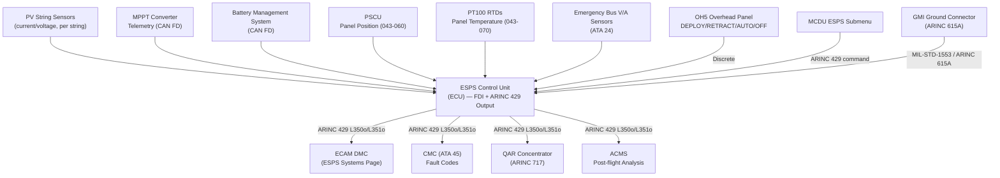
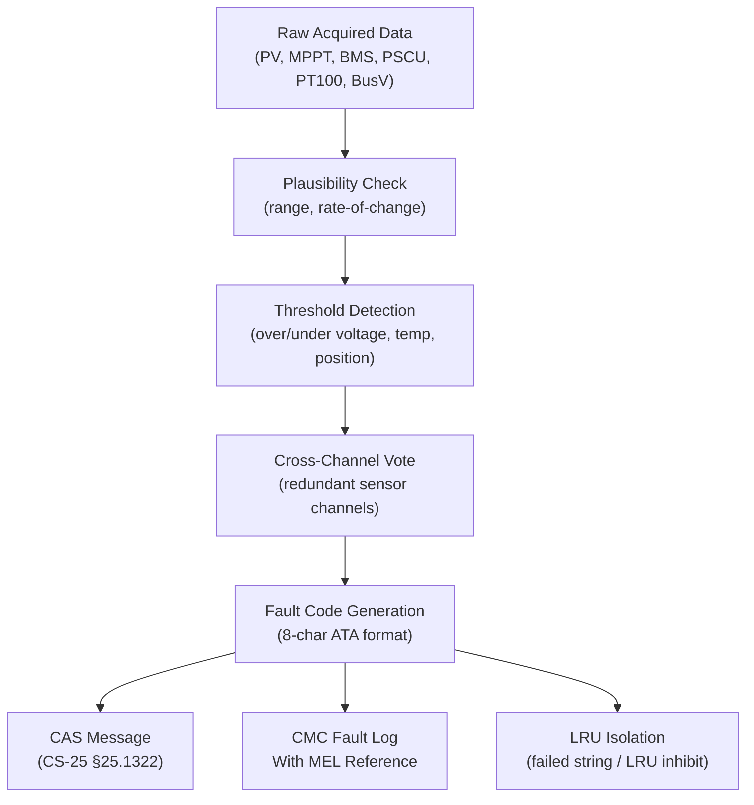
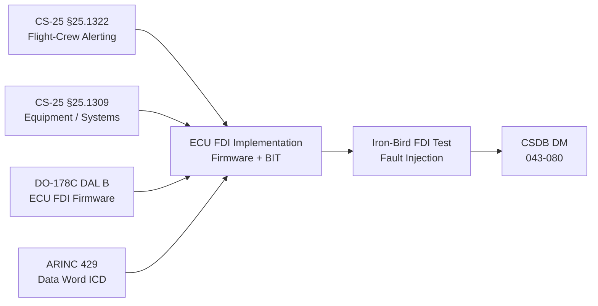

# ATLAS 040-049 · Section 04 · Subsection 043 · 080 — Emergency Solar Panel Monitoring, Diagnostics and Control Interfaces

## 0. Hyperlink Policy

All internal cross-references use relative Markdown links within the Q+ATLANTIDE CSDB repository. External regulatory citations in §19/§20 marked TBD. Parent context: [ATLAS 043 README](./README.md).

---

## 1. Purpose

This document defines the monitoring, diagnostics, and control interface architecture for the Emergency Solar Panel System (ESPS) of the AMPEL360E eWTW aircraft. It provides a consolidated view of all data flows between the ESPS Control Unit (ECU), aircraft data networks, cockpit displays, Central Maintenance Computer (CMC), and airborne/ground monitoring systems.

Key governance areas:
- ESPS ECU monitoring parameter set and ARINC 429 data word catalogue.
- Fault detection and isolation (FDI) strategy for ESPS subsystems (PV array, MPPT, battery, actuators, sensors).
- ECAM/EICAS display integration and ESPS Systems page definition.
- CMC fault code catalogue and bite reporting.
- QAR/ACMS parameter recording for post-flight analysis.
- Cockpit control interface (crew-initiated deployment/retraction, mode selection).

---

## 2. Applicability

| Attribute | Value |
|-----------|-------|
| Aircraft Program | AMPEL360E eWTW |
| ATA Chapter | ATA 43 (ATLAS 043) — Emergency Solar Panel System |
| Certification Basis | CS-25 Amendment 28; CS-25 §25.1322; CS-25 §25.1309 |
| Applicable Standards | DO-178C DAL B; ARP4754B; ARINC 429; ARINC 717 |
| Design Assurance Level | ECU FDI software: DAL B |
| S1000D SNS | 043-080 |

---

## 3. System / Function Overview

The ESPS ECU is the central monitoring and control node for all ESPS subsystems. It acquires health and status data from: PV array current/voltage sensors (per string), MPPT converter telemetry, battery management system (BMS), deployment actuator position sensors (PSCU), thermal sensors (PT100 RTDs), and emergency bus voltage/current sensors. The ECU processes all acquired data, runs FDI algorithms, generates ARINC 429 health words for distribution to ECAM DMC, CMC, QAR, and ACMS, and presents a consolidated ESPS Systems page on ECAM. The crew controls ESPS via the ESPS Control Panel (overhead panel OH5) — issuing deploy, retract, and mode commands via discrete switches and a multifunction control and display unit (MCDU) ESPS submenu.

---

## 4. Scope

### 4.1 In-Scope

- ESPS ECU monitoring parameter set (PV array, MPPT, battery, actuators, temperature, bus voltage).
- ARINC 429 data word catalogue (labels, refresh rates, content).
- FDI algorithm architecture for ESPS subsystems.
- ECAM/EICAS ESPS Systems page display definition.
- CMC fault code catalogue and bite test reporting.
- QAR/ACMS parameter recording.
- Crew control interface (overhead panel switches and MCDU ESPS submenu).
- Ground Maintenance Interface (GMI) GSE connector for ground testing.

### 4.2 Out-of-Scope

- PV array electrical design (see 043-010).
- MPPT internal power electronics (see 043-030).
- Emergency load prioritization logic (see 043-050).
- Panel position indication circuit detail (see 043-060).
- Structural attachment (see 043-070).

---

## 5. Architecture Description

The ECU receives health data over a dedicated CAN FD bus from the MPPT converter, BMS, and actuator drivers, and over 4-wire analog/ARINC 628 from the PT100 RTDs and PSCU. The ECU processes FDI logic (DO-178C DAL B) and outputs two ARINC 429 words: a health word (label 350o) and a power generation word (label 351o) at 100 ms refresh rate, distributed to ECAM DMC, CMC, QAR concentrator, and ACMS. The crew control interface uses conventional discrete switches on overhead panel OH5 (DEPLOY / RETRACT / AUTO / OFF) and an MCDU ESPS submenu for mode selection and status review. The GMI provides a MIL-STD-1553 or ARINC 615A GSE interface for ground BIT, software loading, and fault log download.

---

## 6. Functional Breakdown

| Function ID | Function | Description | DAL | Standard |
|-------------|----------|-------------|-----|----------|
| F-043-08-01 | Monitoring Data Acquisition | Acquire PV string current/voltage, MPPT telemetry, BMS state-of-charge, actuator position, PT100 temperature, bus voltage | B | ARP4754B |
| F-043-08-02 | FDI — Fault Detection and Isolation | Run FDI algorithms on acquired data; isolate failed LRU/string; generate CMC fault code | B | DO-178C |
| F-043-08-03 | ARINC 429 Health Word Output | Transmit health word L350o and power generation word L351o at 100 ms to ECAM DMC, CMC, QAR, ACMS | B | ARINC 429 |
| F-043-08-04 | ECAM Systems Page — ESPS | Provide data for rendering ESPS Systems page on ECAM (panel state, power output, SOC, fault flags) | C | CS-25 §25.1322 |
| F-043-08-05 | CMC Fault Reporting | Report ESPS fault codes (8-character ATA-standard format) to CMC for MEL applicability and maintenance actions | C | ARP4754B |
| F-043-08-06 | QAR / ACMS Recording | Record ESPS monitoring parameters to QAR at 1 Hz for ACMS post-flight analysis | D | ARINC 717 |
| F-043-08-07 | Crew Control Interface | Accept deploy/retract/auto/off commands from OH5 overhead panel and MCDU ESPS submenu | B | CS-25 §25.1329 |
| F-043-08-08 | Ground Maintenance Interface | Provide GMI connector for ground BIT, software loading, and fault log download | — | ARINC 615A |

---

## 7. Mermaid — System Context Diagram

---

## 8. Mermaid — FDI Functional Architecture

---

## 9. Mermaid — Lifecycle Traceability

---

## 10. Interfaces

| Interface ID | Counterpart | Protocol | Direction | Refresh / Data |
|-------------|-------------|----------|-----------|----------------|
| IF-043-08-01 | PV string sensors | Analog (0-10 V) | Input | 100 ms per string |
| IF-043-08-02 | MPPT converter (043-030) | CAN FD 1 Mbit/s | Input | 200 ms MPPT telemetry |
| IF-043-08-03 | BMS (043-040) | CAN FD 1 Mbit/s | Input | 200 ms SOC / cell voltage |
| IF-043-08-04 | PSCU (043-060) | ARINC 429 L272o | Input | 100 ms panel position |
| IF-043-08-05 | PT100 RTDs (043-070) | 4-wire analog | Input | 1 Hz temperature |
| IF-043-08-06 | ECAM DMC (ATA 31) | ARINC 429 L350o | Output | 100 ms health word |
| IF-043-08-07 | CMC (ATA 45) | ARINC 429 L350o | Output | 100 ms + CMC fault report |
| IF-043-08-08 | QAR Concentrator (ARINC 717) | ARINC 429 | Output | 1 Hz parameter set |
| IF-043-08-09 | OH5 Overhead Panel | 28 V discrete | Input | DEPLOY/RETRACT/AUTO/OFF commands |
| IF-043-08-10 | MCDU ESPS submenu | ARINC 429 | Input | Mode commands |
| IF-043-08-11 | GMI ground connector | ARINC 615A | Bidirectional | Ground BIT / software load / fault log |

---

## 11. Operating Modes

| Mode | Name | Description | Entry Condition | Exit Condition |
|------|------|-------------|-----------------|----------------|
| M1 | OFF | ECU powered down; no monitoring active; panels stowed | Aircraft parked; ESPS circuit breaker open | CB closed; power restored |
| M2 | Standby | ECU powered; continuous background monitoring; panels stowed | Normal flight; generators online | Generator loss event or crew AUTO selection |
| M3 | Auto-Deploy Monitoring | ECU issues deploy command; monitors deployment and transitions to generation monitoring | Generator loss + auto-deploy condition met | Panels DEPLOYED confirmed |
| M4 | Generation Monitoring | Full monitoring active; PV, MPPT, BMS, bus health reported; ECAM ESPS page active | Panels deployed; generating | Retract command or generator restored |
| M5 | Degraded — Partial | One or more PV strings isolated; reduced generation monitoring; CMC fault active | String/LRU fault detected by FDI | Fault cleared or maintenance action |
| M6 | Ground Maintenance | GMI interface active; full BIT; parameter download; software loading | GMI connector connected; aircraft on ground | GMI disconnected |

---

## 12. Monitoring and Diagnostics

**ESPS ECU ARINC 429 Word Catalogue:**

| Label (Octal) | Parameter | Refresh | Notes |
|---------------|-----------|---------|-------|
| L350o | ESPS Health Word | 100 ms | Bit-encoded fault flags for all ESPS subsystems |
| L351o | ESPS Power Generation Word | 100 ms | Total PV array output (W, 0–15 000 W) |
| L272o | Panel Position (from PSCU) | 100 ms | Re-broadcast by ECU on main ARINC 429 bus |

**CMC Fault Code Examples:**

| Fault Code | Description | MEL Category |
|------------|-------------|--------------|
| 043-001 | PV String 1 — Open Circuit | TBD |
| 043-010 | MPPT Converter Fault | TBD |
| 043-020 | BMS — Cell Undervoltage | TBD |
| 043-030 | Panel Position Sensor Fault | TBD |
| 043-040 | Heating Element Open Circuit | TBD |

**BIT Coverage:**
- PUBIT: Full LRU self-test at power-on; all input channels, ARINC 429 TX/RX, CAN FD bus, FDI logic integrity. Target duration < 60 s.
- CBIT: 1 Hz continuous; plausibility, threshold, and cross-channel checks.

---

## 13. Maintenance Concept

| Task ID | Task | Interval | Access | Skill Level |
|---------|------|----------|--------|-------------|
| MC-043-08-01 | ECU PUBIT pass verification at power-on | A-Check | CMC ground terminal | Avionics Technician |
| MC-043-08-02 | Full ground BIT via GMI connector | C-Check | GMI GSE laptop | Avionics Engineer |
| MC-043-08-03 | ARINC 429 L350o/L351o signal verification | C-Check | Bus analyser on ARINC 429 | Avionics Technician |
| MC-043-08-04 | CMC fault log download and review | A-Check | CMC ground terminal | Avionics Technician |
| MC-043-08-05 | QAR ESPS parameter data download | A-Check | QAR download GSE | Avionics Technician |
| MC-043-08-06 | ECU software version verification | C-Check | GMI software loading tool | Software Engineer |

---

## 14. S1000D / CSDB Mapping

| DMC | Title | Type | SNS |
|-----|-------|------|-----|
| QATL-A-043-80-00-00AAA-040A-A | ESPS Monitoring and Control Interface Architecture | AMM | 043-080 |
| QATL-A-043-80-00-00AAA-520A-A | ECU PUBIT and CBIT Functional Test | AMM | 043-080 |
| QATL-A-043-80-00-00AAA-720A-A | ECU Replacement and Software Loading | AMM | 043-080 |
| QATL-A-043-80-00-00AAA-920A-A | ESPS FDI Fault Isolation Procedure | FIM | 043-080 |
| QATL-A-043-80-00-00AAA-941A-A | ECU and GMI Illustrated Parts | IPD | 043-080 |

---

## 15. Footprints

### 15.1 Physical Footprint

| Item | Quantity | Mass (kg each) | Location |
|------|----------|----------------|----------|
| ESPS Control Unit (ECU) | 1 | 1.80 | Avionics bay E1 |
| GMI connector (panel-mounted) | 1 | 0.12 | Avionics bay access panel |

### 15.2 Electrical / Data Footprint

| Parameter | Value |
|-----------|-------|
| ECU power consumption | 35 W nominal |
| ARINC 429 TX buses | 2 (L350o/L351o broadcast) |
| ARINC 429 RX buses | 2 (PSCU position, MCDU command) |
| CAN FD buses | 2 (MPPT + BMS) |

### 15.3 Maintenance Footprint

| Parameter | Value |
|-----------|-------|
| PUBIT duration | < 60 s |
| Full ground BIT (GMI) duration | TBD (target < 30 min) |
| MTBUR ECU | TBD (target > 20 000 FH) |

### 15.4 Data Footprint

| Parameter | Value |
|-----------|-------|
| ARINC 429 L350o health word | 32 bits, 100 ms refresh |
| CMC fault log entry size | 16 bytes per event |
| QAR ESPS parameter set | 12 parameters, 1 Hz, 8 bytes/parameter |

---

## 16. Safety and Certification

- **CS-25 §25.1309:** Complete loss of ESPS monitoring (ECU failure) is an inconvenience/No Safety Effect when panels are stowed; classified Minor when panels are deployed (advisory only; physical panel state unchanged). Failure probability target for complete ECU loss < 10⁻³/FH (Minor).
- **DAL B FDI Firmware:** Incorrect FDI output generating a false positive deploy command in a non-emergency is a Hazardous failure condition; DO-178C DAL B required for the FDI and command-generation software modules.
- **CS-25 §25.1322:** CAS messages generated by the ECU are classified to §25.1322 flight-crew alerting colour conventions; all messages verified against EASA AMC 25.1322.
- **Dual-Channel ARINC 429:** Health words transmitted on two independent ARINC 429 buses to ECAM DMC and CMC; single-bus failure does not suppress monitoring output.

---

## 17. Verification and Validation

| V&V ID | Requirement | Method | Evidence | Status |
|--------|-------------|--------|----------|--------|
| VV-043-08-01 | FDI correctly detects and isolates failed PV string (fault injection test) | Test | Iron-bird fault injection report | TBD |
| VV-043-08-02 | ARINC 429 L350o/L351o transmitted within 100 ms of parameter update | Test | Bus analyser timing measurement | TBD |
| VV-043-08-03 | ECAM ESPS Systems page renders correctly for all operating modes | Test | ECAM display simulation test | TBD |
| VV-043-08-04 | CMC fault code catalogue verified against ATA fault code standard | Inspection | CMC fault code review record | TBD |
| VV-043-08-05 | PUBIT completes within 60 s; CBIT maintains 1 Hz update | Test | Timed BIT execution on bench test | TBD |
| VV-043-08-06 | DO-178C DAL B evidence complete for FDI software modules | Inspection | DO-178C lifecycle records | TBD |
| VV-043-08-07 | CAS messages comply with CS-25 §25.1322 classification scheme | Analysis | EASA AMC 25.1322 compliance matrix | TBD |

---

## 18. Glossary

| Term | Acronym | Definition |
|------|---------|------------|
| ESPS Control Unit | ECU | Central ESPS LRU performing monitoring, FDI, ARINC 429 output, crew command processing |
| Fault Detection and Isolation | FDI | Software algorithm set that detects parameter anomalies and identifies (isolates) the faulty source |
| Health Word | — | ARINC 429 word containing bit-encoded fault flags representing the health state of each ESPS subsystem |
| Ground Maintenance Interface | GMI | Panel-mounted connector providing external bus access for ground BIT, software loading, and fault log download |
| MCDU ESPS Submenu | — | Software page within the Multifunction Control and Display Unit (MCDU) for ESPS mode selection and status review |
| Power-Up Built-In Test | PUBIT | Self-test executed at system initialisation to verify hardware and software integrity before entering operational mode |
| Continuous Built-In Test | CBIT | BIT running at 1 Hz throughout system operation to detect intermittent and latent faults |
| CAN FD | — | Controller Area Network Flexible Data-rate; 1 Mbit/s bus used for ECU to MPPT and BMS interface |
| State of Charge | SOC | Battery energy remaining as a percentage of full capacity; key health parameter monitored by BMS |
| Minimum Equipment List | MEL | Operator document specifying which equipment may be inoperative for dispatch; CMC fault codes are linked to MEL items |

---

## 19. Citations

| Ref ID | Standard | Applicability | Status |
|--------|----------|---------------|--------|
| CIT-043-08-01 | EASA CS-25 §25.1322, Flight-Crew Alerting | CAS message classification requirement | TBD |
| CIT-043-08-02 | EASA CS-25 §25.1309, Equipment, Systems and Installations | ECU failure probability classification | TBD |
| CIT-043-08-03 | RTCA DO-178C, Software Considerations in Airborne Systems | FDI software DAL B development | TBD |
| CIT-043-08-04 | SAE ARP4754B, Guidelines for Development of Civil Aircraft and Systems | ECU DAL B allocation | TBD |
| CIT-043-08-05 | ARINC 429, Part 1, Mark 33 | ARINC 429 health and power word definitions | TBD |
| CIT-043-08-06 | ARINC 717, Flight Recorder System | QAR parameter recording specification | TBD |
| CIT-043-08-07 | ARINC 615A, Software Data Loader | GMI software loading protocol | TBD |

---

## 20. References

| Ref ID | Document | Version | Status |
|--------|----------|---------|--------|
| REF-043-08-01 | ESPS General (043-000) | 1.0 | TBD |
| REF-043-08-02 | AMPEL360E ESPS ECU Interface Control Document (ICD) | TBD | TBD |
| REF-043-08-03 | AMPEL360E CAS Message Catalogue | TBD | TBD |
| REF-043-08-04 | AMPEL360E CMC Fault Code Catalogue | TBD | TBD |
| REF-043-08-05 | AMPEL360E ARINC 429 Bus Allocation Register | TBD | TBD |

---

## 21. Open Issues

| Issue ID | Description | Owner | Status |
|----------|-------------|-------|--------|
| OI-043-08-01 | CAN FD vs ARINC 825 bus selection for MPPT/BMS interface to be finalised | Q-DATAGOV | TBD |
| OI-043-08-02 | ECAM ESPS Systems page display format to be agreed with Flight Deck Human Factors team | Q-AIR | TBD |
| OI-043-08-03 | QAR ESPS parameter set (12 parameters confirmed; label assignments pending ARINC 717 word allocation) | Q-DATAGOV | TBD |

---

## 22. Change Log

| Version | Date | Author | Description | Status |
|---------|------|--------|-------------|--------|
| 1.0.0 | 2026-05-10 | Q+ Team/Amedeo Pelliccia + AI | Initial baseline release | TBD |
