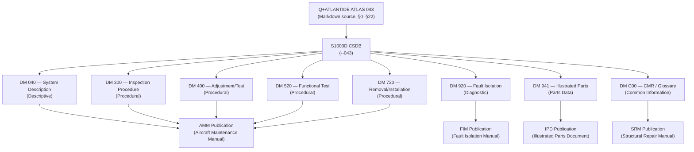
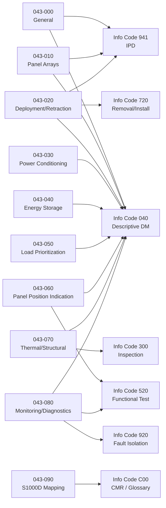
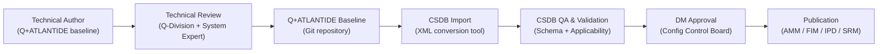

# ATLAS 040-049 · Section 04 · Subsection 043 · 090 — S1000D CSDB Mapping and Traceability

## 0. Hyperlink Policy

All internal cross-references use relative Markdown links within the Q+ATLANTIDE CSDB repository. External regulatory citations in §19/§20 marked TBD. Parent context: [ATLAS 043 README](./README.md).

---

## 1. Purpose

This document provides the complete S1000D Data Module Requirements List (DMRL) for the Emergency Solar Panel System (ESPS), ATA chapter 043, and establishes bidirectional traceability between Q+ATLANTIDE subsubject files (043-000 through 043-090) and the corresponding S1000D Data Modules (DMs) in the CSDB. It defines the Data Module Code (DMC) schema, information code allocation, CSDB project metadata, and the preferred authoring/publication workflow.

Key governance areas:
- DMC naming convention for ATLAS 043 ESPS.
- DMRL (10 subsubject files × recommended DM set).
- Information code set (040, 300, 400, 520, 720, 941, 920, C00).
- CSDB project parameters (Applicability, Schema version, Language).
- Traceability matrix from Q+ATLANTIDE subsubject files to CSDB DMs.
- ESPS publication/delivery output types (AMM, FIM, IPD, SRM, OMI).

---

## 2. Applicability

| Attribute | Value |
|-----------|-------|
| Programme | (defined in programme implementation branch) |
| ATA Chapter | ATA 43 (ATLAS 043) — Emergency Solar Panel System |
| S1000D Issue | Issue 5.0 (target) / Issue 4.2 (fallback) |
| CSDB Platform | TBD (Airbus-class CSDB or equivalent) |
| XML Schema | S1000D Issue 5.0 Descriptive / Procedural / IPD schemas |
| SNS Range | 043-000 through 043-090 |

---

## 3. System / Function Overview

The S1000D CSDB for ESPS (ATA 043) is organised under the programme project code (`<MODEL>`), work package code (`<PROGRAMME-SHORT>`), and system code `043`. Each DM within the CSDB is identified by a unique DMC structured as:

```
DMC-<MODEL>-<SYSTEMDIFF>-043-{SNS}-00-{variant}-{info-code}-{issue}-{language}
```

For example:
```
DMC-<MODEL>-<SYSTEMDIFF>-043-00-00-00AAA-040A-A_en-US
```

The DMRL maps each Q+ATLANTIDE subsubject file to the recommended set of DMs covering system description (040), procedural (300/400/520/720), illustrated parts (941), fault isolation (920), and common information (C00). The Q+ATLANTIDE CSDB repository itself serves as the baseline for all DM content prior to CSDB authoring tool migration.

---

## 4. Scope

### 4.1 In-Scope

- DMC naming convention for ESPS (043) DMs.
- DMRL for all 10 ESPS subsubjects (043-000 through 043-090).
- Information code catalogue for ESPS.
- Traceability matrix: Q+ATLANTIDE subsubject file → S1000D DM.
- CSDB project applicability definition.
- Publication output types and delivery formats.

### 4.2 Out-of-Scope

- S1000D XML authoring of individual DMs (each DM has its own stub file in the CSDB).
- Illustrated Parts Data (IPD) part number data entry (managed by parts catalogue team).
- Wiring data modules (ATA 20 domain).

---

## 5. Architecture Description

The Q+ATLANTIDE ATLAS 043 documentation layer (this repository) is the pre-CSDB baseline. Each Markdown subsubject file contains the full technical content in §0–§22 template format. On migration to the S1000D CSDB:

1. **Section §3–§6** (overview, scope, architecture, functional breakdown) → Descriptive DM (info code 040).
2. **Section §10** (interfaces) → System Description DM (info code 040) + referenced Wiring DM (ATA 20).
3. **Section §12** (monitoring/diagnostics) → Procedural DM for testing (info code 520).
4. **Section §13** (maintenance) → Procedural DM (info codes 300/400/720).
5. **Section §14** (S1000D/CSDB mapping) → This document (043-090).
6. **Section §16** (safety/certification) → Certification Maintenance Requirement (CMR) DM (info code C00).
7. **Section §18** (glossary) → Shared Glossary DM (project-level, common info code C00).
8. **Section §19** (citations) → References DM (info code 00R, project level).
9. **Illustrated parts** → IPD DM (info code 941) sourced from parts catalogue.
10. **Fault isolation** → FIM DM (info code 920) based on §12 fault tree.

---

## 6. Functional Breakdown

| SNS | Subsubject | Q+ATLANTIDE Source File | Primary DM Info Code | Status |
|-----|-----------|------------------------|---------------------|--------|
| 043-000 | General | 043-000-Emergency-Solar-Panel-System-General.md | 040 (Description) | TBD |
| 043-010 | Panel Arrays | 043-010-Emergency-Solar-Panel-Arrays.md | 040 (Description) | TBD |
| 043-020 | Deployment and Retraction | 043-020-Deployment-and-Retraction-Mechanisms.md | 040/720 (Removal/Install) | TBD |
| 043-030 | Power Conditioning | 043-030-Power-Conditioning-and-Regulation.md | 040 (Description) | TBD |
| 043-040 | Energy Storage Interface | 043-040-Emergency-Energy-Storage-Interface.md | 040 (Description) | TBD |
| 043-050 | Load Prioritization | 043-050-Emergency-Load-Prioritization-and-Distribution.md | 040 (Description) | TBD |
| 043-060 | Panel Position Indication | 043-060-Panel-Position-Indication-and-Warning.md | 040/520 (Test) | TBD |
| 043-070 | Thermal/Structural Interfaces | 043-070-Thermal-Environmental-and-Structural-Interfaces.md | 040/300 (Inspection) | TBD |
| 043-080 | Monitoring/Diagnostics | 043-080-Emergency-Solar-Panel-Monitoring-Diagnostics-and-Control-Interfaces.md | 040/520/920 (Test/FIM) | TBD |
| 043-090 | S1000D CSDB Mapping | 043-090-S1000D-CSDB-Mapping-and-Traceability.md | C00 (Common Info) | TBD |

---

## 7. Mermaid — S1000D Publication Architecture



---

## 8. Mermaid — DMRL Traceability (043 Subsubjects → DMs)



---

## 9. Mermaid — CSDB Authoring Workflow



---

## 10. Interfaces

| Interface ID | Counterpart | Protocol/Tool | Direction | Notes |
|-------------|-------------|---------------|-----------|-------|
| IF-043-09-01 | Q+ATLANTIDE Git CSDB | Git (Markdown) | Bidirectional | Baseline content management |
| IF-043-09-02 | S1000D CSDB authoring tool | XML via import | Output | Markdown-to-XML conversion tool (TBD) |
| IF-043-09-03 | ESPS subsubject files 043-000 to 043-080 | Internal links | Input | Source content for DM authoring |
| IF-043-09-04 | Parts catalogue system | IPD data feed | Input | Part numbers for DM 941 |
| IF-043-09-05 | CMR database | CMR data feed | Input | Certification maintenance requirements for DM C00 |
| IF-043-09-06 | Publication build system | XML → PDF/HTML/IETP | Output | Publication rendering |

---

## 11. Operating Modes

| Mode | Name | Description |
|------|------|-------------|
| M1 | Baseline Authoring | Technical authors work in Q+ATLANTIDE Markdown CSDB under Git version control |
| M2 | CSDB Migration | Content migrated from Markdown to S1000D XML in CSDB tool; DM stubs populated |
| M3 | Review and Approval | DMs reviewed by system experts and approved by Config Control Board |
| M4 | Publication | Approved DMs published to AMM, FIM, IPD, SRM outputs (PDF, HTML, IETP) |

---

## 12. Monitoring and Diagnostics

- **DMRL Completeness Check:** Q-DATAGOV maintains a completeness tracker comparing expected DMRL entries (per §6 table) against actual CSDB DM creation status; gap reports generated monthly.
- **Traceability Matrix Audit:** Quarterly audit of traceability matrix to verify every Q+ATLANTIDE subsubject file has a corresponding DM stub in the CSDB and no orphaned DMs exist.
- **Schema Validation:** All DMs validated against S1000D Issue 5.0 XML schemas prior to publication; validation failures reported to authoring team.
- **Applicability Cross-Check:** CSDB applicability model (product tree for <PROGRAMME>) checked against ESPS hardware configuration at each build standard release.

---

## 13. Maintenance Concept

| Task ID | Task | Interval | Owner |
|---------|------|----------|-------|
| MC-043-09-01 | DMRL completeness review | Monthly | Q-DATAGOV |
| MC-043-09-02 | Traceability matrix audit | Quarterly | Q-DATAGOV |
| MC-043-09-03 | CSDB schema validation sweep | Per publication cycle | Q-DATAGOV |
| MC-043-09-04 | Update subsubject files for approved design changes | Per ECR/ECO | Q-GREENTECH |

---

## 14. S1000D / CSDB Mapping — DMRL

### 14.1 Complete DMRL for ESPS ATA 043

| DMC | Title | Info Code | Publication |
|-----|-------|-----------|-------------|
| QATL-A-043-00-00-00AAA-040A-A | ESPS System Description — General | 040 | AMM |
| QATL-A-043-00-00-00AAA-941A-A | ESPS General Illustrated Parts | 941 | IPD |
| QATL-A-043-00-00-00AAA-C00A-A | ESPS Glossary and Common Information | C00 | AMM/FIM |
| QATL-A-043-10-00-00AAA-040A-A | ESPS Panel Arrays — System Description | 040 | AMM |
| QATL-A-043-10-00-00AAA-941A-A | ESPS Panel Arrays — Illustrated Parts | 941 | IPD |
| QATL-A-043-20-00-00AAA-040A-A | ESPS Deployment/Retraction — System Description | 040 | AMM |
| QATL-A-043-20-00-00AAA-720A-A | ESPS Deployment Actuator Removal/Installation | 720 | AMM |
| QATL-A-043-20-00-00AAA-941A-A | ESPS Deployment Actuator Illustrated Parts | 941 | IPD |
| QATL-A-043-30-00-00AAA-040A-A | ESPS Power Conditioning — System Description | 040 | AMM |
| QATL-A-043-40-00-00AAA-040A-A | ESPS Energy Storage Interface — System Description | 040 | AMM |
| QATL-A-043-50-00-00AAA-040A-A | ESPS Load Prioritization — System Description | 040 | AMM |
| QATL-A-043-60-00-00AAA-040A-A | ESPS Panel Position Indication — System Description | 040 | AMM |
| QATL-A-043-60-00-00AAA-520A-A | ESPS PSCU Functional Test | 520 | AMM |
| QATL-A-043-70-00-00AAA-040A-A | ESPS Thermal/Structural Interfaces — System Description | 040 | AMM |
| QATL-A-043-70-00-00AAA-300A-A | ESPS Panel Attachment Inspection | 300 | AMM |
| QATL-A-043-80-00-00AAA-040A-A | ESPS Monitoring/Diagnostics — System Description | 040 | AMM |
| QATL-A-043-80-00-00AAA-520A-A | ESPS ECU PUBIT/CBIT Functional Test | 520 | AMM |
| QATL-A-043-80-00-00AAA-920A-A | ESPS Fault Isolation Procedure | 920 | FIM |
| QATL-A-043-80-00-00AAA-941A-A | ESPS ECU Illustrated Parts | 941 | IPD |

---

## 15. Footprints

### 15.1 Physical Footprint

No physical components — this is a data governance document.

### 15.2 Data Footprint

| Parameter | Value |
|-----------|-------|
| Total DMs in ESPS DMRL | 19 (see §14.1) |
| Q+ATLANTIDE subsubject files | 10 (043-000 through 043-090) |
| Target S1000D issue | 5.0 |
| Primary CSDB language | en-US |

### 15.3 Maintenance Footprint

| Parameter | Value |
|-----------|-------|
| DMRL review cycle | Monthly |
| Traceability audit cycle | Quarterly |
| Q+ATLANTIDE baseline update lead time | Per ECR/ECO |

### 15.4 Governance Footprint

| Parameter | Value |
|-----------|-------|
| Responsible Q-Division | Q-DATAGOV |
| Configuration authority | Q+ATLANTIDE Config Control Board |
| Applicable spec | Q+ATLANTIDE CSDB Governance Framework v1.0 |

---

## 16. Safety and Certification

- **Data Integrity:** CSDB traceability matrix ensures no safety-critical maintenance procedures are omitted from the AMM/FIM publication set. Gaps in DM coverage are treated as airworthiness-relevant data deficiencies.
- **CS-25 §25.1581 (AFM/Approved Materials):** Aircraft Flight Manual references and approved maintenance data must be traceable to certificated design data; this DMRL provides the traceability chain from Q+ATLANTIDE engineering baseline to CSDB publication.
- **Regulatory Evidence:** Traceability matrix audited at each Type Certificate review as evidence of documentation completeness for ATA 043 ESPS.

---

## 17. Verification and Validation

| V&V ID | Requirement | Method | Evidence | Status |
|--------|-------------|--------|----------|--------|
| VV-043-09-01 | All ESPS subsubject files (043-000 to 043-090) have ≥1 corresponding CSDB DM stub | Inspection | DMRL completeness check report | TBD |
| VV-043-09-02 | All CSDB DMs validated against S1000D Issue 5.0 XML schema | Inspection | Schema validation log | TBD |
| VV-043-09-03 | No orphaned CSDB DMs (DMs with no Q+ATLANTIDE source traceability) | Inspection | Traceability audit report | TBD |
| VV-043-09-04 | DMRL approved by Q+ATLANTIDE Config Control Board | Approval | CCB meeting record | TBD |

---

## 18. Glossary

| Term | Acronym | Definition |
|------|---------|------------|
| Data Module | DM | The smallest self-contained unit of technical information in S1000D; analogous to a document section |
| Data Module Code | DMC | Unique 17-field identifier for an S1000D data module, encoding project, system, SNS, info code, and variant |
| Data Module Requirements List | DMRL | Master list of all DMs required for a project or system, used to track authoring completeness |
| Information Code | — | The field in the DMC specifying the type of information: 040 = description, 520 = test, 720 = removal, 941 = parts, 920 = FIM, C00 = common |
| Common Source Data Base | CSDB | The structured database/repository storing all S1000D data modules and their associated metadata |
| System/Subsystem/Subject Breakdown | SNS | The numeric code structure organising CSDB DMs by system hierarchy, equivalent to ATA chapter/section |
| Interactive Electronic Technical Publication | IETP | Digital delivery format for S1000D content providing dynamic navigation, filtering, and applicability rendering |
| Aircraft Maintenance Manual | AMM | Approved publication containing maintenance procedures and system descriptions for line/base maintenance |
| Fault Isolation Manual | FIM | Approved publication containing structured fault isolation procedures for troubleshooting |
| Illustrated Parts Document | IPD | Publication showing exploded view illustrations with part numbers and assembly breakdowns |

---

## 19. Citations

| Ref ID | Standard | Applicability | Status |
|--------|----------|---------------|--------|
| CIT-043-09-01 | S1000D Issue 5.0 Specification | S1000D data module schema and DMRL methodology | TBD |
| CIT-043-09-02 | ATA iSpec 2200, Information Standards for Aviation Maintenance | ATA chapter/section breakdown for SNS allocation | TBD |
| CIT-043-09-03 | EASA CS-25 §25.1581, Airplane Flight Manual | Traceability from design data to approved maintenance publications | TBD |
| CIT-043-09-04 | Q+ATLANTIDE CSDB Governance Framework v1.0 | Internal governance for CSDB content management | TBD |

---

## 20. References

| Ref ID | Document | Version | Status |
|--------|----------|---------|--------|
| REF-043-09-01 | ESPS General (043-000) | 1.0 | TBD |
| REF-043-09-02 | Q+ATLANTIDE template.md | 1.0 | Active |
| REF-043-09-03 | <MODEL> ESPS System Design Description | TBD | TBD |
| REF-043-09-04 | <PROGRAMME> CSDB Project Applicability Model | TBD | TBD |
| REF-043-09-05 | Q+ATLANTIDE ATLAS 043 README | 1.0 | Active |

---

## 21. Open Issues

| Issue ID | Description | Owner | Status |
|----------|-------------|-------|--------|
| OI-043-09-01 | S1000D authoring tool selection (target CSDB platform) pending programme decision | Q-DATAGOV | TBD |
| OI-043-09-02 | Markdown-to-XML conversion tool to be procured/developed for Q+ATLANTIDE → CSDB migration | Q-DATAGOV | TBD |
| OI-043-09-03 | ESPS IPD part numbers pending completion of detailed design and supplier qualification | Q-GREENTECH | TBD |

---

## 22. Change Log

| Version | Date | Author | Description | Status |
|---------|------|--------|-------------|--------|
| 1.0.0 | 2026-05-10 | Q+ Team/Amedeo Pelliccia + AI | Initial baseline release — DMRL and traceability matrix established | TBD |
