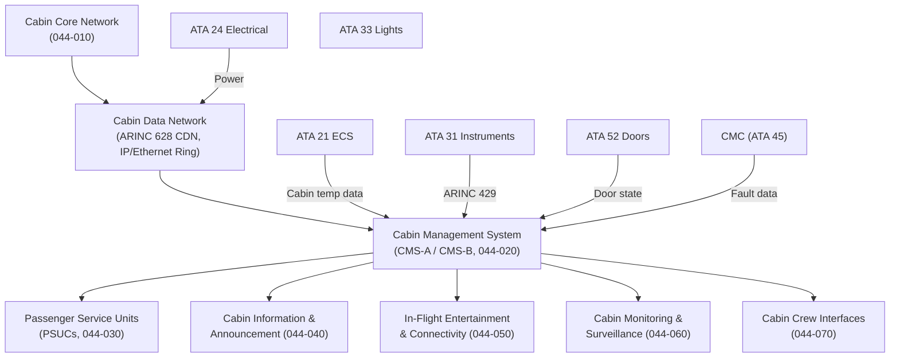
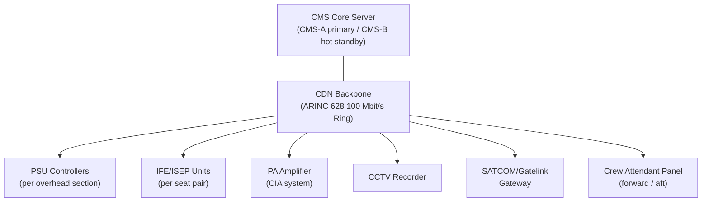
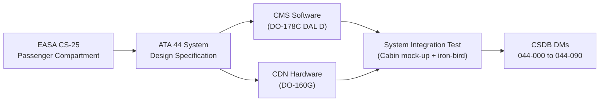

# ATLAS 040-049 · Section 04 · Subsection 044 · 000 — Cabin Systems General

## 0. Hyperlink Policy

All internal cross-references use relative Markdown links within the Q+ATLANTIDE CSDB repository. External regulatory citations in §19/§20 marked . Parent context: [ATLAS 044 README](./README.md).

---

## 1. Purpose

This document provides the general system description, design philosophy, and architectural overview of the Cabin Systems (ATA 44) for the AMPEL360E eWTW aircraft. ATA 44 encompasses all passenger- and cabin-crew-facing systems that contribute to the cabin environment, passenger service, cabin management, information delivery, in-flight entertainment, surveillance, and crew-cabin interfaces.

Key governance areas:
- Cabin Systems overall architecture and subsystem hierarchy.
- AMPEL360E cabin design philosophy (full electric, sustainable, connected).
- Regulatory basis for cabin systems (CS-25 §25.1381–§25.1419; ETSI; FCC).
- Interface map to airframe, environmental control (ATA 21), electrical (ATA 24), avionics (ATA 31/34), and structure.
- Primary and support Q-Division assignments.

---

## 2. Applicability

| Attribute | Value |
|-----------|-------|
| Aircraft Program | AMPEL360E eWTW |
| ATA Chapter | ATA 44 — Cabin Systems |
| Certification Basis | CS-25 Amendment 28; CS-25 §25.1381–§25.1419 |
| Applicable Standards | ETSI EN 302 908; FCC Part 15/25; RTCA DO-160G; ARINC 628; ARINC 664 |
| Cabin Network Architecture | IP/Ethernet-based Cabin Data Network (CDN) |
| S1000D SNS | 044-000 |

---

## 3. System / Function Overview

The Cabin Systems of the AMPEL360E eWTW are designed around a fully connected, electrically powered cabin integrating:

- **Cabin Core Network (CCN):** IP/Ethernet-based cabin data network backbone (ARINC 628 CDN) interconnecting all cabin subsystems.
- **Cabin Management System (CMS):** Central software platform managing lighting, temperature, IFE, PSU, and crew interfaces.
- **Passenger Service Units (PSUs):** Overhead reading lights, attendant call, ventilation nozzles, oxygen mask housings.
- **Cabin Information and Announcement (CIA):** Digital passenger address, cabin intercommunication, visual information displays.
- **In-Flight Entertainment and Connectivity (IFEC):** Seat-back IFE, cabin Wi-Fi (Ka-/Ku-band satellite), mobile telecom.
- **Cabin Monitoring and Surveillance (CMS2):** CCTV, smoke detection relay, cabin air quality sensors.
- **Cabin Crew Interfaces (CCI):** Forward/aft attendant panels, galley control panels, door management.

The eWTW cabin integrates sustainability-focused features including LED lighting (100%), USB-C/USB-A seat power (no 115 V AC seat power outlets), SAF compatibility labelling displays, and real-time cabin CO₂/humidity monitoring.

---

## 4. Scope

### 4.1 In-Scope

- All ATA 44 Cabin System subsystems (044-010 through 044-090).
- Cabin Data Network (CDN) backbone (ARINC 628).
- Passenger-facing services: PSUs, IFE, announcements, connectivity.
- Crew interfaces: attendant panels, galley interfaces, door management panel relay.
- Cabin monitoring: CCTV, smoke relay, air quality.
- S1000D CSDB mapping for all ATA 44 DMs.

### 4.2 Out-of-Scope

- Cabin air conditioning and pressurization (ATA 21).
- Emergency oxygen (ATA 35).
- Cabin lighting (ATA 33, which covers emergency lighting).
- Airframe structure (ATA 53).
- Lavatory mechanical design (covered in ATA 38 Water/Waste).

---

## 5. Architecture Description

The AMPEL360E Cabin Systems are built on the **Cabin Data Network (CDN)**, an ARINC 628-compliant IP/Ethernet backbone (100 Mbit/s full duplex) with a ring topology for high availability. The CDN connects:

- Cabin Management System server (CMS-A and CMS-B redundant pair in avionics bay).
- Passenger In-seat Entertainment/Power units (ISEP units, 1 per 2 seats).
- PSU controllers (PSUC, 1 per overhead panel section).
- Cabin Crew Panels (forward, aft, galley).
- Connectivity gateway (SATCOM/Gatelink).
- CCTV recording unit.

The CMS software manages all cabin functions through a unified API. It interfaces to aircraft systems via ARINC 429 (flight deck ACARS, crew alerts) and RS-422 (door/slide management via ATA 52).

---

## 6. Functional Breakdown

| SNS | Subsubject | Title | Primary Division | Status |
|-----|-----------|-------|-----------------|--------|
| 044-000 | General | Cabin Systems General (this document) | Q-AIR |  |
| 044-010 | Cabin Core Network | Cabin Core Network and Computing | Q-AIR |  |
| 044-020 | CMS | Cabin Management System CMS | Q-AIR |  |
| 044-030 | PSUs | Passenger Service Units and Cabin Control Panels | Q-AIR |  |
| 044-040 | CIA | Cabin Information and Announcement Systems | Q-AIR |  |
| 044-050 | IFEC | In-Flight Entertainment and Connectivity Interfaces | Q-AIR |  |
| 044-060 | Surveillance | Cabin Monitoring and Surveillance Interfaces | Q-AIR |  |
| 044-070 | Crew | Cabin Crew Interfaces and Service Functions | Q-AIR |  |
| 044-080 | Monitoring | Cabin Systems Monitoring, Diagnostics and Control Interfaces | Q-DATAGOV |  |
| 044-090 | CSDB | S1000D CSDB Mapping and Traceability | Q-DATAGOV |  |

---

## 7. Mermaid — System Context Diagram

---

## 8. Mermaid — Internal Functional Architecture

---

## 9. Mermaid — Lifecycle Traceability

---

## 10. Interfaces

| Interface ID | Counterpart | Protocol | Direction | Notes |
|-------------|-------------|----------|-----------|-------|
| IF-044-00-01 | ECS (ATA 21) | ARINC 429 | Input | Cabin temperature zone data |
| IF-044-00-02 | Electrical Bus (ATA 24) | 28 V DC / 115 V AC | Input | CDN power feed; cabin power |
| IF-044-00-03 | CMC (ATA 45) | ARINC 429 | Output | ATA 44 fault codes |
| IF-044-00-04 | Door Management (ATA 52) | RS-422 discrete | Input | Door open/closed state for PA/CMS |
| IF-044-00-05 | Avionics (ATA 31/34) | ARINC 429 | Bidirectional | ACARS relay, QAR download, weather |
| IF-044-00-06 | SATCOM/Gatelink | IP/Ethernet via CDN | Output | IFE connectivity, ground data link |
| IF-044-00-07 | Emergency Lighting (ATA 33) | Discrete 28 V | Input | Emergency light state (override PA) |

---

## 11. Operating Modes

| Mode | Name | Description |
|------|------|-------------|
| M1 | Ground Pre-Departure | CDN/CMS powered; boarding mode (PA, IFE demo, PSU test) |
| M2 | Taxi and Takeoff | Cabin secured; PSU armed; seatbelt sign active |
| M3 | Cruise | Full IFE/IFEC operational; crew call active; climate monitoring |
| M4 | Descent and Landing | Seatbelt sign; IFE shutdown sequence; cabin prep mode |
| M5 | Emergency | PA emergency tones; cabin lighting full; IFE off |
| M6 | Ground Maintenance | GMI active; full BIT; software loading via Gatelink |

---

## 12. Monitoring and Diagnostics

- **CMS CBIT:** The CMS server runs 1 Hz health checks across all CDN nodes; offline nodes trigger CMC advisory.
- **CDN Ring Continuity:** Ring topology ensures single-link failure does not interrupt cabin services; redundancy path auto-selected within 50 ms.
- **Smoke Detection Relay:** Cabin smoke detector signals (lavatory, galley) relayed to CMC and crew display within 1 s.
- **Air Quality:** CO₂ and RH sensors sampled at 1 Hz; advisory if CO₂ > 2500 ppm.
- **QAR Recording:** Cabin temperature, CO₂, and CMS fault events recorded to QAR at 1 Hz.

---

## 13. Maintenance Concept

| Task ID | Task | Interval | Access | Skill Level |
|---------|------|----------|--------|-------------|
| MC-044-00-01 | CMS server PUBIT | A-Check | CMC terminal | Avionics Technician |
| MC-044-00-02 | CDN ring continuity test | C-Check | CDN test GSE | Avionics Technician |
| MC-044-00-03 | Full BIT via Gatelink GMI | C-Check | Laptop + Gatelink | Avionics Engineer |
| MC-044-00-04 | CCTV recording functional check | A-Check | Cabin walkthrough | Cabin Systems Technician |

---

## 14. S1000D / CSDB Mapping

| DMC | Title | Type | SNS |
|-----|-------|------|-----|
| QATL-A-044-00-00-00AAA-040A-A | Cabin Systems General Description | AMM | 044-000 |
| QATL-A-044-00-00-00AAA-941A-A | Cabin Systems General Illustrated Parts | IPD | 044-000 |
| QATL-A-044-00-00-00AAA-C00A-A | Cabin Systems Glossary | AMM/FIM | 044-000 |

---

## 15. Footprints

### 15.1 Physical Footprint

| Item | Quantity | Location |
|------|----------|----------|
| CMS Server (CMS-A / CMS-B) | 2 | Avionics bay / under-floor E-bay |
| CDN Backbone Switches | 4 | Cabin crown / floor panels |

### 15.2 Electrical / Data Footprint

| Parameter | Value |
|-----------|-------|
| CDN total power |  (target < 5 kW) |
| CDN bandwidth per node | 100 Mbit/s full duplex |
| CDN topology | Ring (ARINC 628) |

### 15.3 Maintenance Footprint

| Parameter | Value |
|-----------|-------|
| CMS PUBIT duration | < 90 s |
| CDN ring restoration time | < 50 ms |

### 15.4 Data Footprint

| Parameter | Value |
|-----------|-------|
| QAR parameters (ATA 44) |  |
| CMC fault log entry size | 16 bytes per event |

---

## 16. Safety and Certification

- **CS-25 §25.1381–§25.1419:** Passenger compartment requirements including emergency lighting, seat occupancy indicators, and emergency equipment accessibility.
- **CS-25 §25.853:** Cabin materials flammability; all CDN cables, PSU housings, and IFE units must meet §25.853 panel/upholstery fire test.
- **ETSI/FCC Connectivity Compliance:** Ka/Ku-band SATCOM and cabin Wi-Fi to comply with ETSI EN 302 908 and FCC Part 25/15 as applicable; operational in international airspace.
- **Smoke Detection:** Cabin smoke detectors are safety-critical; lavatory smoke detection per CS-25 §25.854.

---

## 17. Verification and Validation

| V&V ID | Requirement | Method | Status |
|--------|-------------|--------|--------|
| VV-044-00-01 | CDN ring restoration < 50 ms on single-link failure | Test |  |
| VV-044-00-02 | CMS controls all cabin zones simultaneously | Test |  |
| VV-044-00-03 | Materials meet CS-25 §25.853 flammability | Test |  |
| VV-044-00-04 | Smoke detection relay < 1 s | Test |  |

---

## 18. Glossary

| Term | Acronym | Definition |
|------|---------|------------|
| Cabin Data Network | CDN | ARINC 628-compliant IP/Ethernet ring backbone interconnecting all cabin subsystems |
| Cabin Management System | CMS | Central software platform managing and monitoring all ATA 44 cabin functions |
| Passenger Service Unit | PSU | Overhead panel unit providing reading light, attendant call, and oxygen mask housing per seat group |
| In-Seat Entertainment and Power | ISEP | Under-seat or seat-back unit providing IFE display, audio, and USB charging per seat pair |
| Cabin Information and Announcement | CIA | PA, intercommunication, and visual information subsystem for passenger notifications |
| In-Flight Entertainment and Connectivity | IFEC | Integrated seat IFE, cabin Wi-Fi, and SATCOM connectivity system |
| Passenger Address | PA | Audio announcement system broadcasting crew and automated cabin announcements |
| Cabin Crew Panel | CCP | Attendant control panel at galley/door stations for cabin function management |
| Gatelink | — | Ground-based wireless data link (VHF/Wi-Fi) for operational data transfer when aircraft is at gate |
| SATCOM | — | Satellite communication system providing broadband connectivity for passenger and operational data |

---

## 19. Citations

| Ref ID | Standard | Applicability | Status |
|--------|----------|---------------|--------|
| CIT-044-00-01 | EASA CS-25 §25.1381–§25.1419 | Passenger compartment certification requirements |  |
| CIT-044-00-02 | EASA CS-25 §25.853 | Cabin materials flammability |  |
| CIT-044-00-03 | ARINC 628, Cabin Equipment and Furnishing | CDN architecture standard |  |
| CIT-044-00-04 | ETSI EN 302 908 | SATCOM/mobile telephony compliance |  |
| CIT-044-00-05 | RTCA DO-160G | Environmental qualification for cabin equipment |  |

---

## 20. References

| Ref ID | Document | Version | Status |
|--------|----------|---------|--------|
| REF-044-00-01 | AMPEL360E Cabin Systems Design Specification |  |  |
| REF-044-00-02 | Q+ATLANTIDE template.md | 1.0 | Active |
| REF-044-00-03 | AMPEL360E Cabin Layout Drawing |  |  |

---

## 21. Open Issues

| Issue ID | Description | Owner | Status |
|----------|-------------|-------|--------|
| OI-044-00-01 | CDN switch vendor selection pending RFP | Q-AIR |  |
| OI-044-00-02 | SATCOM spectrum coordination pending ICAO filing | Q-DATAGOV |  |
| OI-044-00-03 | Cabin CO₂ advisory threshold to be validated with ECS team | Q-AIR |  |

---

## 22. Change Log

| Version | Date | Author | Description | Status |
|---------|------|--------|-------------|--------|
| 1.0.0 | 2026-05-10 | Q-AIR | Initial baseline release |  |
