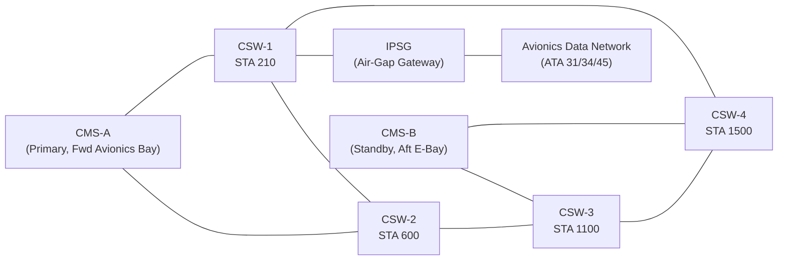
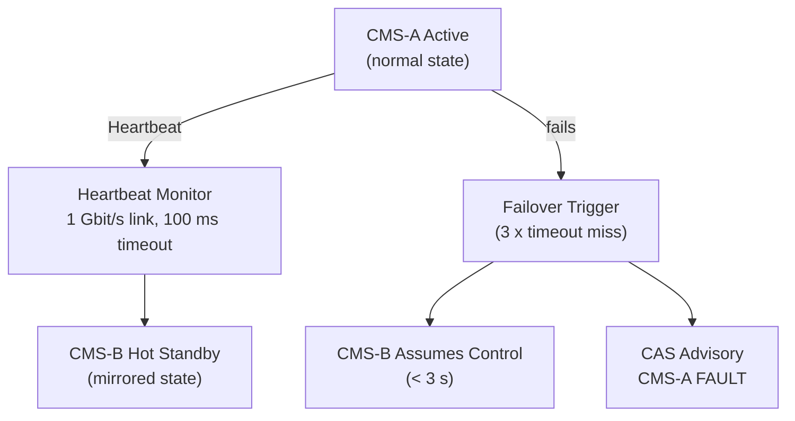
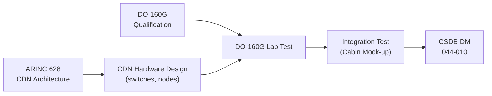

# ATLAS 040-049 · Section 04 · Subsection 044 · 010 — Cabin Core Network and Computing

## 0. Hyperlink Policy

All internal cross-references use relative Markdown links within the Q+ATLANTIDE CSDB repository. External regulatory citations in §19/§20 marked . Parent: [044-000 General](./044-000-Cabin-Systems-General.md).

---

## 1. Purpose

This document defines the architecture, design, and certification approach for the Cabin Core Network and Computing infrastructure of the AMPEL360E eWTW aircraft. The Cabin Data Network (CDN) is the IP/Ethernet backbone interconnecting all ATA 44 cabin subsystems. It is based on ARINC 628 and utilises a redundant ring topology to ensure high availability.

Key governance areas:
- CDN physical architecture (ring topology, managed switches, cable plant).
- Network segmentation and VLAN scheme.
- CMS Server hardware (computing nodes CMS-A, CMS-B).
- Air-gap and security between CDN and avionics data networks.
- DO-160G environmental qualification of CDN hardware.
- Performance: bandwidth, latency, availability targets.

---

## 2. Applicability

| Attribute | Value |
|-----------|-------|
| Aircraft Program | AMPEL360E eWTW |
| ATA Chapter | ATA 44.010 — Cabin Core Network and Computing |
| Certification Basis | CS-25 Amendment 28; CS-25 §25.853 |
| Applicable Standards | ARINC 628; IEEE 802.3 (Ethernet); DO-160G; DO-178C DAL D |
| Network Standard | ARINC 628 Cabin Data Network (CDN) |
| S1000D SNS | 044-010 |

---

## 3. System / Function Overview

The CDN is a 100 Mbit/s full-duplex Fast Ethernet ring topology with four managed switches (CSW-1 through CSW-4) distributed along the cabin centreline at STA 210, STA 600, STA 1100, and STA 1500. Each switch provides 24 downlink ports for cabin equipment. CMS-A (primary) and CMS-B (hot standby) computing nodes are located in the forward avionics bay and aft E-bay respectively, each connected to two ring switches for redundancy. VLANs segment traffic into: VLAN 10 (CMS control), VLAN 20 (IFE/ISEP media), VLAN 30 (crew/PA), VLAN 40 (SATCOM/Gatelink WAN). An IP security gateway (IPSG) provides a managed demilitarised zone between the CDN and the aircraft avionics network to prevent unauthorised data transfer.

---

## 4. Scope

### 4.1 In-Scope

- CDN ring topology and managed switch architecture.
- VLAN segmentation scheme (VLAN 10/20/30/40).
- CMS-A and CMS-B hardware (computing nodes, OS, network OS).
- IP security gateway (IPSG) — CDN/avionics air-gap.
- CDN cable plant specification (Cat6A shielded, fire-retardant, DO-160G §25.853 rated).
- DO-160G qualification of CDN switches and CMS nodes.
- CDN network management (NMS) software (VLAN config, fault monitoring).
- Bandwidth allocation and QoS policy.

### 4.2 Out-of-Scope

- CMS application software (see 044-020).
- IFE content server hardware (see 044-050).
- SATCOM modem (see 044-050).
- Passenger Wi-Fi access points (see 044-050).

---

## 5. Architecture Description

CDN switches CSW-1 through CSW-4 form a fibre-optic ring (10 Gbit/s inter-switch uplinks) with copper Cat6A drops to each cabin equipment unit. In normal operation the ring is logically broken at one point (Rapid Spanning Tree Protocol RSTP) to prevent loops; a single-link failure causes RSTP convergence within < 50 ms. Each CSW provides 28 V DC PoE++ (IEEE 802.3bt) on all downlink ports for ISEP, PSU controllers, and CCTV cameras (< 90 W per port). CMS-A is the active management node; CMS-B maintains a synchronised hot standby state via a dedicated 1 Gbit/s heartbeat link. On CMS-A failure, CMS-B assumes control within < 3 s.

---

## 6. Functional Breakdown

| Function ID | Function | Description | DAL | Standard |
|-------------|----------|-------------|-----|----------|
| F-044-01-01 | CDN Ring Switching | Redundant ring switching with RSTP failover < 50 ms | D | ARINC 628 / IEEE 802.3 |
| F-044-01-02 | VLAN Segmentation | VLAN 10/20/30/40 with access control lists | D | IEEE 802.1Q |
| F-044-01-03 | PoE Power Delivery | 28 V-derived PoE++ to cabin equipment (< 90 W/port) | D | IEEE 802.3bt |
| F-044-01-04 | CMS Hot Standby | CMS-A/B hot standby failover < 3 s | D | ARINC 628 |
| F-044-01-05 | IPSG Air-Gap | Managed security boundary between CDN and avionics network | D |  |
| F-044-01-06 | Network Management | VLAN configuration, fault monitoring, SNMP logging | D | SNMP v3 |

---

## 7. Mermaid — CDN Ring Topology

---

## 8. Mermaid — CMS Failover Logic

---

## 9. Mermaid — Lifecycle Traceability

---

## 10. Interfaces

| Interface ID | Counterpart | Protocol | Direction | Data |
|-------------|-------------|----------|-----------|------|
| IF-044-01-01 | Electrical Bus (ATA 24) | 28 V DC | Input | CDN switch power (4 × switch + CMS nodes) |
| IF-044-01-02 | CMS Application (044-020) | Local bus / OS | Bidirectional | CMS application data |
| IF-044-01-03 | IFE/ISEP units (044-050) | Ethernet PoE++ | Bidirectional | IFE media + control |
| IF-044-01-04 | Avionics network (ATA 31/34) | Ethernet via IPSG | Bidirectional | ACARS, QAR data (controlled) |
| IF-044-01-05 | SATCOM Gateway (044-050) | Ethernet VLAN 40 | Bidirectional | Connectivity WAN traffic |
| IF-044-01-06 | CMC (ATA 45) | ARINC 429 | Output | CDN fault codes |

---

## 11. Operating Modes

| Mode | Name | Description | Entry | Exit |
|------|------|-------------|-------|------|
| M1 | Boot | CDN switches and CMS initialise; RSTP converges | Power applied | Boot complete |
| M2 | Normal | CDN ring fully operational; CMS-A active; all VLANs live | Boot complete | Fault or shutdown |
| M3 | Degraded — Single Link | RSTP rerouted; reduced redundancy; CMC advisory | Single link failure | Link restored |
| M4 | CMS Failover | CMS-B active; CAS advisory; cabin functions continue | CMS-A fault | CMS-A restored |
| M5 | Ground Maintenance | NMS management mode; software loading via Gatelink | GMI connected | GMI disconnected |

---

## 12. Monitoring and Diagnostics

- **RSTP Status:** RSTP topology change events logged to NMS and CMC; convergence time measured per event.
- **Port Utilisation:** Each switch port utilisation sampled at 1 s; saturation (> 90 % for > 10 s) triggers CMC advisory.
- **CMS Heartbeat:** 100 ms heartbeat; triple-miss triggers CMS-B failover and CMC caution "CMS-A FAULT".
- **PoE Fault Detection:** Over-current (> 90 W) on any port triggers port shutdown and CMC advisory.
- **IPSG Audit Log:** All cross-boundary data flows logged to NMS audit trail for security review.

---

## 13. Maintenance Concept

| Task ID | Task | Interval | Access | Skill Level |
|---------|------|----------|--------|-------------|
| MC-044-01-01 | CDN ring continuity test (RSTP failover) | A-Check | NMS terminal | Avionics Technician |
| MC-044-01-02 | CMS-A/B hot standby failover functional test | C-Check | NMS terminal | Avionics Engineer |
| MC-044-01-03 | IPSG audit log review | A-Check | NMS laptop | Avionics/Security Engineer |
| MC-044-01-04 | CDN cable plant visual inspection | C-Check | Cabin crown panels | Avionics Technician |
| MC-044-01-05 | CDN software/firmware version check | C-Check | NMS software tool | Avionics Engineer |

---

## 14. S1000D / CSDB Mapping

| DMC | Title | Type | SNS |
|-----|-------|------|-----|
| QATL-A-044-10-00-00AAA-040A-A | Cabin Core Network Architecture Description | AMM | 044-010 |
| QATL-A-044-10-00-00AAA-520A-A | CDN Ring Failover Functional Test | AMM | 044-010 |
| QATL-A-044-10-00-00AAA-720A-A | CDN Switch Replacement | AMM | 044-010 |
| QATL-A-044-10-00-00AAA-920A-A | CDN Fault Isolation Procedure | FIM | 044-010 |

---

## 15. Footprints

### 15.1 Physical Footprint

| Item | Qty | Mass (kg) | Location |
|------|-----|-----------|----------|
| CDN Managed Switch (CSW-1..4) | 4 | 1.2 each | Crown panel STA 210/600/1100/1500 |
| CMS Server Node (CMS-A, CMS-B) | 2 | 2.5 each | Fwd Avionics Bay / Aft E-Bay |
| IPSG Gateway Unit | 1 | 0.8 | Fwd Avionics Bay |

### 15.2 Electrical / Data Footprint

| Parameter | Value |
|-----------|-------|
| CDN total power (switches + CMS) |  (target < 800 W) |
| CDN ring inter-switch uplink | 10 Gbit/s fibre-optic |
| CDN downlink (to cabin equipment) | 100 Mbit/s Cat6A copper |
| PoE++ max per port | 90 W (IEEE 802.3bt) |

### 15.3 Maintenance Footprint

| Parameter | Value |
|-----------|-------|
| RSTP convergence target | < 50 ms |
| CMS failover target | < 3 s |
| Switch MTBUR |  (target > 30 000 FH) |

### 15.4 Data Footprint

| Parameter | Value |
|-----------|-------|
| VLAN count | 4 (VLAN 10/20/30/40) |
| NMS audit log size |  |
| CMC fault code entries | 8-char ATA standard |

---

## 16. Safety and Certification

- **CS-25 §25.853:** All CDN cable insulation and switch housings meet CS-25 §25.853 cabin materials flammability; fibre-optic inter-switch links are non-metallic.
- **IPSG Security:** Air-gap between CDN and avionics network; no unauthenticated cross-network data flow allowed; IPSG certified to aviation cyber-security guidelines (ED-202A).
- **DAL D Justification:** CDN failure results in loss of passenger entertainment and convenience services (no safety effect); DAL D appropriate per ARP4754B.
- **DO-160G Qualification:** All CDN hardware (switches, CMS nodes, IPSG) qualified to DO-160G §4/6/8/20 for temperature, humidity, vibration, EMI.

---

## 17. Verification and Validation

| V&V ID | Requirement | Method | Status |
|--------|-------------|--------|--------|
| VV-044-01-01 | RSTP ring failover < 50 ms on single link cut | Test |  |
| VV-044-01-02 | CMS-A to CMS-B failover < 3 s | Test |  |
| VV-044-01-03 | IPSG blocks unauthenticated cross-network data | Test |  |
| VV-044-01-04 | DO-160G §4/6/8/20 qualification complete | Test |  |
| VV-044-01-05 | CS-25 §25.853 flammability test pass for CDN cables | Test |  |

---

## 18. Glossary

| Term | Acronym | Definition |
|------|---------|------------|
| Cabin Data Network | CDN | ARINC 628-compliant IP/Ethernet ring backbone for cabin subsystems |
| Cabin Switch | CSW | Managed Ethernet switch forming CDN ring nodes at cabin stations |
| Cabin Management System | CMS | Redundant (A/B) server platform managing all ATA 44 cabin functions |
| IP Security Gateway | IPSG | Managed firewall/router providing controlled boundary between CDN and avionics network |
| Rapid Spanning Tree Protocol | RSTP | IEEE 802.1w protocol enabling fast failover in Ethernet ring topology |
| Power over Ethernet Plus Plus | PoE++ | IEEE 802.3bt standard delivering up to 90 W per port to powered devices over Ethernet |
| Virtual Local Area Network | VLAN | IEEE 802.1Q logical network segment providing traffic isolation within a shared Ethernet switch fabric |
| Network Management System | NMS | Software tool for CDN configuration, health monitoring, fault logging, and SNMP data collection |
| Hot Standby | — | Redundancy mode where a backup system maintains a real-time synchronised copy of the primary system state, ready for instant takeover |
| ED-202A | — | EUROCAE document on aviation cyber-security for airborne systems; referenced for IPSG security certification basis |

---

## 19. Citations

| Ref ID | Standard | Applicability | Status |
|--------|----------|---------------|--------|
| CIT-044-01-01 | ARINC 628, Cabin Equipment and Furnishing, CDN | CDN architecture and interoperability |  |
| CIT-044-01-02 | IEEE 802.3bt, PoE++ | PoE delivery specification for cabin equipment |  |
| CIT-044-01-03 | IEEE 802.1Q, VLAN | VLAN segmentation standard |  |
| CIT-044-01-04 | RTCA DO-160G | Environmental qualification of CDN hardware |  |
| CIT-044-01-05 | EUROCAE ED-202A | Aviation cyber-security for IPSG |  |
| CIT-044-01-06 | EASA CS-25 §25.853 | Cabin materials flammability for CDN cables and switch housings |  |

---

## 20. References

| Ref ID | Document | Version | Status |
|--------|----------|---------|--------|
| REF-044-01-01 | Cabin Systems General (044-000) | 1.0 | Active |
| REF-044-01-02 | AMPEL360E CDN Interface Control Document |  |  |
| REF-044-01-03 | AMPEL360E Cabin Layout Drawing |  |  |

---

## 21. Open Issues

| Issue ID | Description | Owner | Status |
|----------|-------------|-------|--------|
| OI-044-01-01 | CDN switch vendor selection (Diehl Aviation / Astronics / Thales shortlist) | Q-AIR |  |
| OI-044-01-02 | IPSG cyber-security certification strategy (ED-202A vs FAA Order 8110.109) | Q-DATAGOV |  |
| OI-044-01-03 | CDN total power budget to be confirmed from EPS load analysis | Q-MECHANICS |  |

---

## 22. Change Log

| Version | Date | Author | Description | Status |
|---------|------|--------|-------------|--------|
| 1.0.0 | 2026-05-10 | Q-AIR | Initial baseline release |  |
