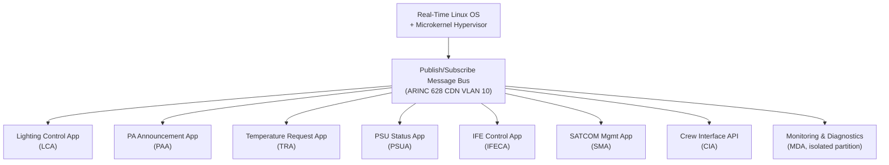
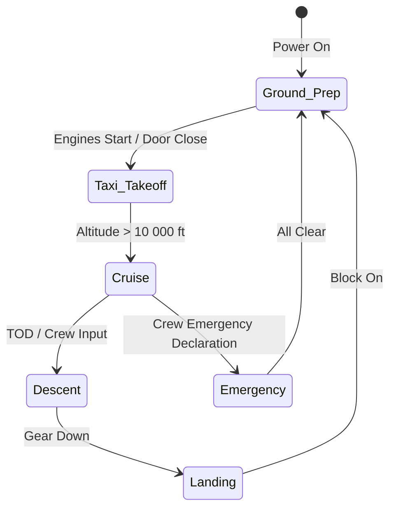
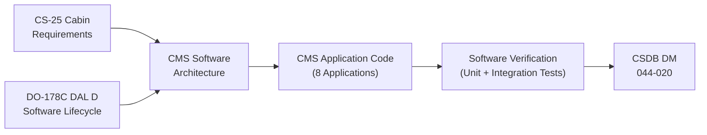

# ATLAS 040-049 · Section 04 · Subsection 044 · 020 — Cabin Management System CMS

## 0. Hyperlink Policy

All internal cross-references use relative Markdown links within the Q+ATLANTIDE CSDB repository. External regulatory citations in §19/§20 marked . Parent: [044-000 General](./044-000-Cabin-Systems-General.md).

---

## 1. Purpose

This document defines the Cabin Management System (CMS) for the AMPEL360E eWTW aircraft — the central software platform that orchestrates, monitors, and controls all passenger-facing and crew-operated cabin functions. The CMS is hosted on the dual-redundant CMS-A/B server hardware (see 044-010) and communicates with all cabin subsystems via the Cabin Data Network (CDN).

Key governance areas:
- CMS software architecture and hosted application set.
- Zone-based lighting, climate request, and PA control logic.
- CMS-crew interface API (attendant panel, MCDU cabin page).
- Flight phase integration (gate/taxi/cruise/landing modes).
- DO-178C DAL D software development.
- CMS configuration and software loading.

---

## 2. Applicability

| Attribute | Value |
|-----------|-------|
| Aircraft Program | AMPEL360E eWTW |
| ATA Chapter | ATA 44.020 — Cabin Management System |
| Certification Basis | CS-25 Amendment 28 |
| Applicable Standards | DO-178C DAL D; ARINC 628; DO-160G |
| Software DAL | DAL D (loss of CMS = inconvenience, no safety effect) |
| S1000D SNS | 044-020 |

---

## 3. System / Function Overview

The CMS is a Linux-based embedded software platform running on the CMS server hardware. It hosts the following applications:

| Application | Acronym | Function |
|-------------|---------|----------|
| Lighting Control Application | LCA | Zone-based LED dimming, mood lighting, emergency lighting relay |
| Passenger Address Application | PAA | PA announcement scheduling, chime generation, zone routing |
| Temperature Request Application | TRA | Cabin zone temperature setpoint management to ECS (ATA 21) |
| PSU Status Application | PSUA | PSU call-button processing, reading light control |
| IFE Control Application | IFECA | IFE power-on/off sequencing, content server control |
| SATCOM Management Application | SMA | Wi-Fi session management, SATCOM bandwidth allocation |
| Crew Interface Application | CIA | Attendant panel and MCDU cabin page API server |
| Monitoring and Diagnostics Application | MDA | Health monitoring, fault logging, CMC reporting |

---

## 4. Scope

### 4.1 In-Scope

- CMS software application set (all 8 applications listed in §3).
- Zone-based cabin lighting control (LED dimming, 256-level, 8 zones).
- Zone temperature request to ECS (ATA 21) via ARINC 429.
- PA announcement scheduling and chime library.
- IFE and SATCOM power sequencing.
- Attendant panel API and MCDU cabin page integration.
- DO-178C DAL D software lifecycle.
- CMS configuration management and software loading (Gatelink).

### 4.2 Out-of-Scope

- LED light fixtures (ATA 33).
- ECS zone temperature control (ATA 21).
- IFE content authoring (airline responsibility).
- SATCOM satellite booking and spectrum licensing.
- Attendant panel hardware (see 044-070).

---

## 5. Architecture Description

The CMS runs a real-time Linux OS with a microkernel hypervisor separating the safety-adjacent Monitoring/Diagnostics Application (MDA) from the entertainment and comfort applications. Inter-application communication uses a publish/subscribe message bus (ARINC 628 compliant). The CMS communicates with cabin hardware via the CDN (VLAN 10 for control, VLAN 20 for IFE media, VLAN 30 for PA/crew). Flight phase data is received from the avionics network via the IPSG on a controlled ARINC 429 interface (flight phase word, seatbelt sign discrete, door state). The CMS automatically transitions cabin operating modes based on flight phase transitions received from this interface.

---

## 6. Functional Breakdown

| Function ID | Function | Description | DAL |
|-------------|----------|-------------|-----|
| F-044-02-01 | Zone Lighting Control | 256-level PWM dimming for 8 cabin zones; mood lighting presets | D |
| F-044-02-02 | PA Announcement Routing | Zone routing of PA announcements; priority arbitration (crew > auto > ACARS) | D |
| F-044-02-03 | Temperature Request | Zone temperature setpoint broadcast to ECS (ATA 21) at 10 s intervals | D |
| F-044-02-04 | PSU Call Processing | Reading light on/off; attendant call signal routing; call-back cancel | D |
| F-044-02-05 | IFE Power Sequencing | Power-on/off IFE units in sequence; avoid current surge; < 30 A inrush | D |
| F-044-02-06 | Flight Phase Mode Mgmt | Cabin mode transitions based on flight phase and crew inputs | D |
| F-044-02-07 | Crew Interface API | REST API server for attendant panels and MCDU cabin page | D |
| F-044-02-08 | Monitoring and Fault Reporting | CDN node health, application watchdog, CMC fault reporting | D |

---

## 7. Mermaid — CMS Application Architecture

---

## 8. Mermaid — CMS Flight Phase Mode Transitions

---

## 9. Mermaid — Lifecycle Traceability

---

## 10. Interfaces

| Interface ID | Counterpart | Protocol | Direction | Data |
|-------------|-------------|----------|-----------|------|
| IF-044-02-01 | CDN (044-010) | Ethernet VLAN 10/20/30 | Bidirectional | All cabin subsystem control and telemetry |
| IF-044-02-02 | ECS (ATA 21) | ARINC 429 via IPSG | Output | Zone temperature setpoints |
| IF-044-02-03 | Avionics (ATA 31) | ARINC 429 via IPSG | Input | Flight phase, seatbelt sign, door state |
| IF-044-02-04 | CMC (ATA 45) | ARINC 429 | Output | ATA 44 CMC fault codes |
| IF-044-02-05 | Attendant Panels (044-070) | CDN REST API | Bidirectional | Crew commands, status display |
| IF-044-02-06 | MCDU Cabin Page (ATA 22) | ARINC 429 via IPSG | Bidirectional | Cabin state summary for pilots |
| IF-044-02-07 | IFE/SATCOM (044-050) | CDN VLAN 20 | Output | IFE power commands, SATCOM session mgmt |

---

## 11. Operating Modes

| Mode | Name | Description | Automatic Trigger |
|------|------|-------------|-------------------|
| M1 | Ground Preparation | Full cabin lighting; boarding PA; IFE demo loop | Block off / power on |
| M2 | Taxi/Takeoff | Seatbelt sign PA chime; dim IFE; PSU armed | Door closed + engine start |
| M3 | Climb | Full IFE active; PA for safety demo auto-play | Altitude > 10 000 ft |
| M4 | Cruise | All services active; SATCOM connected; mood lighting | Cruise altitude stable |
| M5 | Descent | IFE dim; seatbelt sign chime; PA announcements | Top of Descent |
| M6 | Landing | IFE off; full white lighting; seatbelt PA | Gear down |
| M7 | Emergency | Full white lighting; emergency PA broadcast; IFE off | Crew declaration |

---

## 12. Monitoring and Diagnostics

- **Application Watchdog:** Each CMS application has a hardware watchdog timer (2 s timeout); expiry triggers application restart and CMC advisory.
- **CDN Node Health:** CMS polls all CDN nodes (ISEP, PSUC, CCTV) at 5 s; offline node logged to CMC.
- **PA Priority Monitor:** Monitors PA channel priority stack; unexpected pre-emption logged.
- **IFE Power Monitor:** IFE unit power-on current monitored; inrush > 30 A triggers overcurrent advisory.
- **Fault Reporting:** All faults formatted as 8-character ATA fault codes and transmitted to CMC via ARINC 429.

---

## 13. Maintenance Concept

| Task ID | Task | Interval | Access | Skill Level |
|---------|------|----------|--------|-------------|
| MC-044-02-01 | CMS software version check | A-Check | CMC terminal | Avionics Technician |
| MC-044-02-02 | All-zone lighting functional test | A-Check | Cockpit + cabin walkthrough | Cabin Systems Technician |
| MC-044-02-03 | PA announcement test (all zones) | A-Check | CMS test mode | Cabin Systems Technician |
| MC-044-02-04 | CMS full BIT via Gatelink software load | C-Check | Gatelink laptop | Avionics Engineer |
| MC-044-02-05 | Flight phase mode transition test | C-Check | CMS test mode + GSE | Avionics Engineer |

---

## 14. S1000D / CSDB Mapping

| DMC | Title | Type | SNS |
|-----|-------|------|-----|
| QATL-A-044-20-00-00AAA-040A-A | CMS Architecture Description | AMM | 044-020 |
| QATL-A-044-20-00-00AAA-520A-A | CMS Application Functional Test | AMM | 044-020 |
| QATL-A-044-20-00-00AAA-720A-A | CMS Server Replacement | AMM | 044-020 |
| QATL-A-044-20-00-00AAA-920A-A | CMS Fault Isolation | FIM | 044-020 |

---

## 15. Footprints

### 15.1 Physical Footprint

| Item | Qty | Mass (kg) | Location |
|------|-----|-----------|----------|
| CMS Software (hosted on CMS-A/B nodes) | 2 | — (software only) | Fwd Bay / Aft E-Bay |

### 15.2 Electrical / Data Footprint

| Parameter | Value |
|-----------|-------|
| CMS server power (per node) |  (target < 150 W) |
| CDN VLAN 10 bandwidth utilised by CMS |  (target < 10 Mbit/s) |

### 15.3 Maintenance Footprint

| Parameter | Value |
|-----------|-------|
| CMS application restart time (watchdog) | < 5 s |
| Software load time via Gatelink |  |

### 15.4 Data Footprint

| Parameter | Value |
|-----------|-------|
| Fault log size per event | 16 bytes |
| PA chime library size |  |
| Lighting preset count | 12 (configurable by airline) |

---

## 16. Safety and Certification

- **DAL D Justification:** CMS failure results in loss of cabin entertainment and comfort services (no safety effect); lighting system has a hardwired emergency override independent of CMS; DAL D per ARP4754B.
- **Emergency Lighting Override:** Emergency lighting activation is hardware-wired and does not pass through CMS software; CMS failure cannot suppress emergency lighting.
- **CS-25 §25.1322:** PA system used for safety announcements; PA hardware has a direct crew microphone path independent of CMS software for crew verbal communications.
- **DO-178C DAL D:** All CMS application software developed to DO-178C DAL D lifecycle; software verification evidence required for Part 21 compliance.

---

## 17. Verification and Validation

| V&V ID | Requirement | Method | Status |
|--------|-------------|--------|--------|
| VV-044-02-01 | All 8 CMS zones respond to lighting commands within 500 ms | Test |  |
| VV-044-02-02 | PA announcement plays in correct zone within 1 s of command | Test |  |
| VV-044-02-03 | Flight phase mode transitions automatic and correct | Test |  |
| VV-044-02-04 | Application watchdog restarts failed app within 5 s | Test |  |
| VV-044-02-05 | Emergency lighting not suppressed by CMS failure | Test |  |
| VV-044-02-06 | DO-178C DAL D evidence complete | Inspection |  |

---

## 18. Glossary

| Term | Acronym | Definition |
|------|---------|------------|
| Cabin Management System | CMS | Central software platform managing all ATA 44 cabin functions |
| Lighting Control Application | LCA | CMS software module controlling zone-based LED dimming |
| Passenger Address Application | PAA | CMS software module managing PA announcements and chimes |
| Temperature Request Application | TRA | CMS software module broadcasting zone temperature setpoints to ATA 21 ECS |
| PSU Status Application | PSUA | CMS software module processing passenger call-button signals |
| IFE Control Application | IFECA | CMS software module managing IFE power sequencing |
| SATCOM Management Application | SMA | CMS software module managing passenger Wi-Fi sessions and SATCOM bandwidth |
| Crew Interface Application | CIA | CMS REST API server for attendant panels and MCDU cabin page |
| Monitoring and Diagnostics Application | MDA | CMS software module for health monitoring, watchdog, and CMC fault reporting |
| Publish/Subscribe Message Bus | — | Asynchronous messaging architecture where data producers publish to topics and consumers subscribe to relevant topics |

---

## 19. Citations

| Ref ID | Standard | Applicability | Status |
|--------|----------|---------------|--------|
| CIT-044-02-01 | RTCA DO-178C, Software Considerations in Airborne Systems | CMS software DAL D development |  |
| CIT-044-02-02 | EASA CS-25 §25.1322, Flight-Crew Alerting | PA system independence from CMS |  |
| CIT-044-02-03 | ARINC 628, Cabin Equipment and Furnishing | CDN message bus and application architecture |  |
| CIT-044-02-04 | SAE ARP4754B | DAL D allocation rationale |  |

---

## 20. References

| Ref ID | Document | Version | Status |
|--------|----------|---------|--------|
| REF-044-02-01 | Cabin Systems General (044-000) | 1.0 | Active |
| REF-044-02-02 | Cabin Core Network (044-010) | 1.0 | Active |
| REF-044-02-03 | AMPEL360E CMS Software Requirements Specification |  |  |

---

## 21. Open Issues

| Issue ID | Description | Owner | Status |
|----------|-------------|-------|--------|
| OI-044-02-01 | CMS mood lighting preset library (count and definition) to be agreed with airline customers | Q-AIR |  |
| OI-044-02-02 | Gatelink software loading security protocol (authentication scheme) to be finalised | Q-DATAGOV |  |
| OI-044-02-03 | MCDU cabin page format to be agreed with flight deck human factors team | Q-AIR |  |

---

## 22. Change Log

| Version | Date | Author | Description | Status |
|---------|------|--------|-------------|--------|
| 1.0.0 | 2026-05-10 | Q+ Team/Amedeo Pelliccia + AI | Initial baseline release |  |
