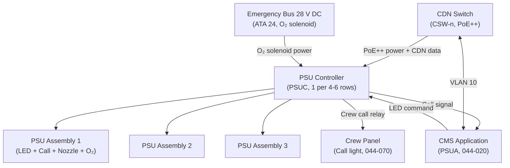
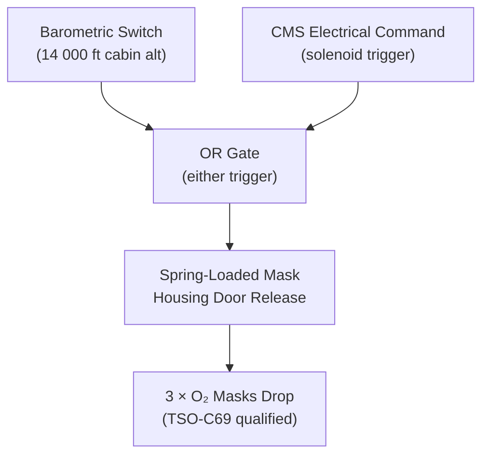
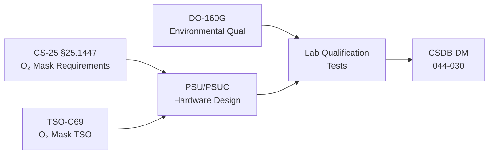

# ATLAS 040-049 · Section 04 · Subsection 044 · 030 — Passenger Service Units and Cabin Control Panels

## 0. Hyperlink Policy

All internal cross-references use relative Markdown links within the Q+ATLANTIDE CSDB repository. External regulatory citations in §19/§20 marked . Parent: [044-000 General](./044-000-Cabin-Systems-General.md).

---

## 1. Purpose

This document defines the Passenger Service Units (PSUs) and associated Cabin Control Panels for the AMPEL360E eWTW aircraft. PSUs are overhead panel units installed above each seating section providing: LED reading lights, passenger call button, ventilation nozzle, and oxygen mask housing. Cabin Control Panels (CCPs) at door stations provide local cabin control functions for cabin crew.

Key governance areas:
- PSU hardware design (LED, call button, nozzle, mask housing).
- PSU Controller (PSUC) architecture and CDN interface.
- Emergency oxygen mask automatic drop function (TSO/CS qualification).
- CCP hardware at door stations.
- DO-160G qualification of PSU/PSUC hardware.
- CS-25 §25.1447 oxygen mask requirements.

---

## 2. Applicability

| Attribute | Value |
|-----------|-------|
| Aircraft Program | AMPEL360E eWTW |
| ATA Chapter | ATA 44.030 — Passenger Service Units |
| Certification Basis | CS-25 §25.1447 (O₂ mask); CS-25 §25.853 (flammability); TSO-C69 |
| Applicable Standards | TSO-C69; DO-160G; ARINC 628 CDN; CS-25 §25.1447 |
| Oxygen Mask Housing | Automatic barometric trigger at 14 000 ft cabin alt |
| S1000D SNS | 044-030 |

---

## 3. System / Function Overview

Each PSU assembly is installed in the overhead panel above 1–3 seat rows. The AMPEL360E PSU design consists of:

- **LED Reading Light:** Individually addressable LED warm-white light (2700–5000 K, 250 lux minimum at seat tray table), dimmable in 256 steps via PSUC CDN command.
- **Attendant Call Button:** Capacitive touch button triggering cabin crew call signal via PSUC to CMS, activating overhead call chime and crew panel call light.
- **Ventilation Nozzle:** Individual eyeball nozzle connected to ECS fresh air mixing duct; mechanically operated (no electrical interface).
- **Oxygen Mask Housing:** Spring-loaded door housing 3 passenger masks; automatically triggered by barometric switch (14 000 ft cabin altitude) or CMS electrical command; TSO-C69 qualified.

One PSU Controller (PSUC) serves a section of 4–6 PSU assemblies. PSUC communicates with CMS via CDN (VLAN 10, PoE++ powered).

---

## 4. Scope

### 4.1 In-Scope

- PSU assembly hardware (LED, call button, nozzle, mask housing).
- PSUC hardware and firmware (CDN interface, PoE power).
- Oxygen mask housing automatic trigger (barometric + electrical).
- CCP hardware at door stations (2 per aisle per door pair).
- DO-160G qualification of PSU/PSUC hardware.
- CS-25 §25.1447 compliance for oxygen mask housing.

### 4.2 Out-of-Scope

- Oxygen supply system (ATA 35).
- ECS fresh air duct (ATA 21).
- Emergency lighting (ATA 33).
- CMS application software (see 044-020).

---

## 5. Architecture Description

PSU assemblies are connected to PSU Controllers (PSUCs) via a power+data harness. The PSUC receives PoE++ power (28 V DC derived) from the CDN switch and communicates with the CMS via VLAN 10. Each PSUC manages up to 6 PSU assemblies, individually addressing LED brightness and receiving call-button presses. The PSUC also controls the electrical release solenoid for oxygen mask deployment (independent from barometric trigger; either trigger releases masks). The oxygen mask release circuit has a dedicated 28 V DC power feed from the emergency bus (ATA 24, not PoE) to ensure mask deployment under all electrical conditions.

---

## 6. Functional Breakdown

| Function ID | Function | Description | Qualification |
|-------------|----------|-------------|---------------|
| F-044-03-01 | LED Reading Light | Individually addressed, 256-step dimming, 250 lux min | DO-160G |
| F-044-03-02 | Attendant Call | Capacitive call button; PSUC→CMS call signal; crew panel alert | DO-160G |
| F-044-03-03 | O₂ Mask Auto-Drop (Barometric) | Barometric switch triggers at 14 000 ft cabin alt; spring release | TSO-C69 / CS-25 §25.1447 |
| F-044-03-04 | O₂ Mask Electrical Drop | CMS electrical solenoid command releases O₂ mask housings | TSO-C69 |
| F-044-03-05 | PSUC CDN Interface | VLAN 10 CDN command and status reporting | ARINC 628 |
| F-044-03-06 | CCP Door Station Control | Local crew control of lighting zone, PA zone, door alert relay | DO-160G |

---

## 7. Mermaid — PSU System Architecture

---

## 8. Mermaid — Oxygen Mask Deployment Logic

---

## 9. Mermaid — Lifecycle Traceability

---

## 10. Interfaces

| Interface ID | Counterpart | Protocol | Direction | Data |
|-------------|-------------|----------|-----------|------|
| IF-044-03-01 | CDN Switch (044-010) | Ethernet PoE++ VLAN 10 | Bidirectional | PSUC control/status |
| IF-044-03-02 | CMS (044-020) | CDN VLAN 10 | Bidirectional | LED commands, call signals |
| IF-044-03-03 | Emergency Bus (ATA 24) | 28 V DC | Input | O₂ solenoid release power |
| IF-044-03-04 | ECS (ATA 21) | Mechanical (nozzle duct) | — | Fresh air (no electrical) |
| IF-044-03-05 | Crew Attendant Panel (044-070) | Discrete relay via PSUC | Output | Attendant call light activation |

---

## 11. Operating Modes

| Mode | Name | Description |
|------|------|-------------|
| M1 | Normal | LED at crew-selected brightness; call button active |
| M2 | Boarding | LED at 100 %; call button active |
| M3 | Dim | LED at 10 % (cruise night/sleep mode) |
| M4 | O₂ Mask Deployed | All mask housings open; O₂ flowing; LED at 100 % |
| M5 | O₂ Mask Armed | PSU armed for automatic barometric trigger; solenoid powered |

---

## 12. Monitoring and Diagnostics

- **PSUC Health:** PSUC transmits status heartbeat to CMS at 5 s intervals; missed heartbeat triggers CMC advisory "PSU CTRL FAULT".
- **LED Fault Detection:** PSUC monitors LED driver current; open-circuit LED detected and reported to CMS.
- **O₂ Mask Housing State:** Proximity switch on each housing detects open state; reported to CMS within 1 s of deployment; CMS triggers PA announcement.
- **Solenoid Power Monitor:** Emergency bus feed to solenoid monitored at PSUC; loss of solenoid power reported to CMC (barometric trigger still functional).

---

## 13. Maintenance Concept

| Task ID | Task | Interval | Access | Skill Level |
|---------|------|----------|--------|-------------|
| MC-044-03-01 | PSU LED functional check (all zones) | A-Check | Cabin walkthrough | Cabin Systems Technician |
| MC-044-03-02 | Attendant call button functional test | A-Check | Cabin walkthrough | Cabin Systems Technician |
| MC-044-03-03 | O₂ mask housing deployment test (1 housing per check) | A-Check | PSU test GSE | Avionics Technician |
| MC-044-03-04 | PSUC firmware version check | C-Check | CDN NMS terminal | Avionics Technician |
| MC-044-03-05 | O₂ mask housing reset and repack | After deployment | Overhead panel | Avionics Technician |

---

## 14. S1000D / CSDB Mapping

| DMC | Title | Type | SNS |
|-----|-------|------|-----|
| QATL-A-044-30-00-00AAA-040A-A | PSU Architecture Description | AMM | 044-030 |
| QATL-A-044-30-00-00AAA-520A-A | PSU LED and Call Functional Test | AMM | 044-030 |
| QATL-A-044-30-00-00AAA-720A-A | PSU Assembly Replacement | AMM | 044-030 |
| QATL-A-044-30-00-00AAA-720B-A | O₂ Mask Housing Reset and Repack | AMM | 044-030 |
| QATL-A-044-30-00-00AAA-941A-A | PSU Illustrated Parts | IPD | 044-030 |

---

## 15. Footprints

### 15.1 Physical Footprint

| Item | Qty | Mass (kg each) | Location |
|------|-----|----------------|----------|
| PSU Assembly (per seat group) |  |  | Overhead panel |
| PSU Controller (PSUC) |  | 0.35 each | Crown panel (1 per 4-6 rows) |

### 15.2 Electrical / Data Footprint

| Parameter | Value |
|-----------|-------|
| PSUC power (PoE++) | < 25 W per PSUC |
| O₂ solenoid power | 28 V DC, < 5 W, emergency bus |
| CDN VLAN 10 data rate per PSUC | < 1 Mbit/s |

### 15.3 Maintenance Footprint

| Parameter | Value |
|-----------|-------|
| Mask housing repack time | < 15 min per housing |
| LED replacement interval | On-condition (> 50 000 hrs LED life) |

### 15.4 Data Footprint

| Parameter | Value |
|-----------|-------|
| Call-button event log entry | 8 bytes per event |
| Mask deployment event log | 16 bytes per event |

---

## 16. Safety and Certification

- **CS-25 §25.1447:** Oxygen mask housing must automatically deploy at cabin altitude ≥ 14 000 ft; deployment time < 5 s; minimum 3 masks per housing (one for crew, two for passengers per seat pair).
- **TSO-C69:** O₂ mask housing assembly must be TSO-C69 approved; barometric and electrical triggers both required.
- **CS-25 §25.853:** PSU assembly, PSUC housing, and all exposed cabin materials must meet flammability requirements.
- **DO-160G Qualification:** PSU and PSUC qualified to DO-160G §4/6/8/20 for temperature, humidity, vibration, EMI.

---

## 17. Verification and Validation

| V&V ID | Requirement | Method | Status |
|--------|-------------|--------|--------|
| VV-044-03-01 | O₂ mask auto-drop at 14 000 ft cabin alt (barometric) | Test |  |
| VV-044-03-02 | O₂ mask deployment time < 5 s | Test |  |
| VV-044-03-03 | LED illuminance ≥ 250 lux at tray table | Test |  |
| VV-044-03-04 | Attendant call signal at crew panel within 1 s | Test |  |
| VV-044-03-05 | CS-25 §25.853 flammability pass for PSU housing | Test |  |
| VV-044-03-06 | TSO-C69 approval for O₂ mask housing | Certification |  |

---

## 18. Glossary

| Term | Acronym | Definition |
|------|---------|------------|
| Passenger Service Unit | PSU | Overhead panel unit per seat group providing LED reading light, call button, ventilation nozzle, and oxygen mask housing |
| PSU Controller | PSUC | Electronic controller managing 4–6 PSU assemblies via PoE++ CDN interface |
| Cabin Control Panel | CCP | Crew-accessible panel at door station for local cabin lighting, PA zone, and door alert control |
| Attendant Call | — | Passenger-initiated signal via call button; activates overhead call light and crew panel alert |
| Barometric Switch | — | Pressure-sensing switch actuating O₂ mask release when cabin altitude reaches 14 000 ft |
| TSO-C69 | — | FAA Technical Standard Order for oxygen equipment (masks, regulators, housings) |
| Power over Ethernet Plus Plus | PoE++ | IEEE 802.3bt standard delivering up to 90 W per port; used to power PSUC units from CDN switches |
| Emergency Bus | — | Aircraft electrical bus powered by emergency battery/RAT, independent of main generators; feeds O₂ solenoid |
| Illuminance | — | Luminous flux per unit area (lux); minimum 250 lux at tray table required for reading light adequacy |
| Eyeball Nozzle | — | Spherical, manually adjustable ventilation nozzle delivering filtered fresh air from ECS mixing duct |

---

## 19. Citations

| Ref ID | Standard | Applicability | Status |
|--------|----------|---------------|--------|
| CIT-044-03-01 | EASA CS-25 §25.1447, Oxygen Equipment and Supply | O₂ mask housing automatic deployment requirements |  |
| CIT-044-03-02 | FAA TSO-C69, Oxygen Equipment | O₂ mask housing TSO qualification |  |
| CIT-044-03-03 | EASA CS-25 §25.853, Compartment Interiors | PSU flammability qualification |  |
| CIT-044-03-04 | RTCA DO-160G | PSU/PSUC environmental qualification |  |

---

## 20. References

| Ref ID | Document | Version | Status |
|--------|----------|---------|--------|
| REF-044-03-01 | Cabin Systems General (044-000) | 1.0 | Active |
| REF-044-03-02 | Cabin Core Network (044-010) | 1.0 | Active |
| REF-044-03-03 | AMPEL360E PSU Interface Control Document |  |  |

---

## 21. Open Issues

| Issue ID | Description | Owner | Status |
|----------|-------------|-------|--------|
| OI-044-03-01 | PSU assembly vendor selection (Diehl / Astronics / Safran) | Q-AIR |  |
| OI-044-03-02 | TSO-C69 qualification test plan to be submitted to EASA | Q-AIR |  |
| OI-044-03-03 | O₂ mask count per housing (2 or 3 masks) to be confirmed by cabin layout team | Q-MECHANICS |  |

---

## 22. Change Log

| Version | Date | Author | Description | Status |
|---------|------|--------|-------------|--------|
| 1.0.0 | 2026-05-10 | Q-AIR | Initial baseline release |  |
