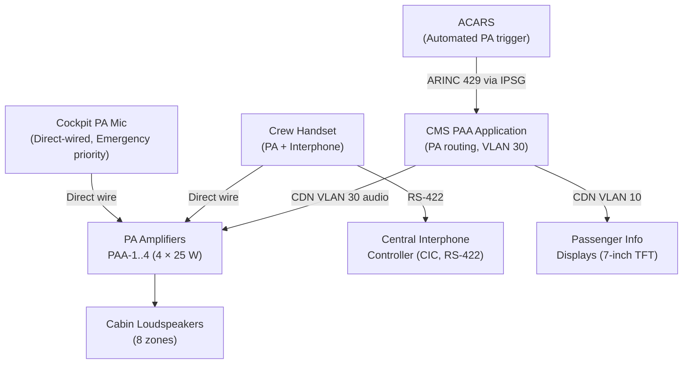
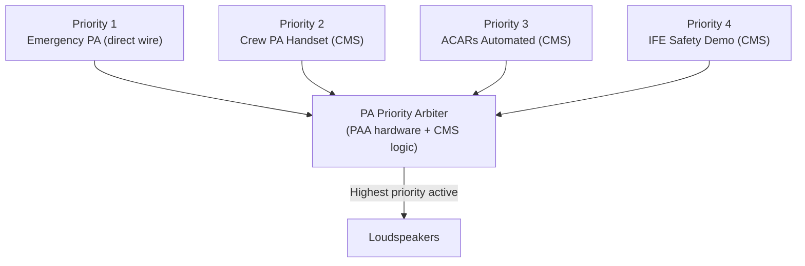
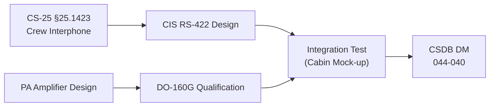

# ATLAS 040-049 · Section 04 · Subsection 044 · 040 — Cabin Information and Announcement Systems

## 0. Hyperlink Policy

All internal cross-references use relative Markdown links within the Q+ATLANTIDE CSDB repository. External regulatory citations in §19/§20 marked . Parent: [044-000 General](./044-000-Cabin-Systems-General.md).

---

## 1. Purpose

This document defines the Cabin Information and Announcement (CIA) systems for the AMPEL360E eWTW aircraft. CIA encompasses the Passenger Address (PA) audio system, Cabin Intercommunication System (CIS) for crew-to-crew and crew-to-cockpit communication, and Passenger Information Displays (PIDs) for visual cabin status information.

Key governance areas:
- PA amplifier and loudspeaker architecture (zone-based, 8 cabin zones).
- CIS handset and interphone circuit architecture.
- PID display content (fasten seatbelt, no smoking, flight information, safety briefing card QR).
- ACARS-to-PA interface for automated operational announcements.
- CS-25 §25.1423 crew interphone requirements.
- PA priority scheme (emergency > crew > ACARS auto > IFE audio fade).

---

## 2. Applicability

| Attribute | Value |
|-----------|-------|
| Aircraft Program | AMPEL360E eWTW |
| ATA Chapter | ATA 44.040 — Cabin Information and Announcement |
| Certification Basis | CS-25 §25.1423 (Crew Interphone); CS-25 §25.1329 |
| Applicable Standards | CS-25 §25.1423; DO-160G; ARINC 628 CDN |
| S1000D SNS | 044-040 |

---

## 3. System / Function Overview

**Passenger Address (PA):** Eight-zone audio PA system with 4 × 25 W class-D amplifiers driving overhead loudspeakers in each cabin zone. PA sources (in priority order): (1) flight deck microphone, (2) cabin crew handset, (3) ACARS-automated operational announcements, (4) IFE pre-recorded safety demo. PA is controlled by CMS (PAA application); a direct-wired crew PA bus bypasses CMS for emergency announcements.

**Cabin Intercommunication System (CIS):** Digital interphone between cockpit, forward cabin, mid cabin, and aft cabin stations. Each station has a handset and a 3-line LCD display showing call origin, channel status, and time. CIS is independent of CDN (dedicated RS-422 ring) for safety.

**Passenger Information Displays (PIDs):** 7-inch TFT displays in overhead panels every 6 rows showing: seatbelt sign icon (amber when active), no-smoking icon, current flight information (ETA, altitude, speed via CMS), and safety briefing card QR code. PID content is CDN-delivered by CMS.

---

## 4. Scope

### 4.1 In-Scope

- PA amplifier units (4 × 25 W) and cabin zone loudspeakers.
- Direct-wired crew PA bus (emergency PA path).
- ACARS-to-CMS automated announcement interface.
- CIS handsets and RS-422 interphone ring.
- PID display units and CDN content feed.
- CS-25 §25.1423 crew interphone compliance.
- PA priority scheme implementation.

### 4.2 Out-of-Scope

- IFE seat-back audio (see 044-050).
- SATCOM voice (see 044-050).
- Cockpit interphone (ATA 23).
- Cabin lighting (ATA 33).

---

## 5. Architecture Description

PA Amplifiers (PAA-1 through PAA-4) are located in the crown panel at STA 400, 700, 1000, and 1300, each powering 2 cabin zones. CMS sends PA audio and routing commands via CDN VLAN 30 (crew/PA VLAN). A direct-wired PA bus (28 V, audio line-level) connects the cockpit PA microphone input and forward cabin crew handset directly to all PAA units, bypassing CMS for emergency PA. The CIS operates on a standalone RS-422 ring with a Central Interphone Controller (CIC) in the avionics bay. PIDs are CDN-connected (VLAN 10) displays managed by CMS.

---

## 6. Functional Breakdown

| Function ID | Function | Description | Priority |
|-------------|----------|-------------|----------|
| F-044-04-01 | Emergency PA | Direct-wired cockpit/crew PA broadcast (bypass CMS) | 1 (highest) |
| F-044-04-02 | Crew PA Announcement | Crew handset PA via CMS VLAN 30 routing | 2 |
| F-044-04-03 | ACARS Automated PA | CMS-triggered pre-recorded operational announcements | 3 |
| F-044-04-04 | IFE Safety Demo | CMS-triggered IFE pre-recorded safety briefing (with PA audio fade of IFE) | 4 |
| F-044-04-05 | Crew Interphone | RS-422 CIS interphone between cockpit and cabin stations | — |
| F-044-04-06 | PID Display | CDN-delivered flight info and seatbelt/no-smoking icons on overhead displays | — |

---

## 7. Mermaid — CIA System Architecture

---

## 8. Mermaid — PA Priority Logic

---

## 9. Mermaid — Lifecycle Traceability

---

## 10. Interfaces

| Interface ID | Counterpart | Protocol | Direction | Data |
|-------------|-------------|----------|-----------|------|
| IF-044-04-01 | CMS PAA (044-020) | CDN VLAN 30 | Input | PA routing commands, audio data |
| IF-044-04-02 | CDN Switch (044-010) | Ethernet VLAN 10 | Input | PID display content |
| IF-044-04-03 | Cockpit PA microphone (ATA 23) | Direct wire (audio) | Input | Emergency PA audio |
| IF-044-04-04 | ACARS (ATA 23) | ARINC 429 via IPSG | Input | Automated announcement trigger |
| IF-044-04-05 | Attendant Panels (044-070) | RS-422 (CIS) | Bidirectional | Interphone calls |
| IF-044-04-06 | Electrical Bus (ATA 24) | 28 V DC | Input | PAA power feed |

---

## 11. Operating Modes

| Mode | Name | Description |
|------|------|-------------|
| M1 | Standby | PA/CIS powered; PIDs showing welcome screen |
| M2 | Normal Operations | PA available; PIDs showing flight info; seatbelt icon per sign state |
| M3 | Safety Demo | IFE safety demo playing; PA with audio fade for IFE |
| M4 | Emergency PA | Direct-wired emergency PA active; overrides all other sources |
| M5 | Ground | PIDs off or showing gate info; PA on-demand |

---

## 12. Monitoring and Diagnostics

- **PAA Health:** Each PAA unit self-monitors output power and temperature; fault reported to CMS via CDN at 1 s.
- **CIS Continuity:** CIC tests RS-422 ring at 30 s intervals; open circuit triggers CMC advisory "CIS FAULT".
- **PID Display Health:** PID units report display status to CMS at 5 s; failed display triggers CMC advisory.
- **PA Test:** CMS can initiate a silent test tone routing through all PA zones; zone-level pass/fail reported to CMS.

---

## 13. Maintenance Concept

| Task ID | Task | Interval | Access | Skill Level |
|---------|------|----------|--------|-------------|
| MC-044-04-01 | PA zone audio test (all zones) | A-Check | CMS test mode | Cabin Systems Technician |
| MC-044-04-02 | CIS interphone test (all stations) | A-Check | Handset-to-handset test | Cabin Systems Technician |
| MC-044-04-03 | PID display functional check | A-Check | Cabin walkthrough | Cabin Systems Technician |
| MC-044-04-04 | PAA unit replacement | On condition | Crown panel access | Avionics Technician |

---

## 14. S1000D / CSDB Mapping

| DMC | Title | Type | SNS |
|-----|-------|------|-----|
| QATL-A-044-40-00-00AAA-040A-A | CIA System Architecture Description | AMM | 044-040 |
| QATL-A-044-40-00-00AAA-520A-A | PA Zone Functional Test | AMM | 044-040 |
| QATL-A-044-40-00-00AAA-720A-A | PA Amplifier Replacement | AMM | 044-040 |
| QATL-A-044-40-00-00AAA-920A-A | CIA Fault Isolation Procedure | FIM | 044-040 |

---

## 15. Footprints

### 15.1 Physical Footprint

| Item | Qty | Mass (kg) | Location |
|------|-----|-----------|----------|
| PA Amplifier (PAA) | 4 | 0.9 each | Crown panel STA 400/700/1000/1300 |
| Central Interphone Controller (CIC) | 1 | 0.6 | Forward avionics bay |
| PID Display (7-inch TFT) |  | 0.3 each | Overhead panel (1 per 6 rows) |

### 15.2 Electrical / Data Footprint

| Parameter | Value |
|-----------|-------|
| PA total power (4 × PAA) | < 200 W (100 % duty cycle) |
| CIS RS-422 ring power | < 10 W |
| PID power per unit (PoE) | < 15 W |

### 15.3 Maintenance Footprint

| Parameter | Value |
|-----------|-------|
| PA zone test duration | < 10 min (all zones) |
| PAA MTBUR |  (target > 20 000 FH) |

### 15.4 Data Footprint

| Parameter | Value |
|-----------|-------|
| PID content update rate | On event (sign change, flight data update) |
| PA audio channel bandwidth | 300 Hz – 3.4 kHz (telephony quality) |

---

## 16. Safety and Certification

- **CS-25 §25.1423:** Crew interphone system must be capable of two-way voice communication between cockpit and all cabin crew stations; CIS RS-422 ring fulfils this requirement.
- **Emergency PA Independence:** Direct-wired emergency PA path does not depend on CMS, CDN, or any software; a single software failure cannot suppress emergency PA.
- **CS-25 §25.853:** All PAA units and CIC housings must meet flammability requirements.

---

## 17. Verification and Validation

| V&V ID | Requirement | Method | Status |
|--------|-------------|--------|--------|
| VV-044-04-01 | PA audible in all 8 zones (SPL ≥ 74 dB at seat level) | Test |  |
| VV-044-04-02 | Emergency PA not suppressable by CMS failure | Test |  |
| VV-044-04-03 | CIS two-way voice between all stations | Test |  |
| VV-044-04-04 | PA priority correctly overrides lower-priority sources | Test |  |
| VV-044-04-05 | PID content updates within 2 s of seatbelt sign change | Test |  |

---

## 18. Glossary

| Term | Acronym | Definition |
|------|---------|------------|
| Passenger Address | PA | Aircraft audio announcement system for broadcasting crew and automated messages to passengers |
| PA Amplifier | PAA | Zone PA amplifier unit; 25 W class-D; 2 cabin zones per unit |
| Cabin Intercommunication System | CIS | Dedicated RS-422 interphone system between cockpit and cabin crew stations |
| Central Interphone Controller | CIC | Hub unit managing CIS RS-422 ring and call routing between stations |
| Passenger Information Display | PID | Overhead 7-inch TFT display showing flight information, seatbelt sign, and safety briefing QR code |
| ACARS | — | Aircraft Communications Addressing and Reporting System; used for automated PA trigger messages |
| PA Priority | — | Hierarchical scheme giving emergency PA highest priority to prevent suppression during emergencies |
| IFE Audio Fade | — | Automatic reduction of IFE audio level when PA is active, ensuring PA is audible above IFE content |
| SPL | — | Sound Pressure Level (dB); measure of PA loudness; minimum 74 dB required at seat level for intelligibility |
| Safety Demo | — | Pre-recorded passenger safety briefing played via PA and IFE screens before each flight |

---

## 19. Citations

| Ref ID | Standard | Applicability | Status |
|--------|----------|---------------|--------|
| CIT-044-04-01 | EASA CS-25 §25.1423, Crew Interphone System | Crew interphone two-way communication requirement |  |
| CIT-044-04-02 | EASA CS-25 §25.853, Compartment Interiors | PAA/CIC flammability |  |
| CIT-044-04-03 | RTCA DO-160G | PAA/CIC environmental qualification |  |

---

## 20. References

| Ref ID | Document | Version | Status |
|--------|----------|---------|--------|
| REF-044-04-01 | Cabin Systems General (044-000) | 1.0 | Active |
| REF-044-04-02 | Cabin Core Network (044-010) | 1.0 | Active |
| REF-044-04-03 | AMPEL360E CIA Interface Control Document |  |  |

---

## 21. Open Issues

| Issue ID | Description | Owner | Status |
|----------|-------------|-------|--------|
| OI-044-04-01 | PA SPL target (74 dB) to be validated against cabin noise floor measurement | Q-AIR |  |
| OI-044-04-02 | PID content language support (number of languages, right-to-left script) | Q-AIR |  |
| OI-044-04-03 | ACARS automated announcement library content to be agreed with airline operations | Q-DATAGOV |  |

---

## 22. Change Log

| Version | Date | Author | Description | Status |
|---------|------|--------|-------------|--------|
| 1.0.0 | 2026-05-10 | Q-AIR | Initial baseline release |  |
