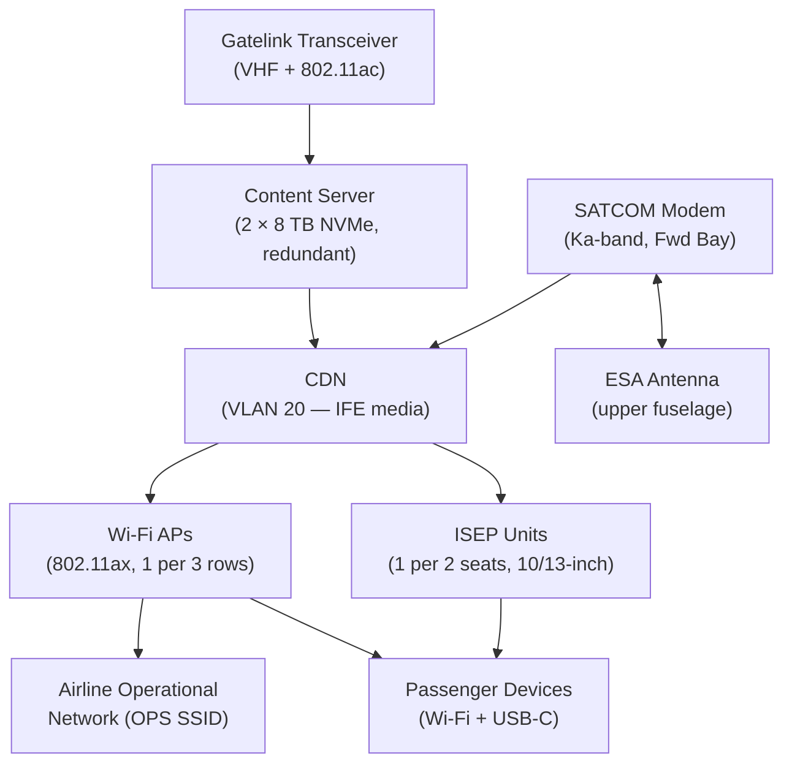
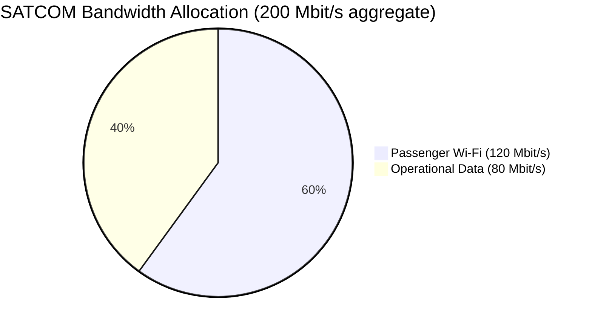
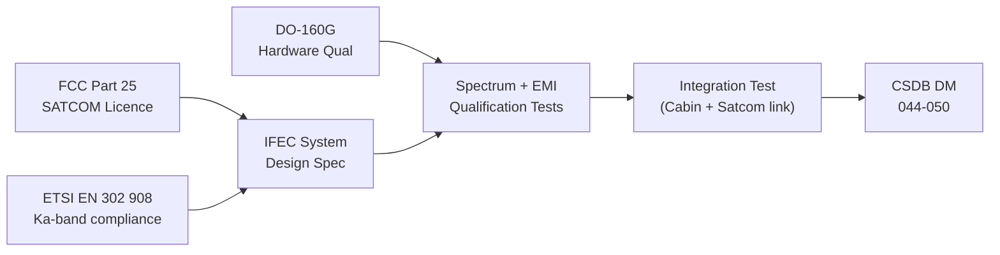

# ATLAS 040-049 · Section 04 · Subsection 044 · 050 — In-Flight Entertainment and Connectivity Interfaces

## 0. Hyperlink Policy

All internal cross-references use relative Markdown links within the Q+ATLANTIDE CSDB repository. External regulatory citations in §19/§20 marked . Parent: [044-000 General](./044-000-Cabin-Systems-General.md).

---

## 1. Purpose

This document defines the In-Flight Entertainment (IFE) and Connectivity interfaces for the AMPEL360E eWTW aircraft. The IFEC system provides: seat-back IFE screens with on-demand content, cabin Wi-Fi (802.11ax) and broadband satellite connectivity (Ka-band SATCOM), USB-C seat power, and the Gatelink operational data link at gate.

Key governance areas:
- In-Seat Entertainment and Power (ISEP) unit hardware.
- IFE content server and media streaming architecture.
- Ka-band SATCOM modem and antenna (high-gain stabilised).
- Cabin Wi-Fi access points (802.11ax, WPA3).
- USB-C seat charging (< 60 W per seat pair).
- Gatelink ground data link (VHF/Wi-Fi hybrid) for operational data and content loading.
- FCC/ETSI spectrum compliance.
- DO-160G qualification.

---

## 2. Applicability

| Attribute | Value |
|-----------|-------|
| Aircraft Program | AMPEL360E eWTW |
| ATA Chapter | ATA 44.050 — In-Flight Entertainment and Connectivity |
| Certification Basis | CS-25 §25.853 (flammability); CS-25 §25.1309 (equipment safety) |
| Applicable Standards | FCC Part 15/25; ETSI EN 302 908; DO-160G; IEEE 802.11ax (Wi-Fi 6); ARINC 628 |
| SATCOM Band | Ka-band (26.5–40 GHz) |
| Wi-Fi Standard | 802.11ax (Wi-Fi 6), WPA3 |
| S1000D SNS | 044-050 |

---

## 3. System / Function Overview

The IFEC system consists of three integrated subsystems:

**IFE (In-Flight Entertainment):**
- **ISEP Unit:** One per 2-seat pair (or 1 per seat in business class); 10-inch IPS touchscreen (economy) / 13-inch OLED (business); Android-based media player; streams content from content server via CDN VLAN 20.
- **Content Server:** Two redundant 8 TB NVMe servers in forward E-bay; pre-loaded with 2 000+ hours of audio-visual content; refreshed via Gatelink at every turnaround.

**Connectivity:**
- **SATCOM Gateway (Ka-band):** High-gain electronically steered antenna (ESA) on upper fuselage; Ka-band modem providing up to 200 Mbit/s aggregate downlink; shared between passenger Wi-Fi and operational data.
- **Wi-Fi Access Points:** 802.11ax (Wi-Fi 6) access points (1 per 3 rows), ceiling-mounted; passenger SSID (WPA3) and airline operational SSID (separate VLAN, WPA3-Enterprise).

**Seat Power:**
- **USB-C Charging:** Each ISEP unit provides 2 × USB-C ports (60 W max each, USB Power Delivery 3.0) for passenger device charging; powered from 28 V DC cabin bus.

**Gatelink:**
- **Gatelink Transceiver:** VHF data radio (VDR) + 802.11ac Wi-Fi ground link for bi-directional operational data exchange and IFE content loading when at gate; no cost to airline for operational data (regulatory carve-out).

---

## 4. Scope

### 4.1 In-Scope

- ISEP unit hardware (display, media player, USB-C ports).
- IFE content server hardware and CDN streaming.
- Ka-band SATCOM modem, ESA antenna, and installation.
- Cabin Wi-Fi access points and passenger/operational SSID management.
- USB-C seat power (60 W per seat pair).
- Gatelink transceiver (VHF + Wi-Fi).
- FCC/ETSI spectrum compliance for SATCOM and Wi-Fi.
- DO-160G qualification of IFEC hardware.

### 4.2 Out-of-Scope

- IFE content authoring and licensing (airline responsibility).
- SATCOM satellite booking and bandwidth contracts (airline responsibility).
- CDN backbone (see 044-010).
- CMS control application (see 044-020).
- PA audio (see 044-040).

---

## 5. Architecture Description

ISEP units are PoE++ powered via CDN VLAN 20; each ISEP streams content from the content server at up to 15 Mbit/s per screen. The SATCOM ESA antenna is controlled by the Ka-band modem in the forward avionics bay; the modem delivers a 200 Mbit/s aggregate IP pipe to the SATCOM gateway function running on the CDN. SATCOM capacity is dynamically shared: 60 % passenger connectivity, 40 % operational (ACARS high-bandwidth, QAR download). Wi-Fi access points create 2 SSIDs per AP: "AMPEL360E-PAX" (passenger, 100 Mbit/s shared) and "AMPEL360E-OPS" (airline operational, 10 Mbit/s dedicated). Gatelink activates automatically when aircraft is on ground and a certified Gatelink ground station is detected; it supports content loading at up to 1 Gbit/s Wi-Fi.

---

## 6. Functional Breakdown

| Function ID | Function | Description | Standard |
|-------------|----------|-------------|----------|
| F-044-05-01 | IFE Streaming | On-demand content streaming to ISEP screens via CDN VLAN 20 | ARINC 628 |
| F-044-05-02 | Content Server Redundancy | Dual NVMe server with automatic failover; < 3 s content resumption | Internal |
| F-044-05-03 | SATCOM Ka-band | 200 Mbit/s aggregate Ka-band IP connectivity | ETSI EN 302 908 |
| F-044-05-04 | Passenger Wi-Fi | 802.11ax WPA3 passenger SSID; shared 100 Mbit/s from SATCOM | IEEE 802.11ax |
| F-044-05-05 | Operational Wi-Fi | 802.11ax WPA3-Enterprise airline SSID; 10 Mbit/s dedicated | IEEE 802.11ax |
| F-044-05-06 | USB-C Seat Power | 60 W USB-PD 3.0 per seat pair via ISEP | USB-PD 3.0 |
| F-044-05-07 | Gatelink | VHF+Wi-Fi ground data link; up to 1 Gbit/s content loading | ARINC 631 |
| F-044-05-08 | Bandwidth Management | Dynamic SATCOM share (60/40 pax/ops); QoS policy per VLAN | CDN VLAN |

---

## 7. Mermaid — IFEC System Architecture

---

## 8. Mermaid — SATCOM Bandwidth Sharing

---

## 9. Mermaid — Lifecycle Traceability

---

## 10. Interfaces

| Interface ID | Counterpart | Protocol | Direction | Data |
|-------------|-------------|----------|-----------|------|
| IF-044-05-01 | CDN Switch (044-010) | Ethernet VLAN 20 | Bidirectional | IFE media streaming |
| IF-044-05-02 | CMS (044-020) | CDN VLAN 10 | Input | IFE power-on/off commands |
| IF-044-05-03 | SATCOM Antenna (ATA 23) | Ka-band RF | Bidirectional | Satellite IP link |
| IF-044-05-04 | Avionics network (ATA 31/34) | Via IPSG, VLAN 40 | Bidirectional | Operational ACARS high-BW data |
| IF-044-05-05 | Electrical Bus (ATA 24) | 28 V DC | Input | Content server, SATCOM modem power |
| IF-044-05-06 | Gatelink Ground Station | 802.11ac / VHF | Bidirectional | Content loading, operational data |

---

## 11. Operating Modes

| Mode | Name | Description |
|------|------|-------------|
| M1 | Ground/Gate | Gatelink active; content loading; IFE in demo loop; SATCOM standby |
| M2 | Taxi/Takeoff | IFE powered; safety demo playing; SATCOM connecting |
| M3 | Cruise | Full IFE on-demand; SATCOM active; Wi-Fi available; USB-C active |
| M4 | Descent/Landing | IFE powered down (CMS command); SATCOM may remain for ops |
| M5 | Emergency | IFE powered off; SATCOM may route MAYDAY data |

---

## 12. Monitoring and Diagnostics

- **Content Server Health:** Dual server mirror status reported to CMS at 5 s; failover < 3 s; CMS advisory "IFE SRV FAULT" if both fail.
- **SATCOM Link Quality:** SATCOM modem reports signal quality (Eb/No, bit error rate) to CMS at 1 s; advisory if BER > 10⁻⁶.
- **Wi-Fi AP Health:** Each AP reports association count and channel utilisation to CMS NMS; over-utilisation triggers band-steering advisory.
- **ISEP Fault:** ISEP units report health to CMS at 5 s; failed ISEP triggers CMC advisory (DAL D, no safety effect).

---

## 13. Maintenance Concept

| Task ID | Task | Interval | Access | Skill Level |
|---------|------|----------|--------|-------------|
| MC-044-05-01 | ISEP screen functional check | A-Check | Cabin walkthrough | Cabin Systems Technician |
| MC-044-05-02 | SATCOM link test (self-test via modem) | A-Check | SATCOM modem GSE | Avionics Technician |
| MC-044-05-03 | Content server storage capacity check | A-Check | CMS NMS terminal | Avionics Technician |
| MC-044-05-04 | Wi-Fi AP channel plan review | C-Check | NMS laptop | Avionics Engineer |
| MC-044-05-05 | Gatelink transceiver functional test | C-Check | Ground station + aircraft | Avionics Engineer |

---

## 14. S1000D / CSDB Mapping

| DMC | Title | Type | SNS |
|-----|-------|------|-----|
| QATL-A-044-50-00-00AAA-040A-A | IFEC System Architecture Description | AMM | 044-050 |
| QATL-A-044-50-00-00AAA-520A-A | IFEC Functional Test Procedure | AMM | 044-050 |
| QATL-A-044-50-00-00AAA-720A-A | ISEP Unit Replacement | AMM | 044-050 |
| QATL-A-044-50-00-00AAA-920A-A | IFEC Fault Isolation | FIM | 044-050 |

---

## 15. Footprints

### 15.1 Physical Footprint

| Item | Qty | Mass (kg) | Location |
|------|-----|-----------|----------|
| ISEP Unit (10-inch economy) |  | 1.2 each | Seat-back / armrest |
| Content Server (NVMe) | 2 | 2.0 each | Forward E-bay |
| SATCOM Ka-band Modem | 1 | 3.5 | Forward avionics bay |
| SATCOM ESA Antenna | 1 | 12.0 | Upper fuselage crown |
| Wi-Fi AP (802.11ax) |  | 0.4 each | Cabin ceiling (1 per 3 rows) |

### 15.2 Electrical / Data Footprint

| Parameter | Value |
|-----------|-------|
| SATCOM antenna power |  (target < 1 000 W) |
| ISEP power per unit (PoE++) | < 45 W |
| USB-C output max per seat pair | 2 × 60 W (120 W) |
| Content server power | < 50 W each |

### 15.3 Maintenance Footprint

| Parameter | Value |
|-----------|-------|
| SATCOM modem MTBUR |  (target > 20 000 FH) |
| Content server storage refresh | Every turnaround (Gatelink, 30-60 min) |
| ESA antenna inspection interval | 12C-Check |

### 15.4 Data Footprint

| Parameter | Value |
|-----------|-------|
| IFE content library size | 8 TB (2 × 8 TB mirrored) |
| SATCOM aggregate throughput | 200 Mbit/s downlink |
| Wi-Fi passenger SSID throughput | 100 Mbit/s shared |

---

## 16. Safety and Certification

- **CS-25 §25.853:** All ISEP units, content servers, and Wi-Fi APs must meet cabin materials flammability.
- **FCC Part 15/25 and ETSI EN 302 908:** Ka-band SATCOM emission levels must comply with FCC Part 25 for satellite operations and ETSI EN 302 908 for mobile satellite service; operational in international airspace subject to individual state authority permission.
- **Portable Electronic Devices (PEDs):** Passenger Wi-Fi and IFE are subject to airline PED policy; SATCOM avoids interference with safety avionics via CDN/avionics air-gap (IPSG).
- **USB-C Safety:** USB PD 3.0 controllers include over-voltage and over-temperature protection; compliant with IEC 62680-1-2.

---

## 17. Verification and Validation

| V&V ID | Requirement | Method | Status |
|--------|-------------|--------|--------|
| VV-044-05-01 | IFE content streams to all ISEP units simultaneously | Test |  |
| VV-044-05-02 | SATCOM aggregate throughput ≥ 200 Mbit/s at minimum elevation | Test |  |
| VV-044-05-03 | Wi-Fi coverage in all cabin zones (RSSI > −70 dBm at seat) | Test |  |
| VV-044-05-04 | USB-C charging 60 W (USB-PD 3.0 compliant) | Test |  |
| VV-044-05-05 | ETSI EN 302 908 spectrum compliance for SATCOM | Test |  |

---

## 18. Glossary

| Term | Acronym | Definition |
|------|---------|------------|
| In-Seat Entertainment and Power | ISEP | Seat-back or armrest unit providing IFE display, audio, and USB charging per seat pair |
| Electronically Steered Antenna | ESA | SATCOM antenna with no moving parts; uses phased-array elements for electronic beam steering toward satellite |
| Ka-band | — | Frequency band 26.5–40 GHz used for high-throughput satellite communication |
| Wi-Fi 6 | 802.11ax | Wi-Fi standard providing improved capacity and efficiency in dense passenger environments |
| WPA3 | — | Wi-Fi Protected Access 3; current generation Wi-Fi encryption standard for passenger (personal) and airline (enterprise) SSIDs |
| Gatelink | — | Ground-based data link (VHF/Wi-Fi) for bi-directional operational data and IFE content loading when aircraft is at gate |
| USB Power Delivery | USB-PD | USB charging protocol enabling up to 100 W (PD 3.0: 60 W per port in eWTW implementation) |
| Content Server | — | Aircraft-embedded NVMe storage server pre-loaded with IFE audio-visual content; refreshed via Gatelink |
| SSID | — | Service Set Identifier; network name broadcasted by Wi-Fi access point; eWTW has 2 SSIDs (PAX and OPS) per AP |
| Eb/No | — | Energy per bit to noise power spectral density ratio; measure of satellite link quality |

---

## 19. Citations

| Ref ID | Standard | Applicability | Status |
|--------|----------|---------------|--------|
| CIT-044-05-01 | ETSI EN 302 908, Mobile Satellite Services | Ka-band SATCOM spectrum compliance |  |
| CIT-044-05-02 | FCC Part 25, Satellite Communications Services | SATCOM licensing for US operations |  |
| CIT-044-05-03 | IEEE 802.11ax (Wi-Fi 6) | Passenger and operational Wi-Fi standard |  |
| CIT-044-05-04 | RTCA DO-160G | IFEC hardware environmental qualification |  |
| CIT-044-05-05 | IEC 62680-1-2, USB Type-C | Seat USB-C charging compliance |  |
| CIT-044-05-06 | EASA CS-25 §25.853 | ISEP and Wi-Fi AP flammability |  |

---

## 20. References

| Ref ID | Document | Version | Status |
|--------|----------|---------|--------|
| REF-044-05-01 | Cabin Systems General (044-000) | 1.0 | Active |
| REF-044-05-02 | Cabin Core Network (044-010) | 1.0 | Active |
| REF-044-05-03 | AMPEL360E IFEC Interface Control Document |  |  |

---

## 21. Open Issues

| Issue ID | Description | Owner | Status |
|----------|-------------|-------|--------|
| OI-044-05-01 | SATCOM provider selection (Inmarsat GX / Viasat-3 / SES) | Q-AIR |  |
| OI-044-05-02 | IFE ISEP screen size for business class (13-inch OLED vs 15-inch LCD) | Q-AIR |  |
| OI-044-05-03 | Gatelink ground network protocol finalisation (ARINC 631 vs AOA standard) | Q-DATAGOV |  |

---

## 22. Change Log

| Version | Date | Author | Description | Status |
|---------|------|--------|-------------|--------|
| 1.0.0 | 2026-05-10 | Q-AIR | Initial baseline release |  |
