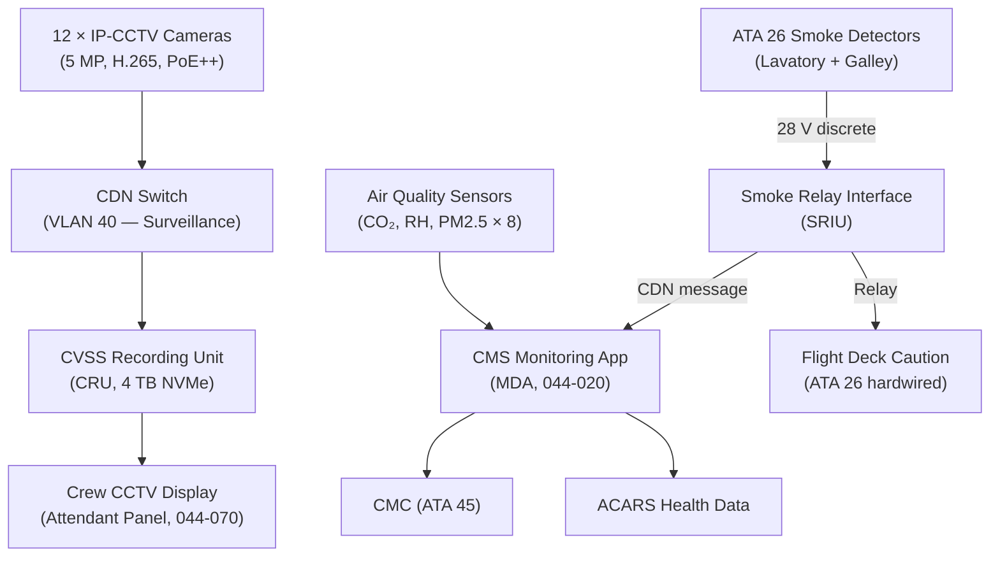
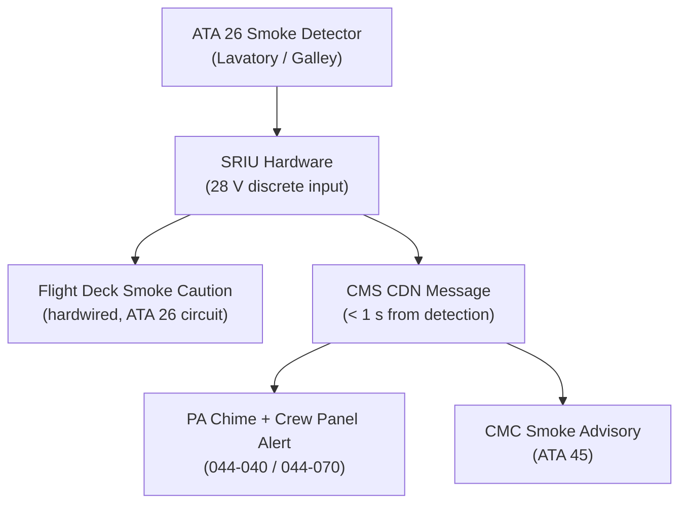
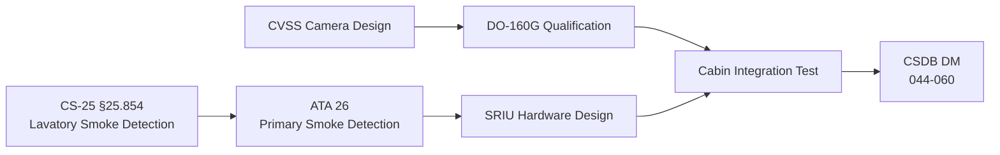

# ATLAS 040-049 · Section 04 · Subsection 044 · 060 — Cabin Monitoring and Surveillance Interfaces

## 0. Hyperlink Policy

All internal cross-references use relative Markdown links within the Q+ATLANTIDE CSDB repository. External regulatory citations in §19/§20 marked . Parent: [044-000 General](./044-000-Cabin-Systems-General.md).

---

## 1. Purpose

This document defines the Cabin Monitoring and Surveillance interfaces for the AMPEL360E eWTW aircraft. This subsystem encompasses: Cabin Video Surveillance System (CVSS/CCTV), lavatory and galley smoke detection relay (from ATA 26), cabin air quality monitoring (CO₂, humidity, particulates), and cabin temperature zone sensing (supplementary to ECS ATA 21).

Key governance areas:
- CCTV camera architecture (quantity, placement, resolution, recording).
- Smoke detection relay interface from ATA 26 to CMS and flight deck.
- Cabin air quality sensors (CO₂, RH, PM2.5) and CMS integration.
- Privacy compliance for CCTV (EU GDPR, airline policy).
- CS-25 §25.854 lavatory smoke detection requirements.
- CMC fault reporting for all monitoring subsystems.

---

## 2. Applicability

| Attribute | Value |
|-----------|-------|
| Aircraft Program | AMPEL360E eWTW |
| ATA Chapter | ATA 44.060 — Cabin Monitoring and Surveillance |
| Certification Basis | CS-25 §25.854 (Lavatory Smoke Detection) |
| Applicable Standards | CS-25 §25.854; DO-160G; EU GDPR (operational compliance) |
| Smoke Detection | CS-25 §25.854 compliant (ATA 26 primary, relay to CMS) |
| S1000D SNS | 044-060 |

---

## 3. System / Function Overview

**Cabin Video Surveillance System (CVSS):** Twelve IP-CCTV cameras (5 MP, H.265 compression, PoE++) located at: forward cabin door areas (4), mid-cabin galley (2), aft cabin (2), lavatory access corridor (2), and cockpit door (2). Video is recorded to CVSS Recording Unit (CRU, 4 TB NVMe) in the forward E-bay with a minimum 48-hour retention loop. Recording is continuous; crew can view live feeds on dedicated cabin crew display. CCTV data is NOT transmitted off-aircraft in flight; Gatelink download on ground is subject to airline security policy.

**Smoke Detection Relay:** Smoke detector signals from lavatory (ATA 26) and galley (ATA 26) are relayed to CMS at 28 V discrete level (< 1 s), triggering: PA chime, crew panel alert, and CMC advisory. The smoke detection primary certification path is ATA 26; the ATA 44 relay is a monitoring/notification function.

**Cabin Air Quality:** Eight NDIR CO₂ sensors (one per cabin zone) and 4 RH/PM2.5 sensors (forward, mid, aft, galley) sampled at 1 Hz. CMS logs data and advises ECS (ATA 21) if CO₂ > 2 500 ppm (advisory level). All data available on MCDU cabin page and ACARS health data stream.

---

## 4. Scope

### 4.1 In-Scope

- CVSS cameras (12 × IP-PoE++) and CRU recording unit.
- Smoke detection relay (ATA 26 primary → CMS interface).
- Cabin CO₂, RH, PM2.5 sensors and CMS data logging.
- Crew CCTV display at attendant panel.
- Privacy-by-design: no external transmission in flight; ground download policy.

### 4.2 Out-of-Scope

- Primary lavatory/galley smoke detection hardware and certification (ATA 26).
- ECS zone temperature control (ATA 21).
- Emergency lighting (ATA 33).
- CMS application software (see 044-020).

---

## 5. Architecture Description

CCTV cameras are PoE++ powered via CDN VLAN 40 (surveillance VLAN). Each camera streams H.265 1080p at 30 fps to the CRU via CDN. The CRU maintains a 48-hour circular buffer. The CMS can access live and recorded feeds via a REST API served by the CRU. Smoke detection relay inputs (28 V DC discrete from ATA 26 smoke detectors) are wired to a Smoke Relay Interface Unit (SRIU) in the forward avionics bay; SRIU converts the discrete signals to CDN messages for CMS while also closing a relay for flight deck caution (via ATA 26 warning circuit — safety path remains hardwired and independent of CMS).

---

## 6. Functional Breakdown

| Function ID | Function | Description | DAL |
|-------------|----------|-------------|-----|
| F-044-06-01 | CCTV Recording | Continuous H.265 1080p recording; 48-hour loop; PoE++ cameras | D |
| F-044-06-02 | CCTV Live View | Crew attendant panel live view via CMS REST API | D |
| F-044-06-03 | Smoke Relay (Lavatory) | CS-25 §25.854 smoke signal relayed to CMS; PA + crew panel + CMC | D |
| F-044-06-04 | Smoke Relay (Galley) | Galley smoke detector relay to CMS; PA + crew panel | D |
| F-044-06-05 | CO₂ Monitoring | NDIR CO₂ 1 Hz, advisory if > 2 500 ppm | D |
| F-044-06-06 | RH/PM2.5 Monitoring | Humidity and particulate monitoring; logged to CMS and ACARS | D |
| F-044-06-07 | Air Quality ACARS Report | Cabin air quality summary to ACARS health data stream at 10 min | D |

---

## 7. Mermaid — Cabin Monitoring Architecture

---

## 8. Mermaid — Smoke Relay Logic

---

## 9. Mermaid — Lifecycle Traceability

---

## 10. Interfaces

| Interface ID | Counterpart | Protocol | Direction | Data |
|-------------|-------------|----------|-----------|------|
| IF-044-06-01 | CDN Switch (044-010) | Ethernet VLAN 40 | Bidirectional | CCTV video streams |
| IF-044-06-02 | ATA 26 Smoke Detectors | 28 V DC discrete | Input | Smoke alarm signal (lavatory, galley) |
| IF-044-06-03 | CMS (044-020) | CDN VLAN 10 | Output | CO₂/smoke advisory, CCTV REST API |
| IF-044-06-04 | Attendant Panel (044-070) | CDN REST via CMS | Output | CCTV live view |
| IF-044-06-05 | CMC (ATA 45) | ARINC 429 via CMS | Output | Smoke relay fault, camera fault |
| IF-044-06-06 | ACARS (ATA 23) | Via CMS and IPSG | Output | Cabin air quality health data |
| IF-044-06-07 | ATA 26 Flight Deck circuit | 28 V relay | Output | Flight deck smoke caution (hardwired) |

---

## 11. Operating Modes

| Mode | Name | Description |
|------|------|-------------|
| M1 | Ground | CCTV recording; boarding surveillance active |
| M2 | Normal Flight | All monitoring active; CO₂/RH logged; CCTV continuous |
| M3 | Smoke Detected | Smoke relay active; PA chime; crew alert; CMC advisory |
| M4 | Ground Maintenance | CRU playback mode; software update via Gatelink |

---

## 12. Monitoring and Diagnostics

- **CCTV Camera Health:** Each camera reports status to CRU at 5 s; failed camera triggers CMC advisory "CCTV CAM FAULT".
- **CRU Storage Health:** CRU monitors NVMe health and storage utilisation; 90 % utilisation triggers advisory.
- **SRIU Health:** SRIU self-test at power-on and every 5 min; fault reported to CMS and CMC.
- **CO₂ Threshold:** CO₂ > 2 500 ppm for > 60 s triggers cabin crew advisory and ACARS report.

---

## 13. Maintenance Concept

| Task ID | Task | Interval | Access | Skill Level |
|---------|------|----------|--------|-------------|
| MC-044-06-01 | CCTV camera functional check (all cameras) | A-Check | Cabin walkthrough + CRU display | Cabin Systems Technician |
| MC-044-06-02 | Smoke relay test (SRIU functional test) | A-Check | SRIU test switch + crew panel | Avionics Technician |
| MC-044-06-03 | CO₂ sensor calibration check | C-Check | Calibration gas kit | Avionics Technician |
| MC-044-06-04 | CRU recording playback and storage check | A-Check | CRU terminal | Cabin Systems Technician |
| MC-044-06-05 | CCTV ground download (airline security) | Per flight | Gatelink laptop | Ground Crew |

---

## 14. S1000D / CSDB Mapping

| DMC | Title | Type | SNS |
|-----|-------|------|-----|
| QATL-A-044-60-00-00AAA-040A-A | Cabin Monitoring and Surveillance Architecture | AMM | 044-060 |
| QATL-A-044-60-00-00AAA-520A-A | CVSS and SRIU Functional Test | AMM | 044-060 |
| QATL-A-044-60-00-00AAA-720A-A | CCTV Camera Replacement | AMM | 044-060 |
| QATL-A-044-60-00-00AAA-920A-A | Cabin Monitoring Fault Isolation | FIM | 044-060 |

---

## 15. Footprints

### 15.1 Physical Footprint

| Item | Qty | Mass (kg) | Location |
|------|-----|-----------|----------|
| IP-CCTV Camera (5 MP) | 12 | 0.2 each | Cabin ceiling/door areas |
| CVSS Recording Unit (CRU) | 1 | 1.5 | Forward E-bay |
| Smoke Relay Interface Unit (SRIU) | 1 | 0.4 | Forward avionics bay |
| CO₂/RH/PM2.5 Sensor | 12 | 0.1 each | Crown panel (1 per zone) |

### 15.2 Electrical / Data Footprint

| Parameter | Value |
|-----------|-------|
| CCTV camera power (PoE++) | < 15 W each |
| CRU power | < 30 W |
| CO₂ sensor power | < 2 W each |
| CDN VLAN 40 bandwidth (CCTV) | < 500 Mbit/s aggregate (H.265 12 × 1080p/30fps) |

### 15.3 Maintenance Footprint

| Parameter | Value |
|-----------|-------|
| CRU recording retention | 48 hours (circular buffer) |
| CCTV camera MTBUR |  (target > 20 000 FH) |

### 15.4 Data Footprint

| Parameter | Value |
|-----------|-------|
| CRU storage capacity | 4 TB NVMe |
| CO₂ log sample rate | 1 Hz (8 sensors) |
| ACARS health report interval | 10 min |

---

## 16. Safety and Certification

- **CS-25 §25.854:** Lavatory smoke detection is a safety requirement; the primary detection is ATA 26 certified; the ATA 44 SRIU relay is an additional monitoring function and does not affect the ATA 26 safety certification.
- **Hardwired Flight Deck Relay:** The SRIU hardwired relay to the flight deck smoke caution light (ATA 26 circuit) is independent of CMS and CDN; software failure cannot suppress the flight deck smoke indication.
- **GDPR Compliance:** CCTV is operated under airline GDPR data protection policy; no passenger-identifiable video is transmitted off-aircraft in flight; ground download under data controller protocols.

---

## 17. Verification and Validation

| V&V ID | Requirement | Method | Status |
|--------|-------------|--------|--------|
| VV-044-06-01 | SRIU relay triggers flight deck caution within 1 s of smoke detection | Test |  |
| VV-044-06-02 | CMS receives smoke signal within 1 s of SRIU relay | Test |  |
| VV-044-06-03 | CCTV recording continuous at 1080p/30fps for all 12 cameras | Test |  |
| VV-044-06-04 | CRU retains 48 hours of video | Test |  |
| VV-044-06-05 | CO₂ sensor advisory triggers at > 2 500 ppm | Test |  |

---

## 18. Glossary

| Term | Acronym | Definition |
|------|---------|------------|
| Cabin Video Surveillance System | CVSS | Integrated IP-CCTV system for cabin security monitoring and recording |
| CVSS Recording Unit | CRU | NVMe storage unit recording all cabin CCTV streams in a 48-hour circular buffer |
| Smoke Relay Interface Unit | SRIU | Hardware unit converting ATA 26 smoke detector discrete signals to CDN messages and flight deck relay closure |
| NDIR CO₂ Sensor | — | Non-dispersive infrared sensor measuring cabin CO₂ concentration in ppm |
| Relative Humidity Sensor | RH | Capacitive humidity sensor measuring cabin moisture content as percentage |
| PM2.5 | — | Particulate matter < 2.5 µm diameter; cabin air quality parameter for fine particle concentration |
| Circular Buffer | — | Fixed-size storage scheme where new data overwrites the oldest data; ensures maximum retention within available storage |
| ACARS | — | Aircraft Communications Addressing and Reporting System; used for cabin air quality health data reporting |
| GDPR | — | General Data Protection Regulation (EU); governs collection, storage, and use of personal data including CCTV footage |
| H.265 | — | High Efficiency Video Coding (HEVC); video compression standard providing 50 % better compression than H.264 at same quality |

---

## 19. Citations

| Ref ID | Standard | Applicability | Status |
|--------|----------|---------------|--------|
| CIT-044-06-01 | EASA CS-25 §25.854, Lavatory Smoke Detection | Smoke detection relay certification basis |  |
| CIT-044-06-02 | RTCA DO-160G | CCTV/SRIU/sensor environmental qualification |  |
| CIT-044-06-03 | EU GDPR (Regulation 2016/679) | CCTV data handling compliance |  |

---

## 20. References

| Ref ID | Document | Version | Status |
|--------|----------|---------|--------|
| REF-044-06-01 | Cabin Systems General (044-000) | 1.0 | Active |
| REF-044-06-02 | Cabin Core Network (044-010) | 1.0 | Active |
| REF-044-06-03 | AMPEL360E Fire Protection (ATA 26) Smoke Detection System |  |  |

---

## 21. Open Issues

| Issue ID | Description | Owner | Status |
|----------|-------------|-------|--------|
| OI-044-06-01 | CCTV ground download security protocol and access control to be agreed with airline security | Q-DATAGOV |  |
| OI-044-06-02 | CO₂ advisory threshold (2 500 ppm) to be validated by ECS and human factors teams | Q-AIR |  |
| OI-044-06-03 | PM2.5 sensor inclusion decision pending regulatory guidance on cabin air quality monitoring | Q-AIR |  |

---

## 22. Change Log

| Version | Date | Author | Description | Status |
|---------|------|--------|-------------|--------|
| 1.0.0 | 2026-05-10 | Q+ Team/Amedeo Pelliccia + AI | Initial baseline release |  |
