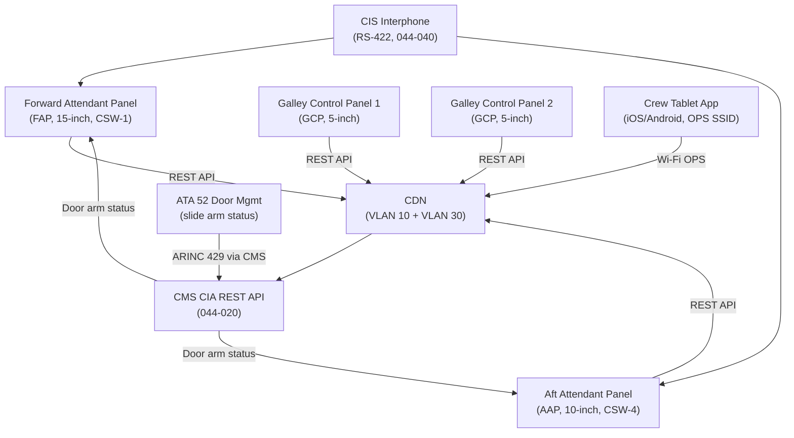
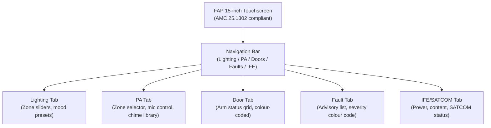
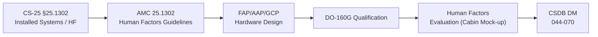

# ATLAS 040-049 · Section 04 · Subsection 044 · 070 — Cabin Crew Interfaces and Service Functions

## 0. Hyperlink Policy

All internal cross-references use relative Markdown links within the Q+ATLANTIDE CSDB repository. External regulatory citations in §19/§20 marked . Parent: [044-000 General](./044-000-Cabin-Systems-General.md).

---

## 1. Purpose

This document defines the Cabin Crew Interfaces and Service Functions for the AMPEL360E eWTW aircraft. Cabin crew interfaces are the physical and software means by which cabin crew control, monitor, and manage all ATA 44 cabin systems. They include: Forward Attendant Panel (FAP), Aft Attendant Panel (AAP), Galley Control Panels (GCPs), the CIS interphone handset at each station, and the integrated cabin crew tablet application (Crew Tablet App).

Key governance areas:
- FAP and AAP hardware design (touchscreen, controls, displays).
- GCP hardware at each galley station.
- Crew Tablet App architecture and CDN integration.
- Human factors requirements for crew interface design (CS-25 §25.1523; AMC 25.1302).
- CIS interphone integration at each crew station (see also 044-040).
- Door slide arming status display relay (ATA 52 interface).
- Service function control: lighting, PA, IFE, SATCOM session management.

---

## 2. Applicability

| Attribute | Value |
|-----------|-------|
| Aircraft Program | AMPEL360E eWTW |
| ATA Chapter | ATA 44.070 — Cabin Crew Interfaces |
| Certification Basis | CS-25 §25.1302 (Installed Systems); AMC 25.1302 |
| Applicable Standards | AMC 25.1302; CS-25 §25.1523; DO-160G; ARINC 628 |
| Human Factors | AMC 25.1302 crew interface design guidelines |
| S1000D SNS | 044-070 |

---

## 3. System / Function Overview

**Forward Attendant Panel (FAP):** Located at the forward galley station, the FAP is the primary crew control interface for all cabin systems. It is a 15-inch industrial touchscreen (IP54, anti-glare, sunlight readable) running the CMS Crew Interface Application (CIA REST API). Functions accessible: full cabin lighting control (zone-by-zone), PA control, door slide arm status display, cabin temperature zone requests, IFE and SATCOM management, CCTV live view, and cabin fault summary.

**Aft Attendant Panel (AAP):** 10-inch touchscreen at aft galley station; subset of FAP functions (lighting, PA, interphone, fault summary, CCTV aft view).

**Galley Control Panels (GCP):** Simple 5-inch touchscreens at each galley cart station; limited functions: galley zone lighting, PA zone, cart power management.

**Crew Tablet App:** iOS/Android tablet application (airline-supplied tablet) connecting to CMS via cabin Wi-Fi (Ops SSID); provides full FAP functionality in a mobile form factor; used for walk-around cabin management and pre/post-flight service checks. Tablet is not a required certified control; FAP is primary.

**Door Slide Arming Display:** FAP shows a colour-coded grid of all door slide arm states (ARMED/DISARMED) received from ATA 52 door management via CMS. This is a display/monitoring function only; arming is performed at each door (ATA 52).

---

## 4. Scope

### 4.1 In-Scope

- FAP hardware (15-inch touchscreen, IP54, DO-160G qualified).
- AAP hardware (10-inch touchscreen, IP54, DO-160G qualified).
- GCP hardware (5-inch touchscreen, IP54) at each galley station.
- CIS interphone handsets at FAP/AAP/GCP stations (see 044-040).
- Crew Tablet App architecture and CDN OPS SSID integration.
- Door slide arm status display relay (ATA 52 → CMS → FAP/AAP).
- AMC 25.1302 human factors design guidelines compliance.

### 4.2 Out-of-Scope

- Door slide arming hardware and control (ATA 52).
- Primary smoke detection hardware (ATA 26).
- CMS application software logic (see 044-020).
- PA amplifiers and speakers (see 044-040).
- IFE content server hardware (see 044-050).

---

## 5. Architecture Description

FAP and AAP are PoE++ powered (CDN VLAN 10) and communicate with CMS via the CIA REST API over the CDN. GCPs are PoE powered (CDN VLAN 10, < 15 W) with a simplified API for galley-specific functions. The Crew Tablet App connects via Wi-Fi OPS SSID (VLAN 30) to the same CMS CIA REST API server. All crew interface requests are authenticated with a cabin crew PIN (4-digit code, configurable per airline). The FAP and AAP are independently powered from separate CDN switches (CSW-1 and CSW-4 respectively) to ensure continued operation in degraded CDN states.

---

## 6. Functional Breakdown

| Function ID | Function | Description | Panel |
|-------------|----------|-------------|-------|
| F-044-07-01 | Cabin Lighting Control | Zone-by-zone LED dimming, mood preset selection | FAP, AAP, GCP |
| F-044-07-02 | PA Announcement Control | PA zone routing, announcement initiation, chime selection | FAP, AAP |
| F-044-07-03 | Door Slide Status Display | Read-only arm/disarm status grid for all doors | FAP, AAP |
| F-044-07-04 | Cabin Temperature Zones | Temperature setpoint request per zone (→ ECS ATA 21) | FAP |
| F-044-07-05 | IFE and SATCOM Management | IFE power-on/off, content selection, SATCOM session control | FAP, Tablet |
| F-044-07-06 | CCTV Live View | Live cabin camera view for crew monitoring | FAP (full), AAP (aft) |
| F-044-07-07 | Fault Summary Display | CMC-grade cabin fault summary; advisory messages | FAP, AAP |
| F-044-07-08 | Attendant Call Response | Call queue display and cancel; passenger map | FAP, AAP |
| F-044-07-09 | Galley Cart Power | Galley cart power socket on/off per cart bay | GCP |
| F-044-07-10 | Crew Tablet Walk-Around | Full FAP function set on mobile tablet via Wi-Fi OPS | Tablet |

---

## 7. Mermaid — Crew Interface Architecture

---

## 8. Mermaid — FAP Human Factors Layout

---

## 9. Mermaid — Lifecycle Traceability

---

## 10. Interfaces

| Interface ID | Counterpart | Protocol | Direction | Data |
|-------------|-------------|----------|-----------|------|
| IF-044-07-01 | CDN Switch (044-010) | Ethernet VLAN 10 (PoE++) | Bidirectional | FAP/AAP/GCP control and data |
| IF-044-07-02 | CMS CIA API (044-020) | CDN REST (JSON/HTTPS) | Bidirectional | All cabin control commands and status |
| IF-044-07-03 | CIS Interphone (044-040) | RS-422 | Bidirectional | Interphone calls |
| IF-044-07-04 | Door Management (ATA 52) | ARINC 429 via CMS | Input | Door slide arm status |
| IF-044-07-05 | Crew Tablet Wi-Fi | 802.11ax OPS SSID (VLAN 30) | Bidirectional | Full FAP function set (mobile) |
| IF-044-07-06 | CCTV/CRU (044-060) | CDN REST via CMS | Input | Live CCTV feed for crew display |

---

## 11. Operating Modes

| Mode | Name | Description |
|------|------|-------------|
| M1 | Ground/Boarding | FAP shows boarding mode; IFE demo; door status live |
| M2 | Pre-departure Check | Crew verifies door arm status on FAP; fault summary review |
| M3 | Normal Flight | Full cabin control active; walk-around via tablet |
| M4 | Emergency | FAP emergency PA shortcut; crew alert functions prioritised |
| M5 | Ground Maintenance | FAP in GMI mode; software update via Gatelink |

---

## 12. Monitoring and Diagnostics

- **FAP/AAP Health:** Each panel reports heartbeat to CMS at 5 s; missed heartbeat triggers CMC advisory "FAP FAULT" or "AAP FAULT".
- **PIN Authentication:** Three consecutive wrong PINs locks the panel for 60 s; CMC advisory logged.
- **REST API Availability:** CMS monitors CIA REST API response time (< 500 ms); latency advisory if > 1 s.
- **Tablet Session:** Tablet session logged (user, time, commands); log stored in CMS.

---

## 13. Maintenance Concept

| Task ID | Task | Interval | Access | Skill Level |
|---------|------|----------|--------|-------------|
| MC-044-07-01 | FAP/AAP functional check (all tabs, all functions) | A-Check | FAP/AAP at station | Cabin Systems Technician |
| MC-044-07-02 | GCP functional check (lighting, cart power) | A-Check | Galley station | Cabin Systems Technician |
| MC-044-07-03 | Door arm status display test (test via ATA 52 GSE) | C-Check | FAP + ATA 52 GSE | Avionics Technician |
| MC-044-07-04 | FAP/AAP touchscreen calibration | C-Check | FAP calibration mode | Cabin Systems Technician |
| MC-044-07-05 | Crew tablet app version update | A-Check | Tablet OTA via Gatelink | IT / Cabin Systems |

---

## 14. S1000D / CSDB Mapping

| DMC | Title | Type | SNS |
|-----|-------|------|-----|
| QATL-A-044-70-00-00AAA-040A-A | Cabin Crew Interface Architecture Description | AMM | 044-070 |
| QATL-A-044-70-00-00AAA-520A-A | FAP/AAP Functional Test | AMM | 044-070 |
| QATL-A-044-70-00-00AAA-720A-A | FAP/AAP Replacement | AMM | 044-070 |
| QATL-A-044-70-00-00AAA-920A-A | Crew Interface Fault Isolation | FIM | 044-070 |

---

## 15. Footprints

### 15.1 Physical Footprint

| Item | Qty | Mass (kg) | Location |
|------|-----|-----------|----------|
| Forward Attendant Panel (FAP, 15-inch) | 1 | 2.0 | Forward galley station |
| Aft Attendant Panel (AAP, 10-inch) | 1 | 1.2 | Aft galley station |
| Galley Control Panel (GCP, 5-inch) |  | 0.5 each | Each galley station |
| Crew Tablet (airline-supplied) | TBD | — | Crew rest area / airline cabin bag |

### 15.2 Electrical / Data Footprint

| Parameter | Value |
|-----------|-------|
| FAP power (PoE++) | < 60 W |
| AAP power (PoE++) | < 30 W |
| GCP power (PoE) | < 15 W each |

### 15.3 Maintenance Footprint

| Parameter | Value |
|-----------|-------|
| FAP/AAP touchscreen MTBUR |  (target > 25 000 FH) |
| Tablet app update method | OTA via Gatelink (airline MDM) |

### 15.4 Data Footprint

| Parameter | Value |
|-----------|-------|
| CIA REST API response time target | < 500 ms |
| Crew action log size per event | 32 bytes |
| Tablet session log retention | 90 days (airline MDM) |

---

## 16. Safety and Certification

- **CS-25 §25.1302 / AMC 25.1302:** FAP/AAP human factors design must follow AMC 25.1302 guidelines: task-based layout, colour coding consistent with CS-25 §25.1322, font legibility at arm's length (min 20 pt), alert hierarchy (warning/caution/advisory).
- **Door Slide Status Display:** The door arm status display on FAP is a monitoring function only; it does not control door arming (ATA 52). Discrepancy between displayed and actual status must trigger crew verification procedure.
- **Crew Tablet is Non-Required Equipment:** The crew tablet is airline-optional convenience equipment; all safety-critical crew interface functions are available on the certified FAP/AAP hardwired panels.

---

## 17. Verification and Validation

| V&V ID | Requirement | Method | Status |
|--------|-------------|--------|--------|
| VV-044-07-01 | FAP responds to all lighting zone commands within 500 ms | Test |  |
| VV-044-07-02 | Door slide arm status displayed correctly for all configurations | Test (ATA 52 GSE) |  |
| VV-044-07-03 | AMC 25.1302 human factors compliance assessment | Evaluation (cabin mock-up) |  |
| VV-044-07-04 | Crew tablet connects to OPS SSID and accesses all FAP functions | Test |  |
| VV-044-07-05 | PIN authentication locks after 3 wrong attempts | Test |  |

---

## 18. Glossary

| Term | Acronym | Definition |
|------|---------|------------|
| Forward Attendant Panel | FAP | Primary cabin crew control interface at forward galley station; 15-inch touchscreen with full CMS control access |
| Aft Attendant Panel | AAP | Secondary cabin crew control interface at aft galley; 10-inch touchscreen with subset of FAP functions |
| Galley Control Panel | GCP | Simplified 5-inch crew touchscreen at each galley station for local lighting and galley cart power control |
| Crew Interface Application | CIA | CMS REST API server providing all cabin control functions to FAP, AAP, GCP, and crew tablet |
| Crew Tablet App | — | iOS/Android application for airline-supplied tablet providing FAP function set via Wi-Fi OPS SSID |
| Mobile Device Management | MDM | Airline IT system managing airline-owned tablets (app updates, security policy, remote wipe) |
| OPS SSID | — | Cabin Wi-Fi SSID dedicated to airline operational devices (tablets, ground crew laptops); WPA3-Enterprise |
| Door Slide Arm Status | — | Current armed/disarmed state of each door escape slide, displayed on FAP as a colour-coded grid (safety-critical monitoring) |
| REST API | — | REpresentational State Transfer Application Programming Interface; web standard for command/data exchange between CMS and crew panels |
| AMC 25.1302 | — | EASA Acceptable Means of Compliance for CS-25 §25.1302 (Installed Systems and Equipment); defines human factors design guidelines |

---

## 19. Citations

| Ref ID | Standard | Applicability | Status |
|--------|----------|---------------|--------|
| CIT-044-07-01 | EASA CS-25 §25.1302, Installed Systems and Equipment | Crew interface certification basis |  |
| CIT-044-07-02 | EASA AMC 25.1302 | Human factors design guidelines for FAP/AAP/GCP |  |
| CIT-044-07-03 | EASA CS-25 §25.1322 | Alert colour hierarchy (warning/caution/advisory) on FAP |  |
| CIT-044-07-04 | RTCA DO-160G | FAP/AAP/GCP environmental qualification |  |

---

## 20. References

| Ref ID | Document | Version | Status |
|--------|----------|---------|--------|
| REF-044-07-01 | Cabin Systems General (044-000) | 1.0 | Active |
| REF-044-07-02 | Cabin Core Network (044-010) | 1.0 | Active |
| REF-044-07-03 | Cabin Crew Interface HF Evaluation Plan |  |  |

---

## 21. Open Issues

| Issue ID | Description | Owner | Status |
|----------|-------------|-------|--------|
| OI-044-07-01 | FAP/AAP vendor selection (Diehl / Panasonic / Thales) pending airline customisation review | Q-AIR |  |
| OI-044-07-02 | Crew tablet OS selection (iOS 18 vs Android 14) to be agreed with airline IT | Q-DATAGOV |  |
| OI-044-07-03 | PIN authentication policy (4-digit vs biometric) pending airline security policy input | Q-DATAGOV |  |

---

## 22. Change Log

| Version | Date | Author | Description | Status |
|---------|------|--------|-------------|--------|
| 1.0.0 | 2026-05-10 | Q+ Team/Amedeo Pelliccia + AI | Initial baseline release |  |
