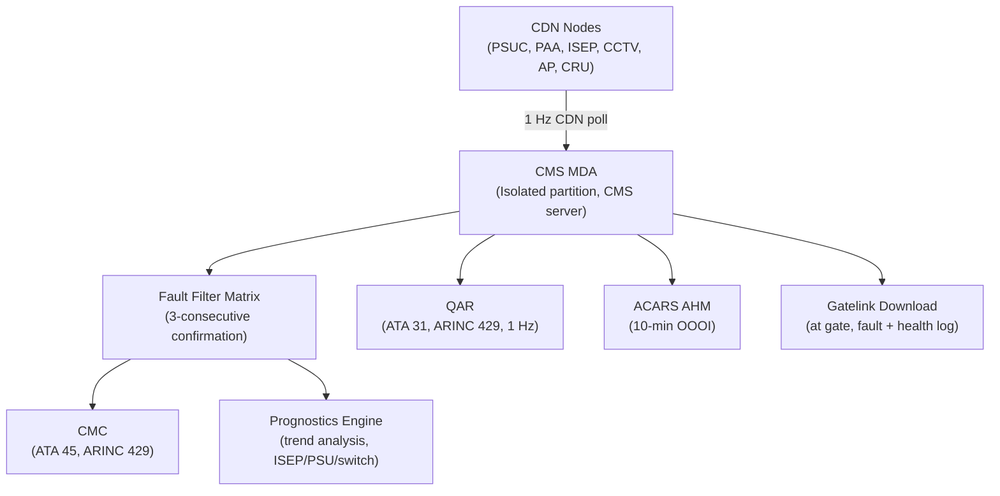
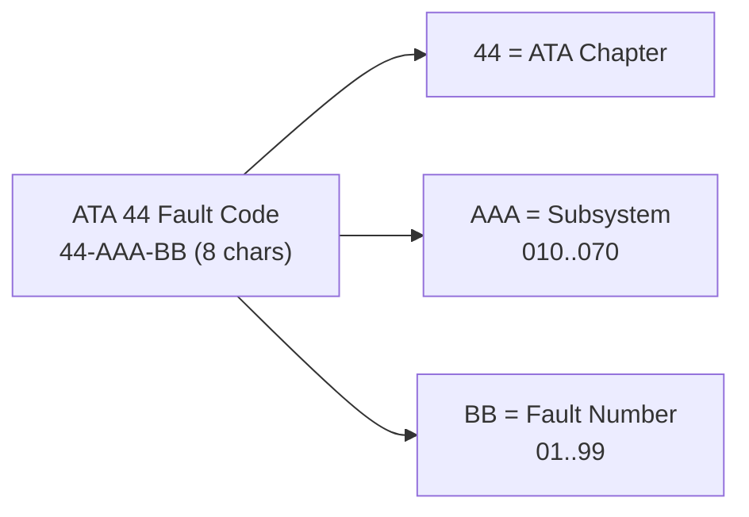
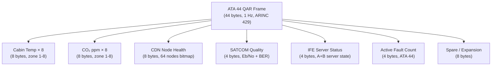

# ATLAS 040-049 · Section 04 · Subsection 044 · 080 — Cabin Systems Monitoring, Diagnostics and Control Interfaces

## 0. Hyperlink Policy

All internal cross-references use relative Markdown links within the Q+ATLANTIDE CSDB repository. External regulatory citations in §19/§20 marked . Parent: [044-000 General](./044-000-Cabin-Systems-General.md).

---

## 1. Purpose

This document defines the Cabin Systems Monitoring, Diagnostics, and Control Interfaces for the AMPEL360E eWTW aircraft — the consolidated health management, fault detection, fault isolation, and CMC reporting layer for all ATA 44 Cabin Systems subsystems (044-010 through 044-070). This is the programme-controlled diagnostics extension for ATA 44.

Key governance areas:
- Cabin Systems health monitoring architecture.
- CMC fault code schema for ATA 44 subsystems.
- BITE (Built-In Test Equipment) architecture across CDN nodes.
- QAR parameter set for cabin systems.
- Prognostics and predictive maintenance framework for cabin equipment.
- Ground Interface and Gatelink maintenance data download.
- Integration with Aircraft Health Monitoring (AHM) system (ATA 45).

---

## 2. Applicability

| Attribute | Value |
|-----------|-------|
| Aircraft Program | AMPEL360E eWTW |
| ATA Chapter | ATA 44.080 — Cabin Systems Monitoring, Diagnostics and Control Interfaces |
| Governance Classification | programme-controlled-diagnostics-extension |
| Certification Basis | CS-25 Amendment 28 (by inheritance from subsystems) |
| Applicable Standards | ARINC 624 (AHM); ARINC 664 (AFDX, indirect); DO-160G |
| S1000D SNS | 044-080 |

---

## 3. System / Function Overview

The ATA 44 Monitoring and Diagnostics layer comprises:

- **CMS Monitoring and Diagnostics Application (MDA):** Software module within CMS (see 044-020) continuously polling all CDN nodes, aggregating fault data, formatting CMC fault codes, and generating cabin health reports.
- **CDN Node BITE:** Each CDN-connected unit (PSUC, PAA, CCTV camera, ISEP, etc.) performs self-test at power-on (PUBIT) and continuous monitoring (CBIT) during operation.
- **CMC Interface:** CMS MDA formats and transmits ATA 44 fault codes to the Aircraft Central Maintenance Computer (CMC, ATA 45) via ARINC 429.
- **QAR Parameters:** CMS MDA records 44 QAR parameters (cabin temperature × 8, CO₂ × 8, CDN node health, SATCOM quality, IFE server status) at 1 Hz for flight recorder.
- **Gatelink Download:** CMS health logs, fault histories, and CCTV operational data downloaded via Gatelink at each turnaround.
- **AHM Integration:** CMS MDA sends ACARS-based cabin health reports at 10 min intervals for airline AHM ground system processing.

---

## 4. Scope

### 4.1 In-Scope

- CMS MDA software architecture (all 7 monitoring functions).
- CDN node PUBIT and CBIT definition for all ATA 44 units.
- CMC fault code schema (44-XXX-XX format, 8 characters).
- QAR parameter list (44 parameters, 1 Hz).
- Gatelink operational data download (faults, health logs).
- ACARS cabin health OOOI report format.
- Prognostics: predictive maintenance triggers for high-replacement-rate components (ISEP, PSU, CDN switches).

### 4.2 Out-of-Scope

- CMC hardware (ATA 45).
- QAR recorder hardware (ATA 31).
- AHM ground system (airline IT responsibility).
- Individual subsystem BITE design (covered in 044-010 through 044-070).

---

## 5. Architecture Description

The CMS MDA is an isolated software partition on the CMS server (microkernel hypervisor separation from entertainment applications). MDA receives health data from all CDN nodes via publish/subscribe bus (1 s CDN poll cycle). MDA correlates faults, applies a fault filter matrix (to suppress spurious transient faults < 3 consecutive occurrences), and formats CMC messages. QAR parameters are packaged into a 44-byte ATA 44 QAR frame at 1 Hz and transmitted to the QAR interface via ARINC 429. AHM reports are generated every 10 min as ACARS OOOI messages and transmitted via SATCOM/VHF. Gatelink downloads are initiated automatically by MDA when Gatelink availability is detected at gate arrival.

---

## 6. Functional Breakdown

| Function ID | Function | Description | DAL |
|-------------|----------|-------------|-----|
| F-044-08-01 | CDN Node CBIT | Continuous 1 Hz poll of all CDN nodes (PSUC, PAA, ISEP, CCTV, AP) | D |
| F-044-08-02 | Fault Filter and Correlation | 3-consecutive fault confirmation; suppress spurious; correlate related faults | D |
| F-044-08-03 | CMC Fault Reporting | 8-char ATA 44 fault codes via ARINC 429 to CMC (ATA 45) | D |
| F-044-08-04 | QAR Data Recording | 44 parameters at 1 Hz via ARINC 429 to QAR (ATA 31) | D |
| F-044-08-05 | ACARS AHM Report | 10-min OOOI cabin health message via SATCOM/VHF | D |
| F-044-08-06 | Gatelink Download | Automatic fault history and health log download at gate | D |
| F-044-08-07 | Prognostics | Trend analysis on ISEP/PSU/CDN switch health; pre-fault advisory | D |

---

## 7. Mermaid — Monitoring Architecture

---

## 8. Mermaid — CMC Fault Code Schema

---

## 9. Mermaid — QAR Parameter Frame

---

## 10. Interfaces

| Interface ID | Counterpart | Protocol | Direction | Data |
|-------------|-------------|----------|-----------|------|
| IF-044-08-01 | All CDN nodes (044-010 to 044-070) | CDN Ethernet VLAN 10 | Input | Node health, status, fault data |
| IF-044-08-02 | CMC (ATA 45) | ARINC 429 | Output | ATA 44 fault codes |
| IF-044-08-03 | QAR (ATA 31) | ARINC 429 | Output | 44-byte QAR frame at 1 Hz |
| IF-044-08-04 | ACARS (ATA 23) | Via CDN/SATCOM/VHF | Output | 10-min OOOI AHM health report |
| IF-044-08-05 | Gatelink (044-050) | 802.11ac / VHF | Output | Fault history and health log download |
| IF-044-08-06 | FAP / AAP (044-070) | CDN REST API | Output | Cabin fault summary for crew display |

---

## 11. Operating Modes

| Mode | Name | Description |
|------|------|-------------|
| M1 | Power-On PUBIT | All CDN nodes perform power-on BITE; MDA collects results; CMC report |
| M2 | Normal CBIT | Continuous 1 Hz CDN poll; fault filter active; QAR recording |
| M3 | Fault Active | Fault confirmed (3 consecutive); CMC fault code sent; crew advisory |
| M4 | Gatelink Download | Gate arrival detected; fault history auto-downloaded |
| M5 | Prognostics Alert | Trend threshold exceeded; pre-fault advisory to CMC and AHM |

---

## 12. Monitoring and Diagnostics

- **PUBIT:** All CDN nodes execute PUBIT at power-on (< 10 s); MDA collects pass/fail within 30 s; failed PUBIT triggers immediate CMC fault code.
- **CBIT Polling:** 1 Hz VLAN 10 poll; node non-response for 3 consecutive polls triggers fault.
- **Fault Filter:** Fault must be confirmed 3 consecutive times before CMC report (suppresses transient glitches).
- **Prognostics Thresholds:** ISEP screen brightness degradation > 20 % → advisory. CDN switch port error rate > 10⁻⁵ for > 24 h → advisory. PSU LED current deviation > 15 % → advisory.

---

## 13. Maintenance Concept

| Task ID | Task | Interval | Access | Skill Level |
|---------|------|----------|--------|-------------|
| MC-044-08-01 | CMC fault code review (ATA 44 faults) | A-Check | CMC terminal | Avionics Technician |
| MC-044-08-02 | QAR ATA 44 parameter readout and trend review | C-Check | QAR ground readout GSE | Avionics Engineer |
| MC-044-08-03 | Gatelink health log download review | Per flight | Gatelink laptop | Ground Crew |
| MC-044-08-04 | Prognostics advisory action and component replacement | On advisory | CMC terminal + component | Avionics Technician |
| MC-044-08-05 | Full PUBIT of all CDN nodes (ground power) | C-Check | CMS test mode | Avionics Engineer |

---

## 14. S1000D / CSDB Mapping

| DMC | Title | Type | SNS |
|-----|-------|------|-----|
| QATL-A-044-80-00-00AAA-040A-A | Cabin Systems Monitoring Architecture Description | AMM | 044-080 |
| QATL-A-044-80-00-00AAA-520A-A | Cabin BITE Full Test Procedure | AMM | 044-080 |
| QATL-A-044-80-00-00AAA-900A-A | Cabin Systems Fault Code Index | FIM | 044-080 |
| QATL-A-044-80-00-00AAA-920A-A | Cabin Systems Fault Isolation Master | FIM | 044-080 |

---

## 15. Footprints

### 15.1 Physical Footprint

| Item | Qty | Location |
|------|-----|----------|
| MDA software partition (hosted on CMS-A/B) | 2 | Fwd Bay / Aft E-Bay |

### 15.2 Electrical / Data Footprint

| Parameter | Value |
|-----------|-------|
| MDA CPU load on CMS server |  (target < 10 % of CMS total) |
| CDN VLAN 10 monitoring bandwidth |  (target < 2 Mbit/s) |
| ARINC 429 output rate (CMC + QAR) | 100 kbit/s (2 × ARINC 429 channels) |

### 15.3 Maintenance Footprint

| Parameter | Value |
|-----------|-------|
| PUBIT duration | < 30 s (all nodes) |
| Gatelink fault log download size |  (target < 10 MB per flight) |

### 15.4 Data Footprint

| Parameter | Value |
|-----------|-------|
| QAR parameters (ATA 44) | 44 parameters at 1 Hz |
| CMC fault code format | 8-char ATA standard (44-AAA-BB) |
| AHM report interval | 10 min (OOOI + cabin health) |
| Fault history retention (CMS) | 1 000 flight cycles (rolling) |

---

## 16. Safety and Certification

- **CS-25 §25.1309 (by inheritance):** Individual subsystem safety analyses cover ATA 44 subsystems; MDA monitoring does not create new failure modes.
- **CMC Interface Independence:** CMC fault reporting via ARINC 429 is independent of CDN; CDN failure does not prevent CMC reporting (ARINC 429 path from CMS server is direct, not CDN-routed).
- **QAR Compliance:** ATA 44 QAR parameters support operator fleet management; parameter definitions frozen at programme certification for traceability.

---

## 17. Verification and Validation

| V&V ID | Requirement | Method | Status |
|--------|-------------|--------|--------|
| VV-044-08-01 | All CDN nodes complete PUBIT within 30 s | Test |  |
| VV-044-08-02 | CMC fault code transmitted within 3 poll cycles of confirmed fault | Test |  |
| VV-044-08-03 | 44 QAR parameters recorded at 1 Hz without data loss | Test |  |
| VV-044-08-04 | AHM ACARS report generated every 10 min | Test |  |
| VV-044-08-05 | Fault filter correctly suppresses 1-2 transient faults; confirms on 3rd | Test |  |

---

## 18. Glossary

| Term | Acronym | Definition |
|------|---------|------------|
| Monitoring and Diagnostics Application | MDA | CMS software module (isolated partition) managing all ATA 44 health monitoring, fault reporting, QAR, and AHM functions |
| Power-Up Built-In Test | PUBIT | Self-test performed by each CDN node at power-on; results reported to MDA within 30 s |
| Continuous Built-In Test | CBIT | Ongoing self-test running during normal operation; reported to MDA at 1 Hz polling |
| Fault Filter Matrix | — | Software logic requiring 3 consecutive confirmed faults before CMC report, preventing spurious alerts |
| CMC Fault Code | — | 8-character ATA-format fault identifier (44-AAA-BB) transmitted to the Central Maintenance Computer |
| Prognostics | — | Predictive maintenance technique using sensor trend analysis to predict component failure before it occurs |
| OOOI | — | Out-Off-On-In; aircraft gate event timestamps used as ACARS report triggers (out = pushback, off = airborne, on = touchdown, in = gate) |
| AHM | — | Aircraft Health Monitoring; airline ground-based system receiving ACARS health data for fleet management |
| QAR Parameter | — | Quick Access Recorder parameter; specific data value recorded at defined sample rate for post-flight analysis |
| Eb/No | — | Energy per bit to noise spectral density ratio; measure of SATCOM digital link quality |

---

## 19. Citations

| Ref ID | Standard | Applicability | Status |
|--------|----------|---------------|--------|
| CIT-044-08-01 | ARINC 624, Design Guidance for On-Board Maintenance Systems | CMC interface and fault code format |  |
| CIT-044-08-02 | EASA CS-25 §25.1309, Equipment, Systems, and Installations | Safety analysis basis for MDA |  |
| CIT-044-08-03 | RTCA DO-160G | MDA hardware environmental qualification (CMS server) |  |

---

## 20. References

| Ref ID | Document | Version | Status |
|--------|----------|---------|--------|
| REF-044-08-01 | Cabin Systems General (044-000) | 1.0 | Active |
| REF-044-08-02 | Cabin Core Network (044-010) | 1.0 | Active |
| REF-044-08-03 | AMPEL360E ATA 45 CMC Interface Control Document |  |  |
| REF-044-08-04 | AMPEL360E QAR Parameter List |  |  |

---

## 21. Open Issues

| Issue ID | Description | Owner | Status |
|----------|-------------|-------|--------|
| OI-044-08-01 | QAR parameter list to be finalised with airline fleet management requirements | Q-DATAGOV |  |
| OI-044-08-02 | Prognostics threshold values (ISEP brightness, switch error rate) to be validated after component characterisation testing | Q-AIR |  |
| OI-044-08-03 | AHM ACARS message format to be agreed with airline AHM platform vendor | Q-DATAGOV |  |

---

## 22. Change Log

| Version | Date | Author | Description | Status |
|---------|------|--------|-------------|--------|
| 1.0.0 | 2026-05-10 | Q-DATAGOV | Initial baseline release (programme-controlled-diagnostics-extension) |  |
