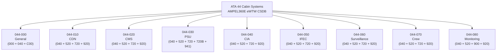
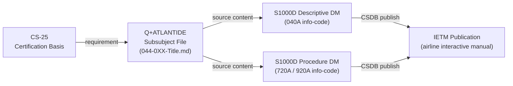
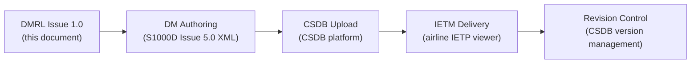

# ATLAS 040-049 · Section 04 · Subsection 044 · 090 — S1000D CSDB Mapping and Traceability

## 0. Hyperlink Policy

All internal cross-references use relative Markdown links within the Q+ATLANTIDE CSDB repository. External regulatory citations in §19/§20 marked . Parent: [044-000 General](./044-000-Cabin-Systems-General.md).

---

## 1. Purpose

This document provides the complete S1000D CSDB mapping, Data Module Requirements List (DMRL), and traceability matrix for the AMPEL360E eWTW ATA 44 Cabin Systems. It defines the Data Module Code (DMC) schema for all ATA 44 Data Modules, maps each Q+ATLANTIDE subsubject file (044-000 through 044-080) to its corresponding S1000D DMC, and provides the traceability chain from certification requirements to CSDB publication.

Key governance areas:
- DMC schema and SNS mapping for ATA 44.
- DMRL (Data Module Requirements List) for all 44 subsystems.
- Traceability: certification requirement → Q+ATLANTIDE file → S1000D DM → CSDB publication.
- S1000D Issue 5.0 compliance.
- CAGE code and model identification.
- Publication target: Interactive Electronic Technical Manual (IETM) delivery to airlines.

---

## 2. Applicability

| Attribute | Value |
|-----------|-------|
| Aircraft Program | AMPEL360E eWTW |
| ATA Chapter | ATA 44 — Cabin Systems |
| S1000D Issue | Issue 5.0 |
| CAGE Code |  |
| Model Identification Code | AMPEL360E |
| Publication Type | Interactive Electronic Technical Manual (IETM) / IETP |
| S1000D SNS | 044-090 |

---

## 3. DMC Schema for ATA 44

The Data Module Code (DMC) schema for AMPEL360E eWTW ATA 44 follows the S1000D Issue 5.0 SNS structure:

```
DMC-AMPEL360E-EWTW-044-{SNS-subsection}-{SNS-unit}-{Variant}{Info-code}{Item-location-code}
```

| Field | Value |
|-------|-------|
| Model ID | AMPEL360E-EWTW |
| System | 044 |
| Sub-system/variant | 00..70 (per subsubject) |
| Unit/assembly | 00 |
| Disassembly code | 00 |
| Disassembly code variant | A |
| Information code | See §6 |
| Information code variant | A |
| Item location code | A (airborne), D (descriptive), F (fault) |

---

## 4. Scope

### 4.1 In-Scope

- Full DMRL for all ATA 44 subsubjects (044-000 through 044-080).
- DMC to Q+ATLANTIDE file traceability table.
- Information code allocation (000/General, 040/Descriptive, 100/Maintenance, 200/Servicing, 300/Special Inspection, 400/Fault Isolation, 500/Removal/Installation, 600/Storage, 700/Replacement, 800/Repair, 900/Wiring, 940/IPD, 941/Illustrated Parts).
- S1000D Issue 5.0 compliance checklist.
- CAGE code and CSDB registration.

### 4.2 Out-of-Scope

- S1000D authoring tool selection (airline/OEM decision).
- IETM delivery platform configuration.
- Individual DM full text authoring (covered in respective 044-0XX files).

---

## 5. System / Function Overview

The S1000D CSDB for ATA 44 Cabin Systems is structured as a Data Module-based repository under the CSDB path:

```
CSDB/
└── 040-049_Avionica-Informacion-y-APU/
    └── 044_Cabin-Systems/
        └── DMC/
            ├── DMC-AMPEL360E-EWTW-044-00-00-00AAA-040A-D/  (General)
            ├── DMC-AMPEL360E-EWTW-044-10-00-00AAA-040A-D/  (CDN)
            ├── DMC-AMPEL360E-EWTW-044-20-00-00AAA-040A-D/  (CMS)
            ├── DMC-AMPEL360E-EWTW-044-30-00-00AAA-040A-D/  (PSU)
            ├── DMC-AMPEL360E-EWTW-044-40-00-00AAA-040A-D/  (CIA)
            ├── DMC-AMPEL360E-EWTW-044-50-00-00AAA-040A-D/  (IFEC)
            ├── DMC-AMPEL360E-EWTW-044-60-00-00AAA-040A-D/  (Surveillance)
            ├── DMC-AMPEL360E-EWTW-044-70-00-00AAA-040A-D/  (Crew)
            └── DMC-AMPEL360E-EWTW-044-80-00-00AAA-040A-D/  (Monitoring)
```

Each DMC folder contains: a Descriptive DM (040A) as the primary authoritative DM, plus satellite DMs for maintenance procedures (720A), fault isolation (920A), and illustrated parts (941A) as applicable.

---

## 6. DMRL — Data Module Requirements List

### 6.1 Complete DMRL for ATA 44

| DMC | Title | Info-Code | SNS | Q+ATL Source | Priority |
|-----|-------|-----------|-----|-------------|----------|
| QATL-A-044-00-00-00AAA-000A-A | Cabin Systems System Overview | 000 | 044-000 | 044-000-Cabin-Systems-General.md | High |
| QATL-A-044-00-00-00AAA-040A-D | Cabin Systems General Description | 040 | 044-000 | 044-000-Cabin-Systems-General.md | High |
| QATL-A-044-00-00-00AAA-C00A-A | Cabin Systems Glossary | C00 | 044-000 | 044-018 Glossary section | High |
| QATL-A-044-10-00-00AAA-040A-D | CDN Architecture Description | 040 | 044-010 | 044-010-Cabin-Core-Network.md | High |
| QATL-A-044-10-00-00AAA-520A-A | CDN Ring Failover Test | 520 | 044-010 | 044-010 §17 V&V | Medium |
| QATL-A-044-10-00-00AAA-720A-A | CDN Switch Replacement | 720 | 044-010 | 044-010 §13 Maintenance | Medium |
| QATL-A-044-10-00-00AAA-920A-A | CDN Fault Isolation | 920 | 044-010 | 044-010 §12 Monitoring | High |
| QATL-A-044-20-00-00AAA-040A-D | CMS Architecture Description | 040 | 044-020 | 044-020-CMS.md | High |
| QATL-A-044-20-00-00AAA-520A-A | CMS Application Functional Test | 520 | 044-020 | 044-020 §17 V&V | Medium |
| QATL-A-044-20-00-00AAA-720A-A | CMS Server Replacement | 720 | 044-020 | 044-020 §13 Maintenance | Medium |
| QATL-A-044-20-00-00AAA-920A-A | CMS Fault Isolation | 920 | 044-020 | 044-020 §12 Monitoring | High |
| QATL-A-044-30-00-00AAA-040A-D | PSU Architecture Description | 040 | 044-030 | 044-030-PSU.md | High |
| QATL-A-044-30-00-00AAA-520A-A | PSU LED and Call Functional Test | 520 | 044-030 | 044-030 §17 V&V | Medium |
| QATL-A-044-30-00-00AAA-720A-A | PSU Assembly Replacement | 720 | 044-030 | 044-030 §13 Maintenance | Medium |
| QATL-A-044-30-00-00AAA-720B-A | O₂ Mask Housing Reset/Repack | 720 | 044-030 | 044-030 §13 Maintenance | High |
| QATL-A-044-30-00-00AAA-941A-A | PSU Illustrated Parts | 941 | 044-030 | 044-030 §15 Footprints | Low |
| QATL-A-044-40-00-00AAA-040A-D | CIA System Architecture | 040 | 044-040 | 044-040-CIA.md | High |
| QATL-A-044-40-00-00AAA-520A-A | PA Zone Functional Test | 520 | 044-040 | 044-040 §17 V&V | Medium |
| QATL-A-044-40-00-00AAA-720A-A | PA Amplifier Replacement | 720 | 044-040 | 044-040 §13 Maintenance | Medium |
| QATL-A-044-40-00-00AAA-920A-A | CIA Fault Isolation | 920 | 044-040 | 044-040 §12 Monitoring | High |
| QATL-A-044-50-00-00AAA-040A-D | IFEC System Architecture | 040 | 044-050 | 044-050-IFEC.md | High |
| QATL-A-044-50-00-00AAA-520A-A | IFEC Functional Test | 520 | 044-050 | 044-050 §17 V&V | Medium |
| QATL-A-044-50-00-00AAA-720A-A | ISEP Unit Replacement | 720 | 044-050 | 044-050 §13 Maintenance | Medium |
| QATL-A-044-50-00-00AAA-920A-A | IFEC Fault Isolation | 920 | 044-050 | 044-050 §12 Monitoring | High |
| QATL-A-044-60-00-00AAA-040A-D | Cabin Monitoring Architecture | 040 | 044-060 | 044-060-Surveillance.md | High |
| QATL-A-044-60-00-00AAA-520A-A | CVSS and SRIU Functional Test | 520 | 044-060 | 044-060 §17 V&V | Medium |
| QATL-A-044-60-00-00AAA-720A-A | CCTV Camera Replacement | 720 | 044-060 | 044-060 §13 Maintenance | Low |
| QATL-A-044-60-00-00AAA-920A-A | Cabin Monitoring Fault Isolation | 920 | 044-060 | 044-060 §12 Monitoring | High |
| QATL-A-044-70-00-00AAA-040A-D | Cabin Crew Interface Architecture | 040 | 044-070 | 044-070-Crew.md | High |
| QATL-A-044-70-00-00AAA-520A-A | FAP/AAP Functional Test | 520 | 044-070 | 044-070 §17 V&V | Medium |
| QATL-A-044-70-00-00AAA-720A-A | FAP/AAP Replacement | 720 | 044-070 | 044-070 §13 Maintenance | Low |
| QATL-A-044-70-00-00AAA-920A-A | Crew Interface Fault Isolation | 920 | 044-070 | 044-070 §12 Monitoring | High |
| QATL-A-044-80-00-00AAA-040A-D | Cabin Monitoring Architecture | 040 | 044-080 | 044-080-Monitoring.md | High |
| QATL-A-044-80-00-00AAA-520A-A | Cabin BITE Full Test Procedure | 520 | 044-080 | 044-080 §17 V&V | High |
| QATL-A-044-80-00-00AAA-900A-A | Cabin Fault Code Index | 900 | 044-080 | 044-080 §6 Functional | High |
| QATL-A-044-80-00-00AAA-920A-A | Cabin Systems Fault Isolation Master | 920 | 044-080 | 044-080 §12 Monitoring | High |

**Total DMs in DMRL:** 36 Data Modules across 9 SNS nodes.

---

## 7. Mermaid — DMC Hierarchy



---

## 8. Mermaid — Traceability Chain



---

## 9. Mermaid — Lifecycle Traceability



---

## 10. Traceability Matrix: Q+ATLANTIDE ↔ S1000D

| Q+ATLANTIDE File | Section | S1000D DMC (Descriptive) | S1000D DMC (FIM) | S1000D DMC (Procedure) |
|-----------------|---------|--------------------------|-----------------|----------------------|
| 044-000-Cabin-Systems-General.md | §3–§6 | QATL-A-044-00…040A-D | — | — |
| 044-010-Cabin-Core-Network.md | §5–§6 | QATL-A-044-10…040A-D | QATL-A-044-10…920A-A | QATL-A-044-10…720A-A |
| 044-020-Cabin-Management-System-CMS.md | §5–§6 | QATL-A-044-20…040A-D | QATL-A-044-20…920A-A | QATL-A-044-20…720A-A |
| 044-030-Passenger-Service-Units.md | §5–§6 | QATL-A-044-30…040A-D | — | QATL-A-044-30…720A-A |
| 044-040-Cabin-Information-and-Announcement.md | §5–§6 | QATL-A-044-40…040A-D | QATL-A-044-40…920A-A | QATL-A-044-40…720A-A |
| 044-050-In-Flight-Entertainment-and-Connectivity.md | §5–§6 | QATL-A-044-50…040A-D | QATL-A-044-50…920A-A | QATL-A-044-50…720A-A |
| 044-060-Cabin-Monitoring-and-Surveillance.md | §5–§6 | QATL-A-044-60…040A-D | QATL-A-044-60…920A-A | QATL-A-044-60…720A-A |
| 044-070-Cabin-Crew-Interfaces.md | §5–§6 | QATL-A-044-70…040A-D | QATL-A-044-70…920A-A | QATL-A-044-70…720A-A |
| 044-080-Cabin-Systems-Monitoring.md | §5–§6 | QATL-A-044-80…040A-D | QATL-A-044-80…920A-A | QATL-A-044-80…520A-A |

---

## 11. S1000D Information Code Summary

| Info Code | Description | ATA 44 Usage |
|-----------|-------------|-------------|
| 000 | System Overview | 044-000 general introduction DM |
| 040 | Description | Primary descriptive DM for each SNS node |
| 520 | Adjust/Test | Functional test procedures (BITE, zone test) |
| 720 | Remove/Install | Component replacement procedures |
| 900 | Fault index | ATA 44 CMC fault code index |
| 920 | Fault isolation | FIM fault isolation procedures |
| 940 | Wiring | CDN wiring diagrams (future) |
| 941 | Illustrated Parts | PSU, ISEP part numbers and illustrations |
| C00 | Glossary | ATA 44 system glossary |

---

## 12. Monitoring and Diagnostics

- **DMRL Change Control:** Any change to an ATA 44 subsubject file triggers a DMRL review; changed DMs require revision increment and CSDB re-upload.
- **CSDB Version Tracking:** Each DM has an issue number and date in the CSDB; Q+ATLANTIDE version field must match CSDB DM issue number.
- **Applicability Management:** DMs are marked with applicability annotation (AMPEL360E-EWTW only at programme launch; future variants to be added).

---

## 13. Maintenance Concept

| Task ID | Task | Interval | Access | Skill Level |
|---------|------|----------|--------|-------------|
| MC-044-09-01 | DMRL annual review against updated subsystem documentation | Annually | Q-DATAGOV CSDB tool | Technical Publications Engineer |
| MC-044-09-02 | DM revision when associated Q+ATL file is updated | Per change | CSDB authoring tool | Technical Publications Engineer |
| MC-044-09-03 | IETM delivery verification (all DMs accessible in viewer) | Per CSDB release | IETM viewer | Technical Publications Engineer |

---

## 14. S1000D / CSDB Mapping

| DMC | Title | Type | SNS |
|-----|-------|------|-----|
| QATL-A-044-90-00-00AAA-040A-D | S1000D CSDB Mapping and DMRL | Administrative | 044-090 |

---

## 15. Footprints

### 15.1 Data Footprint

| Parameter | Value |
|-----------|-------|
| Total ATA 44 DMs in DMRL | 36 |
| S1000D Issue | Issue 5.0 |
| SNS nodes (ATA 44) | 9 (000, 010, 020, 030, 040, 050, 060, 070, 080) |
| Estimated CSDB DM total file size |  |
| IETM publication format | S1000D IETP / PDF backup |

---

## 16. Safety and Certification

- **S1000D Traceability:** The DMRL provides the complete traceability chain from CS-25 certification requirements through Q+ATLANTIDE design documentation to S1000D DMs and IETM delivery. This traceability chain supports CS-25 §21.31 compliance demonstration (Instructions for Continued Airworthiness, ICA).
- **ICA Compliance:** All maintenance procedure DMs (720A, 920A, 520A) constitute part of the Instructions for Continued Airworthiness required by CS-25 Appendix H; completeness of DMRL is a certification deliverable.

---

## 17. Verification and Validation

| V&V ID | Requirement | Method | Status |
|--------|-------------|--------|--------|
| VV-044-09-01 | All 36 DMRL DMs authored and uploaded to CSDB | Inspection |  |
| VV-044-09-02 | All DMs validate against S1000D Issue 5.0 schema | Tool validation |  |
| VV-044-09-03 | Traceability matrix complete (no orphaned DMs) | Inspection |  |
| VV-044-09-04 | IETM viewer displays all 36 DMs without error | Test |  |

---

## 18. Glossary

| Term | Acronym | Definition |
|------|---------|------------|
| Data Module | DM | Self-contained unit of technical information in S1000D; identified by a unique Data Module Code |
| Data Module Code | DMC | Unique identifier for an S1000D Data Module; encodes model, system, sub-system, info-code, and location code |
| Data Module Requirements List | DMRL | Programme document listing all required DMs for a system or aircraft; defines scope of technical documentation |
| Information Code | IC | Field in DMC defining the type of technical content (e.g., 040 = descriptive, 720 = remove/install, 920 = fault isolation) |
| Interactive Electronic Technical Manual | IETM | Electronic delivery format for aircraft maintenance documentation; enables search, cross-referencing, and multimedia |
| Component Maintenance Manual | CMM | Separate S1000D publication for component-level maintenance; referenced from AMM DMs |
| CSDB | — | Common Source Data Base; centralised repository for all S1000D Data Modules |
| SNS | — | Standard Numbering System; S1000D system-numbering scheme aligned with ATA Spec 100 chapter numbering |
| Instructions for Continued Airworthiness | ICA | CS-25 Appendix H requirement for maintenance documentation delivered with type-certified aircraft |
| Applicability Annotation | — | S1000D mechanism for marking DM applicability to specific aircraft variants or configurations |

---

## 19. Citations

| Ref ID | Standard | Applicability | Status |
|--------|----------|---------------|--------|
| CIT-044-09-01 | S1000D Issue 5.0, International specification for technical publications | DMRL structure, DMC schema, DM authoring |  |
| CIT-044-09-02 | EASA CS-25 Appendix H, Instructions for Continued Airworthiness | ICA completeness requirement; maintenance DMs as ICA |  |
| CIT-044-09-03 | ATA Spec 100 / iSpec 2200, ATA System/Chapter Numbering | ATA 44 chapter alignment with SNS |  |

---

## 20. References

| Ref ID | Document | Version | Status |
|--------|----------|---------|--------|
| REF-044-09-01 | Cabin Systems General (044-000) | 1.0 | Active |
| REF-044-09-02 | Q+ATLANTIDE template.md | 1.0 | Active |
| REF-044-09-03 | AMPEL360E CSDB Programme Plan |  |  |
| REF-044-09-04 | AMPEL360E Technical Publications Specification |  |  |

---

## 21. Open Issues

| Issue ID | Description | Owner | Status |
|----------|-------------|-------|--------|
| OI-044-09-01 | CAGE code allocation for AMPEL360E programme pending registration | Q-DATAGOV |  |
| OI-044-09-02 | CSDB platform selection (Flatirons CSDB / Oberon S1000D) pending programme decision | Q-DATAGOV |  |
| OI-044-09-03 | IETM viewer delivery format (S1000D IETP vs proprietary viewer) to be agreed with launch customer | Q-INDUSTRY |  |
| OI-044-09-04 | DM authoring tool selection and XML schema validation toolchain to be established | Q-DATAGOV |  |

---

## 22. Change Log

| Version | Date | Author | Description | Status |
|---------|------|--------|-------------|--------|
| 1.0.0 | 2026-05-10 | Q+ Team/Amedeo Pelliccia + AI | Initial DMRL and traceability baseline (programme-controlled-publication-and-traceability-extension) |  |
