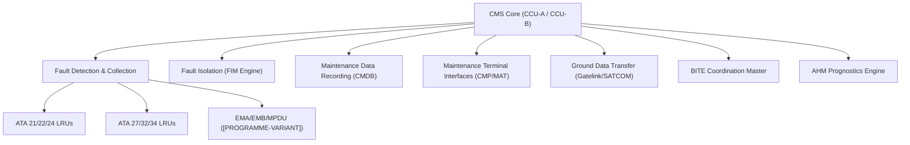
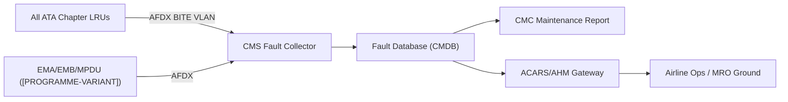
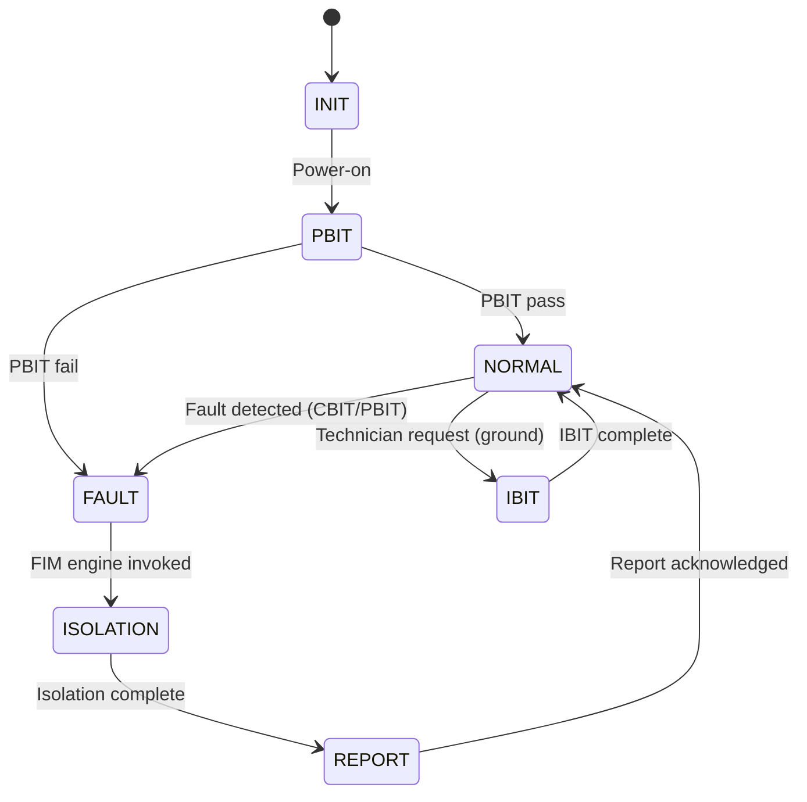

# ATLAS 040-049 · Section 04 · Subsection 045 · 000 — Central Maintenance System General

## 0. Hyperlink Policy

All internal cross-references use relative Markdown links within the Q+ATLANTIDE CSDB repository. External regulatory citations in §19/§20 are marked  where hyperlinks are pending. Parent context: [ATLAS 045 README](./README.md).

---

## 1. Purpose

ATA 45 — Central Maintenance System (CMS) defines the centralised fault management and maintenance information hub for the programme-defined aircraft type. This document governs CMS architecture, redundancy strategy, inter-system interfaces, and [PROGRAMME-VARIANT]-specific enhancements including full-electric propulsion fault coverage.

Key governance areas:
- CMS overall architecture and subsystem hierarchy.
- programme-defined aircraft type design enhancements (electric propulsion fault trees, EMA/EMB/MPDU BITE).
- Regulatory basis for CMS (DO-178C, DO-254, ARINC 664, ARINC 429, CS-25).
- Interface map to avionics (ATA 42), electrical (ATA 24), propulsion (ATA 72), and flight controls (ATA 27).
- Primary Q-Division assignment: Q-DATAGOV; Support: Q-AIR, Q-MECHANICS, Q-INDUSTRY.

---

## 2. Applicability

| Attribute | Value |
|-----------|-------|
| Aircraft Program | programme-defined aircraft type |
| ATA Chapter | ATA 45 — Central Maintenance System |
| Certification Basis | CS-25 Amendment 28; DO-178C; DO-254 |
| Applicable Standards | ARINC 664 P7; ARINC 429; ARINC 767; DO-160G; MSG-3 |
| Network Architecture | AFDX (ARINC 664 P7) primary; ARINC 429 legacy adapter |
| S1000D SNS | 045-000 |

---

## 3. Functional Description

The CMS for the programme-defined aircraft type is built around two redundant computing units — CMS Computing Unit A (CCU-A) and CMS Computing Unit B (CCU-B) — implementing DO-178C DAL C software on DO-254 DAL C hardware. The primary data network is AFDX (ARINC 664 Part 7), with an ARINC 429 legacy bus adapter for older LRU interfaces.

[PROGRAMME-VARIANT]-specific enhancements relative to a conventional aircraft:

- **Increased sensor count**: Full-electric propulsion introduces EMA, EMB, and MPDU sensor suites not present in conventional aircraft, expanding the BITE subscriber list by approximately 40%.
- **Elimination of pneumatic fault classes**: No bleed-air system removes pneumatic duct rupture, pre-cooler failure, and pack over-temperature fault trees from the FIM.
- **New EMA fault tree coverage**: Electro-Mechanical Actuator (EMA) and Electric Motor Bus (EMB) faults require novel fault isolation procedures integrated into the FIM database.

### Diagram 1: CMS Functional Hierarchy

---

## 4. System Architecture

The CMS architecture is structured around seven primary functions executed on the dual CCU:

1. **Fault detection and collection** from all LRU BITE subscribers via AFDX BITE VLAN.
2. **Fault isolation (FIM execution)** — MSG-3 decision trees encoded in XML, executed on the CCU fault isolation engine.
3. **Maintenance data recording (CMDB)** — 5-year fault history + 60-day high-rate parameter log on MDSU.
4. **Maintenance terminal interfaces (CMP/MAT)** — Cockpit Maintenance Panel and Maintenance Access Terminal.
5. **Ground data transfer** — Gatelink (ARINC 631), SATCOM AHM uplink, USB-C service panel.
6. **BITE coordination master** — Schedules PBIT, CBIT, IBIT, and MBIT across all ATA chapters.
7. **AHM prognostics** — Remaining-useful-life (RUL) models for key LRUs.

### Diagram 2: Fault Data Flow from LRUs to CMS

---

## 5. Components and Line-Replaceable Units

| LRU | Description | Qty | ATA Interface |
|-----|-------------|-----|---------------|
| CCU-A | CMS Computing Unit A (primary) | 1 | ATA 45 |
| CCU-B | CMS Computing Unit B (hot standby) | 1 | ATA 45 |
| AFDX Switch | ARINC 664 P7 network switch | 2 | ATA 42/45 |
| ARINC 429 Bus Adapter | Legacy bus interface for older LRUs | 1 | ATA 45 |
| MDSU | Maintenance Data Storage Unit (2 TB NVMe RAID-1) | 1 | ATA 45 |
| CMP | Cockpit Maintenance Panel (15-inch touch display) | 1 | ATA 45 |
| MAT | Maintenance Access Terminal (12-inch tablet) | 1 | ATA 45 |

---

## 6. Interfaces

| Interface | System | Protocol | Direction |
|-----------|--------|----------|-----------|
| AFDX BITE VLAN | All LRU subsystems | ARINC 664 P7 | Bidirectional |
| ARINC 429 | Legacy LRUs (ATA 31/34) | ARINC 429 | Rx |
| ACARS/AHM | Ground data link | ACARS (VHF/SATCOM) | Tx |
| Gatelink | MRO ground network | IEEE 802.11ax | Bidirectional |
| IMA (ATA 42) | Integrated Modular Avionics | AFDX | Bidirectional |
| LGCIU (ATA 32) | Air/ground discrete (IBIT inhibit) | Discrete wire | Rx |

---

## 7. Operations and Modes

| Mode | Trigger | Description |
|------|---------|-------------|
| PBIT | Power-on | Power-on built-in test across all subscriber LRUs (< 90 s) |
| CBIT | Continuous | 1 Hz continuous BIT polling during all flight phases |
| IBIT | Technician-initiated | Full-system test, ground-only, LGCIU gate enforced |
| MBIT | Maintenance initiated | 30-minute comprehensive maintenance test suite |
| NORMAL | Post-PBIT OK | Steady-state fault monitoring and data recording |
| FAULT | Fault detected | Active fault isolation and report generation |

### Diagram 3: CMS Lifecycle FSM

---

## 8. Performance and Budgets

| Parameter | Requirement | Status |
|-----------|-------------|--------|
| PBIT duration | < 90 s |  |
| CBIT poll rate | 1 Hz |  |
| Fault detection latency | < 2 s |  |
| Fault isolation time (FIM) | < 30 s per fault |  |
| ACARS AOG uplink latency | < 60 s |  |
| CMDB storage capacity | 5-year fault history |  |

---

## 9. Safety, Redundancy and Fault Tolerance

- **Dual CCU redundancy**: CCU-A active, CCU-B hot standby with 100 ms watchdog-driven failover.
- **AFDX dual-star topology**: Dual AFDX switches with redundant end-system ports on all critical LRUs.
- **MDSU RAID-1**: Mirrored NVMe storage prevents single-drive data loss.
- **DO-178C DAL C**: CMS software qualified at Design Assurance Level C per DO-178C.
- **DO-254 DAL C**: CCU hardware qualified at DAL C per DO-254.
- **Fault detection coverage**: Target > 99% FDE coverage for all monitored LRUs.

---

## 10. Environmental and Structural Constraints

| Constraint | Requirement | Standard |
|------------|-------------|----------|
| Operating temperature | −40 °C to +70 °C | DO-160G Cat B2 |
| Vibration | DO-160G Cat S | DO-160G §8 |
| Humidity | 95% RH non-condensing | DO-160G §6 |
| Altitude | 0–55,000 ft (unpressurised bay) | DO-160G §4 |
| EMI/EMC | DO-160G Cat M | DO-160G §21 |

---

## 11. Power and Cooling

| Parameter | Value | Status |
|-----------|-------|--------|
| CCU-A/B input voltage | 28 V DC |  |
| CCU-A/B power consumption | < 120 W each |  |
| MDSU power | < 25 W |  |
| Cooling method | Forced air (avionics bay HVAC) |  |
| Operating altitude (bay) | Pressurised avionics bay |  |

---

## 12. Software and Data Management

- **RTOS**: DO-178C DAL C real-time operating system (LynxOS-178 or VxWorks 653) partitioned per ARINC 653.
- **CMS application software**: DO-178C DAL C, partitioned on IMA cabinet (ATA 42 interface).
- **FIM database**: XML-encoded MSG-3 decision trees, versioned and signed (SHA-256).
- **Software update mechanism**: Gatelink or USB-C ground transfer; integrity check SHA-256; requires maintenance authorisation (LDAP-authenticated).
- **Data sovereignty**: All flight data stored on MDSU remains on aircraft until explicitly exported with authorised credentials.

---

## 13. Ground Support and Servicing

| Activity | Tool / Equipment | Procedure |
|----------|-----------------|-----------|
| CCU-A/B replacement | Standard avionics LRU tool kit | AMM ATA 45-10-01 |
| MDSU data export | USB-C laptop or Gatelink | AMM ATA 45-40-01 |
| FIM database update | Secure USB-C or Gatelink | AMM ATA 45-12-01 |
| IBIT execution | MAT or CMP | AMM ATA 45-50-01 |
| MBIT execution | MAT (30 min) | AMM ATA 45-50-02 |

---

## 14. Maintenance and Inspection

| Task | Interval | Reference |
|------|----------|-----------|
| CCU health check (CBIT review) | Per flight | CMC report auto-generated |
| MDSU SMART health review | Monthly | AMM ATA 45-40-05 |
| CCU-A/B functional test (MBIT) | 1000 FH or 12 months | AMM ATA 45-50-02 |
| FIM database currency check | OEM release cycle | AMM ATA 45-12-02 |
| Software version audit | At each major check | AMM ATA 45-12-03 |

---

## 15. Certification Basis

| Requirement | Regulation | Status |
|-------------|------------|--------|
| Airworthiness | CS-25 Amendment 28 |  |
| Software assurance | DO-178C DAL C |  |
| Hardware assurance | DO-254 DAL C |  |
| Environmental qualification | DO-160G |  |
| Network qualification | ARINC 664 P7 |  |
| Maintenance programme | MSG-3 |  |

---

## 16. Human Factors and Crew Interface

- CMP 15-inch touch display: FAA-accepted AMC 25.1302 human factors standard applied.
- MAT 12-inch tablet: Ergonomic design per CS-25.1302 and EASA CM-AS-002.
- Fault messages displayed in plain language with ATA chapter context.
- Colour coding: Red = AOG, Amber = non-AOG fault, Green = no fault, Grey = monitoring only.
- Accessibility: CMP and MAT display font minimum 12 pt; contrast ratio > 4.5:1.

---

## 17. Sustainability and ESG

| ESG Dimension | Initiative | Status |
|---------------|------------|--------|
| Carbon footprint | Electric propulsion fault coverage reduces unscheduled maintenance travel |  |
| Circular economy | CCU/MDSU designed for LRU-level replacement; no hazardous materials |  |
| Data efficiency | AHM uplink compression reduces SATCOM bandwidth by est. 40% |  |
| Supply chain | Conflict-minerals-free declaration required for CCU PCBs |  |

---

## 18. Glossary of Terms and Acronyms

| Term | Definition |
|------|------------|
| CMS | Central Maintenance System — the centralised fault management hub (ATA 45) |
| BITE | Built-In Test Equipment — self-test capability embedded in each LRU |
| FDE | Fault Detection and Exclusion — the ability to detect and isolate a faulty LRU |
| FIN | Fault Isolation Number — unique identifier for a fault in the FIM database |
| ACMF | Aircraft Condition Monitoring Function — ARINC 767 data monitoring application |
| ACARS | Aircraft Communications Addressing and Reporting System — data link for ground uplink |
| CMC | Central Maintenance Computer — colloquial synonym for CMS computing core |
| LRU | Line-Replaceable Unit — a modular avionics component removable on the flight line |
| AHM | Aircraft Health Monitoring — OEM and airline prognostics service |
| DFDR | Digital Flight Data Recorder — flight data recorder interfaced to CMS for correlation |

---

## 19. Citations and Standards

| Ref ID | Standard | Applicability | Status |
|--------|----------|---------------|--------|
| [S1] | DO-178C — Software Considerations in Airborne Systems | CMS software DAL C |  |
| [S2] | DO-254 — Design Assurance Guidance for Airborne Electronic Hardware | CCU hardware DAL C |  |
| [S3] | ARINC 664 Part 7 — Aircraft Data Network (AFDX) | CMS AFDX backbone |  |
| [S4] | ARINC 429 — Digital Information Transfer System | Legacy LRU interface |  |
| [S5] | DO-160G — Environmental Conditions and Test Procedures | CCU/MDSU qualification |  |
| [S6] | ATA MSG-3 — Maintenance Steering Group Logic | FIM decision trees |  |
| [S7] | ARINC 767 Supplement 3 — ACMF | Condition monitoring |  |
| [S8] | CS-25 Amendment 28 | Airworthiness basis |  |

---

## 20. References

| Ref ID | Document | Version | Status |
|--------|----------|---------|--------|
| [R1] | ATLAS 042 — Integrated Modular Avionics | 1.0.0 |  |
| [R2] | ATLAS 045-010 — Maintenance Computing and Core Processing | 1.0.0 |  |
| [R3] | ATLAS 045-020 — Fault Detection and Fault Reporting | 1.0.0 |  |
| [R4] | ATLAS 045-030 — Fault Isolation and Troubleshooting Logic | 1.0.0 |  |
| [R5] | ATLAS 045-040 — Maintenance Data Recording and History | 1.0.0 |  |
| [R6] | ATLAS 045-090 — S1000D CSDB Mapping and Traceability | 1.0.0 |  |
| [R7] | programme-defined aircraft type System Architecture Document | TBD |  |

---

## 21. Footprint / Component Mapping

### Physical Footprint

| LRU | Location | Bay | Rack Position |
|-----|----------|-----|---------------|
| CCU-A | Forward avionics bay | E/E Bay | Rack A, Slot 3 |
| CCU-B | Forward avionics bay | E/E Bay | Rack A, Slot 4 |
| MDSU | Forward avionics bay | E/E Bay | Rack B, Slot 1 |
| CMP | Cockpit | Maintenance panel | Overhead |
| MAT | Cockpit / avionics bay | Docking station | TBD |

### Electrical / Data Footprint

| LRU | Power Bus | Power (W) | Data Interface |
|-----|-----------|-----------|----------------|
| CCU-A | 28 V DC Bus 1 | < 120 | AFDX + ARINC 429 |
| CCU-B | 28 V DC Bus 2 | < 120 | AFDX + ARINC 429 |
| MDSU | 28 V DC Bus 1 | < 25 | NVMe (internal) |
| CMP | 28 V DC Maint Bus | < 30 | ARINC 429 + Ethernet |
| MAT | 28 V DC (docked) / Battery | < 20 | Ethernet 1000Base-T |

### Maintenance Footprint

| Activity | Access Required | Duration |
|----------|----------------|----------|
| CCU LRU replacement | E/E bay door | 30 min |
| MDSU replacement | E/E bay door | 20 min |
| CMP replacement | Cockpit overhead panel | 45 min |
| MBIT full test | MAT or CMP | 30 min |

---

## 22. Change Log

| Version | Date | Author | Description |
|---------|------|--------|-------------|
| 1.0.0 | 2026-05-10 | Q+ Team/Amedeo Pelliccia + AI | Initial baseline document creation |
