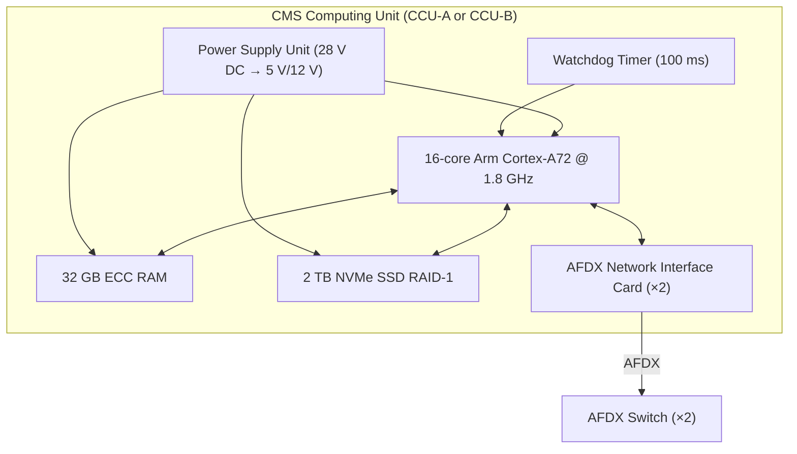
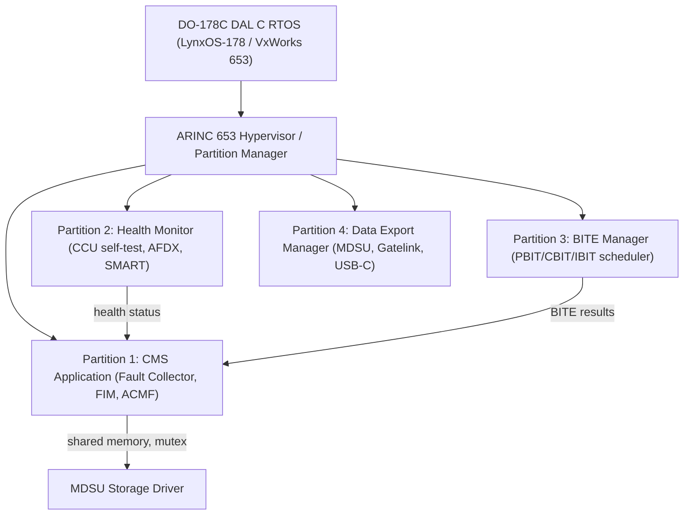
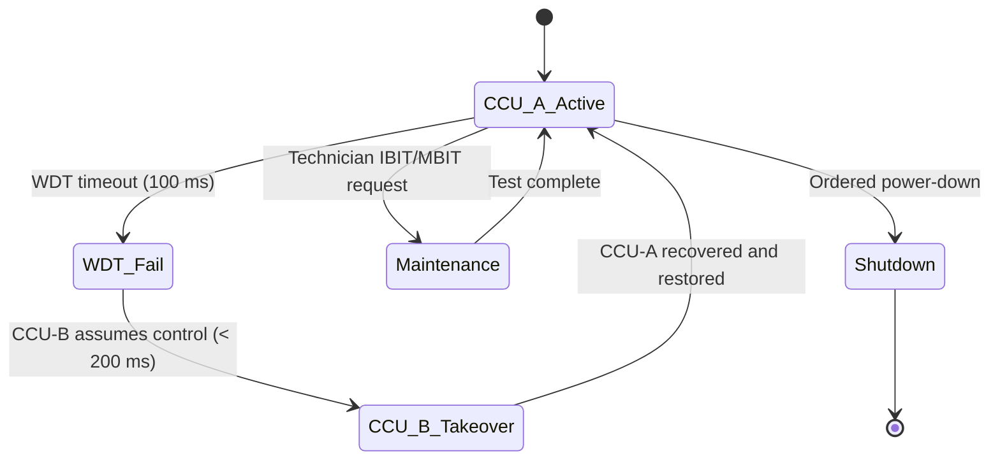

# ATLAS 040-049 · Section 04 · Subsection 045 · 010 — Maintenance Computing and Core Processing

## 0. Hyperlink Policy

All internal cross-references use relative Markdown links within the Q+ATLANTIDE CSDB repository. External regulatory citations in §19/§20 are marked  where hyperlinks are pending. Parent context: [ATLAS 045 README](./README.md) | [045-000 General](./045-000-Central-Maintenance-System-General.md).

---

## 1. Purpose

This document specifies the hardware and software architecture of the CMS Core Computing Unit (CCU) for the AMPEL360E eWTW. It covers dual-channel processor design, real-time operating system partitioning, storage architecture, network interface design, and the interface between the CMS computing core and the Integrated Modular Avionics (IMA) cabinet (ATA 42).

Key governance areas:
- CCU-A (primary) and CCU-B (hot standby) processor specification.
- DO-178C DAL C RTOS selection and ARINC 653 partitioning.
- NVMe RAID-1 storage qualification per DO-160G.
- AFDX network interface card specification.
- Watchdog timer and CRC health monitoring.

---

## 2. Applicability

| Attribute | Value |
|-----------|-------|
| Aircraft Program | AMPEL360E eWTW |
| ATA Chapter | ATA 45.010 — Maintenance Computing and Core Processing |
| Certification Basis | CS-25 Amendment 28; DO-178C DAL C; DO-254 DAL C |
| Applicable Standards | ARINC 664 P7; ARINC 653; DO-160G; MIL-STD-1553 (heritage reference) |
| RTOS | DO-178C DAL C (LynxOS-178 or VxWorks 653) |
| S1000D SNS | 045-010 |

---

## 3. Functional Description

The CMS Core Computing Unit (CCU) is a dual-channel processing system comprising CCU-A (primary channel) and CCU-B (hot standby channel). Each channel implements a 16-core Arm Cortex-A72 processor cluster running at 1.8 GHz, with 32 GB ECC RAM and a 2 TB SSD RAID-1 storage array.

The real-time operating system is a DO-178C DAL C qualified RTOS — either LynxOS-178 or VxWorks 653 — implementing ARINC 653 multi-application partitioning. The CMS occupies a dedicated partition on the IMA cabinet (ATA 42 interface), sharing the IMA cabinet with other avionics applications but with guaranteed CPU time allocation and memory protection.

Key processing functions executed on the CCU:
- **Fault collection daemon**: Polls AFDX BITE VLAN at 1 Hz; buffers BITE messages.
- **FIM engine**: Executes MSG-3 XML decision trees; typically < 10 ms per fault hypothesis.
- **ACMF sampler**: Samples 4096 aircraft parameters at up to 8 Hz.
- **Data export manager**: Manages MDSU write queue and Gatelink/USB-C export.
- **Health monitor**: Monitors CCU-A/B health, AFDX link status, SSD SMART.

### Diagram 1: CCU Hardware Block Diagram

---

## 4. System Architecture

### Dual-Channel Redundancy

CCU-A operates as the active channel. CCU-B operates in hot standby with a continuous mirrored state updated every 500 ms. A watchdog timer (WDT) with a 100 ms timeout monitors CCU-A health. On WDT timeout, CCU-B assumes control within 200 ms (failover time budget).

CRC health checks run at 1 Hz across the AFDX fabric, validating packet integrity between CCU and all subscriber LRUs. The AFDX switch fabric operates at 1 Gbit/s full-duplex, with dual-star topology providing path redundancy.

Storage is provided by a 2 TB NVMe M.2 RAID-1 SSD array, DO-160G vibration-qualified. Write endurance is rated for > 5 years at the specified write workload.

### Diagram 2: Software Partition Architecture

---

## 5. Components and Line-Replaceable Units

| LRU / Module | Description | Qty | Qualification |
|--------------|-------------|-----|---------------|
| CCU-A | Primary CMS computing channel (16-core, 32 GB ECC, 2 TB RAID-1) | 1 | DO-254 DAL C |
| CCU-B | Hot standby CMS computing channel (identical spec to CCU-A) | 1 | DO-254 DAL C |
| AFDX NIC | ARINC 664 P7 dual-port network interface card | 2 | ARINC 664 P7 |
| NVMe SSD Array | 2 TB RAID-1 NVMe M.2 SSD (DO-160G vibration qualified) | 1 per CCU | DO-160G Cat S |
| PSU | 28 V DC input power supply unit (CCU internal) | 1 per CCU | DO-160G |
| WDT Module | Hardware watchdog timer, 100 ms timeout | 1 per CCU | DO-254 DAL C |

---

## 6. Interfaces

| Interface | Counterpart | Protocol | Direction |
|-----------|-------------|----------|-----------|
| AFDX BITE VLAN | All LRU subscribers | ARINC 664 P7 | Bidirectional |
| IMA cabinet bus | ATA 42 IMA | AFDX / backplane | Bidirectional |
| MDSU storage | Internal NVMe RAID-1 | NVMe (PCIe Gen 4) | Bidirectional |
| CCU-A ↔ CCU-B sync | Standby channel | Dedicated sync link | Bidirectional |
| Power | 28 V DC Bus 1/2 | Hardwired | Rx |
| LGCIU discrete | ATA 32 LGCIU | Discrete wire | Rx |

---

## 7. Operations and Modes

| Mode | CCU State | Description |
|------|-----------|-------------|
| INIT | Boot | POST, RTOS load, partition init (< 30 s) |
| PBIT | Active (A) / Standby (B) | Power-on BIT of all CCU subsystems |
| NORMAL | Active A, Standby B | Normal fault monitoring and data recording |
| FAILOVER | B assumes active | WDT timeout on A; B takes control (< 200 ms) |
| MAINTENANCE | Active, IBIT/MBIT | CCU executes maintenance test suite |
| SHUTDOWN | Orderly power-down | State sync to MDSU, graceful RTOS shutdown |

### Diagram 3: Dual-Channel Redundancy FSM

---

## 8. Performance and Budgets

| Parameter | Requirement | Status |
|-----------|-------------|--------|
| CPU clock | 1.8 GHz (16-core Arm Cortex-A72) |  |
| RAM | 32 GB ECC |  |
| Storage | 2 TB NVMe RAID-1 |  |
| WDT timeout | 100 ms |  |
| Failover time (A→B) | < 200 ms |  |
| AFDX bandwidth | 1 Gbit/s per switch port |  |
| Boot time (INIT→NORMAL) | < 60 s |  |
| CRC health check rate | 1 Hz |  |

---

## 9. Safety, Redundancy and Fault Tolerance

- **Hot standby CCU-B**: State mirrored every 500 ms; failover transparent to maintenance terminal users.
- **ECC RAM**: Single-bit error correction, double-bit error detection; prevents silent data corruption.
- **RAID-1 NVMe**: Any single SSD failure results in zero data loss; maintenance alert triggered.
- **ARINC 653 partitioning**: Temporal and spatial isolation between CMS partitions; a fault in the health monitor partition cannot corrupt the FIM engine partition.
- **Watchdog independence**: WDT hardware is independent of the CPU; cannot be masked by software fault.

---

## 10. Environmental and Structural Constraints

| Constraint | Requirement | Standard |
|------------|-------------|----------|
| Operating temperature | −40 °C to +70 °C | DO-160G Cat B2 |
| Vibration (operational) | DO-160G Category S | DO-160G §8 |
| Shock | DO-160G §7 | DO-160G |
| Humidity | 95% RH non-condensing | DO-160G §6 |
| Altitude (unpressurised) | 0–55,000 ft | DO-160G §4 |
| EMI/EMC | DO-160G Cat M | DO-160G §21 |

---

## 11. Power and Cooling

| Parameter | Value | Status |
|-----------|-------|--------|
| CCU-A input voltage | 28 V DC Bus 1 |  |
| CCU-B input voltage | 28 V DC Bus 2 |  |
| CCU power consumption | < 120 W each |  |
| Cooling method | Forced air (avionics bay HVAC) |  |
| Operating temperature (junction) | < 85 °C |  |

---

## 12. Software and Data Management

- **RTOS**: DO-178C DAL C — LynxOS-178 or VxWorks 653; selection subject to programme decision.
- **ARINC 653**: Multi-application partitioning with guaranteed CPU time slots per partition.
- **Software configuration control**: All binary images version-controlled, SHA-256 signed; loaded via authorised ground update only.
- **Data integrity**: MDSU write operations include CRC-32 per record; silent data corruption detection.
- **Partition memory maps**: Static memory allocation per ARINC 653; no dynamic heap allocation in DAL C partitions.

---

## 13. Ground Support and Servicing

| Activity | Tool / Equipment | Procedure |
|----------|-----------------|-----------|
| CCU-A/B replacement | LRU tool kit; ESD strap | AMM ATA 45-10-01 |
| RTOS version verification | MAT or CMP | AMM ATA 45-12-01 |
| AFDX NIC replacement | LRU tool kit | AMM ATA 45-10-02 |
| NVMe SSD SMART check | MAT diagnostic app | AMM ATA 45-40-05 |
| Watchdog timer test | IBIT (ground only) | AMM ATA 45-50-01 |

---

## 14. Maintenance and Inspection

| Task | Interval | Reference |
|------|----------|-----------|
| CCU-A/B health check (CHM review) | Per flight | CMC auto-report |
| AFDX link health check | Per flight | CMC auto-report |
| SSD SMART health review | Monthly | AMM ATA 45-40-05 |
| CCU functional test (MBIT) | 1000 FH or 12 months | AMM ATA 45-50-02 |
| RTOS software audit | At each major check | AMM ATA 45-12-03 |

---

## 15. Certification Basis

| Requirement | Regulation | Status |
|-------------|------------|--------|
| Software assurance (DAL C) | DO-178C |  |
| Hardware assurance (DAL C) | DO-254 |  |
| RTOS qualification | DO-178C DAL C RTOS cert package |  |
| Environmental qualification | DO-160G |  |
| Partitioning assurance | ARINC 653 + DO-178C §12 |  |

---

## 16. Human Factors and Crew Interface

- CCU failover is transparent to CMP and MAT users — maintenance terminals reconnect within 500 ms.
- CCU health status displayed on CMP as a discrete indicator (green/amber/red).
- MAT diagnostic application provides detailed CCU health metrics on demand.
- RTOS partition status accessible to maintenance technicians via MAT (not to flight crew).

---

## 17. Sustainability and ESG

| ESG Dimension | Initiative | Status |
|---------------|------------|--------|
| Energy efficiency | Arm Cortex-A72 selected for performance/watt ratio |  |
| Longevity | CCU designed for 20-year service life (NVMe SSD endurance rated) |  |
| Repairability | LRU-level replacement; no board-level repair required |  |
| Hazardous materials | RoHS compliant PCBs; REACH compliance declaration required |  |

---

## 18. Glossary of Terms and Acronyms

| Term | Definition |
|------|------------|
| CCU | CMS Computing Unit — the dual-channel processing hardware of the CMS |
| RTOS | Real-Time Operating System — DO-178C qualified OS providing deterministic scheduling |
| IMA | Integrated Modular Avionics — shared avionics computing platform (ATA 42) |
| DAL | Design Assurance Level — software/hardware safety classification per DO-178C/DO-254 |
| LRU | Line-Replaceable Unit — a modular avionics component removable on the flight line |
| SSD | Solid-State Drive — NVMe-based non-volatile storage device |
| ECC | Error-Correcting Code — RAM technology that detects and corrects single-bit errors |
| AFDX | Avionics Full-Duplex Switched Ethernet — ARINC 664 Part 7 deterministic network |
| CRC | Cyclic Redundancy Check — error-detection code applied to AFDX packets and MDSU records |
| WDT | Watchdog Timer — hardware timer that triggers CCU failover on software hang |

---

## 19. Citations and Standards

| Ref ID | Standard | Applicability | Status |
|--------|----------|---------------|--------|
| [S1] | DO-178C — Software Considerations in Airborne Systems | CCU RTOS and application DAL C |  |
| [S2] | DO-254 — Design Assurance for Airborne Electronic Hardware | CCU hardware DAL C |  |
| [S3] | ARINC 664 Part 7 — AFDX | CCU AFDX NIC |  |
| [S4] | ARINC 653 — Avionics Application Software Standard Interface | RTOS partitioning |  |
| [S5] | DO-160G — Environmental Conditions and Test Procedures | CCU qualification |  |
| [S6] | CS-25 Amendment 28 | Airworthiness basis |  |

---

## 20. References

| Ref ID | Document | Version | Status |
|--------|----------|---------|--------|
| [R1] | ATLAS 045-000 — Central Maintenance System General | 1.0.0 |  |
| [R2] | ATLAS 042 — Integrated Modular Avionics | 1.0.0 |  |
| [R3] | ATLAS 045-080 — CMS Monitoring, Diagnostics and Control Interfaces | 1.0.0 |  |
| [R4] | LynxOS-178 Product Qualification Data Package | TBD |  |
| [R5] | VxWorks 653 Qualification Data Package | TBD |  |

---

## 21. Footprint / Component Mapping

### Physical Footprint

| LRU | Location | Bay | Rack Position |
|-----|----------|-----|---------------|
| CCU-A | Forward avionics bay | E/E Bay | Rack A, Slot 3 |
| CCU-B | Forward avionics bay | E/E Bay | Rack A, Slot 4 |
| AFDX Switch 1 | Forward avionics bay | E/E Bay | Rack C, Slot 1 |
| AFDX Switch 2 | Mid avionics bay | E/E Bay | Rack C, Slot 2 |

### Electrical / Data Footprint

| LRU | Power Bus | Power (W) | Data Interface |
|-----|-----------|-----------|----------------|
| CCU-A | 28 V DC Bus 1 | < 120 | AFDX dual-port NIC |
| CCU-B | 28 V DC Bus 2 | < 120 | AFDX dual-port NIC |
| AFDX Switch 1 | 28 V DC Bus 1 | < 50 | 24-port AFDX |
| AFDX Switch 2 | 28 V DC Bus 2 | < 50 | 24-port AFDX |

### Maintenance Footprint

| Activity | Access Required | Duration |
|----------|----------------|----------|
| CCU-A replacement | E/E bay door | 30 min |
| CCU-B replacement | E/E bay door | 30 min |
| AFDX switch replacement | E/E bay door | 20 min |
| NVMe SSD replacement (CCU internal) | CCU cover removal | 45 min |

---

## 22. Change Log

| Version | Date | Author | Description |
|---------|------|--------|-------------|
| 1.0.0 | 2026-05-10 | Q+ Team/Amedeo Pelliccia + AI | Initial baseline document creation |
