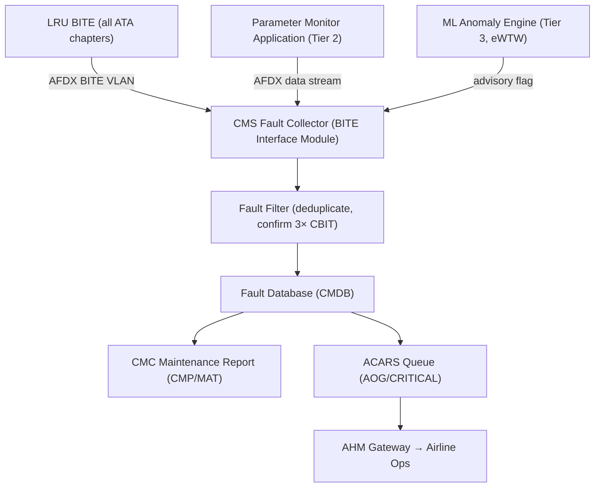
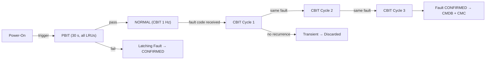
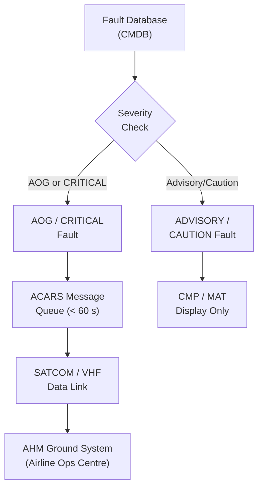

# ATLAS 040-049 · Section 04 · Subsection 045 · 020 — Fault Detection and Fault Reporting

## 0. Hyperlink Policy

All internal cross-references use relative Markdown links within the Q+ATLANTIDE CSDB repository. External regulatory citations in §19/§20 are marked  where hyperlinks are pending. Parent context: [ATLAS 045 README](./README.md) | [045-000 General](./045-000-Central-Maintenance-System-General.md).

---

## 1. Purpose

This document defines the fault detection and fault reporting architecture of the CMS for the AMPEL360E eWTW aircraft. It specifies source data streams, detection methods (BITE, CBIT, PBIT), fault code taxonomy, severity classification, ACARS automatic uplink logic, and the eWTW-specific ML-based anomaly flagging extension.

Key governance areas:
- Two-tier fault detection: LRU BITE self-detection and CMS parameter monitoring.
- Fault code taxonomy aligned to ATA MSG-3 chapter/section/subject scheme.
- ACARS automatic uplink for AOG/critical faults (< 60 s latency).
- ML anomaly engine (eWTW programme-controlled extension).
- Fault confirmation logic: 3 consecutive CBIT cycles.

---

## 2. Applicability

| Attribute | Value |
|-----------|-------|
| Aircraft Program | AMPEL360E eWTW |
| ATA Chapter | ATA 45.020 — Fault Detection and Fault Reporting |
| Certification Basis | CS-25 Amendment 28; DO-178C DAL C |
| Applicable Standards | ARINC 664 P7; ATA MSG-3; ARINC 429; DO-160G |
| ML Extension | Programme-controlled; not credited for certification |
| S1000D SNS | 045-020 |

---

## 3. Functional Description

Fault detection within the CMS operates on two primary tiers and one extended tier:

**Tier 1 — LRU BITE self-detection**: Each LRU performs internal BITE (power-on, continuous, and initiated) and reports fault codes to the CMS via the AFDX BITE VLAN. BITE codes follow the ATA chapter/section/subject (CSS) naming scheme.

**Tier 2 — CMS parameter monitoring**: The Parameter Monitor Application (PMA) continuously monitors AFDX-published data parameters from all subscriber LRUs. Out-of-range, frozen, or invalid parameter conditions are flagged as CMS-originated faults distinct from BITE reports.

**Tier 3 (eWTW programme-controlled) — ML anomaly flagging**: A random forest ML model, retrained quarterly by the OEM on fleet data, analyses parameter trends to flag pre-fault conditions. Model confidence threshold: > 85% before flagging advisory. ML advisories are advisory-only and do not trigger maintenance actions without technician confirmation.

Fault codes follow the ATA MSG-3 chapter/section/subject scheme, mapped to the ATA 45 fault code taxonomy. All faults are stored in the CMDB with timestamp, phase of flight, and affected LRU.

Automatic ACARS fault message uplink occurs within 60 s for AOG or CRITICAL severity faults, via the AHM gateway to the airline operations centre.

### Diagram 1: Fault Detection Pipeline

---

## 4. System Architecture

### Two-Tier Detection Architecture

The fault detection pipeline consists of the BITE Interface Module (BIM), Parameter Monitor Application (PMA), Fault Database Manager (FDM), and the ML Anomaly Engine.

**Fault confirmation logic**: A fault reported by a single BITE cycle is not immediately confirmed. The system requires 3 consecutive CBIT cycles (at 1 Hz, therefore 3 s minimum) with the same fault code before promoting the fault to CONFIRMED status. Transient spikes are discarded. Latching faults (those requiring maintenance action to clear) are confirmed after a single PBIT report.

**Severity classification**:

| Severity | Definition | ACARS Uplink |
|----------|------------|--------------|
| AOG | Aircraft-on-ground fault: cannot dispatch | Immediate (< 60 s) |
| CRITICAL | Safety-significant, dispatch may be possible with MEL | < 60 s |
| CAUTION | Non-critical, MEL dispatchable | At gate (auto) |
| ADVISORY | Informational, no dispatch impact | At gate (auto) |
| ML-ADVISORY | ML pre-fault condition (programme-controlled) | At gate (manual review) |

### Diagram 2: CBIT/PBIT Timing Sequence

---

## 5. Components and Line-Replaceable Units

| Component | Description | Hosted On |
|-----------|-------------|-----------|
| BITE Interface Module (BIM) | Collects and formats BITE reports per ATA chapter | CCU-A/B (SW) |
| Parameter Monitor Application (PMA) | Monitors AFDX data parameters for out-of-range conditions | CCU-A/B (SW) |
| Fault Database Manager (FDM) | Manages CMDB write operations and fault status tracking | CCU-A/B (SW) |
| ACARS Gateway Interface | Formats and queues fault messages for ACARS uplink | CCU-A/B (SW) |
| ML Anomaly Engine (eWTW) | Random forest model for pre-fault anomaly detection | CCU-A/B (SW, prog-ctrl) |

### Diagram 3: ACARS Fault Uplink Flow

---

## 6. Interfaces

| Interface | Counterpart | Protocol | Direction |
|-----------|-------------|----------|-----------|
| AFDX BITE VLAN | All LRU BITE sources | ARINC 664 P7 | Rx |
| AFDX data stream | All LRU sensor parameters | ARINC 664 P7 | Rx |
| CMDB write | MDSU storage | NVMe (internal) | Tx |
| ACARS gateway | SATCOM/VHF data link | ACARS protocol | Tx |
| AHM ground | Airline ops centre | ACARS / Gatelink | Tx |
| CMP/MAT | Maintenance terminals | ARINC 429 / Ethernet | Tx |

---

## 7. Operations and Modes

| Mode | Fault Detection State | Description |
|------|----------------------|-------------|
| PBIT | All LRUs tested | 30 s power-on test; latching faults confirmed immediately |
| CBIT-NORMAL | Continuous 1 Hz | Steady-state monitoring; 3-cycle confirmation |
| FAULT-ACTIVE | Fault confirmed | Fault in CMDB; FIM engine invoked; CMC alert |
| ACARS-UPLINK | AOG/CRITICAL active | ACARS message queued and transmitted (< 60 s) |
| ML-ADVISORY | ML flag raised | Advisory displayed on CMP/MAT; no automatic action |

---

## 8. Performance and Budgets

| Parameter | Requirement | Status |
|-----------|-------------|--------|
| CBIT poll rate | 1 Hz |  |
| Fault confirmation time (CBIT) | ≥ 3 s (3 cycles) |  |
| ACARS AOG uplink latency | < 60 s |  |
| ML model confidence threshold | > 85% |  |
| ML model retrain frequency | Quarterly |  |
| Fault code taxonomy | ATA MSG-3 CSS scheme |  |
| False positive rate (CBIT) | < 1% per 1000 FH |  |

---

## 9. Safety, Redundancy and Fault Tolerance

- **3-cycle confirmation**: Prevents false maintenance actions from transient BITE glitches.
- **ML advisory-only**: ML anomaly flags are advisory and require technician confirmation; they cannot trigger automated maintenance actions or flight restrictions.
- **ACARS PKI**: ACARS fault uplinks are signed with the aircraft's X.509 certificate (ARINC 842 PKI) to prevent spoofing.
- **Fault database integrity**: CMDB records include CRC-32; silent corruption detected and alarmed.
- **Dual CCU**: Fault collector runs on both CCU-A and CCU-B; standby syncs fault state every 500 ms.

---

## 10. Environmental and Structural Constraints

| Constraint | Requirement | Standard |
|------------|-------------|----------|
| BITE interface qualification | DO-160G Cat B2 (temperature) | DO-160G §4 |
| AFDX EMI immunity | DO-160G Cat M | DO-160G §21 |
| ACARS link availability | VHF + SATCOM backup | ARINC 631 |

---

## 11. Power and Cooling

| Component | Power Source | Power (W) | Notes |
|-----------|-------------|-----------|-------|
| BITE Interface Module (SW) | CCU power (28 V DC) | Included in CCU budget | Software module |
| ML Anomaly Engine (SW) | CCU power (28 V DC) | Included in CCU budget | Programme-controlled SW |
| ACARS Gateway Interface (SW) | CCU power (28 V DC) | Included in CCU budget | Software module |

---

## 12. Software and Data Management

- **BIM software**: DO-178C DAL C; AFDX BITE VLAN driver + fault code parser.
- **PMA software**: DO-178C DAL C; parameter range monitoring application.
- **ML Anomaly Engine**: Not DO-178C qualified; advisory-only; programme-controlled; model file signed SHA-256.
- **Fault code database**: ATA MSG-3 CSS scheme; XML format; signed and versioned.
- **CMDB schema**: SQL-lite; ATA-chapter-indexed; fault record fields: timestamp, FIN, severity, LRU, phase-of-flight, confirmation status.

---

## 13. Ground Support and Servicing

| Activity | Tool / Equipment | Procedure |
|----------|-----------------|-----------|
| CMDB fault history export | MAT or USB-C | AMM ATA 45-40-01 |
| ML model update | Gatelink or USB-C (authorised) | AMM ATA 45-20-05 |
| Fault code database update | Gatelink or USB-C (authorised) | AMM ATA 45-12-02 |
| ACARS connectivity test | MAT ACARS test tool | AMM ATA 45-70-01 |

---

## 14. Maintenance and Inspection

| Task | Interval | Reference |
|------|----------|-----------|
| Fault history review | Per flight (gate arrival) | CMC auto-report |
| ML advisory review | Per flight | CMP ML advisory screen |
| Fault code database currency | OEM release cycle | AMM ATA 45-12-02 |
| ACARS gateway test | 6 months | AMM ATA 45-70-01 |

---

## 15. Certification Basis

| Requirement | Regulation | Status |
|-------------|------------|--------|
| Fault detection coverage | CS-25 AMC 25.1309 |  |
| ACARS data link | ARINC 842; DO-280B |  |
| ML advisory (programme-controlled) | Not credited for certification |  |
| Software assurance (BIM/PMA) | DO-178C DAL C |  |

---

## 16. Human Factors and Crew Interface

- Fault messages displayed on CMP and MAT in plain English with ATA chapter context and severity colour coding.
- ML advisories displayed in a distinct "Advisory" panel, visually separated from CONFIRMED faults.
- ACARS uplink status visible on CMP to inform crew of automatic ground notification.
- All fault codes include a short plain-language description (< 80 characters) per AMC 25.1302.

---

## 17. Sustainability and ESG

| ESG Dimension | Initiative | Status |
|---------------|------------|--------|
| Predictive maintenance | ML anomaly detection reduces unscheduled removals by est. 15% |  |
| Data minimisation | Only confirmed faults and ML advisories transmitted via ACARS (GDPR-aligned) |  |
| False alarm reduction | 3-cycle confirmation reduces unnecessary LRU removals |  |

---

## 18. Glossary of Terms and Acronyms

| Term | Definition |
|------|------------|
| BITE | Built-In Test Equipment — self-test capability embedded in each LRU |
| CBIT | Continuous Built-In Test — 1 Hz ongoing health monitoring during all flight phases |
| PBIT | Power-On Built-In Test — full system self-test at power application |
| FDE | Fault Detection and Exclusion — the ability to detect and isolate a faulty channel |
| AHM | Aircraft Health Monitoring — ground-based prognostics and fleet health service |
| ACARS | Aircraft Communications Addressing and Reporting System — airborne data link |
| AOG | Aircraft on Ground — aircraft cannot be dispatched due to a confirmed fault |
| MSG-3 | Maintenance Steering Group revision 3 — airline maintenance logic methodology |
| FIN | Fault Isolation Number — unique identifier for a fault in the FIM database |
| LRU | Line-Replaceable Unit — a modular avionics component removable on the flight line |

---

## 19. Citations and Standards

| Ref ID | Standard | Applicability | Status |
|--------|----------|---------------|--------|
| [S1] | ATA MSG-3 Rev 2015 — Maintenance Steering Group Logic | Fault code taxonomy |  |
| [S2] | DO-178C — Software Considerations | BIM/PMA DAL C |  |
| [S3] | ARINC 664 Part 7 — AFDX | BITE VLAN |  |
| [S4] | ARINC 842 — ACARS Public Key Infrastructure | ACARS fault uplink security |  |
| [S5] | CS-25 AMC 25.1309 — System Safety Assessment | Fault detection coverage |  |
| [S6] | DO-280B — Interoperability Requirements for ATS Applications Using ACARS | ACARS uplink protocol |  |

---

## 20. References

| Ref ID | Document | Version | Status |
|--------|----------|---------|--------|
| [R1] | ATLAS 045-000 — Central Maintenance System General | 1.0.0 |  |
| [R2] | ATLAS 045-030 — Fault Isolation and Troubleshooting Logic | 1.0.0 |  |
| [R3] | ATLAS 045-070 — Ground Data Transfer and Maintenance Connectivity | 1.0.0 |  |
| [R4] | ATLAS 045-080 — CMS Monitoring, Diagnostics and Control Interfaces | 1.0.0 |  |
| [R5] | AMPEL360E eWTW FMEA/FMECA Report | TBD |  |

---

## 21. Footprint / Component Mapping

### Physical Footprint

| Component | Location | Bay | Notes |
|-----------|----------|-----|-------|
| BIM / PMA / FDM (SW) | CCU-A/B | E/E Bay | Software only; no separate hardware |
| ML Anomaly Engine (SW) | CCU-A/B | E/E Bay | Programme-controlled; isolated partition |
| ACARS Gateway Interface (SW) | CCU-A/B | E/E Bay | Interface to SATCOM/VHF data link |

### Electrical / Data Footprint

| Component | Power Source | Data Interface | Notes |
|-----------|-------------|----------------|-------|
| BIM (SW) | CCU 28 V DC | AFDX BITE VLAN | No additional power draw |
| PMA (SW) | CCU 28 V DC | AFDX data stream | No additional power draw |
| ACARS Interface (SW) | CCU 28 V DC | ACARS VHF/SATCOM | Via SATCOM Data Unit (ATA 23) |

### Maintenance Footprint

| Activity | Access Required | Duration |
|----------|----------------|----------|
| Fault history export | CMP/MAT/USB-C | 5 min |
| Fault code DB update | Gatelink/USB-C | 15 min |
| ML model update | Gatelink/USB-C (authorised) | 20 min |

---

## 22. Change Log

| Version | Date | Author | Description |
|---------|------|--------|-------------|
| 1.0.0 | 2026-05-10 | Q+ Team/Amedeo Pelliccia + AI | Initial baseline document creation |
