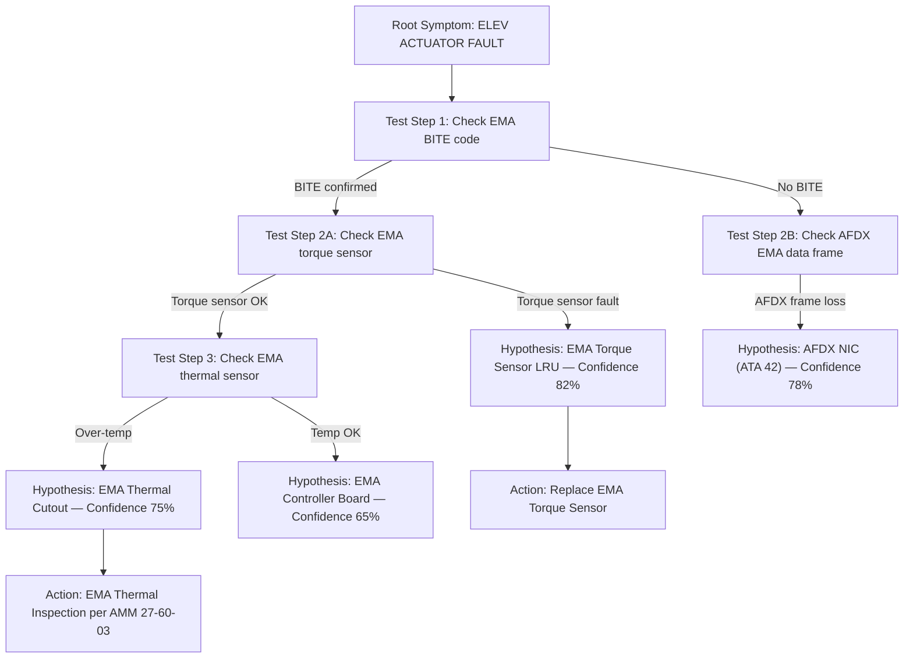
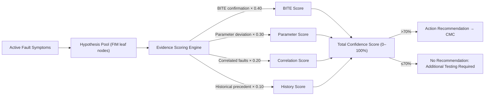
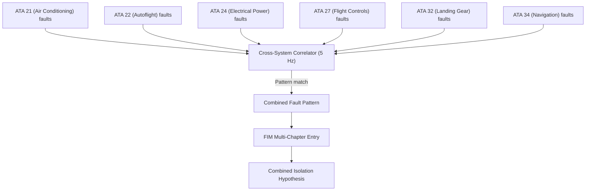

# ATLAS 040-049 · Section 04 · Subsection 045 · 030 — Fault Isolation and Troubleshooting Logic

## 0. Hyperlink Policy

All internal cross-references use relative Markdown links within the Q+ATLANTIDE CSDB repository. External regulatory citations in §19/§20 are marked  where hyperlinks are pending. Parent context: [ATLAS 045 README](./README.md) | [045-000 General](./045-000-Central-Maintenance-System-General.md).

---

## 1. Purpose

This document defines the fault isolation and troubleshooting logic architecture of the CMS for the AMPEL360E eWTW aircraft. It specifies the Fault Isolation Manual (FIM) decision-tree engine, confidence scoring methodology, cross-system fault correlation, and eWTW-specific electric propulsion fault isolation procedures for EMA, EMB, and MPDU faults.

Key governance areas:
- FIM decision-tree engine architecture (MSG-3 XML encoded trees).
- Confidence scoring: 0–100% scale; > 70% required for action recommendation.
- Cross-system correlator: 5 Hz correlation across active ATA chapter fault codes.
- eWTW-specific: EMA, EMB, MPDU fault isolation trees.
- Coverage: ATA 21, 22, 24, 27, 28, 31, 32, 34, 42, 44, 45.

---

## 2. Applicability

| Attribute | Value |
|-----------|-------|
| Aircraft Program | AMPEL360E eWTW |
| ATA Chapter | ATA 45.030 — Fault Isolation and Troubleshooting Logic |
| Certification Basis | CS-25 Amendment 28; DO-178C DAL C |
| Applicable Standards | ATA MSG-3; ARINC 664 P7; DO-160G |
| FIM Encoding | XML (ATA MSG-3 decision tree schema) |
| S1000D SNS | 045-030 |

---

## 3. Functional Description

The Fault Isolation Manual (FIM) decision-tree engine is hosted on the CCU and executes ATA MSG-3 decision trees encoded in XML format. When a confirmed fault code is entered into the CMDB, the FIM engine automatically invokes the corresponding decision tree to produce an isolation hypothesis with a confidence score.

**FIM execution logic**:
1. Fault code from CMDB maps to root symptom in FIM XML database.
2. FIM engine traverses the decision tree, querying current AFDX parameter values and BITE results at each node.
3. Maximum 8 isolation steps per root symptom (per MSG-3 guideline).
4. Each leaf node generates an isolation hypothesis with a confidence score.
5. Confidence score is calculated using a weighted evidence model: BITE confirmation (40%), parameter deviation (30%), correlated faults (20%), historical precedent (10%).

The primary fault hypothesis must exceed **70% confidence** before a maintenance action recommendation is issued to the CMC display.

eWTW-specific fault isolation trees cover:
- **EMA faults**: Electro-Mechanical Actuator over-temperature, torque fault, position feedback loss.
- **EMB faults**: Electric Motor Bus over-voltage, under-voltage, phase-loss.
- **MPDU faults**: Main Power Distribution Unit circuit-breaker trip, bus voltage deviation.

### Diagram 1: FIM Decision Tree Example

---

## 4. System Architecture

### FIM Engine Architecture

The FIM Decision Tree Engine (FDTE) is a DO-178C DAL C software application running in the CMS application partition on CCU-A (with state mirrored to CCU-B). The FIM XML database is loaded from the MDSU at CCU startup and held in ECC RAM during operation.

**Cross-system correlator**: The Cross-System Correlator (CSC) runs at 5 Hz, examining the current active fault code set from all ATA chapters simultaneously. When multiple active faults match a known cross-system correlation pattern (e.g., ATA 24 electrical fault combined with ATA 27 actuator fault), the CSC generates a combined pattern that maps to a specific FIM entry — often identifying a common-cause fault (e.g., power supply failure) not visible from a single ATA chapter.

Cross-system coverage: ATA 21, 22, 24, 27, 28, 31, 32, 34, 42, 44.

### Diagram 2: Fault Isolation Confidence Scoring

---

## 5. Components and Line-Replaceable Units

| Component | Description | Hosted On |
|-----------|-------------|-----------|
| FIM Decision Tree Engine (FDTE) | Executes XML decision trees; produces isolation hypotheses | CCU-A/B (SW, DAL C) |
| Confidence Scoring Module (CSM) | Weighted evidence scoring for each hypothesis | CCU-A/B (SW, DAL C) |
| Cross-System Correlator (CSC) | 5 Hz cross-ATA-chapter fault correlation | CCU-A/B (SW, DAL C) |
| EMA/EMB/MPDU Fault Tree Module | eWTW-specific electric propulsion FIM trees | CCU-A/B (SW, DAL C) |
| Isolation Report Generator (IRG) | Formats isolation report for CMC/MAT display | CCU-A/B (SW, DAL C) |

---

## 6. Interfaces

| Interface | Counterpart | Protocol | Direction |
|-----------|-------------|----------|-----------|
| CMDB fault input | Fault Database Manager | Internal CCU bus | Rx |
| AFDX parameter queries | All LRU subscribers | ARINC 664 P7 | Rx |
| FIM XML database | MDSU | NVMe (internal) | Rx |
| CMC isolation report | CMP/MAT display | ARINC 429 / Ethernet | Tx |
| Cross-system correlation | Fault Collector (all chapters) | Internal CCU shared memory | Bidirectional |

---

## 7. Operations and Modes

| Mode | FIM Engine State | Trigger | Description |
|------|-----------------|---------|-------------|
| IDLE | Waiting | No confirmed faults in CMDB | FIM engine loaded; awaiting fault input |
| ACTIVE | Running | Confirmed fault in CMDB | Traversing decision tree |
| HYPOTHESIS | Result ready | Tree traversal complete | Confidence score generated; report queued |
| CORRELATED | CSC match | Cross-system pattern detected | Combined hypothesis generated |
| SUSPENDED | IBIT/MBIT | Maintenance test in progress | FIM suspended; no production results |

### Diagram 3: Cross-System Correlation Matrix

---

## 8. Performance and Budgets

| Parameter | Requirement | Status |
|-----------|-------------|--------|
| Max isolation steps per tree | 8 steps (MSG-3 guideline) |  |
| FIM tree traversal time | < 30 s per fault |  |
| Confidence threshold for action | > 70% |  |
| Cross-system correlator rate | 5 Hz |  |
| FIM database (total trees) | TBD (est. 2000+ per fleet) |  |
| EMA/EMB/MPDU fault trees | TBD (eWTW programme) |  |

---

## 9. Safety, Redundancy and Fault Tolerance

- **No automatic maintenance actions**: FIM recommendations are advisory only; technician confirmation is always required before any LRU removal or replacement.
- **70% confidence gate**: Prevents low-confidence isolation hypotheses from appearing as firm recommendations; protects against erroneous LRU removals.
- **FIM database integrity**: XML FIM database loaded from MDSU with SHA-256 signature verification at startup; corrupted databases rejected.
- **Cross-system isolation**: Prevents multiple unnecessary LRU removals from a single common-cause fault by identifying system-level root causes.
- **CCU-A/B mirroring**: FIM state mirrored to CCU-B; no isolation loss during failover.

---

## 10. Environmental and Structural Constraints

| Constraint | Requirement | Standard |
|------------|-------------|----------|
| FIM engine (SW) | Hosted in DO-160G qualified CCU | DO-160G |
| FIM XML database storage | MDSU (DO-160G vibration qualified NVMe) | DO-160G Cat S |
| AFDX parameter queries | DO-160G EMI qualified AFDX NIC | DO-160G §21 |

---

## 11. Power and Cooling

All FIM components are software modules hosted on CCU-A/B. Power and cooling budgets are included within the CCU budgets defined in [045-010](./045-010-Maintenance-Computing-and-Core-Processing.md). No additional hardware power draw is attributable to the FIM engine.

---

## 12. Software and Data Management

- **FDTE, CSM, CSC, IRG**: DO-178C DAL C; partitioned in CMS application partition (ARINC 653).
- **FIM XML database**: OEM-controlled; versioned; SHA-256 signed; loaded read-only from MDSU.
- **FIM database update**: Delivered via OEM software distribution, loaded via Gatelink or USB-C with authorisation check.
- **Confidence score algorithm**: Algorithm version-controlled; changes require DAL C re-qualification.
- **eWTW FIM trees**: Developed by OEM; reviewed by Q-MECHANICS and Q-DATAGOV; programme-controlled release.

---

## 13. Ground Support and Servicing

| Activity | Tool / Equipment | Procedure |
|----------|-----------------|-----------|
| FIM isolation report review | MAT or CMP | CMC fault history screen |
| FIM database update | Gatelink or USB-C | AMM ATA 45-12-02 |
| Manual FIM tree override | MAT (supervisor mode) | AMM ATA 45-30-01 |
| Cross-system correlation log export | MAT | AMM ATA 45-40-03 |

---

## 14. Maintenance and Inspection

| Task | Interval | Reference |
|------|----------|-----------|
| FIM database currency check | OEM release cycle | AMM ATA 45-12-02 |
| Isolation report audit | Post-maintenance event | CMC report review |
| Cross-system correlator log review | 1000 FH | AMM ATA 45-30-02 |
| eWTW EMA/EMB/MPDU FIM tree review | Programme schedule | AMM ATA 45-30-03 |

---

## 15. Certification Basis

| Requirement | Regulation | Status |
|-------------|------------|--------|
| FIM software assurance | DO-178C DAL C |  |
| MSG-3 maintenance logic | ATA MSG-3 Rev 2015 |  |
| Isolation recommendation (advisory only) | CS-25 AMC 25.1309 |  |
| eWTW fault trees (EMA/EMB/MPDU) | Programme-controlled |  |

---

## 16. Human Factors and Crew Interface

- FIM isolation reports displayed on CMP and MAT in structured plain language: symptom, steps taken, hypothesis, confidence percentage, recommended action.
- Technicians can override FIM recommendations with a documented justification (MAT supervisor mode; LDAP-authenticated).
- FIM confidence score displayed prominently to help technicians assess reliability of recommendation.
- Low-confidence (< 70%) results displayed as "Additional Testing Required" with suggested manual troubleshooting steps.

---

## 17. Sustainability and ESG

| ESG Dimension | Initiative | Status |
|---------------|------------|--------|
| Unnecessary removals reduction | 70% confidence gate reduces "no-fault-found" LRU removals |  |
| eWTW-specific isolation | EMA/EMB/MPDU fault trees prevent generalised troubleshooting |  |
| Common-cause detection | Cross-system correlator prevents multiple LRU removals for single fault |  |

---

## 18. Glossary of Terms and Acronyms

| Term | Definition |
|------|------------|
| FIM | Fault Isolation Manual — document containing decision trees for isolating faults to LRU level |
| FIN | Fault Isolation Number — unique identifier for a fault entry in the FIM database |
| LRU | Line-Replaceable Unit — a modular component removable and replaceable on the flight line |
| ATA | Air Transport Association — organisation defining aviation maintenance standards |
| EMA | Electro-Mechanical Actuator — electrically driven flight control actuator (eWTW-specific) |
| EMB | Electric Motor Bus — electrical bus supplying propulsion and actuation motors (eWTW-specific) |
| MPDU | Main Power Distribution Unit — primary electrical power distribution unit (eWTW-specific) |
| AHM | Aircraft Health Monitoring — ground-based fleet health and prognostics service |
| MTBF | Mean Time Between Failures — reliability metric for LRU failure rate |
| MTTR | Mean Time To Repair — maintenance metric for average time to restore an LRU to service |

---

## 19. Citations and Standards

| Ref ID | Standard | Applicability | Status |
|--------|----------|---------------|--------|
| [S1] | ATA MSG-3 Rev 2015 | FIM decision tree logic |  |
| [S2] | DO-178C DAL C | FIM engine software |  |
| [S3] | ARINC 664 Part 7 — AFDX | FIM parameter queries |  |
| [S4] | CS-25 AMC 25.1309 | Isolation recommendation safety basis |  |
| [S5] | EASA AMC 25-11 | CMS display HF basis |  |

---

## 20. References

| Ref ID | Document | Version | Status |
|--------|----------|---------|--------|
| [R1] | ATLAS 045-000 — Central Maintenance System General | 1.0.0 |  |
| [R2] | ATLAS 045-020 — Fault Detection and Fault Reporting | 1.0.0 |  |
| [R3] | ATLAS 045-060 — Maintenance Terminal and Crew Maintenance Interfaces | 1.0.0 |  |
| [R4] | AMPEL360E eWTW EMA Fault Mode Library | TBD |  |
| [R5] | AMPEL360E eWTW MPDU Fault Mode Library | TBD |  |

---

## 21. Footprint / Component Mapping

### Physical Footprint

| Component | Location | Bay | Notes |
|-----------|----------|-----|-------|
| FDTE / CSM / CSC / IRG (SW) | CCU-A/B | E/E Bay | Software only; no separate hardware |
| FIM XML database | MDSU | E/E Bay | Stored on RAID-1 NVMe |

### Electrical / Data Footprint

| Component | Power Source | Data Interface | Notes |
|-----------|-------------|----------------|-------|
| FIM engine (SW) | CCU 28 V DC | AFDX + internal MDSU | No additional power draw |
| Cross-system correlator (SW) | CCU 28 V DC | AFDX BITE VLAN | No additional power draw |

### Maintenance Footprint

| Activity | Access Required | Duration |
|----------|----------------|----------|
| FIM database update | CMP/MAT/Gatelink | 15 min |
| FIM isolation report review | CMP or MAT | 5 min |
| Cross-system correlation log export | MAT | 10 min |

---

## 22. Change Log

| Version | Date | Author | Description |
|---------|------|--------|-------------|
| 1.0.0 | 2026-05-10 | Q-DATAGOV / Copilot | Initial baseline document creation |
