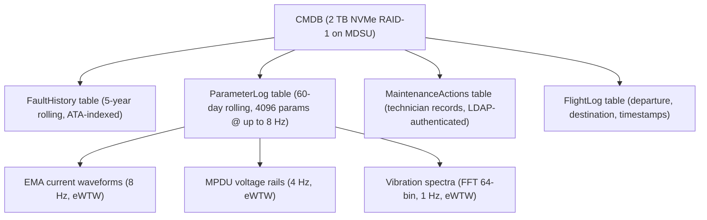
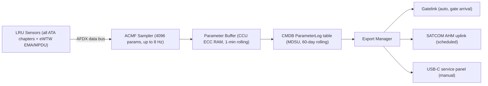
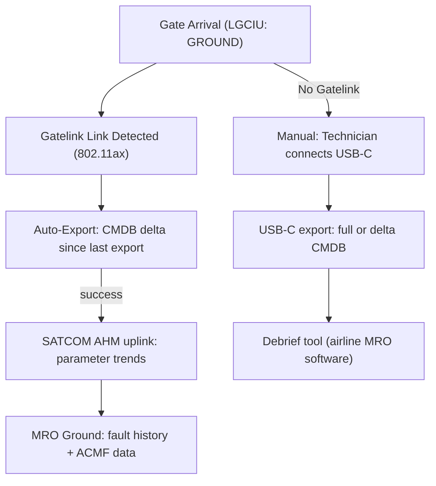

# ATLAS 040-049 · Section 04 · Subsection 045 · 040 — Maintenance Data Recording and History

## 0. Hyperlink Policy

All internal cross-references use relative Markdown links within the Q+ATLANTIDE CSDB repository. External regulatory citations in §19/§20 are marked  where hyperlinks are pending. Parent context: [ATLAS 045 README](./README.md) | [045-000 General](./045-000-Central-Maintenance-System-General.md).

---

## 1. Purpose

This document defines the maintenance data recording and history architecture of the CMS for the AMPEL360E eWTW aircraft. It specifies the CMS Maintenance Data Base (CMDB) schema, ACMF parameter monitoring per ARINC 767, QAR word expansion for eWTW electric propulsion, and off-board data transfer methods including Gatelink, SATCOM AHM uplink, and USB-C ground terminal.

Key governance areas:
- CMDB: 5-year on-aircraft fault history and 60-day rolling high-rate parameter log.
- ACMF per ARINC 767 Supplement 3: 4096-parameter expanded frame for eWTW.
- QAR: standard 1024-word extended to 4096 words for electric propulsion parameters.
- Off-board transfer: Gatelink (ARINC 631), SATCOM AHM uplink, USB-C 60 W ground terminal.

---

## 2. Applicability

| Attribute | Value |
|-----------|-------|
| Aircraft Program | AMPEL360E eWTW |
| ATA Chapter | ATA 45.040 — Maintenance Data Recording and History |
| Certification Basis | CS-25 Amendment 28; DO-178C DAL C |
| Applicable Standards | ARINC 767 Suppl. 3; ARINC 631; DO-160G; ARINC 664 P7 |
| QAR Frame | 4096-word (eWTW expanded from 1024-word standard) |
| S1000D SNS | 045-040 |

---

## 3. Functional Description

The CMDB is the central on-aircraft repository for all maintenance data, stored on the Maintenance Data Storage Unit (MDSU) — a 2 TB NVMe RAID-1 array housed in the forward avionics bay.

**CMDB content**:
- **Fault history table**: 5-year rolling fault records indexed by ATA chapter, flight number, timestamp, and severity. Estimated 500 MB for 5 years at typical fault rate.
- **Parameter log table**: 60-day rolling high-rate parameter log. ACMF samples 4096 parameters at up to 8 Hz each. Estimated 1.2 TB for 60 days at full ACMF rate.
- **Maintenance actions table**: Records of all technician maintenance actions (LRU replacements, inspections, software updates) with timestamp and LDAP identity.
- **Flight log table**: Flight-correlated record of departure, destination, flight time, and phase-of-flight timestamps for fault correlation.

**eWTW-specific additions** to the high-rate parameter log:
- EMA current waveforms (RMS + THD, per actuator, sampled at 8 Hz).
- MPDU voltage rails (±0.1 V resolution, sampled at 4 Hz).
- Electric propulsion vibration spectra (FFT 64-bin, sampled at 1 Hz per EMA).

### Diagram 1: CMDB Data Model

---

## 4. System Architecture

### ACMF Architecture

The Aircraft Condition Monitoring Function (ACMF) is implemented per ARINC 767 Supplement 3. It runs as a software partition on CCU-A/B, continuously sampling the AFDX data bus for the configured parameter list.

**Parameter frame**: The standard ARINC 767 frame of 1024 words is expanded to **4096 words** to accommodate eWTW electric propulsion parameters. Each word is 16 bits; maximum sample rate per parameter is 8 Hz.

**QAR interface**: The Quick Access Recorder interface provides a 4096-word per-second data stream to the MDSU ParameterLog table. QAR data is also formatted for export via Gatelink or USB-C.

### Data Export Architecture

Three export paths are implemented:

| Export Method | Trigger | Priority | Security |
|---------------|---------|----------|----------|
| Gatelink (ARINC 631, 802.11ax) | Gate arrival (auto-detect) | High | TLS 1.3 + X.509 |
| SATCOM AHM uplink | Real-time / scheduled | Medium | ACARS PKI |
| USB-C 60 W service panel | Manual (technician) | Low | LDAP auth + TLS 1.3 |

### Diagram 2: ACMF Data Collection Flow

---

## 5. Components and Line-Replaceable Units

| LRU / Module | Description | Qty | Qualification |
|--------------|-------------|-----|---------------|
| MDSU | Maintenance Data Storage Unit (2 TB NVMe RAID-1) | 1 | DO-160G Cat S |
| ACMF Software Application | ARINC 767 Suppl. 3 parameter sampler | 1 (SW) | DO-178C DAL C |
| QAR Interface Module | 1024/4096-word QAR interface | 1 (SW) | DO-178C DAL C |
| Gatelink Data Transfer Unit | ARINC 631-3, 802.11ax Gatelink radio | 1 | DO-160G |
| USB-C Service Panel Connector | 60 W USB-C data/power port on service panel | 1 | DO-160G |
| SATCOM AHM Uplink Module | SATCOM data unit interface for AHM uplink | 1 (SW) | DO-178C DAL C |

---

## 6. Interfaces

| Interface | Counterpart | Protocol | Direction |
|-----------|-------------|----------|-----------|
| AFDX data bus | All LRU subscribers | ARINC 664 P7 | Rx (ACMF sampling) |
| MDSU NVMe | Internal storage | NVMe (PCIe Gen 4) | Bidirectional |
| Gatelink radio | MRO ground network | IEEE 802.11ax | Bidirectional |
| SATCOM data unit | AHM ground server | ACARS / IP | Tx |
| USB-C service panel | Maintenance laptop | USB 3.2 Gen 2 | Bidirectional |
| DFDR (ATA 31) | Flight data recorder | AFDX / ARINC 717 | Tx (parameter sync) |

---

## 7. Operations and Modes

| Mode | CMDB State | Description |
|------|-----------|-------------|
| RECORDING | Active (continuous) | ACMF samples parameters at configured rates |
| EXPORT-AUTO | Gate arrival detected | Auto Gatelink export of CMDB delta since last export |
| EXPORT-MANUAL | Technician request | USB-C or manual Gatelink export on demand |
| AHM-UPLINK | Scheduled / real-time | SATCOM AHM uplink of critical parameter trends |
| PURGE | Automatic | Rolling deletion of records older than 5-year (fault) or 60-day (parameter) thresholds |

### Diagram 3: Ground Data Export Sequence

---

## 8. Performance and Budgets

| Parameter | Requirement | Status |
|-----------|-------------|--------|
| Fault history retention | 5 years rolling |  |
| Parameter log retention | 60 days rolling |  |
| ACMF parameter count | 4096 (eWTW expanded) |  |
| Max sample rate | 8 Hz per parameter |  |
| MDSU storage capacity | 2 TB RAID-1 |  |
| Gatelink export speed | 802.11ax (typ. 100+ Mbps) |  |
| USB-C export speed | USB 3.2 Gen 2 (typ. 10 Gbps) |  |
| MDSU write endurance | > 5 years at rated workload |  |

---

## 9. Safety, Redundancy and Fault Tolerance

- **MDSU RAID-1**: Mirrored NVMe drives prevent data loss from a single drive failure.
- **CRC-32 per record**: Every CMDB record includes a CRC-32 check; silent corruption detected and alarmed.
- **Write failure alarming**: MDSU write errors detected and reported to CCU health monitor (CHM); alert displayed on CMP.
- **Export integrity**: All exports include SHA-256 hash of exported dataset; verified by receiving MRO system.
- **GDPR/data sovereignty**: CMDB data does not leave the aircraft without authorised export credential verification (LDAP authentication for USB-C; TLS 1.3 + X.509 for Gatelink/SATCOM).

---

## 10. Environmental and Structural Constraints

| Constraint | Requirement | Standard |
|------------|-------------|----------|
| MDSU vibration | DO-160G Cat S (NVMe SSD rated) | DO-160G §8 |
| MDSU temperature | −40 °C to +70 °C | DO-160G Cat B2 |
| MDSU shock | DO-160G §7 | DO-160G |
| USB-C connector | IP54 with protective cap (on aircraft) | IP54 |
| Gatelink radio | DO-160G Cat M (EMI) | DO-160G §21 |

---

## 11. Power and Cooling

| Component | Power Source | Power (W) | Notes |
|-----------|-------------|-----------|-------|
| MDSU | 28 V DC Bus 1 | < 25 | NVMe RAID-1 active |
| Gatelink radio | 28 V DC Bus 1 | < 30 | 802.11ax radio |
| USB-C port | 28 V DC Maint Bus | < 60 W output | Power delivery for laptop |
| ACMF SW / QAR SW | CCU 28 V DC | Included in CCU budget | Software modules |

---

## 12. Software and Data Management

- **ACMF application**: DO-178C DAL C; ARINC 767 Suppl. 3 compliant; parameter list configurable by OEM-authorised ground tool.
- **QAR interface**: DO-178C DAL C; 4096-word frame; backward compatible with 1024-word receivers.
- **CMDB database**: SQL-lite embedded database; ATA-chapter-indexed tables; automatic rolling purge.
- **Data export format**: CSV (parameter log) and XML (fault history) with SHA-256 integrity hash.
- **Data access control**: Read access (fault history): maintenance technician (LDAP role "MX-TECH"). Write access (maintenance actions): LDAP role "MX-TECH" + supervisor approval. Export: LDAP role "MX-TECH".

---

## 13. Ground Support and Servicing

| Activity | Tool / Equipment | Procedure |
|----------|-----------------|-----------|
| CMDB export (USB-C) | Maintenance laptop + USB-C cable | AMM ATA 45-40-01 |
| CMDB export (Gatelink) | MRO ground system | AMM ATA 45-40-02 |
| MDSU replacement | LRU tool kit; ESD strap | AMM ATA 45-40-10 |
| ACMF parameter list update | Gatelink or USB-C (OEM authorised) | AMM ATA 45-40-06 |
| SMART health check | MAT diagnostic app | AMM ATA 45-40-05 |

---

## 14. Maintenance and Inspection

| Task | Interval | Reference |
|------|----------|-----------|
| MDSU SMART health review | Monthly | AMM ATA 45-40-05 |
| CMDB capacity check (usage %) | 6 months | AMM ATA 45-40-07 |
| ACMF parameter list currency | OEM release cycle | AMM ATA 45-40-06 |
| Gatelink export test | 12 months | AMM ATA 45-70-03 |
| MDSU replacement (end-of-life) | Per SSD endurance spec | AMM ATA 45-40-10 |

---

## 15. Certification Basis

| Requirement | Regulation | Status |
|-------------|------------|--------|
| ACMF qualification | ARINC 767 Suppl. 3 |  |
| QAR compliance | CS-25 §25.1459 (FDR/QAR) |  |
| Data retention | CS-25 §25.1457 |  |
| MDSU environmental | DO-160G |  |
| Software assurance | DO-178C DAL C |  |

---

## 16. Human Factors and Crew Interface

- Fault history accessible on CMP and MAT as a searchable table (filter by ATA chapter, date range, severity, flight number).
- CMDB capacity utilisation displayed on CMP as a percentage bar.
- Export status (Gatelink auto-export complete/failed) displayed on CMP after gate arrival.
- MDSU SMART health shown on CMP: green/amber/red discrete.

---

## 17. Sustainability and ESG

| ESG Dimension | Initiative | Status |
|---------------|------------|--------|
| Paperless maintenance | All fault history digital; eliminates paper log books |  |
| Data retention efficiency | Rolling purge prevents unnecessary storage expansion |  |
| Carbon reduction | AHM prognostics data enables scheduled vs. unscheduled maintenance |  |
| RoHS MDSU | NVMe SSD RoHS compliant; REACH declaration required |  |

---

## 18. Glossary of Terms and Acronyms

| Term | Definition |
|------|------------|
| CMDB | CMS Maintenance Data Base — on-aircraft storage for all maintenance and parameter data |
| ACMF | Aircraft Condition Monitoring Function — ARINC 767 parameter monitoring application |
| QAR | Quick Access Recorder — high-speed flight data recording device (1024/4096-word frame) |
| ARINC | Aeronautical Radio, Incorporated — standards body for avionics communication protocols |
| AHM | Aircraft Health Monitoring — ground-based fleet health and prognostics service |
| Gatelink | ARINC 631 wireless data link between aircraft and airline ground network at gate |
| SATCOM | Satellite Communications — aircraft-to-ground data link via satellite |
| SQL | Structured Query Language — database query language used for CMDB schema |
| CSV | Comma-Separated Values — data export format for parameter log data |
| BITE | Built-In Test Equipment — self-test capability embedded in each LRU |

---

## 19. Citations and Standards

| Ref ID | Standard | Applicability | Status |
|--------|----------|---------------|--------|
| [S1] | ARINC 767 Supplement 3 — ACMF | Parameter monitoring |  |
| [S2] | ARINC 631-3 — Aircraft/Ground Data Exchange (Gatelink) | Gate data transfer |  |
| [S3] | CS-25 §25.1459 — Flight Data Recorders | QAR regulatory basis |  |
| [S4] | DO-160G — Environmental Conditions | MDSU qualification |  |
| [S5] | DO-178C DAL C | ACMF/QAR software |  |
| [S6] | ARINC 664 Part 7 — AFDX | Parameter data bus |  |

---

## 20. References

| Ref ID | Document | Version | Status |
|--------|----------|---------|--------|
| [R1] | ATLAS 045-000 — Central Maintenance System General | 1.0.0 |  |
| [R2] | ATLAS 045-010 — Maintenance Computing and Core Processing | 1.0.0 |  |
| [R3] | ATLAS 045-070 — Ground Data Transfer and Maintenance Connectivity | 1.0.0 |  |
| [R4] | AMPEL360E eWTW ACMF Parameter List (4096-word frame) | TBD |  |
| [R5] | ATLAS 031 — Recording Systems | 1.0.0 |  |

---

## 21. Footprint / Component Mapping

### Physical Footprint

| LRU | Location | Bay | Rack Position |
|-----|----------|-----|---------------|
| MDSU | Forward avionics bay | E/E Bay | Rack B, Slot 1 |
| Gatelink Radio Unit | Forward avionics bay | E/E Bay | Rack B, Slot 2 |
| USB-C Service Panel | Lower fuselage service panel | External | Panel Port P45-1 |

### Electrical / Data Footprint

| LRU | Power Bus | Power (W) | Data Interface |
|-----|-----------|-----------|----------------|
| MDSU | 28 V DC Bus 1 | < 25 | NVMe (PCIe Gen 4) |
| Gatelink Radio Unit | 28 V DC Bus 1 | < 30 | Ethernet + 802.11ax |
| USB-C Service Panel | 28 V DC Maint Bus | < 60 (output) | USB 3.2 Gen 2 |

### Maintenance Footprint

| Activity | Access Required | Duration |
|----------|----------------|----------|
| MDSU replacement | E/E bay door | 20 min |
| CMDB USB-C export | External service panel | 10 min |
| Gatelink auto-export | Automatic at gate | 5–20 min |

---

## 22. Change Log

| Version | Date | Author | Description |
|---------|------|--------|-------------|
| 1.0.0 | 2026-05-10 | Q-DATAGOV / Copilot | Initial baseline document creation |
