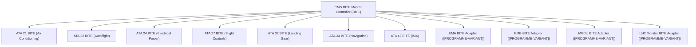
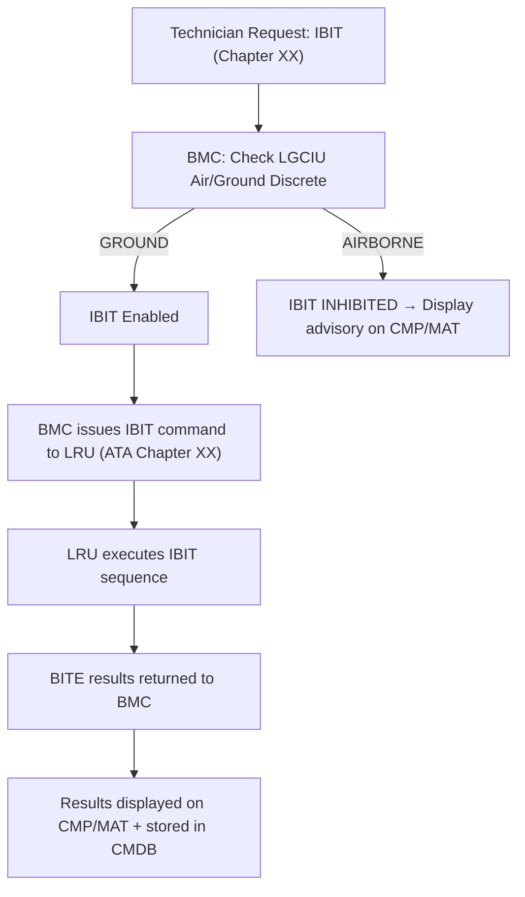
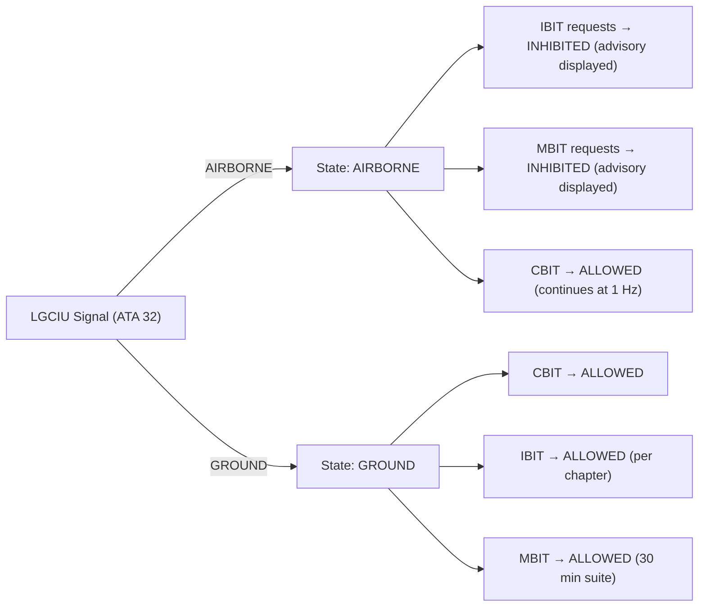

# ATLAS 040-049 · Section 04 · Subsection 045 · 050 — BITE Interfaces and System Test Coordination

## 0. Hyperlink Policy

All internal cross-references use relative Markdown links within the Q+ATLANTIDE CSDB repository. External regulatory citations in §19/§20 are marked  where hyperlinks are pending. Parent context: [ATLAS 045 README](./README.md) | [045-000 General](./045-000-Central-Maintenance-System-General.md).

---

## 1. Purpose

This document defines the BITE interfaces and system test coordination architecture of the CMS for the programme-defined aircraft type. The CMS acts as the master BITE coordinator for all ATA chapter LRUs. It specifies BITE test modes (PBIT, CBIT, IBIT, MBIT), inhibit logic enforced via the LGCIU air/ground discrete, and [PROGRAMME-VARIANT]-specific BITE coverage for EMA, EMB, MPDU, and LH2 monitoring subsystems.

Key governance areas:
- CMS as BITE Master Controller (BMC) for all LRU BITE subscribers.
- PBIT: all LRUs, < 90 s total.
- CBIT: continuous 1 Hz polling.
- IBIT: ground-only, technician-initiated, LGCIU gate enforced.
- MBIT: 30-minute comprehensive maintenance test.
- [PROGRAMME-VARIANT] BITE: EMA, EMB, MPDU, LH2 monitoring BITE adapters.

---

## 2. Applicability

| Attribute | Value |
|-----------|-------|
| Aircraft Program | programme-defined aircraft type |
| ATA Chapter | ATA 45.050 — BITE Interfaces and System Test Coordination |
| Certification Basis | CS-25 Amendment 28; DO-178C DAL C |
| Applicable Standards | ARINC 664 P7 (AFDX BITE VLAN); DO-160G; ATA MSG-3 |
| LGCIU Interface | ATA 32 (air/ground discrete for IBIT/MBIT inhibit) |
| S1000D SNS | 045-050 |

---

## 3. Functional Description

The CMS operates as the BITE Master Controller (BMC), coordinating all BITE test modes across every ATA chapter LRU subscriber. BITE results are collected via the AFDX BITE VLAN and aggregated by the BITE Results Aggregator into the CMDB.

**BITE test modes**:

| Mode | Acronym | Trigger | Duration | Inhibit |
|------|---------|---------|----------|---------|
| Power-On BIT | PBIT | Power application | < 90 s | None |
| Continuous BIT | CBIT | Always, 1 Hz | Continuous | None |
| Initiated BIT | IBIT | Technician request | Per chapter (1–15 min) | Airborne |
| Maintenance BIT | MBIT | Technician request | 30 min (full suite) | Airborne |

**IBIT inhibit logic**: IBIT and MBIT are inhibited when the aircraft is airborne. The LGCIU (ATA 32) provides an air/ground discrete signal to the CMS BMC. When LGCIU signal = AIRBORNE, IBIT/MBIT requests from the CMP or MAT are rejected and an advisory "IBIT INHIBITED - AIRBORNE" is displayed.

**[PROGRAMME-VARIANT] BITE extensions**: BITE adapters are provided for EMA, EMB, MPDU, and LH2 monitoring subsystems. These adapters translate proprietary [PROGRAMME-VARIANT] BITE protocols to the AFDX BITE VLAN format, making [PROGRAMME-VARIANT] subsystem health fully visible in the CMS BITE framework.

### Diagram 1: BITE Test Hierarchy

---

## 4. System Architecture

### BITE Master Controller Architecture

The BMC is a DO-178C DAL C software module running in the CMS BITE Manager partition (ARINC 653). It maintains a subscriber registry of all BITE-capable LRUs with their AFDX BITE VLAN addresses, test schedules, and last-received BITE status.

**PBIT coordination**: At power-on, BMC issues PBIT start commands to all registered LRUs sequentially in ATA chapter order. Maximum total PBIT duration is 90 s. LRUs that fail to respond within their allocated PBIT window are flagged as "BITE NO RESPONSE" — treated as a latching fault.

**CBIT coordination**: BMC polls all LRU BITE status registers at 1 Hz. Status changes (OK → FAULT or FAULT → OK) are immediately reported to the Fault Collector.

**IBIT coordination**: Technician requests IBIT for a specific ATA chapter via CMP or MAT. BMC verifies LGCIU = GROUND, then issues the IBIT command to the target LRU. IBIT results are captured and presented on the CMP/MAT within the chapter-specific test duration.

### Diagram 2: IBIT Sequence Flow

---

## 5. Components and Line-Replaceable Units

| Component | Description | Hosted On |
|-----------|-------------|-----------|
| BITE Master Controller (BMC) | Schedules and coordinates all BITE modes | CCU-A/B (SW, DAL C) |
| LGCIU Air/Ground Interface | Reads LGCIU discrete for IBIT inhibit logic | CCU-A/B (HW discrete input) |
| BITE Schedule Manager | Manages PBIT/CBIT timing and IBIT/MBIT sequencing | CCU-A/B (SW, DAL C) |
| BITE Results Aggregator | Aggregates BITE reports from all subscribers to CMDB | CCU-A/B (SW, DAL C) |
| IBIT Inhibit Logic Module | Hardware/software gate for IBIT/MBIT airborne inhibit | CCU-A/B (HW + SW) |
| EMA BITE Adapter ([PROGRAMME-VARIANT]) | Translates EMA proprietary BITE to AFDX VLAN | CCU-A/B (SW) |
| EMB BITE Adapter ([PROGRAMME-VARIANT]) | Translates EMB proprietary BITE to AFDX VLAN | CCU-A/B (SW) |
| MPDU BITE Adapter ([PROGRAMME-VARIANT]) | Translates MPDU proprietary BITE to AFDX VLAN | CCU-A/B (SW) |

---

## 6. Interfaces

| Interface | Counterpart | Protocol | Direction |
|-----------|-------------|----------|-----------|
| AFDX BITE VLAN | All LRU BITE subscribers | ARINC 664 P7 | Bidirectional |
| LGCIU discrete | ATA 32 LGCIU | Hardwired discrete | Rx |
| CMP/MAT | Maintenance terminals | ARINC 429 / Ethernet | Bidirectional |
| CMDB write | MDSU | NVMe (internal) | Tx |
| EMA BITE | [PROGRAMME-VARIANT] EMA system | Proprietary → AFDX adapter | Rx |
| MPDU BITE | [PROGRAMME-VARIANT] MPDU | Proprietary → AFDX adapter | Rx |

---

## 7. Operations and Modes

| Mode | State | Description |
|------|-------|-------------|
| PBIT-RUNNING | Power-on | Sequential LRU PBIT; max 90 s; BMC orchestrates |
| CBIT-POLLING | Continuous | BMC polls all LRUs at 1 Hz |
| IBIT-REQUESTED | Ground only | Technician initiates; LGCIU verified |
| IBIT-RUNNING | Ground only | LRU executing IBIT sequence |
| MBIT-RUNNING | Ground only | Full 30-min maintenance test suite |
| INHIBITED | Airborne | IBIT/MBIT requests rejected by BMC |

### Diagram 3: BITE Inhibit Logic

---

## 8. Performance and Budgets

| Parameter | Requirement | Status |
|-----------|-------------|--------|
| PBIT total duration | < 90 s |  |
| CBIT poll rate | 1 Hz |  |
| IBIT inhibit response | < 1 s after LGCIU AIRBORNE |  |
| MBIT total duration | 30 min |  |
| BITE subscriber count | TBD (all ATA chapters + [PROGRAMME-VARIANT]) |  |
| BITE no-response detection | < 2 s (PBIT window) |  |
| [PROGRAMME-VARIANT] BITE adapter latency | < 500 ms (proprietary → AFDX) |  |

---

## 9. Safety, Redundancy and Fault Tolerance

- **LGCIU inhibit hardware gate**: IBIT/MBIT inhibit is enforced by a hardware discrete input from LGCIU; software alone cannot override this gate.
- **PBIT failure alarming**: LRUs that fail PBIT are immediately confirmed as faults; displayed on CMP before aircraft dispatch.
- **CBIT fault latching**: Confirmed CBIT faults remain latched until physically cleared by a maintenance action (technician sign-off on MAT).
- **Dual BMC**: BMC runs on both CCU-A and CCU-B; BITE state mirrored every 500 ms.
- **[PROGRAMME-VARIANT] adapter integrity**: BITE adapter protocol translation verified by CRC check on each translated BITE frame.

---

## 10. Environmental and Structural Constraints

| Constraint | Requirement | Standard |
|------------|-------------|----------|
| BMC software environment | Hosted in DO-160G qualified CCU | DO-160G |
| LGCIU discrete wiring | Shielded, DO-160G EMI qualified | DO-160G §22 |
| [PROGRAMME-VARIANT] BITE adapters | Hosted in CCU (DO-160G qualified) | DO-160G |

---

## 11. Power and Cooling

All BMC, BITE Manager, and BITE Aggregator components are software modules on CCU-A/B. Power and cooling are within the CCU budgets defined in [045-010](./045-010-Maintenance-Computing-and-Core-Processing.md). The LGCIU discrete input wiring adds negligible power draw (< 0.1 W).

---

## 12. Software and Data Management

- **BMC, BITE Schedule Manager, BITE Results Aggregator**: DO-178C DAL C; ARINC 653 BITE Manager partition.
- **IBIT Inhibit Logic Module**: DO-178C DAL C; hardware interlock backed by LGCIU discrete.
- **[PROGRAMME-VARIANT] BITE adapters**: DO-178C DAL C; protocol translation tables version-controlled and SHA-256 signed.
- **BITE subscriber registry**: XML-encoded; loaded from MDSU at startup; configurable by OEM-authorised ground tool.
- **MBIT test suite**: XML test script; OEM-controlled; loaded from MDSU.

---

## 13. Ground Support and Servicing

| Activity | Tool / Equipment | Procedure |
|----------|-----------------|-----------|
| IBIT execution (per chapter) | CMP or MAT | AMM ATA 45-50-01 |
| MBIT full suite | MAT (30 min) | AMM ATA 45-50-02 |
| BITE subscriber registry update | Gatelink or USB-C (OEM auth) | AMM ATA 45-50-05 |
| [PROGRAMME-VARIANT] BITE adapter protocol update | Gatelink or USB-C | AMM ATA 45-50-06 |
| LGCIU discrete interface test | MAT diagnostic tool | AMM ATA 45-50-03 |

---

## 14. Maintenance and Inspection

| Task | Interval | Reference |
|------|----------|-----------|
| PBIT results review | Per flight | CMC auto-report |
| IBIT execution (all chapters) | 1000 FH or 12 months | AMM ATA 45-50-01 |
| MBIT full suite | 1000 FH or 12 months | AMM ATA 45-50-02 |
| LGCIU discrete check | 12 months | AMM ATA 45-50-03 |
| [PROGRAMME-VARIANT] BITE adapter test | 6 months | AMM ATA 45-50-06 |

---

## 15. Certification Basis

| Requirement | Regulation | Status |
|-------------|------------|--------|
| BITE coverage | CS-25 AMC 25.1309 |  |
| IBIT ground-only inhibit | CS-25 §25.1301 |  |
| BMC software | DO-178C DAL C |  |
| LGCIU interface safety | CS-25 §25.735 (landing gear) |  |
| [PROGRAMME-VARIANT] BITE adapters | Programme-controlled + DO-178C DAL C |  |

---

## 16. Human Factors and Crew Interface

- IBIT/MBIT request UI on CMP and MAT includes a clear "INHIBITED — AIRCRAFT AIRBORNE" advisory when inhibit is active.
- PBIT progress displayed as a percentage bar on CMP during power-on (0–100% of 90 s).
- MBIT test suite progress displayed with chapter-by-chapter status (pass/fail) on MAT.
- [PROGRAMME-VARIANT] BITE adapter status visible on CMP as a dedicated "[PROGRAMME-VARIANT] BITE" panel.

---

## 17. Sustainability and ESG

| ESG Dimension | Initiative | Status |
|---------------|------------|--------|
| BITE coverage expansion | [PROGRAMME-VARIANT] BITE adapters enable comprehensive fault detection without additional hardware |  |
| PBIT efficiency | Sequential (not parallel) PBIT reduces peak power surge at power-on |  |
| Waste reduction | Comprehensive BITE reduces unnecessary LRU removals ("no-fault-found") |  |

---

## 18. Glossary of Terms and Acronyms

| Term | Definition |
|------|------------|
| BITE | Built-In Test Equipment — self-test capability embedded in each LRU |
| PBIT | Power-On Built-In Test — full system self-test at power application (< 90 s) |
| CBIT | Continuous Built-In Test — 1 Hz ongoing health monitoring |
| IBIT | Initiated Built-In Test — technician-initiated, ground-only system test |
| MBIT | Maintenance Built-In Test — comprehensive 30-minute maintenance test suite |
| LRU | Line-Replaceable Unit — a modular avionics component removable on the flight line |
| LGCIU | Landing Gear Control and Interface Unit — provides air/ground discrete signal |
| EMA | Electro-Mechanical Actuator — electrically driven flight control actuator ([PROGRAMME-VARIANT]) |
| EMB | Electric Motor Bus — electrical bus supplying propulsion motors ([PROGRAMME-VARIANT]) |
| MPDU | Main Power Distribution Unit — primary electrical power distribution unit ([PROGRAMME-VARIANT]) |

---

## 19. Citations and Standards

| Ref ID | Standard | Applicability | Status |
|--------|----------|---------------|--------|
| [S1] | DO-178C DAL C | BMC and BITE manager software |  |
| [S2] | ARINC 664 Part 7 — AFDX | BITE VLAN |  |
| [S3] | CS-25 AMC 25.1309 | BITE coverage requirements |  |
| [S4] | ATA MSG-3 Rev 2015 | BITE test logic basis |  |
| [S5] | DO-160G — Environmental Conditions | CCU and BITE HW |  |

---

## 20. References

| Ref ID | Document | Version | Status |
|--------|----------|---------|--------|
| [R1] | ATLAS 045-000 — Central Maintenance System General | 1.0.0 |  |
| [R2] | ATLAS 045-020 — Fault Detection and Fault Reporting | 1.0.0 |  |
| [R3] | ATLAS 032 — Landing Gear Systems (LGCIU interface) | 1.0.0 |  |
| [R4] | programme-defined aircraft type EMA BITE Protocol Specification | TBD |  |
| [R5] | programme-defined aircraft type MPDU BITE Protocol Specification | TBD |  |

---

## 21. Footprint / Component Mapping

### Physical Footprint

| Component | Location | Bay | Notes |
|-----------|----------|-----|-------|
| BMC / BITE Manager / Aggregator (SW) | CCU-A/B | E/E Bay | Software only |
| LGCIU Discrete Input | CCU-A/B discrete input card | E/E Bay | Hardwired from ATA 32 LGCIU |
| [PROGRAMME-VARIANT] BITE Adapters (SW) | CCU-A/B | E/E Bay | Software only |

### Electrical / Data Footprint

| Component | Power Source | Data Interface | Notes |
|-----------|-------------|----------------|-------|
| BMC (SW) | CCU 28 V DC | AFDX BITE VLAN | No additional power draw |
| LGCIU discrete input | 28 V DC discrete | Discrete wire | < 0.1 W |
| [PROGRAMME-VARIANT] adapters (SW) | CCU 28 V DC | AFDX BITE VLAN | No additional power draw |

### Maintenance Footprint

| Activity | Access Required | Duration |
|----------|----------------|----------|
| IBIT per chapter | CMP or MAT (cockpit/avionics bay) | 1–15 min per chapter |
| MBIT full suite | MAT | 30 min |
| BITE registry update | Gatelink or USB-C | 10 min |

---

## 22. Change Log

| Version | Date | Author | Description |
|---------|------|--------|-------------|
| 1.0.0 | 2026-05-10 | Q+ Team/Amedeo Pelliccia + AI | Initial baseline document creation |
