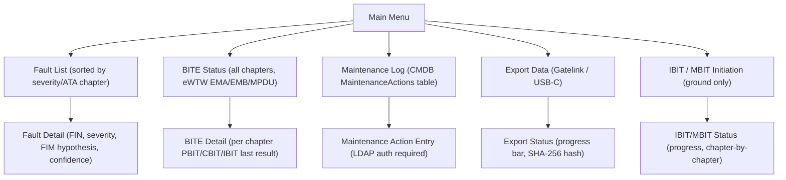
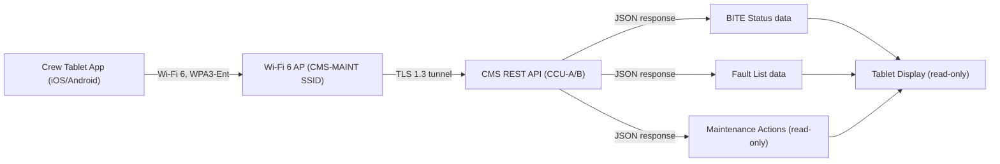

# ATLAS 040-049 · Section 04 · Subsection 045 · 060 — Maintenance Terminal and Crew Maintenance Interfaces

## 0. Hyperlink Policy

All internal cross-references use relative Markdown links within the Q+ATLANTIDE CSDB repository. External regulatory citations in §19/§20 are marked  where hyperlinks are pending. Parent context: [ATLAS 045 README](./README.md) | [045-000 General](./045-000-Central-Maintenance-System-General.md).

---

## 1. Purpose

This document defines the maintenance terminal and crew maintenance interface architecture of the CMS for the AMPEL360E eWTW aircraft. It covers the Cockpit Maintenance Panel (CMP), Maintenance Access Terminal (MAT), Cabin Maintenance Panel, and the eWTW-specific Crew Tablet App — including network topology, screen hierarchy, security, and human factors compliance.

Key governance areas:
- CMP: 15-inch touch display, FAA-accepted AMC 25.1302 HF standard.
- MAT: 12-inch removable tablet, Wi-Fi 6 + Ethernet dock, IP67.
- Cabin Maintenance Panel: secondary read-only display at forward attendant station.
- Crew Tablet App (iOS/Android, DO-160G compliant EMC) for walk-around BITE checks.
- Security: TLS 1.3, LDAP SSO, Wi-Fi 6 WPA3.

---

## 2. Applicability

| Attribute | Value |
|-----------|-------|
| Aircraft Program | AMPEL360E eWTW |
| ATA Chapter | ATA 45.060 — Maintenance Terminal and Crew Maintenance Interfaces |
| Certification Basis | CS-25 Amendment 28; AMC 25.1302; DO-160G |
| Applicable Standards | ARINC 429; IEEE 802.11ax (Wi-Fi 6); TLS 1.3; LDAP; IP67 |
| HF Standard | FAA AC 25.1302-1; EASA CM-AS-002 |
| S1000D SNS | 045-060 |

---

## 3. Functional Description

The AMPEL360E eWTW provides four maintenance interface points:

**1. Cockpit Maintenance Panel (CMP-1)**: A 15-inch touch display installed in the cockpit overhead maintenance panel position. Connected to CMS via a dedicated maintenance bus (ARINC 429 + 1000Base-T Ethernet). Human factors qualified per AMC 25.1302: minimum font 12 pt, contrast ratio > 4.5:1, anti-glare coating, sunlight readability > 700 cd/m². Provides full CMS functionality: fault list, BITE status, IBIT/MBIT initiation, data export, maintenance log.

**2. Maintenance Access Terminal (MAT)**: A 12-inch rugged tablet (IP67 rated, DO-160G EMC tested), removable and portable. Docks at two locations: avionics bay access panel (primary) and cockpit side console (secondary). Ethernet 1000Base-T when docked; Wi-Fi 6 (802.11ax) when undocked. Provides all CMP functionality plus advanced diagnostic access (supervisor mode, FIM override).

**3. Cabin Maintenance Panel**: A secondary read-only display at the forward attendant station (ATA 44 interface). Displays current fault status, PBIT/CBIT summary, and CMDB capacity. No interactive capability; for cabin crew situational awareness only.

**4. Crew Tablet App (eWTW programme-controlled)**: A native iOS/Android application for walk-around BITE checks. Connects to CMS via the maintenance Wi-Fi 6 access point (secured SSID "CMS-MAINT-{tail}") using TLS 1.3 + LDAP SSO. DO-160G EMC tested. Displays BITE status, fault list, and maintenance actions. No IBIT/MBIT initiation capability (read-only + BITE status).

### Diagram 1: Terminal Network Topology

```mermaid
graph TD
    CMS["CMS (CCU-A/B)"]
    CMS -->|ARINC 429 + Ethernet| CMP["CMP-1 (Cockpit, 15-inch touch)"]
    CMS -->|Ethernet (docked)| MATD["MAT Dock (avionics bay + cockpit)"]
    CMS -->|RS-422| CABIN["Cabin Maintenance Panel (read-only)"]
    CMS -->|Ethernet| WAP["Wi-Fi 6 Access Point (CMS-MAINT SSID)"]
    WAP -->|Wi-Fi 6 TLS 1.3| TAB["Crew Tablet App (iOS/Android)"]
    MATD --> MAT["MAT (12-inch IP67 tablet)"]
    MAT -->|Wi-Fi 6 (undocked)| WAP
```

---

## 4. System Architecture

### CMP Architecture

The CMP is connected to the CMS via:
- ARINC 429 bus for legacy CMC command/status exchange.
- 1000Base-T Ethernet for high-bandwidth data (fault history display, CMDB export).

CMP software: DO-178C DAL C display application; touchscreen controller DO-160G qualified. Power: 28 V DC maintenance bus (< 30 W).

### MAT Architecture

The MAT is a rugged commercial-off-the-shelf (COTS) tablet base with airworthiness-specific modifications:
- IP67 housing: dust and water immersion protection.
- DO-160G EMC qualification: conducted and radiated emissions within limits.
- Ethernet dock: provides power (28 V DC charging) and 1000Base-T data.
- Wi-Fi 6 (802.11ax): 2.4/5/6 GHz tri-band; WPA3-Enterprise security; TLS 1.3 application layer.
- LDAP SSO: single sign-on via airline LDAP server (or aircraft-local LDAP cache for offline operation).

### Diagram 2: CMP Screen Hierarchy / Navigation FSM



---

## 5. Components and Line-Replaceable Units

| LRU / Component | Description | Qty | Qualification |
|-----------------|-------------|-----|---------------|
| CMP-1 | Cockpit Maintenance Panel (15-inch touch display) | 1 | DO-160G; AMC 25.1302 |
| MAT | Maintenance Access Terminal (12-inch IP67 tablet) | 1 | DO-160G EMC; IP67 |
| MAT Dock (Avionics Bay) | Ethernet dock + 28 V DC charger | 1 | DO-160G |
| MAT Dock (Cockpit) | Ethernet dock + 28 V DC charger (secondary) | 1 | DO-160G |
| Cabin Maintenance Panel | Secondary read-only display (forward attendant) | 1 | DO-160G |
| Wi-Fi 6 Access Point | 802.11ax tri-band AP (CMS-MAINT SSID) | 1 | DO-160G EMC |
| Crew Tablet App | iOS/Android app (eWTW programme-controlled) | N/A (software) | DO-160G EMC (device) |

---

## 6. Interfaces

| Interface | Counterpart | Protocol | Direction |
|-----------|-------------|----------|-----------|
| ARINC 429 maintenance bus | CMS CCU-A/B | ARINC 429 | Bidirectional |
| Ethernet 1000Base-T (docked) | CMS CCU-A/B via Ethernet switch | IEEE 802.3 | Bidirectional |
| Wi-Fi 6 (undocked/tablet) | CMS Wi-Fi 6 AP | IEEE 802.11ax + TLS 1.3 | Bidirectional |
| RS-422 cabin bus | Cabin Maintenance Panel | RS-422 | Tx |
| LDAP | Airline/aircraft LDAP server | LDAP v3 | Rx (auth) |
| USB-C service panel | Maintenance laptop | USB 3.2 Gen 2 | Bidirectional |

---

## 7. Operations and Modes

| Mode | Interface | Description |
|------|-----------|-------------|
| NORMAL-MONITORING | CMP / Cabin Panel | Displays live fault status and BITE summary |
| FAULT-ACTIVE | CMP + MAT | Displays active faults with FIM hypothesis and confidence |
| IBIT-SESSION | CMP or MAT (ground only) | Technician initiates and monitors IBIT per chapter |
| MBIT-SESSION | MAT (ground only) | Full 30-min MBIT with per-chapter progress display |
| EXPORT-SESSION | CMP or MAT | CMDB export with SHA-256 integrity display |
| TABLET-WALKAROUND | Crew Tablet App | Walk-around BITE status check (read-only + BITE status) |

### Diagram 3: Crew Tablet App Data Flow



---

## 8. Performance and Budgets

| Parameter | Requirement | Status |
|-----------|-------------|--------|
| CMP display size | 15 inches (touch) |  |
| CMP minimum font size | 12 pt |  |
| CMP contrast ratio | > 4.5:1 |  |
| MAT display size | 12 inches |  |
| MAT ingress protection | IP67 |  |
| Wi-Fi 6 security | WPA3-Enterprise + TLS 1.3 |  |
| CMP screen refresh rate | ≥ 60 Hz |  |
| MAT battery life (undocked) | > 8 hours |  |

---

## 9. Safety, Redundancy and Fault Tolerance

- **CMP failure**: MAT dock (cockpit) provides full CMP functionality redundancy.
- **MAT dock failure (avionics bay)**: MAT switches to Wi-Fi 6 (undocked mode) automatically.
- **Wi-Fi 6 link failure**: Tablet app displays "LINK LOST — CONNECT VIA DOCK" advisory.
- **LDAP auth failure (offline)**: Aircraft-local LDAP cache allows authentication for up to 72 hours without network connectivity.
- **CMP display failure**: Fault status still accessible via MAT and cabin panel (read-only).

---

## 10. Environmental and Structural Constraints

| Constraint | Requirement | Standard |
|------------|-------------|----------|
| CMP temperature | −40 °C to +70 °C | DO-160G Cat B2 |
| CMP vibration | DO-160G Cat S | DO-160G §8 |
| MAT ingress protection | IP67 (dust and water immersion 1 m / 30 min) | IEC 60529 IP67 |
| MAT EMC | DO-160G conducted/radiated | DO-160G §21 |
| Wi-Fi 6 AP EMC | DO-160G Cat M | DO-160G §21 |

---

## 11. Power and Cooling

| Component | Power Source | Power (W) | Notes |
|-----------|-------------|-----------|-------|
| CMP-1 | 28 V DC Maintenance Bus | < 30 | Touch display + controller |
| MAT (docked) | 28 V DC (dock) | < 20 (charging) | Powers device + charges battery |
| MAT Dock (each) | 28 V DC Maintenance Bus | < 25 | Power + Ethernet |
| Cabin Maintenance Panel | 28 V DC (ATA 44 bus) | < 15 | Read-only display |
| Wi-Fi 6 Access Point | 28 V DC Maintenance Bus | < 20 | 802.11ax tri-band |

---

## 12. Software and Data Management

- **CMP application**: DO-178C DAL C; touchscreen HMI application.
- **MAT application**: DO-178C DAL C (safety-critical functions); commercial-grade (non-DO-178C) for display rendering.
- **Crew Tablet App**: Not DO-178C qualified; read-only + BITE display; programme-controlled.
- **CMS REST API**: JSON over HTTPS (TLS 1.3); version-controlled; OpenAPI 3.0 specification.
- **LDAP**: SSO with airline active directory; role-based access: MX-TECH, MX-SUPERVISOR, CREW-READ.

---

## 13. Ground Support and Servicing

| Activity | Tool / Equipment | Procedure |
|----------|-----------------|-----------|
| CMP replacement | Standard avionics LRU tool kit | AMM ATA 45-60-01 |
| MAT replacement | No tools required (removable) | AMM ATA 45-60-02 |
| Wi-Fi 6 AP replacement | E/E bay access | AMM ATA 45-60-05 |
| LDAP cache refresh | Gatelink or Ethernet | AMM ATA 45-60-06 |
| Crew Tablet App update | Wi-Fi 6 OTA or USB-C | AMM ATA 45-60-07 |

---

## 14. Maintenance and Inspection

| Task | Interval | Reference |
|------|----------|-----------|
| CMP display calibration | 24 months | AMM ATA 45-60-03 |
| MAT battery capacity check | 12 months | AMM ATA 45-60-04 |
| Wi-Fi 6 AP functional test | 12 months | AMM ATA 45-60-05 |
| LDAP SSO certificate renewal | Per PKI policy (12 months) | AMM ATA 45-60-06 |
| CMP/MAT software audit | At each major check | AMM ATA 45-60-08 |

---

## 15. Certification Basis

| Requirement | Regulation | Status |
|-------------|------------|--------|
| CMP human factors | FAA AC 25.1302-1; EASA CM-AS-002 |  |
| CMP software | DO-178C DAL C |  |
| MAT environmental | DO-160G; IEC 60529 IP67 |  |
| Wi-Fi 6 AP EMC | DO-160G §21; FCC Part 15 |  |
| Crew Tablet App (programme) | Not credited for certification |  |

---

## 16. Human Factors and Crew Interface

- CMP and MAT display fault messages in plain English (< 80 characters) with ATA chapter and severity colour coding per AMC 25.1302.
- Touch targets on CMP: minimum 10 mm × 10 mm to accommodate gloved hands.
- MAT screen auto-brightness: adjusts to ambient light for cockpit and hangar use.
- Cabin panel: read-only, font minimum 14 pt, for non-technical cabin crew awareness.
- Crew Tablet App: simplified vocabulary; maximum 3-level navigation depth; 44×44 pt touch targets (iOS HIG).

---

## 17. Sustainability and ESG

| ESG Dimension | Initiative | Status |
|---------------|------------|--------|
| Paperless maintenance | CMP/MAT/Tablet replace paper logbooks and binders |  |
| Battery sustainability | MAT battery rated > 500 charge cycles; replaceable |  |
| COTS hardware | MAT based on COTS tablet platform reduces e-waste from proprietary hardware |  |
| Remote diagnostics | Crew Tablet walk-around reduces unnecessary access to avionics bay |  |

---

## 18. Glossary of Terms and Acronyms

| Term | Definition |
|------|------------|
| CMP | Cockpit Maintenance Panel — primary maintenance display in the cockpit |
| MAT | Maintenance Access Terminal — portable maintenance tablet (IP67) |
| HF | Human Factors — discipline addressing interface usability and safety |
| AMC | Acceptable Means of Compliance — EASA guidance for regulatory compliance |
| ARINC | Aeronautical Radio, Incorporated — avionics standards body |
| EMC | Electromagnetic Compatibility — compliance with radiated/conducted emission limits |
| IP67 | Ingress Protection rating: dust-tight and water immersion to 1 m for 30 min |
| TLS | Transport Layer Security — cryptographic protocol for data link security |
| LDAP | Lightweight Directory Access Protocol — directory service for user authentication |
| SSO | Single Sign-On — authentication mechanism allowing one credential for multiple systems |

---

## 19. Citations and Standards

| Ref ID | Standard | Applicability | Status |
|--------|----------|---------------|--------|
| [S1] | FAA AC 25.1302-1 — Installed Systems and Equipment for Use by the Flightcrew | CMP HF compliance |  |
| [S2] | EASA CM-AS-002 — Human Factors in Aviation | CMP/MAT HF |  |
| [S3] | DO-160G — Environmental Conditions | CMP/MAT/AP qualification |  |
| [S4] | IEEE 802.11ax — Wi-Fi 6 Standard | MAT/Tablet AP |  |
| [S5] | IEC 60529 — Degrees of Protection (IP Code) | MAT IP67 |  |
| [S6] | RFC 8446 — TLS 1.3 | Wi-Fi link security |  |

---

## 20. References

| Ref ID | Document | Version | Status |
|--------|----------|---------|--------|
| [R1] | ATLAS 045-000 — Central Maintenance System General | 1.0.0 |  |
| [R2] | ATLAS 045-070 — Ground Data Transfer and Maintenance Connectivity | 1.0.0 |  |
| [R3] | ATLAS 044 — Cabin Systems (Cabin Panel ATA 44 interface) | 1.0.0 |  |
| [R4] | AMPEL360E eWTW Crew Tablet App Technical Specification | TBD |  |
| [R5] | AMPEL360E eWTW CMS REST API OpenAPI Specification | TBD |  |

---

## 21. Footprint / Component Mapping

### Physical Footprint

| LRU | Location | Position | Notes |
|-----|----------|----------|-------|
| CMP-1 | Cockpit | Overhead maintenance panel | Flush-mounted touch display |
| MAT | Avionics bay (primary dock) / Cockpit (secondary dock) | Docking station | Removable |
| Cabin Maintenance Panel | Forward attendant station | Bulkhead panel | Read-only |
| Wi-Fi 6 Access Point | Forward avionics bay ceiling | E/E bay ceiling | Internal antenna |

### Electrical / Data Footprint

| LRU | Power Bus | Power (W) | Data Interface |
|-----|-----------|-----------|----------------|
| CMP-1 | 28 V DC Maint Bus | < 30 | ARINC 429 + 1000Base-T |
| MAT (docked) | 28 V DC Maint Bus | < 20 | 1000Base-T |
| Cabin Panel | 28 V DC ATA 44 Bus | < 15 | RS-422 |
| Wi-Fi 6 AP | 28 V DC Maint Bus | < 20 | 1000Base-T (to CMS) |

### Maintenance Footprint

| Activity | Access Required | Duration |
|----------|----------------|----------|
| CMP replacement | Cockpit overhead panel | 45 min |
| MAT removal | No tools | < 5 min |
| Wi-Fi 6 AP replacement | E/E bay door | 20 min |
| Cabin panel replacement | Forward attendant panel | 30 min |

---

## 22. Change Log

| Version | Date | Author | Description |
|---------|------|--------|-------------|
| 1.0.0 | 2026-05-10 | Q+ Team/Amedeo Pelliccia + AI | Initial baseline document creation |
