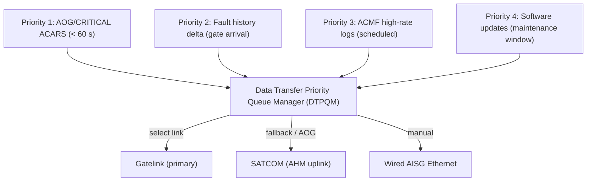
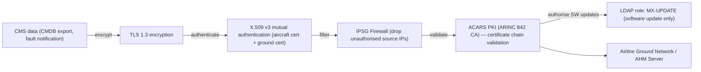

# ATLAS 040-049 · Section 04 · Subsection 045 · 070 — Ground Data Transfer and Maintenance Connectivity

## 0. Hyperlink Policy

All internal cross-references use relative Markdown links within the Q+ATLANTIDE CSDB repository. External regulatory citations in §19/§20 are marked  where hyperlinks are pending. Parent context: [ATLAS 045 README](./README.md) | [045-000 General](./045-000-Central-Maintenance-System-General.md).

---

## 1. Purpose

This document defines the ground data transfer and maintenance connectivity architecture of the CMS for the AMPEL360E eWTW aircraft. It covers Gatelink (ARINC 631-3, 802.11ax), wired Ethernet (AISG connector), SATCOM AHM uplink, data transfer priority queuing, and the security framework (TLS 1.3, X.509 mutual auth, ACARS PKI, IPSG firewall).

Key governance areas:
- Gatelink (ARINC 631-3): 802.11ax Wi-Fi 6 to airline MRO ground network.
- Wired Ethernet: 1000Base-T at aircraft service panel (AISG connector, ISO 60512-99).
- SATCOM AHM uplink: real-time health data to airline ops centre and OEM.
- Data export priority queue: AOG → fault delta → ACMF logs → software updates.
- Security: TLS 1.3, mutual X.509, ACARS PKI (ARINC 842), IPSG firewall.

---

## 2. Applicability

| Attribute | Value |
|-----------|-------|
| Aircraft Program | AMPEL360E eWTW |
| ATA Chapter | ATA 45.070 — Ground Data Transfer and Maintenance Connectivity |
| Certification Basis | CS-25 Amendment 28; DO-178C DAL C |
| Applicable Standards | ARINC 631-3; ARINC 842; IEEE 802.11ax; TLS 1.3; ISO 60512-99; DO-160G |
| Security Standard | TLS 1.3; X.509 v3; ACARS PKI (ARINC 842); IPSG |
| S1000D SNS | 045-070 |

---

## 3. Functional Description

The CMS provides three ground data transfer paths, managed by the Data Transfer Priority Queue Manager (DTPQM):

**Gatelink (ARINC 631-3)**: An 802.11ax (Wi-Fi 6) radio link from the aircraft to the airline MRO ground network, activated automatically when the aircraft arrives at a gate equipped with a Gatelink ground station. The Gatelink Radio Unit (GRU) detects the ground station beacon and initiates a secure TLS 1.3 + X.509 mutual authentication session with the ground network.

**Wired Ethernet**: A 1000Base-T Ethernet port on the lower fuselage service panel (AISG connector per ISO 60512-99) for direct laptop connection by maintenance technicians. Session authenticated by LDAP credentials + TLS 1.3 client certificate.

**SATCOM AHM Uplink**: Real-time uplink of critical parameter trends and prognostics advisories to the airline operations centre and OEM AHM service via the SATCOM Data Unit (SDU, ATA 23 interface). Used for AOG/CRITICAL fault notifications and continuous AHM data streaming.

**Security architecture**: All ground data transfers are encrypted with TLS 1.3 and authenticated by the aircraft's X.509 v3 certificate (issued by ACARS PKI per ARINC 842). An IPSG (IP Source Guard) firewall prevents unauthorised traffic injection. Software updates are additionally hash-verified (SHA-256) and require maintenance authorisation (LDAP role: MX-UPDATE).

### Diagram 1: Ground Connectivity Topology

```mermaid
graph TD
    CMS["CMS (CCU-A/B)"]
    CMS -->|Ethernet| GRU["Gatelink Radio Unit (GRU, 802.11ax)"]
    GRU -->|Wi-Fi 6, TLS 1.3| MRO["Airline MRO Ground Network"]
    CMS -->|Ethernet| AISG["Wired AISG Ethernet Port (service panel)"]
    AISG -->|1000Base-T, TLS 1.3| LAPTOP["Maintenance Laptop (LDAP auth)"]
    CMS -->|Ethernet (ATA 23 interface)| SDU["SATCOM Data Unit (SDU)"]
    SDU -->|SATCOM link| AHM["AHM Ground Server (airline + OEM)"]
    MRO --> AHNG["Airline Ground: MRO debrief system"]
    MRO --> OEM["OEM Fleet Health Portal"]
```

---

## 4. System Architecture

### Data Transfer Priority Queue

The DTPQM enforces the following priority hierarchy for all outbound CMS data:

| Priority | Data Type | Trigger | Max Latency | Link Used |
|----------|-----------|---------|-------------|-----------|
| 1 (Highest) | AOG/CRITICAL ACARS fault notification | Fault confirmed | < 60 s | SATCOM (immediate) |
| 2 | Fault history delta (since last export) | Gate arrival / Gatelink detect | < 5 min | Gatelink (primary) |
| 3 | ACMF high-rate parameter logs | Gate arrival / scheduled | < 30 min | Gatelink / SATCOM |
| 4 (Lowest) | Software updates (SW distribution) | Maintenance scheduled | N/A (background) | Gatelink / Ethernet |

If the Gatelink link is unavailable at gate arrival, DTPQM falls back to SATCOM (for fault delta) or queues for the next Gatelink opportunity or USB-C/AISG connection.

### Security Architecture

The security stack applies to all three data transfer paths:

1. **TLS 1.3**: All sessions use TLS 1.3 with mutual certificate authentication (aircraft cert + ground server cert).
2. **X.509 v3 aircraft certificate**: Issued by ACARS PKI (ARINC 842 CA); aircraft-unique; rotated per PKI policy.
3. **IPSG firewall**: Drops all packets with source IP not matching the authenticated aircraft or ground station.
4. **ACARS PKI**: ARINC 842-compliant PKI infrastructure; supports both SATCOM ACARS and IP-based Gatelink sessions.

### Diagram 2: Data Export Priority Queue



---

## 5. Components and Line-Replaceable Units

| LRU / Component | Description | Qty | Qualification |
|-----------------|-------------|-----|---------------|
| Gatelink Radio Unit (GRU) | ARINC 631-3, 802.11ax tri-band radio | 1 | DO-160G; ARINC 631-3 |
| Wired Ethernet Service Panel (AISG) | 1000Base-T Ethernet port (AISG connector, ISO 60512-99) | 1 | DO-160G |
| SATCOM Data Unit (SDU) | SATCOM interface for AHM uplink (ATA 23) | 1 | DO-160G |
| TLS 1.3 Security Module | TLS 1.3 + X.509 mutual auth stack | 1 (SW) | DO-178C DAL C |
| ACARS PKI Certificate Store | X.509 aircraft certificate storage | 1 (HW secure element) | DO-254 |
| IPSG Firewall Module | IP Source Guard firewall (DTPQM input) | 1 (SW) | DO-178C DAL C |
| Data Transfer Priority Queue Manager (DTPQM) | Priority queue for all outbound data transfers | 1 (SW) | DO-178C DAL C |

---

## 6. Interfaces

| Interface | Counterpart | Protocol | Direction |
|-----------|-------------|----------|-----------|
| Gatelink GRU | MRO ground network | IEEE 802.11ax + ARINC 631-3 | Bidirectional |
| AISG Ethernet port | Maintenance laptop | IEEE 802.3 1000Base-T | Bidirectional |
| SATCOM SDU | AHM ground / ACARS network | ACARS / IP (SATCOM) | Tx |
| LDAP | Airline LDAP server | LDAP v3 | Rx (auth) |
| ACARS PKI CA | ARINC 842 CA | X.509 / OCSP | Rx (cert validation) |
| CMDB (MDSU) | Internal MDSU storage | NVMe (internal) | Rx (data source) |

---

## 7. Operations and Modes

| Mode | Trigger | Description |
|------|---------|-------------|
| GATELINK-AUTO | Gate arrival (Gatelink beacon detected) | Auto Gatelink session; priority queue processed |
| SATCOM-IMMEDIATE | AOG/CRITICAL fault | Immediate SATCOM ACARS uplink (< 60 s) |
| SATCOM-SCHEDULED | OHM scheduled uplink window | Scheduled ACMF trend uplink to AHM |
| ETHERNET-MANUAL | Technician AISG connection | Manual export session (LDAP auth required) |
| SW-UPDATE | Maintenance window + authorisation | Software distribution via Gatelink or Ethernet |
| IDLE | No active link | DTPQM queues pending data; awaits link |

### Diagram 3: Security Layers



---

## 8. Performance and Budgets

| Parameter | Requirement | Status |
|-----------|-------------|--------|
| Gatelink standard | ARINC 631-3 |  |
| Gatelink radio | IEEE 802.11ax (Wi-Fi 6) |  |
| Gatelink throughput | typ. > 100 Mbps (link dependent) |  |
| Wired Ethernet speed | 1000Base-T (1 Gbps) |  |
| AOG ACARS uplink latency | < 60 s |  |
| TLS version | TLS 1.3 (RFC 8446) |  |
| Certificate rotation | Per ACARS PKI policy |  |
| IPSG firewall throughput | > 1 Gbps |  |

---

## 9. Safety, Redundancy and Fault Tolerance

- **Multiple transfer paths**: Gatelink, SATCOM, and wired Ethernet provide path redundancy; DTPQM automatically selects the available path.
- **TLS 1.3 mutual auth**: Prevents man-in-the-middle attacks; both aircraft and ground endpoints must present valid X.509 certificates.
- **IPSG firewall**: Prevents IP spoofing and unauthorised data injection into the CMS from the ground network.
- **Software update integrity**: All SW updates verified with SHA-256 hash before installation; corrupted packages rejected.
- **SATCOM ACARS backup**: AOG notifications always attempt SATCOM even if Gatelink is available (parallel uplink for resilience).

---

## 10. Environmental and Structural Constraints

| Constraint | Requirement | Standard |
|------------|-------------|----------|
| GRU temperature | −40 °C to +70 °C | DO-160G Cat B2 |
| GRU vibration | DO-160G Cat S | DO-160G §8 |
| GRU EMC | DO-160G Cat M | DO-160G §21 |
| AISG connector | IP54 with cap (external) | ISO 60512-99 |
| SATCOM SDU | DO-160G (ATA 23 qualification) | DO-160G |

---

## 11. Power and Cooling

| Component | Power Source | Power (W) | Notes |
|-----------|-------------|-----------|-------|
| GRU | 28 V DC Bus 1 | < 30 | 802.11ax tri-band radio |
| AISG Ethernet port | 28 V DC Maint Bus | < 5 | Port only; laptop self-powered |
| SATCOM SDU (ATA 23) | 28 V DC Bus 2 | < 80 | Shared with ATA 23 SATCOM |
| DTPQM / TLS / IPSG (SW) | CCU 28 V DC | Included in CCU budget | Software only |

---

## 12. Software and Data Management

- **DTPQM, TLS 1.3 module, IPSG firewall**: DO-178C DAL C; CMS data export partition (ARINC 653).
- **X.509 aircraft certificate**: Stored in hardware secure element (DO-254); private key non-extractable.
- **ACARS PKI**: ARINC 842 compliant; certificate issued by airline CA; OCSP-validated online, CRL-cached offline.
- **Software update distribution**: OEM-signed SW packages; SHA-256 verified on receipt; LDAP MX-UPDATE role required for installation.
- **Export audit log**: Every data transfer logged to CMDB MaintenanceActions table with timestamp, link type, data size, and initiating credential.

---

## 13. Ground Support and Servicing

| Activity | Tool / Equipment | Procedure |
|----------|-----------------|-----------|
| Gatelink link test | MRO ground station + CMP/MAT | AMM ATA 45-70-01 |
| AISG Ethernet export | Maintenance laptop + AISG cable | AMM ATA 45-70-02 |
| GRU replacement | LRU tool kit | AMM ATA 45-70-05 |
| Aircraft certificate renewal | ACARS PKI ground tool | AMM ATA 45-70-06 |
| Software update (Gatelink) | MRO SW distribution system | AMM ATA 45-12-01 |

---

## 14. Maintenance and Inspection

| Task | Interval | Reference |
|------|----------|-----------|
| Gatelink link test | 12 months | AMM ATA 45-70-01 |
| AISG connector inspection | 12 months | AMM ATA 45-70-03 |
| GRU antenna inspection | 24 months | AMM ATA 45-70-04 |
| Aircraft X.509 certificate renewal | Per PKI policy | AMM ATA 45-70-06 |
| IPSG firewall rule review | Per OEM security bulletin | AMM ATA 45-70-07 |

---

## 15. Certification Basis

| Requirement | Regulation | Status |
|-------------|------------|--------|
| Gatelink certification | ARINC 631-3; DO-160G |  |
| SATCOM data link | ETSI EN 302 977; DO-160G (ATA 23) |  |
| Data link security | ARINC 842; RFC 8446 (TLS 1.3) |  |
| Software update integrity | DO-178C SCM; SHA-256 |  |
| IPSG firewall (security) | DO-178C DAL C |  |

---

## 16. Human Factors and Crew Interface

- Gatelink auto-export status displayed on CMP at gate arrival: "GATELINK EXPORT IN PROGRESS" → "GATELINK EXPORT COMPLETE (SHA-256 OK)" or "GATELINK EXPORT FAILED — USE ETHERNET".
- AISG Ethernet connection triggers a CMP advisory: "MAINTENANCE LAPTOP CONNECTED — DATA TRANSFER AUTHORISED".
- Software update notification: displayed on CMP and MAT after successful update; requires technician acknowledgement.
- SATCOM AOG uplink status shown on CMP: "AOG NOTIFICATION SENT" within 60 s of fault confirmation.

---

## 17. Sustainability and ESG

| ESG Dimension | Initiative | Status |
|---------------|------------|--------|
| Wireless-first | Gatelink auto-export eliminates physical cable connections for routine data transfer |  |
| Data compression | CMDB delta export uses LZ4 compression; reduces Gatelink transfer time by est. 60% |  |
| Predictive dispatch | AHM uplink enables predictive maintenance scheduling before aircraft arrives at MRO |  |
| Security hardening | TLS 1.3 + IPSG eliminates legacy vulnerable protocols (TLS 1.0/1.1) |  |

---

## 18. Glossary of Terms and Acronyms

| Term | Definition |
|------|------------|
| Gatelink | ARINC 631 wireless data link between aircraft and airline ground network at gate |
| ARINC | Aeronautical Radio, Incorporated — avionics standards body |
| AHM | Aircraft Health Monitoring — ground-based fleet health and prognostics service |
| SATCOM | Satellite Communications — aircraft-to-ground data link via satellite |
| TLS | Transport Layer Security 1.3 — cryptographic protocol for data link security |
| PKI | Public Key Infrastructure — framework for issuing and validating X.509 certificates |
| IPSG | IP Source Guard — firewall technique preventing IP address spoofing |
| MRO | Maintenance, Repair and Overhaul — airline or third-party maintenance organisation |
| AISG | Antenna Interface Standards Group — defines connector standards for service panels |
| ACARS | Aircraft Communications Addressing and Reporting System — airborne data link |

---

## 19. Citations and Standards

| Ref ID | Standard | Applicability | Status |
|--------|----------|---------------|--------|
| [S1] | ARINC 631-3 — Aircraft/Ground Data Exchange (Gatelink) | Gatelink |  |
| [S2] | ARINC 842 — ACARS Public Key Infrastructure | Aircraft X.509 certificate |  |
| [S3] | RFC 8446 — TLS 1.3 | All ground links |  |
| [S4] | ISO 60512-99 — Connector Test Methods | AISG connector |  |
| [S5] | DO-160G — Environmental Conditions | GRU qualification |  |
| [S6] | IEEE 802.11ax — Wi-Fi 6 | Gatelink radio |  |
| [S7] | DO-178C DAL C | DTPQM/IPSG/TLS SW |  |

---

## 20. References

| Ref ID | Document | Version | Status |
|--------|----------|---------|--------|
| [R1] | ATLAS 045-000 — Central Maintenance System General | 1.0.0 |  |
| [R2] | ATLAS 045-040 — Maintenance Data Recording and History | 1.0.0 |  |
| [R3] | ATLAS 045-080 — CMS Monitoring, Diagnostics and Control Interfaces | 1.0.0 |  |
| [R4] | ATLAS 023 — Communications (SATCOM SDU interface) | 1.0.0 |  |
| [R5] | AMPEL360E eWTW Network Security Architecture Document | TBD |  |

---

## 21. Footprint / Component Mapping

### Physical Footprint

| LRU | Location | Bay | Position |
|-----|----------|-----|----------|
| GRU | Forward avionics bay | E/E Bay | Rack B, Slot 3 |
| AISG Ethernet Service Panel | Lower fuselage | External service panel | Port P45-2 |
| SATCOM SDU (ATA 23) | Aft avionics bay | E/E Bay | ATA 23 rack |

### Electrical / Data Footprint

| LRU | Power Bus | Power (W) | Data Interface |
|-----|-----------|-----------|----------------|
| GRU | 28 V DC Bus 1 | < 30 | Ethernet to CMS + 802.11ax |
| AISG Port | 28 V DC Maint Bus | < 5 | 1000Base-T |
| SATCOM SDU | 28 V DC Bus 2 | < 80 | ATA 23 Ethernet interface |
| DTPQM (SW) | CCU 28 V DC | Included in CCU | Software module |

### Maintenance Footprint

| Activity | Access Required | Duration |
|----------|----------------|----------|
| GRU replacement | E/E bay door | 25 min |
| AISG cable connection | External service panel | 2 min |
| Aircraft certificate renewal | Gatelink/Ethernet + PKI tool | 30 min |

---

## 22. Change Log

| Version | Date | Author | Description |
|---------|------|--------|-------------|
| 1.0.0 | 2026-05-10 | Q+ Team/Amedeo Pelliccia + AI | Initial baseline document creation |
