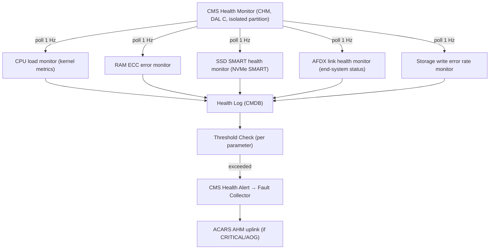
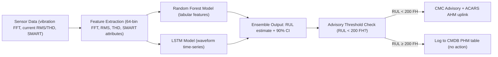
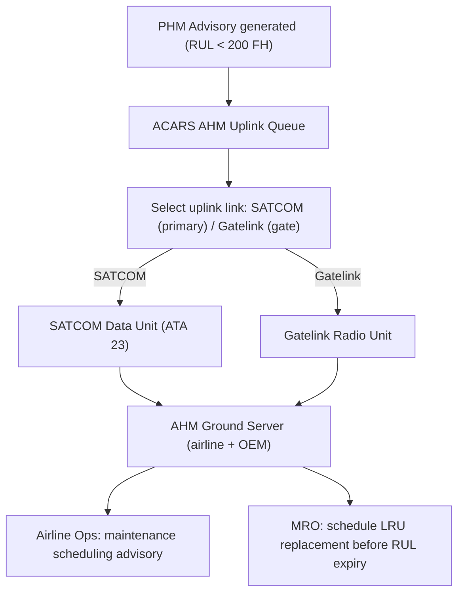

# ATLAS 040-049 · Section 04 · Subsection 045 · 080 — CMS Monitoring, Diagnostics and Control Interfaces

## 0. Hyperlink Policy

All internal cross-references use relative Markdown links within the Q+ATLANTIDE CSDB repository. External regulatory citations in §19/§20 are marked  where hyperlinks are pending. Parent context: [ATLAS 045 README](./README.md) | [045-000 General](./045-000-Central-Maintenance-System-General.md).

> **Governance note**: This subsubject is classified as `programme-controlled-diagnostics-extension`. PHM/ML functions documented here are advisory-only and are not credited for aircraft type certification.

---

## 1. Purpose

This document defines the CMS health monitoring, diagnostics, and prognostics architecture for the AMPEL360E eWTW. It covers the CMS Health Monitor (CHM) — monitoring the computing, network, and storage health of the CMS itself — and the Prognostics and Health Management (PHM) engine for remaining-useful-life (RUL) prediction of key aircraft LRUs, including eWTW-specific EMA prognostics using vibration signature and current waveform analysis.

Key governance areas:
- CHM: monitors CPU load, RAM usage, SSD SMART health, AFDX link status, storage write errors.
- PHM: random forest + LSTM RUL prediction; fleet-trained; inference on-board at 1 Hz.
- EMA PHM: vibration spectrum (FFT, 64 bins) + phase current waveform (RMS, THD).
- ACARS/AHM real-time prognostics uplink (programme-controlled).
- All PHM outputs are advisory-only; not credited for certification.

---

## 2. Applicability

| Attribute | Value |
|-----------|-------|
| Aircraft Program | AMPEL360E eWTW |
| ATA Chapter | ATA 45.080 — CMS Monitoring, Diagnostics and Control Interfaces |
| Governance Class | Programme-Controlled Diagnostics Extension |
| Certification Basis | CS-25 Amendment 28 (CHM only); PHM not credited for certification |
| Applicable Standards | DO-178C DAL C (CHM); ARINC 664 P7; DO-160G |
| PHM Model | Random Forest + LSTM (OEM fleet-trained, inference on-board) |
| S1000D SNS | 045-080 |

---

## 3. Functional Description

### CMS Health Monitor (CHM)

The CHM is a DO-178C DAL C software application running as an isolated ARINC 653 partition on both CCU-A and CCU-B. It monitors the following CMS-internal health parameters:

| Parameter | Monitor Method | Threshold |
|-----------|---------------|-----------|
| CCU CPU load | OS kernel metrics | Alert if > 85% for > 5 s |
| CCU RAM usage | ECC error rate + used% | Alert if ECC errors > 10/hour or usage > 90% |
| SSD SMART health | NVMe SMART attributes | Alert on any SMART warning flag |
| AFDX link status | AFDX end-system health | Alert if any link down for > 3 s |
| Storage write error rate | MDSU write queue errors | Alert if > 0 errors/hour |

CHM stores its health log in the CMDB and reports degradation events to the Fault Collector (treated as CMS self-fault, ATA 45 fault code).

### Prognostics and Health Management (PHM) Engine

The PHM engine is a programme-controlled (non-DO-178C) application running in an isolated partition on CCU-A/B. It implements a dual-model approach:

- **Random forest model**: Tabular feature-based prediction for slow-degrading LRUs (bearings, power supplies, SSD). Input features: vibration RMS, temperature trend, SMART attributes, operating hours.
- **LSTM model**: Sequential time-series prediction for waveform-based degradation (EMA current waveform distortion, motor bearing vibration spectra). Input: 64-bin FFT + RMS + THD per actuator.

Models are trained by the OEM on fleet-wide historical data and deployed quarterly as signed model files (SHA-256). Inference runs on-board at 1 Hz. PHM output: RUL estimate in flight hours (FH) with a 90% confidence interval. Advisory threshold: if RUL < 200 FH, CMC advisory displayed and ACARS AHM uplink triggered.

### Diagram 1: CHM Monitoring Loop

---

## 4. System Architecture

### CHM Architecture

CHM operates in an ARINC 653 isolated partition on CCU-A and CCU-B simultaneously. It has read-only access to the OS kernel health metrics, AFDX end-system registers, and MDSU SMART data. CHM cannot modify CMS operating parameters — it is strictly a monitoring and alert-generation function.

### PHM Architecture

The PHM engine operates in a separate non-DO-178C partition (programme-controlled isolation). It has read-only access to the ACMF parameter log stream from the CCU. PHM inference runs at 1 Hz; outputs are written to the CMDB as PHM advisory records, separate from fault records.

**EMA PHM inputs**: For each EMA (Electro-Mechanical Actuator):
- Vibration spectrum: 64-bin FFT from each EMA vibration sensor, sampled at 1 Hz.
- Phase current: RMS and THD (Total Harmonic Distortion) per motor phase, sampled at 8 Hz.
- Operating hours and thermal history.

**RUL advisory threshold**: RUL < 200 FH triggers CMP advisory and automatic ACARS AHM uplink. RUL < 50 FH triggers "PLAN REMOVAL NEXT HEAVY CHECK" escalated advisory.

### Diagram 2: PHM RUL Prediction Flow

---

## 5. Components and Line-Replaceable Units

| Component | Description | Hosted On | Qualification |
|-----------|-------------|-----------|---------------|
| CHM Application | CMS self-health monitor (DAL C) | CCU-A/B (isolated ARINC 653 partition) | DO-178C DAL C |
| PHM Engine | Random forest + LSTM RUL predictor | CCU-A/B (programme-controlled partition) | Not DO-178C |
| EMA Vibration/Current Interface | AFDX interface for EMA sensor data | CCU-A/B (SW) | DO-178C DAL C |
| SMART Storage Monitor | NVMe SMART attribute reader | CCU-A/B (SW) | DO-178C DAL C |
| AFDX Network Health Monitor | AFDX end-system link monitor | CCU-A/B (SW) | DO-178C DAL C |
| ACARS AHM Uplink Agent | PHM advisory ACARS uplink (prog-ctrl) | CCU-A/B (SW) | Programme-controlled |

---

## 6. Interfaces

| Interface | Counterpart | Protocol | Direction |
|-----------|-------------|----------|-----------|
| OS kernel metrics | CCU-A/B OS | Internal API | Rx |
| AFDX end-system registers | AFDX NIC | AFDX internal | Rx |
| MDSU SMART data | NVMe SMART interface | PCIe (internal) | Rx |
| ACMF parameter stream | ACMF application | Shared memory | Rx |
| CMDB write (PHM/CHM records) | MDSU | NVMe (internal) | Tx |
| ACARS uplink | SATCOM SDU / Gatelink | ACARS / IP | Tx |
| CMP/MAT advisory display | Maintenance terminals | ARINC 429 / Ethernet | Tx |

---

## 7. Operations and Modes

| Mode | System | State | Description |
|------|--------|-------|-------------|
| CHM-NORMAL | CHM | Monitoring | All health parameters within thresholds |
| CHM-DEGRADED | CHM | Alert | One or more parameters exceed threshold; alert raised |
| PHM-NOMINAL | PHM | Inferencing | RUL > 200 FH for all monitored LRUs |
| PHM-ADVISORY | PHM | Advisory raised | RUL < 200 FH; CMC advisory + ACARS uplink |
| PHM-ESCALATED | PHM | Escalated advisory | RUL < 50 FH; plan removal advisory |
| PHM-OFFLINE | PHM | Model unavailable | PHM model missing/corrupted; display "PHM OFFLINE" |

### Diagram 3: ACARS AHM Uplink Sequence

---

## 8. Performance and Budgets

| Parameter | Requirement | Status |
|-----------|-------------|--------|
| CHM monitoring rate | 1 Hz (all parameters) |  |
| PHM inference rate | 1 Hz |  |
| PHM model update frequency | Quarterly (OEM) |  |
| RUL prediction confidence | 90% CI |  |
| RUL advisory threshold | < 200 FH |  |
| EMA FFT bins | 64 bins |  |
| ACARS AHM uplink latency | < 300 s (prognostics, non-AOG) |  |
| CHM CPU overhead | < 5% of CCU CPU |  |

---

## 9. Safety, Redundancy and Fault Tolerance

- **PHM advisory-only**: PHM outputs are advisory; no automated maintenance actions or flight restrictions are triggered by PHM alone. Technician confirmation always required.
- **CHM independence**: CHM runs in an isolated ARINC 653 partition with no write access to CMS operating parameters; cannot inadvertently affect CMS operation.
- **PHM model integrity**: PHM model files are SHA-256 signed; corrupted or unsigned models result in "PHM OFFLINE" mode, not a CMS fault.
- **CHM dual-CCU**: CHM runs on both CCU-A and CCU-B; health data from both channels are cross-validated.
- **ACARS uplink retry**: ACARS AHM uplink retries up to 3 times before queuing for next Gatelink opportunity.

---

## 10. Environmental and Structural Constraints

| Constraint | Requirement | Standard |
|------------|-------------|----------|
| CHM/PHM software environment | Hosted in DO-160G qualified CCU | DO-160G |
| EMA sensor interface | DO-160G Cat S vibration qualification | DO-160G §8 |
| AFDX SMART/health data | DO-160G EMI qualified AFDX NIC | DO-160G §21 |

---

## 11. Power and Cooling

All CHM and PHM components are software modules on CCU-A/B. Power and cooling budgets are included within the CCU budgets defined in [045-010](./045-010-Maintenance-Computing-and-Core-Processing.md).

| Component | Additional Power | Notes |
|-----------|-----------------|-------|
| CHM (SW) | Included in CCU budget | < 1% additional CPU load |
| PHM engine (SW) | Included in CCU budget | Est. < 10% additional CPU load (inference at 1 Hz) |

---

## 12. Software and Data Management

- **CHM**: DO-178C DAL C; isolated ARINC 653 partition; read-only OS and hardware interfaces.
- **PHM engine**: Programme-controlled (not DO-178C); isolated partition; model files loaded from MDSU.
- **PHM model distribution**: OEM-signed model files; SHA-256 hash verified on load; loaded via Gatelink or USB-C.
- **PHM advisory records**: Stored in CMDB as separate PHM table; not mixed with fault records; included in Gatelink/SATCOM export.
- **Data sovereignty**: PHM model files are OEM intellectual property; exported to airline ground only with OEM authorisation.

---

## 13. Ground Support and Servicing

| Activity | Tool / Equipment | Procedure |
|----------|-----------------|-----------|
| CHM health log review | CMP or MAT | AMM ATA 45-80-01 |
| PHM advisory review | CMP or MAT PHM panel | AMM ATA 45-80-02 |
| PHM model update | Gatelink or USB-C (OEM auth) | AMM ATA 45-80-05 |
| PHM advisory export | Gatelink / SATCOM AHM | AMM ATA 45-80-06 |
| EMA sensor interface test | IBIT (ground only) | AMM ATA 45-50-01 |

---

## 14. Maintenance and Inspection

| Task | Interval | Reference |
|------|----------|-----------|
| CHM health log review | Per flight | CMC auto-report |
| PHM advisory review | Per flight | CMP PHM panel |
| PHM model currency check | Quarterly | AMM ATA 45-80-05 |
| EMA PHM calibration (sensor baseline) | 500 FH | AMM ATA 45-80-07 |
| PHM RUL validation audit | 12 months | AMM ATA 45-80-08 |

---

## 15. Certification Basis

| Requirement | Regulation | Status |
|-------------|------------|--------|
| CHM software | DO-178C DAL C |  |
| PHM engine (not credited) | Programme-controlled; advisory only |  |
| CHM safety isolation | ARINC 653 spatial isolation |  |
| ACARS AHM uplink | ARINC 842; DO-280B |  |
| EMA sensor interface | DO-160G; CS-25 AMC 25.1309 |  |

---

## 16. Human Factors and Crew Interface

- CHM health status displayed on CMP as a "CMS HEALTH" panel: green/amber/red per parameter.
- PHM advisory displayed in a dedicated "PROGNOSTICS" panel on CMP and MAT, clearly labelled "ADVISORY ONLY — NOT A CERTIFIED MAINTENANCE REQUIREMENT".
- PHM RUL displayed as: "EMA-3: RUL 185 FH (90% CI: 160–210 FH) — PLAN REMOVAL".
- PHM panel suppressed from Cabin Maintenance Panel (not relevant to cabin crew).

---

## 17. Sustainability and ESG

| ESG Dimension | Initiative | Status |
|---------------|------------|--------|
| Predictive maintenance | PHM RUL prediction enables scheduled replacement, eliminating AOG events |  |
| Reduced waste | PHM prevents early LRU removal (run-to-limit rather than time-based replacement) |  |
| EMA longevity | Current waveform monitoring detects early bearing damage before failure |  |
| Fleet learning | OEM retrains PHM model quarterly on fleet data; improves over time |  |

---

## 18. Glossary of Terms and Acronyms

| Term | Definition |
|------|------------|
| CHM | CMS Health Monitor — monitors CMS computing, network, and storage health |
| PHM | Prognostics and Health Management — RUL prediction system for key aircraft LRUs |
| RUL | Remaining Useful Life — predicted service life remaining in flight hours |
| SMART | Self-Monitoring, Analysis and Reporting Technology — NVMe/SSD health monitoring standard |
| ACARS | Aircraft Communications Addressing and Reporting System — airborne data link |
| AHM | Aircraft Health Monitoring — ground-based fleet health and prognostics service |
| ML | Machine Learning — statistical models used for pattern recognition and prediction |
| LRU | Line-Replaceable Unit — a modular avionics component removable on the flight line |
| AFDX | Avionics Full-Duplex Switched Ethernet — ARINC 664 Part 7 deterministic network |
| EMA | Electro-Mechanical Actuator — electrically driven flight control actuator (eWTW) |

---

## 19. Citations and Standards

| Ref ID | Standard | Applicability | Status |
|--------|----------|---------------|--------|
| [S1] | DO-178C DAL C | CHM software |  |
| [S2] | ARINC 653 — Avionics RTOS Standard | CHM isolated partition |  |
| [S3] | ARINC 664 Part 7 — AFDX | AFDX health monitoring |  |
| [S4] | NVMe SMART (NVM Express Base Specification) | SSD health monitoring |  |
| [S5] | ARINC 842 — ACARS PKI | AHM uplink security |  |
| [S6] | CS-25 AMC 25.1309 | CHM safety basis |  |

---

## 20. References

| Ref ID | Document | Version | Status |
|--------|----------|---------|--------|
| [R1] | ATLAS 045-000 — Central Maintenance System General | 1.0.0 |  |
| [R2] | ATLAS 045-010 — Maintenance Computing and Core Processing | 1.0.0 |  |
| [R3] | ATLAS 045-070 — Ground Data Transfer and Maintenance Connectivity | 1.0.0 |  |
| [R4] | AMPEL360E eWTW PHM Model Technical Specification | TBD |  |
| [R5] | AMPEL360E eWTW EMA Sensor Interface Specification | TBD |  |

---

## 21. Footprint / Component Mapping

### Physical Footprint

| Component | Location | Bay | Notes |
|-----------|----------|-----|-------|
| CHM (SW) | CCU-A/B | E/E Bay | Isolated ARINC 653 partition |
| PHM engine (SW) | CCU-A/B | E/E Bay | Programme-controlled partition |
| EMA sensor interface (SW) | CCU-A/B | E/E Bay | AFDX data consumer |
| ACARS AHM Uplink Agent (SW) | CCU-A/B | E/E Bay | Programme-controlled |

### Electrical / Data Footprint

| Component | Power Source | Data Interface | Notes |
|-----------|-------------|----------------|-------|
| CHM (SW) | CCU 28 V DC | CCU internal OS + AFDX | < 1% CPU overhead |
| PHM engine (SW) | CCU 28 V DC | ACMF parameter stream | < 10% CPU overhead |
| ACARS uplink agent (SW) | CCU 28 V DC | SATCOM SDU / Gatelink | Via ATA 23 SATCOM |

### Maintenance Footprint

| Activity | Access Required | Duration |
|----------|----------------|----------|
| PHM model update | CMP/MAT/Gatelink | 20 min |
| PHM advisory review | CMP or MAT | 5 min |
| EMA sensor baseline check | IBIT (ground) | 15 min per EMA |

---

## 22. Change Log

| Version | Date | Author | Description |
|---------|------|--------|-------------|
| 1.0.0 | 2026-05-10 | Q-DATAGOV / Copilot | Initial baseline document creation; programme-controlled diagnostics extension |
