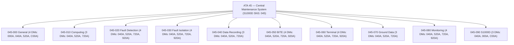
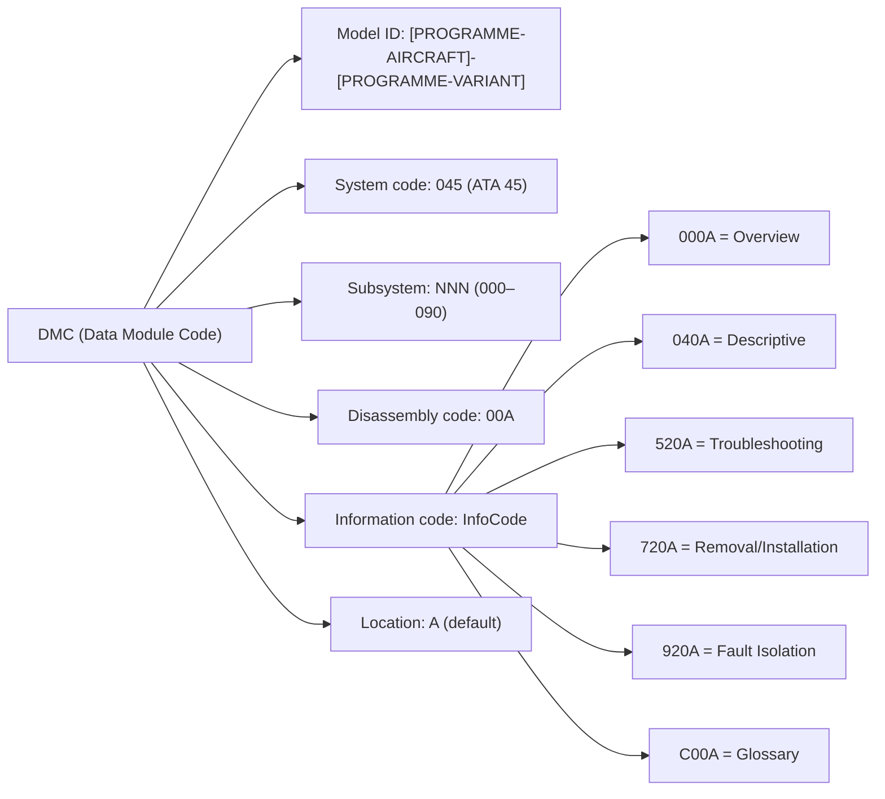
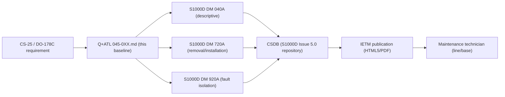

# ATLAS 040-049 · Section 04 · Subsection 045 · 090 — S1000D CSDB Mapping and Traceability

## 0. Hyperlink Policy

All internal cross-references use relative Markdown links within the Q+ATLANTIDE CSDB repository. External regulatory citations in §19/§20 are marked  where hyperlinks are pending. Parent context: [ATLAS 045 README](./README.md) | [045-000 General](./045-000-Central-Maintenance-System-General.md).

> **Governance note**: This subsubject is classified as `programme-controlled-publication-and-traceability-extension`. The DMRL and traceability matrix are programme-controlled artefacts and subject to configuration control outside the standard baseline.

---

## 1. Purpose

This document defines the S1000D Issue 5.0 CSDB (Common Source Data Base) mapping and traceability architecture for ATA 45 — Central Maintenance System. It establishes the Data Module Requirements List (DMRL) for all 9 SNS nodes (045-000 through 045-080), the DMC naming schema, information code usage, and the traceability chain from Q+ATLANTIDE source documents to S1000D data modules, certification requirements, and IETM publication.

Key governance areas:
- Full DMRL for ATA 45: 36 Data Modules across 9 SNS nodes.
- DMC schema: `DMC-<PROGRAMME>-<VARIANT>-045-{NNN}-00A-{InfoCode}`.
- Information codes: 040 (descriptive), 520 (troubleshooting), 720 (removal/installation procedures).
- Traceability matrix: each Q+ATL subsubject file → DMC → certification requirement.
- CAGE code:  (pending programme registration).

---

## 2. Applicability

| Attribute | Value |
|-----------|-------|
| Aircraft Program | programme-defined aircraft type |
| ATA Chapter | ATA 45.090 — S1000D CSDB Mapping and Traceability |
| S1000D Issue | Issue 5.0 |
| Governance Class | Programme-Controlled Publication and Traceability Extension |
| CAGE Code |  |
| CSDB Platform |  (tool selection pending) |
| S1000D SNS | 045-090 |

---

## 3. Functional Description

The S1000D CSDB for ATA 45 is structured per S1000D Issue 5.0 with the following characteristics:

**SNS structure**: The System/Subsystem/Sub-subsystem (SNS) numbering follows the ATA chapter structure: system 045, subsystems 000–080 (9 nodes). Each SNS node generates multiple data modules based on the content type required.

**DMC naming schema**: `DMC-<PROGRAMME>-<VARIANT>-045-{NNN}-00A-{InfoCode}-A`

Where:
- `[PROGRAMME-AIRCRAFT]-[PROGRAMME-VARIANT]` = Model Identification Code.
- `045` = System code (ATA 45).
- `{NNN}` = Subsystem/unit (000, 010, 020, … 080).
- `00A` = Disassembly code group 00, variant A.
- `{InfoCode}` = Information code (000A overview, 040A descriptive, 520A troubleshooting, 720A removal/installation, 920A fault isolation, C00A glossary).
- Trailing `A` = Location (A = applicability/default).

**Information codes used**:
- `040A` — Descriptive information (system description, architecture).
- `520A` — Troubleshooting information (FIM references, fault isolation guidance).
- `720A` — Removal/installation procedures (LRU replacement procedures).
- `920A` — Fault isolation (detailed FIM procedures per ATA chapter).
- `000A` — Overview (045-000 only).
- `C00A` — Glossary (045-000 only).

**Total DMRL**: 36 data modules across 9 SNS nodes.

### Diagram 1: DMRL SNS Tree



---

## 4. System Architecture

### CSDB Platform Architecture

The S1000D CSDB for programme-defined aircraft type ATA 45 shall be hosted on a programme-selected CSDB platform (tool TBD). The CSDB shall support:
- S1000D Issue 5.0 schema validation.
- Applicability management (per aircraft tail number, configuration).
- Change-management workflow (review, approve, publish).
- IETM delivery in HTML5 + PDF format.
- Export to SCORM 2004 for e-learning integration.

The traceability matrix links each Q+ATLANTIDE Markdown source file to one or more DMCs and to one or more certification requirements (CS-25, DO-178C, DO-254, DO-160G, ATA MSG-3).

### DMC Naming Schema Detail

```
DMC - [PROGRAMME-AIRCRAFT]-[PROGRAMME-VARIANT] - 045 - {NNN} - 00A - {InfoCode} - A
      |                 |     |       |      |             |
      Model ID          Sys   Sub     Disas  InfoCode      Location
                              code    code
```

### Diagram 2: DMC Naming Schema



---

## 5. Components and Line-Replaceable Units

| Component | Description | Status |
|-----------|-------------|--------|
| CSDB Platform | Tool TBD (Cortona3D / SDL / Flatirons / custom) |  |
| IETM Delivery System | HTML5 + PDF publication platform |  |
| DMRL Document | 36-entry DMRL spreadsheet/DB |  |
| DM XML files | 36 × S1000D Issue 5.0 XML data modules |  |
| Traceability Matrix | Spreadsheet/DB: Q+ATL file → DMC → cert requirement |  |
| Applicability Management Module | Per-tail configuration applicability filter |  |

---

## 6. Interfaces

| Interface | Counterpart | Protocol/Format | Direction |
|-----------|-------------|-----------------|-----------|
| Q+ATLANTIDE Markdown source | CSDB authoring tool | Markdown → XML conversion | Input |
| CSDB → IETM | Publication platform | S1000D XML → HTML5/PDF | Output |
| CSDB → MRO system | Airline MRO software | XML export / REST API | Output |
| Traceability matrix | Certification team | Spreadsheet / JIRA | Bidirectional |
| Applicability DB | Aircraft configuration management | XML applicability annotations | Input |

---

## 7. Operations and Modes

| Phase | CSDB State | Description |
|-------|-----------|-------------|
| AUTHORING | In progress | Q+ATL Markdown → DM XML authoring and validation |
| REVIEW | Under review | SME review and comment resolution |
| APPROVED | Approved | DM approved for publication; CSDB configuration item |
| PUBLISHED | Published | DM available in IETM to maintenance technicians |
| SUPERSEDED | Superseded | DM replaced by later revision; accessible for historical reference |
| OBSOLETE | Obsolete | DM withdrawn; no longer applicable |

### Diagram 3: Traceability Chain



---

## 8. Performance and Budgets

| Parameter | Requirement | Status |
|-----------|-------------|--------|
| Total ATA 45 data modules | 36 DMs |  |
| S1000D issue | Issue 5.0 |  |
| IETM delivery format | HTML5 + PDF |  |
| DM review cycle | Per OEM programme schedule |  |
| Traceability matrix coverage | 100% of ATA 45 subsubjects |  |
| CAGE code | TBD (programme registration) |  |

---

## 9. Safety, Redundancy and Fault Tolerance

- **DM configuration control**: All DMs in CSDB are version-controlled; each publication must be tagged with aircraft programme configuration baseline.
- **Traceability completeness**: Traceability matrix must achieve 100% coverage before type certificate application.
- **Applicability management**: Incorrect applicability can result in wrong-aircraft maintenance; applicability filters are review-controlled.
- **Access control**: CSDB write access restricted to authorised authoring team; IETM read access controlled by LDAP role.

---

## 10. Environmental and Structural Constraints

The S1000D CSDB is a ground-based IT system and is not subject to DO-160G environmental qualification. However, the IETM delivery system must support access by:
- MAT (12-inch tablet) at aircraft access panels (outdoor/hangar environment).
- Crew Tablet App (walk-around in all weather conditions).
- Maintenance laptops (AISG Ethernet connection at aircraft service panel).

---

## 11. Power and Cooling

The CSDB platform is a ground-based server system with standard data-centre power and cooling requirements. On-aircraft IETM access via MAT or Crew Tablet App uses the aircraft's Wi-Fi 6 maintenance AP (power budgeted under ATA 45-060).

---

## 12. Software and Data Management

- **CSDB platform**: S1000D Issue 5.0 schema-validated; change management workflow enforced.
- **DM versioning**: Each DM has an issue number (01, 02, …) and in-work/approved/deleted status.
- **Traceability matrix**: Maintained in a programme-controlled spreadsheet or PLM tool; updated with every DM revision.
- **IETM publication**: Triggered by CSDB configuration baseline release; HTML5 + PDF generated automatically from CSDB.
- **Export format**: S1000D IETP Package (SGML/XML); SCORM 2004 for training; PDF for printed AMM reference.

---

## 13. Ground Support and Servicing

| Activity | Tool / Equipment | Procedure |
|----------|-----------------|-----------|
| IETM access (on-aircraft) | MAT or Crew Tablet App | AMM ATA 45-60-02 |
| CSDB DM authoring | CSDB authoring tool (ground) | Programme IWP-TECH-045 |
| Traceability matrix update | Programme PLM tool | Programme IWP-TRACE-045 |
| IETM publication | CSDB platform (automated) | Programme IWP-PUB-045 |

---

## 14. Maintenance and Inspection

| Task | Interval | Reference |
|------|----------|-----------|
| DMRL currency check | Per OEM DM release cycle | Programme IWP-DMRL-045 |
| Traceability matrix audit | At each major revision | Programme IWP-TRACE-045 |
| IETM access test (MAT/Tablet) | 12 months | AMM ATA 45-60-02 |
| CSDB applicability validation | Per aircraft delivery | Programme IWP-APPLIC-045 |

---

## 15. Certification Basis

| Requirement | Regulation | Status |
|-------------|------------|--------|
| Technical publication compliance | CS-25 §25.1529 (Instructions for Continued Airworthiness) |  |
| ICA completeness | CS-25 Appendix H |  |
| S1000D applicability | Programme decision (not mandatory for CS-25) |  |
| Traceability completeness | Certification plan (CRI requirement) |  |

---

## 16. Human Factors and Crew Interface

- IETM displayed on MAT must meet AMC 25.1302 human factors requirements for maintenance tasks.
- DM text written at maximum reading grade level 10 (Flesch–Kincaid) per ATA iSpec 2200 guidance.
- Warning, Caution, and Note panels displayed per S1000D Issue 5.0 §3.9.5.
- Procedural DMs (720A) include step-by-step numbered instructions with figure references.

---

## 17. Sustainability and ESG

| ESG Dimension | Initiative | Status |
|---------------|------------|--------|
| Paperless publications | S1000D IETM eliminates printed AMM binders |  |
| Reuse | S1000D modular DMs enable cross-aircraft type reuse |  |
| Rapid update | CSDB enables rapid DM update and electronic distribution |  |
| Data sovereignty | CSDB hosted per airline data residency requirements |  |

---

## 18. Glossary of Terms and Acronyms

| Term | Definition |
|------|------------|
| DMRL | Data Module Requirements List — the complete list of data modules required for a system |
| DMC | Data Module Code — unique identifier for each S1000D data module |
| SNS | System/Subsystem/Sub-subsystem number — ATA-based hierarchical code for S1000D |
| CSDB | Common Source Data Base — the S1000D repository for all data modules |
| S1000D | International specification for technical publications using CSDB and IETM |
| DM | Data Module — the atomic unit of technical information in an S1000D CSDB |
| InfoCode | Information code — S1000D classification of data module content type |
| ATA | Air Transport Association — defines the chapter/section/subject structure for aviation |
| CAGE | Commercial and Government Entity code — unique company identifier for DMC Model ID |
| ICAO | International Civil Aviation Organization — sets international aviation standards |

---

## 19. Citations and Standards

| Ref ID | Standard | Applicability | Status |
|--------|----------|---------------|--------|
| [S1] | S1000D Issue 5.0 — International Specification for Technical Publications | CSDB and DMRL |  |
| [S2] | ATA iSpec 2200 — Information Standards for Aviation Maintenance | DM authoring style |  |
| [S3] | CS-25 §25.1529 — Instructions for Continued Airworthiness | ICA certification basis |  |
| [S4] | CS-25 Appendix H — Instructions for Continued Airworthiness | ICA completeness |  |
| [S5] | ATA MSG-3 Rev 2015 | FIM DM basis (920A) |  |
| [S6] | SCORM 2004 — Sharable Content Object Reference Model | IETM e-learning export |  |

---

## 20. References

| Ref ID | Document | Version | Status |
|--------|----------|---------|--------|
| [R1] | ATLAS 045-000 — Central Maintenance System General | 1.0.0 |  |
| [R2] | ATLAS 045-010 through 045-080 (all subsubjects) | 1.0.0 |  |
| [R3] | programme-defined aircraft type Programme CSDB Platform Selection Document | TBD |  |
| [R4] | programme-defined aircraft type CAGE Code Registration | TBD |  |
| [R5] | Q+ATLANTIDE Baseline Document | 1.0.0 |  |

---

## 21. Footprint / Component Mapping

### DMRL — 36 Data Modules for ATA 45

| DM No. | DMC | Title | Info Code | SNS | Q+ATL Source | Priority |
|--------|-----|-------|-----------|-----|--------------|----------|
| 1 | DMC-<PROGRAMME>-<VARIANT>-045-000-00A-000A-A | CMS Overview | 000A | 045-000 | 045-000-Central-Maintenance-System-General.md | High |
| 2 | DMC-<PROGRAMME>-<VARIANT>-045-000-00A-040A-A | CMS General Description | 040A | 045-000 | 045-000-Central-Maintenance-System-General.md | High |
| 3 | DMC-<PROGRAMME>-<VARIANT>-045-000-00A-520A-A | CMS General Troubleshooting | 520A | 045-000 | 045-000-Central-Maintenance-System-General.md | High |
| 4 | DMC-<PROGRAMME>-<VARIANT>-045-000-00A-C00A-A | CMS Glossary | C00A | 045-000 | 045-000-Central-Maintenance-System-General.md | Medium |
| 5 | DMC-<PROGRAMME>-<VARIANT>-045-010-00A-040A-A | Computing and Core Processing Description | 040A | 045-010 | 045-010-Maintenance-Computing-and-Core-Processing.md | High |
| 6 | DMC-<PROGRAMME>-<VARIANT>-045-010-00A-520A-A | Computing and Core Processing Troubleshooting | 520A | 045-010 | 045-010-Maintenance-Computing-and-Core-Processing.md | High |
| 7 | DMC-<PROGRAMME>-<VARIANT>-045-010-00A-720A-A | CCU Removal/Installation | 720A | 045-010 | 045-010-Maintenance-Computing-and-Core-Processing.md | High |
| 8 | DMC-<PROGRAMME>-<VARIANT>-045-020-00A-040A-A | Fault Detection Description | 040A | 045-020 | 045-020-Fault-Detection-and-Fault-Reporting.md | High |
| 9 | DMC-<PROGRAMME>-<VARIANT>-045-020-00A-520A-A | Fault Detection Troubleshooting | 520A | 045-020 | 045-020-Fault-Detection-and-Fault-Reporting.md | High |
| 10 | DMC-<PROGRAMME>-<VARIANT>-045-020-00A-720A-A | BITE Interface Module Procedures | 720A | 045-020 | 045-020-Fault-Detection-and-Fault-Reporting.md | Medium |
| 11 | DMC-<PROGRAMME>-<VARIANT>-045-020-00A-920A-A | Fault Detection Fault Isolation | 920A | 045-020 | 045-020-Fault-Detection-and-Fault-Reporting.md | High |
| 12 | DMC-<PROGRAMME>-<VARIANT>-045-030-00A-040A-A | Fault Isolation Logic Description | 040A | 045-030 | 045-030-Fault-Isolation-and-Troubleshooting-Logic.md | High |
| 13 | DMC-<PROGRAMME>-<VARIANT>-045-030-00A-520A-A | FIM Troubleshooting | 520A | 045-030 | 045-030-Fault-Isolation-and-Troubleshooting-Logic.md | High |
| 14 | DMC-<PROGRAMME>-<VARIANT>-045-030-00A-720A-A | FIM Database Update Procedures | 720A | 045-030 | 045-030-Fault-Isolation-and-Troubleshooting-Logic.md | Medium |
| 15 | DMC-<PROGRAMME>-<VARIANT>-045-030-00A-920A-A | FIM Fault Isolation Procedures | 920A | 045-030 | 045-030-Fault-Isolation-and-Troubleshooting-Logic.md | High |
| 16 | DMC-<PROGRAMME>-<VARIANT>-045-040-00A-040A-A | Data Recording and History Description | 040A | 045-040 | 045-040-Maintenance-Data-Recording-and-History.md | High |
| 17 | DMC-<PROGRAMME>-<VARIANT>-045-040-00A-520A-A | CMDB Troubleshooting | 520A | 045-040 | 045-040-Maintenance-Data-Recording-and-History.md | High |
| 18 | DMC-<PROGRAMME>-<VARIANT>-045-040-00A-720A-A | MDSU Removal/Installation | 720A | 045-040 | 045-040-Maintenance-Data-Recording-and-History.md | High |
| 19 | DMC-<PROGRAMME>-<VARIANT>-045-050-00A-040A-A | BITE Interfaces Description | 040A | 045-050 | 045-050-BITE-Interfaces-and-System-Test-Coordination.md | High |
| 20 | DMC-<PROGRAMME>-<VARIANT>-045-050-00A-520A-A | BITE Interfaces Troubleshooting | 520A | 045-050 | 045-050-BITE-Interfaces-and-System-Test-Coordination.md | High |
| 21 | DMC-<PROGRAMME>-<VARIANT>-045-050-00A-720A-A | BITE Subscriber Registry Update Procedures | 720A | 045-050 | 045-050-BITE-Interfaces-and-System-Test-Coordination.md | Medium |
| 22 | DMC-<PROGRAMME>-<VARIANT>-045-050-00A-920A-A | IBIT/MBIT Fault Isolation Procedures | 920A | 045-050 | 045-050-BITE-Interfaces-and-System-Test-Coordination.md | High |
| 23 | DMC-<PROGRAMME>-<VARIANT>-045-060-00A-040A-A | Maintenance Terminal Description | 040A | 045-060 | 045-060-Maintenance-Terminal-and-Crew-Maintenance-Interfaces.md | High |
| 24 | DMC-<PROGRAMME>-<VARIANT>-045-060-00A-520A-A | CMP/MAT Troubleshooting | 520A | 045-060 | 045-060-Maintenance-Terminal-and-Crew-Maintenance-Interfaces.md | High |
| 25 | DMC-<PROGRAMME>-<VARIANT>-045-060-00A-720A-A | CMP Removal/Installation | 720A | 045-060 | 045-060-Maintenance-Terminal-and-Crew-Maintenance-Interfaces.md | High |
| 26 | DMC-<PROGRAMME>-<VARIANT>-045-060-00A-920A-A | CMP/MAT Fault Isolation | 920A | 045-060 | 045-060-Maintenance-Terminal-and-Crew-Maintenance-Interfaces.md | Medium |
| 27 | DMC-<PROGRAMME>-<VARIANT>-045-070-00A-040A-A | Ground Data Transfer Description | 040A | 045-070 | 045-070-Ground-Data-Transfer-and-Maintenance-Connectivity.md | High |
| 28 | DMC-<PROGRAMME>-<VARIANT>-045-070-00A-520A-A | Gatelink/SATCOM Troubleshooting | 520A | 045-070 | 045-070-Ground-Data-Transfer-and-Maintenance-Connectivity.md | High |
| 29 | DMC-<PROGRAMME>-<VARIANT>-045-070-00A-720A-A | GRU Removal/Installation | 720A | 045-070 | 045-070-Ground-Data-Transfer-and-Maintenance-Connectivity.md | High |
| 30 | DMC-<PROGRAMME>-<VARIANT>-045-080-00A-040A-A | CMS Monitoring Description | 040A | 045-080 | 045-080-CMS-Monitoring-Diagnostics-and-Control-Interfaces.md | Medium |
| 31 | DMC-<PROGRAMME>-<VARIANT>-045-080-00A-520A-A | CHM/PHM Troubleshooting | 520A | 045-080 | 045-080-CMS-Monitoring-Diagnostics-and-Control-Interfaces.md | Medium |
| 32 | DMC-<PROGRAMME>-<VARIANT>-045-080-00A-720A-A | PHM Model Update Procedures | 720A | 045-080 | 045-080-CMS-Monitoring-Diagnostics-and-Control-Interfaces.md | Low |
| 33 | DMC-<PROGRAMME>-<VARIANT>-045-080-00A-920A-A | CHM Fault Isolation | 920A | 045-080 | 045-080-CMS-Monitoring-Diagnostics-and-Control-Interfaces.md | Medium |
| 34 | DMC-<PROGRAMME>-<VARIANT>-045-090-00A-000A-A | S1000D Mapping Overview | 000A | 045-090 | 045-090-S1000D-CSDB-Mapping-and-Traceability.md | Low |
| 35 | DMC-<PROGRAMME>-<VARIANT>-045-090-00A-040A-A | DMRL and Traceability Description | 040A | 045-090 | 045-090-S1000D-CSDB-Mapping-and-Traceability.md | Low |
| 36 | DMC-<PROGRAMME>-<VARIANT>-045-090-00A-C00A-A | CSDB Glossary | C00A | 045-090 | 045-090-S1000D-CSDB-Mapping-and-Traceability.md | Low |

### Traceability Summary

| Q+ATL Subsubject | DMC Count | Cert Requirement Linked |
|------------------|-----------|------------------------|
| 045-000 | 4 | CS-25 §25.1529; DO-178C |
| 045-010 | 3 | DO-178C DAL C; DO-254 DAL C |
| 045-020 | 4 | CS-25 AMC 25.1309; DO-178C |
| 045-030 | 4 | CS-25 AMC 25.1309; ATA MSG-3 |
| 045-040 | 3 | CS-25 §25.1459; ARINC 767 |
| 045-050 | 4 | CS-25 AMC 25.1309; ATA MSG-3 |
| 045-060 | 4 | CS-25 §25.1302; AMC 25.1302 |
| 045-070 | 3 | ARINC 631-3; ARINC 842 |
| 045-080 | 4 | Programme-controlled (advisory only) |
| 045-090 | 3 | CS-25 §25.1529; CS-25 App. H |
| **Total** | **36** | |

---

## 22. Change Log

| Version | Date | Author | Description |
|---------|------|--------|-------------|
| 1.0.0 | 2026-05-10 | Q+ Team/Amedeo Pelliccia + AI | Initial baseline; 36-DM DMRL established; programme-controlled traceability extension |
