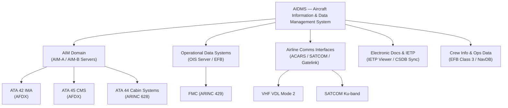
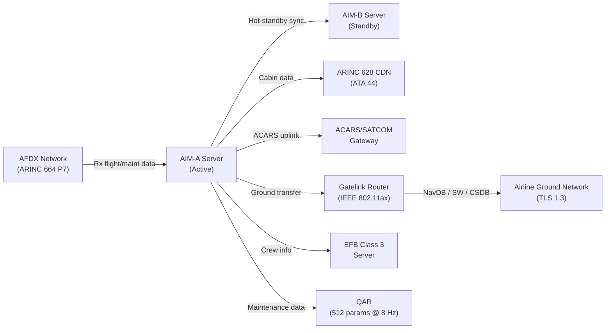
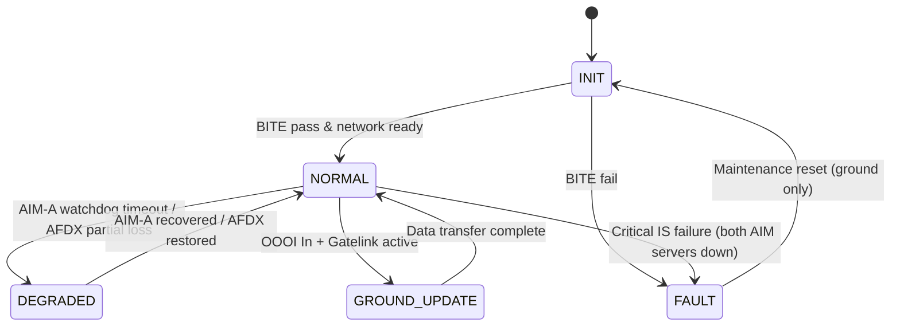

# ATLAS 040-049 · Section 04 · Subsection 046 · 000 — Information Systems General

## §0. Hyperlink Policy

All internal cross-references use relative Markdown links within the Q+ATLANTIDE CSDB repository. External regulatory citations in §19/§20 are marked  where hyperlinks are pending. Parent context: [ATLAS 046 README](./README.md). Sub-system documents are linked in §20.

---

## §1. Purpose

ATA 46 — Information Systems (IS) defines the architecture, functionality, and integration of all on-board information management and data services for the AMPEL360E eWTW all-electric wide-twin-wing aircraft. The AMPEL360E eWTW operates with no hydraulic system and no bleed-air architecture; all information systems interface directly with electric propulsion health monitoring, battery state management, and electric flight-control actuation diagnostics.

Key governance areas:
- Overall AIDMS (Aircraft Information and Data Management System) architecture and redundancy strategy.
- Five functional domains: Aircraft Information Management, Operational Data, Airline Communications, Electronic Documentation, and Crew Information.
- eWTW-specific data flows: battery State-of-Charge (SoC) and State-of-Health (SoH) reporting, electric motor bus (EMB) data, and EMA telemetry integrated into information data streams.
- Regulatory basis: CS-25 Amendment 28, DO-178C DAL D, DO-160G, ARINC 664 P7, ARINC 429, ARINC 628, ARINC 631.
- Primary Q-Division: Q-DATAGOV; Support: Q-AIR, Q-SPACE, Q-HPC.

---

## §2. Applicability

| Attribute | Value |
|-----------|-------|
| Aircraft Program | AMPEL360E eWTW |
| ATA Chapter | ATA 46 — Information Systems |
| Certification Basis | CS-25 Amendment 28; DO-178C DAL D |
| Applicable Standards | ARINC 664 P7; ARINC 429; ARINC 628; ARINC 631-4; DO-160G; S1000D Issue 5.0 |
| Network Architecture | AFDX (ARINC 664 P7) primary; ARINC 628 cabin; IEEE 802.11ax Gatelink |
| S1000D SNS | 046-000 |

---

## §3. Functional Description

The AMPEL360E eWTW Information Systems are centred on the Aircraft Information and Data Management System (AIDMS), implemented as dual redundant AIM servers (AIM-A and AIM-B) operating in hot-standby mode on the AFDX (ARINC 664 P7) network. The AIDMS provides five functional domains:

1. **Aircraft Information Management (AIM)** — Core data aggregation, storage, and distribution of flight operations and maintenance data.
2. **Operational Data Systems (ODS)** — Real-time flight performance computation, weather, NOTAM, and eWTW battery energy planning.
3. **Airline Information and Communication Interfaces (AICI)** — ACARS, VDL Mode 2, SATCOM, Gatelink ground connectivity, OOOI reporting.
4. **Electronic Documentation and IETP Interfaces (EDII)** — S1000D IETP viewer, AMM/IPC/FIM onboard access, CSDB synchronisation.
5. **Crew Information and Flight Operations Data (CIFOD)** — EFB Class 3, NavDB, aeronautical charts, OFP loading.

### Diagram 1: AIDMS Functional Hierarchy

---

## §4. System Architecture

The AIDMS is implemented on a dual-redundant server pair (AIM-A and AIM-B) hosted in the forward E/E bay. Both servers execute DO-178C DAL D software under an ARINC 653-partitioned RTOS. AIM-A is the active server; AIM-B is the hot standby, with a watchdog-driven failover time of < 5 seconds.

Network topology:
- **AFDX backbone** (ARINC 664 P7): primary data bus connecting AIM servers to IMA (ATA 42), CMS (ATA 45), FMC, and ADIRU.
- **ARINC 628 Cabin Data Network (CDN)**: dedicated IP-Ethernet bus for cabin systems (ATA 44).
- **Gatelink** (IEEE 802.11ax, ARINC 631-4): ground connectivity at gate for data upload/download.

### Diagram 2: AIDMS Data Flow

---

## §5. Components and Line-Replaceable Units

| LRU | Description | Qty | ATA Interface |
|-----|-------------|-----|---------------|
| AIM Server A | Aircraft Information Management Server (active) | 1 | ATA 46 |
| AIM Server B | Aircraft Information Management Server (hot standby) | 1 | ATA 46 |
| AFDX Switch-A | ARINC 664 P7 avionics network switch, primary | 1 | ATA 42/46 |
| AFDX Switch-B | ARINC 664 P7 avionics network switch, secondary | 1 | ATA 42/46 |
| QAR | Quick Access Recorder, 512 parameters at 8 Hz, 2 TB NVMe | 1 | ATA 46 |
| OIS Server | Operational Information System server (performance, W&B, NOTAMs) | 1 | ATA 46 |
| IETP Viewer | Interactive Electronic Technical Publication viewer module (on AIM) | 1 | ATA 46 |
| EFB-A | Electronic Flight Bag Class 3, pilot side, ruggedised tablet | 1 | ATA 46 |
| EFB-B | Electronic Flight Bag Class 3, co-pilot side, ruggedised tablet | 1 | ATA 46 |

---

## §6. Interfaces

| Interface | System | Protocol | Direction |
|-----------|--------|----------|-----------|
| IMA (ATA 42) | Integrated Modular Avionics | AFDX (ARINC 664 P7) | Bidirectional |
| CMS (ATA 45) | Central Maintenance System | AFDX (ARINC 664 P7) | Bidirectional |
| Cabin Systems (ATA 44) | Cabin Management and IFE | ARINC 628 (IP Ethernet) | Bidirectional |
| FMC | Flight Management Computer | ARINC 429 | Rx |
| ADIRU | Air Data/Inertial Reference Unit | ARINC 429 | Rx |
| Gatelink | Ground airline network | IEEE 802.11ax / TLS 1.3 | Bidirectional |
| ACARS/SATCOM | VHF VDL Mode 2 / Ku-band | ACARS protocol / IP | Bidirectional |
| EFB Displays | Pilot and Co-pilot EFBs | Ethernet 1000Base-T | Bidirectional |
| QAR download | Ground data offload service panel | USB-C (10 Gbit/s) | Tx |

---

## §7. Operations and Modes

| Mode | Trigger | Description |
|------|---------|-------------|
| INIT | Power-on | AIM-A/B boot sequence, BITE self-test, network discovery (< 120 s) |
| NORMAL | Post-INIT OK | Steady-state information management across all five functional domains |
| DEGRADED | AIM-A failure or partial AFDX loss | AIM-B takes over; reduced throughput; crew advisory |
| GROUND-UPDATE | OOOI "In" event + Gatelink connected | Automatic NavDB, CSDB, software, QAR download; inhibited in flight |
| FAULT | Critical IS failure | Fault report generated; crew advisory on ECAM/IS advisory panel |

### Diagram 3: AIDMS Lifecycle FSM

---

## §8. Performance and Budgets

| Parameter | Requirement | Status |
|-----------|-------------|--------|
| AIM server boot time | < 120 s |  |
| AFDX data throughput (AIM backbone) | ≥ 100 Mbit/s sustained |  |
| AIM-A to AIM-B failover time | < 5 s |  |
| QAR recording rate | 512 parameters at 8 Hz |  |
| Gatelink data transfer rate | ≥ 100 Mbit/s (802.11ax) |  |
| AIDMS system uptime | ≥ 99.9% dispatch availability |  |
| ACARS uplink latency | < 60 s after OOOI Out |  |

---

## §9. Safety, Redundancy and Fault Tolerance

- **Dual AIM server hot standby**: AIM-A active, AIM-B synchronised hot standby; watchdog failover < 5 s; no information loss on failover.
- **AFDX dual-star topology**: Dual AFDX switches with redundant end-system ports on all critical LRUs; single switch failure does not interrupt AIM operations.
- **QAR independence**: QAR is independently powered from a dedicated power bus; records continuously regardless of AIM server health.
- **Gatelink air-gap from AFDX**: Firewall enforces strict separation between Gatelink (ground network) and AFDX (avionics network); no direct routing path.
- **CDN air-gap from AFDX**: ARINC 628 Cabin Data Network segregated from AFDX by data diode/gateway; avionics data only flows one-way into CDN.
- **DO-178C DAL D**: AIM software qualified at Design Assurance Level D — information and advisory functions only, not safety-critical.
- **eWTW battery data integrity**: Battery SoC/SoH data relayed from ATA 24 battery management via AFDX is validated with CRC-32 on each message frame.

---

## §10. Maintenance and Diagnostics

| Task | Interval | Reference |
|------|----------|-----------|
| AIM-A/B BITE self-test (PBIT review) | Per flight / power-on | CMC auto-report via ATA 45 |
| QAR parameter download | Post-flight (automatic via Gatelink) or per 24 h ground | AMM ATA 46-00-11 |
| AIM server NVMe SMART health review | Monthly | AMM ATA 46-00-15 |
| AFDX virtual link utilisation audit | Every 500 FH | AMM ATA 46-00-20 |
| Gatelink antenna seal and connector inspection | Every 500 FH (A-check) | AMM ATA 46-00-30 |
| AIM software version currency check | At each major check (C-check) | AMM ATA 46-00-40 |
| Full AIDMS functional test (ground, all domains) | 12 months or 3000 FH | AMM ATA 46-00-50 |

---

## §11. Configuration and Software

- **RTOS**: ARINC 653-partitioned RTOS (LynxOS-178 or VxWorks 653 equivalent) running on AIM server hardware.
- **Software DAL**: DO-178C DAL D for all AIM application software (information management functions are advisory-only, non-safety-critical).
- **Partitioning**: Each functional domain (AIM, ODS, AICI, EDII, CIFOD) runs in a dedicated ARINC 653 software partition with time and space isolation.
- **Update mechanism**: Software loaded via Gatelink (IEEE 802.11ax, TLS 1.3 encrypted, PKI certificate-authenticated) at gate during GROUND-UPDATE mode; fallback USB-C service panel.
- **Data integrity**: All software loads verified with SHA-256 hash before installation; maintenance authorisation via airline LDAP.
- **Version management**: Software part numbers tracked in CMDB (ATA 45); configuration baseline per ARINC 849 Digital Dataloader specification.
- **eWTW-specific partitions**: Dedicated AIM partition for battery SoC/SoH data consolidation and eWTW energy planning data feeds.

---

## §12. Environmental and Physical Constraints

| Constraint | Requirement | Standard |
|------------|-------------|----------|
| Operating temperature (AIM servers) | −40 °C to +70 °C | DO-160G Category B2 |
| Vibration | DO-160G Category S (standard) | DO-160G Section 8 |
| Humidity | 95% RH non-condensing | DO-160G Section 6 |
| Altitude (E/E bay, pressurised) | 0–8,000 ft cabin altitude equivalent | DO-160G Section 4 |
| EMI/EMC | DO-160G Category M | DO-160G Section 21 |
| Shock (AIM server chassis) | 6 g operational, 20 g crash | DO-160G Section 7 |
| Flammability (AIM server enclosure) | Self-extinguishing per FAR 25.869 | FAR/CS-25.869 |

---

## §13. Human Factors and Crew Interface

- EFB Class 3 displays (pilot and co-pilot): 10.5-inch ruggedised tablets; AMC 25.1302 human factors guidelines applied.
- IS advisory messages displayed on ECAM advisory page (non-caution/warning level only for IS faults).
- Font minimum 12 pt on EFB and IETP viewer; contrast ratio > 4.5:1 per AMC 25.1302.
- Colour coding: Cyan = information/advisory; Amber = IS degraded (not safety-critical); Green = IS nominal; White = ground-only status.
- Ground access (IETP, AMM, FIM) via MAT (Maintenance Access Terminal, ATA 45) or EFB — no dual-duty with flight-deck functions during flight.
- eWTW battery SoC pre-flight display integrated into EFB energy planning page; crew awareness training required per EASA OEB.

---

## §14. Test and Validation

| Test | Method | Pass Criteria |
|------|--------|---------------|
| AIM server PBIT | Automated on power-on | All self-test segments pass; boot < 120 s |
| AFDX virtual link throughput | AFDX analyser injection (ground) | ≥ 100 Mbit/s sustained on primary VLs |
| AIM-A to AIM-B failover | Simulate AIM-A watchdog timeout (IBIT) | AIM-B active in < 5 s; no data loss |
| QAR recording verification | Inject known parameter values; verify recording | All 512 parameters recorded at correct rate |
| Gatelink connectivity | Bench-level 802.11ax AP injection | ≥ 100 Mbit/s Tx rate; TLS 1.3 handshake OK |
| Cabin data isolation (air-gap) | Attempt cross-network routing (pen test) | Zero packets cross AFDX ↔ CDN boundary |
| Battery SoC data integrity | Inject corrupted AFDX frame; verify CRC rejection | Frame rejected; no corruption displayed on EFB |

---

## §15. Regulatory Compliance

| Requirement | Regulation | Status |
|-------------|------------|--------|
| Airworthiness — information systems | CS-25 Amendment 28 |  |
| Software assurance | DO-178C DAL D |  |
| Environmental qualification | DO-160G |  |
| Technical publication format | S1000D Issue 5.0 |  |
| Network qualification (AFDX) | ARINC 664 Part 7 |  |
| EFB qualification | EASA AMC 20-25 |  |
| Cabin network design | ARINC 628 |  |
| Ground connectivity | ARINC 631-4 |  |

---

## §16. Glossary

| Term | Acronym | Definition |
|------|---------|------------|
| Aircraft Information Management | AIM | The centralised on-board system that aggregates, stores, and distributes operational, maintenance, and cabin data across the AFDX network |
| Aircraft Information and Data Management System | AIDMS | The top-level integrated information system for the AMPEL360E eWTW, encompassing AIM servers, OIS, EFB, IETP, ACARS, and Gatelink subsystems |
| Electronic Flight Bag | EFB | A Class 3 ruggedised computing device installed in the cockpit providing crew access to NavDB, charts, OFP, NOTAMs, and eWTW energy planning |
| Interactive Electronic Technical Publication | IETP | A structured, hyperlinked digital maintenance and operations manual rendered per S1000D Issue 5.0 and accessible on the MAT or EFB |
| Operational Information System | OIS | The on-board server providing real-time performance computation, weight and balance, NOTAM integration, and weather data for the AMPEL360E eWTW |
| Electronic Flight Publication | EFP | Any digital publication (chart, regulation, manual) made available to the crew or maintenance personnel via the onboard information system |
| Aircraft Communications Addressing and Reporting System | ACARS | A digital datalink protocol operating over VHF (VDL Mode 2) or SATCOM for airline operational communications, position reporting, and data exchange |
| Quick Access Recorder | QAR | An onboard flight data recorder variant storing 512 parameters at up to 8 Hz on a removable NVMe medium for post-flight analysis by the airline |
| Satellite Communications | SATCOM | Ku-band satellite link providing backup datalink for ACARS and real-time streaming of aircraft health data on oceanic and polar routes |
| Standard Numbering System | SNS | The ATA-derived hierarchical numbering scheme used by S1000D to organise data modules by chapter, section, and subject (e.g., 046-000) |

---

## §17. Footprint

### Physical Footprint

| LRU | Location | Bay | Rack Position |
|-----|----------|-----|---------------|
| AIM Server A | Forward avionics bay | E/E Bay | Rack A, Slot 5 |
| AIM Server B | Forward avionics bay | E/E Bay | Rack A, Slot 6 |
| AFDX Switch-A | Forward avionics bay | E/E Bay | Rack A, Slot 1 |
| AFDX Switch-B | Forward avionics bay | E/E Bay | Rack A, Slot 2 |
| QAR | Tail section | Aft avionics bay | Rack C, Slot 1 |
| OIS Server | Forward avionics bay | E/E Bay | Rack B, Slot 2 |
| IETP Viewer | Software module on AIM server | E/E Bay | N/A (software) |
| EFB-A | Cockpit, pilot side | Flight deck | Docking station P1 |
| EFB-B | Cockpit, co-pilot side | Flight deck | Docking station P2 |

### Electrical/Data Footprint

| LRU | Power Bus | Power (W) | Data Interface |
|-----|-----------|-----------|----------------|
| AIM Server A | 28 V DC Bus 1 | < 150 | AFDX + Ethernet |
| AIM Server B | 28 V DC Bus 2 | < 150 | AFDX + Ethernet |
| AFDX Switch-A | 28 V DC Bus 1 | < 40 | ARINC 664 P7 |
| AFDX Switch-B | 28 V DC Bus 2 | < 40 | ARINC 664 P7 |
| QAR | 28 V DC Maint Bus | < 20 | USB-C + AFDX |
| OIS Server | 28 V DC Bus 1 | < 80 | Ethernet 1GbE |
| EFB-A | 28 V DC Cockpit Bus | < 25 | Ethernet 1GbE |
| EFB-B | 28 V DC Cockpit Bus | < 25 | Ethernet 1GbE |

### Maintenance Footprint

| Activity | Access Required | Duration |
|----------|----------------|----------|
| AIM Server A/B replacement | E/E bay door (forward) | 30 min |
| QAR removal for data download | Aft avionics bay access panel | 15 min |
| AFDX Switch replacement | E/E bay door (forward) | 25 min |
| EFB-A/B replacement | Cockpit access (no tools) | 5 min |
| Full AIDMS IBIT functional test | MAT or EFB (ground only) | 45 min |

---

## §18. Open Issues

| Issue ID | Description | Owner | Status |
|----------|-------------|-------|--------|
| IS-046-000-001 | AIM failover time (< 5 s) not yet validated on qualification hardware | Q-DATAGOV |  |
| IS-046-000-002 | Gatelink throughput budget vs. simultaneous QAR + NavDB + CSDB download not verified | Q-AIR |  |
| IS-046-000-003 | Battery SoC/SoH data CRC validation implementation pending software build 2.1 | Q-HPC |  |
| IS-046-000-004 | EFB EASA AMC 20-25 qualification plan not yet submitted | Q-DATAGOV |  |

---

## §19. Citations

| Ref ID | Standard | Applicability | Status |
|--------|----------|---------------|--------|
| [S1] | ATA 46 — Information Systems | System chapter baseline |  |
| [S2] | CS-25 Amendment 28 | Airworthiness basis |  |
| [S3] | DO-178C — Software Considerations in Airborne Systems | AIM software DAL D |  |
| [S4] | DO-160G — Environmental Conditions and Test Procedures | LRU environmental qualification |  |
| [S5] | ARINC 429 — Digital Information Transfer System | Legacy bus interfaces |  |
| [S6] | ARINC 664 Part 7 — AFDX | AIM backbone network |  |
| [S7] | ARINC 628 — Design Guidance for Cabin Systems | Cabin Data Network |  |
| [S8] | ARINC 631-4 — Gatelink | Ground wireless connectivity |  |
| [S9] | S1000D Issue 5.0 — Technical Publications | IETP and CSDB |  |
| [S10] | EASA AMC 20-25 — EFB | EFB Class 3 qualification |  |

---

## §20. References

| Ref ID | Document | Version | Status |
|--------|----------|---------|--------|
| [R1] | ATLAS 042 — Integrated Modular Avionics | 1.0.0 |  |
| [R2] | ATLAS 044 — Cabin Systems | 1.0.0 |  |
| [R3] | ATLAS 045 — Central Maintenance System | 1.0.0 |  |
| [R4] | ATLAS 046-010 — Aircraft Information Management | 1.0.0 |  |
| [R5] | ATLAS 046-020 — Operational Data Systems | 1.0.0 |  |
| [R6] | ATLAS 046-030 — Airline Information and Communication Interfaces | 1.0.0 |  |
| [R7] | ATLAS 046-090 — S1000D CSDB Mapping and Traceability | 1.0.0 |  |
| [R8] | AMPEL360E eWTW System Architecture Document | TBD |  |

---

## §21. Feedback and Review

This document is classified `to-be-reviewed-by-system-expert`. The review process requires:

1. **System Expert Review**: An ATA 46 Information Systems specialist must validate all functional descriptions, interface parameters, and performance budgets in §3–§8.
2. **Q-DATAGOV Review**: The primary Q-Division (Q-DATAGOV) validates governance, data sovereignty, and software DAL assignments.
3. **Regulatory Authority Review**: EASA/FAA review required before any content in §15 is marked DONE. Open items in §18 must be resolved prior to certification milestone gate.

The `review_status: to-be-reviewed-by-system-expert` field in the YAML frontmatter must be updated to `reviewed` upon completion of the review cycle.

---

## §22. Change Log

| Version | Date | Author | Description |
|---------|------|--------|-------------|
| 1.0.0 | 2026-05-10 | Q-DATAGOV / Copilot | Initial baseline document creation — all 22 sections populated |
