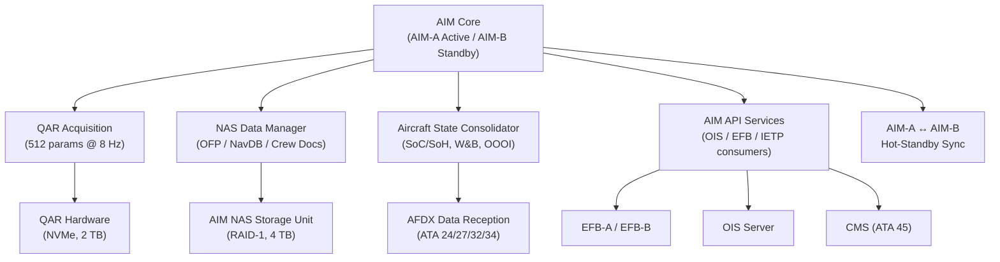
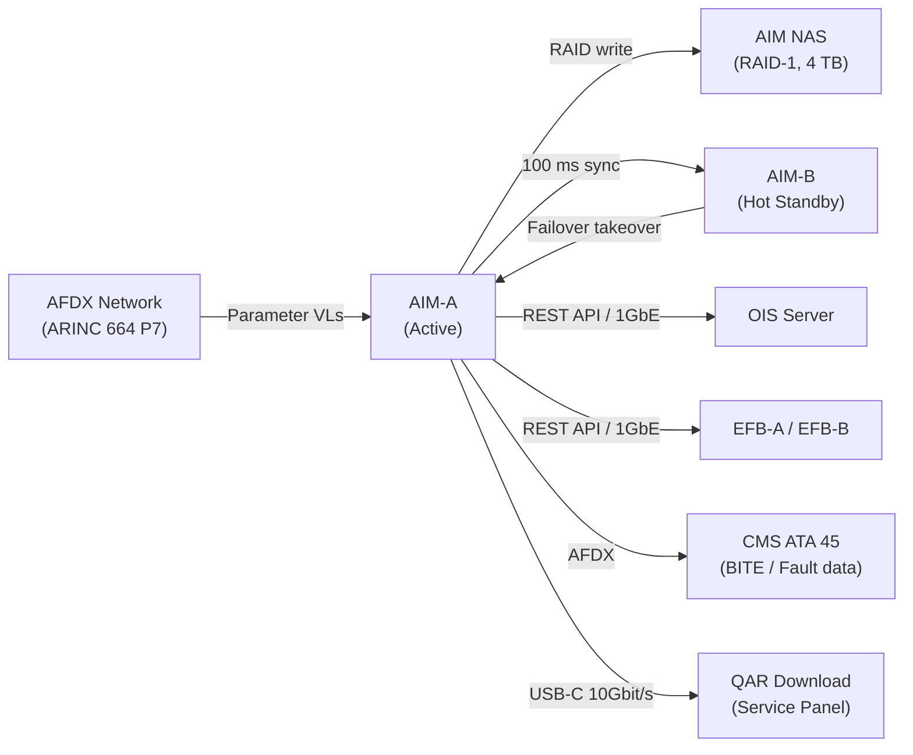
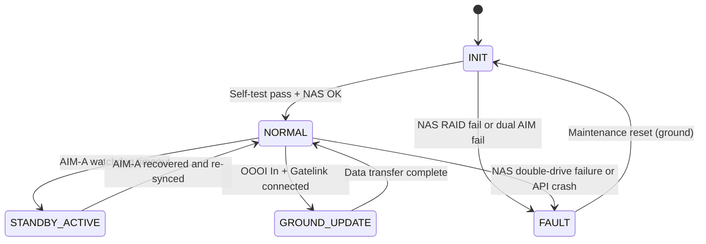

# ATLAS 040-049 · Section 04 · Subsection 046 · 010 — Aircraft Information Management

## §0. Hyperlink Policy

All internal cross-references use relative Markdown links within the Q+ATLANTIDE CSDB repository. External regulatory citations in §19/§20 are marked  where hyperlinks are pending. Parent context: [ATLAS 046 README](./README.md). General overview: [046-000 Information Systems General](./046-000-Information-Systems-General.md).

---

## §1. Purpose

ATA 46.010 — Aircraft Information Management (AIM) defines the core data aggregation, storage, and distribution architecture for the programme-defined aircraft type all-electric aircraft. The AIM function is implemented on dual redundant AIM-A and AIM-B servers operating in active/hot-standby configuration on the AFDX (ARINC 664 P7) backbone.

Key governance areas:
- Dual AIM server architecture (AIM-A/B): hardware specification, software DAL, redundancy strategy.
- QAR data collection: 512 parameters at 8 Hz, NVMe storage, post-flight download protocol.
- NAS (Network Attached Storage) for flight operations data: OFP history, NavDB versions, crew documents.
- Aircraft state data consolidation: battery SoC/SoH ([PROGRAMME-VARIANT]), fuel equivalent energy, weight, CG, OOOI timestamps.
- Interface to IMA (ATA 42), FMC, ADIRU, CMS (ATA 45), and EFB.
- Primary Q-Division: Q-DATAGOV; Support: Q-AIR, Q-SPACE, Q-HPC.

---

## §2. Applicability

| Attribute | Value |
|-----------|-------|
| Aircraft Program | programme-defined aircraft type |
| ATA Chapter | ATA 46.010 — Aircraft Information Management |
| Certification Basis | CS-25 Amendment 28; DO-178C DAL D |
| Applicable Standards | ARINC 664 P7; ARINC 429; ARINC 849; DO-160G; S1000D Issue 5.0 |
| Network Architecture | AFDX (ARINC 664 P7) primary; Ethernet 1GbE for NAS; USB-C 10 Gbit/s service panel |
| S1000D SNS | 046-010 |

---

## §3. Functional Description

The AIM function is the core data hub of the AIDMS. Dual AIM servers (AIM-A active, AIM-B hot standby) run DO-178C DAL D software in ARINC 653 partitions. Each partition handles a dedicated data function: QAR acquisition, NAS management, state data consolidation, and API services for downstream consumers (OIS, EFB, IETP).

[PROGRAMME-VARIANT]-specific data managed by AIM:
- **Battery state data**: SoC (0–100%) and SoH (0–100%) consolidated from ATA 24 Battery Management System via AFDX at 1 Hz, stored in NAS for trend analysis.
- **Energy equivalent records**: Since there is no fuel flow (no combustion engine), AIM records energy consumption in kWh/km as the primary efficiency metric, replacing traditional fuel flow (kg/h) fields in QAR parameter set.
- **OOOI timestamps**: Automatically generated from LGCIU (gear up/down) and parking brake discrete; stored in NAS and uplinked via ACARS.

### Diagram 1: AIM Functional Hierarchy

---

## §4. System Architecture

The AIM architecture operates as follows:

1. **Data acquisition**: AFDX BITE and parameter VLs deliver raw data from all LRU subscribers to AIM-A at up to 100 Mbit/s aggregate. AIM-A filters, timestamps, and stores data to NAS in CSDB-compatible format.
2. **Hot-standby sync**: AIM-A replicates state to AIM-B via a dedicated AFDX synchronisation Virtual Link (VL) every 100 ms. Synchronised data includes QAR buffer, NAS write cache, and aircraft state vector.
3. **API services**: AIM exposes a RESTful API over Ethernet 1GbE to downstream consumers (OIS, EFB, IETP viewer). API requests are authenticated via aircraft-local PKI certificate.
4. **NAS management**: RAID-1 NAS stores 5 years of QAR data, 28 AIRAC cycles of NavDB history, all OFP files since last maintenance cycle, and crew document library.

### Diagram 2: AIM Data Flow

---

## §5. Components and Line-Replaceable Units

| LRU | Description | Qty | ATA Interface |
|-----|-------------|-----|---------------|
| AIM Server A | Active AIM server; dual-core processor, 32 GB ECC RAM, 1 TB NVMe boot | 1 | ATA 46 |
| AIM Server B | Hot-standby AIM server; identical spec to AIM-A | 1 | ATA 46 |
| AIM NAS Storage Unit | RAID-1 NAS, 4 TB NVMe, dual-ported; stores QAR data, OFP history, NavDB | 1 | ATA 46 |
| AFDX End System Module | ARINC 664 P7 end-system network interface card for each AIM server | 2 | ATA 42/46 |

---

## §6. Interfaces

| Interface | System | Protocol | Direction |
|-----------|--------|----------|-----------|
| IMA (ATA 42) | Integrated Modular Avionics | AFDX (ARINC 664 P7) DAL C | Bidirectional |
| FMC | Flight Management Computer | ARINC 429 (100 kbit/s) | Rx |
| ADIRU | Air Data / Inertial Reference Unit | ARINC 429 | Rx |
| CMS (ATA 45) | Central Maintenance System (BITE/fault) | AFDX BITE VLAN | Bidirectional |
| EFB-A / EFB-B | Electronic Flight Bag Class 3 | Ethernet 1GbE / REST API | Tx |
| OIS Server | Operational Information System | Ethernet 1GbE / REST API | Tx |
| QAR Download | Ground service panel (USB-C) | USB-C 3.2 Gen 2×2 (10 Gbit/s) | Tx |
| Gatelink Router | Ground connectivity (ARINC 631) | IEEE 802.11ax / TLS 1.3 | Bidirectional |
| ATA 24 BMS | Battery Management System ([PROGRAMME-VARIANT] SoC/SoH) | AFDX parameter VL | Rx |

---

## §7. Operations and Modes

| Mode | Trigger | Description |
|------|---------|-------------|
| INIT | Power-on | AIM-A/B hardware self-test; NAS mount and RAID verify; AFDX VL discovery |
| NORMAL | Post-INIT OK | Continuous data acquisition, NAS write, hot-standby sync, API services available |
| STANDBY-ACTIVE | AIM-A watchdog timeout | AIM-B promotes to active; maintains all AIM functions; crew advisory |
| GROUND-UPDATE | OOOI "In" + Gatelink active | NavDB, OFP, CSDB, software load; QAR download to airline; inhibited in flight |
| FAULT | NAS RAID degraded or both AIM down | Fault to CMS; crew advisory; QAR continues independently |

### Diagram 3: AIM Lifecycle FSM

---

## §8. Performance and Budgets

| Parameter | Requirement | Status |
|-----------|-------------|--------|
| AIM server boot time | < 120 s |  |
| Hot-standby sync latency | ≤ 100 ms |  |
| NAS write throughput | ≥ 200 MB/s (RAID-1 write) |  |
| QAR acquisition rate | 512 parameters at 8 Hz |  |
| AIM-A to AIM-B failover | < 5 s (no data loss) |  |
| API response latency (EFB/OIS) | < 200 ms per request |  |
| NAS storage capacity | 5-year QAR history + 28 NavDB cycles |  |

---

## §9. Safety, Redundancy and Fault Tolerance

- **Dual AIM-A/B active/standby**: 100 ms watchdog; failover < 5 s; NAS data is shared (dual-ported), so no data loss on failover.
- **RAID-1 NAS**: Dual NVMe mirror; single drive failure does not interrupt operations; degraded mode alert to CMS.
- **AFDX end-system redundancy**: Each AIM server has two AFDX ports (primary and secondary NIC); single port failure transparent to AIM function.
- **QAR independence**: QAR hardware operates independently of AIM server health; continues recording on its own power rail.
- **NAS data integrity**: All NAS writes checksummed with SHA-256; silent data corruption detected and reported to CMS.
- **DO-178C DAL D**: AIM software is advisory-only; not credited for safety-critical flight functions.

---

## §10. Maintenance and Diagnostics

| Task | Interval | Reference |
|------|----------|-----------|
| AIM PBIT (power-on self-test) | Per flight / power-on | CMC auto-report ATA 45 |
| NAS SMART health report review | Monthly | AMM ATA 46-10-15 |
| AIM-A/B sync latency check (IBIT) | Every 500 FH | AMM ATA 46-10-20 |
| NAS capacity utilisation audit | Every 1000 FH | AMM ATA 46-10-25 |
| AIM software version audit | At C-check | AMM ATA 46-10-40 |
| AIM NAS full data export and archive | Annually | AMM ATA 46-10-50 |

---

## §11. Configuration and Software

- **RTOS**: ARINC 653-partitioned RTOS (LynxOS-178 or equivalent); time and space isolation between AIM partitions.
- **Software DAL**: DO-178C DAL D for all AIM application software (data management, API services, NAS manager).
- **AIM-A/B active/standby**: Implemented via ARINC 653 health monitor and AFDX watchdog heartbeat; automatic switchover without maintenance action.
- **NAS RAID-1**: Dual NVMe mirroring at block level; transparent to AIM application layer.
- **Software update mechanism**: Via Gatelink (TLS 1.3, PKI) or USB-C service panel; ARINC 849 Digital Dataloader protocol; integrity SHA-256 verified.
- **API versioning**: AIM REST API versioned (v1, v2); backward compatibility maintained for EFB and OIS client software.
- **Configuration baseline**: Software part numbers tracked in CMDB (ATA 45); NAS content manifest stored as signed XML in CSDB.

---

## §12. Environmental and Physical Constraints

| Constraint | Requirement | Standard |
|------------|-------------|----------|
| Operating temperature | −40 °C to +70 °C | DO-160G Category B2 |
| Vibration | Category S | DO-160G Section 8 |
| Humidity | 95% RH non-condensing | DO-160G Section 6 |
| Altitude (E/E bay, pressurised) | 0–8,000 ft cabin equiv. | DO-160G Section 4 |
| EMI/EMC | Category M | DO-160G Section 21 |
| NAS shock resistance | 20 g crash survivability | DO-160G Section 7 |

---

## §13. Human Factors and Crew Interface

- AIM health status displayed on ECAM IS advisory page (cyan advisory — non-caution level).
- AIM-B active (failover) state annunciated to crew on IS advisory page; no pilot action required.
- NAS capacity warning displayed on MAT (Maintenance Access Terminal, ATA 45) when > 90% full.
- API-based EFB access: crew interact with AIM data only through EFB application layer; no direct server access.
- Ground maintenance operators access AIM via MAT over Ethernet; authenticated via airline LDAP credentials.

---

## §14. Test and Validation

| Test | Method | Pass Criteria |
|------|--------|---------------|
| AIM-A/B PBIT | Automated on power-on | All partitions pass; NAS RAID verified; boot < 120 s |
| Hot-standby sync | Inject AIM-A watchdog fault; verify AIM-B takeover | Failover < 5 s; no NAS write gap > 1 data frame |
| NAS RAID-1 resilience | Remove one NVMe (IBIT ground only) | AIM continues; degraded alert to CMS; no data loss |
| API latency | Inject 100 concurrent EFB/OIS API requests | 95th-percentile response < 200 ms |
| QAR 512-parameter integrity | Ground injection; verify all 512 params recorded | 100% parameter capture at correct timestamps |
| Battery SoC/SoH data path | ATA 24 BMS simulator; verify AFDX → NAS storage | SoC and SoH stored at 1 Hz; no missed samples |

---

## §15. Regulatory Compliance

| Requirement | Regulation | Status |
|-------------|------------|--------|
| Airworthiness — data management | CS-25 Amendment 28 |  |
| Software assurance | DO-178C DAL D |  |
| Environmental qualification | DO-160G |  |
| Network qualification | ARINC 664 Part 7 |  |
| Digital dataloader | ARINC 849 |  |
| Technical publications | S1000D Issue 5.0 |  |

---

## §16. Glossary

| Term | Acronym | Definition |
|------|---------|------------|
| Aircraft Information Management | AIM | The centralised on-board data aggregation, storage, and API service function running on dual AIM-A/B servers in the programme-defined aircraft type |
| Aircraft Information and Data Management System | AIDMS | The top-level integrated information system encompassing all five ATA 46 functional domains for the programme-defined aircraft type |
| Avionics Full-Duplex Switched Ethernet | AFDX | ARINC 664 Part 7 deterministic network providing virtual-link-based data distribution between avionics LRUs |
| Quick Access Recorder | QAR | An on-board flight data recorder variant storing 512 parameters at up to 8 Hz on removable NVMe medium for post-flight airline analysis |
| Operational Information System | OIS | The on-board server providing real-time performance computation, weight and balance, NOTAM integration, and weather data |
| Flight Operations Manual | FOM | The airline-specific manual governing flight operations procedures, stored in NAS and accessible via EFB on the AIDMS |
| Electronic Flight Bag | EFB | A Class 3 ruggedised computing device providing crew access to AIM-served data including NavDB, OFP, and energy planning |
| Aircraft Communications Addressing and Reporting System | ACARS | Digital datalink protocol over VHF or SATCOM for airline operational communications and OOOI event reporting |
| Network Attached Storage | NAS | The RAID-1 NVMe storage unit (4 TB) attached to the AIM server pair for long-term data retention of QAR, NavDB, and OFP records |
| Application Programming Interface | API | The RESTful interface exposed by AIM servers over Ethernet 1GbE enabling OIS, EFB, and IETP clients to query and retrieve managed data |

---

## §17. Footprint

### Physical Footprint

| LRU | Location | Bay | Rack Position |
|-----|----------|-----|---------------|
| AIM Server A | Forward avionics bay | E/E Bay | Rack A, Slot 5 |
| AIM Server B | Forward avionics bay | E/E Bay | Rack A, Slot 6 |
| AIM NAS Storage Unit | Forward avionics bay | E/E Bay | Rack B, Slot 1 |
| AFDX End System Module (×2) | Integrated in AIM server chassis | E/E Bay | N/A (internal) |

### Electrical/Data Footprint

| LRU | Power Bus | Power (W) | Data Interface |
|-----|-----------|-----------|----------------|
| AIM Server A | 28 V DC Bus 1 | < 150 | AFDX + Ethernet 1GbE |
| AIM Server B | 28 V DC Bus 2 | < 150 | AFDX + Ethernet 1GbE |
| AIM NAS Storage Unit | 28 V DC Bus 1 (primary) + Bus 2 (secondary) | < 30 | NVMe dual-port (internal) |

### Maintenance Footprint

| Activity | Access Required | Duration |
|----------|----------------|----------|
| AIM Server A or B LRU replacement | E/E bay forward door | 30 min |
| NAS unit replacement (NVMe hot-swap) | E/E bay forward door | 15 min |
| QAR data manual download (USB-C panel) | Forward service panel access | 10 min |
| AIM software load via Gatelink | Aircraft on ground, Gatelink active | 20 min (automated) |

---

## §18. Open Issues

| Issue ID | Description | Owner | Status |
|----------|-------------|-------|--------|
| IS-046-010-001 | Hot-standby failover time (< 5 s) pending qualification hardware test | Q-DATAGOV |  |
| IS-046-010-002 | NAS RAID-1 write throughput (≥ 200 MB/s) not yet confirmed on selected NVMe hardware | Q-HPC |  |
| IS-046-010-003 | Battery SoC/SoH 1 Hz AFDX VL allocation pending IMA (ATA 42) VL budget approval | Q-AIR |  |
| IS-046-010-004 | ARINC 849 dataloader compliance test plan not yet created | Q-DATAGOV |  |

---

## §19. Citations

| Ref ID | Standard | Applicability | Status |
|--------|----------|---------------|--------|
| [S1] | ATA 46 — Information Systems | System chapter baseline |  |
| [S2] | CS-25 Amendment 28 | Airworthiness basis |  |
| [S3] | DO-178C — Software Considerations in Airborne Systems | AIM software DAL D |  |
| [S4] | DO-160G — Environmental Conditions and Test Procedures | AIM server/NAS qualification |  |
| [S5] | ARINC 429 — Digital Information Transfer System | FMC/ADIRU legacy bus |  |
| [S6] | ARINC 664 Part 7 — AFDX | AIM backbone |  |
| [S7] | ARINC 849 — Digital Dataloader | Software load protocol |  |
| [S8] | S1000D Issue 5.0 | CSDB / NAS content standard |  |

---

## §20. References

| Ref ID | Document | Version | Status |
|--------|----------|---------|--------|
| [R1] | ATLAS 046-000 — Information Systems General | 1.0.0 |  |
| [R2] | ATLAS 042 — Integrated Modular Avionics | 1.0.0 |  |
| [R3] | ATLAS 045 — Central Maintenance System | 1.0.0 |  |
| [R4] | ATLAS 046-020 — Operational Data Systems | 1.0.0 |  |
| [R5] | ATLAS 046-090 — S1000D CSDB Mapping and Traceability | 1.0.0 |  |
| [R6] | programme-defined aircraft type ATA 24 Battery Management System Architecture | TBD |  |

---

## §21. Feedback and Review

This document is classified `to-be-reviewed-by-system-expert`. The review process requires:

1. **AIM System Expert**: Validates dual-server architecture, AFDX VL budget, NAS RAID-1 sizing, and QAR parameter list completeness.
2. **Q-DATAGOV Review**: Confirms data governance, API versioning policy, and software DAL assignment consistency with DO-178C Plan for Software Aspects of Certification (PSAC).
3. **EASA/FAA Regulatory Review**: Required before §15 items can be promoted from DRAFT to DONE. All open issues in §18 must be resolved and evidenced prior to CS-25 compliance milestone.

`review_status` must be updated to `reviewed` by the designated AIM system expert upon completion of the review cycle.

---

## §22. Change Log

| Version | Date | Author | Description |
|---------|------|--------|-------------|
| 1.0.0 | 2026-05-10 | Q-DATAGOV / Copilot | Initial baseline — all 22 sections populated with AIM-specific content for programme-defined aircraft type |
