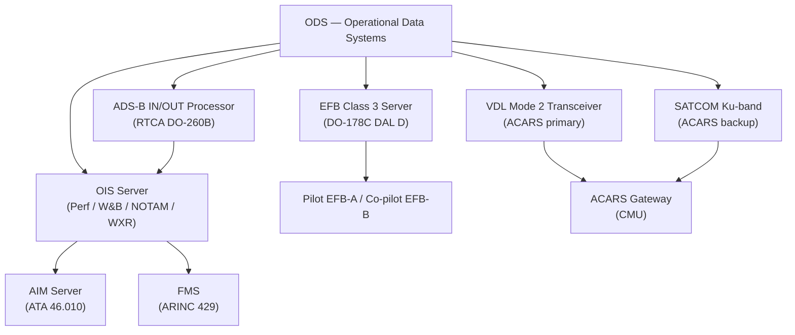
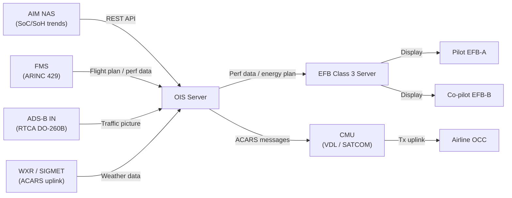
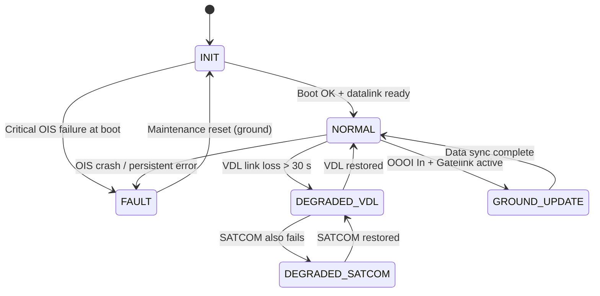

# ATLAS 040-049 · Section 04 · Subsection 046 · 020 — Operational Data Systems

## §0. Hyperlink Policy

All internal cross-references use relative Markdown links within the Q+ATLANTIDE CSDB repository. External regulatory citations in §19/§20 are marked  where hyperlinks are pending. Parent context: [ATLAS 046 README](./README.md). General overview: [046-000 Information Systems General](./046-000-Information-Systems-General.md).

---

## §1. Purpose

ATA 46.020 — Operational Data Systems (ODS) defines the real-time operational data services for the programme-defined aircraft type all-electric aircraft. The ODS encompasses the Operational Information System (OIS) server, the EFB Class 3 server and crew applications, real-time datalink interfaces (ACARS VHF VDL Mode 2 and SATCOM Ku-band), and ADS-B IN/OUT integration for situational awareness.

Key governance areas:
- OIS server: performance computation, weight & balance, NOTAM integration, real-time weather overlays.
- [PROGRAMME-VARIANT]-specific energy planning: battery SoC/SoH-based range and energy planning replaces conventional fuel planning tools.
- Real-time datalink: ACARS over VHF VDL Mode 2 (primary), SATCOM Ku-band (backup for oceanic/polar routes).
- ADS-B IN/OUT integration for traffic picture and oceanic surveillance.
- EFB Class 3 server (DO-178C DAL D) as the crew-facing interface for all ODS functions.
- Primary Q-Division: Q-DATAGOV; Support: Q-AIR, Q-SPACE, Q-HPC.

---

## §2. Applicability

| Attribute | Value |
|-----------|-------|
| Aircraft Program | programme-defined aircraft type |
| ATA Chapter | ATA 46.020 — Operational Data Systems |
| Certification Basis | CS-25 Amendment 28; DO-178C DAL D |
| Applicable Standards | ARINC 664 P7; ARINC 429; DO-160G; S1000D Issue 5.0; RTCA DO-260B (ADS-B) |
| Network Architecture | AFDX (ARINC 664 P7) internal; VHF VDL Mode 2 and SATCOM external; Ethernet EFB |
| S1000D SNS | 046-020 |

---

## §3. Functional Description

The ODS provides crew and airline operations centre (OCC) with real-time operational data during all phases of flight. The OIS server is the computational core, running performance algorithms, W&B computation, NOTAM filtering, and real-time weather data parsing.

[PROGRAMME-VARIANT]-specific ODS features:
- **Battery energy planning**: OIS computes available range as a function of battery SoC, ambient temperature, altitude, wind profile, and expected electric motor bus (EMB) load. Replaces conventional fuel quantity/fuel flow/range computation.
- **SoH degradation modelling**: OIS ingests long-term SoH trend data from AIM NAS to predict battery range reduction as cells age; displayed on EFB energy planning page.
- **Regenerative energy accounting**: OIS accounts for kinetic energy recovery during descent (regenerative braking via EPU) in range calculations.

### Diagram 1: ODS Functional Hierarchy

---

## §4. System Architecture

The OIS server receives real-time data from AIM (AFDX REST API), FMS (ARINC 429), ADS-B processor, and SATCOM/VDL datalink. Performance computations run as dedicated software applications within ARINC 653 partitions on the OIS server.

The EFB Class 3 server hosts the crew application suite and presents ODS data to pilot and co-pilot EFBs via a secure Ethernet 1GbE connection. The EFB server is separate from the OIS server to ensure software partitioning between computation (OIS) and presentation (EFB).

Datalink architecture:
- **Primary (VHF VDL Mode 2)**: ACARS messaging below FL350 and within VHF ground-station coverage; data rate 31.5 kbit/s.
- **Backup (SATCOM Ku-band)**: Oceanic, polar, and remote coverage; also provides higher-bandwidth weather radar data uplink.

### Diagram 2: ODS Data Flow

---

## §5. Components and Line-Replaceable Units

| LRU | Description | Qty | ATA Interface |
|-----|-------------|-----|---------------|
| OIS Server | Operational Information System compute server; ARINC 653 partitioned; DO-178C DAL D | 1 | ATA 46 |
| EFB Class 3 Server | EFB hosting server; crew application suite; DO-178C DAL D | 1 | ATA 46 |
| VDL Mode 2 Transceiver | VHF VDL Mode 2 ACARS primary datalink transceiver | 1 | ATA 46/23 |
| SATCOM Transceiver | Ku-band SATCOM for ACARS backup and weather uplink | 1 | ATA 46/23 |
| ADS-B Processor | ADS-B IN/OUT 1090ES processor (RTCA DO-260B) | 1 | ATA 34 interface |

---

## §6. Interfaces

| Interface | System | Protocol | Direction |
|-----------|--------|----------|-----------|
| AIM Server | Aircraft Information Management | Ethernet 1GbE / REST API | Rx |
| FMS | Flight Management System | ARINC 429 (100 kbit/s) | Rx |
| SATCOM Transceiver | Ku-band satellite link | IP over satellite / TLS 1.3 | Bidirectional |
| VDL Mode 2 Transceiver | VHF ACARS primary link | ACARS ARINC 618 | Bidirectional |
| ADS-B Processor | 1090ES ADS-B traffic | ARINC 429 / Ethernet | Rx |
| EFB Displays | Pilot/Co-pilot EFBs | Ethernet 1GbE | Tx |
| ACARS Gateway / CMU | Communications Management Unit | ARINC 429 + Ethernet | Bidirectional |
| Airline OCC | Ground operations centre | ACARS / SATCOM | Bidirectional |

---

## §7. Operations and Modes

| Mode | Trigger | Description |
|------|---------|-------------|
| INIT | Power-on | OIS server boot; database load (NOTAM cache, NavDB, weather); BITE |
| NORMAL | Post-INIT OK | Continuous perf computation, W&B, NOTAM display, ADS-B traffic; EFB serving crew |
| DEGRADED-VDL | VDL link loss | Automatic SATCOM takeover for ACARS; crew advisory |
| DEGRADED-SATCOM | Both VDL and SATCOM unavailable | ACARS offline; OIS continues with last-known data; crew advisory |
| GROUND-UPDATE | OOOI In + Gatelink active | NOTAM refresh, WXR data update, OFP upload, software load; EFB sync |
| FAULT | OIS server crash or critical data loss | Fault to CMS; EFB crew advisory; FMS continues independently |

### Diagram 3: ODS Lifecycle FSM

---

## §8. Performance and Budgets

| Parameter | Requirement | Status |
|-----------|-------------|--------|
| OIS performance computation latency | < 2 s for standard perf calculation |  |
| W&B computation update rate | 1 Hz continuous |  |
| ACARS uplink (VDL Mode 2) | 31.5 kbit/s sustained |  |
| SATCOM backup uplink | ≥ 128 kbit/s Ku-band |  |
| ADS-B IN traffic update rate | 1 Hz |  |
| EFB page load time | < 3 s for NOTAM / chart page |  |
| Battery energy range accuracy | ± 5% of actual range |  |

---

## §9. Safety, Redundancy and Fault Tolerance

- **OIS/EFB partitioning**: OIS server and EFB server are separate LRUs; OIS failure does not affect EFB server; crew retain last-known data display.
- **VDL/SATCOM dual datalink**: Automatic switchover from VDL Mode 2 to SATCOM for ACARS continuity on oceanic routes.
- **FMS independence**: OIS is advisory-only; FMS operates independently of OIS health for flight-critical navigation and performance functions.
- **ADS-B independence**: ADS-B processor is a standalone LRU (ATA 34 interface); OIS failure does not interrupt ADS-B OUT surveillance reporting.
- **DO-178C DAL D**: OIS and EFB software are advisory-only; not credited for safety-critical flight functions per CS-25.
- **TLS 1.3**: All ground uplink/downlink data protected by TLS 1.3 with mutual certificate authentication to prevent injection attacks.

---

## §10. Maintenance and Diagnostics

| Task | Interval | Reference |
|------|----------|-----------|
| OIS server PBIT review | Per flight | CMC auto-report ATA 45 |
| SATCOM antenna visual inspection | Annually | AMM ATA 46-20-15 |
| VDL Mode 2 transceiver function check | Every 500 FH | AMM ATA 46-20-20 |
| OIS software update | At A-check (or OEM release) | AMM ATA 46-20-30 |
| NOTAM / WXR cache validity check | Pre-flight (automated) | AMM ATA 46-20-35 |
| ADS-B OUT performance monitor | Every 6 months | AMM ATA 34-50-10 |

---

## §11. Configuration and Software

- **RTOS**: ARINC 653-partitioned RTOS on OIS server; dedicated partitions for performance computation, W&B engine, NOTAM service, and energy planning.
- **Software DAL**: DO-178C DAL D for OIS server and EFB server (advisory-only functions).
- **EFB server software**: DO-178C DAL D qualified; crew app suite installed as signed application packages (APK equivalent); updates at A-check.
- **Battery energy planning module**: [PROGRAMME-VARIANT]-specific software partition on OIS; inputs SoC/SoH from AIM, wind from FMS, temperature from ADIRU; outputs range prediction with uncertainty envelope.
- **Datalink security**: VDL Mode 2 and SATCOM ACARS messages encrypted per ACARS over IP (AoIP) with TLS 1.3; certificate managed by airline PKI.
- **Update mechanism**: Gatelink (TLS 1.3, PKI) or USB-C service panel; ARINC 849 protocol; integrity SHA-256 verified.

---

## §12. Environmental and Physical Constraints

| Constraint | Requirement | Standard |
|------------|-------------|----------|
| Operating temperature | −40 °C to +70 °C | DO-160G Category B2 |
| Vibration | Category S | DO-160G Section 8 |
| Humidity | 95% RH non-condensing | DO-160G Section 6 |
| SATCOM antenna exposure | External (pressurised radome) | DO-160G Category B2 + Section 22 (icing) |
| EMI/EMC | Category M | DO-160G Section 21 |
| Altitude (server bay) | 0–8,000 ft cabin altitude equivalent | DO-160G Section 4 |

---

## §13. Human Factors and Crew Interface

- EFB energy planning page: displays remaining range as a colour bar (green > 20% margin; amber 10–20%; red < 10%); direct view by both pilots on independent EFBs.
- NOTAM display: sorted by departure/arrival airport; critical NOTAMs highlighted amber; crew acknowledge before engine start (electric motor arm).
- W&B display: centre-of-gravity envelope shown graphically; load validation flag raised if out-of-envelope.
- ACARS message alert: new ACARS message from OCC generates a crew advisory (cyan) on EFB; no ECAM message unless ODS fault.
- ADS-B traffic overlay available on EFB map page (non-certified TCAS substitute for situational awareness only; certified TCAS is ATA 34).

---

## §14. Test and Validation

| Test | Method | Pass Criteria |
|------|--------|---------------|
| OIS performance computation | Inject known aircraft state via AFDX sim; verify perf output | Result within ± 1% of reference calculation |
| W&B continuous update | Inject weight changes at 1 Hz; verify CG trace | CG update within 1 s of weight change |
| VDL→SATCOM automatic failover | Disable VDL link; verify SATCOM activation | SATCOM active < 30 s; no ACARS message loss |
| Battery energy range model | Inject known SoC profile; compare OIS range to reference model | Range accuracy ± 5% against reference |
| EFB page render time | Time NOTAM page load under max NOTAM set (500 entries) | Load < 3 s |
| TLS 1.3 handshake | Verify certificate exchange with airline ground simulator | Mutual authentication successful; data encrypted |

---

## §15. Regulatory Compliance

| Requirement | Regulation | Status |
|-------------|------------|--------|
| Airworthiness | CS-25 Amendment 28 |  |
| Software assurance | DO-178C DAL D |  |
| Environmental qualification | DO-160G |  |
| ADS-B OUT performance | RTCA DO-260B; CS-ACNS |  |
| SATCOM approval | FAA Order 8900.1 / EASA AMC 20-24 |  |
| EFB qualification | EASA AMC 20-25 |  |
| Technical publications | S1000D Issue 5.0 |  |

---

## §16. Glossary

| Term | Acronym | Definition |
|------|---------|------------|
| Operational Information System | OIS | The on-board server providing real-time performance computation, weight and balance, NOTAM integration, weather data, and [PROGRAMME-VARIANT] battery energy planning for the [PROGRAMME-AIRCRAFT] |
| Electronic Flight Bag | EFB | A Class 3 ruggedised computing device and server providing crew access to operational data, navigation charts, OFP, and energy planning tools |
| Aircraft Communications Addressing and Reporting System | ACARS | Digital datalink protocol over VHF VDL Mode 2 (primary) or SATCOM (backup) for airline operational communications, OOOI reporting, and weather uplink |
| Satellite Communications | SATCOM | Ku-band satellite link providing backup ACARS datalink and higher-bandwidth weather/SIGMET uplink for oceanic and polar routes |
| Automatic Dependent Surveillance-Broadcast | ADS-B | RTCA DO-260B transponder function broadcasting/receiving aircraft position and identity on 1090 MHz for traffic awareness and ATC surveillance |
| Notice to Air Missions | NOTAM | Official notice filed with aviation authorities containing information essential to personnel concerned with flight operations |
| Weight and Balance | W&B | Computation of total aircraft weight, moment, and centre-of-gravity position relative to the aircraft's certified envelope |
| Weather Radar | WXR | Airborne and satellite weather radar data (XM WXR or equivalent subscription) overlaid on the EFB navigation map |
| Flight Path Management | FPM | The combined function of flight plan management, performance optimisation, and energy planning for the programme-defined aircraft type route |
| VHF Data Link | VDL | VHF Digital Link Mode 2 — a digital VHF communications protocol at 31.5 kbit/s used as the primary ACARS datalink medium |

---

## §17. Footprint

### Physical Footprint

| LRU | Location | Bay | Rack Position |
|-----|----------|-----|---------------|
| OIS Server | Forward avionics bay | E/E Bay | Rack B, Slot 2 |
| EFB Class 3 Server | Forward avionics bay | E/E Bay | Rack B, Slot 3 |
| VDL Mode 2 Transceiver | Forward avionics bay | E/E Bay | Rack C, Slot 1 |
| SATCOM Transceiver | Aft equipment bay | Aft bay | Rack D, Slot 1 |
| ADS-B Processor | Forward avionics bay | E/E Bay | Rack C, Slot 2 |

### Electrical/Data Footprint

| LRU | Power Bus | Power (W) | Data Interface |
|-----|-----------|-----------|----------------|
| OIS Server | 28 V DC Bus 1 | < 80 | AFDX + Ethernet 1GbE |
| EFB Class 3 Server | 28 V DC Bus 1 | < 60 | Ethernet 1GbE |
| VDL Mode 2 Transceiver | 28 V DC Bus 1 | < 25 | ARINC 429 + Ethernet |
| SATCOM Transceiver | 28 V DC Bus 2 | < 60 | Ethernet (IP over satellite) |
| ADS-B Processor | 28 V DC Bus 1 | < 20 | ARINC 429 |

### Maintenance Footprint

| Activity | Access Required | Duration |
|----------|----------------|----------|
| OIS Server LRU replacement | E/E bay forward door | 25 min |
| SATCOM transceiver replacement | Aft equipment bay | 35 min |
| SATCOM antenna inspection | Belly access panel (external) | 20 min |
| VDL transceiver replacement | E/E bay forward door | 20 min |
| OIS software update (Gatelink) | Ground only, Gatelink connected | 15 min (automated) |

---

## §18. Open Issues

| Issue ID | Description | Owner | Status |
|----------|-------------|-------|--------|
| IS-046-020-001 | Battery energy range model accuracy (± 5%) not validated on [PROGRAMME-VARIANT] test aircraft | Q-HPC |  |
| IS-046-020-002 | SATCOM Ku-band approval (EASA AMC 20-24) plan not yet submitted | Q-DATAGOV |  |
| IS-046-020-003 | NOTAM cache update automation at gate via Gatelink not yet implemented in OIS software build | Q-AIR |  |
| IS-046-020-004 | EFB EASA AMC 20-25 qualification plan not yet submitted | Q-DATAGOV |  |

---

## §19. Citations

| Ref ID | Standard | Applicability | Status |
|--------|----------|---------------|--------|
| [S1] | ATA 46 — Information Systems | System chapter baseline |  |
| [S2] | CS-25 Amendment 28 | Airworthiness basis |  |
| [S3] | DO-178C — Software Considerations in Airborne Systems | OIS / EFB software DAL D |  |
| [S4] | DO-160G — Environmental Conditions and Test Procedures | LRU qualification |  |
| [S5] | ARINC 429 — Digital Information Transfer System | FMS/ADS-B interfaces |  |
| [S6] | ARINC 664 Part 7 — AFDX | Internal AIM/OIS interface |  |
| [S7] | RTCA DO-260B — ADS-B Minimum Operational Performance Standards | ADS-B OUT compliance |  |
| [S8] | S1000D Issue 5.0 | Technical publications baseline |  |
| [S9] | EASA AMC 20-25 — EFB | EFB Class 3 qualification |  |

---

## §20. References

| Ref ID | Document | Version | Status |
|--------|----------|---------|--------|
| [R1] | ATLAS 046-000 — Information Systems General | 1.0.0 |  |
| [R2] | ATLAS 046-010 — Aircraft Information Management | 1.0.0 |  |
| [R3] | ATLAS 046-030 — Airline Information and Communication Interfaces | 1.0.0 |  |
| [R4] | ATLAS 046-050 — Crew Information and Flight Operations Data | 1.0.0 |  |
| [R5] | ATLAS 034 — Navigation (ADS-B) | TBD |  |
| [R6] | programme-defined aircraft type ATA 24 Battery Management System Architecture | TBD |  |

---

## §21. Feedback and Review

This document is classified `to-be-reviewed-by-system-expert`. The review process requires:

1. **ODS System Expert**: Validates OIS performance algorithms, W&B methodology, NOTAM service integration, and [PROGRAMME-VARIANT] battery energy planning model accuracy requirements.
2. **Q-DATAGOV Review**: Confirms datalink security (TLS 1.3 policy), software DAL assignments, and API service design consistency.
3. **EASA/FAA Regulatory Review**: CS-25 and EASA AMC 20-25 compliance items (§15) must be reviewed before certification milestone. Open issues in §18 must be resolved and evidenced prior to gate.

`review_status` must be updated to `reviewed` upon completion of the designated system expert review.

---

## §22. Change Log

| Version | Date | Author | Description |
|---------|------|--------|-------------|
| 1.0.0 | 2026-05-10 | Q-DATAGOV / Copilot | Initial baseline — all 22 sections populated for programme-defined aircraft type Operational Data Systems |
