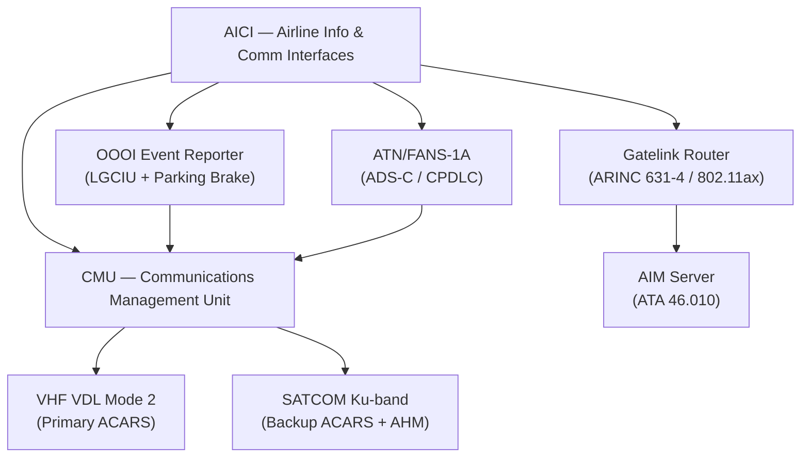
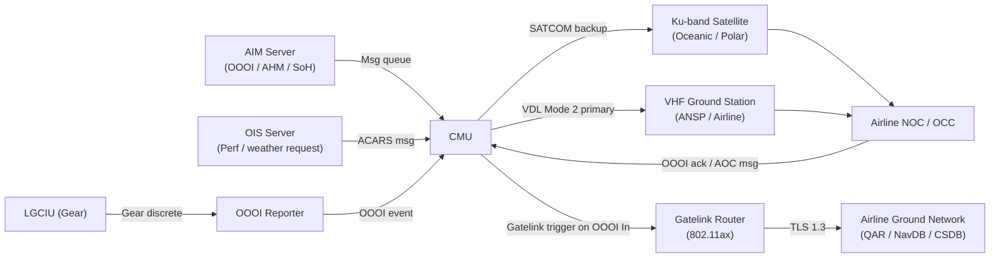
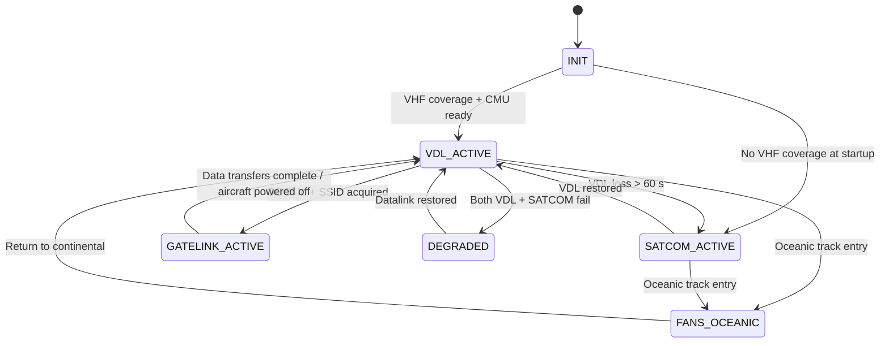

# ATLAS 040-049 · Section 04 · Subsection 046 · 030 — Airline Information and Communication Interfaces

## §0. Hyperlink Policy

All internal cross-references use relative Markdown links within the Q+ATLANTIDE CSDB repository. External regulatory citations in §19/§20 are marked  where hyperlinks are pending. Parent context: [ATLAS 046 README](./README.md). General overview: [046-000 Information Systems General](./046-000-Information-Systems-General.md).

---

## §1. Purpose

ATA 46.030 — Airline Information and Communication Interfaces (AICI) defines the data communications infrastructure between the AMPEL360E eWTW aircraft and the airline's ground network. This encompasses ACARS airline operational communications (AOC and ATC messaging), SATCOM Ku-band backup, Gatelink ARINC 631-4 ground wireless connectivity, OOOI automatic event reporting, and ATN/FANS-1/A oceanic datalink.

Key governance areas:
- ACARS AOC messaging: departure/arrival reports, load confirmations, technical defect reports, battery SoH data.
- SATCOM Ku-band: oceanic and polar route coverage for ACARS and AHM streaming; VHF VDL Mode 2 blackout backup.
- Gatelink (IEEE 802.11ax, ARINC 631-4): automatic gate connection triggering QAR download, NavDB update, CSDB sync, and software load.
- OOOI event reporting (Out/Off/On/In): automatic via VHF VDL Mode 2 driven by LGCIU and parking-brake discretes.
- ATN/FANS-1/A: ADS-C position reporting and CPDLC ATC clearance delivery on oceanic tracks.
- Primary Q-Division: Q-DATAGOV; Support: Q-AIR, Q-SPACE, Q-HPC.

---

## §2. Applicability

| Attribute | Value |
|-----------|-------|
| Aircraft Program | AMPEL360E eWTW |
| ATA Chapter | ATA 46.030 — Airline Information and Communication Interfaces |
| Certification Basis | CS-25 Amendment 28; DO-178C DAL D; FAA FANS-1/A LOA |
| Applicable Standards | ARINC 618; ARINC 631-4; ARINC 429; ICAO Doc 9705 (ATN); DO-160G; S1000D Issue 5.0 |
| Network Architecture | VHF VDL Mode 2 primary; SATCOM Ku-band backup; IEEE 802.11ax Gatelink ground |
| S1000D SNS | 046-030 |

---

## §3. Functional Description

The AICI subsystem provides the full suite of airline ground communications for the AMPEL360E eWTW. The Communications Management Unit (CMU) is the central router for all airborne datalink messages, selecting between VHF VDL Mode 2 (primary) and SATCOM Ku-band (backup) depending on coverage availability.

eWTW-specific ACARS data:
- **Battery SoH uplink**: After each flight, AIM packages battery SoH cycle count, degradation percentage, and thermal history into an ACARS AOC message uploaded to the airline's MRO system via Gatelink (automatic) or SATCOM.
- **Electric motor bus (EMB) health**: OIS generates an AOC message with EMB current, torque, and temperature summary for airline fleet management.
- **Energy consumption record**: kWh/km operational energy record transmitted as an ACARS AOC "fuel report" equivalent at top-of-climb, top-of-descent, and OOOI events.

### Diagram 1: AICI Functional Hierarchy

---

## §4. System Architecture

The CMU selects the active datalink medium automatically:
1. **Priority 1** — VHF VDL Mode 2 when within ground-station VHF coverage (continental operations).
2. **Priority 2** — SATCOM Ku-band when VDL is unavailable or signal quality < threshold (oceanic/polar).
3. **Priority 3** — HF datalink (optional airline fit) as last resort.

Gatelink activation is automatic on OOOI "In" event: CMU signals Gatelink Router to connect to the airport Wi-Fi 6 network; authentication via airline PKI certificate; TLS 1.3 tunnel established within 30 s. All pending data transfers (QAR, CSDB, NavDB, ACARS queue) proceed automatically in prioritised order.

ATN/FANS-1/A for oceanic ATC:
- ADS-C (Automatic Dependent Surveillance-Contract) position reports every 14 min on assigned oceanic track.
- CPDLC (Controller-Pilot Datalink Communications) for oceanic clearance delivery; crew acknowledge on DCDU.

### Diagram 2: AICI Data Flow

---

## §5. Components and Line-Replaceable Units

| LRU | Description | Qty | ATA Interface |
|-----|-------------|-----|---------------|
| ACARS Management Unit (CMU) | Communications Management Unit; ACARS router for VDL/SATCOM/HF | 1 | ATA 46/23 |
| VHF VDL Mode 2 Transceiver | VHF VDL Mode 2 datalink transceiver; primary ACARS medium | 1 | ATA 23/46 |
| SATCOM Transceiver | Ku-band SATCOM for ACARS backup, AHM streaming, weather uplink | 1 | ATA 23/46 |
| Gatelink Router | IEEE 802.11ax Wi-Fi 6 ground connectivity router (ARINC 631-4) | 1 | ATA 46 |

---

## §6. Interfaces

| Interface | System | Protocol | Direction |
|-----------|--------|----------|-----------|
| AIM Server | Aircraft Information Management | ARINC 429 + Ethernet | Rx (ACARS data) |
| VHF Radio (CMU output) | VHF VDL Mode 2 transceiver | Discrete + ARINC 429 | Tx/Rx |
| SATCOM | Ku-band satellite link | IP over satellite / TLS 1.3 | Tx/Rx |
| Gatelink AP | Airport Wi-Fi 6 access point | IEEE 802.11ax / TLS 1.3 | Bidirectional |
| LGCIU (ATA 32) | Landing gear control / air-ground discrete | Discrete wire (28 V) | Rx |
| DCDU (ATA 46/23) | Datalink Control and Display Unit (CPDLC) | ARINC 429 | Bidirectional |
| FMC (ATA 22) | Flight Management Computer (ADS-C position) | ARINC 429 | Rx |
| ANSP (ATC) | Air Navigation Service Provider (CPDLC/ADS-C) | ATN B1 / FANS-1A | Bidirectional |

---

## §7. Operations and Modes

| Mode | Trigger | Description |
|------|---------|-------------|
| INIT | Power-on | CMU boot; datalink medium selection; OOOI status determination |
| VDL-ACTIVE | VHF coverage confirmed | Primary ACARS via VDL Mode 2; OOOI reporting active |
| SATCOM-ACTIVE | VDL unavailable > 60 s | Backup ACARS via SATCOM; AHM streaming; CPDLC via SATCOM |
| GATELINK-ACTIVE | OOOI In + airport SSID acquired | Automatic data transfers; authenticated TLS 1.3 tunnel |
| FANS-OCEANIC | Oceanic track assigned | ATN/FANS-1/A ADS-C contracts established; CPDLC ready |
| DEGRADED | Both VDL and SATCOM lost | ACARS offline; crew advisory; position-reporting gap recorded |

### Diagram 3: AICI Lifecycle FSM

---

## §8. Performance and Budgets

| Parameter | Requirement | Status |
|-----------|-------------|--------|
| VDL Mode 2 message throughput | 31.5 kbit/s sustained |  |
| SATCOM Ku-band throughput | ≥ 128 kbit/s |  |
| OOOI event uplink latency | < 60 s from event trigger |  |
| Gatelink connection establishment | < 30 s from OOOI In |  |
| ADS-C position report interval | ≤ 14 min (oceanic) |  |
| VDL→SATCOM failover time | < 60 s |  |
| Battery SoH uplink per flight | 1 message post-landing |  |

---

## §9. Safety, Redundancy and Fault Tolerance

- **Dual-medium datalink**: VDL Mode 2 primary and SATCOM backup; automatic seamless switchover; no ACARS message loss on medium switch.
- **OOOI independence**: OOOI event reporter uses direct LGCIU discrete inputs; independent of OIS and AIM health.
- **Gatelink firewall**: Strict separation from AFDX avionics network; CMU connects via Gatelink Router only; no direct AFDX → airport Wi-Fi path.
- **CPDLC continuity**: ATN/FANS-1/A context preserved across VDL/SATCOM medium switch; crew transparently re-logged on.
- **DO-178C DAL D**: CMU software is communications management only; not credited for safety-critical flight guidance functions.
- **PKI authentication**: All Gatelink transfers require valid airline PKI certificate; certificate revocation checked on every connection.

---

## §10. Maintenance and Diagnostics

| Task | Interval | Reference |
|------|----------|-----------|
| CMU ACARS functional test | Annually | AMM ATA 46-30-10 |
| VDL Mode 2 RF power check | Every 500 FH | AMM ATA 46-30-20 |
| SATCOM antenna inspection and seal check | Annually | AMM ATA 46-30-30 |
| Gatelink antenna visual check and connector torque | Every 500 FH (A-check) | AMM ATA 46-30-40 |
| PKI certificate validity audit | Every 12 months | AMM ATA 46-30-50 |
| FANS-1/A LOA compliance functional test | Per airline LOA requirements | AMM ATA 46-30-60 |

---

## §11. Configuration and Software

- **CMU software**: DO-178C DAL D; ACARS routing logic and medium selection algorithm.
- **ACARS software load**: Via Gatelink (TLS 1.3, PKI) at gate or via airline NOC (Network Operations Centre) push.
- **VDL Mode 2 FANS-1/A software**: DO-178C DAL D; ATN B1/FANS-1/A software update via airline NOC push (ground only).
- **SATCOM modem firmware**: Commercial firmware update via Gatelink; not DO-178C qualified (modem is non-certified commercial hardware); firmware integrity SHA-256.
- **Gatelink authentication**: IEEE 802.1X with EAP-TLS; airline LDAP-backed certificate authority; certificate renewed annually.
- **OOOI reporter**: Hardware discrete inputs from LGCIU (ATA 32); logic implemented in CMU software partition.
- **Battery SoH ACARS message format**: ARINC 618 AOC message with airline-defined FI code; format agreed with airline MRO system at entry into service.

---

## §12. Environmental and Physical Constraints

| Constraint | Requirement | Standard |
|------------|-------------|----------|
| Operating temperature (CMU) | −40 °C to +70 °C | DO-160G Category B2 |
| Vibration | Category S | DO-160G Section 8 |
| Humidity | 95% RH non-condensing | DO-160G Section 6 |
| SATCOM antenna (external) | DO-160G + lightning strike | DO-160G Sections 22 and 23 |
| Gatelink antenna (belly) | Pressurised, external-exposed radome | DO-160G Category B2 |
| EMI/EMC | Category M | DO-160G Section 21 |

---

## §13. Human Factors and Crew Interface

- CPDLC messages displayed on DCDU (Datalink Control and Display Unit) with crew acknowledge/reject workflow per ICAO Doc 9705.
- ACARS AOC messages visible on EFB ACARS page; alert tone for new OCC message (cyan advisory).
- OOOI events are automatic; no crew action required; crew can view last OOOI timestamp on EFB status page.
- Gatelink status displayed on MAT (Maintenance Access Terminal) during ground operations; not visible in flight.
- Datalink medium (VDL/SATCOM) indicated on EFB COM status page for crew awareness; not a dispatch-critical parameter.

---

## §14. Test and Validation

| Test | Method | Pass Criteria |
|------|--------|---------------|
| ACARS VDL message test | Ground bench with ACARS ground station simulator | Message delivered within 60 s; OOOI event correct |
| VDL→SATCOM failover | Kill VDL link; verify SATCOM activation and ACARS continuity | ACARS message delivered via SATCOM within 60 s |
| Gatelink connection test | OOOI In simulation; verify Wi-Fi 6 connection establishment | TLS tunnel < 30 s; authentication via PKI |
| FANS-1/A ADS-C | Inject oceanic track; verify ADS-C contract establishment | ADS-C reports at ≤ 14 min interval |
| PKI authentication test | Attempt Gatelink with revoked certificate | Connection refused; alert logged in CMDB |
| Battery SoH ACARS uplink | Post-flight OOOI event simulation; verify ACARS message | Message delivered with correct SoH data within 90 s |

---

## §15. Regulatory Compliance

| Requirement | Regulation | Status |
|-------------|------------|--------|
| Airworthiness | CS-25 Amendment 28 |  |
| Software assurance (CMU) | DO-178C DAL D |  |
| Environmental qualification | DO-160G |  |
| ACARS datalink | ARINC 618; ARINC 631-4 |  |
| FANS-1/A oceanic datalink | ICAO Doc 9705; FAA FANS-1/A LOA |  |
| CPDLC | EUROCAE ED-100A |  |
| Technical publications | S1000D Issue 5.0 |  |

---

## §16. Glossary

| Term | Acronym | Definition |
|------|---------|------------|
| Aircraft Communications Addressing and Reporting System | ACARS | A digital datalink protocol over VHF VDL Mode 2 or SATCOM for airline operational communications, position reporting, and OOOI event transmission |
| Out/Off/On/In Timestamps | OOOI | The four key flight event timestamps — aircraft pushback (Out), wheels-off (Off), wheels-on (On), and gate stop (In) — automatically reported via ACARS |
| VHF Data Link Mode 2 | VDL | Digital VHF communications protocol at 31.5 kbit/s used as the primary ACARS datalink medium below FL350 within ground-station coverage |
| Satellite Communications | SATCOM | Ku-band satellite link providing backup ACARS datalink and AHM streaming for oceanic, polar, and VHF blackout areas |
| Gatelink | Gatelink | ARINC 631-4 IEEE 802.11ax Wi-Fi 6 ground wireless connectivity system activated at gate for automated aircraft data exchange |
| Airline Operational Communications | AOC | The subset of ACARS messages used for airline internal operational management (OOOI reports, battery SoH, load confirmations, technical defect reports) |
| Aeronautical Fixed Information Service | AFIS | Ground-to-air fixed telecommunications services for ATN-based communications between aircraft and ATC |
| Aeronautical Telecommunications Network | ATN | The ICAO-standardised IP-based network providing secure ATN communications between aircraft and ATC ground systems |
| Future Air Navigation System | FANS | FANS-1/A: Boeing/Airbus-defined avionics standard for ADS-C position reporting and CPDLC clearance delivery on oceanic/remote routes |
| High Frequency Radio | HF | HF (3–30 MHz) radio datalink, optional airline fit, used as last-resort ACARS backup when both VDL and SATCOM are unavailable |

---

## §17. Footprint

### Physical Footprint

| LRU | Location | Bay | Rack Position |
|-----|----------|-----|---------------|
| ACARS Management Unit (CMU) | Forward avionics bay | E/E Bay | Rack C, Slot 3 |
| VHF VDL Mode 2 Transceiver | Forward avionics bay | E/E Bay | Rack C, Slot 1 |
| SATCOM Transceiver | Aft equipment bay | Aft bay | Rack D, Slot 1 |
| Gatelink Router | Forward avionics bay | E/E Bay | Rack C, Slot 4 |

### Electrical/Data Footprint

| LRU | Power Bus | Power (W) | Data Interface |
|-----|-----------|-----------|----------------|
| ACARS Management Unit | 28 V DC Bus 1 | < 30 | ARINC 429 + Ethernet |
| VHF VDL Mode 2 Transceiver | 28 V DC Bus 1 | < 25 (Rx) / 50 (Tx) | ARINC 429 |
| SATCOM Transceiver | 28 V DC Bus 2 | < 60 | Ethernet (IP) |
| Gatelink Router | 28 V DC Bus 1 | < 20 | Ethernet 1GbE |

### Maintenance Footprint

| Activity | Access Required | Duration |
|----------|----------------|----------|
| CMU LRU replacement | E/E bay forward door | 25 min |
| VDL transceiver replacement | E/E bay forward door | 20 min |
| SATCOM transceiver replacement | Aft equipment bay | 35 min |
| Gatelink antenna check | Belly access panel | 15 min |
| PKI certificate renewal | Ground laptop via Gatelink | 10 min |

---

## §18. Open Issues

| Issue ID | Description | Owner | Status |
|----------|-------------|-------|--------|
| IS-046-030-001 | FANS-1/A Letter of Authorisation (LOA) application not yet initiated | Q-DATAGOV |  |
| IS-046-030-002 | Gatelink connection < 30 s requirement not validated in airport Wi-Fi 6 environment | Q-AIR |  |
| IS-046-030-003 | Battery SoH ACARS message format (ARINC 618 FI code) not yet agreed with airline MRO system | Q-DATAGOV |  |
| IS-046-030-004 | EUROCAE ED-100A CPDLC compliance test plan not yet created | Q-HPC |  |

---

## §19. Citations

| Ref ID | Standard | Applicability | Status |
|--------|----------|---------------|--------|
| [S1] | ATA 46 — Information Systems | System chapter baseline |  |
| [S2] | CS-25 Amendment 28 | Airworthiness basis |  |
| [S3] | DO-178C — Software Considerations in Airborne Systems | CMU software DAL D |  |
| [S4] | DO-160G — Environmental Conditions and Test Procedures | CMU/Gatelink LRU qualification |  |
| [S5] | ARINC 429 — Digital Information Transfer System | CMU/FMC interfaces |  |
| [S6] | ARINC 664 Part 7 — AFDX | Internal AIM interface |  |
| [S7] | ARINC 618 — Air/Ground Character-Oriented Protocol | ACARS message format |  |
| [S8] | ARINC 631-4 — Airport Communications | Gatelink ground connectivity |  |
| [S9] | ICAO Doc 9705 — ATN Manual | FANS-1/A ADS-C / CPDLC |  |
| [S10] | S1000D Issue 5.0 | Technical publications baseline |  |

---

## §20. References

| Ref ID | Document | Version | Status |
|--------|----------|---------|--------|
| [R1] | ATLAS 046-000 — Information Systems General | 1.0.0 |  |
| [R2] | ATLAS 046-010 — Aircraft Information Management | 1.0.0 |  |
| [R3] | ATLAS 046-020 — Operational Data Systems | 1.0.0 |  |
| [R4] | ATLAS 046-070 — Ground Data Transfer and Connectivity | 1.0.0 |  |
| [R5] | ATLAS 023 — Communications Systems | TBD |  |
| [R6] | ATLAS 032 — Landing Gear (LGCIU OOOI discrete) | TBD |  |

---

## §21. Feedback and Review

This document is classified `to-be-reviewed-by-system-expert`. The review process requires:

1. **ACARS/Datalink System Expert**: Validates CMU architecture, VDL/SATCOM medium selection logic, OOOI event reporting completeness, and FANS-1/A ATN interface design.
2. **Q-DATAGOV Review**: Confirms security architecture (PKI, TLS 1.3), battery SoH ACARS message format, and data governance for ground data transfers.
3. **EASA/FAA Regulatory Review**: FANS-1/A LOA, EUROCAE ED-100A CPDLC, and CS-25 items in §15 must be reviewed before certification. Open issues §18 must be resolved.

`review_status` must be updated to `reviewed` upon completion of the designated system expert review.

---

## §22. Change Log

| Version | Date | Author | Description |
|---------|------|--------|-------------|
| 1.0.0 | 2026-05-10 | Q-DATAGOV / Copilot | Initial baseline — all 22 sections populated for AMPEL360E eWTW Airline Information and Communication Interfaces |
