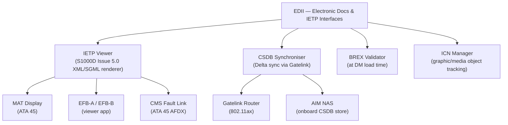
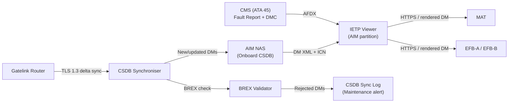
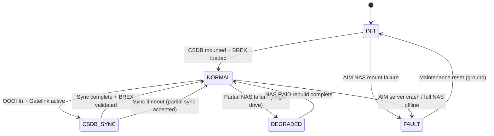

# ATLAS 040-049 · Section 04 · Subsection 046 · 040 — Electronic Documentation and IETP Interfaces

## §0. Hyperlink Policy

All internal cross-references use relative Markdown links within the Q+ATLANTIDE CSDB repository. External regulatory citations in §19/§20 are marked  where hyperlinks are pending. Parent context: [ATLAS 046 README](./README.md). General overview: [046-000 Information Systems General](./046-000-Information-Systems-General.md).

---

## §1. Purpose

ATA 46.040 — Electronic Documentation and IETP Interfaces (EDII) defines the onboard interactive electronic technical publication system for the programme-defined aircraft type. This covers the IETP viewer application, the onboard AMM/IPC/FIM library, CSDB synchronisation via Gatelink, BREX validation, and ICN graphic management — all compliant with S1000D Issue 5.0.

Key governance areas:
- IETP viewer: S1000D Issue 5.0 SGML/XML rendering engine on AIM server (software partition) and MAT/EFB display.
- Onboard technical publications: AMM (Aircraft Maintenance Manual), IPC (Illustrated Parts Catalogue), FIM (Fault Isolation Manual), OMM (Operations and Maintenance Manual).
- CSDB synchronisation: automatic synchronisation of S1000D data modules at gate via Gatelink.
- BREX validation: Business Rules Exchange validation applied at data module load time to ensure publication conformance.
- ICN management: Information Control Number tracking for all graphic and media objects in the CSDB.
- Primary Q-Division: Q-DATAGOV; Support: Q-AIR, Q-SPACE, Q-HPC.

---

## §2. Applicability

| Attribute | Value |
|-----------|-------|
| Aircraft Program | programme-defined aircraft type |
| ATA Chapter | ATA 46.040 — Electronic Documentation and IETP Interfaces |
| Certification Basis | CS-25 Amendment 28; DO-178C DAL D |
| Applicable Standards | S1000D Issue 5.0; ARINC 631-4; DO-160G; ARINC 664 P7 |
| Network Architecture | AFDX (ARINC 664 P7) AIM link; IEEE 802.11ax Gatelink for CSDB sync |
| S1000D SNS | 046-040 |

---

## §3. Functional Description

The EDII subsystem provides onboard access to all technical publications required for aircraft maintenance and crew operations. The IETP viewer runs as a software partition on the AIM server and renders S1000D Issue 5.0 data modules on the MAT (Maintenance Access Terminal, ATA 45) or EFB Class 3 tablets.

S1000D data modules available onboard:
- **AMM**: Aircraft Maintenance Manual — maintenance procedures for all ATA chapters.
- **IPC**: Illustrated Parts Catalogue — part numbers, effectivity, and exploded diagrams for all LRUs.
- **FIM**: Fault Isolation Manual — linked from CMS fault reports (ATA 45) via AFDX VL; one-click FIM navigation from CMS fault code.
- **OMM / QRH**: Quick Reference Handbook supplements accessible on EFB.
- **IETP coverage for [PROGRAMME-VARIANT]**: Dedicated data modules for electric motor bus (EMB) removal/installation, battery module R/I, EMA actuation system troubleshooting — not present in conventional aircraft documentation.

CSDB synchronisation:
- Automatic CSDB sync triggered on OOOI "In" event when Gatelink is active.
- Delta synchronisation: only changed or new data modules downloaded (not full CSDB); ARINC 631-4 TLS 1.3 encrypted.
- BREX validation run automatically on every received data module; non-conforming DMs rejected and flagged.

### Diagram 1: EDII Functional Hierarchy

---

## §4. System Architecture

The IETP viewer is a software partition on the AIM server. It reads S1000D data modules from the AIM NAS (onboard CSDB) and serves the rendered publication to requesting display clients (MAT over Ethernet, EFB over Ethernet 1GbE).

Key architectural features:
1. **Client-server model**: IETP viewer is server-side; MAT and EFB are thin display clients accessing publications via HTTPS (port 443) with crew authentication.
2. **CSDB delta sync**: Synchroniser compares onboard CSDB manifest (SHA-256 per data module) with airline CSDB manifest received from ground; downloads only changed DMs.
3. **FIM deep-link**: CMS fault reports (ATA 45) include a DMC (Data Module Code) reference; the IETP viewer opens the FIM directly at the relevant DM when technician clicks the CMS fault code.
4. **ICN tracking**: All graphics (ICNs) tracked by information control number; IETP viewer validates ICN presence before rendering a data module.

### Diagram 2: EDII Data Flow

---

## §5. Components and Line-Replaceable Units

| LRU | Description | Qty | ATA Interface |
|-----|-------------|-----|---------------|
| IETP Viewer Server | Software partition on AIM server; S1000D Issue 5.0 XML/SGML rendering engine | 1 (SW) | ATA 46 |
| MAT (Maintenance Access Terminal) | 12-inch ruggedised tablet displaying IETP / FIM / AMM via HTTPS; ATA 45 unit | 1 | ATA 45 interface |
| EFB Class 3 Tablet | Pilot/Co-pilot tablet; IETP viewer app installed; accesses AIM NAS CSDB | 2 | ATA 46 |
| CSDB Synchroniser Module | Software module on AIM; manages delta CSDB sync via Gatelink | 1 (SW) | ATA 46 |

---

## §6. Interfaces

| Interface | System | Protocol | Direction |
|-----------|--------|----------|-----------|
| AIM Server / NAS | Aircraft Information Management | Internal (AIM partition) | Rx (CSDB read) |
| MAT (ATA 45) | Maintenance Access Terminal | Ethernet 1GbE / HTTPS | Tx (DM pages) |
| EFB Class 3 Tablets | Crew/maintenance EFB | Ethernet 1GbE / HTTPS | Tx (DM pages) |
| CMS (ATA 45) | Central Maintenance System (fault → DMC link) | AFDX BITE VLAN | Rx (DMC reference) |
| Gatelink Router | Ground CSDB provider (airline publication server) | IEEE 802.11ax / TLS 1.3 | Rx (delta DMs) |
| Airline CSDB Server | Ground S1000D publication authority | HTTPS / TLS 1.3 | Rx (sync manifest) |

---

## §7. Operations and Modes

| Mode | Trigger | Description |
|------|---------|-------------|
| INIT | Power-on | IETP viewer partition start; AIM NAS CSDB mount; BREX profile load |
| NORMAL | Post-INIT OK | IETP viewer ready; MAT/EFB access to all onboard DMs; FIM deep-link active |
| CSDB-SYNC | OOOI In + Gatelink active | Delta CSDB download; BREX validation of new DMs; NAS update |
| DEGRADED | AIM NAS partially unavailable | Reduced DM set available; crew advisory on MAT; no FIM deep-link for affected chapters |
| FAULT | AIM server crash or NAS offline | IETP viewer unavailable; crew advisory; paper backup procedures invoked |

### Diagram 3: EDII Lifecycle FSM

---

## §8. Performance and Budgets

| Parameter | Requirement | Status |
|-----------|-------------|--------|
| IETP DM page render time | < 2 s per S1000D data module page |  |
| CSDB delta sync duration (typical A-check cycle) | < 30 min per gate turn |  |
| FIM deep-link navigation time | < 3 s from CMS fault click to FIM page |  |
| BREX validation rate | ≥ 10 DMs/s |  |
| Onboard CSDB capacity (AIM NAS) | Full AMM + IPC + FIM + OMM (estimated 50 GB) |  |
| Simultaneous users (MAT + EFB) | ≥ 3 concurrent sessions |  |

---

## §9. Safety, Redundancy and Fault Tolerance

- **NAS RAID-1**: CSDB data protected by RAID-1 mirroring; single NVMe failure does not interrupt IETP viewer.
- **BREX validation**: All DMs validated on load; corrupt or non-conforming DMs are never served to MAT/EFB — prevents incorrect maintenance procedures.
- **SHA-256 DM integrity**: Every data module stored with SHA-256 hash; IETP viewer re-validates hash before rendering; tampering detected.
- **FIM deep-link safety**: CMS fault → FIM navigation is read-only; no command path from IETP to flight systems.
- **Paper backup**: In case of IETP viewer fault, crew/maintenance have access to paper AMM/QRH as required by CS-25 and operator MEL.
- **DO-178C DAL D**: IETP viewer software is advisory-only information display; not credited for safety-critical functions.

---

## §10. Maintenance and Diagnostics

| Task | Interval | Reference |
|------|----------|-----------|
| CSDB sync automatic (gate turn) | Every gate turn (automatic) | AMM ATA 46-40-10 |
| CSDB version audit (manual) | At A-check | AMM ATA 46-40-15 |
| IETP viewer software version check | At A-check | AMM ATA 46-40-20 |
| BREX validation log review | Monthly | AMM ATA 46-40-25 |
| ICN inventory audit (graphics vs NAS) | At C-check | AMM ATA 46-40-30 |
| MAT display calibration and touchscreen test | Every 500 FH | AMM ATA 45-60-05 |

---

## §11. Configuration and Software

- **RTOS**: IETP viewer runs as an ARINC 653 partition on the AIM server RTOS.
- **Software DAL**: DO-178C DAL D for IETP viewer application (publication display — advisory only).
- **S1000D conformance**: IETP viewer renders S1000D Issue 5.0 data modules (XML-coded, SGML legacy supported); BREX profile loaded from AIM NAS.
- **Update mechanism**: IETP viewer software update via Gatelink (TLS 1.3, PKI); integrity SHA-256.
- **CSDB manifest**: SHA-256 hash per data module; stored in AIM NAS as signed XML manifest; used for delta sync comparison.
- **BREX enforcement**: BREX profile version-controlled; must match airline CSDB BREX before any delta sync proceeds.
- **[PROGRAMME-VARIANT] DM set**: Dedicated programme-defined aircraft type data modules for EMB, battery, and EMA procedures maintained in CSDB under chapter 046 SNS nodes.

---

## §12. Environmental and Physical Constraints

| Constraint | Requirement | Standard |
|------------|-------------|----------|
| Operating temperature (IETP partition, AIM server) | −40 °C to +70 °C | DO-160G Category B2 |
| Vibration | Category S | DO-160G Section 8 |
| Humidity | 95% RH non-condensing | DO-160G Section 6 |
| Altitude | 0–8,000 ft (pressurised E/E bay) | DO-160G Section 4 |
| EMI/EMC | Category M | DO-160G Section 21 |

---

## §13. Human Factors and Crew Interface

- MAT display: 12-inch capacitive touchscreen; IETP viewer presents S1000D data modules in full-text with hyperlinked cross-references; breadcrumb navigation.
- EFB viewer app: consistent navigation UX with MAT; swipe/pinch gesture support for graphics zoom.
- FIM deep-link workflow: CMS fault display shows "Open FIM" button; one tap navigates directly to relevant isolation procedure.
- CSDB version banner shown on IETP viewer home screen; technician can verify currency at a glance.
- Colour-coded effectivity filter: EFB/MAT highlights data modules applicable to the specific aircraft MSN (manufacturer serial number); non-applicable DMs visually suppressed.
- BREX violation alert displayed to maintenance supervisor on MAT when a rejected DM is detected during sync.

---

## §14. Test and Validation

| Test | Method | Pass Criteria |
|------|--------|---------------|
| IETP render performance | Load 100 DMs sequentially on MAT; measure render time | < 2 s per page on 95th percentile |
| FIM deep-link | Inject CMS fault code with DMC; verify IETP opens at correct DM | Correct DM displayed < 3 s from click |
| BREX validation | Load DM with known BREX violation; verify rejection | DM rejected; alert displayed on MAT; DM not rendered |
| CSDB delta sync | Inject 50 updated DMs via Gatelink simulator; verify NAS update | All 50 DMs downloaded + BREX-validated within 30 min |
| SHA-256 integrity | Corrupt one DM byte on NAS; verify IETP detects tampering | IETP refuses to render; alert logged to CMS |
| Concurrent sessions | 3 users simultaneously navigate IETP on MAT + EFB-A + EFB-B | All 3 sessions respond in < 3 s; no session timeout |

---

## §15. Regulatory Compliance

| Requirement | Regulation | Status |
|-------------|------------|--------|
| Airworthiness | CS-25 Amendment 28 |  |
| Software assurance | DO-178C DAL D |  |
| Environmental qualification | DO-160G |  |
| Technical publication format | S1000D Issue 5.0 |  |
| Ground connectivity | ARINC 631-4 |  |
| Network qualification | ARINC 664 Part 7 |  |

---

## §16. Glossary

| Term | Acronym | Definition |
|------|---------|------------|
| Interactive Electronic Technical Publication | IETP | A structured, hyperlinked, S1000D-compliant digital maintenance manual rendered by the IETP viewer on MAT or EFB for the programme-defined aircraft type |
| Aircraft Maintenance Manual | AMM | The primary S1000D data module set documenting all maintenance procedures for all ATA chapters of the programme-defined aircraft type |
| Illustrated Parts Catalogue | IPC | The S1000D data module set providing part numbers, quantity, effectivity, and exploded-view graphics for all LRUs and assemblies |
| Fault Isolation Manual | FIM | The S1000D data module set containing MSG-3 decision trees for fault isolation; accessed via CMS deep-link from ATA 45 fault reports |
| International Specification for Technical Publications | S1000D | The international aerospace standard (Issue 5.0) specifying the structure, format, and management of technical documentation using a common source database (CSDB) |
| Data Module Code | DMC | The unique S1000D alphanumeric identifier for each data module, structured as: model–system–sub-system–assembly–disassembly code–info code–variant |
| Standard Generalized Markup Language | SGML | The ISO 8879 markup language used in S1000D legacy publications; IETP viewer supports both SGML and XML-encoded data modules |
| eXtensible Markup Language | XML | The modern W3C markup language used in S1000D Issue 5.0 data modules; the IETP viewer renders XML DMs as the primary format |
| Business Rules Exchange | BREX | The S1000D project-specific rule set governing allowed element structures, attribute values, and referencing conventions; validated at CSDB load time |
| Information Control Number | ICN | The unique identifier assigned to each graphic, illustration, multimedia object, or reusable media element within the S1000D CSDB |

---

## §17. Footprint

### Physical Footprint

| LRU | Location | Bay | Rack Position |
|-----|----------|-----|---------------|
| IETP Viewer Server (SW partition) | AIM Server A/B (forward E/E bay) | E/E Bay | Rack A, Slot 5/6 (shared) |
| MAT (Maintenance Access Terminal) | Cockpit / avionics bay docking station | Flight deck + E/E Bay | Docking station |
| EFB Class 3 Tablet (×2) | Cockpit pilot/co-pilot stations | Flight deck | Docking station P1/P2 |
| CSDB Synchroniser (SW module) | AIM Server (software) | E/E Bay | N/A (software) |

### Electrical/Data Footprint

| LRU | Power Bus | Power (W) | Data Interface |
|-----|-----------|-----------|----------------|
| IETP Viewer (SW partition on AIM Server A) | 28 V DC Bus 1 (AIM server) | Shared < 150 (AIM total) | AFDX + Ethernet HTTPS |
| MAT | 28 V DC Maint Bus | < 20 | Ethernet 1GbE / HTTPS |
| EFB-A | 28 V DC Cockpit Bus | < 25 | Ethernet 1GbE / HTTPS |
| EFB-B | 28 V DC Cockpit Bus | < 25 | Ethernet 1GbE / HTTPS |

### Maintenance Footprint

| Activity | Access Required | Duration |
|----------|----------------|----------|
| Manual CSDB delta sync trigger | MAT or ground laptop via Gatelink | 5 min (initiate) + transfer time |
| IETP viewer software update | Ground, Gatelink active | 10 min (automated) |
| CSDB version audit | MAT IETP home screen | 2 min |
| Full CSDB refresh (annual) | Ground, Gatelink active | Up to 4 h (full CSDB download) |

---

## §18. Open Issues

| Issue ID | Description | Owner | Status |
|----------|-------------|-------|--------|
| IS-046-040-001 | CSDB delta sync < 30 min requirement not validated with full 50 GB CSDB on Wi-Fi 6 bandwidth | Q-DATAGOV |  |
| IS-046-040-002 | [PROGRAMME-VARIANT]-specific DM set (EMB, battery, EMA) content not yet authored in CSDB | Q-AIR |  |
| IS-046-040-003 | BREX profile for programme-defined aircraft type not yet finalised with OEM technical publications team | Q-DATAGOV |  |
| IS-046-040-004 | FIM deep-link API from CMS (ATA 45) not yet integrated in CMS software build 2.1 | Q-HPC |  |

---

## §19. Citations

| Ref ID | Standard | Applicability | Status |
|--------|----------|---------------|--------|
| [S1] | ATA 46 — Information Systems | System chapter baseline |  |
| [S2] | CS-25 Amendment 28 | Airworthiness basis |  |
| [S3] | DO-178C — Software Considerations in Airborne Systems | IETP viewer software DAL D |  |
| [S4] | DO-160G — Environmental Conditions and Test Procedures | LRU qualification |  |
| [S5] | ARINC 429 — Digital Information Transfer System | Legacy interface |  |
| [S6] | ARINC 664 Part 7 — AFDX | AIM backbone |  |
| [S7] | ARINC 631-4 — Gatelink | CSDB sync ground link |  |
| [S8] | S1000D Issue 5.0 — Technical Publications | IETP and CSDB primary standard |  |
| [S9] | ISO 8879 — SGML | Legacy DM format support |  |

---

## §20. References

| Ref ID | Document | Version | Status |
|--------|----------|---------|--------|
| [R1] | ATLAS 046-000 — Information Systems General | 1.0.0 |  |
| [R2] | ATLAS 046-010 — Aircraft Information Management | 1.0.0 |  |
| [R3] | ATLAS 045-060 — Maintenance Terminal and Crew Maintenance Interfaces | 1.0.0 |  |
| [R4] | ATLAS 046-090 — S1000D CSDB Mapping and Traceability | 1.0.0 |  |
| [R5] | ATLAS 046-070 — Ground Data Transfer and Connectivity | 1.0.0 |  |
| [R6] | programme-defined aircraft type CSDB BREX Specification | TBD |  |

---

## §21. Feedback and Review

This document is classified `to-be-reviewed-by-system-expert`. The review process requires:

1. **S1000D / Technical Publications Expert**: Validates IETP viewer S1000D Issue 5.0 conformance, BREX profile design, delta sync architecture, and ICN management.
2. **Q-DATAGOV Review**: Confirms CSDB data governance, SHA-256 integrity chain, and IETP viewer software DAL consistency with DO-178C PSAC.
3. **EASA/FAA Regulatory Review**: CS-25 items in §15 and BREX/CSDB conformance reviewed before publication baseline is frozen. Open issues in §18 (especially [PROGRAMME-VARIANT] DM set) must be resolved.

`review_status` must be updated to `reviewed` upon completion of the designated system expert review.

---

## §22. Change Log

| Version | Date | Author | Description |
|---------|------|--------|-------------|
| 1.0.0 | 2026-05-10 | Q-DATAGOV / Copilot | Initial baseline — all 22 sections populated for programme-defined aircraft type Electronic Documentation and IETP Interfaces |
