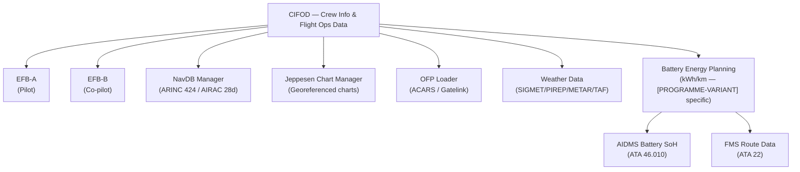
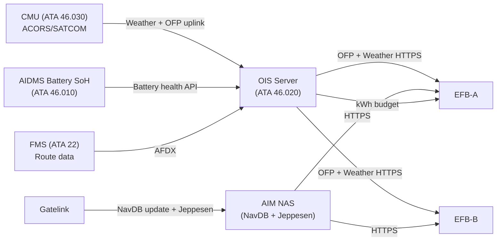
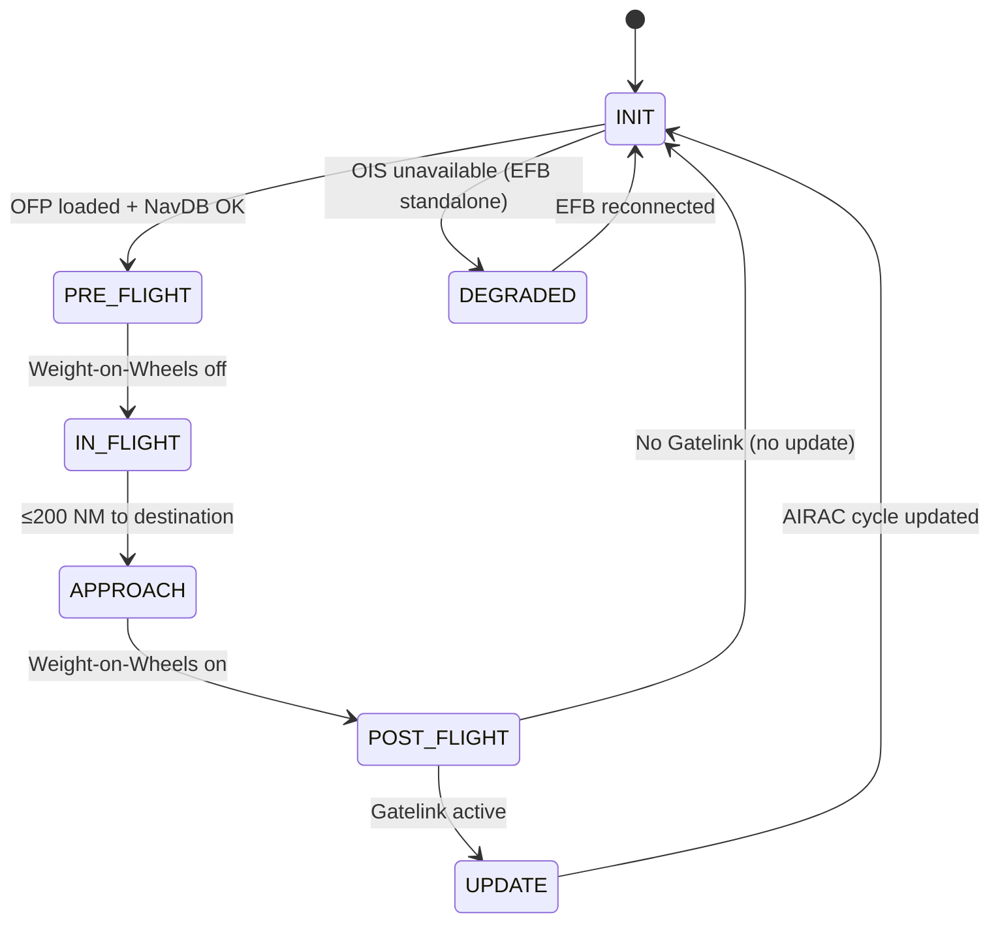

# ATLAS 040-049 · Section 04 · Subsection 046 · 050 — Crew Information and Flight Operations Data

## §0. Hyperlink Policy

All internal cross-references use relative Markdown links within the Q+ATLANTIDE CSDB repository. External regulatory citations in §19/§20 are marked  where hyperlinks are pending. Parent context: [ATLAS 046 README](./README.md). General overview: [046-000 Information Systems General](./046-000-Information-Systems-General.md).

---

## §1. Purpose

ATA 46.050 — Crew Information and Flight Operations Data (CIFOD) defines the systems and data flows that provide flight crew with all pre-flight, in-flight, and post-flight information relevant to flight operations on the programme-defined aircraft type. This covers the EFB Class 3 dual-tablet installation, NavDB AIRAC 28-day update cycle, Jeppesen chart management, Operational Flight Plan (OFP) loading, SIGMET/PIREP weather data feed, and the battery SoC/SoH pre-flight energy planning tool.

Key governance areas:
- EFB Class 3 dual tablets (EFB-A, EFB-B): pilot and co-pilot; Class 3 per AC 120-76D.
- NavDB: Navigation Database (ARINC 424 format), AIRAC 28-day update cycle; loaded via Gatelink or ARINC 849 USB dataloader.
- OFP loading: Operational Flight Plan received via ACARS/SATCOM or loaded from Gatelink; available on EFB and displayed on MCDU/MFD.
- SIGMET/PIREP: Weather data (SIGMET, PIREP, TAF, METAR) pushed to EFB via ACARS/VDL/SATCOM.
- Battery energy planning tool: [PROGRAMME-VARIANT]-specific EFB application computing range in kWh/km and minimum reserve SoC for alternate; replaces conventional fuel load tool (kg/h).
- Primary Q-Division: Q-DATAGOV; Support: Q-AIR, Q-SPACE, Q-HPC.

---

## §2. Applicability

| Attribute | Value |
|-----------|-------|
| Aircraft Program | programme-defined aircraft type |
| ATA Chapter | ATA 46.050 — Crew Information and Flight Operations Data |
| Certification Basis | CS-25 Amendment 28; AC 120-76D (EFB Class 3) |
| Applicable Standards | ARINC 424 (NavDB); ARINC 429; ARINC 664 P7; DO-160G; S1000D Issue 5.0 |
| Network Architecture | AFDX (ARINC 664 P7); Gatelink 802.11ax; ACARS/SATCOM datalink |
| S1000D SNS | 046-050 |

---

## §3. Functional Description

The CIFOD subsystem provides real-time flight operations information to the flight crew via dual EFB Class 3 tablets. Key functions include:

1. **NavDB management**: ARINC 424-format navigation database loaded every AIRAC 28-day cycle; validated before loading by NAVDB checker application on EFB.
2. **Jeppesen chart management**: Georeferenced approach, SID, STAR charts loaded via Gatelink; auto-updated at gate; displayed on EFB in approach context.
3. **OFP loading**: Operational Flight Plan received via ACARS (ground pre-departure) or manually loaded from Gatelink USB; OFP data (route, alternates, fuel/energy reserve) displayed on EFB and cross-linked to FMS.
4. **SIGMET/PIREP/TAF/METAR**: Weather uplinks via ACARS/VDL Mode 2/SATCOM pushed to EFB weather overlay; crew reviewed pre-departure and in-flight.
5. **Battery energy planning tool ([PROGRAMME-VARIANT]-specific)**: EFB application computing kWh consumption per flight segment based on route, wind, weight, altitude; computes minimum departure SoC for destination + alternate + final reserve (10% SoC); interfaces with AIDMS battery SoH feed.

### Diagram 1: CIFOD Functional Hierarchy

---

## §4. System Architecture

EFB-A and EFB-B are Class 3 (installed) EFB tablets with dedicated docking stations on the flight deck. Each EFB runs a qualified EFB platform software suite (AC 120-76D approval by operator). EFB receives all crew operations data from the OIS server (ATA 46.020) and from direct ACARS/SATCOM feeds routed via the CMU (ATA 46.030).

Data flows:
- **NavDB**: Downloaded from airline NavDB server via Gatelink → AIM NAS → EFB; update validated by NavDB checker before activation.
- **OFP**: OFP uplinked via ACARS pre-departure from airline dispatch system; stored in AIM OIS server; EFB pulls OFP via HTTPS API.
- **Weather**: SIGMET/PIREP/METAR/TAF received via ACARS/VDL/SATCOM by CMU; forwarded to OIS server; OIS server pushes to EFB.
- **Battery energy planning**: EFB battery app reads AIDMS battery SoH (via AFDX HTTPS API from OIS server); combines with FMS route data to compute energy budget.

### Diagram 2: CIFOD Data Flow

---

## §5. Components and Line-Replaceable Units

| LRU | Description | Qty | ATA Interface |
|-----|-------------|-----|---------------|
| EFB Class 3 Tablet (EFB-A) | Pilot-side installed EFB; 12-inch touchscreen; NavDB/charts/OFP/energy planning app | 1 | ATA 46 |
| EFB Class 3 Tablet (EFB-B) | Co-pilot-side installed EFB; identical spec to EFB-A; independent docking station | 1 | ATA 46 |
| EFB Docking Station P1 | Pilot-side cradle; 28 V DC power + Ethernet 1GbE + HDMI; LRU | 1 | ATA 46 |
| EFB Docking Station P2 | Co-pilot-side cradle; identical spec to P1 | 1 | ATA 46 |
| OIS Server | Onboard Information Server managing OFP, weather, NavDB staging; hosts battery energy planning API | 1 | ATA 46 |

---

## §6. Interfaces

| Interface | System | Protocol | Direction |
|-----------|--------|----------|-----------|
| OIS Server | Operational Information System (ATA 46.020) | Ethernet 1GbE / HTTPS | Rx (OFP, weather, energy) |
| AIM NAS | NavDB and Jeppesen chart storage | Ethernet 1GbE / HTTPS | Rx (NavDB, charts) |
| CMU (ATA 46.030) | ACARS/SATCOM — weather and OFP uplinks | AFDX VLAN | Rx (via OIS relay) |
| FMS (ATA 22) | Flight Management System — route and altitude data | AFDX | Rx (route profile for battery energy model) |
| AIDMS (ATA 46.010) | Battery SoH telemetry | AFDX HTTPS API | Rx (SoH for energy planning) |
| Gatelink Router | NavDB/Jeppesen update delivery at gate | IEEE 802.11ax / TLS 1.3 | Rx (updates) |

---

## §7. Operations and Modes

| Mode | Trigger | Description |
|------|---------|-------------|
| INIT | Power-on | EFB boot; NavDB version check; OIS connection established |
| PRE-FLIGHT | Crew login + OOOI Out pending | OFP loaded; NavDB activated; Jeppesen charts loaded for route; energy plan computed; battery SoC pre-flight check |
| IN-FLIGHT | Weight-on-Wheels off | EFB transitions to in-flight mode; weather updates via ACARS/SATCOM; energy plan monitors actual vs planned kWh |
| APPROACH | ≤ 200 NM from destination | Jeppesen georeferenced approach chart auto-displayed; ATIS/METAR updated; energy reserve verification |
| POST-FLIGHT | Weight-on-Wheels on | OFP closed; flight data summary; OOOI Out logged; EFB sync to OIS server |
| DEGRADED | One EFB offline | Single EFB continues; crew advisory; no EFB-to-EFB sync |
| UPDATE | OOOI In + Gatelink active | NavDB/Jeppesen update from Gatelink; AIRAC cycle check |

### Diagram 3: CIFOD EFB Lifecycle FSM

---

## §8. Performance and Budgets

| Parameter | Requirement | Status |
|-----------|-------------|--------|
| NavDB AIRAC cycle update time (Gatelink) | < 15 min per 28-day cycle |  |
| OFP load time (ACARS or Gatelink) | < 30 s |  |
| Battery energy planning calculation | < 5 s for full route profile |  |
| Jeppesen chart render time | < 2 s per plate |  |
| Weather SIGMET/METAR update frequency | ≤ 30 min in-flight |  |
| EFB battery life (unpowered — emergency) | ≥ 2 h standalone |  |

---

## §9. Safety, Redundancy and Fault Tolerance

- **Dual EFB**: EFB-A (pilot) and EFB-B (co-pilot) are independent; failure of one does not affect the other.
- **NavDB validation**: NavDB checker application verifies ARINC 424 format integrity and cycle dates before activation; prevents loading of out-of-cycle or corrupt NavDB.
- **OFP cross-check**: OFP loaded on EFB is not a source for FMS; crew manually cross-loads OFP data into FMS; EFB OFP is advisory only (not credited for navigation).
- **Battery energy planning advisory-only**: Energy plan on EFB does not command aircraft systems; pilots use energy plan as decision-support; authoritative SoC displayed on EICAS.
- **ACARS weather advisory**: SIGMET/PIREP on EFB is advisory; dispatch weather release remains the authority for flight release decisions.
- **[PROGRAMME-VARIANT] energy reserve**: Battery planning tool enforces 10% SoC final reserve as a non-alterable parameter; crew cannot reduce final reserve below regulatory minimum.

---

## §10. Maintenance and Diagnostics

| Task | Interval | Reference |
|------|----------|-----------|
| NavDB AIRAC cycle update (automatic) | Every 28 days (gate) | AMM ATA 46-50-10 |
| Jeppesen chart database update | Every 28 days (gate, via Gatelink) | AMM ATA 46-50-15 |
| EFB software version check | At A-check | AMM ATA 46-50-20 |
| EFB Class 3 hardware inspection and docking station check | Every 500 FH | AMM ATA 46-50-25 |
| EFB battery internal health check | At C-check | AMM ATA 46-50-30 |
| Battery energy planning model validation (energy model coefficients update) | As required (airline ops engineering) | AMM ATA 46-50-35 |

---

## §11. Configuration and Software

- **EFB platform**: Qualified EFB Class 3 platform software per AC 120-76D; operator-specific qualification documentation required.
- **NavDB application**: ARINC 424 NavDB checker + activator; validates cycle dates and format before NAS hand-off to FMS NavDB updater.
- **Jeppesen chart app**: Georeferenced plates loaded per route; auto-context switching based on FMS active waypoint via AFDX advisory link.
- **Battery energy planning app**: [PROGRAMME-VARIANT]-specific; coefficients: kWh/nm as function of GW, altitude, wind, ISA deviation; SoH degradation factor from AIDMS; minimum reserve = 10% SoC unalterable.
- **OFP application**: Receives ACARS-uplinked OFP XML; displays route, alternates, fuel/energy block, NOTAM summary.
- **Software update**: All EFB apps updated via Gatelink (TLS 1.3); integrity SHA-256 per application package.

---

## §12. Environmental and Physical Constraints

| Constraint | Requirement | Standard |
|------------|-------------|----------|
| Operating temperature (EFB tablet) | −20 °C to +55 °C | DO-160G Category B3 |
| Vibration | Category S (cockpit mount) | DO-160G Section 8 |
| Humidity | 95% RH non-condensing | DO-160G Section 6 |
| Altitude | 0–8,000 ft (pressurised flight deck) | DO-160G Section 4 |
| EMI/EMC | Category M | DO-160G Section 21 |
| Display luminance | ≥ 500 cd/m² (direct sunlight readable) | CS-25 cockpit human factors |

---

## §13. Human Factors and Crew Interface

- **Dual EFB layout**: Each pilot has a dedicated EFB at elbow height in the docking station; same application suite on both; independent session state.
- **Energy planning prominently placed**: Battery SoC/energy plan app is on the home screen of EFB pre-flight mode; green/amber/red state icon for energy margin.
- **Georeferenced charts**: EFB auto-displays the approach plate for the active FMS destination approach; crew tap to zoom; terrain awareness overlay on chart.
- **One-click OFP load**: When ground receives OFP uplink via ACARS, a notification appears on EFB; crew tap "Load OFP" to activate.
- **SIGMET overlay**: SIGMET displayed as overlay on route map; red polygon; crew can acknowledge and log.
- **NavDB expiry warning**: EFB displays NavDB expiry date at login; amber alert 72 h before expiry.

---

## §14. Test and Validation

| Test | Method | Pass Criteria |
|------|--------|---------------|
| NavDB load and validation | Load known-good and known-corrupt ARINC 424 DB via Gatelink emulator; verify checker | Good DB activated; corrupt DB rejected with alert |
| OFP ACARS load | Inject OFP via ACARS datalink emulator; verify EFB display | OFP displayed < 30 s from uplink receipt |
| Battery energy planning accuracy | Compare EFB model output with AIDMS telemetry on reference flight profile | Error < 2% kWh vs actual consumption |
| Jeppesen chart render | Open 20 approach plates sequentially on EFB; measure render time | < 2 s per plate on 95th percentile |
| Dual EFB independence | Crash EFB-A; verify EFB-B continues | EFB-B unaffected; crew advisory displayed |
| Energy reserve enforcement | Attempt to set final reserve below 10% SoC in energy plan app | Application rejects; alert displayed; cannot proceed |

---

## §15. Regulatory Compliance

| Requirement | Regulation | Status |
|-------------|------------|--------|
| EFB Class 3 operational approval | AC 120-76D |  |
| Airworthiness | CS-25 Amendment 28 |  |
| Environmental qualification | DO-160G |  |
| Navigation database standard | ARINC 424 |  |
| Datalink communications | EUROCAE ED-228A (CPDLC) |  |
| Energy reserve ([PROGRAMME-VARIANT]) | Regulatory TBD ([PROGRAMME-VARIANT]-specific CS-23/25 amendment) |  |

---

## §16. Glossary

| Term | Acronym | Definition |
|------|---------|------------|
| Electronic Flight Bag | EFB | Class 3 (installed) tablet computer on the programme-defined aircraft type flight deck providing crew with NavDB, charts, OFP, weather, and battery energy planning applications per AC 120-76D |
| Navigation Database | NavDB | ARINC 424-format database of waypoints, airways, procedures, and navaids loaded on EFB and FMS; updated every AIRAC 28-day cycle |
| Aeronautical Information Regulation And Control | AIRAC | The ICAO/IATA standardised 28-day cycle for navigation database updates; ensures consistent NavDB data globally |
| Operational Flight Plan | OFP | The complete flight release document including route, alternates, fuel/energy block, payload, and NOTAM summary; loaded on EFB via ACARS or Gatelink |
| Significant Meteorological Information | SIGMET | An en-route weather advisory issued by meteorological watch offices (MWO) for severe weather phenomena; displayed as overlay on EFB route map |
| Pilot Report | PIREP | In-flight weather observation reported by pilots via ACARS/VHF and displayed on EFB weather overlay to supplement SIGMET/TAF |
| Terminal Aerodrome Forecast | TAF | A concise statement of the expected meteorological conditions at an aerodrome over a specified period; displayed on EFB for departure and destination/alternate |
| Battery State of Charge | SoC | The ratio of remaining usable energy to nominal battery capacity (0–100%); primary parameter in [PROGRAMME-VARIANT] energy planning and displayed on EICAS and EFB |
| State of Health | SoH | The long-term degradation metric of the battery pack (0–100%); used by EFB battery energy planning tool to adjust range estimates based on actual capacity reduction |
| Energy Planning Model | EPM | The [PROGRAMME-VARIANT]-specific EFB application computing kWh consumption per route segment as a function of GW, altitude, wind, and ISA deviation, with SoH degradation correction |

---

## §17. Footprint

### Physical Footprint

| LRU | Location | Bay | Rack Position |
|-----|----------|-----|---------------|
| EFB-A (Pilot) | Pilot docking station, P1 position | Flight deck | Docking station P1 |
| EFB-B (Co-pilot) | Co-pilot docking station, P2 position | Flight deck | Docking station P2 |
| EFB Docking Station P1 | Left side of instrument panel | Flight deck | Panel-integrated |
| EFB Docking Station P2 | Right side of instrument panel | Flight deck | Panel-integrated |
| OIS Server | Forward E/E bay | E/E Bay | Rack B, Slot 2 |

### Electrical/Data Footprint

| LRU | Power Bus | Power (W) | Data Interface |
|-----|-----------|-----------|----------------|
| EFB-A | 28 V DC Cockpit Bus 1 (via docking station) | 25 | Ethernet 1GbE / AFDX via OIS |
| EFB-B | 28 V DC Cockpit Bus 2 (via docking station) | 25 | Ethernet 1GbE / AFDX via OIS |
| OIS Server | 28 V DC Bus 1 | 120 | AFDX + Ethernet 1GbE |

### Maintenance Footprint

| Activity | Access Required | Duration |
|----------|----------------|----------|
| NavDB AIRAC cycle update | Automatic at gate via Gatelink | 10–15 min |
| Jeppesen chart update | Automatic at gate via Gatelink | 5–10 min |
| EFB hardware swap (docking station) | Flight deck, no tools required | 5 min |
| Energy planning model coefficient update | Via EFB software update (Gatelink) | 15 min |

---

## §18. Open Issues

| Issue ID | Description | Owner | Status |
|----------|-------------|-------|--------|
| IS-046-050-001 | Battery energy planning model coefficients (kWh/nm vs GW/altitude/wind) not yet calibrated on programme-defined aircraft type prototype | Q-AIR |  |
| IS-046-050-002 | Regulatory minimum energy reserve (10% SoC) pending EASA/FAA rulemaking for electric aircraft | Q-DATAGOV |  |
| IS-046-050-003 | EFB Class 3 hardware supplier not yet selected (EFB-A/EFB-B specification TBD) | Q-HPC |  |
| IS-046-050-004 | CPDLC integration on EFB (ED-228A) to be validated end-to-end with ATSU | Q-SPACE |  |

---

## §19. Citations

| Ref ID | Standard | Applicability | Status |
|--------|----------|---------------|--------|
| [S1] | ATA 46 — Information Systems | System chapter baseline |  |
| [S2] | CS-25 Amendment 28 | Airworthiness basis |  |
| [S3] | AC 120-76D — Authorization of EFB | EFB Class 3 operational approval |  |
| [S4] | DO-160G — Environmental Conditions | LRU qualification |  |
| [S5] | ARINC 424 — Navigation System Data Base | NavDB format |  |
| [S6] | ARINC 429 — Digital Information Transfer System | Legacy interface |  |
| [S7] | ARINC 664 Part 7 — AFDX | AIM/OIS backbone |  |
| [S8] | S1000D Issue 5.0 | CSDB documentation standard |  |
| [S9] | EUROCAE ED-228A — CPDLC | Datalink compliance |  |

---

## §20. References

| Ref ID | Document | Version | Status |
|--------|----------|---------|--------|
| [R1] | ATLAS 046-000 — Information Systems General | 1.0.0 |  |
| [R2] | ATLAS 046-020 — Operational Data Systems | 1.0.0 |  |
| [R3] | ATLAS 046-030 — Airline Information and Communication Interfaces | 1.0.0 |  |
| [R4] | ATLAS 046-010 — Aircraft Information Management | 1.0.0 |  |
| [R5] | FAA AC 120-76D EFB Authorization | Current revision |  |
| [R6] | programme-defined aircraft type Battery Energy Planning Model Specification | TBD |  |

---

## §21. Feedback and Review

This document is classified `to-be-reviewed-by-system-expert`. The review process requires:

1. **Flight Operations / EFB System Expert**: Validates EFB Class 3 installation architecture, NavDB update workflow, OFP loading process, and compliance with AC 120-76D.
2. **[PROGRAMME-VARIANT] Energy Systems Expert**: Reviews battery energy planning model, 10% SoC reserve policy, kWh/nm coefficient approach, and SoH degradation factor methodology.
3. **EASA/FAA Regulatory Review**: CS-25 EFB installation approval items and energy reserve regulatory basis (open issue IS-046-050-002) to be resolved before baseline freeze.

`review_status` must be updated to `reviewed` upon completion of the designated system expert review.

---

## §22. Change Log

| Version | Date | Author | Description |
|---------|------|--------|-------------|
| 1.0.0 | 2026-05-10 | Q-DATAGOV / Copilot | Initial baseline — all 22 sections populated for programme-defined aircraft type Crew Information and Flight Operations Data |
