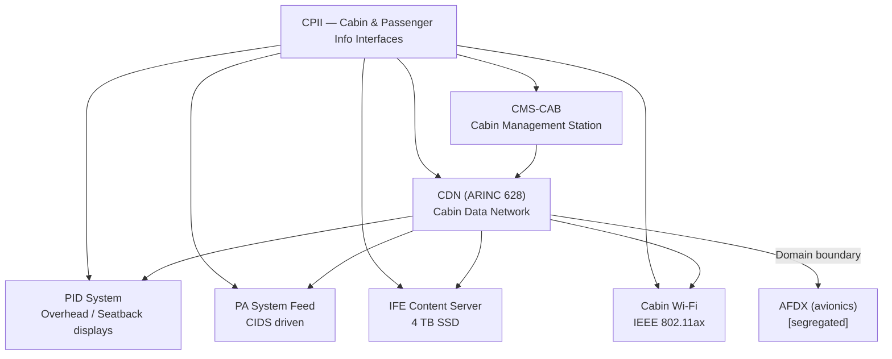
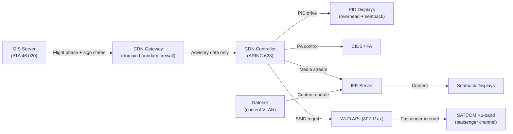
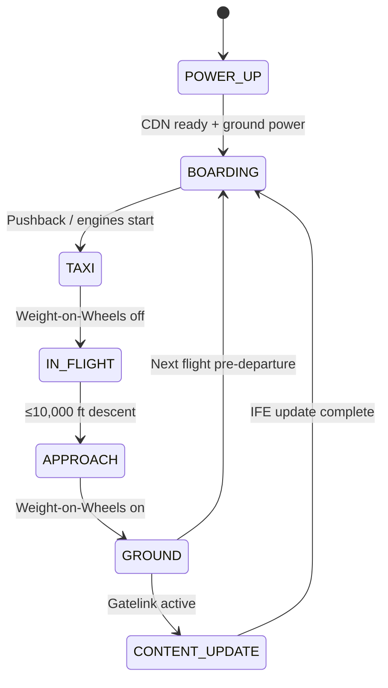

# ATLAS 040-049 · Section 04 · Subsection 046 · 060 — Cabin and Passenger Information Interfaces

## §0. Hyperlink Policy

All internal cross-references use relative Markdown links within the Q+ATLANTIDE CSDB repository. External regulatory citations in §19/§20 are marked  where hyperlinks are pending. Parent context: [ATLAS 046 README](./README.md). General overview: [046-000 Information Systems General](./046-000-Information-Systems-General.md).

---

## §1. Purpose

ATA 46.060 — Cabin and Passenger Information Interfaces (CPII) defines the systems and data interfaces that provide cabin crew and passengers with operational, safety, and entertainment information on the programme-defined aircraft type. This covers the Cabin Data Network (CDN) per ARINC 628, Passenger Information Display (PID) system, Passenger Address (PA) audio system feed, In-Flight Entertainment (IFE) content server, cabin Wi-Fi (securely segregated from AFDX avionics network), and the Cabin Management System (CMS-CAB) interface.

Key governance areas:
- **CDN (ARINC 628)**: The backbone for cabin electronic systems; segregated from avionics AFDX network by a certified domain boundary (firewall/datadiode).
- **PID system**: Seatback and overhead displays for flight status, safety instructions, and connectivity status.
- **PA feed**: Audio safety announcements driven by CMS-CAB; triggered by cockpit crew or automatic OOOI events.
- **IFE content server**: Onboard entertainment content (video, music, moving map) served to passenger seatback displays.
- **Cabin Wi-Fi**: IEEE 802.11ax access points (cabin); strictly segregated from avionics AFDX; passengers connect to a dedicated ISP backhaul (SATCOM Ku-band passenger channel, separate from avionics SATCOM).
- **CMS-CAB interface**: Cabin management station (CIDS) connects to ATA 46 information bus via ARINC 628 CDN; interacts with OIS server for flight status data.
- Primary Q-Division: Q-DATAGOV; Support: Q-AIR, Q-SPACE, Q-HPC.

---

## §2. Applicability

| Attribute | Value |
|-----------|-------|
| Aircraft Program | programme-defined aircraft type |
| ATA Chapter | ATA 46.060 — Cabin and Passenger Information Interfaces |
| Certification Basis | CS-25 Amendment 28; CS-25 Annex I (cabin safety) |
| Applicable Standards | ARINC 628 (CDN); IEEE 802.11ax; DO-160G; RTCA DO-160G; S1000D Issue 5.0 |
| Network Architecture | ARINC 628 CDN (cabin LAN); IEEE 802.11ax Wi-Fi (passenger); AFDX boundary via domain isolation |
| S1000D SNS | 046-060 |

---

## §3. Functional Description

The CPII subsystem manages all passenger-facing and cabin crew information systems. A critical design principle of the programme-defined aircraft type CPII architecture is **strict network segregation**: the cabin CDN and passenger Wi-Fi are completely isolated from the avionics AFDX network.

Functional components:
1. **CDN (ARINC 628)**: Cabin Data Network; 100/1000BASE-T Ethernet within the cabin; connects PID controllers, IFE server, CMS-CAB, Wi-Fi access points, and seat power management units.
2. **PID system**: Passenger Information Displays — overhead and seatback displays show fasten-seat-belt sign, no-smoking, flight status, altitude, ETA, moving map. Driven by CDN controller from flight phase data provided by OIS server via the CDN gateway.
3. **PA system feed**: Cabin Management Station (CIDS) drives PA announcements over CDN; pre-recorded and live announcements; safety card animations on PID display triggered synchronously.
4. **IFE content server**: 4 TB SSD media server on CDN; serves video, audio, and interactive content to seatback displays; content loaded at gate via Gatelink (content management network, segregated from avionics Gatelink VLAN).
5. **Cabin Wi-Fi**: IEEE 802.11ax APs in cabin ceiling; dual-band 2.4/5 GHz; SSID segregated from maintenance and avionics SSIDs; internet backhaul via dedicated SATCOM Ku-band passenger channel.

[PROGRAMME-VARIANT] specifics:
- No APU: cabin pre-conditioning powered from ground power or battery; CMS-CAB manages cabin power-up sequence.
- No hydraulic noise: [PROGRAMME-VARIANT] cabin is quieter; reduced PA masking; IFE audio quality benefits.
- Battery SoC in-flight progress indicator on PID moving map page ([PROGRAMME-VARIANT] passenger information feature): optional, airline-configurable.

### Diagram 1: CPII Functional Hierarchy

---

## §4. System Architecture

The CPII architecture is a two-domain design:
- **Avionics domain (AFDX)**: OIS server provides flight phase, seat-belt sign state, and ETA/altitude data to the CDN gateway via a certified one-way data path (firewall/datadiode).
- **Cabin domain (CDN, ARINC 628)**: Receives advisory flight data from the gateway; CDN controller distributes to PID, PA, IFE, and CMS-CAB.

Domain boundary:
- A certified network gateway with an application-layer firewall restricts data flow: only pre-approved advisory data (flight phase, sign states, ETA, altitude, moving map coordinates) passes from AFDX to CDN.
- Passenger Wi-Fi is further segregated from CDN by a second firewall layer; passengers have no path to CDN or AFDX.

### Diagram 2: CPII Data Flow

---

## §5. Components and Line-Replaceable Units

| LRU | Description | Qty | ATA Interface |
|-----|-------------|-----|---------------|
| CDN Controller | ARINC 628 managed switch + CDN protocol controller; domain boundary gateway to AFDX | 1 | ATA 46 |
| PID Overhead Display Unit | Overhead passenger information display (fasten belt, no smoking, flight status) | Per cabin zone (TBD) | ATA 46 |
| IFE Content Server | 4 TB SSD media server on CDN; video, audio, moving map data | 1 | ATA 46 |
| Cabin Wi-Fi Access Point | IEEE 802.11ax dual-band AP; ceiling-mounted in cabin zones | TBD (per cabin layout) | ATA 46 |
| CMS-CAB (CIDS) | Cabin Management Station; flight attendant panel for PA, sign control, IFE management | 1 | ATA 46 |
| CDN Gateway | Certified firewall/domain boundary device separating AFDX (avionics) from CDN (cabin) | 1 | ATA 46 |

---

## §6. Interfaces

| Interface | System | Protocol | Direction |
|-----------|--------|----------|-----------|
| OIS Server (ATA 46.020) | Operational Information System | AFDX → CDN Gateway (one-way) | Rx (flight phase, sign state, ETA) |
| CMS-CAB (CIDS) | Cabin attendant control panel | CDN (ARINC 628) | Bi-directional (sign control + PA) |
| PID Displays | Cabin overhead and seatback displays | CDN (ARINC 628) | Tx (display data) |
| IFE Seatback Displays | Passenger seatback units | CDN (1000BASE-T) | Tx (media stream) |
| Cabin Wi-Fi APs | IEEE 802.11ax | CDN (100BASE-T) + SATCOM Ku-band | Tx (passenger internet) |
| Gatelink (Content VLAN) | IFE content update at gate | IEEE 802.11ax / TLS 1.3 (content VLAN) | Rx (new IFE content) |

---

## §7. Operations and Modes

| Mode | Trigger | Description |
|------|---------|-------------|
| POWER-UP | Ground power on | CDN controller boot; PID test sequence; IFE server start; Wi-Fi disabled until boarding |
| BOARDING | Pre-departure | Wi-Fi enabled; IFE content active; PID showing welcome + safety video; seat belt sign on |
| TAXI | Engines start / taxi | Seat belt sign on; PA safety announcement; PID displays safety instructions |
| IN-FLIGHT | Weight-on-Wheels off | PID flight info mode (altitude, ETA, moving map); IFE content active; Wi-Fi active (SATCOM backhaul) |
| APPROACH | ≤ 10,000 ft descending | Seat belt sign on; electronic devices PA; PID shows landing prep |
| LANDING / TAXI-IN | Weight-on-Wheels on | IFE content pause; Wi-Fi transitions to Gatelink mode (content update begins) |
| GROUND — CONTENT UPDATE | OOOI In + Gatelink active | IFE content delta update; CDN controller managed |

### Diagram 3: CPII Lifecycle FSM

---

## §8. Performance and Budgets

| Parameter | Requirement | Status |
|-----------|-------------|--------|
| CDN backbone bandwidth | ≥ 1 Gbit/s (ARINC 628) |  |
| Wi-Fi per-passenger throughput (target) | ≥ 20 Mbit/s (dependent on SATCOM Ku backhaul) |  |
| PID sign state propagation latency | < 500 ms from cockpit command to all displays |  |
| IFE content server storage | ≥ 4 TB (≥ 200 h video at 4K) |  |
| IFE content update (gate, typical) | < 60 min for 50 GB delta |  |
| CDN gateway latency (AFDX to CDN) | < 200 ms |  |

---

## §9. Safety, Redundancy and Fault Tolerance

- **Domain isolation**: Certified firewall between AFDX and CDN ensures no passenger or cabin system can access avionics. This is a fundamental aviation cyber-safety requirement.
- **PID sign control priority**: Seat belt sign and no-smoking sign states are driven by the CDN controller from a separate hardwired relay circuit in addition to CDN; hardware relay is the authoritative state source.
- **Wi-Fi segregation**: Passenger Wi-Fi is on a separate IP subnet from CDN management traffic; a second firewall layer prevents cross-contamination.
- **IFE server redundancy**: IFE content server has RAID-1 internal storage; single SSD failure does not interrupt content.
- **PA announcement priority**: Emergency PA from cockpit crew takes highest priority on PA system; overrides any IFE audio.
- **No safety-critical path**: No data from CDN or passenger Wi-Fi reaches any flight-critical system; the CDN gateway is the only boundary and is one-way (AFDX to CDN only for flight data).

---

## §10. Maintenance and Diagnostics

| Task | Interval | Reference |
|------|----------|-----------|
| IFE content update (automatic gate) | Per flight cycle (gate, Gatelink) | AMM ATA 46-60-10 |
| CDN controller software version check | At A-check | AMM ATA 46-60-15 |
| Wi-Fi AP functional test (all zones) | Every 500 FH | AMM ATA 46-60-20 |
| PID display inspection (overhead and seatback) | At A-check | AMM ATA 46-60-25 |
| CDN gateway firewall rule audit | At C-check | AMM ATA 46-60-30 |
| IFE server RAID health check | Every 500 FH | AMM ATA 46-60-35 |

---

## §11. Configuration and Software

- **CDN controller firmware**: Managed switch firmware per ARINC 628; domain boundary gateway with certified firewall rules; configuration controlled.
- **CDN gateway rules**: Firewall rule set defines the exact data labels (PID sign states, ETA, altitude, moving map) allowed from AFDX to CDN; no reverse path allowed; rule changes require configuration control.
- **IFE content management**: Airline-specific content management system (CMS) manages content playlists, update packages, licensing; loaded to IFE server via Gatelink content VLAN.
- **Wi-Fi SSID management**: Distinct SSIDs for passenger Wi-Fi (public), cabin crew maintenance (restricted), and ground maintenance (restricted); VLANs strictly separated.
- **Battery SoC display ([PROGRAMME-VARIANT], airline-configurable)**: Optional PID feature displaying simplified battery SoC indicator for passenger information; driven from OIS server advisory feed via CDN gateway.

---

## §12. Environmental and Physical Constraints

| Constraint | Requirement | Standard |
|------------|-------------|----------|
| Operating temperature (CDN controller, IFE server) | −25 °C to +55 °C | DO-160G Category B2 |
| Vibration | Category S (cabin fuselage) | DO-160G Section 8 |
| Humidity | 95% RH non-condensing | DO-160G Section 6 |
| Altitude | 0–8,000 ft (pressurised cabin) | DO-160G Section 4 |
| Wi-Fi AP RF emissions | FCC Part 15 / CE RED 2014/53/EU | ICAO Annex 10 RF coordination |

---

## §13. Human Factors and Crew Interface

- **CMS-CAB (CIDS) panel**: Simple touch panel at forward and aft galley; cabin crew controls seat belt sign, no-smoking sign, PA, IFE modes, and individual zone control.
- **PID UX**: Overhead displays use simple symbol-based icons for safety signs; seatback displays use language-localised text per passenger PED language setting.
- **Emergency PA priority indicator**: CIDS displays "EMERGENCY PA — COCKPIT OVERRIDE" when cockpit crew activates emergency PA; cabin crew cannot override.
- **Wi-Fi captive portal**: Passenger Wi-Fi captive portal provides battery SoC indicator (airline-configurable) and flight status display before internet access.
- **[PROGRAMME-VARIANT] noise reduction benefit**: Cabin noise level lower than conventional aircraft (no engine fan noise at low speed); IFE default audio level profiles adjusted accordingly.

---

## §14. Test and Validation

| Test | Method | Pass Criteria |
|------|--------|---------------|
| Domain isolation penetration test | Attempt AFDX access from cabin Wi-Fi via CDN gateway; security tool | No avionics data accessible from CDN or passenger Wi-Fi |
| PID sign state latency | Trigger seat belt sign from cockpit; measure propagation to all PID zones | All PID updated < 500 ms |
| Wi-Fi throughput | Iperf3 test per zone (saturated AP); 10 concurrent users | ≥ 10 Mbit/s per user at 10 concurrent users |
| PA priority | Activate IFE audio; simultaneously activate cockpit emergency PA | Emergency PA takes priority; IFE audio muted within 1 s |
| IFE content server failover | Pull one SSD from RAID-1; verify content continues | Content delivery continues uninterrupted within 30 s |
| CDN gateway rule audit | Inject non-approved data label from AFDX toward CDN | CDN gateway rejects non-approved label; logs alert |

---

## §15. Regulatory Compliance

| Requirement | Regulation | Status |
|-------------|------------|--------|
| Airworthiness (cabin systems) | CS-25 Amendment 28 (cabin safety) |  |
| Cyber / network segregation | EASA AMC 20-42 (Airworthiness network security) |  |
| Wi-Fi RF emissions | FCC Part 15 / CE RED 2014/53/EU |  |
| Environmental qualification | DO-160G |  |
| Cabin data network | ARINC 628 |  |
| SATCOM passenger channel | ITU-R Appendix 30B (Ku-band) |  |

---

## §16. Glossary

| Term | Acronym | Definition |
|------|---------|------------|
| Cabin Data Network | CDN | The ARINC 628-compliant Ethernet backbone within the programme-defined aircraft type cabin connecting PID, IFE, CMS-CAB, and Wi-Fi APs; strictly segregated from avionics AFDX |
| Passenger Information Display | PID | Overhead and seatback displays in the programme-defined aircraft type cabin providing safety sign states, flight status, ETA, altitude, and moving map information to passengers |
| Cabin Intercommunication and Data System | CIDS | The cabin management system (cabin management station) that controls PA announcements, safety signs, IFE, and cabin zone management; interfaces with CDN and cockpit crew via hardwired relay |
| In-Flight Entertainment | IFE | The onboard media system providing audio, video, and interactive content to passenger seatback displays from the 4 TB IFE content server over the CDN |
| Passenger Address | PA | The cabin audio announcement system driven by the CIDS; cockpit crew emergency PA has highest priority and overrides cabin or IFE audio |
| Cabin Management Station | CMS-CAB | The forward and aft galley crew control panel for the CDN; allows cabin crew to control seat belt sign, no-smoking sign, PA, and IFE modes |
| Access Point | AP | IEEE 802.11ax dual-band wireless access point mounted in the programme-defined aircraft type cabin ceiling; provides passenger Wi-Fi internet connectivity via dedicated SATCOM Ku-band passenger channel |
| Cellular-in-the-Sky | SATCOM-PAX | Ku-band SATCOM channel dedicated to passenger internet backhaul; completely segregated from the avionics SATCOM (aeronautical mobile satellite service) channel |
| CDN Gateway | CDN-GW | The certified application-layer firewall and domain boundary device between the avionics AFDX network and the cabin CDN; enforces one-way advisory data flow only |
| Content Management System | CMS | The airline-operated ground system that manages IFE content playlists, licensing, and update packages; pushes updates to IFE server via Gatelink content VLAN at gate |

---

## §17. Footprint

### Physical Footprint

| LRU | Location | Bay | Rack Position |
|-----|----------|-----|---------------|
| CDN Controller | Aft avionics bay (cabin zone) | Cabin E/E | Rack, Slot 1 |
| CDN Gateway | Aft avionics bay (cabin zone) | Cabin E/E | Rack, Slot 2 |
| IFE Content Server | Aft avionics bay (cabin zone) | Cabin E/E | Rack, Slot 3 |
| CMS-CAB (CIDS) | Forward galley + aft galley | Cabin | Panel-integrated |
| Wi-Fi APs (multiple) | Cabin ceiling (per zone) | Cabin | Ceiling bracket |

### Electrical/Data Footprint

| LRU | Power Bus | Power (W) | Data Interface |
|-----|-----------|-----------|----------------|
| CDN Controller | 28 V DC Cabin Bus | 80 | ARINC 628 / Ethernet |
| CDN Gateway | 28 V DC Cabin Bus | 30 | AFDX boundary + ARINC 628 |
| IFE Content Server | 28 V DC Cabin Bus | 100 | ARINC 628 1GbE |
| Wi-Fi AP (each) | 28 V DC Cabin Bus | 20 | 100BASE-T CDN + 802.11ax |

### Maintenance Footprint

| Activity | Access Required | Duration |
|----------|----------------|----------|
| IFE content update (Gatelink) | Automatic at gate | 30–60 min |
| CDN gateway firewall rule update | Ground maintenance, CDN management port | 30 min (controlled) |
| Wi-Fi AP swap | Cabin access, no tools | 10 min |
| CMS-CAB / CIDS panel swap | Galley access | 15 min |

---

## §18. Open Issues

| Issue ID | Description | Owner | Status |
|----------|-------------|-------|--------|
| IS-046-060-001 | Cabin Wi-Fi per-passenger throughput dependent on SATCOM Ku-band backhaul contract — not yet specified | Q-SPACE |  |
| IS-046-060-002 | CDN gateway certification basis under EASA AMC 20-42 not yet defined | Q-DATAGOV |  |
| IS-046-060-003 | PID seatback display supplier not yet selected; quantity per cabin layout TBD | Q-AIR |  |
| IS-046-060-004 | Battery SoC passenger display (PID feature) — airline opt-in policy and safety review pending | Q-DATAGOV |  |

---

## §19. Citations

| Ref ID | Standard | Applicability | Status |
|--------|----------|---------------|--------|
| [S1] | ATA 46 — Information Systems | System chapter baseline |  |
| [S2] | CS-25 Amendment 28 | Airworthiness basis (cabin) |  |
| [S3] | EASA AMC 20-42 | Airworthiness network security |  |
| [S4] | DO-160G — Environmental Conditions | LRU qualification |  |
| [S5] | ARINC 429 — Digital Information Transfer System | Legacy interface |  |
| [S6] | ARINC 664 Part 7 — AFDX | Avionics domain boundary |  |
| [S7] | ARINC 628 — Cabin Data Network | CDN standard |  |
| [S8] | S1000D Issue 5.0 | Documentation standard |  |
| [S9] | IEEE 802.11ax (Wi-Fi 6) | Cabin Wi-Fi RF standard |  |

---

## §20. References

| Ref ID | Document | Version | Status |
|--------|----------|---------|--------|
| [R1] | ATLAS 046-000 — Information Systems General | 1.0.0 |  |
| [R2] | ATLAS 046-020 — Operational Data Systems | 1.0.0 |  |
| [R3] | ATLAS 046-030 — Airline Information and Communication Interfaces | 1.0.0 |  |
| [R4] | ATLAS 046-070 — Ground Data Transfer and Connectivity | 1.0.0 |  |
| [R5] | programme-defined aircraft type Cabin Layout Drawing | TBD |  |
| [R6] | programme-defined aircraft type CDN Network Architecture ICD | TBD |  |

---

## §21. Feedback and Review

This document is classified `to-be-reviewed-by-system-expert`. The review process requires:

1. **Cabin Systems Expert**: Validates CDN architecture, ARINC 628 implementation, IFE server specification, PA priority logic, and CMS-CAB interface.
2. **Cyber-Security Expert**: Reviews CDN gateway certification basis, firewall rule design, Wi-Fi segregation, and EASA AMC 20-42 compliance approach.
3. **EASA/FAA Regulatory Review**: CS-25 cabin systems items and network security certification basis (open issue IS-046-060-002) must be resolved before baseline freeze.

`review_status` must be updated to `reviewed` upon completion of the designated system expert review.

---

## §22. Change Log

| Version | Date | Author | Description |
|---------|------|--------|-------------|
| 1.0.0 | 2026-05-10 | Q-DATAGOV / Copilot | Initial baseline — all 22 sections populated for programme-defined aircraft type Cabin and Passenger Information Interfaces |
