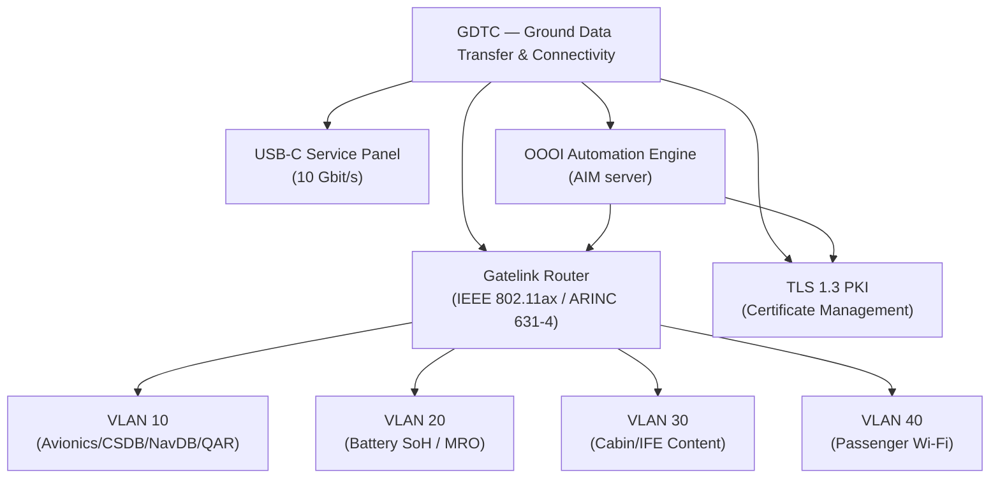
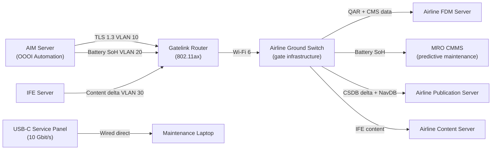
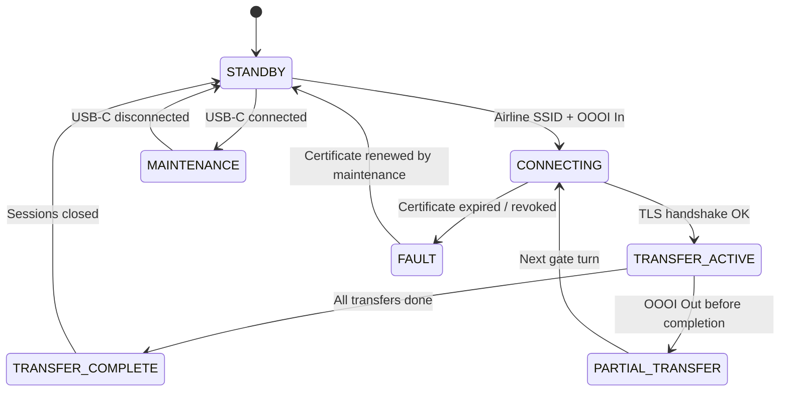

# ATLAS 040-049 · Section 04 · Subsection 046 · 070 — Ground Data Transfer and Connectivity

## §0. Hyperlink Policy

All internal cross-references use relative Markdown links within the Q+ATLANTIDE CSDB repository. External regulatory citations in §19/§20 are marked  where hyperlinks are pending. Parent context: [ATLAS 046 README](./README.md). General overview: [046-000 Information Systems General](./046-000-Information-Systems-General.md).

---

## §1. Purpose

ATA 46.070 — Ground Data Transfer and Connectivity (GDTC) defines the systems, interfaces, and security architecture that manage all data transfer between the programme-defined aircraft type and ground infrastructure during aircraft-on-ground phases. This covers the Gatelink Wi-Fi router (IEEE 802.11ax), USB-C service panel (10 Gbit/s), TLS 1.3 PKI infrastructure, automatic OOOI-triggered data transfers, and the battery SoH export to MRO systems.

Key governance areas:
- **Gatelink (ARINC 631-4)**: IEEE 802.11ax Wi-Fi router in fuselage nose and tail; connects aircraft to airline ground infrastructure during gate turns; multiple segregated VLANs.
- **USB-C service panel**: High-speed 10 Gbit/s USB-C ports in the avionics bay for direct data extraction by maintenance personnel (QAR data, CSDB, software updates).
- **TLS 1.3 PKI**: All Gatelink data transfers secured with TLS 1.3; PKI certificates managed by airline IT; certificate validity checked before any transfer.
- **OOOI-triggered automation**: On OOOI "In" event, automatic data push/pull sequence begins: QAR data push to airline FDM server, CSDB delta sync, IFE content delta, NavDB update check.
- **Battery SoH export**: After each flight, battery SoH telemetry automatically exported to airline MRO CMMS (Computerised Maintenance Management System) via Gatelink; enables predictive battery maintenance scheduling.
- Primary Q-Division: Q-DATAGOV; Support: Q-AIR, Q-SPACE, Q-HPC.

---

## §2. Applicability

| Attribute | Value |
|-----------|-------|
| Aircraft Program | programme-defined aircraft type |
| ATA Chapter | ATA 46.070 — Ground Data Transfer and Connectivity |
| Certification Basis | CS-25 Amendment 28; EASA AMC 20-42 (network security) |
| Applicable Standards | ARINC 631-4 (Gatelink); IEEE 802.11ax; DO-160G; TLS 1.3 (RFC 8446); S1000D Issue 5.0 |
| Network Architecture | IEEE 802.11ax Gatelink; USB-C 10 Gbit/s; multi-VLAN (avionics / CSDB / cabin content / battery MRO) |
| S1000D SNS | 046-070 |

---

## §3. Functional Description

The GDTC subsystem manages bidirectional data transfers between the programme-defined aircraft type and the airline ground infrastructure when the aircraft is on ground. All transfers are secured with TLS 1.3 using PKI certificates; transfers are VLAN-segregated by data type and system.

VLAN architecture:
- **VLAN 10 — Avionics/Maintenance**: CSDB delta sync; CMS fault data; software updates; NavDB; IETP publications; QAR data push.
- **VLAN 20 — Battery/MRO**: Battery SoH export; predictive maintenance data; AIDMS telemetry to MRO CMMS.
- **VLAN 30 — Cabin/IFE Content**: IFE media delta update; Jeppesen charts; airline operational data.
- **VLAN 40 — Passenger Wi-Fi**: Cabin passenger internet (separated completely from all other VLANs).

OOOI automation sequence:
1. OOOI "In" event detected by ACMS/OIS.
2. Gatelink establishes connection to airline ground router.
3. PKI TLS 1.3 handshake on each VLAN.
4. Parallel transfer initiation: QAR data → airline FDM server; battery SoH → MRO CMMS; CSDB delta; IFE content delta.
5. OOOI "Out" event terminates all active transfers (with partial transfer resume support).

### Diagram 1: GDTC Functional Hierarchy

---

## §4. System Architecture

The Gatelink router is the primary ground connectivity interface. It consists of two IEEE 802.11ax radios (nose and tail fuselage) providing 6 GHz and 5 GHz dual-band connectivity to airline ground infrastructure antennas at the gate. The router manages VLAN segregation and TLS 1.3 session establishment.

The USB-C service panel provides an alternative wired high-speed interface when Gatelink is not available or for specific maintenance-only data transfers (e.g., full QAR data extraction, software image load).

PKI architecture:
- Aircraft PKI certificate issued by airline PKI CA; renewed annually.
- Each Gatelink session presents aircraft certificate; ground server presents ground certificate; mutual TLS 1.3.
- Certificate revocation via OCSP; revoked certificate prevents session establishment.

### Diagram 2: GDTC Data Flow

---

## §5. Components and Line-Replaceable Units

| LRU | Description | Qty | ATA Interface |
|-----|-------------|-----|---------------|
| Gatelink Router (nose) | IEEE 802.11ax (Wi-Fi 6) 6/5 GHz dual-band radio; VLAN-capable managed switch; nose fuselage | 1 | ATA 46 |
| Gatelink Router (tail) | Identical to nose unit; tail fuselage for redundancy and coverage | 1 | ATA 46 |
| USB-C Service Panel | 2× USB-C 10 Gbit/s ports in avionics bay access panel; maintenance interface | 1 | ATA 46 |
| OOOI Automation Module | Software module on AIM server; manages OOOI-triggered transfer sequence | 1 (SW) | ATA 46 |
| PKI Certificate Manager | Software module on AIM server; manages TLS 1.3 certificates, OCSP checks | 1 (SW) | ATA 46 |

---

## §6. Interfaces

| Interface | System | Protocol | Direction |
|-----------|--------|----------|-----------|
| AIM Server | Aircraft Information Management — OOOI automation | Internal (AIM bus) | Tx/Rx |
| QAR data (ATA 46.010) | Quick Access Recorder data push | VLAN 10 / TLS 1.3 | Tx (QAR → FDM server) |
| AIDMS / Battery SoH (ATA 46.010) | Battery SoH telemetry export to MRO | VLAN 20 / TLS 1.3 | Tx (battery data → MRO CMMS) |
| CSDB Synchroniser (ATA 46.040) | CSDB delta sync | VLAN 10 / TLS 1.3 | Rx (updated DMs) |
| IFE Content Server (ATA 46.060) | IFE media delta update | VLAN 30 / TLS 1.3 | Rx (new content) |
| CMU / ACARS (ATA 46.030) | OOOI "In" trigger | AFDX internal | Rx (OOOI event) |
| Maintenance laptop | Direct wired maintenance access | USB-C 10 Gbit/s | Tx/Rx |

---

## §7. Operations and Modes

| Mode | Trigger | Description |
|------|---------|-------------|
| STANDBY | Aircraft powered (no Gatelink) | Gatelink radio on; scanning for airline ground SSID; no transfer |
| CONNECTING | Airline ground SSID detected | TLS 1.3 PKI handshake on all VLANs |
| TRANSFER-ACTIVE | TLS sessions established | OOOI-triggered parallel transfers on VLANs 10/20/30 |
| TRANSFER-COMPLETE | All transfers done or OOOI Out | Sessions closed; transfer manifest logged to AIM NAS |
| PARTIAL-TRANSFER | OOOI Out before completion | Transfer interrupted; resume from last checkpoint on next gate turn |
| MAINTENANCE | USB-C panel active | Wired direct access; Gatelink transfers suspended |
| FAULT | PKI failure or certificate expired | All Gatelink transfers blocked; maintenance alert on MAT |

### Diagram 3: GDTC Lifecycle FSM

---

## §8. Performance and Budgets

| Parameter | Requirement | Status |
|-----------|-------------|--------|
| Gatelink maximum transfer rate (IEEE 802.11ax) | ≥ 1.2 Gbit/s (theoretical); ≥ 200 Mbit/s sustained at gate |  |
| USB-C service panel transfer rate | 10 Gbit/s (USB 3.2 Gen 2×2) |  |
| QAR data push duration (typical 2 h flight) | < 5 min |  |
| Battery SoH export duration | < 2 min |  |
| CSDB delta sync duration (typical A-check cycle, ~500 MB) | < 30 min |  |
| TLS 1.3 handshake time (all VLANs) | < 2 s |  |

---

## §9. Safety, Redundancy and Fault Tolerance

- **Dual Gatelink radios** (nose + tail): independent coverage zones; if nose radio fails, tail radio continues all VLAN transfers.
- **TLS 1.3 mutual authentication**: Aircraft and ground server both authenticate; prevents rogue ground station injection.
- **Certificate expiry blocking**: Expired or revoked PKI certificate blocks all Gatelink data transfer; no plaintext or self-signed fallback; maintenance alert raised.
- **VLAN isolation**: Each data stream is on a separate VLAN; a compromise of the IFE content VLAN (VLAN 30) cannot reach the avionics VLAN (VLAN 10).
- **OOOI Out transfer suspend**: Any active transfer is suspended on OOOI Out (departure); data already transferred is committed; partial transfers resume on next connection.
- **USB-C physical security**: USB-C service panel requires avionics bay access (maintenance access only); port locked by software when aircraft is in flight.

---

## §10. Maintenance and Diagnostics

| Task | Interval | Reference |
|------|----------|-----------|
| Gatelink transfer log review | At A-check | AMM ATA 46-70-10 |
| PKI certificate validity check | Monthly (automated alert 30 days before expiry) | AMM ATA 46-70-15 |
| Gatelink radio RF output and VSWR check | Every 500 FH | AMM ATA 46-70-20 |
| USB-C port functional test | At A-check | AMM ATA 46-70-25 |
| Battery SoH export completeness audit | At A-check (verify MRO CMMS received all flights) | AMM ATA 46-70-30 |
| VLAN configuration audit | At C-check | AMM ATA 46-70-35 |

---

## §11. Configuration and Software

- **Gatelink router firmware**: Managed switch firmware supporting IEEE 802.11ax and VLAN 802.1Q; ARINC 631-4 management layer.
- **OOOI Automation Module**: AIM server software partition; subscribes to ACMS OOOI events via AFDX; triggers transfer sequences on OOOI In; suspends on OOOI Out.
- **PKI Certificate Manager**: Manages aircraft certificate store; implements OCSP client; renews certificates via secure channel to airline PKI CA.
- **Transfer manifest**: SHA-256-signed XML manifest of all transfer sessions stored in AIM NAS; auditable record of all ground data transfers per flight.
- **Battery SoH export format**: JSON-encoded AIDMS battery telemetry (cell voltages, temperatures, SoH %, cycle count) exported per battery module per flight; MRO CMMS import schema TBD.
- **Software updates**: All Gatelink router firmware updates delivered via Gatelink VLAN 10 (TLS 1.3); integrity SHA-256.

---

## §12. Environmental and Physical Constraints

| Constraint | Requirement | Standard |
|------------|-------------|----------|
| Operating temperature (Gatelink router) | −55 °C to +70 °C | DO-160G Category A2 |
| Vibration | Category S | DO-160G Section 8 |
| Humidity | 95% RH non-condensing | DO-160G Section 6 |
| Altitude | 0–55,000 ft (unpressurised nose / tail) | DO-160G Section 4 |
| EMI/EMC | Category M | DO-160G Section 21 |
| RF antenna performance | IEEE 802.11ax 6 GHz / 5 GHz; external antenna — antenna pattern TBD | FCC Part 15 / CE RED |

---

## §13. Human Factors and Crew Interface

- **Gatelink status on MAT**: Maintenance Access Terminal shows Gatelink connection status (connected/disconnected/transfer in progress) and transfer progress per VLAN.
- **Battery SoH export confirmation**: MAT displays "Battery SoH exported to MRO" with transfer timestamp after each successful export; maintenance technician can verify.
- **PKI expiry alert**: Amber alert on MAT displayed 30 days before certificate expiry; red alert at 7 days; transfer blocked at expiry.
- **USB-C panel label**: Physical label on service panel clearly identifies USB-C ports as "MAINTENANCE ONLY — DO NOT USE IN FLIGHT".
- **Transfer manifest viewer**: MAT provides a table view of the last 30 transfer sessions (date, VLAN, size, status).

---

## §14. Test and Validation

| Test | Method | Pass Criteria |
|------|--------|---------------|
| Gatelink OOOI automation | Simulate OOOI In; verify parallel VLAN transfers begin automatically | All 4 VLANs active within 10 s of OOOI In |
| TLS 1.3 mutual authentication | Attempt connection with self-signed certificate; verify rejection | Connection rejected; alert logged |
| VLAN isolation | Inject data on VLAN 30 (IFE); attempt access from VLAN 10 (avionics) | Cross-VLAN access blocked |
| Battery SoH export integrity | Export battery SoH; verify MRO CMMS received complete + SHA-256-validated | Data received and SHA-256 valid |
| Gatelink radio failover (nose) | Disable nose radio; verify tail radio continues all transfers | All VLANs continue on tail radio within 30 s |
| USB-C in-flight lock | Verify USB-C port is software-locked when WoW = air | USB-C port refuses connection when airborne |

---

## §15. Regulatory Compliance

| Requirement | Regulation | Status |
|-------------|------------|--------|
| Airworthiness | CS-25 Amendment 28 |  |
| Network security | EASA AMC 20-42 |  |
| Environmental qualification | DO-160G |  |
| Ground link standard | ARINC 631-4 |  |
| RF emissions | FCC Part 15 / CE RED 2014/53/EU |  |
| TLS version requirement | RFC 8446 (TLS 1.3) |  |

---

## §16. Glossary

| Term | Acronym | Definition |
|------|---------|------------|
| Gatelink | GL | The ARINC 631-4 wireless ground data link system on the programme-defined aircraft type using IEEE 802.11ax (Wi-Fi 6) radios in the fuselage nose and tail for high-speed bi-directional data transfer during gate turns |
| Transport Layer Security 1.3 | TLS 1.3 | The IETF RFC 8446 cryptographic protocol securing all Gatelink and USB-C data transfers with mutual certificate-based authentication and AES-256-GCM encryption |
| Public Key Infrastructure | PKI | The airline-operated certificate authority (CA) issuing and managing TLS 1.3 X.509 certificates for the programme-defined aircraft type and airline ground servers |
| Online Certificate Status Protocol | OCSP | The protocol used by the programme-defined aircraft type PKI Certificate Manager to check real-time certificate revocation status against the airline PKI CA before each Gatelink session |
| Virtual Local Area Network | VLAN | An IEEE 802.1Q-tagged logical network segment within the Gatelink infrastructure, used to segregate data streams by type (avionics, battery/MRO, cabin/IFE, passenger Wi-Fi) |
| Quick Access Recorder | QAR | The flight data recorder (ATA 46.010) providing 512 parameters at up to 8 Hz for FDM analysis; QAR data automatically pushed to airline FDM server via Gatelink VLAN 10 after each flight |
| Computerised Maintenance Management System | CMMS | The airline MRO IT system that receives battery SoH telemetry exported via Gatelink VLAN 20; uses the data to schedule predictive battery maintenance |
| Out-Off-On-In | OOOI | The four gate events (pushback, wheels-up, wheels-down, gate arrival) that trigger OOOI Automation Engine sequences, including Gatelink transfer initiation on OOOI In |
| Universal Serial Bus Type-C | USB-C | The 10 Gbit/s (USB 3.2 Gen 2×2) wired interface on the programme-defined aircraft type avionics bay service panel; maintenance-only; software-locked in flight |
| State of Health | SoH | The long-term battery capacity degradation metric (0–100%) exported per battery module per flight to the MRO CMMS for predictive maintenance scheduling |

---

## §17. Footprint

### Physical Footprint

| LRU | Location | Bay | Rack Position |
|-----|----------|-----|---------------|
| Gatelink Router (nose) | Forward fuselage nose bay | Nose bay | Bracket-mounted |
| Gatelink Router (tail) | Aft fuselage tail bay | Tail bay | Bracket-mounted |
| USB-C Service Panel | Avionics bay access panel (starboard) | E/E Bay | Panel-integrated |
| OOOI Automation Module (SW) | AIM Server | E/E Bay | Software partition |
| PKI Certificate Manager (SW) | AIM Server | E/E Bay | Software partition |

### Electrical/Data Footprint

| LRU | Power Bus | Power (W) | Data Interface |
|-----|-----------|-----------|----------------|
| Gatelink Router (nose) | 28 V DC Bus 1 | 40 | AFDX + 802.11ax |
| Gatelink Router (tail) | 28 V DC Bus 2 | 40 | AFDX + 802.11ax |
| USB-C Service Panel | 28 V DC Maint Bus | 10 (idle) / 100 (active transfer) | USB-C 10 Gbit/s |

### Maintenance Footprint

| Activity | Access Required | Duration |
|----------|----------------|----------|
| Gatelink router LRU swap (nose or tail) | Nose / tail bay access | 30 min |
| PKI certificate renewal | MAT or ground laptop | 10 min (automated) |
| USB-C data extraction (QAR full dump) | Avionics bay access | 15 min (at 10 Gbit/s for ~50 GB) |
| VLAN configuration change | Controlled maintenance procedure (ground) | 30 min |

---

## §18. Open Issues

| Issue ID | Description | Owner | Status |
|----------|-------------|-------|--------|
| IS-046-070-001 | Battery SoH export JSON schema to MRO CMMS not yet defined with airline MRO partner | Q-DATAGOV |  |
| IS-046-070-002 | IEEE 802.11ax 6 GHz band regulatory approval at international airports not confirmed | Q-SPACE |  |
| IS-046-070-003 | EASA AMC 20-42 network security assessment for multi-VLAN Gatelink architecture not yet conducted | Q-DATAGOV |  |
| IS-046-070-004 | CSDB delta sync target < 30 min not validated on representative Wi-Fi 6 gate infrastructure | Q-HPC |  |

---

## §19. Citations

| Ref ID | Standard | Applicability | Status |
|--------|----------|---------------|--------|
| [S1] | ATA 46 — Information Systems | System chapter baseline |  |
| [S2] | CS-25 Amendment 28 | Airworthiness basis |  |
| [S3] | EASA AMC 20-42 — Airworthiness Network Security | Cyber security |  |
| [S4] | DO-160G — Environmental Conditions | LRU qualification |  |
| [S5] | ARINC 429 — Digital Information Transfer System | Legacy interface |  |
| [S6] | ARINC 664 Part 7 — AFDX | Backbone |  |
| [S7] | ARINC 631-4 — Gatelink | Ground link standard |  |
| [S8] | S1000D Issue 5.0 | CSDB sync standard |  |
| [S9] | RFC 8446 — TLS 1.3 | Ground link security |  |

---

## §20. References

| Ref ID | Document | Version | Status |
|--------|----------|---------|--------|
| [R1] | ATLAS 046-000 — Information Systems General | 1.0.0 |  |
| [R2] | ATLAS 046-010 — Aircraft Information Management | 1.0.0 |  |
| [R3] | ATLAS 046-040 — Electronic Documentation and IETP Interfaces | 1.0.0 |  |
| [R4] | ATLAS 046-060 — Cabin and Passenger Information Interfaces | 1.0.0 |  |
| [R5] | programme-defined aircraft type Network Security ICD | TBD |  |
| [R6] | programme-defined aircraft type PKI Infrastructure Design | TBD |  |

---

## §21. Feedback and Review

This document is classified `to-be-reviewed-by-system-expert`. The review process requires:

1. **Ground Connectivity / Network Security Expert**: Validates Gatelink architecture, VLAN design, TLS 1.3 PKI, EASA AMC 20-42 compliance approach, and OOOI automation logic.
2. **Battery / MRO Systems Expert**: Reviews battery SoH export format, CMMS integration approach, and predictive maintenance data schema.
3. **EASA/FAA Regulatory Review**: CS-25 and AMC 20-42 items in §15, IEEE 802.11ax 6 GHz regulatory approval (open issue IS-046-070-002), and VLAN security assessment must be resolved before baseline freeze.

`review_status` must be updated to `reviewed` upon completion of the designated system expert review.

---

## §22. Change Log

| Version | Date | Author | Description |
|---------|------|--------|-------------|
| 1.0.0 | 2026-05-10 | Q-DATAGOV / Copilot | Initial baseline — all 22 sections populated for programme-defined aircraft type Ground Data Transfer and Connectivity |
