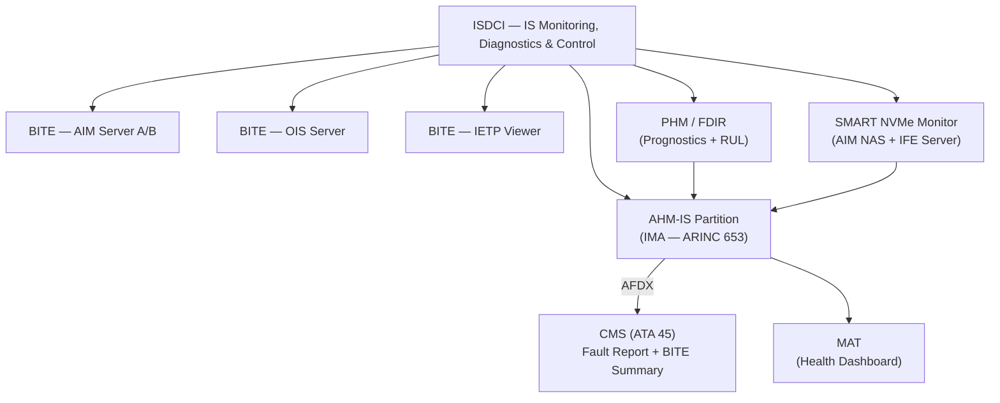
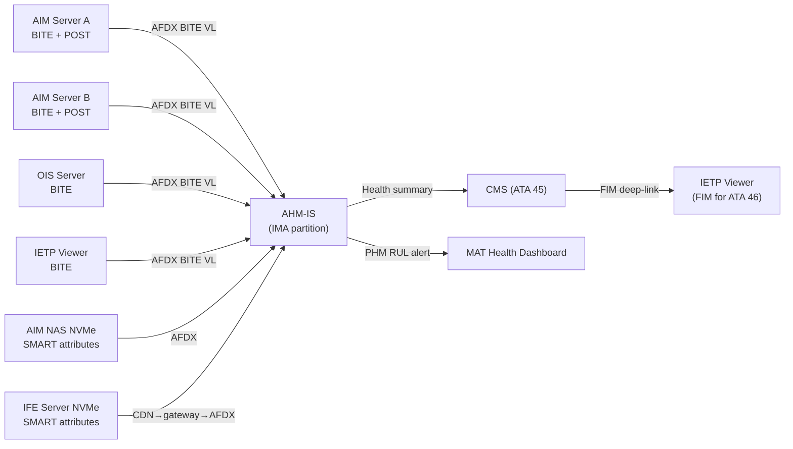
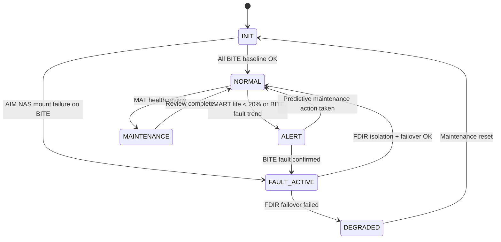

# ATLAS 040-049 · Section 04 · Subsection 046 · 080 — Information Systems Monitoring, Diagnostics and Control Interfaces

## §0. Hyperlink Policy

All internal cross-references use relative Markdown links within the Q+ATLANTIDE CSDB repository. External regulatory citations in §19/§20 are marked  where hyperlinks are pending. Parent context: [ATLAS 046 README](./README.md). General overview: [046-000 Information Systems General](./046-000-Information-Systems-General.md).

> **Governance note**: This subsubject is classified as `programme-controlled-diagnostics-extension`. Health monitoring and prognostics functions documented here are advisory-only and are not credited for aircraft type certification.

---

## §1. Purpose

ATA 46.080 — Information Systems Monitoring, Diagnostics and Control Interfaces (ISDCI) defines the health monitoring, BITE, prognostics, and fault detection architecture for all ATA 46 information systems on the programme-defined aircraft type. This covers the Aircraft Health Monitoring — Information Systems (AHM-IS) partition on the IMA, Built-In Test Equipment (BITE) for AIM, OIS, and IETP, SMART NVMe health monitoring for all AIM NAS storage devices, and the PHM/FDIR (Prognostics and Health Management / Fault Detection, Isolation and Recovery) framework.

Key governance areas:
- **AHM-IS**: A dedicated ARINC 653 software partition on the IMA (Integrated Modular Avionics) that collects health status from all ATA 46 subsystems and correlates faults; provides the information system health summary to CMS (ATA 45).
- **BITE (AIM, OIS, IETP)**: Each ATA 46 server LRU implements a BITE function; BITE results reported to CMS (ATA 45) via AFDX.
- **SMART NVMe health**: All NVMe storage devices in AIM NAS and IFE server implement SMART (Self-Monitoring, Analysis and Reporting Technology); AHM-IS polls SMART attributes and raises predictive alerts.
- **PHM/FDIR**: Prognostics model for ATA 46 LRU remaining useful life (RUL) based on SMART NVMe wear, fan bearing vibration, and BITE fault rate trend.
- This subsubject is advisory-only and is not credited for aircraft type certification.
- Primary Q-Division: Q-DATAGOV; Support: Q-AIR, Q-SPACE, Q-HPC.

---

## §2. Applicability

| Attribute | Value |
|-----------|-------|
| Aircraft Program | programme-defined aircraft type |
| ATA Chapter | ATA 46.080 — Information Systems Monitoring, Diagnostics and Control Interfaces |
| Certification Basis | CS-25 Amendment 28 (advisory only); DO-178C DAL D (AHM-IS) |
| Applicable Standards | ARINC 653 (IMA partition); ARINC 664 P7; DO-160G; ARINC 429; S1000D Issue 5.0 |
| Network Architecture | AFDX (ARINC 664 P7); IMA AHM-IS partition; CMS interface (ATA 45) |
| S1000D SNS | 046-080 |

---

## §3. Functional Description

The ISDCI subsystem provides real-time and predictive health monitoring for all ATA 46 information system LRUs. It is a programme-controlled extension: outputs are advisory-only and do not command any safety-critical aircraft system.

Functional components:
1. **AHM-IS partition**: Runs on IMA; subscribes to BITE reports from AIM server A/B, OIS server, IETP viewer, CDN controller, and Gatelink routers via AFDX; correlates faults; maintains health summary table.
2. **BITE (AIM)**: AIM server A and B each implement BITE: power-on self-test (POST), cyclic BITE, and on-demand BITE; BITE result codes reported to AHM-IS.
3. **BITE (OIS)**: OIS server BITE monitors CPU utilisation, memory, AFDX VL error counters, and application watchdog; BITE codes to AHM-IS.
4. **BITE (IETP viewer)**: IETP viewer BITE monitors CSDB mount, rendering engine health, BREX validator, and ICN manager; BITE codes to AHM-IS.
5. **SMART NVMe monitoring**: AHM-IS polls NVMe SMART attributes (wear levelling count, reallocated sectors, temperature, remaining life %) every 15 min; predictive alert if remaining life < 20%.
6. **PHM/FDIR**: Trend model for ATA 46 LRU remaining useful life (RUL); FDIR logic isolates failed LRU partition and requests hot-standby promotion (AIM A→B).

### Diagram 1: ISDCI Functional Hierarchy

---

## §4. System Architecture

AHM-IS runs as a separate ARINC 653 time-space partition on the IMA, isolated from all other IMA partitions. It has read-only access to BITE data from ATA 46 LRUs via AFDX Virtual Links; it cannot command any flight-critical system.

BITE reporting chain:
- Each ATA 46 LRU generates BITE reports in a standardised ARINC 604-format message.
- AHM-IS receives BITE reports via AFDX Virtual Links (dedicated BITE VLAN).
- AHM-IS correlates fault codes: if both AIM-A BITE and AIM NAS SMART alert within the same maintenance window, AHM-IS classifies a combined "AIM Server A – predicted failure" event.
- Health summary is forwarded to CMS (ATA 45) via AFDX; CMS presents it on MAT under ATA 46 chapter.

### Diagram 2: ISDCI Data Flow

---

## §5. Components and Line-Replaceable Units

| LRU | Description | Qty | ATA Interface |
|-----|-------------|-----|---------------|
| AHM-IS Partition | ARINC 653 software partition on IMA; advisory health monitoring for all ATA 46 LRUs | 1 (SW) | ATA 46 / ATA 42 (IMA) |
| BITE Module (AIM Server A/B) | POST + cyclic BITE function on each AIM server; reports to AHM-IS | 2 (SW on AIM) | ATA 46 |
| BITE Module (OIS Server) | Cyclic BITE; CPU, memory, AFDX VL error monitoring | 1 (SW on OIS) | ATA 46 |
| BITE Module (IETP Viewer) | CSDB mount, rendering engine, BREX validator, ICN manager health | 1 (SW on AIM) | ATA 46 |
| SMART NVMe Monitor | Software agent polling NVMe SMART attributes on AIM NAS and IFE server; escalates to AHM-IS | 2 (SW) | ATA 46 |
| PHM/FDIR Module | Software module on AHM-IS; trend analysis and RUL model for ATA 46 LRUs | 1 (SW) | ATA 46 |

---

## §6. Interfaces

| Interface | System | Protocol | Direction |
|-----------|--------|----------|-----------|
| AIM Server A/B | Aircraft Information Management — BITE reports | AFDX BITE VL | Rx (BITE codes) |
| OIS Server | Operational Information System — BITE | AFDX BITE VL | Rx (BITE codes) |
| IETP Viewer | Electronic Documentation — BITE | AFDX BITE VL | Rx (BITE codes) |
| IMA Platform (ATA 42) | AHM-IS partition hosting | ARINC 653 partition interface | Internal |
| CMS (ATA 45) | Central Maintenance System — health summary consumer | AFDX | Tx (ATA 46 health summary) |
| MAT (ATA 45) | Maintenance Access Terminal — health dashboard display | HTTPS over Ethernet | Tx (dashboard pages) |
| AIM NAS / IFE Server NVMe | SMART attribute polling | Internal AHM-IS agent | Rx (SMART data) |

---

## §7. Operations and Modes

| Mode | Trigger | Description |
|------|---------|-------------|
| INIT | IMA power-on | AHM-IS partition start; BITE baseline collection from all ATA 46 LRUs |
| NORMAL | All BITE OK | Continuous cyclic BITE and SMART polling; health summary to CMS |
| ALERT | Predictive fault (SMART < 20% life or BITE fault trend) | PHM RUL alert on MAT; no impact on flight operations |
| FAULT-ACTIVE | BITE fault confirmed | AHM-IS classifies fault; reports to CMS; FDIR attempts LRU isolation / failover promotion |
| DEGRADED | AHM-IS partition unavailable | CMS shows "ATA 46 health monitoring degraded"; no impact on flight systems |
| MAINTENANCE | MAT health dashboard active | Maintenance technician reviews AHM-IS fault history and SMART trends |

### Diagram 3: ISDCI FSM

---

## §8. Performance and Budgets

| Parameter | Requirement | Status |
|-----------|-------------|--------|
| BITE cyclic scan period | ≤ 60 s (all ATA 46 LRUs) |  |
| SMART NVMe polling period | ≤ 15 min |  |
| AHM-IS to CMS fault report latency | < 5 s after BITE fault detected |  |
| FDIR failover time (AIM A → B) | < 30 s |  |
| PHM RUL prediction horizon | ≥ 30 flight cycles (predictive alert) |  |
| AHM-IS partition IMA CPU budget | < 5% of IMA module allocated budget |  |

---

## §9. Safety, Redundancy and Fault Tolerance

- **Advisory-only**: AHM-IS outputs are advisory; they do not command any flight-critical system. FDIR failover of AIM server is non-safety-critical (AIM is not DO-178C DAL A).
- **AHM-IS ARINC 653 isolation**: AHM-IS partition is time-space isolated from safety-critical IMA partitions; a failure or compromise of AHM-IS cannot affect flight-critical functions.
- **Dual AIM server**: If FDIR determines AIM-A has failed, AHM-IS recommends AIM-B promotion (hot-standby); AIM-B takes over all AIM functions automatically.
- **BITE independence**: Each LRU BITE module is independent; a single BITE failure does not mask other LRU faults.
- **SMART predictive maintenance**: SMART NVMe alerts are predictive (≥ 30 flight cycles horizon); no in-flight NVMe failure required; drives proactive scheduled maintenance.
- **PHM model degradation**: If PHM RUL model data is insufficient (< 10 flight cycles since installation), AHM-IS reports "model calibrating" status rather than a false predictive alert.

---

## §10. Maintenance and Diagnostics

| Task | Interval | Reference |
|------|----------|-----------|
| AHM-IS health dashboard review on MAT | At A-check | AMM ATA 46-80-10 |
| SMART NVMe remaining life check | At A-check | AMM ATA 46-80-15 |
| BITE on-demand test (AIM, OIS, IETP) | At A-check | AMM ATA 46-80-20 |
| AHM-IS fault history export (Gatelink to MRO CMMS) | At A-check | AMM ATA 46-80-25 |
| PHM RUL trend report review | At C-check | AMM ATA 46-80-30 |
| AHM-IS partition software version check | At A-check | AMM ATA 46-80-35 |

---

## §11. Configuration and Software

- **AHM-IS partition**: ARINC 653 partition on IMA; DO-178C DAL D (advisory health monitoring); PSAC required.
- **BITE standards**: BITE function on each ATA 46 LRU follows ARINC 604 BITE format; standardised fault code schema.
- **SMART polling agent**: Software agent on AIM and IFE servers; polls NVMe SMART via NVMe-CLI interface; escalates to AHM-IS via AFDX.
- **PHM model parameters**: Coefficients for RUL model (NVMe wear, fan bearing vibration, BITE fault rate) loaded from programme-defined aircraft type PHM configuration file; version-controlled.
- **Health summary format**: AHM-IS health summary to CMS uses ARINC 604 fault code blocks; one block per ATA 46 subsystem (046-010 through 046-070).
- **FDIR rules**: FDIR decision table (AIM-A fail → promote AIM-B; OIS fail → restart OIS partition) version-controlled in AHM-IS configuration.

---

## §12. Environmental and Physical Constraints

| Constraint | Requirement | Standard |
|------------|-------------|----------|
| AHM-IS partition (IMA — in E/E bay) | −40 °C to +70 °C | DO-160G Category B2 |
| Vibration | Category S | DO-160G Section 8 |
| Humidity | 95% RH non-condensing | DO-160G Section 6 |
| Altitude | 0–8,000 ft (pressurised E/E bay) | DO-160G Section 4 |
| EMI/EMC | Category M | DO-160G Section 21 |

---

## §13. Human Factors and Crew Interface

- **MAT health dashboard**: AHM-IS provides a structured health dashboard page in the MAT (ATA 45) under ATA 46; shows green/amber/red status per subsystem (046-010 through 046-070).
- **Predictive alert clarity**: SMART and PHM alerts include estimated remaining useful life in flight cycles and a plain-text maintenance action recommendation.
- **BITE on-demand button**: MAT BITE test page allows maintenance technician to trigger on-demand BITE for any ATA 46 LRU with a single tap.
- **Advisory-only badge**: All AHM-IS pages on MAT display an "ADVISORY — NOT AIRWORTHINESS CREDIT" banner to prevent misinterpretation as certified BITE.
- **FDIR action log**: MAT displays the last 10 FDIR actions (including AIM-A → AIM-B failover events) with timestamp and fault code.

---

## §14. Test and Validation

| Test | Method | Pass Criteria |
|------|--------|---------------|
| BITE cyclic scan coverage | Inject known BITE fault in AIM-A; verify AHM-IS detection | AHM-IS reports fault within 60 s |
| SMART alert threshold | Set NVMe SMART remaining life to 19% in test environment; verify AHM-IS alert | Predictive alert on MAT within 15 min polling cycle |
| FDIR AIM A → B failover | Simulate AIM-A fatal fault; verify FDIR promotes AIM-B | AIM-B active within 30 s; AIM-B begins serving all AIM functions |
| AHM-IS partition isolation | Crash AHM-IS partition; verify no impact on CMS or flight systems | CMS continues; AHM-IS "degraded" advisory only |
| PHM RUL model calibration | Load 5 flight cycles of BITE/SMART data; verify RUL model output range | RUL estimate within ±20% of reference model; "calibrating" flag cleared after 10 cycles |
| Fault report to CMS latency | Inject BITE fault; measure time to CMS fault report appearance on MAT | Fault report on MAT within 5 s |

---

## §15. Regulatory Compliance

| Requirement | Regulation | Status |
|-------------|------------|--------|
| Airworthiness (advisory function) | CS-25 Amendment 28 |  |
| Software assurance | DO-178C DAL D (advisory monitoring) |  |
| IMA partition | ARINC 653 |  |
| Environmental qualification | DO-160G |  |
| BITE standard | ARINC 604 |  |
| Network architecture | ARINC 664 Part 7 |  |

---

## §16. Glossary

| Term | Acronym | Definition |
|------|---------|------------|
| Aircraft Health Monitoring — Information Systems | AHM-IS | The ARINC 653 software partition on the IMA dedicated to collecting, correlating, and reporting health status for all ATA 46 information system LRUs on the programme-defined aircraft type |
| Built-In Test Equipment | BITE | A diagnostic function embedded in each ATA 46 LRU that performs power-on self-test (POST) and cyclic health checks; results reported to AHM-IS via AFDX |
| Self-Monitoring, Analysis and Reporting Technology | SMART | A firmware-level monitoring system in each NVMe solid-state drive reporting wear levelling, reallocated sectors, temperature, and remaining life; polled by AHM-IS every 15 min |
| Prognostics and Health Management | PHM | The AHM-IS subsystem that builds trend models for ATA 46 LRU remaining useful life (RUL) using SMART and BITE data history over multiple flight cycles |
| Fault Detection, Isolation and Recovery | FDIR | The AHM-IS decision logic that detects a confirmed LRU fault, isolates the failed partition, and initiates automated recovery (e.g., AIM-A → AIM-B hot-standby promotion) |
| Remaining Useful Life | RUL | The PHM-estimated number of flight cycles before an LRU is predicted to fail, based on wear trend data; used to drive proactive maintenance scheduling |
| Integrated Modular Avionics | IMA | The ARINC 653-compliant shared computing platform hosting multiple software partitions including AHM-IS; ensures time-space isolation between partitions |
| Power-On Self-Test | POST | The BITE test sequence executed at aircraft power-on for each ATA 46 LRU; validates memory, storage, network interfaces, and application integrity before declaring LRU healthy |
| Virtual Link | VL | The AFDX (ARINC 664 P7) logical connection between a source and one or more destinations; BITE data from each ATA 46 LRU is transmitted on a dedicated BITE VL to AHM-IS |
| NVMe | NVMe | Non-Volatile Memory Express; the PCIe-based SSD interface used in AIM NAS and IFE server; supports SMART attribute reporting monitored by AHM-IS |

---

## §17. Footprint

### Physical Footprint

| LRU | Location | Bay | Rack Position |
|-----|----------|-----|---------------|
| AHM-IS Partition (SW on IMA) | IMA Module (forward E/E bay) | E/E Bay | Rack A (IMA chassis) |
| BITE Modules (SW on AIM, OIS) | AIM / OIS Servers | E/E Bay | Rack A, Slots 5–7 |
| SMART NVMe Monitor (SW) | AIM Server + IFE Server | E/E Bay / Cabin E/E | Rack A |
| PHM/FDIR Module (SW on IMA) | IMA Module | E/E Bay | Rack A (IMA chassis) |

### Electrical/Data Footprint

| LRU | Power Bus | Power (W) | Data Interface |
|-----|-----------|-----------|----------------|
| AHM-IS (IMA partition) | 28 V DC Bus 1 (IMA) | Shared < 5 (partition budget) | AFDX BITE VLs |
| BITE Modules (SW) | Shared with parent LRU | Negligible | AFDX BITE VL |
| PHM/FDIR (SW) | Shared with IMA | Negligible | Internal IMA |

### Maintenance Footprint

| Activity | Access Required | Duration |
|----------|----------------|----------|
| AHM-IS health dashboard review | MAT access | 10 min |
| On-demand BITE test (all ATA 46 LRUs) | MAT, ground power | 15 min |
| AHM-IS fault history export (Gatelink) | Automatic at gate | 2 min |
| SMART NVMe LRU replacement (if life < 5%) | E/E bay access | 30 min |

---

## §18. Open Issues

| Issue ID | Description | Owner | Status |
|----------|-------------|-------|--------|
| IS-046-080-001 | AHM-IS PHM RUL model coefficients not yet calibrated on programme-defined aircraft type prototype (insufficient flight test data) | Q-HPC |  |
| IS-046-080-002 | FDIR failover time (AIM-A → AIM-B < 30 s) not yet validated by integration test | Q-AIR |  |
| IS-046-080-003 | AHM-IS PSAC (Plan for Software Aspects of Certification) not yet submitted to EASA for DAL D review | Q-DATAGOV |  |
| IS-046-080-004 | SMART NVMe polling agent compatibility with IFE server NVMe model not yet verified | Q-HPC |  |

---

## §19. Citations

| Ref ID | Standard | Applicability | Status |
|--------|----------|---------------|--------|
| [S1] | ATA 46 — Information Systems | System chapter baseline |  |
| [S2] | CS-25 Amendment 28 | Airworthiness basis |  |
| [S3] | DO-178C — Software Considerations | AHM-IS DAL D |  |
| [S4] | DO-160G — Environmental Conditions | LRU qualification |  |
| [S5] | ARINC 429 — Digital Information Transfer System | Legacy interface |  |
| [S6] | ARINC 664 Part 7 — AFDX | BITE VL backbone |  |
| [S7] | ARINC 653 — Avionics Application SW Standard Interface | IMA partition |  |
| [S8] | ARINC 604 — Guidance for BITE | BITE format |  |
| [S9] | S1000D Issue 5.0 | CSDB documentation standard |  |

---

## §20. References

| Ref ID | Document | Version | Status |
|--------|----------|---------|--------|
| [R1] | ATLAS 046-000 — Information Systems General | 1.0.0 |  |
| [R2] | ATLAS 046-010 — Aircraft Information Management | 1.0.0 |  |
| [R3] | ATLAS 046-020 — Operational Data Systems | 1.0.0 |  |
| [R4] | ATLAS 045-000 — Central Maintenance System General | 1.0.0 |  |
| [R5] | programme-defined aircraft type IMA Architecture Design Document | TBD |  |
| [R6] | programme-defined aircraft type PHM Model Specification | TBD |  |

---

## §21. Feedback and Review

This document is classified `to-be-reviewed-by-system-expert` and `governance_class: programme-controlled-diagnostics-extension`. The review process requires:

1. **Health Monitoring / PHM Expert**: Validates AHM-IS architecture, PHM RUL model approach, SMART NVMe integration, and FDIR failover logic.
2. **DO-178C DAL D Expert**: Reviews AHM-IS PSAC and software development plan for DAL D compliance (advisory-only functions).
3. **EASA/FAA Regulatory Review**: CS-25 advisory function items and IMA partition certification basis in §15 must be confirmed; governance note confirmed with airworthiness authority that health monitoring is non-credited advisory function.

`review_status` must be updated to `reviewed` upon completion of the designated system expert review.

---

## §22. Change Log

| Version | Date | Author | Description |
|---------|------|--------|-------------|
| 1.0.0 | 2026-05-10 | Q-DATAGOV / Copilot | Initial baseline — all 22 sections populated for programme-defined aircraft type Information Systems Monitoring, Diagnostics and Control Interfaces; governance_class: programme-controlled-diagnostics-extension |
