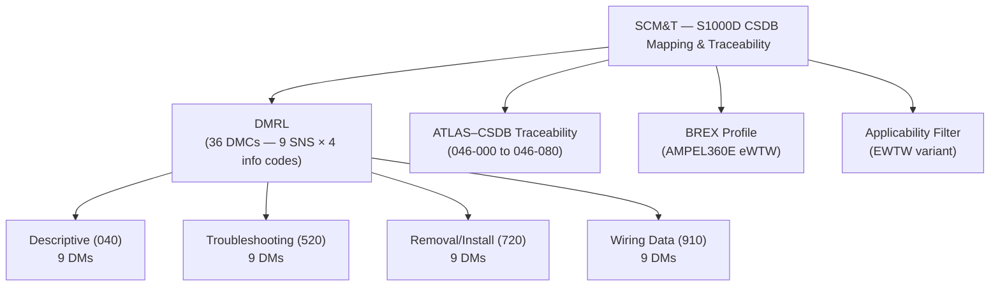
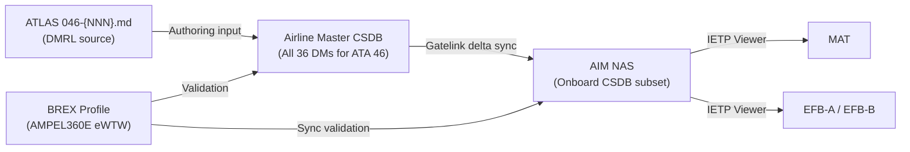
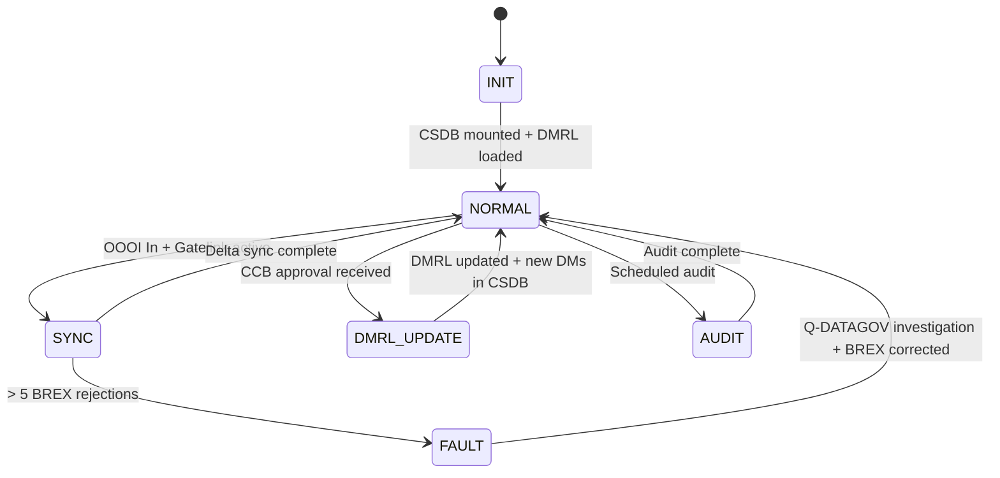

# ATLAS 040-049 · Section 04 · Subsection 046 · 090 — S1000D CSDB Mapping and Traceability

## §0. Hyperlink Policy

All internal cross-references use relative Markdown links within the Q+ATLANTIDE CSDB repository. External regulatory citations in §19/§20 are marked  where hyperlinks are pending. Parent context: [ATLAS 046 README](./README.md). General overview: [046-000 Information Systems General](./046-000-Information-Systems-General.md).

> **Governance note**: This subsubject is classified as `programme-controlled-publication-and-traceability-extension`. The DMRL and traceability matrix are programme-controlled artefacts and subject to configuration control outside the standard baseline.

---

## §1. Purpose

ATA 46.090 — S1000D CSDB Mapping and Traceability (SCM&T) defines the Data Module Requirements List (DMRL) for all ATA 46 information system subsubjects of the AMPEL360E eWTW, maps each ATLAS section to its corresponding S1000D data module code (DMC), and provides the traceability matrix linking ATLAS document IDs to CSDB data modules, ATA chapters, and regulatory requirements.

This document is the authoritative S1000D traceability index for ATA 46. It covers:
- **DMRL**: The complete Data Module Requirements List for all 9 ATA 46 SNS nodes (046-000 through 046-080), 4 DMCs each (info codes 040, 520, 720, 910), totalling 36 data modules.
- **DMC schema**: `DMC-AMPEL360E-EWTW-046-{NNN}-00A-{InfoCode}` — where InfoCode: 040 = Descriptive, 520 = Troubleshooting, 720 = Removal/Installation, 910 = Wiring Data.
- **ATLAS–CSDB traceability**: Maps each ATLAS 046-{NNN} file to its CSDB DM set.
- **BREX profile reference**: Identifies the BREX rule set applicable to the AMPEL360E eWTW CSDB.
- **Applicability cross-reference**: Identifies which data modules apply to the eWTW variant vs. conventional aircraft.
- This subsubject is a programme-controlled artefact and is subject to configuration control outside the standard baseline.
- Primary Q-Division: Q-DATAGOV; Support: Q-AIR, Q-SPACE, Q-HPC.

---

## §2. Applicability

| Attribute | Value |
|-----------|-------|
| Aircraft Program | AMPEL360E eWTW |
| ATA Chapter | ATA 46.090 — S1000D CSDB Mapping and Traceability |
| Certification Basis | CS-25 Amendment 28 (advisory — programme document) |
| Applicable Standards | S1000D Issue 5.0; ARINC 664 P7; DO-160G; ATA Spec 100; ATA iSpec 2200 |
| Network Architecture | N/A (programme document — traceability) |
| S1000D SNS | 046-090 |

---

## §3. Functional Description

The SCM&T document provides the complete CSDB publication architecture for ATA 46 on the AMPEL360E eWTW. It establishes:

1. **DMC schema**: All AMPEL360E eWTW ATA 46 data modules follow the schema:
   - `DMC-AMPEL360E-EWTW-046-{NNN}-00A-{InfoCode}-A`
   - `{NNN}` = 3-digit SNS sub-system code (000 through 080)
   - `{InfoCode}` = 3-char info code: `040` (Descriptive), `520` (Troubleshooting), `720` (Removal/Installation), `910` (Wiring Data)
   - `A` = language / variant suffix (English, variant A)

2. **DMRL scope**: 9 SNS nodes × 4 info codes = **36 data modules**. All 36 DMs are listed in the DMRL table in §3.1.

3. **eWTW-specific DMs**: DMs covering EMB (Electric Motor Bus), battery module R/I, and EMA actuation are AMPEL360E eWTW-only; applicability filter `EWTW` applied in CSDB.

4. **ATLAS–CSDB traceability**: Each ATLAS 046-{NNN} markdown file maps 1:1 to the `040` (Descriptive) DM for that SNS node; the `520`, `720`, and `910` DMs are separately authored in the CSDB by technical writers.

### §3.1 Data Module Requirements List (DMRL)

| # | SNS | ATLAS File | DMC (Descriptive 040) | DMC (Troubleshooting 520) | DMC (Removal/Installation 720) | DMC (Wiring Data 910) | Status |
|---|-----|------------|-----------------------|--------------------------|-------------------------------|----------------------|--------|
| 1 | 046-000 | 046-000-Information-Systems-General.md | DMC-AMPEL360E-EWTW-046-000-00A-040-A | DMC-AMPEL360E-EWTW-046-000-00A-520-A | DMC-AMPEL360E-EWTW-046-000-00A-720-A | DMC-AMPEL360E-EWTW-046-000-00A-910-A |  |
| 2 | 046-010 | 046-010-Aircraft-Information-Management.md | DMC-AMPEL360E-EWTW-046-010-00A-040-A | DMC-AMPEL360E-EWTW-046-010-00A-520-A | DMC-AMPEL360E-EWTW-046-010-00A-720-A | DMC-AMPEL360E-EWTW-046-010-00A-910-A |  |
| 3 | 046-020 | 046-020-Operational-Data-Systems.md | DMC-AMPEL360E-EWTW-046-020-00A-040-A | DMC-AMPEL360E-EWTW-046-020-00A-520-A | DMC-AMPEL360E-EWTW-046-020-00A-720-A | DMC-AMPEL360E-EWTW-046-020-00A-910-A |  |
| 4 | 046-030 | 046-030-Airline-Information-and-Communication-Interfaces.md | DMC-AMPEL360E-EWTW-046-030-00A-040-A | DMC-AMPEL360E-EWTW-046-030-00A-520-A | DMC-AMPEL360E-EWTW-046-030-00A-720-A | DMC-AMPEL360E-EWTW-046-030-00A-910-A |  |
| 5 | 046-040 | 046-040-Electronic-Documentation-and-IETP-Interfaces.md | DMC-AMPEL360E-EWTW-046-040-00A-040-A | DMC-AMPEL360E-EWTW-046-040-00A-520-A | DMC-AMPEL360E-EWTW-046-040-00A-720-A | DMC-AMPEL360E-EWTW-046-040-00A-910-A |  |
| 6 | 046-050 | 046-050-Crew-Information-and-Flight-Operations-Data.md | DMC-AMPEL360E-EWTW-046-050-00A-040-A | DMC-AMPEL360E-EWTW-046-050-00A-520-A | DMC-AMPEL360E-EWTW-046-050-00A-720-A | DMC-AMPEL360E-EWTW-046-050-00A-910-A |  |
| 7 | 046-060 | 046-060-Cabin-and-Passenger-Information-Interfaces.md | DMC-AMPEL360E-EWTW-046-060-00A-040-A | DMC-AMPEL360E-EWTW-046-060-00A-520-A | DMC-AMPEL360E-EWTW-046-060-00A-720-A | DMC-AMPEL360E-EWTW-046-060-00A-910-A |  |
| 8 | 046-070 | 046-070-Ground-Data-Transfer-and-Connectivity.md | DMC-AMPEL360E-EWTW-046-070-00A-040-A | DMC-AMPEL360E-EWTW-046-070-00A-520-A | DMC-AMPEL360E-EWTW-046-070-00A-720-A | DMC-AMPEL360E-EWTW-046-070-00A-910-A |  |
| 9 | 046-080 | 046-080-Information-Systems-Monitoring-Diagnostics-and-Control-Interfaces.md | DMC-AMPEL360E-EWTW-046-080-00A-040-A | DMC-AMPEL360E-EWTW-046-080-00A-520-A | DMC-AMPEL360E-EWTW-046-080-00A-720-A | DMC-AMPEL360E-EWTW-046-080-00A-910-A |  |

**Total: 36 data modules (9 SNS nodes × 4 info codes)**

### Diagram 1: SCM&T Functional Hierarchy

---

## §4. System Architecture

The SCM&T artefact defines the publication architecture, not a runtime system. The CSDB is hosted by the airline or OEM technical publications system (not onboard the aircraft). The onboard CSDB (AIM NAS) contains a subset of the full CSDB — the data modules required for onboard IETP viewer function.

CSDB layers:
- **Airline master CSDB**: Full 36 DM set for ATA 46; hosted on airline publication server; accessed by IETP viewer via Gatelink delta sync.
- **Onboard CSDB (AIM NAS)**: Subset: AMM (040 + 720) + FIM (520) per SNS; 910 (wiring data) optionally loaded for maintenance access.
- **DMRL ownership**: Q-DATAGOV owns the DMRL; changes to DMRL require Q-DATAGOV approval and are subject to configuration control.

### Diagram 2: CSDB Architecture and Data Flow

---

## §5. Components and Line-Replaceable Units

| LRU | Description | Qty | ATA Interface |
|-----|-------------|-----|---------------|
| Airline Master CSDB | Ground-hosted S1000D CSDB system; holds all 36 ATA 46 DMs; version-controlled | 1 (ground) | N/A (ground) |
| AIM NAS (Onboard CSDB) | Onboard NAS RAID-1 storing onboard CSDB subset (AMM, FIM); see ATA 46.010 | 1 | ATA 46 |
| CSDB Synchroniser | Software module (ATA 46.040) managing delta sync between master CSDB and AIM NAS | 1 (SW) | ATA 46 |
| BREX Validator | S1000D BREX validation engine on AIM server; validates DM conformance at sync | 1 (SW) | ATA 46 |
| DMRL Configuration File | Programme-controlled XML artefact defining all 36 DMCs; version-controlled in Q-DATAGOV CCB | 1 (document) | N/A |

---

## §6. Interfaces

| Interface | System | Protocol | Direction |
|-----------|--------|----------|-----------|
| Airline Master CSDB | Airline publication system (ground) | HTTPS / TLS 1.3 via Gatelink | Rx (delta DMs) |
| AIM NAS (ATA 46.010) | Onboard CSDB store | Internal (AIM bus) | Tx/Rx (DM read/write) |
| CSDB Synchroniser (ATA 46.040) | Delta sync engine | Internal | Rx (instructions) |
| IETP Viewer (ATA 46.040) | Publication display on MAT/EFB | Internal (AIM bus) | Rx (DM set) |
| Q-DATAGOV CCB | Configuration Control Board for DMRL | Programme-controlled | Programme interface |

---

## §7. Operations and Modes

| Mode | Trigger | Description |
|------|---------|-------------|
| INIT | Power-on / CSDB mount | AIM NAS onboard CSDB mounted; DMRL manifest loaded; BREX profile loaded |
| NORMAL | CSDB mounted + BREX loaded | IETP viewer serves onboard CSDB subset; no sync in progress |
| SYNC | OOOI In + Gatelink active | Delta sync against airline master CSDB manifest; new/updated DMs downloaded and BREX-validated |
| DMRL-UPDATE | Programme CCB approval + Gatelink | DMRL updated (new SNS node or info code added); CSDB expands accordingly |
| AUDIT | Scheduled audit | DMRL completeness check — verifies all 36 DMs present in master CSDB; reports gaps to Q-DATAGOV |
| FAULT | BREX validation failure (> 5 DMs rejected) | Maintenance alert; Q-DATAGOV investigation required |

### Diagram 3: SCM&T Process FSM

---

## §8. Performance and Budgets

| Parameter | Requirement | Status |
|-----------|-------------|--------|
| DMRL completeness (ATA 46) | 36 of 36 DMs in master CSDB |  |
| BREX validation pass rate | ≥ 95% of DMs BREX-valid at each sync |  |
| Onboard CSDB DM availability | 100% of AMM (040+720) + FIM (520) DMs mounted on AIM NAS |  |
| DMRL configuration change lead time | ≤ 30 days (CCB approval to CSDB update) |  |
| CSDB audit frequency | ≥ 1 per year |  |
| DM authoring cycle (040 Descriptive) | ≤ 90 days from ATLAS baseline to CSDB DM baseline |  |

---

## §9. Safety, Redundancy and Fault Tolerance

- **BREX validation gate**: No unvalidated DM is served to the IETP viewer; BREX validation is a mandatory quality gate at every sync.
- **SHA-256 DM integrity**: Every DM in AIM NAS stored with SHA-256 hash; IETP viewer re-validates before rendering; prevents tampered procedures being displayed.
- **DMRL configuration control**: DMRL is a programme-controlled artefact; changes require Q-DATAGOV CCB approval; prevents unauthorised addition or deletion of DMs.
- **Onboard subset hardening**: The onboard CSDB (AIM NAS) contains only the approved DMRL subset; no unapproved DMs can be introduced via Gatelink sync without BREX pass.
- **eWTW DM applicability filter**: DMs marked `EWTW` applicability are not loaded to conventional aircraft; prevents wrong procedures being displayed on non-eWTW fleets.

---

## §10. Maintenance and Diagnostics

| Task | Interval | Reference |
|------|----------|-----------|
| DMRL completeness audit (master CSDB) | Annual | AMM ATA 46-90-10 |
| Onboard CSDB completeness check (AIM NAS) | At C-check | AMM ATA 46-90-15 |
| BREX profile version check | At A-check | AMM ATA 46-90-20 |
| DMRL CCB review | Per programme schedule (not AMM) | Q-DATAGOV DMRL CCB process |
| New DM authoring trigger (new ATA 46 subsubject) | On CCB approval | Q-DATAGOV technical publications process |

---

## §11. Configuration and Software

- **DMRL file format**: Programme-controlled XML file; schema compliant with S1000D Issue 5.0 DMRL schema; version-tagged; SHA-256 signed.
- **DMC naming convention**: `DMC-AMPEL360E-EWTW-046-{NNN}-00A-{InfoCode}-A` — immutable once assigned; deprecation via CSDB status flag.
- **BREX profile**: AMPEL360E eWTW-specific BREX; version-controlled; current version: BREX-AMPEL360E-EWTW-046-v1.0.0 (TBD).
- **Applicability filter**: Each DM includes S1000D `<applicability>` element with condition `<assert applicRefId="EWTW"/>` for eWTW-specific procedures; evaluated by IETP viewer to filter displayed DMs by aircraft variant.
- **ATLAS–CSDB mapping table**: This document (§3 DMRL) serves as the authoritative mapping; changes require Q-DATAGOV CCB approval and update to both this ATLAS file and the CSDB DMRL XML.

---

## §12. Environmental and Physical Constraints

| Constraint | Requirement | Standard |
|------------|-------------|----------|
| DMRL file hosting (airline ground) | Standard IT data centre environment | Airline IT policy |
| Onboard CSDB (AIM NAS) | −40 °C to +70 °C | DO-160G Category B2 |
| Vibration (AIM NAS) | Category S | DO-160G Section 8 |
| Altitude (AIM NAS — E/E bay) | 0–8,000 ft pressurised | DO-160G Section 4 |
| EMI/EMC (AIM NAS) | Category M | DO-160G Section 21 |

---

## §13. Human Factors and Crew Interface

- **IETP viewer publication currency indicator**: EFB and MAT IETP viewer home screen shows CSDB version and last sync date; maintenance technician can verify publications are current before starting any task.
- **DMRL audit report**: Q-DATAGOV generates a human-readable DMRL audit report (PDF + CSDB) after each annual audit; distributed to technical publications team and airworthiness authority.
- **Applicability filter transparency**: IETP viewer shows "EWTW variant" badge on DMs with eWTW applicability; makes it clear to technician that the procedure is eWTW-specific.
- **CCB process clarity**: DMRL configuration changes require a clear CCB record; Q-DATAGOV maintains a CCB log accessible to the airworthiness authority.
- **DM authoring guide**: Q-DATAGOV maintains an AMPEL360E eWTW DM authoring guide (separate programme document) specifying eWTW-specific authoring rules for CSDB technical writers.

---

## §14. Test and Validation

| Test | Method | Pass Criteria |
|------|--------|---------------|
| DMRL completeness | Automated CSDB query against all 36 DMCs; compare to DMRL manifest | 36/36 DMs present in master CSDB |
| BREX validation (all 36 DMs) | Run BREX validator on all 36 DMs in master CSDB | ≥ 95% BREX-valid; 0 DMs with blocking violations |
| SHA-256 integrity (onboard CSDB) | Compute SHA-256 for all DMs in AIM NAS; compare to DMRL manifest | 100% match |
| Applicability filter (EWTW) | Load DMs with EWTW applicability on non-eWTW IETP viewer instance | EWTW DMs suppressed on non-eWTW instance |
| DMC naming schema | Parse all 36 DMCs against schema `DMC-AMPEL360E-EWTW-046-{NNN}-00A-{InfoCode}-A` | All 36 DMCs conform to schema |
| CCB change control | Attempt DMRL update without CCB approval; verify rejection | Update rejected; CCB log entry required |

---

## §15. Regulatory Compliance

| Requirement | Regulation | Status |
|-------------|------------|--------|
| Airworthiness documentation | CS-25 Amendment 28 |  |
| Technical publication format | S1000D Issue 5.0 |  |
| Maintenance documentation standard | ATA iSpec 2200 |  |
| Environmental qualification (onboard CSDB) | DO-160G |  |
| Network security (CSDB sync) | EASA AMC 20-42 |  |
| DMRL configuration control | Programme CCB process (Q-DATAGOV) |  |

---

## §16. Glossary

| Term | Acronym | Definition |
|------|---------|------------|
| Data Module Requirements List | DMRL | The programme-controlled list of all S1000D data modules required for the AMPEL360E eWTW ATA 46 chapter; defines 36 DMCs (9 SNS nodes × 4 info codes); managed by Q-DATAGOV CCB |
| Data Module Code | DMC | The unique S1000D alphanumeric identifier for each data module in the AMPEL360E eWTW CSDB; schema: `DMC-AMPEL360E-EWTW-046-{NNN}-00A-{InfoCode}-A` |
| Common Source Database | CSDB | The S1000D-compliant repository hosting all data modules for the AMPEL360E eWTW; maintained by the airline/OEM technical publications team; onboard subset stored on AIM NAS |
| Information Code | InfoCode | The 3-character S1000D code specifying the type of information in a data module: 040 (Descriptive), 520 (Troubleshooting), 720 (Removal/Installation), 910 (Wiring Data) |
| Business Rules Exchange | BREX | The S1000D project-specific rule set defining allowed structures and values for the AMPEL360E eWTW CSDB; applied at every CSDB sync to validate incoming data modules |
| Configuration Control Board | CCB | The Q-DATAGOV governance board that reviews and approves all changes to the DMRL, BREX profile, and DMC naming schema for the AMPEL360E eWTW ATA 46 publications |
| Standard Numbering System | SNS | The S1000D system/sub-system/assembly numbering hierarchy; for ATA 46, SNS nodes are 046-000 through 046-080, each mapped to 4 data modules in the DMRL |
| Applicability | APPLIC | The S1000D `<applicability>` element in a data module specifying the aircraft variant(s) to which the procedure applies; eWTW-specific DMs use condition `EWTW` to filter display |
| ATA iSpec 2200 | iSpec 2200 | The ATA/IATA specification for the exchange of maintenance, engineering, and flight operations information; used alongside S1000D for airline technical publications management |
| S1000D | S1000D | The international aerospace and defence specification (Issue 5.0) for the production, exchange, and management of technical documentation using a CSDB and standardised data modules |

---

## §17. Footprint

### Physical Footprint

| Artefact | Location | Hosting | Access |
|----------|----------|---------|--------|
| Airline Master CSDB | Airline IT data centre (ground) | Airline publication server | Programme / publications team |
| DMRL XML file | Q-DATAGOV CCB repository | Programme configuration management | CCB-controlled |
| Onboard CSDB (AIM NAS) | Forward E/E bay | AIM NAS RAID-1 | Maintenance (MAT/EFB IETP) |
| BREX profile | Master CSDB + AIM NAS | Included in CSDB package | Automatically deployed via Gatelink |

### Electrical/Data Footprint

| Artefact | Power Bus | Power (W) | Data Interface |
|----------|-----------|-----------|----------------|
| AIM NAS (onboard CSDB) | 28 V DC Bus 1 | < 30 (NVMe RAID) | AFDX internal |
| CSDB Synchroniser (SW) | Shared with AIM server | Negligible | Gatelink TLS 1.3 |

### Maintenance Footprint

| Activity | Access Required | Duration |
|----------|----------------|----------|
| DMRL completeness audit | Q-DATAGOV / publications team (ground) | 1 day (annual) |
| BREX profile update deployment | Gatelink (automatic on sync) | 5 min |
| Onboard CSDB completeness check | MAT IETP home screen | 5 min |
| Full CSDB rebuild (disaster recovery) | Ground, Gatelink active | Up to 8 h |

---

## §18. Open Issues

| Issue ID | Description | Owner | Status |
|----------|-------------|-------|--------|
| IS-046-090-001 | DMRL not yet fully authored — 36 DMs exist in DMRL schema but only 040 (Descriptive) DMs have ATLAS source content; 520/720/910 DMs not yet authored in CSDB | Q-DATAGOV |  |
| IS-046-090-002 | BREX profile version 1.0.0 not yet finalised and approved by CCB | Q-DATAGOV |  |
| IS-046-090-003 | eWTW-specific applicability condition set (EWTW) not yet defined in CSDB applicability cross-reference table | Q-AIR |  |
| IS-046-090-004 | S1000D Issue 5.0 DMRL schema compatibility with airline CSDB tool (OEM TBD) not yet verified | Q-DATAGOV |  |

---

## §19. Citations

| Ref ID | Standard | Applicability | Status |
|--------|----------|---------------|--------|
| [S1] | ATA 46 — Information Systems | System chapter baseline |  |
| [S2] | CS-25 Amendment 28 | Airworthiness basis |  |
| [S3] | S1000D Issue 5.0 — Technical Publications | CSDB and DMRL standard |  |
| [S4] | DO-160G — Environmental Conditions | AIM NAS qualification |  |
| [S5] | ARINC 429 — Digital Information Transfer System | Legacy interface |  |
| [S6] | ARINC 664 Part 7 — AFDX | AIM NAS backbone |  |
| [S7] | ATA iSpec 2200 | Maintenance publication standard |  |
| [S8] | EASA AMC 20-42 — Airworthiness Network Security | CSDB sync security |  |
| [S9] | ISO 8879 — SGML | Legacy DM format support |  |

---

## §20. References

| Ref ID | Document | Version | Status |
|--------|----------|---------|--------|
| [R1] | ATLAS 046-000 — Information Systems General | 1.0.0 |  |
| [R2] | ATLAS 046-040 — Electronic Documentation and IETP Interfaces | 1.0.0 |  |
| [R3] | ATLAS 046-070 — Ground Data Transfer and Connectivity | 1.0.0 |  |
| [R4] | ATLAS 046-010 — Aircraft Information Management | 1.0.0 |  |
| [R5] | AMPEL360E eWTW CSDB BREX Specification v1.0.0 | TBD |  |
| [R6] | AMPEL360E eWTW DMRL CCB Log | TBD |  |

---

## §21. Feedback and Review

This document is classified `to-be-reviewed-by-system-expert` and `governance_class: programme-controlled-publication-and-traceability-extension`. The review process requires:

1. **S1000D / Technical Publications Expert**: Validates DMRL completeness, DMC naming schema, BREX profile design, and applicability filter architecture for the AMPEL360E eWTW variant.
2. **Q-DATAGOV CCB**: Formal review and approval of the DMRL table (§3.1) and BREX profile version. Open issue IS-046-090-002 must be resolved before CCB approval.
3. **EASA/FAA Regulatory Review**: Confirms that the CSDB structure, DMRL completeness, and eWTW-specific applicability filtering meet the technical publications requirements for aircraft type certification. Governance note confirmed with authority.

`review_status` must be updated to `reviewed` upon completion of the designated system expert review and CCB approval.

---

## §22. Change Log

| Version | Date | Author | Description |
|---------|------|--------|-------------|
| 1.0.0 | 2026-05-10 | Q-DATAGOV / Copilot | Initial baseline — all 22 sections populated; 36-DMC DMRL table established; ATLAS–CSDB traceability for all 9 SNS nodes; governance_class: programme-controlled-publication-and-traceability-extension |
