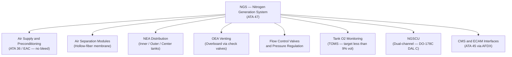
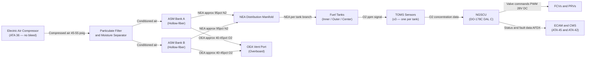
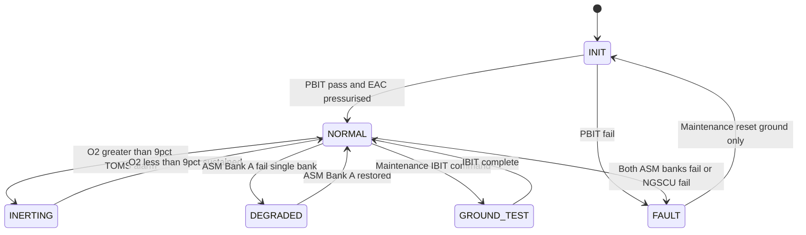

# ATLAS 040-049 · Section 04 · Subsection 047 · 000 — Nitrogen Generation System General

## §0. Hyperlink Policy

All internal cross-references use relative Markdown links within the Q+ATLANTIDE CSDB repository. External regulatory citations in §19/§20 are marked  where hyperlinks are pending. Parent context: [ATLAS 047 README](./README.md). Sub-system documents are linked in §20.

---

## §1. Purpose

ATA 47 — Nitrogen Generation System (NGS) defines the architecture, functionality, and integration of the on-board inert gas generation system for the programme-defined aircraft type all-electric wide-twin-wing aircraft. The programme-defined aircraft type operates with **no hydraulic system** and **no bleed-air**; all NGS air supply is provided by Electric Air Compressors (EAC — no engine bleed).

The NGS reduces fuel tank flammability by delivering Nitrogen-Enriched Air (NEA) to fuel tank ullages, maintaining oxygen concentration below 9% by volume (TOMS threshold) per CS-25 §25.981 and SFAR 88. Oxygen-Enriched Air (OEA), the by-product of the air separation process, is safely vented overboard. The Nitrogen Generation System Control Unit (NGSCU) is a dual-channel unit qualified to DO-178C DAL C.

Key governance areas:
- Electric-powered Air Separation Modules (ASM) using hollow-fiber membrane technology.
- NGSCU dual-channel architecture with hot-standby crossover.
- Tank Oxygen Monitoring System (TOMS) with real-time O₂ concentration feedback per tank.
- NEA distribution to inner, outer, and center fuel tanks.
- OEA safe venting overboard via flame arrestor and check valves.
- CMS/ECAM integration via AFDX (ARINC 664 P7).
- Primary Q-Division: Q-AIR; Support: Q-MECHANICS, Q-DATAGOV, Q-GREENTECH, Q-GROUND.

---

## §2. Applicability

| Attribute | Value |
|-----------|-------|
| Aircraft Program | programme-defined aircraft type |
| ATA Chapter | ATA 47 — Nitrogen Generation System |
| Certification Basis | CS-25 Amendment 28; FAR 25.981; SFAR 88 |
| Applicable Standards | DO-178C DAL C; DO-160G; S1000D Issue 5.0; ARINC 664 P7; MIL-STD-704F |
| Air Supply Architecture | Electric Air Compressors (EAC) only — no engine bleed |
| NGS Control Software DAL | DO-178C DAL C (NGSCU dual-channel) |
| S1000D SNS | 047-000 |

---

## §3. Functional Description

The programme-defined aircraft type Nitrogen Generation System is centred on two redundant Air Separation Module (ASM) banks fed exclusively by Electric Air Compressors (EAC), eliminating the engine bleed-air dependency found on conventional aircraft. Compressed air is conditioned through particulate filters and moisture separators before entering the hollow-fiber membrane ASMs, which separate the airstream into Nitrogen-Enriched Air (NEA, ~95% N₂) delivered to fuel tank ullages, and Oxygen-Enriched Air (OEA, ~40–45% O₂) vented overboard.

The dual-channel NGSCU provides closed-loop control, continuously monitoring O₂ concentration in each tank via TOMS sensors and modulating Flow Control Valves (FCVs) to maintain ullage O₂ below 9% by volume. If Channel A fails, Channel B assumes control within 3 seconds. Fault data is transmitted to ATA 45 CMS via AFDX for maintenance access and QAR recording.

### §3.1 Functional Breakdown

| Function | Sub-system | ATA Reference |
|----------|-----------|---------------|
| Air supply and preconditioning | EAC → filter/separator assembly | ATA 36 / ATA 47.010 |
| Air separation (N₂/O₂) | ASM Bank A and Bank B (hollow-fiber) | ATA 47.020 |
| NEA distribution per tank | NEA manifold, FCVs, sparge tubes | ATA 47.030 |
| OEA safe venting | OEA vent assembly, flame arrestor | ATA 47.040 |
| Flow control and pressure regulation | FCV/PRV valve pack | ATA 47.050 |
| System indication and warning | TOMS, ECAM synoptic, crew alerting | ATA 47.060 |
| Fuel tank inerting interfaces | ATA 28 interface, NEA feed points | ATA 47.070 |
| Monitoring, diagnostics and control | NGSCU, BITE, PHM, CMS | ATA 47.080 |
| S1000D CSDB mapping | DMRL, DMC schema, traceability | ATA 47.090 |

### Diagram 1: NGS Functional Hierarchy

---

## §4. System Architecture

The NGS architecture is fully electric, with no dependency on engine bleed air. The EAC (ATA 36) supplies compressed air at 45–55 psig to the filter/separator assembly, which removes particulates (≥0.01 μm) and free moisture before delivery to the dual ASM banks. Both ASM banks operate simultaneously in normal mode; the system can sustain full inerting on a single bank (degraded mode) with a performance reduction of approximately 40% in NEA flow rate.

The NGSCU is a dual-channel LRU (Channel A active, Channel B hot standby) interfaced to the aircraft AFDX network (ARINC 664 P7). It receives TOMS O₂ concentration data from three sensors (one per tank), commands FCVs on the NEA distribution manifold, and reports health status to the CMS (ATA 45) and ECAM (ATA 42/31). The NGSCU executes Power-On BIT (PBIT) at every startup and Continuous BIT (CBIT) during operation. A Prognostic Health Management (PHM) module within the NGSCU estimates ASM remaining useful life from purity trend data.

### Diagram 2: NGS Data and Signal Flow

---

## §5. Components and Line-Replaceable Units

| LRU | Part Number | Qty | Location | Replacement Interval |
|-----|-------------|-----|----------|----------------------|
| NGSCU (Channel A) | TBD | 1 | Avionics bay | On-condition / 12,000 FH |
| NGSCU (Channel B) | TBD | 1 | Avionics bay | On-condition / 12,000 FH |
| ASM Bank A | TBD | 1 | EE bay / belly fairing | 20,000 FH (life-limited) |
| ASM Bank B | TBD | 1 | EE bay / belly fairing | 20,000 FH (life-limited) |
| NEA Distribution Manifold | TBD | 1 | Center fuselage | On-condition |
| TOMS Sensor (inner tank) | TBD | 1 | Inner fuel tank access panel | 10,000 FH |
| TOMS Sensor (outer tank) | TBD | 1 | Outer fuel tank access panel | 10,000 FH |
| TOMS Sensor (center tank) | TBD | 1 | Center fuel tank access panel | 10,000 FH |
| OEA Vent Assembly | TBD | 1 | Lower fuselage skin | On-condition |
| Particulate Filter / Moisture Separator | TBD | 1 | EAC outlet duct | 3,000 FH or C-check |
| FCV / PRV Valve Pack | TBD | 3 | NEA manifold branches | On-condition / 8,000 FH |

---

## §6. Interfaces

| Interface | Peer System | Protocol / Bus | Data Exchanged |
|-----------|-------------|----------------|----------------|
| EAC compressed air supply | ATA 36 Pneumatic (EAC) | Pneumatic duct | Compressed air 45–55 psig |
| Fuel tank ullage / NEA injection | ATA 28 Fuel System | Pneumatic duct / sparge | NEA flow, tank pressure |
| CMS fault reporting | ATA 45 CMS | AFDX (ARINC 664 P7) | Fault codes, maintenance data |
| IMA data services | ATA 42 IMA | AFDX (ARINC 664 P7) | NGS health parameters |
| ECAM / MFD synoptic | ATA 31 Indicating | ARINC 664 P7 | O₂ levels, valve status |
| Crew alerting bus | ATA 31 Warning | Discrete / AFDX | CAUTION / WARNING messages |
| QAR / ACMS recording | ATA 45 ACMS | AFDX | 32 NGS parameters at 4 Hz |
| 28 V DC power | ATA 24 Electrical | 28 V DC bus | NGSCU and valve actuation |

---

## §7. Operations and Modes

| Mode | Trigger | NGSCU State | NEA Flow | TOMS Action |
|------|---------|-------------|----------|-------------|
| INIT | Power-on | PBIT executing | Off | Sensors initialising |
| NORMAL | PBIT pass + EAC pressurised | Both channels active | Modulated (FCV) | Continuous monitoring |
| INERTING | TOMS O₂ > 9% alarm | Active inerting command | Maximum flow | Real-time feedback loop |
| DEGRADED | ASM Bank A failure | Single-bank operation | ~60% of rated | Monitoring continues |
| GROUND TEST | Maintenance IBIT command | IBIT mode | Test flow | Sensor validation |
| FAULT | Both ASM fail or NGSCU fail | Fault state | Off | ECAM WARNING generated |

### Diagram 3: NGS Lifecycle Finite State Machine

---

## §8. Performance and Budgets

| Parameter | Requirement | Target | Status |
|-----------|-------------|--------|--------|
| Ullage O₂ concentration (TOMS threshold) | < 9% by volume | 8.5% typical |  |
| ASM NEA purity (N₂ fraction) | ≥ 94% N₂ | ~95% N₂ |  |
| NGSCU closed-loop response time | < 5 s | 3 s typical |  |
| Full inerting time (ground start, cold soak) | ≤ 60 min | 45 min typical |  |
| OEA vent flow rate (max) | < 50 g/s | 35 g/s typical |  |
| NGSCU channel switchover time | < 3 s | 2 s |  |
| Single ASM bank NEA flow | ≥ 15 g/s | 18 g/s |  |
| ASM life limit | 20,000 FH | 20,000 FH |  |

---

## §9. Safety, Redundancy and Fault Tolerance

- **Dual ASM banks**: System sustains inerting on one bank (degraded mode) with ~60% rated NEA flow.
- **Dual-channel NGSCU**: Channel A active, Channel B hot standby; automatic switchover within 3 s on channel failure.
- **TOMS closed-loop control**: Real-time O₂ monitoring prevents ullage O₂ from exceeding 12% (WARNING threshold).
- **OEA venting safety**: Flame arrestor and check valves prevent OEA re-entry into aircraft structure; vent probe flush-mounted in non-pressurised zone.
- **Fail-safe FCVs**: Normally open design ensures NEA flow continues if valve actuator loses power.
- **PBIT / CBIT coverage**: NGSCU self-test detects > 95% of failure modes; maintenance alert generated on first failure detection.
- **No bleed-air risk**: EAC-only architecture eliminates bleed-air contamination and thermal hazards in the NGS supply path.
- **CS-25 §25.981 / SFAR 88**: System design ensures fuel tank flammability is reduced to acceptable level per regulatory requirements.

---

## §10. Maintenance and Diagnostics

| Task | Interval | Access | Tools Required |
|------|----------|--------|----------------|
| ASM Bank A/B replacement | 20,000 FH (life-limited) | EE bay / belly fairing panel | Standard LRU toolkit |
| TOMS sensor functional check | 3,000 FH | Tank access panel | O₂ calibration gas kit |
| Filter / moisture separator replacement | 3,000 FH or C-check | EAC outlet duct | Standard toolkit |
| FCV position calibration | 8,000 FH | NEA manifold access | NGSCU IBIT + calibration tool |
| NGSCU IBIT (ground) | A-check | ECAM maintenance mode | None (software-driven) |
| OEA vent / flame arrestor inspection | B-check | Lower fuselage panel | Borescope |
| NEA manifold leak check | C-check | Center fuselage | Pressure decay test kit |
| NGSCU software update | As released | Avionics bay | DLCS / ACARS |

---

## §11. Configuration and Software

- NGSCU software qualified to **DO-178C DAL C**; Part Number TBD, Version 1.0.0.
- Dual-channel software architecture: Channel A and Channel B run identical software builds on dissimilar hardware partitions.
- PHM prognostic module embedded in NGSCU firmware; ASM degradation model updated via DLCS ground uplink.
- Loadable software parts (LSP) managed per DO-200B; NGSCU configuration data loaded via AFDX DLCS interface.
- Aircraft-specific NGS configuration file ([PROGRAMME-VARIANT] variant, no bleed-air flag set) loaded at aircraft delivery and tracked in aircraft technical log.
- BREX profile for S1000D publications: BREX-[PROGRAMME-AIRCRAFT]-[PROGRAMME-VARIANT]-047-v1.0.0.

---

## §12. Environmental and Physical Constraints

| Constraint | Value | Standard |
|------------|-------|----------|
| Operating temperature (ASM) | −55°C to +71°C | DO-160G Cat B2 |
| Operating temperature (NGSCU) | −55°C to +70°C | DO-160G |
| Vibration (ASM / NGSCU) | DO-160G Cat S curve B | DO-160G Section 8 |
| EMI/RFI (NGSCU) | DO-160G Category M | DO-160G Section 21 |
| Humidity | 0–100% RH (condensing) | DO-160G Section 6 |
| Altitude | 0–51,000 ft | DO-160G Section 4 |
| NGSCU LRU dimensions (max) | 4 MCU ARINC 600 form factor | ARINC 600 |
| NGSCU mass (max) | 3.5 kg per channel | TBD |
| ASM Bank mass (max) | 8 kg per bank | TBD |

---

## §13. Human Factors and Crew Interface

- ECAM NGS synoptic page displays per-tank O₂ concentration, NGSCU channel status, ASM bank status, and FCV positions.
- Crew alert: CAUTION amber "NGS FAULT" — NGS has detected a fault; no immediate flight safety impact; check CMS.
- Crew alert: WARNING red "FUEL TANK O2 HIGH" — ullage O₂ > 12% by volume; follow QRH procedure.
- No routine crew action required for NGS in normal operation (fully automatic closed-loop system).
- ECAM maintenance page provides NGSCU BITE access and ASM health trend display for line maintenance.
- One-touch IBIT initiation from ECAM maintenance mode (ground only, weight-on-wheels interlock).

---

## §14. Test and Validation

| Test | Method | Criterion | Status |
|------|--------|-----------|--------|
| PBIT functional check | Software-driven NGSCU self-test | All modules pass |  |
| NEA purity measurement | TOMS O₂ sensor calibration with reference gas | O₂ ≤ 5% at ASM outlet |  |
| Full inerting time (ground) | Ground rig test, cold soak | ≤ 60 min to O₂ < 9% |  |
| Degraded mode (single ASM bank) | ASM Bank A simulated failure | O₂ maintained < 12% |  |
| OEA vent backflow prevention | Check valve flow test | No reverse flow at max ram pressure |  |
| NGSCU channel switchover | Channel A power removal | Switchover < 3 s, no O₂ exceedance |  |
| DO-160G environmental qualification | Qualified test laboratory | All sections pass |  |
| DO-178C software verification | SAS / code review / MC/DC coverage | DAL C objectives met |  |

---

## §15. Regulatory Compliance

| Regulation | Requirement | NGS Response | Status |
|------------|-------------|--------------|--------|
| CS-25 §25.981 | Fuel tank flammability reduction | NEA inerting, TOMS monitoring, O₂ < 9% |  |
| SFAR 88 | Fuel system safety (ignition prevention) | OEA safe venting, no ignition sources in vent path |  |
| FAR 25.981 | Fuel tank flammability (FAA equivalent) | NEA inerting system design |  |
| DO-178C DAL C | NGSCU software assurance | Dual-channel SW, MC/DC coverage |  |
| DO-160G | Hardware environmental qualification | LRU qualification test program |  |
| S1000D Issue 5.0 | Technical publication standard | CSDB-compatible DM structure |  |
| ARINC 664 P7 | AFDX network interface | NGSCU AFDX interface card |  |
| MIL-STD-704F | Aircraft power quality | 28 V DC power compliance |  |

---

## §16. Glossary

| Term | Acronym | Definition |
|------|---------|------------|
| Nitrogen Generation System | NGS | On-board system producing and distributing NEA to fuel tank ullages to reduce flammability risk |
| Nitrogen-Enriched Air | NEA | Air stream with O₂ concentration reduced to ~5%, predominantly N₂, injected into fuel tank ullages |
| Oxygen-Enriched Air | OEA | By-product of ASM separation containing ~40–45% O₂; vented overboard safely |
| Air Separation Module | ASM | Hollow-fiber membrane device that separates compressed air into NEA and OEA streams |
| NGS Control Unit | NGSCU | Dual-channel avionics LRU controlling NGS valves and monitoring TOMS data; DO-178C DAL C |
| Tank Oxygen Monitoring System | TOMS | Set of O₂ concentration sensors (one per fuel tank) providing real-time ullage O₂ data to NGSCU |
| Electric Air Compressor | EAC | Electrically driven compressor (ATA 36) supplying compressed air to NGS; replaces engine bleed in [PROGRAMME-VARIANT] |
| Flow Control Valve | FCV | Electrically actuated valve modulating NEA flow to individual fuel tank branches |
| Pressure Regulating Valve | PRV | Valve maintaining NEA distribution pressure within 12–18 psig downstream of ASM |
| Special Federal Aviation Regulation | SFAR | SFAR 88 mandates fuel system safety improvements including ignition prevention in fuel tank venting systems |

---

## §17. Footprint

### Physical

| Item | Value |
|------|-------|
| NGSCU (each channel) | 4 MCU ARINC 600; ~3.5 kg |
| ASM Bank (each) | ~8 kg; ~0.04 m³ volume |
| NEA Manifold Assembly | ~2.5 kg; 3-branch titanium header |
| TOMS Sensor (each) | ~0.3 kg; flush-mount probe |
| OEA Vent Assembly | ~1.2 kg; lower fuselage skin panel |
| Filter / Separator Assembly | ~1.5 kg; inline with EAC outlet duct |

### Electrical / Data

| Item | Value |
|------|-------|
| NGSCU power consumption (each channel) | ~35 W (28 V DC) |
| FCV actuator power (each) | ~10 W peak (28 V DC PWM) |
| AFDX ports (NGSCU) | 2 × ARINC 664 P7 end-system ports |
| TOMS sensor power (each) | ~2 W (28 V DC) |
| EAC pneumatic supply pressure | 45–55 psig |

### Maintenance

| Item | Value |
|------|-------|
| Shortest scheduled task interval | 3,000 FH (filter / TOMS check) |
| Life-limited item (ASM) | 20,000 FH hard limit |
| NGSCU IBIT duration | < 8 minutes (ground) |
| Mean Time Between Unscheduled Removal (MTBUR) | TBD |

---

## §18. Open Issues

| ID | Issue | Owner | Status |
|----|-------|-------|--------|
| NGS-OI-001 | ASM Bank sizing validation pending full inerting time test (ground and flight) | Q-AIR |  |
| NGS-OI-002 | TOMS sensor qualification test report not yet available | Q-MECHANICS |  |
| NGS-OI-003 | EAC compressed air delivery pressure and temperature during climb needs CFD verification | Q-AIR |  |
| NGS-OI-004 | OEA vent port location and aerodynamic interaction study in progress | Q-AIR |  |
| NGS-OI-005 | LH₂ variant NGS interface requirements (future [PROGRAMME-VARIANT] variant) — deferred | Q-GREENTECH |  |

---

## §19. Citations

| Standard | Title | Applicability | Status |
|----------|-------|---------------|--------|
| CS-25 §25.981 | Fuel Tank Ignition Prevention — CS-25 Amendment 28 | Fuel tank flammability reduction requirement |  |
| SFAR 88 | Fuel Tank System Fault Tolerance Evaluation Requirements | OEA venting safety, ignition source elimination |  |
| FAR 25.981 | Fuel Tank Ignition Prevention — FAA equivalent | FAA certification basis for NGS |  |
| DO-160G | Environmental Conditions and Test Procedures for Airborne Equipment | NGSCU, ASM, FCV hardware qualification |  |
| DO-178C | Software Considerations in Airborne Systems — DAL C | NGSCU dual-channel software |  |
| S1000D Issue 5.0 | International Specification for Technical Publications | NGS CSDB documentation standard |  |
| ARINC 664 P7 | Aircraft Data Network — AFDX | NGSCU to CMS/ECAM interface |  |
| MIL-STD-704F | Aircraft Electric Power Characteristics | 28 V DC power quality for NGSCU / FCVs |  |

---

## §20. References

| Document | Title | Link | Status |
|----------|-------|------|--------|
| 047-010 | Air Supply and Preconditioning | [047-010](./047-010-Air-Supply-and-Preconditioning.md) |  |
| 047-020 | Air Separation Modules | [047-020](./047-020-Air-Separation-Modules.md) |  |
| 047-030 | Nitrogen Enriched Air Distribution | [047-030](./047-030-Nitrogen-Enriched-Air-Distribution.md) |  |
| 047-040 | Oxygen Enriched Air Exhaust and Venting | [047-040](./047-040-Oxygen-Enriched-Air-Exhaust-and-Venting.md) |  |
| 047-050 | Flow Control Valves and Pressure Regulation | [047-050](./047-050-Flow-Control-Valves-and-Pressure-Regulation.md) |  |
| 047-060 | System Indication and Warning | [047-060](./047-060-System-Indication-and-Warning.md) |  |
| 047-070 | Fuel Tank Inerting Interfaces | [047-070](./047-070-Fuel-Tank-Inerting-Interfaces.md) |  |
| 047-080 | NGS Monitoring, Diagnostics and Control Interfaces | [047-080](./047-080-NGS-Monitoring-Diagnostics-and-Control-Interfaces.md) |  |
| 047-090 | S1000D CSDB Mapping and Traceability | [047-090](./047-090-S1000D-CSDB-Mapping-and-Traceability.md) |  |

---

## §21. Feedback and Review

This document is maintained under Q+ATLANTIDE governance. Review requests should be submitted via the Q+ATLANTIDE issue tracker, referencing document ID `QATL-ATLAS-1000-ATLAS-040-049-04-047-000-NITROGEN-GENERATION-SYSTEM-GENERAL`. Subject-matter expert review is required from Q-AIR (NGS system engineering) and Q-MECHANICS (LRU qualification) before status can be advanced from `to-be-reviewed-by-system-expert` to `approved`. Comments on regulatory interpretation should reference CS-25 Amendment 28 and SFAR 88 clause numbers.

---

## §22. Change Log

| Version | Date | Author | Description |
|---------|------|--------|-------------|
| 1.0.0 | 2026-05-10 | Q-AIR / Q+ATLANTIDE | Initial baseline creation — NGS General |
