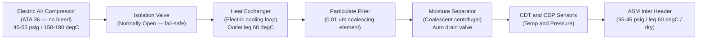
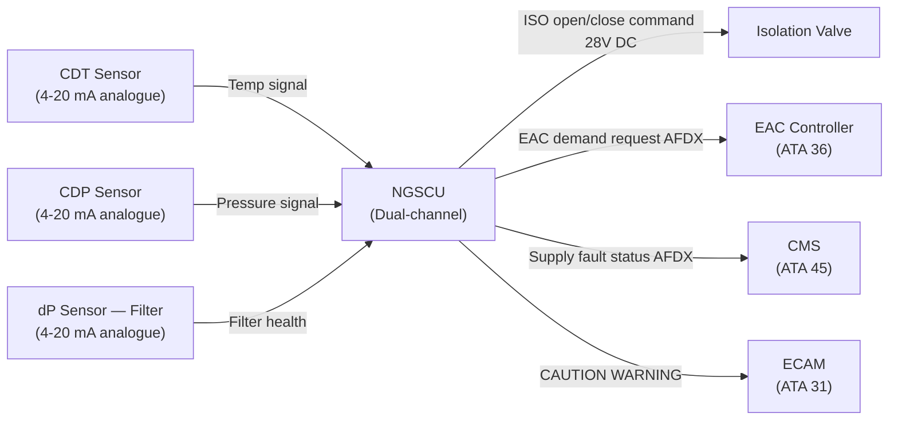
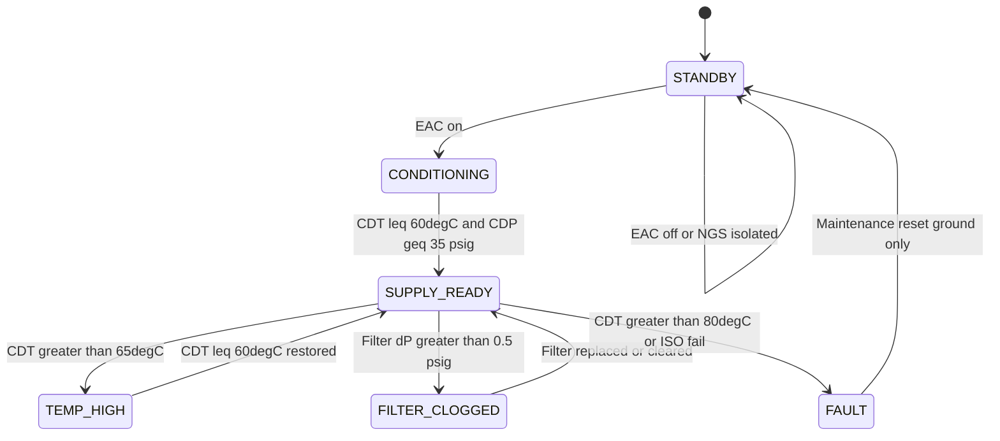

# ATLAS 040-049 · Section 04 · Subsection 047 · 010 — Air Supply and Preconditioning

## §0. Hyperlink Policy

All internal cross-references use relative Markdown links within the Q+ATLANTIDE CSDB repository. External regulatory citations in §19/§20 are marked  where hyperlinks are pending. Parent context: [ATLAS 047 README](./README.md). Related documents are linked in §20.

---

## §1. Purpose

This document defines the Air Supply and Preconditioning sub-system of ATA 47 NGS for the AMPEL360E eWTW. The AMPEL360E eWTW operates with **no engine bleed-air**; all compressed air for the Nitrogen Generation System is supplied exclusively by Electric Air Compressors (EAC) interfaced via the ATA 36 bleed-less pneumatic branch.

The air supply preconditioning function ensures that compressed air delivered to the Air Separation Modules (ASM) meets the quality requirements for hollow-fiber membrane separation: particulate-free (≥ 0.01 μm filtration), moisture-separated, and temperature-conditioned (< 60°C inlet to ASM). The EAC delivers air at 45–55 psig and 150–180°C; the preconditioning assembly pre-cools, filters, and de-moisturises this flow before it reaches the ASM inlet header.

Key governance areas:
- EAC compressed air delivery specification (ATA 36 interface).
- Particulate filtration (0.01 μm coalescing element).
- Coalescent moisture separator with automatic drain valve.
- Heat exchanger for EAC discharge temperature reduction.
- Isolation valve for NGS shutdown and maintenance isolation.
- Temperature and pressure sensing for NGSCU closed-loop monitoring.
- Primary Q-Division: Q-AIR; Support: Q-MECHANICS, Q-DATAGOV.

---

## §2. Applicability

| Attribute | Value |
|-----------|-------|
| Aircraft Program | AMPEL360E eWTW |
| ATA Chapter / Sub-subject | ATA 47.010 — Air Supply and Preconditioning |
| Certification Basis | CS-25 Amendment 28; FAR 25.981 |
| Applicable Standards | DO-160G; S1000D Issue 5.0; MIL-STD-704F |
| Air Supply Source | Electric Air Compressor (EAC) — no engine bleed |
| EAC Delivery Condition | 45–55 psig; 150–180°C at EAC outlet |
| ASM Inlet Condition | ≤ 35–45 psig; ≤ 60°C; particulate-free; dry |
| S1000D SNS | 047-010 |

---

## §3. Functional Description

The Air Supply and Preconditioning assembly receives high-temperature, high-pressure compressed air from the Electric Air Compressor (EAC) output and conditions it for delivery to the ASM inlet header. The functional stages are:

1. **Isolation Valve (ISO)**: Normally open, electrically actuated valve allowing NGSCU-commanded NGS isolation during fault conditions or ground maintenance. Fail-safe open.
2. **Heat Exchanger**: Ram-air or ECS-bleed-less liquid cooled heat exchanger reducing EAC discharge temperature from 150–180°C to ≤ 60°C. On the eWTW, the heat exchanger uses dedicated electric cooling loop — no ECS bleed involved.
3. **Particulate Filter**: Coalescing filter with 0.01 μm rated element capturing airborne particulates and liquid aerosols. Differential pressure sensor monitors filter health; NGSCU triggers maintenance alert at ΔP > 0.5 psig.
4. **Moisture Separator**: Centrifugal coalescent separator removing free water and oil vapour. Automatic drain valve opens on ground; manual override available via ECAM maintenance mode.
5. **Temperature and Pressure Sensors**: CDT (Compressor Discharge Temperature Sensor) and CDP (Compressor Discharge Pressure) sensors feed NGSCU for supply monitoring and EAC demand management.

### §3.1 Preconditioning Functional Stages

| Stage | Function | Outlet Condition |
|-------|----------|-----------------|
| EAC outlet | Compressed air source | 45–55 psig; 150–180°C |
| Isolation valve | NGS / maintenance isolation | Unchanged (when open) |
| Heat exchanger | Temperature reduction | ≤ 60°C |
| Particulate filter | Particulate removal (≥ 0.01 μm) | Clean, dry |
| Moisture separator | Free water / oil removal | RH < 10% dew-point |
| ASM inlet header | Conditioned supply to ASMs | 35–45 psig; ≤ 60°C; dry |

### Diagram 1: Air Supply Preconditioning Flow

---

## §4. System Architecture

The preconditioning assembly is installed in the EE bay / belly fairing, downstream of the EAC outlet duct. The complete assembly is packaged as a single Line-Replaceable Unit (LRU) — the Particulate Filter / Moisture Separator Assembly — to simplify maintenance access and minimise scheduled downtime. The heat exchanger is separately mounted and fed by the aircraft electric cooling loop.

The isolation valve is commanded by the NGSCU via a 28 V DC discrete output. In normal operation the ISO is held open by the NGSCU; loss of NGSCU power or deliberate NGS shutdown causes the ISO to revert to its fail-safe open position (NGS continues to operate in degraded mode without NGSCU valve control). A separate manual isolation handle is provided in the EE bay for ground maintenance.

NGSCU monitors CDT and CDP sensors via analogue inputs (4–20 mA). If CDT exceeds 65°C at the ASM inlet, the NGSCU generates a CAUTION "NGS AIR SUPPLY TEMP HIGH" on ECAM and reduces EAC demand request. If CDP drops below 30 psig, inerting capacity warning is generated.

### Diagram 2: Air Supply Data and Signal Flow

---

## §5. Components and Line-Replaceable Units

| LRU | Part Number | Qty | Location | Replacement Interval |
|-----|-------------|-----|----------|----------------------|
| Particulate Filter / Moisture Separator Assembly | TBD | 1 | EE bay / EAC outlet duct | 3,000 FH or C-check |
| Heat Exchanger (electric cooling) | TBD | 1 | EE bay / belly fairing | On-condition |
| Isolation Valve (ISO) | TBD | 1 | EAC outlet duct upstream of HEX | On-condition / 8,000 FH |
| CDT Sensor | TBD | 1 | ASM inlet header | 6,000 FH |
| CDP Sensor | TBD | 1 | ASM inlet header | 6,000 FH |
| Filter dP Sensor | TBD | 1 | Filter inlet/outlet ports | 6,000 FH |
| Drain Valve (moisture separator) | TBD | 1 | Moisture separator bowl | 6,000 FH |

---

## §6. Interfaces

| Interface | Peer System | Protocol / Bus | Data Exchanged |
|-----------|-------------|----------------|----------------|
| EAC compressed air supply | ATA 36 Pneumatic (EAC) | Pneumatic duct | 45–55 psig compressed air |
| EAC demand signal | ATA 36 EAC Controller | AFDX (ARINC 664 P7) | NGS air demand request |
| Electric cooling loop | Aircraft thermal management | Coolant circuit | Heat rejection from HEX |
| ISO valve command | NGSCU Channel A/B | 28 V DC discrete | Open / close command |
| CDT/CDP/dP sensor data | NGSCU analogue inputs | 4–20 mA analogue | Temperature, pressure, dP |
| Fault / maintenance data | ATA 45 CMS | AFDX | Supply sub-system fault codes |
| ECAM alerting | ATA 31 Indicating | ARINC 664 P7 | CAUTION / WARNING messages |

---

## §7. Operations and Modes

| Mode | Trigger | ISO State | HEX Cooling | NGSCU Monitoring |
|------|---------|-----------|-------------|-----------------|
| STANDBY | Pre-flight, EAC off | Open | Off | Sensors polled |
| CONDITIONING | EAC on, warmup phase | Open | Active | CDT decreasing |
| SUPPLY READY | CDT ≤ 60°C, CDP ≥ 35 psig | Open | Active | Normal supply |
| TEMP HIGH | CDT > 65°C at ASM inlet | Open | Active (max) | CAUTION on ECAM |
| FILTER CLOGGED | Filter dP > 0.5 psig | Open | Active | CAUTION maintenance alert |
| FAULT | CDT > 80°C or ISO fail | Closed (if commanded) | Active | WARNING; EAC demand reduced |

### Diagram 3: Air Supply Preconditioning Lifecycle FSM

---

## §8. Performance and Budgets

| Parameter | Requirement | Target | Status |
|-----------|-------------|--------|--------|
| EAC outlet pressure | 45–55 psig | 50 psig nominal |  |
| EAC outlet temperature | 150–180°C | 165°C nominal |  |
| ASM inlet temperature | ≤ 60°C | 55°C nominal |  |
| ASM inlet pressure | 35–45 psig | 40 psig nominal |  |
| Filter element efficiency | ≥ 99.97% at 0.01 μm | 99.99% |  |
| Filter maintenance trigger (dP) | > 0.5 psig | 0.4 psig alert |  |
| Moisture separator outlet dew-point | < −20°C | −30°C typical |  |
| ISO valve response time | < 500 ms | 300 ms |  |

---

## §9. Safety, Redundancy and Fault Tolerance

- **EAC-only architecture**: Eliminates bleed-air contamination and thermal runaway risks associated with engine bleed ducting.
- **Fail-safe ISO valve**: Defaults to open on power loss, ensuring NGS continues to operate (degraded) even without NGSCU command.
- **Heat exchanger failure protection**: Over-temperature CDT threshold (65°C CAUTION, 80°C WARNING/ISO close) protects ASM membranes from thermal damage.
- **Filter bypass not provided**: No bypass path exists; clogged filter will degrade ASM supply but triggers maintenance alert well before NGS performance impact.
- **Moisture separator drain**: Automatic drain valve prevents liquid water accumulation in separator bowl, protecting ASM hollow-fiber from liquid ingestion.
- **Redundant sensing**: CDT and CDP sensors have dual-element construction; NGSCU uses average of both elements for control; single element failure triggers advisory.
- **No single-point failure**: Loss of preconditioning assembly causes NGS degraded mode only; aircraft remains airworthy per MMEL provisions.

---

## §10. Maintenance and Diagnostics

| Task | Interval | Access | Tools Required |
|------|----------|--------|----------------|
| Filter / separator replacement | 3,000 FH or C-check | EE bay panel (zone 180) | Standard LRU toolkit |
| Filter dP sensor functional check | 3,000 FH | NGSCU IBIT (ECAM maintenance) | None |
| CDT/CDP sensor calibration check | 6,000 FH | EE bay panel (zone 180) | Calibrated reference gauge/thermometer |
| ISO valve operational test | A-check | NGSCU IBIT (ground, WOW interlock) | None |
| Heat exchanger visual inspection | B-check | Belly fairing access | Inspection lamp |
| Moisture separator drain valve check | A-check | EE bay panel (zone 180) | None |
| Full assembly leak check | C-check | EE bay / belly fairing | Pressure decay test kit |

---

## §11. Configuration and Software

- NGSCU software controls ISO valve and monitors CDT/CDP/dP — DAL C software functions within NGSCU firmware.
- CDT/CDP threshold values (60°C, 65°C, 80°C; 30 psig, 35 psig) are loaded via NGSCU configuration data module (DLCS uplink).
- EAC demand request signal formatted per AFDX ARINC 664 P7; message rate 10 Hz.
- Filter dP maintenance alert logged to CMS CSDB (S1000D fault data module) on each exceedance event.
- Configuration flag: `BLEF` (Bleed-less Electric Feed) set to TRUE for AMPEL360E eWTW variant; ISO valve logic confirms no bleed-air path.

---

## §12. Environmental and Physical Constraints

| Constraint | Value | Standard |
|------------|-------|----------|
| Operating temperature (filter/separator assembly) | −55°C to +85°C | DO-160G Cat B2 |
| Operating temperature (ISO valve) | −55°C to +125°C (near EAC duct) | DO-160G |
| Vibration (all components) | DO-160G Cat S curve B | DO-160G Section 8 |
| Humidity | 0–100% RH (condensing) | DO-160G Section 6 |
| Max duct pressure | 65 psig burst (2× MAWP) | CS-25 §25.1435 |
| Filter assembly mass (max) | 1.5 kg | TBD |
| ISO valve mass (max) | 0.8 kg | TBD |
| Heat exchanger mass (max) | 2.2 kg | TBD |

---

## §13. Human Factors and Crew Interface

- ECAM CAUTION "NGS AIR SUPPLY TEMP HIGH" (amber) generated when CDT > 65°C at ASM inlet.
- ECAM WARNING "NGS AIR SUPPLY FAULT" (red) generated when CDT > 80°C or ISO valve fails.
- ECAM maintenance synoptic page shows live CDT, CDP, filter dP readings for ground maintenance use.
- Manual ISO valve override handle accessible in EE bay (zone 180) — colour-coded red with safety pin.
- Filter replacement task documented in AMM with step-by-step illustrated procedure (S1000D DM 720).
- No routine crew action required during flight for air supply preconditioning (fully automatic).

---

## §14. Test and Validation

| Test | Method | Criterion | Status |
|------|--------|-----------|--------|
| ISO valve open/close timing | NGSCU IBIT command, ground | Response ≤ 500 ms |  |
| Filter dP alert trigger | Inject reference dP across filter | Alert at 0.5 psig ± 0.05 psig |  |
| CDT over-temperature response | Inject CDT > 65°C signal | CAUTION within 2 s |  |
| Moisture separator drain cycle | Ground drain valve actuation | No water accumulation after 24 h |  |
| Heat exchanger thermal performance | EAC at full flow; measure outlet CDT | CDT ≤ 60°C at all conditions |  |
| Assembly leak check | Pressure decay 35 psig for 10 min | Decay ≤ 0.1 psig |  |
| DO-160G environmental qualification | Qualified test lab | All sections pass |  |

---

## §15. Regulatory Compliance

| Regulation | Requirement | Sub-system Response | Status |
|------------|-------------|---------------------|--------|
| CS-25 §25.981 | Fuel tank flammability reduction | Conditioned air supply enables effective ASM separation |  |
| FAR 25.981 | Fuel tank ignition prevention | EAC supply eliminates bleed-air contamination |  |
| DO-160G | Environmental qualification | All preconditioning LRUs qualified per DO-160G |  |
| S1000D Issue 5.0 | Technical publication standard | CSDB-compatible DM structure |  |
| ARINC 664 P7 | AFDX interface | NGSCU–EAC demand signal and fault reporting |  |
| MIL-STD-704F | Aircraft electric power | 28 V DC ISO valve and sensor power |  |
| SFAR 88 | Fuel system safety | EAC-only supply; no bleed contamination path |  |

---

## §16. Glossary

| Term | Acronym | Definition |
|------|---------|------------|
| Electric Air Compressor | EAC | Electrically driven compressor supplying compressed air to NGS (ATA 36); replaces engine bleed |
| Pressure Swing Adsorption | PSA | Alternative N₂ generation technology; not used in AMPEL360E eWTW (hollow-fiber membrane used instead) |
| High Efficiency Particulate Air | HEPA | High-efficiency particulate filtration; 0.01 μm rated element used in NGS preconditioning assembly |
| Pressure Regulating Valve | PRV | Valve maintaining NGS supply pressure within the ASM operating range |
| Isolation Valve | ISO | Normally-open electrically actuated valve enabling NGS shutdown or maintenance isolation |
| Compressor Discharge Temperature | CDT | Temperature of EAC outlet air; monitored by CDTS sensor; must be ≤ 60°C at ASM inlet |
| Compressor Discharge Temperature Sensor | CDTS | Dual-element analogue sensor (4–20 mA) measuring CDT at the ASM inlet header |
| Bleed-less Electric Feed | BLEF | eWTW-specific architecture flag: NGS air supply from EAC only; no engine bleed path |
| Maintenance Repair Overhaul | MRO | General term for scheduled and unscheduled aircraft maintenance activities |
| Aircraft Maintenance Manual | AMM | S1000D-structured technical publication covering removal, installation, and troubleshooting procedures |

---

## §17. Footprint

### Physical

| Item | Value |
|------|-------|
| Filter / Separator Assembly | ~1.5 kg; inline with EAC outlet duct |
| Heat Exchanger | ~2.2 kg; belly fairing mounting |
| Isolation Valve | ~0.8 kg; EAC duct upstream of HEX |
| CDT / CDP Sensors | ~0.15 kg each; ASM inlet header |
| Filter dP Sensor | ~0.12 kg; filter inlet/outlet |

### Electrical / Data

| Item | Value |
|------|-------|
| ISO valve actuator power | ~8 W (28 V DC) |
| CDT/CDP sensor power | ~1.5 W each (28 V DC loop) |
| AFDX data rate (EAC demand) | < 100 kbps |

### Maintenance

| Item | Value |
|------|-------|
| Filter/separator replacement task time | ~45 min (2 technicians) |
| Shortest scheduled task interval | 3,000 FH |
| Access panel zone | Zone 180 (EE bay) |

---

## §18. Open Issues

| ID | Issue | Owner | Status |
|----|-------|-------|--------|
| NGS-010-OI-001 | Heat exchanger cooling loop sizing not finalised | Q-AIR |  |
| NGS-010-OI-002 | Filter dP alert threshold validation pending rig test | Q-MECHANICS |  |
| NGS-010-OI-003 | CDT sensor dual-element supplier selection in progress | Q-MECHANICS |  |
| NGS-010-OI-004 | ISO valve manual override handle human-factors review pending | Q-AIR |  |

---

## §19. Citations

| Standard | Title | Applicability | Status |
|----------|-------|---------------|--------|
| CS-25 §25.981 | Fuel Tank Ignition Prevention | Preconditioning supports effective inerting |  |
| SFAR 88 | Fuel Tank System Fault Tolerance | EAC-only supply eliminates bleed contamination |  |
| FAR 25.981 | Fuel Tank Ignition Prevention (FAA) | FAA certification basis |  |
| DO-160G | Environmental Conditions and Test Procedures | LRU qualification |  |
| S1000D Issue 5.0 | Technical Publications | CSDB documentation |  |
| ARINC 664 P7 | AFDX Network | EAC demand / fault data |  |
| MIL-STD-704F | Aircraft Electric Power Characteristics | 28 V DC power quality |  |

---

## §20. References

| Document | Title | Link | Status |
|----------|-------|------|--------|
| 047-000 | Nitrogen Generation System General | [047-000](./047-000-Nitrogen-Generation-System-General.md) |  |
| 047-020 | Air Separation Modules | [047-020](./047-020-Air-Separation-Modules.md) |  |
| 047-030 | Nitrogen Enriched Air Distribution | [047-030](./047-030-Nitrogen-Enriched-Air-Distribution.md) |  |
| 047-050 | Flow Control Valves and Pressure Regulation | [047-050](./047-050-Flow-Control-Valves-and-Pressure-Regulation.md) |  |
| 047-080 | NGS Monitoring, Diagnostics and Control Interfaces | [047-080](./047-080-NGS-Monitoring-Diagnostics-and-Control-Interfaces.md) |  |

---

## §21. Feedback and Review

This document is maintained under Q+ATLANTIDE governance. Review requests should be submitted via the Q+ATLANTIDE issue tracker, referencing document ID `QATL-ATLAS-1000-ATLAS-040-049-04-047-010-AIR-SUPPLY-AND-PRECONDITIONING`. Subject-matter expert review is required from Q-AIR (pneumatic/EAC interface) and Q-MECHANICS (LRU specification) before advancing from `to-be-reviewed-by-system-expert` to `approved`.

---

## §22. Change Log

| Version | Date | Author | Description |
|---------|------|--------|-------------|
| 1.0.0 | 2026-05-10 | Q-AIR / Q+ATLANTIDE | Initial baseline creation — Air Supply and Preconditioning |
