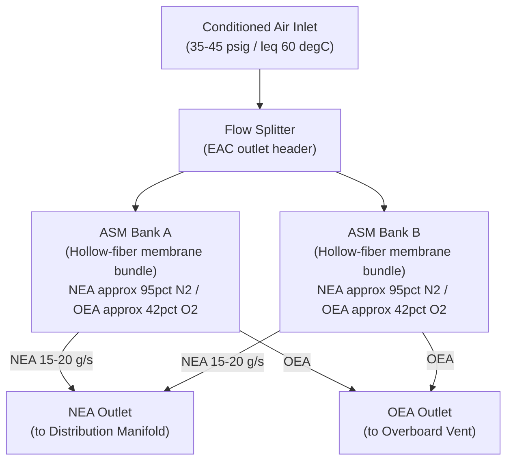
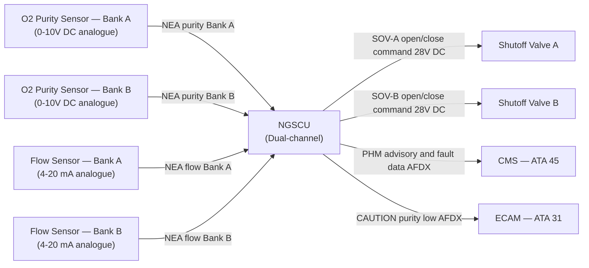
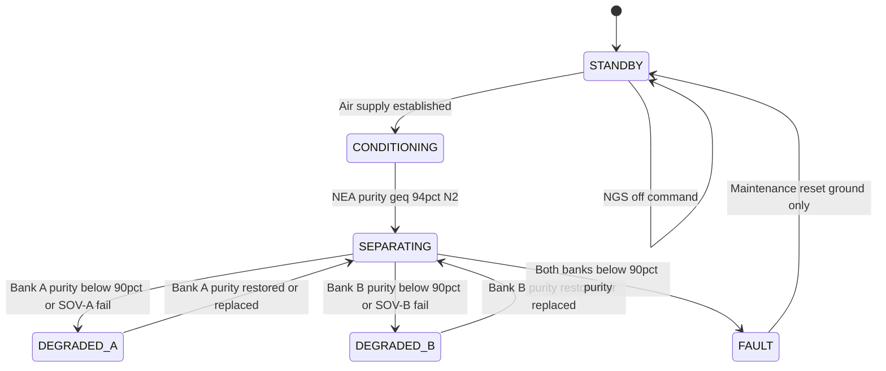

# ATLAS 040-049 · Section 04 · Subsection 047 · 020 — Air Separation Modules

## §0. Hyperlink Policy

All internal cross-references use relative Markdown links within the Q+ATLANTIDE CSDB repository. External regulatory citations in §19/§20 are marked  where hyperlinks are pending. Parent context: [ATLAS 047 README](./README.md). Related documents are linked in §20.

---

## §1. Purpose

This document defines the Air Separation Modules (ASM) sub-system of ATA 47 NGS for the programme-defined aircraft type. The ASM is the core functional element of the Nitrogen Generation System, performing the physical separation of conditioned compressed air into Nitrogen-Enriched Air (NEA) and Oxygen-Enriched Air (OEA) via hollow-fiber membrane (HFM) technology.

The programme-defined aircraft type employs **dual redundant ASM banks** (Bank A and Bank B). Both banks operate simultaneously in normal mode. The system sustains full-inerting capability on a single bank (degraded mode). Membrane degradation is detected by the NGSCU via a drop in differential NEA purity monitored through the TOMS feedback loop.

Key governance areas:
- Hollow-fiber membrane technology and operating envelope.
- Dual-bank redundancy architecture (Bank A and Bank B).
- ASM operating conditions: 35–45 psig; ≤ 60°C inlet temperature; −55°C to +71°C storage.
- NEA purity output: ~95% N₂ (O₂ ≤ 5%) per bank at rated flow.
- Per-bank NEA flow rate: 15–20 g/s at rated conditions.
- ASM life limit: 20,000 flight hours (hard limit — life-limited part).
- PHM prognostic monitoring of membrane degradation via purity trend.
- Primary Q-Division: Q-AIR; Support: Q-MECHANICS.

---

## §2. Applicability

| Attribute | Value |
|-----------|-------|
| Aircraft Program | programme-defined aircraft type |
| ATA Chapter / Sub-subject | ATA 47.020 — Air Separation Modules |
| Certification Basis | CS-25 Amendment 28; FAR 25.981 |
| Applicable Standards | DO-160G Cat B2; S1000D Issue 5.0; MIL-STD-704F |
| Technology | Hollow-fiber membrane (HFM) |
| NEA purity target | ≥ 94% N₂ (≤ 6% O₂) at rated flow |
| Life limit (ASM) | 20,000 FH (hard limit) |
| S1000D SNS | 047-020 |

---

## §3. Functional Description

The Air Separation Module uses hollow-fiber membrane bundles to exploit differential gas permeability: O₂ and H₂O molecules permeate through the polymer membrane wall faster than N₂, producing a high-N₂ permeate-reject stream (NEA) at the tube side outlet and an O₂-enriched permeate stream (OEA) that is collected and vented overboard. Operating pressure 35–45 psig at the ASM inlet drives the transmembrane partial pressure differential required for separation.

Both ASM banks (A and B) operate simultaneously in NORMAL mode, sharing the total NEA demand load equally. Each bank comprises a sealed canister containing multiple hollow-fiber bundles in parallel. The NGSCU monitors NEA purity (via TOMS O₂ feedback) and computes a Purity Degradation Rate (PDR). When PDR exceeds a threshold, the NGSCU PHM module issues an early-warning maintenance advisory before performance falls outside the acceptable inerting window.

### §3.1 ASM Operating Parameters

| Parameter | Bank A | Bank B | Unit |
|-----------|--------|--------|------|
| Inlet pressure | 35–45 | 35–45 | psig |
| Inlet temperature | ≤ 60 | ≤ 60 | °C |
| NEA flow rate (rated) | 15–20 | 15–20 | g/s |
| NEA purity (rated) | ≥ 94% N₂ | ≥ 94% N₂ | % vol |
| OEA purity | ~40–45% O₂ | ~40–45% O₂ | % vol |
| Operating life | 20,000 FH | 20,000 FH | FH |

### Diagram 1: ASM Functional Architecture

---

## §4. System Architecture

The two ASM banks are installed in the EE bay / belly fairing in a side-by-side configuration. Each bank is an independently sealed LRU connected to the common EAC supply header by an individual shutoff valve (SOV-A and SOV-B respectively), allowing single-bank isolation for maintenance without NGS shutdown. The shutoff valves are commanded by the NGSCU; in normal operation both SOVs are open.

A NEA purity sensor (oxygen partial pressure sensor) is installed at each ASM bank outlet and feeds an analogue purity signal (0–10 V DC) to the NGSCU. The NGSCU uses these per-bank purity signals to compute the Purity Degradation Rate (PDR) over a rolling 100-flight-cycle window. If PDR exceeds the threshold (defined in the NGSCU configuration data module), a PHM advisory is generated to the CMS. If purity drops below 90% N₂ on either bank, a CAUTION is generated on ECAM.

### Diagram 2: ASM Data and Signal Flow

---

## §5. Components and Line-Replaceable Units

| LRU | Part Number | Qty | Location | Replacement Interval |
|-----|-------------|-----|----------|----------------------|
| ASM Bank A | TBD | 1 | EE bay / belly fairing | 20,000 FH (life-limited) |
| ASM Bank B | TBD | 1 | EE bay / belly fairing | 20,000 FH (life-limited) |
| Shutoff Valve A (SOV-A) | TBD | 1 | ASM Bank A inlet | On-condition / 8,000 FH |
| Shutoff Valve B (SOV-B) | TBD | 1 | ASM Bank B inlet | On-condition / 8,000 FH |
| O₂ Purity Sensor — Bank A | TBD | 1 | ASM Bank A NEA outlet | 6,000 FH |
| O₂ Purity Sensor — Bank B | TBD | 1 | ASM Bank B NEA outlet | 6,000 FH |
| NEA Flow Sensor — Bank A | TBD | 1 | ASM Bank A NEA outlet | 6,000 FH |
| NEA Flow Sensor — Bank B | TBD | 1 | ASM Bank B NEA outlet | 6,000 FH |

---

## §6. Interfaces

| Interface | Peer System | Protocol / Bus | Data Exchanged |
|-----------|-------------|----------------|----------------|
| Conditioned air supply | ATA 47.010 (EAC / filter assembly) | Pneumatic duct | 35–45 psig; ≤ 60°C conditioned air |
| SOV-A/B command | NGSCU Channel A/B | 28 V DC discrete | Open / close commands |
| NEA purity feedback | NGSCU analogue inputs | 0–10 V DC analogue | O₂ % concentration per bank |
| NEA flow feedback | NGSCU analogue inputs | 4–20 mA analogue | NEA mass flow per bank |
| NEA to distribution manifold | ATA 47.030 | Pneumatic duct | NEA ~95% N₂ at 12–18 psig |
| OEA to vent | ATA 47.040 | Pneumatic duct | OEA ~42% O₂ to overboard vent |
| PHM/fault data | ATA 45 CMS | AFDX (ARINC 664 P7) | PDR trend, fault codes |
| ECAM alerting | ATA 31 | ARINC 664 P7 | CAUTION / WARNING messages |

---

## §7. Operations and Modes

| Mode | Trigger | Bank A SOV | Bank B SOV | NEA Output |
|------|---------|------------|------------|------------|
| STANDBY | NGS off / pre-PBIT | Closed | Closed | None |
| CONDITIONING | Air supply established; warmup | Open | Open | Below spec (warming) |
| SEPARATING (Normal) | Full operation; purity ≥ 94% | Open | Open | 30–40 g/s total |
| DEGRADED | Bank A SOV failed / purity drop Bank A | Closed | Open | ~15–20 g/s (Bank B only) |
| DEGRADED | Bank B SOV failed / purity drop Bank B | Open | Closed | ~15–20 g/s (Bank A only) |
| FAULT | Both banks below 90% purity | Closed | Closed | None; ECAM WARNING |

### Diagram 3: ASM Lifecycle Finite State Machine

---

## §8. Performance and Budgets

| Parameter | Requirement | Target | Status |
|-----------|-------------|--------|--------|
| NEA purity (per bank, rated) | ≥ 94% N₂ | ~95% N₂ |  |
| NEA flow rate (per bank, rated) | 15–20 g/s | 18 g/s |  |
| OEA purity | ~40–45% O₂ | 42% O₂ |  |
| ASM life limit (hard) | 20,000 FH | 20,000 FH |  |
| Purity degradation rate (PDR) threshold | TBD % per 1,000 FH | TBD |  |
| ASM inlet pressure | 35–45 psig | 40 psig |  |
| ASM inlet temperature | ≤ 60°C | 55°C |  |
| MTBF (per ASM bank) | TBD | TBD |  |

---

## §9. Safety, Redundancy and Fault Tolerance

- **Dual ASM banks**: Loss of one bank results in degraded mode (one-bank operation); NGS continues to inert tanks at ~60% rated flow.
- **Independent shutoff valves**: Each bank has its own SOV, allowing isolation of a failed bank without interrupting the other.
- **PHM prognostic monitoring**: PDR-based early warning ensures membrane replacement is scheduled before performance falls outside acceptance window.
- **No ASM bypass**: No bypass path around ASM is provided; ASM clog or failure results in reduced NEA flow, triggering NGSCU inerting alarm.
- **Purity sensor redundancy**: Each bank has one purity sensor; sensor failure is detected by NGSCU CBIT and triggers an advisory (not a full NGS fault).
- **Life-limit tracking**: ASM bank flight hours tracked in aircraft technical log; NGSCU PHM module provides remaining-life display on ECAM maintenance page.
- **No ignition sources**: ASM canister constructed from non-sparking materials; no electrical components inside OEA path.

---

## §10. Maintenance and Diagnostics

| Task | Interval | Access | Tools Required |
|------|----------|--------|----------------|
| ASM Bank A / B replacement | 20,000 FH (hard limit) | Belly fairing access panel | Standard LRU toolkit |
| O₂ purity sensor calibration | 6,000 FH | ASM outlet port | Calibrated O₂ reference gas kit |
| NEA flow sensor calibration | 6,000 FH | ASM outlet port | Calibrated flow reference |
| SOV operational test | A-check (IBIT) | NGSCU IBIT, ground, WOW interlock | None |
| ASM visual inspection (canister integrity) | B-check | Belly fairing panel | Inspection lamp; borescope |
| PHM trend review | Every C-check | ECAM maintenance page / CMS download | None |
| Full NGS performance test (post-replacement) | After ASM replacement | Ground rig | NEA purity analyser |

---

## §11. Configuration and Software

- ASM Bank part number and serial number logged in NGSCU configuration data module at each replacement.
- NGSCU PHM purity degradation model parameters (PDR thresholds) loaded via DLCS ground uplink; version-controlled per DO-200B.
- NGSCU SOV command logic: SOV-A and SOV-B normally commanded open; closed only on NGSCU bank isolation command (fault or maintenance).
- Life-limit tracking: NGSCU counts FH per ASM bank from installation date; displays remaining life on ECAM maintenance page.
- Purity sensor calibration coefficients stored in NGSCU configuration file; updated at each sensor calibration cycle.

---

## §12. Environmental and Physical Constraints

| Constraint | Value | Standard |
|------------|-------|----------|
| Operating temperature (ASM) | −55°C to +71°C | DO-160G Cat B2 |
| Storage temperature (ASM) | −65°C to +85°C | DO-160G |
| Vibration (ASM canister) | DO-160G Cat S curve B | DO-160G Section 8 |
| Humidity | 0–100% RH (condensing) | DO-160G Section 6 |
| Altitude | 0–51,000 ft | DO-160G Section 4 |
| Max operating pressure | 55 psig (1.5× MAWP = 67.5 psig burst) | CS-25 §25.1435 |
| ASM Bank mass (max) | 8 kg per bank | TBD |
| ASM canister material | Aluminium / composite housing; PTFE tubing | TBD |

---

## §13. Human Factors and Crew Interface

- ECAM CAUTION "NGS ASM BANK FAULT" (amber) when purity drops below 90% on one bank.
- ECAM WARNING "NGS FAULT — INERTING DEGRADED" (red) when both banks below 90% purity.
- ECAM maintenance page displays per-bank NEA purity (live), NEA flow, remaining ASM life (FH).
- PHM advisory "ASM BANK A/B LIFE — MAINTENANCE REQUIRED" generated by NGSCU and displayed on ECAM maintenance page when PDR exceeds threshold.
- ASM Bank replacement task uses illustrated S1000D AMM DM 720 procedure; average task time ~90 min (1 technician, belly panel access).
- No routine crew action required for ASM in normal operation.

---

## §14. Test and Validation

| Test | Method | Criterion | Status |
|------|--------|-----------|--------|
| NEA purity at rated flow | Ground rig: measure O₂ at ASM outlet with calibrated analyser | O₂ ≤ 6% at 18 g/s |  |
| NEA flow rate | Flow meter at ASM NEA outlet; NGSCU IBIT | 15–20 g/s per bank |  |
| Single-bank degraded mode | SOV-A commanded closed; measure total NEA flow | ≥ 15 g/s from Bank B |  |
| PDR detection accuracy | Inject known purity degradation signal; check PHM alert | Alert within 100 FH of PDR threshold |  |
| Purity sensor calibration accuracy | Reference gas injection at known O₂ concentration | Sensor ± 0.5% O₂ |  |
| DO-160G environmental qualification | Qualified test lab | All Cat B2 sections pass |  |
| Life-limit test (accelerated) | Accelerated membrane test (pressure cycling) | Purity ≥ 90% at 20,000 FH equivalent |  |

---

## §15. Regulatory Compliance

| Regulation | Requirement | ASM Response | Status |
|------------|-------------|--------------|--------|
| CS-25 §25.981 | Fuel tank flammability reduction | ASM provides NEA to achieve O₂ < 9% in tank ullage |  |
| FAR 25.981 | Fuel tank ignition prevention | Dual-bank ASM ensures reliable NEA supply |  |
| SFAR 88 | Fuel tank system safety | No ignition sources in ASM OEA path |  |
| DO-160G | Environmental qualification | ASM Cat B2 qualification |  |
| S1000D Issue 5.0 | Technical publications | CSDB-compatible documentation |  |
| ARINC 664 P7 | AFDX interface | PHM/fault data to CMS |  |
| MIL-STD-704F | Aircraft electric power | 28 V DC SOV power |  |

---

## §16. Glossary

| Term | Acronym | Definition |
|------|---------|------------|
| Air Separation Module | ASM | Hollow-fiber membrane canister separating compressed air into NEA and OEA |
| Hollow-Fiber Membrane | HFM | Polymer membrane technology exploiting differential O₂/N₂ permeability for air separation |
| Nitrogen-Enriched Air | NEA | ASM outlet stream with ≥ 94% N₂; injected into fuel tank ullages to reduce O₂ concentration |
| Oxygen-Enriched Air | OEA | ASM permeate stream with ~40–45% O₂; safely vented overboard |
| NGS Control Unit | NGSCU | Dual-channel avionics LRU commanding ASM shutoff valves and monitoring purity/flow |
| Prognostic Health Management | PHM | NGSCU software module estimating ASM remaining useful life from purity degradation trend |
| Flight Hours | FH | Accumulated flight hours from aircraft log; used to track ASM life consumption |
| Purity Degradation Rate | PDR | Rate of decline in NEA purity (% N₂ per 1,000 FH); PHM trigger for maintenance advisory |
| Line-Replaceable Unit | LRU | Aircraft component designed for rapid removal and replacement at line maintenance |
| Mean Time Between Failures | MTBF | Statistical measure of average operating time between unscheduled removals for an LRU |

---

## §17. Footprint

### Physical

| Item | Value |
|------|-------|
| ASM Bank (each) | ~8 kg; ~0.04 m³; belly fairing panel |
| SOV (each) | ~0.6 kg; inline with bank inlet duct |
| O₂ Purity Sensor (each) | ~0.2 kg; flush-mount bank outlet port |
| NEA Flow Sensor (each) | ~0.3 kg; inline bank outlet duct |

### Electrical / Data

| Item | Value |
|------|-------|
| SOV actuator power (each) | ~8 W (28 V DC) |
| Purity sensor power (each) | ~1.5 W (0–10 V DC loop) |
| Flow sensor power (each) | ~1.5 W (4–20 mA loop) |
| AFDX PHM data rate | < 50 kbps |

### Maintenance

| Item | Value |
|------|-------|
| ASM hard life limit | 20,000 FH |
| ASM replacement task time | ~90 min (1 technician) |
| PHM trend review frequency | Every C-check |

---

## §18. Open Issues

| ID | Issue | Owner | Status |
|----|-------|-------|--------|
| NGS-020-OI-001 | ASM Bank supplier qualification plan not yet submitted | Q-MECHANICS |  |
| NGS-020-OI-002 | PDR threshold values require extended rig test data | Q-AIR |  |
| NGS-020-OI-003 | Accelerated life test protocol definition in progress | Q-MECHANICS |  |
| NGS-020-OI-004 | OEA purity measurement at low altitude — verification needed | Q-AIR |  |

---

## §19. Citations

| Standard | Title | Applicability | Status |
|----------|-------|---------------|--------|
| CS-25 §25.981 | Fuel Tank Ignition Prevention | ASM provides NEA for flammability reduction |  |
| SFAR 88 | Fuel Tank System Safety | No ignition sources in OEA path |  |
| FAR 25.981 | Fuel Tank Ignition Prevention (FAA) | FAA certification basis |  |
| DO-160G | Environmental Conditions and Test Procedures | ASM Cat B2 qualification |  |
| S1000D Issue 5.0 | Technical Publications | CSDB documentation |  |
| ARINC 664 P7 | AFDX Network | PHM/fault data to CMS |  |
| MIL-STD-704F | Aircraft Electric Power | 28 V DC SOV power |  |

---

## §20. References

| Document | Title | Link | Status |
|----------|-------|------|--------|
| 047-000 | Nitrogen Generation System General | [047-000](./047-000-Nitrogen-Generation-System-General.md) |  |
| 047-010 | Air Supply and Preconditioning | [047-010](./047-010-Air-Supply-and-Preconditioning.md) |  |
| 047-030 | Nitrogen Enriched Air Distribution | [047-030](./047-030-Nitrogen-Enriched-Air-Distribution.md) |  |
| 047-040 | Oxygen Enriched Air Exhaust and Venting | [047-040](./047-040-Oxygen-Enriched-Air-Exhaust-and-Venting.md) |  |
| 047-080 | NGS Monitoring, Diagnostics and Control Interfaces | [047-080](./047-080-NGS-Monitoring-Diagnostics-and-Control-Interfaces.md) |  |

---

## §21. Feedback and Review

This document is maintained under Q+ATLANTIDE governance. Review requests should be submitted via the Q+ATLANTIDE issue tracker, referencing document ID `QATL-ATLAS-1000-ATLAS-040-049-04-047-020-AIR-SEPARATION-MODULES`. Subject-matter expert review is required from Q-AIR (NGS/membrane technology) and Q-MECHANICS (LRU qualification and life-limit setting) before advancing from `to-be-reviewed-by-system-expert` to `approved`.

---

## §22. Change Log

| Version | Date | Author | Description |
|---------|------|--------|-------------|
| 1.0.0 | 2026-05-10 | Q-AIR / Q+ATLANTIDE | Initial baseline creation — Air Separation Modules |
