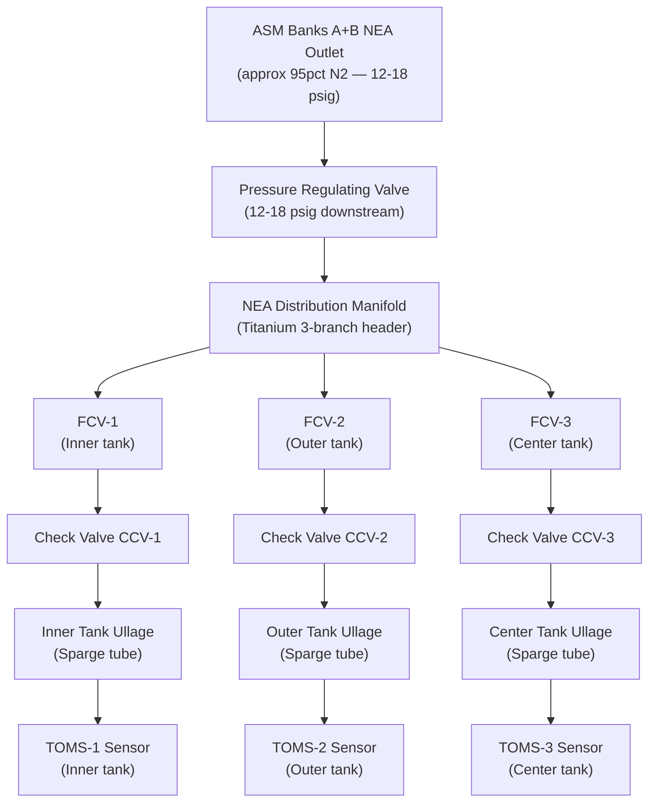
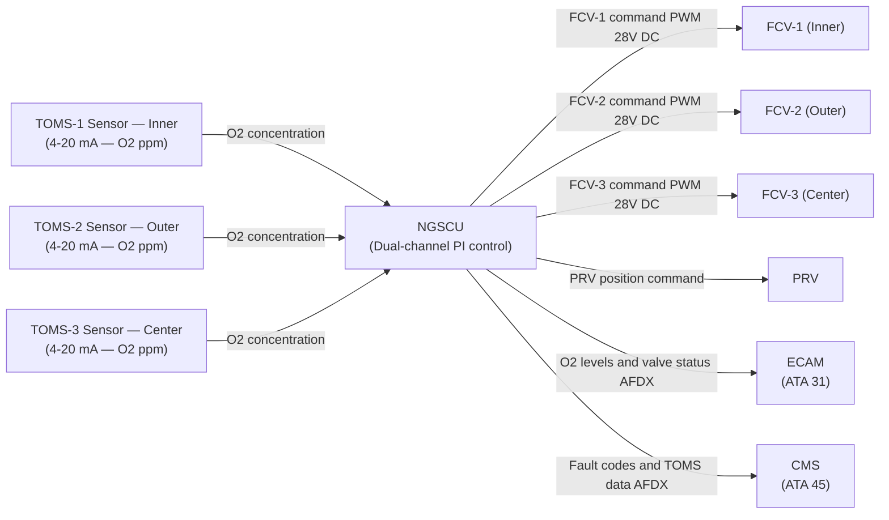
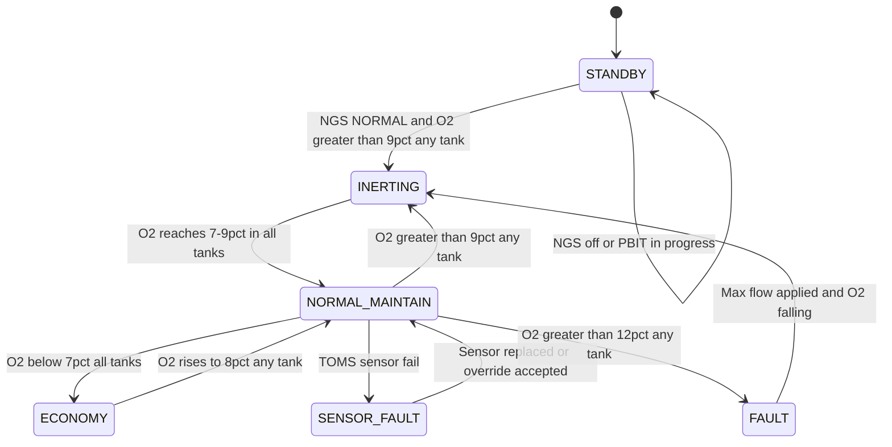

# ATLAS 040-049 · Section 04 · Subsection 047 · 030 — Nitrogen Enriched Air Distribution

## §0. Hyperlink Policy

All internal cross-references use relative Markdown links within the Q+ATLANTIDE CSDB repository. External regulatory citations in §19/§20 are marked  where hyperlinks are pending. Parent context: [ATLAS 047 README](./README.md). Related documents are linked in §20.

---

## §1. Purpose

This document defines the Nitrogen Enriched Air (NEA) Distribution sub-system of ATA 47 NGS for the AMPEL360E eWTW. The NEA Distribution sub-system collects NEA output from both ASM banks, regulates line pressure to 12–18 psig, and delivers it to the fuel tank ullage spaces via sparge tubes through dedicated Flow Control Valves (FCVs) per tank branch (inner, outer, and center tanks).

The Tank Oxygen Monitoring System (TOMS) sensors installed in each tank ullage provide real-time O₂ concentration feedback to the NGSCU, which modulates the FCVs in a closed-loop control scheme to maintain ullage O₂ below 9% by volume (the TOMS inerting threshold). NEA injection pressure must not exceed the fuel tank structural differential pressure limit (< 2 psig above ullage pressure).

Key governance areas:
- NEA distribution manifold collecting output from ASM banks A and B.
- Per-tank FCV (flow control valve) modulating NEA delivery to each tank.
- Check valve on each tank branch preventing fuel vapour backflow into the manifold.
- TOMS sensors (one per tank: inner, outer, center) feeding closed-loop O₂ control.
- NEA sparge tube routing inside each tank for uniform gas distribution.
- NGSCU closed-loop control: FCV modulation based on TOMS O₂ feedback.
- Primary Q-Division: Q-AIR; Support: Q-MECHANICS.

---

## §2. Applicability

| Attribute | Value |
|-----------|-------|
| Aircraft Program | AMPEL360E eWTW |
| ATA Chapter / Sub-subject | ATA 47.030 — NEA Distribution |
| Certification Basis | CS-25 Amendment 28; FAR 25.981 |
| Applicable Standards | DO-160G; S1000D Issue 5.0; ARINC 664 P7 |
| NEA distribution pressure | 12–18 psig |
| TOMS inerting threshold | O₂ < 9% by volume |
| Tanks served | Inner, Outer, Center fuel tanks |
| S1000D SNS | 047-030 |

---

## §3. Functional Description

NEA from the dual ASM banks is collected at a common distribution manifold operating at 12–18 psig. The manifold is a titanium three-branch header; each branch serves one fuel tank group (inner, outer, center) and is equipped with an electrically actuated Flow Control Valve (FCV) commanded by the NGSCU. Downstream of each FCV is a check valve preventing fuel vapour from migrating back into the manifold during flight manoeuvres or on-ground tank pressure equalisation.

NEA is injected into each tank ullage via sparge tubes — perforated titanium tube arrays routed along the upper inboard wall of each tank structure. Uniform distribution of NEA across the ullage minimises local O₂ pockets. Each TOMS sensor reports O₂ concentration (ppm) to the NGSCU at 4 Hz. The NGSCU implements a proportional-integral (PI) control loop: if TOMS reads O₂ > 9%, the corresponding FCV opens further; if O₂ < 7%, FCV modulates to reduce NEA flow and conserve ASM capacity.

### §3.1 NEA Distribution Branches

| Branch | Tank | FCV | Check Valve | TOMS Sensor | Sparge Tube Length |
|--------|------|-----|-------------|-------------|-------------------|
| Branch 1 | Inner fuel tank (port + stbd) | FCV-1 | CCV-1 | TOMS-1 | TBD m |
| Branch 2 | Outer fuel tank (port + stbd) | FCV-2 | CCV-2 | TOMS-2 | TBD m |
| Branch 3 | Center fuel tank | FCV-3 | CCV-3 | TOMS-3 | TBD m |

### Diagram 1: NEA Distribution Functional Architecture

---

## §4. System Architecture

The NEA distribution system uses a centralised manifold located in the center fuselage (zone 147), from which titanium alloy ducts route to each tank group. The NGSCU implements independent closed-loop PI control for each tank branch, using the corresponding TOMS sensor as the process variable and the branch FCV as the control element.

NEA injection pressure is maintained below the fuel tank structural differential limit (< 2 psig above ullage pressure) by the PRV installed upstream of the manifold. The check valves (CCVs) on each branch are spring-loaded and rated for 50 psid differential to prevent fuel vapour contamination of the NEA manifold in the event of downstream pressure transients. TOMS sensor data is reported to the NGSCU via 4–20 mA analogue loops, sampled at 4 Hz per sensor.

### Diagram 2: NEA Distribution Data and Signal Flow

---

## §5. Components and Line-Replaceable Units

| LRU | Part Number | Qty | Location | Replacement Interval |
|-----|-------------|-----|----------|----------------------|
| NEA Distribution Manifold | TBD | 1 | Center fuselage zone 147 | On-condition |
| PRV (manifold inlet) | TBD | 1 | Manifold inlet | On-condition / 8,000 FH |
| FCV-1 (inner tank branch) | TBD | 1 | Inner tank duct branch | On-condition / 8,000 FH |
| FCV-2 (outer tank branch) | TBD | 1 | Outer tank duct branch | On-condition / 8,000 FH |
| FCV-3 (center tank branch) | TBD | 1 | Center tank duct branch | On-condition / 8,000 FH |
| CCV-1 (inner tank check valve) | TBD | 1 | Inner branch downstream FCV | On-condition |
| CCV-2 (outer tank check valve) | TBD | 1 | Outer branch downstream FCV | On-condition |
| CCV-3 (center tank check valve) | TBD | 1 | Center branch downstream FCV | On-condition |
| TOMS-1 Sensor | TBD | 1 | Inner tank access panel | 10,000 FH |
| TOMS-2 Sensor | TBD | 1 | Outer tank access panel | 10,000 FH |
| TOMS-3 Sensor | TBD | 1 | Center tank access panel | 10,000 FH |
| Sparge Tube Assembly | TBD | 3 | Upper inboard wall of each tank | On-condition |

---

## §6. Interfaces

| Interface | Peer System | Protocol / Bus | Data Exchanged |
|-----------|-------------|----------------|----------------|
| NEA supply from ASM banks | ATA 47.020 | Pneumatic duct | NEA ~95% N₂ at 12–18 psig |
| FCV commands (3 branches) | NGSCU Channel A/B | 28 V DC PWM | Valve position commands |
| TOMS sensor data (3 tanks) | NGSCU analogue inputs | 4–20 mA analogue | O₂ concentration per tank |
| Fuel tank structural interface | ATA 28 Fuel System | Mechanical / duct | NEA feed point in tank access panel |
| CMS fault reporting | ATA 45 CMS | AFDX (ARINC 664 P7) | TOMS data, FCV faults |
| ECAM display | ATA 31 Indicating | ARINC 664 P7 | Per-tank O₂, FCV status |

---

## §7. Operations and Modes

| Mode | TOMS O₂ Reading | FCV State | NEA Flow | NGSCU Control Action |
|------|----------------|-----------|----------|----------------------|
| INERTING (active) | O₂ > 9% (any tank) | FCV open (modulated) | Maximum flow to affected tank | PI loop increases NEA until O₂ < 9% |
| NORMAL (maintain) | 7% ≤ O₂ ≤ 9% | FCV modulated | Maintenance flow | PI loop holds O₂ in target band |
| ECONOMY | O₂ < 7% (all tanks) | FCV partially closed | Reduced flow | PI loop reduces NEA to conserve ASM |
| SENSOR FAULT | TOMS sensor fail | FCV held at last valid position | Unchanged | Advisory to CMS; no PI loop on failed branch |
| FAULT | O₂ > 12% (any tank) | FCV full open | Maximum | WARNING on ECAM; max flow override |

### Diagram 3: NEA Distribution Control FSM

---

## §8. Performance and Budgets

| Parameter | Requirement | Target | Status |
|-----------|-------------|--------|--------|
| TOMS inerting threshold | < 9% O₂ by volume | 8.5% typical |  |
| NEA injection pressure | < 2 psig above ullage pressure | 1.5 psig typical |  |
| Manifold operating pressure | 12–18 psig | 15 psig nominal |  |
| FCV position accuracy | ± 2° | ± 1.5° |  |
| FCV response time | < 200 ms | 150 ms |  |
| TOMS sensor sampling rate | 4 Hz | 4 Hz |  |
| PI control loop bandwidth | TBD Hz | TBD |  |
| Check valve backflow limit | Zero backflow at 50 psid | Zero |  |

---

## §9. Safety, Redundancy and Fault Tolerance

- **Closed-loop TOMS control**: Real-time O₂ concentration monitoring prevents persistent ullage O₂ exceedances above 12%.
- **Check valves (CCVs)**: Spring-loaded CCVs on each branch prevent fuel vapour from contaminating the NEA manifold.
- **Per-tank FCV independence**: Loss of one FCV affects only one tank branch; other tanks continue inerting.
- **TOMS sensor failure handling**: On sensor failure, NGSCU holds FCV at last valid position and generates advisory; does not cause NGS shutdown.
- **PRV overpressure protection**: PRV limits NEA injection pressure to prevent exceeding fuel tank structural differential limit.
- **Sparge tube passive distribution**: Passive sparge tube arrays ensure NEA distribution across ullage with no active moving parts inside the tank.
- **WARNING threshold at 12%**: ECAM WARNING "FUEL TANK O2 HIGH" generated before reaching upper flammability limit.

---

## §10. Maintenance and Diagnostics

| Task | Interval | Access | Tools Required |
|------|----------|--------|----------------|
| TOMS sensor functional check (each) | 3,000 FH | Tank access panel (per tank) | O₂ calibration gas kit |
| FCV position calibration (each) | 8,000 FH | Tank branch duct access | NGSCU IBIT + calibration tool |
| Check valve operational test (each) | B-check | Branch duct access | Pressure decay / flow test kit |
| NEA manifold leak check | C-check | Center fuselage zone 147 | Pressure decay test kit |
| Sparge tube visual inspection | C-check | Fuel tank access panel | Inspection lamp / borescope |
| TOMS sensor replacement | 10,000 FH | Tank access panel | Standard toolkit |

---

## §11. Configuration and Software

- NGSCU PI control loop gains (Kp, Ki) for each tank branch stored in configuration data module; updated via DLCS uplink.
- TOMS sensor calibration coefficients loaded in NGSCU per-sensor configuration record.
- FCV position feedback zero/span calibration stored in NGSCU configuration data.
- O₂ threshold values (9%, 7%, 12%) configurable in NGSCU software via certified configuration change process (DO-178C DAL C).
- All TOMS data (O₂ concentration per tank, timestamp, FCV position) recorded in QAR at 4 Hz for post-flight analysis.

---

## §12. Environmental and Physical Constraints

| Constraint | Value | Standard |
|------------|-------|----------|
| Operating temperature (manifold / FCV) | −55°C to +71°C | DO-160G Cat B2 |
| Fuel compatibility (sparge tubes) | Jet-A / Jet-A1 compatible titanium alloy | CS-25 §25.981 |
| Manifold operating pressure (max) | 25 psig (1.5× MAWP) | CS-25 §25.1435 |
| Vibration (manifold) | DO-160G Cat S curve B | DO-160G Section 8 |
| TOMS sensor humidity tolerance | 0–100% RH (condensing) | DO-160G Section 6 |
| NEA manifold mass (max) | 2.5 kg | TBD |
| Sparge tube material | Titanium alloy Grade 5 (Ti-6Al-4V) | TBD |

---

## §13. Human Factors and Crew Interface

- ECAM NGS synoptic page shows per-tank O₂ concentration (live bar graph), FCV positions (valve icons), and TOMS sensor status.
- ECAM CAUTION "NGS DISTRIBUTION FAULT" (amber) when any FCV or TOMS sensor fails.
- ECAM WARNING "FUEL TANK O2 HIGH" (red) when any tank TOMS reads O₂ > 12%.
- Maintenance page provides access to per-sensor live readings and FCV position calibration IBIT.
- No routine crew action required during normal flight (fully automatic closed-loop control).
- TOMS sensor replacement task documented in AMM S1000D DM 720 with illustrated procedure.

---

## §14. Test and Validation

| Test | Method | Criterion | Status |
|------|--------|-----------|--------|
| Closed-loop TOMS PI control | Ground rig: inject known O₂ concentration; measure FCV response | O₂ < 9% within 5 s of step input |  |
| FCV response time | NGSCU IBIT: command FCV full-open from closed; measure time | ≤ 200 ms |  |
| CCV backflow prevention | Apply 50 psid reverse pressure; measure leakage | Zero backflow |  |
| TOMS sensor accuracy | Reference O₂ gas injection at 9% and 12% | Sensor ± 0.5% O₂ |  |
| NEA injection pressure | Measure injection pressure at sparge tube inlet | < 2 psig above ullage |  |
| Manifold leak check | Pressure decay at 18 psig; 15 min | Decay ≤ 0.1 psig |  |

---

## §15. Regulatory Compliance

| Regulation | Requirement | Distribution Response | Status |
|------------|-------------|----------------------|--------|
| CS-25 §25.981 | Fuel tank flammability reduction | TOMS closed-loop maintains O₂ < 9% |  |
| FAR 25.981 | Fuel tank ignition prevention | NEA distribution to all tank groups |  |
| SFAR 88 | Fuel tank system safety | No ignition sources in NEA distribution path |  |
| DO-160G | Environmental qualification | FCV and TOMS sensor qualification |  |
| S1000D Issue 5.0 | Technical publications | CSDB documentation |  |
| ARINC 664 P7 | AFDX interface | TOMS data and FCV status to ECAM/CMS |  |
| MIL-STD-704F | Aircraft electric power | 28 V DC FCV and TOMS power |  |

---

## §16. Glossary

| Term | Acronym | Definition |
|------|---------|------------|
| Nitrogen-Enriched Air | NEA | Air stream ~95% N₂ delivered to fuel tank ullages to displace O₂ and reduce flammability |
| Flow Control Valve | FCV | Electrically actuated valve modulating NEA flow to each fuel tank branch |
| Pressure Regulating Valve | PRV | Valve maintaining NEA manifold pressure within 12–18 psig |
| Tank Oxygen Monitoring System | TOMS | Set of O₂ concentration sensors in fuel tank ullages; provides feedback to NGSCU |
| Ullage | — | The gas space above the fuel surface in a fuel tank; the space targeted for NEA inerting |
| Sparge tube | — | Perforated titanium tube inside the tank ullage distributing NEA uniformly |
| O₂ concentration | — | Percentage of oxygen by volume in the ullage gas; TOMS inerting threshold < 9% |
| Check valve | CCV | Spring-loaded one-way valve preventing fuel vapour backflow into the NEA manifold |
| Manifold | — | Common header collecting NEA from ASM banks and distributing it to per-tank branches |
| NGS Control Unit | NGSCU | Dual-channel avionics LRU implementing PI closed-loop control of NEA distribution |

---

## §17. Footprint

### Physical

| Item | Value |
|------|-------|
| NEA Distribution Manifold | ~2.5 kg; titanium; center fuselage zone 147 |
| FCV (each) | ~0.5 kg; inline with tank branch duct |
| CCV (each) | ~0.3 kg; inline downstream of FCV |
| TOMS Sensor (each) | ~0.3 kg; flush-mount tank access panel |
| Sparge Tube Assembly (each tank) | ~0.4 kg; titanium alloy |

### Electrical / Data

| Item | Value |
|------|-------|
| FCV actuator power (each) | ~10 W peak (28 V DC PWM) |
| TOMS sensor power (each) | ~2 W (28 V DC) |
| NGSCU PI control cycle rate | 4 Hz (per TOMS sensor input) |

### Maintenance

| Item | Value |
|------|-------|
| TOMS sensor replacement interval | 10,000 FH |
| Shortest scheduled task | 3,000 FH (TOMS check) |
| Tank access panel zone | Inner: zone 540; Outer: zone 560; Center: zone 147 |

---

## §18. Open Issues

| ID | Issue | Owner | Status |
|----|-------|-------|--------|
| NGS-030-OI-001 | PI control loop gains Kp/Ki require in-flight tuning data | Q-AIR |  |
| NGS-030-OI-002 | Sparge tube routing inside center tank not finalised (structural interface) | Q-MECHANICS |  |
| NGS-030-OI-003 | TOMS sensor supplier selection in progress | Q-MECHANICS |  |
| NGS-030-OI-004 | Check valve cracking pressure specification pending tank pressure analysis | Q-AIR |  |

---

## §19. Citations

| Standard | Title | Applicability | Status |
|----------|-------|---------------|--------|
| CS-25 §25.981 | Fuel Tank Ignition Prevention | TOMS maintains O₂ < 9% per CS-25.981 |  |
| SFAR 88 | Fuel Tank System Safety | No ignition sources in NEA distribution path |  |
| FAR 25.981 | Fuel Tank Ignition Prevention (FAA) | FAA basis for TOMS threshold |  |
| DO-160G | Environmental Conditions and Test Procedures | FCV/TOMS qualification |  |
| S1000D Issue 5.0 | Technical Publications | CSDB documentation |  |
| ARINC 664 P7 | AFDX Network | TOMS/FCV data to CMS/ECAM |  |
| MIL-STD-704F | Aircraft Electric Power | 28 V DC power quality |  |

---

## §20. References

| Document | Title | Link | Status |
|----------|-------|------|--------|
| 047-000 | Nitrogen Generation System General | [047-000](./047-000-Nitrogen-Generation-System-General.md) |  |
| 047-020 | Air Separation Modules | [047-020](./047-020-Air-Separation-Modules.md) |  |
| 047-050 | Flow Control Valves and Pressure Regulation | [047-050](./047-050-Flow-Control-Valves-and-Pressure-Regulation.md) |  |
| 047-060 | System Indication and Warning | [047-060](./047-060-System-Indication-and-Warning.md) |  |
| 047-070 | Fuel Tank Inerting Interfaces | [047-070](./047-070-Fuel-Tank-Inerting-Interfaces.md) |  |
| 047-080 | NGS Monitoring, Diagnostics and Control Interfaces | [047-080](./047-080-NGS-Monitoring-Diagnostics-and-Control-Interfaces.md) |  |

---

## §21. Feedback and Review

This document is maintained under Q+ATLANTIDE governance. Review requests should be submitted via the Q+ATLANTIDE issue tracker, referencing document ID `QATL-ATLAS-1000-ATLAS-040-049-04-047-030-NITROGEN-ENRICHED-AIR-DISTRIBUTION`. Subject-matter expert review is required from Q-AIR (closed-loop TOMS control) and Q-MECHANICS (fuel tank interface, sparge tube installation) before advancing to `approved`.

---

## §22. Change Log

| Version | Date | Author | Description |
|---------|------|--------|-------------|
| 1.0.0 | 2026-05-10 | Q-AIR / Q+ATLANTIDE | Initial baseline creation — NEA Distribution |
