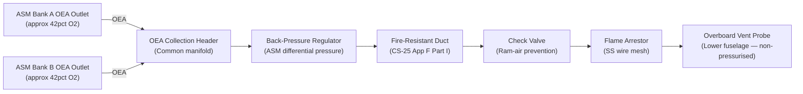
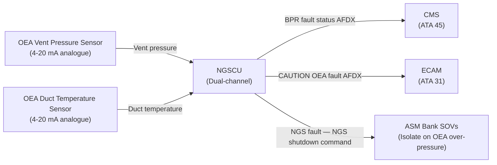
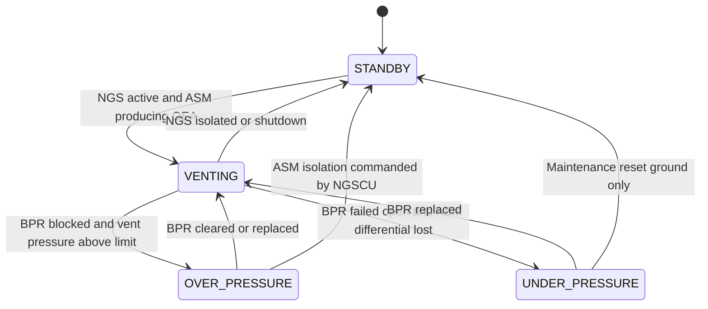

# ATLAS 040-049 · Section 04 · Subsection 047 · 040 — Oxygen Enriched Air Exhaust and Venting

## §0. Hyperlink Policy

All internal cross-references use relative Markdown links within the Q+ATLANTIDE CSDB repository. External regulatory citations in §19/§20 are marked  where hyperlinks are pending. Parent context: [ATLAS 047 README](./README.md). Related documents are linked in §20.

---

## §1. Purpose

This document defines the Oxygen Enriched Air (OEA) Exhaust and Venting sub-system of ATA 47 NGS for the programme-defined aircraft type. OEA is the by-product of the ASM membrane separation process, containing approximately 40–45% O₂ by volume. This high-O₂ stream must be safely vented overboard to prevent accumulation of oxygen-enriched gas in any enclosed aircraft structure (cabin, bilge, equipment bays) where it could significantly increase fire risk.

The OEA venting system routes OEA from both ASM banks via fire-resistant ducts through a flame arrestor assembly and overboard vent probe, located on the lower fuselage skin in a non-pressurised, externally vented zone. Back-pressure regulation ensures the correct transmembrane differential pressure is maintained across the ASM hollow-fiber bundles. Check valves prevent aerodynamic ram-air or reverse pressure from re-entering the aircraft structure.

Key governance areas:
- OEA safe routing from ASM banks to overboard vent (no OEA in cabin or bilge).
- Flame arrestor at vent port preventing external flame propagation into OEA duct.
- Check valves preventing reverse OEA flow / ram-air ingestion.
- Back-pressure regulator maintaining ASM transmembrane pressure differential.
- Fire-resistant duct lining (FAR 25.853 / CS-25 Appendix F compatible).
- Overboard vent probe: flush-mounted on lower fuselage skin, non-pressurised zone.
- SFAR 88 compliance: elimination of ignition sources in OEA vent path.
- Primary Q-Division: Q-AIR; Support: Q-MECHANICS.

---

## §2. Applicability

| Attribute | Value |
|-----------|-------|
| Aircraft Program | programme-defined aircraft type |
| ATA Chapter / Sub-subject | ATA 47.040 — OEA Exhaust and Venting |
| Certification Basis | CS-25 Amendment 28; SFAR 88; FAR 25.981 |
| Applicable Standards | DO-160G; S1000D Issue 5.0; CS-25 Appendix F (fire resistance) |
| OEA O₂ concentration | ~40–45% O₂ by volume |
| Vent location | Lower fuselage skin — non-pressurised zone |
| Back-pressure set-point | Maintains ASM differential pressure | 
| S1000D SNS | 047-040 |

---

## §3. Functional Description

OEA from both ASM banks is collected at a common OEA header and routed overboard via a single OEA Vent Assembly. The OEA Vent Assembly consists of the following functional elements in series:

1. **OEA Collection Header**: Common manifold collecting OEA from ASM Bank A and ASM Bank B outlets. Sized to handle maximum OEA flow from both banks simultaneously (~35 g/s total).
2. **Back-Pressure Regulator (BPR)**: Sets the downstream resistance in the OEA vent path to maintain the required ASM transmembrane pressure differential (approximately 5–8 psig above ambient pressure at the vent port), ensuring ASM membrane separation efficiency is maintained at all flight altitudes.
3. **Fire-Resistant Duct**: All OEA duct from the ASM outlets to the vent probe is lined with fire-resistant material (FAR 25.853 Appendix F Part I compliant). No electrical wiring, connectors, or heat sources are routed within 150 mm of the OEA duct.
4. **Flame Arrestor**: Installed at the overboard vent port. Prevents any external fire or ignition source from propagating back into the OEA duct. Stainless-steel wire-mesh matrix, rated for continuous OEA flow at all flight conditions.
5. **Check Valve**: Spring-loaded check valve upstream of the flame arrestor prevents ram-air or reverse flow from entering the OEA duct during high-speed flight or if the NGS is shut down with the vent port open.
6. **Overboard Vent Probe**: Flush-mounted titanium probe on the lower fuselage skin (non-pressurised zone). Orientated with its axis perpendicular to airflow to minimise ram-pressure recovery and ensure venting at all airspeeds.

### §3.1 OEA Vent Assembly Components

| Component | Function | Material | Serviceable Life |
|-----------|----------|----------|-----------------|
| OEA Collection Header | Collects OEA from Bank A and B | Titanium alloy | On-condition |
| Back-Pressure Regulator | Maintains ASM differential pressure | Aluminium / SS | On-condition |
| Fire-Resistant Duct | Routing OEA to overboard vent | Stainless steel / Kapton lining | C-check inspection |
| Flame Arrestor | Prevents external flame ingress | SS wire mesh | B-check inspection |
| Check Valve | Prevents reverse flow / ram-air ingress | Titanium / SS spring | On-condition |
| Overboard Vent Probe | Discharges OEA to atmosphere | Titanium alloy | On-condition |

### Diagram 1: OEA Exhaust and Venting Flow

---

## §4. System Architecture

The OEA venting system is a passive flow-driven system requiring no active control commands in normal operation. The back-pressure regulator is a purely mechanical device set during factory calibration; no NGSCU commands are associated with the BPR in normal operation. The NGSCU monitors a pressure sensor downstream of the BPR (OEA vent pressure sensor) to detect BPR failure (over-pressure or under-pressure condition). If BPR failure is detected, a CAUTION "NGS OEA VENT FAULT" is generated on ECAM.

The OEA vent probe location on the lower fuselage skin (zone 187, lower centreline) was selected following aerodynamic analysis to ensure:
- Vent port is clear of engine intakes and exhaust streams.
- No OEA ingestion into any aircraft opening (avionics cooling inlets, emergency exits).
- Pressure recovery at vent port is minimised to ensure positive OEA vent flow at all speeds and altitudes.
- Vent probe does not generate aerodynamic drag increment exceeding TBD counts.

### Diagram 2: OEA Venting System Data and Signal Flow

---

## §5. Components and Line-Replaceable Units

| LRU | Part Number | Qty | Location | Replacement Interval |
|-----|-------------|-----|----------|----------------------|
| OEA Vent Assembly (complete) | TBD | 1 | Lower fuselage skin zone 187 | On-condition |
| Back-Pressure Regulator (BPR) | TBD | 1 | OEA duct upstream of vent probe | On-condition |
| Flame Arrestor | TBD | 1 | Vent probe inlet | B-check inspection / replace on-condition |
| Check Valve (OEA) | TBD | 1 | OEA duct upstream of flame arrestor | On-condition |
| OEA Vent Pressure Sensor | TBD | 1 | OEA duct downstream of BPR | 6,000 FH |
| OEA Duct Temperature Sensor | TBD | 1 | OEA duct near ASM outlet | 6,000 FH |
| Fire-Resistant Duct Assembly | TBD | 1 | ASM bay to vent probe routing | C-check inspection |

---

## §6. Interfaces

| Interface | Peer System | Protocol / Bus | Data Exchanged |
|-----------|-------------|----------------|----------------|
| OEA from ASM Bank A | ATA 47.020 ASM | Pneumatic duct | OEA ~42% O₂ |
| OEA from ASM Bank B | ATA 47.020 ASM | Pneumatic duct | OEA ~42% O₂ |
| OEA vent pressure monitoring | NGSCU analogue inputs | 4–20 mA analogue | Vent duct pressure |
| OEA duct temperature monitoring | NGSCU analogue inputs | 4–20 mA analogue | OEA duct temperature |
| CMS fault reporting | ATA 45 CMS | AFDX (ARINC 664 P7) | BPR fault, vent fault codes |
| ECAM alerting | ATA 31 Indicating | ARINC 664 P7 | CAUTION / WARNING |
| Fuselage structure (vent port) | Aircraft structure | Mechanical interface | Flush probe attachment |

---

## §7. Operations and Modes

| Mode | OEA Flow | BPR State | Check Valve | NGSCU Monitoring |
|------|----------|-----------|-------------|-----------------|
| STANDBY | None | Closed (spring-loaded) | Closed | Sensors polled |
| VENTING (Normal) | ~35 g/s total | Open (set pressure) | Open (forward flow) | Vent pressure in range |
| OVER-PRESSURE | BPR blocked | Over-pressure | Open | CAUTION ECAM; ASM isolation |
| UNDER-PRESSURE | BPR failed open | Under-pressure | Open | CAUTION ECAM; ASM differential lost |
| NGS ISOLATED | None | Closed | Closed | No OEA flow; sensors polled |

### Diagram 3: OEA Venting System Lifecycle FSM

---

## §8. Performance and Budgets

| Parameter | Requirement | Target | Status |
|-----------|-------------|--------|--------|
| OEA flow rate (max) | < 50 g/s | 35 g/s typical |  |
| OEA O₂ concentration | ~40–45% O₂ | 42% O₂ typical |  |
| BPR set-point (ASM differential) | 5–8 psig above ambient | 6 psig |  |
| Flame arrestor flow resistance | < 0.5 psig at max flow | 0.3 psig |  |
| Check valve cracking pressure | 0.1–0.3 psig | 0.2 psig |  |
| Vent probe aerodynamic drag increment | < TBD drag counts | TBD |  |
| Fire-resistant duct rating | CS-25 Appendix F Part I | Continuous 60-min flame |  |
| Vent probe flush tolerance | ± 0.5 mm of fuselage skin | ± 0.3 mm |  |

---

## §9. Safety, Redundancy and Fault Tolerance

- **No OEA in cabin or bilge**: Dedicated OEA duct routes from ASM bay directly to lower fuselage overboard vent, physically isolated from all occupied and equipment zones.
- **Flame arrestor**: SS wire-mesh flame arrestor at vent probe prevents any external ignition source (ground fire, lightning strike at vent probe) from propagating into OEA duct.
- **Check valve**: Prevents ram-air ingestion into OEA duct during high-speed flight, protecting ASM and preventing O₂-enriched air from re-entering the aircraft structure.
- **NGSCU vent pressure monitoring**: Continuous monitoring detects BPR over-pressure or under-pressure; CAUTION and system isolation response prevents uncontrolled OEA build-up.
- **Fire-resistant duct**: All OEA duct sections comply with CS-25 Appendix F Part I fire resistance; no ignition sources within 150 mm of duct.
- **SFAR 88 compliance**: No electrical connectors, relays, or switching devices in the OEA vent path; passive mechanical design minimises ignition risk.
- **Single-point vent design**: A single vent assembly is used; MMEL provisions define dispatch criteria for BPR or vent assembly failure (limited to 2-day deferral at OEM discretion).

---

## §10. Maintenance and Diagnostics

| Task | Interval | Access | Tools Required |
|------|----------|--------|----------------|
| Flame arrestor visual inspection | B-check | Lower fuselage panel zone 187 | Inspection lamp; borescope |
| Flame arrestor replacement | On-condition (or clogging) | Lower fuselage panel zone 187 | Standard toolkit |
| Check valve operational test | B-check | OEA duct access | Pressure decay kit |
| BPR set-point calibration check | C-check | OEA duct downstream of BPR | Calibrated pressure reference |
| OEA duct fire-resistance inspection | C-check | Full duct routing | Visual; tactile inspection |
| Vent probe flush check | A-check (visual walk-around) | External fuselage inspection | None |
| OEA pressure sensor calibration | 6,000 FH | OEA duct access | Calibrated pressure reference |

---

## §11. Configuration and Software

- NGSCU monitors OEA vent pressure sensor (4–20 mA) and OEA duct temperature sensor.
- OEA vent over-pressure threshold (BPR_HIGH) and under-pressure threshold (BPR_LOW) loaded via NGSCU configuration data module.
- On OEA over-pressure detection: NGSCU commands ASM Bank SOVs closed (ASM isolation) and generates CAUTION.
- BPR is a mechanical device with no software configuration; set-point adjusted by maintenance technician using calibrated tool; set-point value recorded in aircraft technical log.
- SFAR 88 compliance documentation: no software functions in OEA vent path beyond pressure monitoring.

---

## §12. Environmental and Physical Constraints

| Constraint | Value | Standard |
|------------|-------|----------|
| Operating temperature (OEA duct / BPR) | −55°C to +125°C | DO-160G |
| Flame arrestor operating temperature | −55°C to +300°C continuous | CS-25 Appendix F |
| OEA duct burst pressure | 3× MAWP (25 psig) | CS-25 §25.1435 |
| Vent probe aerodynamic load | TBD N at Vmo/Mmo | TBD |
| Humidity (all components) | 0–100% RH (condensing) | DO-160G Section 6 |
| OEA Vent Assembly mass (max) | 1.2 kg | TBD |
| Duct material | Stainless steel; Kapton fire-resistant lining | TBD |

---

## §13. Human Factors and Crew Interface

- ECAM CAUTION "NGS OEA VENT FAULT" (amber): BPR pressure out of range; check CMS for fault code.
- ECAM WARNING "NGS FAULT — OEA OVER-PRESSURE" (red): OEA vent blocked; ASM isolation commanded; follow QRH.
- Maintenance page shows live OEA duct pressure and temperature for ground diagnostics.
- External vent probe is marked with a yellow hazard stripe and "OEA VENT — HIGH O₂" placard to warn ground handlers.
- Flame arrestor replacement task documented in AMM S1000D DM 720 with illustrated procedure.
- No routine crew action required during normal flight operation.

---

## §14. Test and Validation

| Test | Method | Criterion | Status |
|------|--------|-----------|--------|
| BPR set-point accuracy | Reference pressure meter; flow bench | BPR regulates to 6 psig ± 0.5 psig |  |
| Flame arrestor flame propagation | Standardised torch test per SFAR 88 | No propagation through arrestor |  |
| Check valve reverse-flow test | Apply 50 psid reverse; measure leakage | Zero backflow |  |
| Fire-resistant duct fire resistance | CS-25 Appendix F Part I torch test | Pass continuous 60-min flame |  |
| NGSCU OEA over-pressure detection | Inject over-pressure signal; check response | CAUTION within 2 s |  |
| Vent probe aerodynamic drag | Wind tunnel or CFD analysis | Drag increment < TBD counts |  |
| OEA duct pressure decay | Pressurise to MAWP; hold 15 min | Decay ≤ 0.1 psig |  |

---

## §15. Regulatory Compliance

| Regulation | Requirement | OEA Vent Response | Status |
|------------|-------------|-------------------|--------|
| SFAR 88 | Fuel tank system safety; elimination of ignition sources | Passive venting; flame arrestor; no electrical devices in OEA path |  |
| CS-25 §25.981 | Fuel tank flammability reduction | OEA vented safely; no OEA in cabin/bilge |  |
| FAR 25.981 | Fuel tank ignition prevention | OEA vented overboard |  |
| CS-25 Appendix F | Fire resistance — duct material | Fire-resistant duct lining Part I compliant |  |
| DO-160G | Environmental qualification | All OEA vent LRUs qualified |  |
| S1000D Issue 5.0 | Technical publications | CSDB documentation |  |
| MIL-STD-704F | Aircraft electric power | Sensors only (28 V DC); no active devices in OEA path |  |

---

## §16. Glossary

| Term | Acronym | Definition |
|------|---------|------------|
| Oxygen-Enriched Air | OEA | By-product stream from ASM separation containing ~40–45% O₂; vented overboard safely |
| Flame Arrestor | — | Stainless-steel wire-mesh device at vent port preventing external flame from propagating into OEA duct |
| Vent Probe | — | Flush-mounted titanium probe on lower fuselage skin through which OEA is discharged to atmosphere |
| Back-Pressure Regulator | BPR | Mechanical device maintaining OEA vent duct pressure to sustain the required ASM transmembrane differential |
| CS-25 | — | EASA Certification Specifications for Large Aeroplanes; Amendment 28 |
| SFAR 88 | — | Special Federal Aviation Regulation mandating fuel tank system safety improvements including ignition prevention |
| Check Valve | CCV | Spring-loaded one-way valve preventing ram-air or reverse flow from entering OEA duct |
| Fire-Resistant Duct | — | OEA routing duct lined with fire-resistant material per CS-25 Appendix F Part I; prevents OEA duct from propagating fire |
| O₂ Concentration | — | Percentage of oxygen by volume in OEA (~40–45%); significantly above ambient (21%), posing elevated fire risk |
| ASM Bypass | — | Isolation of ASM bank OEA outlet via SOV; not a standard bypass but available for maintenance isolation |

---

## §17. Footprint

### Physical

| Item | Value |
|------|-------|
| OEA Vent Assembly (complete) | ~1.2 kg; lower fuselage skin zone 187 |
| Back-Pressure Regulator | ~0.4 kg; inline OEA duct |
| Flame Arrestor | ~0.3 kg; vent probe inlet |
| Check Valve | ~0.25 kg; inline OEA duct |
| Fire-Resistant Duct (total routing) | ~0.8 kg; ASM bay to vent probe |

### Electrical / Data

| Item | Value |
|------|-------|
| OEA vent pressure sensor power | ~1.5 W (28 V DC loop) |
| OEA duct temperature sensor power | ~1.5 W (28 V DC loop) |
| No active valves in OEA path | — (passive venting system) |

### Maintenance

| Item | Value |
|------|-------|
| Flame arrestor inspection | B-check |
| BPR calibration | C-check |
| Access panel zone | Zone 187 (lower fuselage centreline) |

---

## §18. Open Issues

| ID | Issue | Owner | Status |
|----|-------|-------|--------|
| NGS-040-OI-001 | Vent probe aerodynamic drag increment CFD study not yet initiated | Q-AIR |  |
| NGS-040-OI-002 | BPR set-point finalisation pending full-altitude ASM performance data | Q-AIR |  |
| NGS-040-OI-003 | Flame arrestor qualification test lab selection in progress | Q-MECHANICS |  |
| NGS-040-OI-004 | MMEL dispatch provisions for BPR failure not yet agreed with authority | Q-AIR |  |

---

## §19. Citations

| Standard | Title | Applicability | Status |
|----------|-------|---------------|--------|
| SFAR 88 | Fuel Tank System Safety | OEA venting ignition source elimination |  |
| CS-25 §25.981 | Fuel Tank Ignition Prevention | OEA safe venting |  |
| FAR 25.981 | Fuel Tank Ignition Prevention (FAA) | FAA basis |  |
| CS-25 Appendix F | Fire Resistance | Fire-resistant duct material |  |
| DO-160G | Environmental Conditions and Test Procedures | OEA vent LRU qualification |  |
| S1000D Issue 5.0 | Technical Publications | CSDB documentation |  |
| MIL-STD-704F | Aircraft Electric Power | Sensor 28 V DC power |  |

---

## §20. References

| Document | Title | Link | Status |
|----------|-------|------|--------|
| 047-000 | Nitrogen Generation System General | [047-000](./047-000-Nitrogen-Generation-System-General.md) |  |
| 047-020 | Air Separation Modules | [047-020](./047-020-Air-Separation-Modules.md) |  |
| 047-060 | System Indication and Warning | [047-060](./047-060-System-Indication-and-Warning.md) |  |
| 047-080 | NGS Monitoring, Diagnostics and Control Interfaces | [047-080](./047-080-NGS-Monitoring-Diagnostics-and-Control-Interfaces.md) |  |
| 047-090 | S1000D CSDB Mapping and Traceability | [047-090](./047-090-S1000D-CSDB-Mapping-and-Traceability.md) |  |

---

## §21. Feedback and Review

This document is maintained under Q+ATLANTIDE governance. Review requests should be submitted via the Q+ATLANTIDE issue tracker, referencing document ID `QATL-ATLAS-1000-ATLAS-040-049-04-047-040-OXYGEN-ENRICHED-AIR-EXHAUST-AND-VENTING`. Subject-matter expert review is required from Q-AIR (safety case for OEA venting, SFAR 88 compliance) and Q-MECHANICS (flame arrestor qualification, vent probe installation) before advancing to `approved`.

---

## §22. Change Log

| Version | Date | Author | Description |
|---------|------|--------|-------------|
| 1.0.0 | 2026-05-10 | Q-AIR / Q+ATLANTIDE | Initial baseline creation — OEA Exhaust and Venting |
