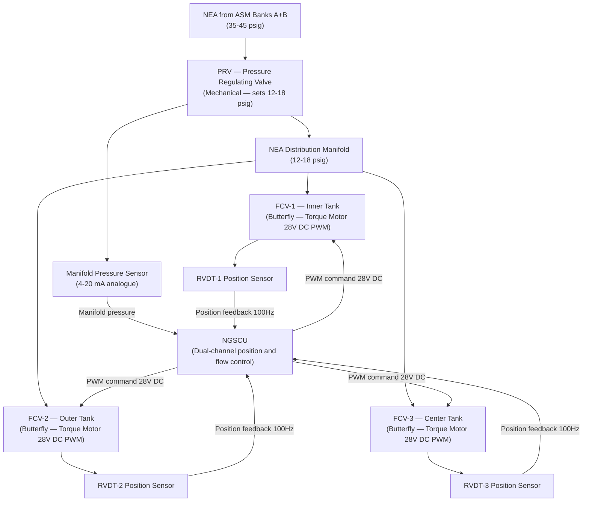
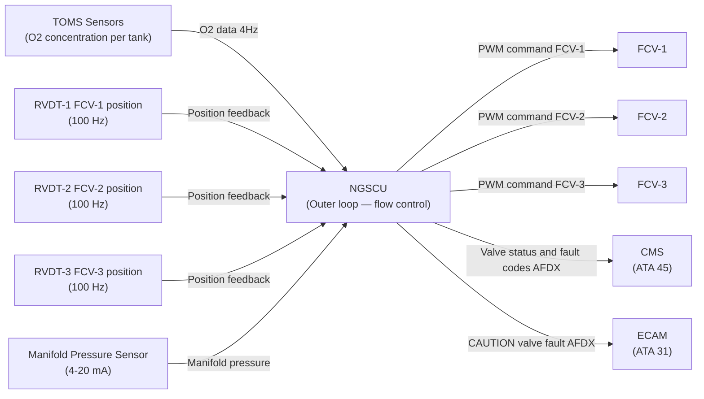
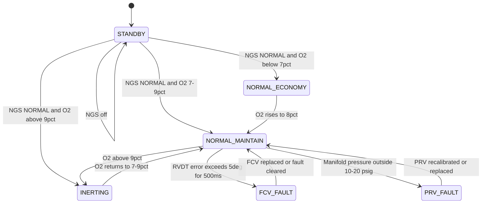

# ATLAS 040-049 · Section 04 · Subsection 047 · 050 — Flow Control Valves and Pressure Regulation

## §0. Hyperlink Policy

All internal cross-references use relative Markdown links within the Q+ATLANTIDE CSDB repository. External regulatory citations in §19/§20 are marked  where hyperlinks are pending. Parent context: [ATLAS 047 README](./README.md). Related documents are linked in §20.

---

## §1. Purpose

This document defines the Flow Control Valves (FCV) and Pressure Regulation sub-system of ATA 47 NGS for the AMPEL360E eWTW. The FCV and pressure regulation elements are the final active control elements in the NEA delivery path, modulating NEA flow to each fuel tank branch in response to NGSCU closed-loop commands. Pressure regulating valves (PRVs) maintain NEA manifold pressure within the operating envelope.

All FCVs are electrically actuated via torque motor actuators driven by 28 V DC PWM signals from the NGSCU. The eWTW has **no hydraulic system**: all valve actuation is purely electric. FCVs are designed fail-safe normally open to ensure NEA flow continues to fuel tanks even on loss of NGSCU power or actuator fault.

Key governance areas:
- Three NEA branch FCVs (inner, outer, center tank).
- One manifold PRV (upstream of NEA distribution header).
- Torque motor actuators, 28 V DC PWM drive from NGSCU.
- Position feedback via RVDT (Rotary Variable Differential Transformer) to NGSCU.
- Fail-safe normally open design for all FCVs.
- Position accuracy ±2°; response time < 200 ms.
- Titanium valve body construction; EMI/RFI hardening per DO-160G.
- Operating pressure range 10–50 psig; valve body titanium alloy.
- Primary Q-Division: Q-AIR; Support: Q-MECHANICS.

---

## §2. Applicability

| Attribute | Value |
|-----------|-------|
| Aircraft Program | AMPEL360E eWTW |
| ATA Chapter / Sub-subject | ATA 47.050 — FCVs and Pressure Regulation |
| Certification Basis | CS-25 Amendment 28; FAR 25.981 |
| Applicable Standards | DO-160G; S1000D Issue 5.0; MIL-STD-704F; ARINC 664 P7 |
| Actuation | Electric torque motor (28 V DC PWM) — no hydraulics |
| Fail-safe mode | Normally open (NEA flow continues on power loss) |
| Operating pressure | 10–50 psig |
| S1000D SNS | 047-050 |

---

## §3. Functional Description

Each Flow Control Valve (FCV) is a butterfly-type valve with a torque motor actuator. The NGSCU drives the torque motor via a 28 V DC Pulse Width Modulation (PWM) signal, positioning the valve disc to modulate NEA flow. An RVDT position sensor provides continuous valve disc angle feedback (0–90°) to the NGSCU at 100 Hz. The NGSCU uses this feedback in its position control inner loop (1 kHz update rate) and the TOMS-driven flow control outer loop (4 Hz).

The Pressure Regulating Valve (PRV) is installed at the NEA manifold inlet, downstream of the ASM banks. The PRV is a self-contained mechanical regulator maintaining manifold pressure at 12–18 psig regardless of ASM supply pressure variation (35–45 psig upstream). In the eWTW all-electric architecture, the PRV is purely mechanical — no electrical actuation. A pressure sensor downstream of the PRV feeds the NGSCU for manifold pressure monitoring.

### §3.1 Valve Summary

| Valve | Type | Actuation | Fail-Safe | Position Feedback | Qty |
|-------|------|-----------|-----------|-------------------|-----|
| FCV-1 (inner tank) | Butterfly | Torque motor 28 V DC PWM | Normally open | RVDT 0–90° | 1 |
| FCV-2 (outer tank) | Butterfly | Torque motor 28 V DC PWM | Normally open | RVDT 0–90° | 1 |
| FCV-3 (center tank) | Butterfly | Torque motor 28 V DC PWM | Normally open | RVDT 0–90° | 1 |
| PRV (manifold) | Spring-diaphragm | Mechanical (self-regulating) | Holds set-point | Pressure sensor downstream | 1 |

### Diagram 1: FCV and PRV Functional Architecture

---

## §4. System Architecture

The three FCVs are individually addressable by the NGSCU; each has its own dedicated 28 V DC PWM drive channel and RVDT feedback input. The NGSCU inner position control loop updates at 1 kHz; the TOMS-driven outer flow control loop updates at 4 Hz. The NGSCU monitors RVDT position against commanded position; a position error exceeding ±5° for > 500 ms triggers a FCV fault flag and a CAUTION message on ECAM.

The PRV is a spring-diaphragm mechanical regulator requiring no NGSCU command in normal operation. It is factory-calibrated to set-point 15 psig (adjustable range 12–18 psig via maintenance calibration). The manifold pressure sensor downstream of the PRV provides a 4–20 mA analogue signal to the NGSCU; if manifold pressure falls outside 10–20 psig, the NGSCU generates a maintenance advisory.

All valves are constructed with titanium alloy bodies and PTFE-coated internal seals for compatibility with the NEA (dry, nitrogen-rich) environment. EMI/RFI hardening (DO-160G Category M) is applied to all electrical valve actuators and position sensors; the torque motor connector is shielded to minimise radiated emissions.

### Diagram 2: FCV Control Data and Signal Flow

---

## §5. Components and Line-Replaceable Units

| LRU | Part Number | Qty | Location | Replacement Interval |
|-----|-------------|-----|----------|----------------------|
| FCV-1 (inner tank NEA branch) | TBD | 1 | NEA manifold inner branch | On-condition / 8,000 FH |
| FCV-2 (outer tank NEA branch) | TBD | 1 | NEA manifold outer branch | On-condition / 8,000 FH |
| FCV-3 (center tank NEA branch) | TBD | 1 | NEA manifold center branch | On-condition / 8,000 FH |
| PRV (manifold inlet) | TBD | 1 | NEA manifold inlet | On-condition (calibration C-check) |
| RVDT Position Sensor (FCV-1) | TBD | 1 | FCV-1 actuator shaft | 8,000 FH |
| RVDT Position Sensor (FCV-2) | TBD | 1 | FCV-2 actuator shaft | 8,000 FH |
| RVDT Position Sensor (FCV-3) | TBD | 1 | FCV-3 actuator shaft | 8,000 FH |
| Manifold Pressure Sensor | TBD | 1 | NEA manifold downstream of PRV | 6,000 FH |

---

## §6. Interfaces

| Interface | Peer System | Protocol / Bus | Data Exchanged |
|-----------|-------------|----------------|----------------|
| NEA supply from ASM banks | ATA 47.020 | Pneumatic duct | NEA 35–45 psig |
| FCV PWM drive (3 channels) | NGSCU Channel A/B | 28 V DC PWM | Valve position command |
| RVDT position feedback (3 channels) | NGSCU analogue inputs | RVDT (analogue) | Valve disc angle 0–90° at 100 Hz |
| Manifold pressure monitoring | NGSCU analogue inputs | 4–20 mA analogue | NEA manifold pressure |
| NEA to tanks (downstream of FCVs) | ATA 47.030 Distribution | Pneumatic duct | Regulated NEA per tank |
| CMS fault reporting | ATA 45 CMS | AFDX (ARINC 664 P7) | FCV fault codes, position data |
| ECAM alerting | ATA 31 Indicating | ARINC 664 P7 | CAUTION / WARNING |
| 28 V DC power | ATA 24 Electrical | 28 V DC bus | FCV torque motor and RVDT |

---

## §7. Operations and Modes

| Mode | FCV-1/2/3 Command | PRV State | NGSCU Action |
|------|------------------|-----------|--------------|
| NGS OFF / STANDBY | Not commanded (fail-safe open) | At set-point | Position monitoring off |
| NORMAL — Economy | Partially closed (low O₂) | At set-point | Maintain low NEA flow |
| NORMAL — Maintain | Modulated (O₂ 7–9%) | At set-point | PI loop holds O₂ band |
| INERTING — Active | Full open (O₂ > 9%) | At set-point | Max NEA flow per affected tank |
| FCV FAULT | Last valid position held | At set-point | CAUTION ECAM; CMS fault log |
| PRV FAULT | Modulated (NGSCU awareness) | Out of set-point | Advisory ECAM; reduced inerting |

### Diagram 3: FCV and PRV Lifecycle FSM

---

## §8. Performance and Budgets

| Parameter | Requirement | Target | Status |
|-----------|-------------|--------|--------|
| FCV position accuracy | ± 2° | ± 1.5° |  |
| FCV response time (full travel) | < 200 ms | 150 ms |  |
| RVDT position feedback rate | 100 Hz | 100 Hz |  |
| NGSCU inner control loop rate | 1 kHz | 1 kHz |  |
| PRV regulation accuracy | ±1 psig | ±0.8 psig |  |
| Manifold pressure operating range | 12–18 psig | 15 psig nominal |  |
| FCV operating pressure range | 10–50 psig | 12–18 psig typical |  |
| FCV leakage (closed) | < 0.01 g/s at 18 psig | < 0.005 g/s |  |

---

## §9. Safety, Redundancy and Fault Tolerance

- **Fail-safe normally open**: All FCVs revert to full-open on power loss or actuator fault, ensuring NEA continues to flow to all tanks; no inerting loss on FCV failure.
- **Per-FCV RVDT redundancy**: Each FCV has a single RVDT; sensor failure triggers advisory and NGSCU holds last valid position; no uncontrolled valve movement.
- **PRV mechanical independence**: PRV requires no NGSCU command; loss of NGSCU does not affect PRV pressure regulation.
- **Position error detection**: NGSCU detects jammed or stuck FCV within 500 ms via RVDT feedback; immediate CAUTION generated.
- **EMI/RFI hardening**: DO-160G Cat M hardening on all valve actuators and sensors prevents spurious valve commands from electromagnetic interference.
- **Titanium construction**: Ti alloy valve bodies are compatible with high-purity N₂ environment and resistant to fuel vapour contamination in the event of FCV-to-tank interface issues.
- **No hydraulic actuation**: Electric-only actuation eliminates hydraulic fluid contamination risk in the NEA distribution path.

---

## §10. Maintenance and Diagnostics

| Task | Interval | Access | Tools Required |
|------|----------|--------|----------------|
| FCV position calibration (each) | 8,000 FH | NEA manifold duct access | NGSCU IBIT + calibration tool |
| FCV leakage check (each, closed) | C-check | NEA manifold duct access | Pressure decay / flow test kit |
| PRV set-point verification | C-check | NEA manifold inlet access | Calibrated pressure reference |
| RVDT zero/span check (each) | 8,000 FH (with FCV calibration) | FCV actuator access | NGSCU IBIT diagnostic mode |
| Manifold pressure sensor calibration | 6,000 FH | NEA manifold access | Calibrated pressure reference |
| FCV operational test (IBIT) | A-check | NGSCU IBIT (ground, WOW) | None |
| Full valve pack functional test | After FCV replacement | NGSCU IBIT + TOMS flow test | NEA flow measurement kit |

---

## §11. Configuration and Software

- FCV position zero/span calibration coefficients stored in NGSCU configuration data module per valve.
- NGSCU inner position control loop gains (PWM-to-angle transfer function) version-controlled per DO-178C DAL C.
- PRV set-point (15 psig nominal) recorded in aircraft technical log; adjusted by maintenance using calibrated pressure tool; no software involved.
- FCV failure modes and effects documented in NGSCU software FMEA under DO-178C DAL C objectives.
- Valve open/close history and position error counts logged to QAR (32 NGS parameters at 4 Hz includes FCV-1/2/3 position data).
- EMI hardening: NGSCU PWM drive circuits include TVS diode protection on all FCV actuator outputs.

---

## §12. Environmental and Physical Constraints

| Constraint | Value | Standard |
|------------|-------|----------|
| Operating temperature (FCV / PRV) | −55°C to +71°C | DO-160G Cat B2 |
| Vibration (FCV) | DO-160G Cat S curve B | DO-160G Section 8 |
| EMI/RFI hardening (actuator) | DO-160G Category M | DO-160G Section 21 |
| Humidity (all valves) | 0–100% RH (condensing) | DO-160G Section 6 |
| FCV operating pressure | 10–50 psig | CS-25 §25.1435 |
| FCV body material | Titanium alloy Ti-6Al-4V | TBD |
| FCV mass (each) | ~0.5 kg | TBD |
| PRV mass | ~0.6 kg | TBD |

---

## §13. Human Factors and Crew Interface

- ECAM CAUTION "NGS FCV FAULT" (amber): One FCV has a position error > 5° for > 500 ms; check CMS.
- ECAM CAUTION "NGS MANIFOLD PRESSURE LOW/HIGH" (amber): PRV out of set-point range; advisory for maintenance.
- ECAM maintenance page shows live FCV-1/2/3 positions (valve icon with angle readout) and manifold pressure.
- FCV calibration IBIT initiated from ECAM maintenance mode (ground, weight-on-wheels interlock).
- Valve bodies are colour-coded with yellow flow-direction arrows on the duct for maintenance identification.
- No routine crew action required for FCV/PRV in normal flight.

---

## §14. Test and Validation

| Test | Method | Criterion | Status |
|------|--------|-----------|--------|
| FCV response time | NGSCU IBIT: command 0–90° step; measure RVDT response | ≤ 200 ms full travel |  |
| FCV position accuracy | Command 10° increments; verify RVDT at each step | ± 2° at each commanded position |  |
| FCV leakage (closed) | Pressurise upstream to 18 psig; measure downstream flow | < 0.01 g/s |  |
| PRV regulation accuracy | Sweep upstream pressure 35–45 psig; measure downstream | Downstream 12–18 psig ± 1 psig |  |
| Fail-safe (power removal) | Remove 28 V DC to FCV; measure position | Returns to full-open within 300 ms |  |
| EMI/RFI susceptibility | DO-160G Section 21 Cat M | No spurious valve movement |  |
| DO-160G environmental qualification | Qualified test lab | All Cat B2 sections pass |  |

---

## §15. Regulatory Compliance

| Regulation | Requirement | FCV/PRV Response | Status |
|------------|-------------|-----------------|--------|
| CS-25 §25.981 | Fuel tank flammability reduction | FCVs enable closed-loop TOMS inerting control |  |
| FAR 25.981 | Fuel tank ignition prevention | Fail-safe FCVs ensure NEA flow on power loss |  |
| SFAR 88 | Fuel tank system safety | No hydraulic fluid in NEA path; electric-only actuation |  |
| DO-160G | Environmental qualification | FCV Cat B2 + EMI Cat M qualification |  |
| S1000D Issue 5.0 | Technical publications | CSDB documentation |  |
| ARINC 664 P7 | AFDX interface | FCV status and fault data to CMS/ECAM |  |
| MIL-STD-704F | Aircraft electric power | 28 V DC PWM and RVDT power quality |  |

---

## §16. Glossary

| Term | Acronym | Definition |
|------|---------|------------|
| Flow Control Valve | FCV | Butterfly-type electrically actuated valve modulating NEA flow to each fuel tank branch; torque motor drive |
| Pressure Regulating Valve | PRV | Mechanical spring-diaphragm valve maintaining NEA manifold pressure at 12–18 psig; no electrical actuation |
| NGS Control Unit | NGSCU | Dual-channel avionics LRU commanding FCVs via 28 V DC PWM and monitoring RVDT position feedback |
| Pulse Width Modulation | PWM | Electrical control technique modulating valve torque motor by varying duty cycle of 28 V DC signal |
| Fail-safe | — | Design property of FCV: valve reverts to fully-open position on loss of electrical power or actuator failure |
| Torque Motor | — | Electric rotary actuator converting PWM electrical signal into valve disc angular position |
| Position Feedback | — | RVDT signal (0–90°) providing real-time FCV disc angle to NGSCU inner position control loop |
| Electromagnetic Interference | EMI | Unwanted electrical noise that could cause spurious valve commands; mitigated by DO-160G Cat M hardening |
| Radio Frequency Interference | RFI | High-frequency electromagnetic noise; FCV actuator connectors shielded to minimise susceptibility |
| DO-160G | — | RTCA/EUROCAE standard defining environmental conditions and test procedures for airborne equipment |

---

## §17. Footprint

### Physical

| Item | Value |
|------|-------|
| FCV (each) | ~0.5 kg; butterfly inline valve; Ti-6Al-4V body |
| PRV | ~0.6 kg; spring-diaphragm; inline manifold inlet |
| RVDT (each) | ~0.05 kg; integral to FCV actuator |
| Manifold Pressure Sensor | ~0.15 kg; manifold tap port |

### Electrical / Data

| Item | Value |
|------|-------|
| FCV torque motor power (each) | ~10 W peak (28 V DC PWM) |
| RVDT excitation power (each) | ~0.5 W |
| Manifold pressure sensor power | ~1.5 W (4–20 mA loop) |
| NGSCU inner loop update rate | 1 kHz |

### Maintenance

| Item | Value |
|------|-------|
| FCV calibration interval | 8,000 FH |
| PRV calibration interval | C-check |
| Shortest scheduled task | 6,000 FH (pressure sensor calibration) |

---

## §18. Open Issues

| ID | Issue | Owner | Status |
|----|-------|-------|--------|
| NGS-050-OI-001 | FCV torque motor supplier selection in progress | Q-MECHANICS |  |
| NGS-050-OI-002 | FCV leakage specification at closed position pending flow bench data | Q-AIR |  |
| NGS-050-OI-003 | PRV set-point range (12–18 psig) to be confirmed against ASM operating curve | Q-AIR |  |
| NGS-050-OI-004 | DO-160G Cat M EMI qualification test plan not yet submitted | Q-MECHANICS |  |

---

## §19. Citations

| Standard | Title | Applicability | Status |
|----------|-------|---------------|--------|
| CS-25 §25.981 | Fuel Tank Ignition Prevention | FCV closed-loop inerting control |  |
| SFAR 88 | Fuel Tank System Safety | Electric-only actuation; no hydraulic fluid in NEA path |  |
| FAR 25.981 | Fuel Tank Ignition Prevention (FAA) | FAA basis; fail-safe FCV design |  |
| DO-160G | Environmental Conditions and Test Procedures | FCV Cat B2 + EMI Cat M |  |
| S1000D Issue 5.0 | Technical Publications | CSDB documentation |  |
| ARINC 664 P7 | AFDX Network | FCV/PRV status to CMS/ECAM |  |
| MIL-STD-704F | Aircraft Electric Power | 28 V DC PWM power quality |  |

---

## §20. References

| Document | Title | Link | Status |
|----------|-------|------|--------|
| 047-000 | Nitrogen Generation System General | [047-000](./047-000-Nitrogen-Generation-System-General.md) |  |
| 047-030 | Nitrogen Enriched Air Distribution | [047-030](./047-030-Nitrogen-Enriched-Air-Distribution.md) |  |
| 047-060 | System Indication and Warning | [047-060](./047-060-System-Indication-and-Warning.md) |  |
| 047-080 | NGS Monitoring, Diagnostics and Control Interfaces | [047-080](./047-080-NGS-Monitoring-Diagnostics-and-Control-Interfaces.md) |  |
| 047-090 | S1000D CSDB Mapping and Traceability | [047-090](./047-090-S1000D-CSDB-Mapping-and-Traceability.md) |  |

---

## §21. Feedback and Review

This document is maintained under Q+ATLANTIDE governance. Review requests should be submitted via the Q+ATLANTIDE issue tracker, referencing document ID `QATL-ATLAS-1000-ATLAS-040-049-04-047-050-FLOW-CONTROL-VALVES-AND-PRESSURE-REGULATION`. Subject-matter expert review is required from Q-AIR (valve selection and control loop) and Q-MECHANICS (LRU qualification, torque motor supplier) before advancing to `approved`.

---

## §22. Change Log

| Version | Date | Author | Description |
|---------|------|--------|-------------|
| 1.0.0 | 2026-05-10 | Q-AIR / Q+ATLANTIDE | Initial baseline creation — FCVs and Pressure Regulation |
