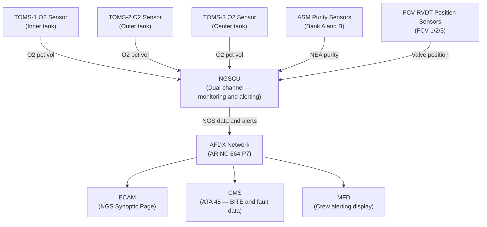
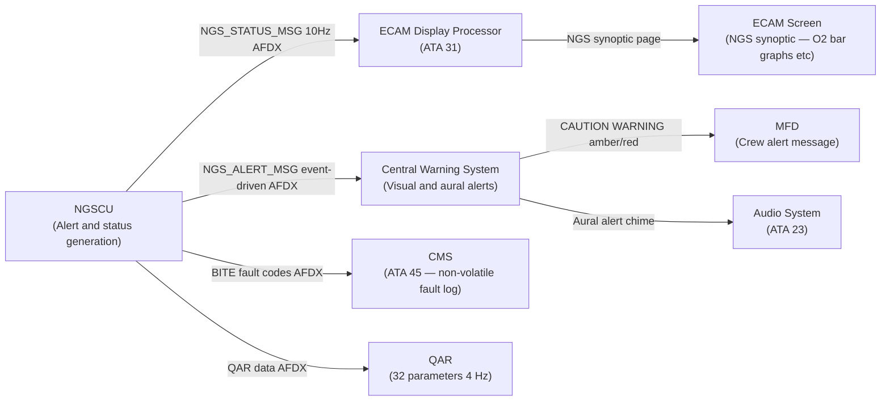
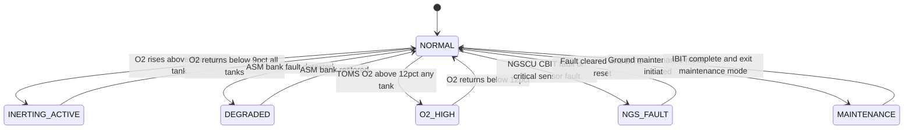

# ATLAS 040-049 · Section 04 · Subsection 047 · 060 — System Indication and Warning

## §0. Hyperlink Policy

All internal cross-references use relative Markdown links within the Q+ATLANTIDE CSDB repository. External regulatory citations in §19/§20 are marked  where hyperlinks are pending. Parent context: [ATLAS 047 README](./README.md). Related documents are linked in §20.

---

## §1. Purpose

This document defines the System Indication and Warning sub-system of ATA 47 NGS for the AMPEL360E eWTW. The indication and warning function provides the flight crew and maintenance personnel with real-time visibility of NGS operational status, tank O₂ concentrations, system faults, and crew alerting via the ECAM/MFD and ATA 45 CMS interfaces.

The Tank Oxygen Monitoring System (TOMS) sensors provide primary crew-visible data: per-tank O₂ concentration is displayed on the ECAM NGS synoptic page. The NGSCU processes all NGS monitoring data and generates CAUTION and WARNING messages on the crew alerting bus (ARINC 664 P7). Maintenance messages are transmitted to the CMS (ATA 45) for BITE download and troubleshooting.

Key governance areas:
- TOMS sensor data (O₂ concentration per tank) displayed on ECAM NGS synoptic page.
- NEA flow rate indicators per tank branch.
- NGSCU channel status (Channel A active / Channel B standby) on synoptic.
- ASM Bank A/B status, FCV positions on synoptic.
- Crew alerting: CAUTION "NGS FAULT" (amber); WARNING "FUEL TANK O2 HIGH" (red).
- Alert thresholds: WARNING at O₂ > 12% by volume; CAUTION at NGS fault detection.
- Maintenance BITE messages via ATA 45 CMS for troubleshooting and fault isolation.
- Primary Q-Division: Q-AIR; Support: Q-DATAGOV.

---

## §2. Applicability

| Attribute | Value |
|-----------|-------|
| Aircraft Program | AMPEL360E eWTW |
| ATA Chapter / Sub-subject | ATA 47.060 — System Indication and Warning |
| Certification Basis | CS-25 Amendment 28; CS-25 §25.1322 (alerting) |
| Applicable Standards | DO-160G; S1000D Issue 5.0; ARINC 664 P7; CS-25 §25.1309 |
| WARNING threshold | O₂ > 12% by volume in any tank ullage |
| CAUTION threshold | NGS fault detected (NGSCU CBIT/PBIT) |
| ECAM display | NGS synoptic page (ATA 31 / ATA 42) |
| S1000D SNS | 047-060 |

---

## §3. Functional Description

The NGSCU collects data from all NGS sensors at each execution cycle (4 Hz minimum) and formats it for transmission on the AFDX network to the ECAM/MFD (ATA 31 / 42) and CMS (ATA 45). The ECAM NGS synoptic page is a dedicated page presenting:

1. **Per-tank O₂ bar graph**: Three horizontal bar graphs (inner, outer, center) showing live TOMS O₂ concentration. Green zone 0–9%; amber zone 9–12%; red zone > 12%. Numerical readout in % volume.
2. **NGSCU channel status**: CHAN A / CHAN B status boxes (green ACTIVE / amber STANDBY / red FAULT).
3. **ASM Bank status**: BANK A / BANK B status boxes (green NORMAL / amber DEGRADED / red FAULT). NEA purity indication (% N₂).
4. **FCV positions**: Three valve icons (FCV-1/2/3) showing open/closed position as percentage.
5. **NEA flow rate**: Three digital readouts (g/s) per tank branch.
6. **Manifold pressure**: Digital readout (psig) of NEA manifold pressure from PRV downstream sensor.

### §3.1 ECAM Message Catalogue

| Message | Level | Trigger | Required Crew Action |
|---------|-------|---------|---------------------|
| FUEL TANK O2 HIGH | WARNING (red) | TOMS O₂ > 12% (any tank) | Follow QRH — NGS abnormal procedure |
| NGS FAULT | CAUTION (amber) | NGSCU CBIT/PBIT fault detected | Check CMS; follow QRH |
| NGS ASM FAULT | CAUTION (amber) | ASM Bank A or B purity < 90% | Check CMS; plan maintenance |
| NGS FCV FAULT | CAUTION (amber) | FCV position error > 5° for 500 ms | Check CMS; plan maintenance |
| NGS OEA VENT FAULT | CAUTION (amber) | OEA vent pressure out of range | Check CMS; plan maintenance |
| NGS AIR SUPPLY TEMP HIGH | CAUTION (amber) | CDT > 65°C at ASM inlet | Reduce EAC demand; check CMS |
| NGS DEGRADED | ADVISORY (cyan) | One ASM bank failed; single-bank mode | Awareness only; check CMS |
| NGS MAINTENANCE | MAINTENANCE (white) | NGSCU PHM advisory (ASM life, PDR) | Schedule maintenance |

### Diagram 1: NGS Indication System Architecture

---

## §4. System Architecture

The NGSCU output to the AFDX bus is formatted as two ARINC 664 P7 end-system messages:

- **NGS_STATUS_MSG** (10 Hz): Transmits per-tank O₂ concentration, FCV positions, ASM purity, manifold pressure, NGSCU channel status, NGS operational mode.
- **NGS_ALERT_MSG** (event-driven, up to 1 Hz): Transmits crew alerting messages (CAUTION / WARNING / ADVISORY) and BITE fault codes to ECAM and CMS.

The ECAM NGS synoptic page is rendered by the ECAM display processor (ATA 31) using NGS_STATUS_MSG data. Crew alerting messages are processed by the Central Warning System (CWS) to generate visual and aural alerts. The CMS stores NGS fault codes in non-volatile memory for post-flight maintenance access; each fault event is time-stamped and includes the NGSCU CBIT failure identification code.

### Diagram 2: NGS Alerting Data and Signal Flow

---

## §5. Components and Line-Replaceable Units

| LRU | Part Number | Qty | Location | Notes |
|-----|-------------|-----|----------|-------|
| NGSCU (Channel A) | TBD | 1 | Avionics bay | Indication and alerting functions |
| NGSCU (Channel B) | TBD | 1 | Avionics bay | Hot standby — takes over alerting on Chan A fail |
| ECAM Display Unit (shared ATA 31) | TBD | — | Flight deck | Shared system; NGS synoptic page hosted |
| CMS (shared ATA 45) | TBD | — | Avionics bay | Shared system; NGS fault log hosted |
| TOMS-1 Sensor | TBD | 1 | Inner tank access panel | Primary O₂ indication |
| TOMS-2 Sensor | TBD | 1 | Outer tank access panel | Primary O₂ indication |
| TOMS-3 Sensor | TBD | 1 | Center tank access panel | Primary O₂ indication |

---

## §6. Interfaces

| Interface | Peer System | Protocol / Bus | Data Exchanged |
|-----------|-------------|----------------|----------------|
| NGS status and alert output | ATA 31 ECAM / ATA 42 IMA | AFDX (ARINC 664 P7) | NGS_STATUS_MSG; NGS_ALERT_MSG |
| BITE fault log | ATA 45 CMS | AFDX (ARINC 664 P7) | BITE codes, fault timestamps |
| QAR NGS recording | ATA 45 ACMS / QAR | AFDX | 32 NGS parameters at 4 Hz |
| Central Warning System | ATA 31 CWS | ARINC 664 P7 | CAUTION / WARNING level and message |
| Audio System | ATA 23 | Discrete / AFDX | Chime on WARNING |
| TOMS sensor data | NGSCU analogue inputs | 4–20 mA analogue | O₂ concentration per tank |
| ASM purity data | NGSCU analogue inputs | 0–10 V DC analogue | NEA purity per bank |

---

## §7. Operations and Modes

| Mode | ECAM Synoptic | Alerting State | CMS Activity |
|------|--------------|----------------|--------------|
| NORMAL — Inerting OK | Green O₂ bars; all systems green | No crew alert | BITE log: no faults |
| INERTING — Active | O₂ bars updating; FCV open | ADVISORY "NGS INERTING" (cyan) | BITE log: normal |
| DEGRADED — Single ASM | ASM Bank status amber | ADVISORY "NGS DEGRADED" (cyan) | BITE log: Bank A/B fault |
| O₂ HIGH — Tank | O₂ bar red; affected tank highlighted | WARNING "FUEL TANK O2 HIGH" (red) | BITE log: O₂ exceedance event |
| NGS FAULT | NGSCU status red or amber | CAUTION "NGS FAULT" (amber) | BITE log: CBIT fault code |
| MAINTENANCE | Synoptic shows maintenance data | No crew alert (ground only) | IBIT results logged |

### Diagram 3: NGS Alerting Lifecycle FSM

---

## §8. Performance and Budgets

| Parameter | Requirement | Target | Status |
|-----------|-------------|--------|--------|
| WARNING O₂ threshold | > 12% by volume | 12% (hard) |  |
| CAUTION NGS fault detection delay | < 2 s from fault occurrence | 1 s typical |  |
| ECAM synoptic update rate | ≥ 1 Hz (display rendering) | 4 Hz (NGSCU output) |  |
| NGS_STATUS_MSG transmission rate | 10 Hz | 10 Hz |  |
| QAR NGS parameter recording rate | 4 Hz | 4 Hz |  |
| TOMS O₂ display accuracy | ± 1% O₂ | ± 0.5% O₂ |  |
| BITE fault retention (CMS) | ≥ 500 fault events | 1,000 events |  |
| ECAM message catalogue completeness | All NGS faults covered | 8 messages defined |  |

---

## §9. Safety, Redundancy and Fault Tolerance

- **Dual NGSCU channels**: Both channels independently compute alerting; Channel B takes over alerting within 3 s on Channel A failure, preventing loss of NGS monitoring.
- **O₂ WARNING margin**: WARNING threshold at 12% provides a 3% margin above the TOMS inerting threshold (9%), giving crew time to react before approaching flammability limits.
- **BITE non-volatile memory**: CMS retains fault codes across power cycles, ensuring post-flight maintenance can access full fault history even after aircraft cold-soak.
- **Independent CWS integration**: NGS CAUTION/WARNING messages are processed by the Central Warning System independently of ECAM display; aural alert is generated even if ECAM screen fails.
- **TOMS sensor failure advisory**: Single TOMS sensor failure generates advisory only (not CAUTION); system continues with remaining sensors.
- **QAR continuity**: 32 NGS parameters recorded at 4 Hz provide post-flight analysis capability for trend monitoring and incident investigation.

---

## §10. Maintenance and Diagnostics

| Task | Interval | Access | Tools Required |
|------|----------|--------|----------------|
| ECAM NGS synoptic functional check | A-check | Flight deck ECAM maintenance mode | None |
| NGSCU BITE fault download | A-check (or post-event) | CMS maintenance access terminal | Laptop with CMS interface |
| TOMS sensor indication check | 3,000 FH | NGSCU IBIT + reference O₂ gas | O₂ calibration kit |
| QAR NGS data download | Post-flight (routine) | QAR ground station | QAR ground reader |
| ECAM message catalogue verification | After NGSCU SW update | NGSCU IBIT + ECAM test | None |
| Full NGS BITE coverage test | C-check | NGSCU IBIT full suite | Test harness |

---

## §11. Configuration and Software

- NGSCU alerting thresholds (9%, 12% O₂; CDT 65°C/80°C; PRV pressure) version-controlled in NGSCU configuration data module (DO-178C DAL C).
- ECAM message catalogue for NGS (8 messages) defined in ECAM message database; updated via ECAM software package.
- QAR parameter list (32 NGS parameters) defined in NGS QAR parameter specification (NGS-QAR-SPEC-001); loaded to QAR configuration.
- CMS fault code schema for NGS defined in NGSCU ICD (Interface Control Document); mapped to S1000D troubleshooting DMs (InfoCode 520).
- NGSCU software version displayed on ECAM maintenance page for maintenance personnel.

---

## §12. Environmental and Physical Constraints

| Constraint | Value | Standard |
|------------|-------|----------|
| NGSCU operating temperature | −55°C to +70°C | DO-160G |
| ECAM display (shared system) | Per ATA 31 spec | ATA 31 / DO-160G |
| AFDX network latency (NGS data) | < 5 ms end-to-end | ARINC 664 P7 |
| CMS fault event storage | ≥ 500 events (non-volatile) | DO-160G / ARINC 664 |
| QAR recording capacity | ≥ 500 FH of data | TBD |
| NGSCU LRU dimensions | 4 MCU ARINC 600 | ARINC 600 |

---

## §13. Human Factors and Crew Interface

- WARNING "FUEL TANK O2 HIGH" (red, master WARNING light + aural chime): Highest priority NGS alert; triggers QRH abnormal procedure — crew must action immediately.
- CAUTION "NGS FAULT" (amber, master CAUTION light): System fault; no immediate flight safety risk but crew must check CMS at next opportunity.
- ADVISORY "NGS DEGRADED" (cyan, no aural): Single ASM bank; awareness only; no crew action required in flight.
- ECAM NGS synoptic page accessible via [ECAM → SYS → NGS] from any flight phase.
- O₂ bar graph colour coding (green/amber/red) provides immediate visual assessment without reading numerical values.
- Maintenance access: NGSCU BITE readout via CMS maintenance terminal (ground only); IBIT initiation via ECAM maintenance mode.

---

## §14. Test and Validation

| Test | Method | Criterion | Status |
|------|--------|-----------|--------|
| WARNING trigger at 12% O₂ | Inject 12.1% O₂ reference signal to TOMS; check ECAM | WARNING within 2 s |  |
| CAUTION trigger on NGSCU CBIT fault | Inject simulated CBIT failure code; check ECAM | CAUTION within 2 s |  |
| ECAM synoptic page display accuracy | Reference O₂ at 5%, 9%, 12%; verify bar graph | ± 0.5% O₂ display accuracy |  |
| QAR parameter recording verification | Record NGS data; download and verify all 32 parameters | All 32 parameters at 4 Hz |  |
| CMS fault code retention | Power-cycle aircraft; retrieve CMS fault log | All faults retained in non-volatile |  |
| NGSCU Channel B alert takeover | Remove Channel A power; verify alerting continues | No alert gap > 3 s |  |

---

## §15. Regulatory Compliance

| Regulation | Requirement | Indication Response | Status |
|------------|-------------|---------------------|--------|
| CS-25 §25.1322 | Crew alerting system — CAUTION/WARNING | ECAM CAUTION/WARNING per CS-25.1322 priority |  |
| CS-25 §25.1309 | System safety — failure effect | NGS indication failure effects analysed in NGSCU FMEA |  |
| CS-25 §25.981 | Fuel tank flammability | O₂ WARNING threshold supports crew awareness of inerting status |  |
| FAR 25.981 | Fuel tank ignition prevention | WARNING at 12% O₂ |  |
| DO-160G | Environmental qualification | NGSCU indication functions qualified |  |
| S1000D Issue 5.0 | Technical publications | CSDB fault code and troubleshooting DMs |  |
| ARINC 664 P7 | AFDX interface | NGS status and alert messages |  |

---

## §16. Glossary

| Term | Acronym | Definition |
|------|---------|------------|
| Tank Oxygen Monitoring System | TOMS | Set of O₂ concentration sensors in fuel tank ullages providing real-time O₂ data displayed on ECAM |
| Electronic Centralised Aircraft Monitor | ECAM | Dual display system on flight deck showing aircraft system status; hosts NGS synoptic page |
| Multifunction Display | MFD | Configurable flight deck display capable of showing ECAM synoptic pages including NGS |
| Central Maintenance System | CMS | Avionics system (ATA 45) collecting, storing, and providing access to BITE fault codes from all aircraft systems |
| CAUTION | — | Amber ECAM alert indicating a non-normal condition requiring crew awareness and possible action |
| WARNING | — | Red ECAM alert indicating an urgent condition requiring immediate crew action |
| NGS Control Unit | NGSCU | Dual-channel LRU generating NGS monitoring data and alerting messages for ECAM and CMS |
| Synoptic page | — | Dedicated ECAM display page showing a graphical overview of a specific aircraft system |
| Built-In Test Equipment | BITE | Self-test capability within NGSCU for fault detection, isolation, and maintenance reporting |
| ATA 45 | — | ATA chapter covering the Central Maintenance System; interface for NGSCU BITE fault reporting |

---

## §17. Footprint

### Physical

| Item | Value |
|------|-------|
| NGSCU (hosting indication software) | 4 MCU ARINC 600; avionics bay |
| ECAM display (shared — no NGS-unique hardware) | Per ATA 31 |
| CMS (shared — no NGS-unique hardware) | Per ATA 45 |

### Electrical / Data

| Item | Value |
|------|-------|
| AFDX end-system ports used (NGSCU) | 2 × ARINC 664 P7 |
| NGS_STATUS_MSG bandwidth | < 5 kbps at 10 Hz |
| QAR NGS data bandwidth | 32 params × 4 Hz × 16-bit ≈ 2 kbps |

### Maintenance

| Item | Value |
|------|-------|
| CMS fault download tool | Standard maintenance laptop + CMS interface |
| BITE full test duration | < 8 min (NGSCU IBIT full suite) |
| QAR download frequency | Post-flight (routine) |

---

## §18. Open Issues

| ID | Issue | Owner | Status |
|----|-------|-------|--------|
| NGS-060-OI-001 | ECAM NGS synoptic page design not yet finalised (HMI review pending) | Q-AIR |  |
| NGS-060-OI-002 | QAR 32-parameter list finalisation pending NGSCU ICD completion | Q-DATAGOV |  |
| NGS-060-OI-003 | CMS fault code schema mapping to S1000D DMs in progress | Q-DATAGOV |  |
| NGS-060-OI-004 | CS-25 §25.1322 compliance assessment for NGS alert priority pending | Q-AIR |  |

---

## §19. Citations

| Standard | Title | Applicability | Status |
|----------|-------|---------------|--------|
| CS-25 §25.981 | Fuel Tank Ignition Prevention | O₂ WARNING threshold supports crew awareness |  |
| CS-25 §25.1322 | Crew Alerting System | CAUTION/WARNING message design |  |
| SFAR 88 | Fuel Tank System Safety | TOMS indication required |  |
| FAR 25.981 | Fuel Tank Ignition Prevention (FAA) | FAA basis; WARNING threshold |  |
| DO-160G | Environmental Conditions and Test Procedures | NGSCU qualification |  |
| S1000D Issue 5.0 | Technical Publications | CSDB fault code DMs |  |
| ARINC 664 P7 | AFDX Network | NGS status and alert messages |  |
| MIL-STD-704F | Aircraft Electric Power | 28 V DC NGSCU power quality |  |

---

## §20. References

| Document | Title | Link | Status |
|----------|-------|------|--------|
| 047-000 | Nitrogen Generation System General | [047-000](./047-000-Nitrogen-Generation-System-General.md) |  |
| 047-030 | Nitrogen Enriched Air Distribution | [047-030](./047-030-Nitrogen-Enriched-Air-Distribution.md) |  |
| 047-070 | Fuel Tank Inerting Interfaces | [047-070](./047-070-Fuel-Tank-Inerting-Interfaces.md) |  |
| 047-080 | NGS Monitoring, Diagnostics and Control Interfaces | [047-080](./047-080-NGS-Monitoring-Diagnostics-and-Control-Interfaces.md) |  |
| 047-090 | S1000D CSDB Mapping and Traceability | [047-090](./047-090-S1000D-CSDB-Mapping-and-Traceability.md) |  |

---

## §21. Feedback and Review

This document is maintained under Q+ATLANTIDE governance. Review requests should be submitted via the Q+ATLANTIDE issue tracker, referencing document ID `QATL-ATLAS-1000-ATLAS-040-049-04-047-060-SYSTEM-INDICATION-AND-WARNING`. Subject-matter expert review is required from Q-AIR (alerting logic, CS-25.1322 compliance) and Q-DATAGOV (AFDX message design, CMS fault code schema) before advancing to `approved`.

---

## §22. Change Log

| Version | Date | Author | Description |
|---------|------|--------|-------------|
| 1.0.0 | 2026-05-10 | Q-AIR / Q+ATLANTIDE | Initial baseline creation — System Indication and Warning |
