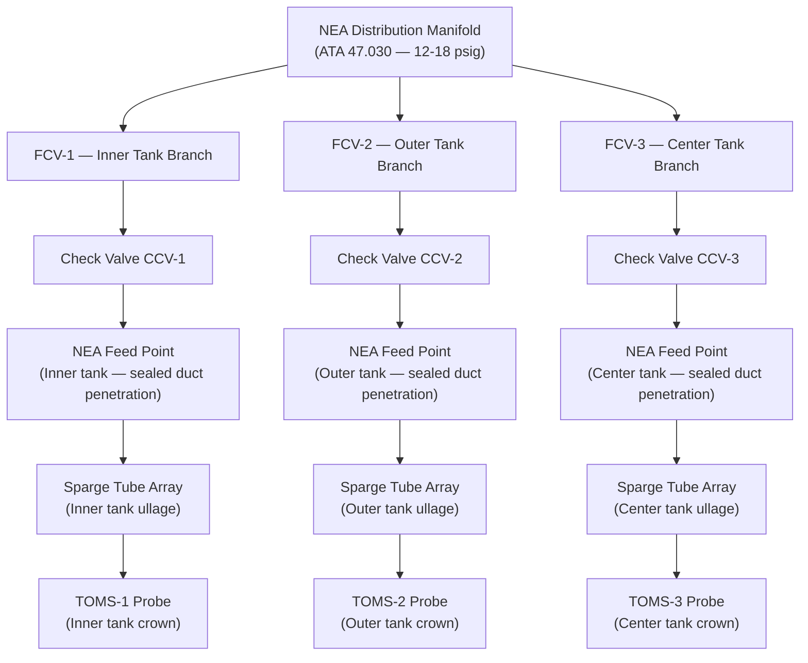
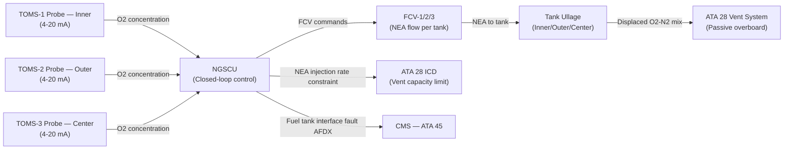
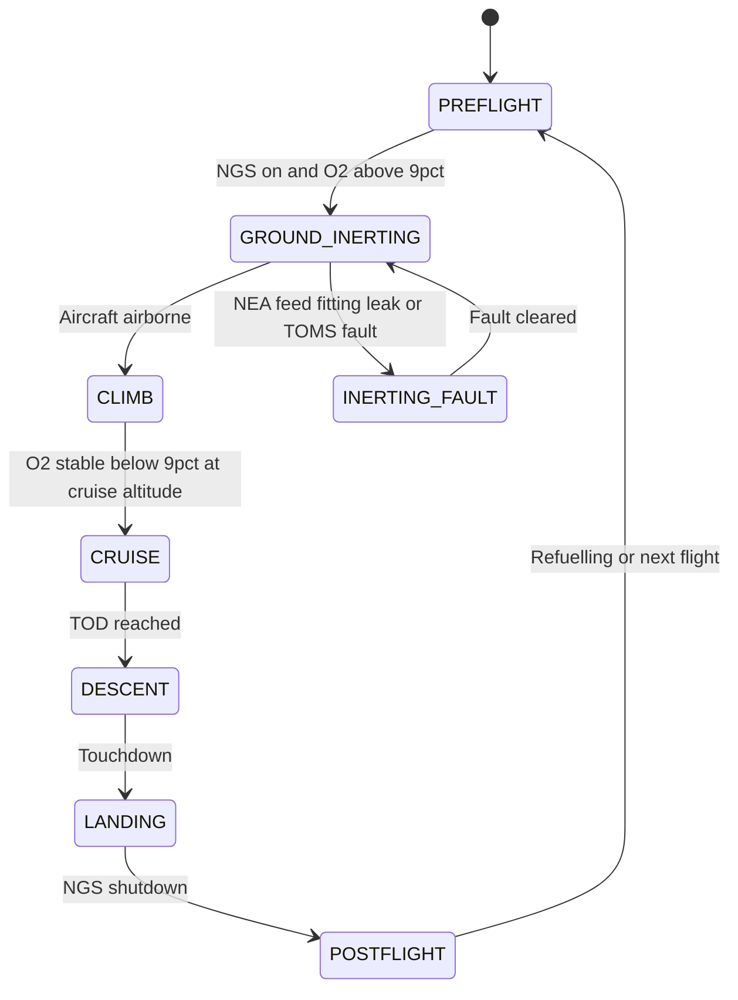

# ATLAS 040-049 · Section 04 · Subsection 047 · 070 — Fuel Tank Inerting Interfaces

## §0. Hyperlink Policy

All internal cross-references use relative Markdown links within the Q+ATLANTIDE CSDB repository. External regulatory citations in §19/§20 are marked  where hyperlinks are pending. Parent context: [ATLAS 047 README](./README.md). Related documents are linked in §20.

---

## §1. Purpose

This document defines the Fuel Tank Inerting Interfaces sub-system of ATA 47 NGS for the AMPEL360E eWTW. This sub-system covers the physical and functional interface between the NGS (ATA 47) and the Fuel System (ATA 28), including NEA feed points into each fuel tank, TOMS sensor installation in tank access panels, sparge tube routing inside tank structures, and coordination with the fuel vent system during NEA fill.

The AMPEL360E eWTW is an all-electric aircraft with **no engine bleed-air**, eliminating the thermal interactions between engine bleed ducting and fuel tanks that are present on conventional aircraft. The NGS interfaces with three fuel tank groups: inner wing tanks, outer wing tanks, and a center fuselage tank. A future eWTW variant may include LH₂ (Liquid Hydrogen) tanks; this document notes the interface requirement but defers LH₂ NGS interface design to that variant's programme phase.

Key governance areas:
- NEA feed points (access panel / duct penetration) per tank group.
- TOMS probe mount in tank access panels (fuel-compatible sealing).
- NEA sparge tube routing inside each tank ullage (ATA 28 structural interface).
- Fuel vent system coordination during NGS inerting (pressure equalisation).
- NEA injection pressure limit: < 2 psig differential above tank ullage pressure.
- No fuel heating from engine bleed (eWTW specific — no thermal NGS-fuel interaction).
- LH₂ variant NGS interface: deferred (flagged TBD in §3.1).
- Primary Q-Division: Q-AIR; Support: Q-MECHANICS.

---

## §2. Applicability

| Attribute | Value |
|-----------|-------|
| Aircraft Program | AMPEL360E eWTW |
| ATA Chapter / Sub-subject | ATA 47.070 — Fuel Tank Inerting Interfaces |
| Peer ATA Chapter | ATA 28 — Fuel System |
| Certification Basis | CS-25 Amendment 28; FAR 25.981; SFAR 88 |
| Applicable Standards | DO-160G; S1000D Issue 5.0; CS-25 §25.1435 (fuel duct pressure) |
| NEA injection pressure limit | < 2 psig differential above tank ullage pressure |
| Tanks interfaced | Inner wing, Outer wing, Center fuselage |
| S1000D SNS | 047-070 |

---

## §3. Functional Description

The NGS interfaces with the ATA 28 Fuel System at three primary interface points for each tank group:

1. **NEA Feed Point**: A duct penetration through the tank structure (typically at the inboard access panel crown) connecting the NEA distribution manifold branch to the NEA sparge tube inside the tank. Each feed point is equipped with a fuel-compatible sealed fitting and a structural pass-through sleeve maintaining fuel tank structural integrity.

2. **TOMS Probe Mount**: Each TOMS O₂ sensor is installed via a sealed boss mounting in the tank crown access panel. The probe extends into the ullage space by approximately 100 mm to sample the ullage gas. Probe seals are fuel-compatible elastomers (MIL-PRF-25988 or equivalent).

3. **Sparge Tube Array**: A perforated titanium alloy tube (Grade 5, Ti-6Al-4V) routed along the upper inboard tank wall distributes NEA uniformly across the ullage. Sparge tube orifice sizing is selected to produce a low-velocity flow (< 5 m/s at rated NEA flow rate) minimising fuel vapour disturbance and fuel-NEA mixing.

4. **Fuel Vent Coordination**: The ATA 28 fuel vent system (NACA-type vents at wingtip or fuselage crown) vents tank ullage gas overboard as fuel is consumed. During NGS inerting, the vent valves remain open (passive venting), allowing displaced O₂-N₂ mixture to vent overboard while NEA is injected. The NGS NEA injection flow rate is sized to be compatible with vent system flow capacity at all flight phases.

### §3.1 Fuel Tank Interface Summary

| Tank | NEA Feed Point Location | TOMS Probe Location | Sparge Tube Length | LH₂ Variant |
|------|------------------------|---------------------|-------------------|-------------|
| Inner wing tank | Inboard crown access panel | Inboard crown | TBD m | N/A |
| Outer wing tank | Outboard crown access panel | Outboard crown | TBD m | N/A |
| Center fuselage tank | Center crown access panel | Center crown | TBD m |  |
| LH₂ tanks (future variant) | TBD — deferred | TBD — deferred | TBD |  |

### Diagram 1: Fuel Tank Inerting Interface Architecture

---

## §4. System Architecture

The structural interface design between the NGS ducts and the ATA 28 fuel tank structures is a critical airworthiness interface. All tank penetrations are designed as sealed fittings maintaining the fuel tank structural pressure envelope and providing fuel vapour containment. Design requirements for the penetration fittings are governed by CS-25 §25.963 (Fuel Tanks — General) and the AMPEL360E eWTW fuel system structural design authority (Q-MECHANICS / structures).

The fuel vent system (ATA 28 vent sub-system) operates passively; no active commands from the NGS are sent to vent valves. The NGS NEA flow rate is bounded to ensure that the rate of O₂ displacement in the ullage does not exceed the vent system capacity, preventing tank over-pressure. The maximum NEA injection rate per tank is set below the vent system relief flow rate by a margin of at least 20% (exact values TBD pending ATA 28 vent sizing).

On the eWTW, there is **no fuel heating from engine bleed**: conventional aircraft use bleed air for fuel system de-icing via fuel heater heat exchangers, creating a thermal coupling between the NGS air supply and fuel temperature. The eWTW eliminates this coupling entirely, simplifying the NGS-ATA 28 interface.

### Diagram 2: Fuel Tank NGS Interface Data and Signal Flow

---

## §5. Components and Line-Replaceable Units

| LRU | Part Number | Qty | Location | Replacement Interval |
|-----|-------------|-----|----------|----------------------|
| NEA Feed Fitting (inner tank) | TBD | 1 | Inner tank inboard crown | On-condition |
| NEA Feed Fitting (outer tank) | TBD | 1 | Outer tank crown | On-condition |
| NEA Feed Fitting (center tank) | TBD | 1 | Center tank crown | On-condition |
| TOMS-1 Probe and Sealing Boss (inner) | TBD | 1 | Inner tank crown access panel | 10,000 FH |
| TOMS-2 Probe and Sealing Boss (outer) | TBD | 1 | Outer tank crown access panel | 10,000 FH |
| TOMS-3 Probe and Sealing Boss (center) | TBD | 1 | Center tank crown access panel | 10,000 FH |
| Sparge Tube Assembly (inner tank) | TBD | 1 | Inner tank upper inboard wall | On-condition |
| Sparge Tube Assembly (outer tank) | TBD | 1 | Outer tank upper wall | On-condition |
| Sparge Tube Assembly (center tank) | TBD | 1 | Center tank upper wall | On-condition |

---

## §6. Interfaces

| Interface | Peer System | Protocol / Bus | Data Exchanged |
|-----------|-------------|----------------|----------------|
| NEA distribution manifold branches | ATA 47.030 | Pneumatic duct | NEA 12–18 psig; ≤ 2 psig above ullage |
| Fuel tank structural penetrations | ATA 28 Structure | Mechanical fitting | NEA duct pass-through; fuel vapour seal |
| ATA 28 vent system | ATA 28 Vent | Passive venting | Displaced ullage gas (O₂-N₂ mix) |
| TOMS sensor data | NGSCU analogue | 4–20 mA analogue | O₂ concentration per tank |
| Fuel quantity sensing (ATA 28) | ATA 28 FQMS | AFDX / analogue | Fuel level (informs inerting demand) |
| CMS fault reporting | ATA 45 CMS | AFDX | Interface fault codes |

---

## §7. Operations and Modes

| Phase | Tank Ullage Condition | NGS Interface Activity | Vent System |
|-------|----------------------|----------------------|-------------|
| Pre-flight (fuel loaded) | O₂ approximately 21% (atmospheric) | NGSCU initiates ground inerting | Passive vents open |
| Ground inerting | O₂ decreasing toward 9% | NEA injected at max rate via all FCVs | Venting displaced O₂-N₂ mix |
| Climb | O₂ may rise as fuel consumed (ullage expands) | NGS modulates FCVs per TOMS | Vent releases expanding ullage gas |
| Cruise | O₂ stable below 9% | NGS in maintenance flow mode | Vent passive |
| Descent | Ullage contracts; O₂ stable | NGS flow reduces | Vent passive; air ingress via NACA vent |
| Post-landing | O₂ may rise slightly | NGS continues until shutdown | Passive vents |

### Diagram 3: Fuel Tank Inerting Interface Lifecycle FSM

---

## §8. Performance and Budgets

| Parameter | Requirement | Target | Status |
|-----------|-------------|--------|--------|
| NEA injection pressure (max differential) | < 2 psig above tank ullage | 1.5 psig typical |  |
| NEA injection velocity (sparge tube orifice) | < 5 m/s | < 4 m/s |  |
| TOMS probe ullage penetration depth | ~100 mm from access panel | 100 mm |  |
| Tank vent capacity margin (above NGS injection) | ≥ 20% margin | TBD |  |
| NEA feed fitting fuel vapour leakage | Zero (sealed fitting) | Zero |  |
| Ground inerting time (all tanks from atmospheric) | ≤ 60 min | 45 min typical |  |
| LH₂ variant interface requirement | TBD — future variant | TBD |  |

---

## §9. Safety, Redundancy and Fault Tolerance

- **Fuel vapour containment**: All NEA feed penetrations are sealed fittings; fuel vapour cannot migrate along NEA ducts toward the NGS bay or distribution system.
- **Check valves on NEA branches**: CCVs prevent fuel vapour from entering NEA manifold during pressure transients (e.g., wing flex during manoeuvres).
- **Injection pressure limit**: PRV and FCV combination ensures NEA injection pressure does not exceed structural differential limit of fuel tank (< 2 psig).
- **No bleed-air thermal interaction**: eWTW all-electric architecture eliminates hot bleed-air proximity to fuel tanks, removing a conventional aircraft fire risk mode.
- **Vent system compatibility**: NGS NEA flow rate is bounded below vent system relief capacity, preventing tank over-pressurisation.
- **TOMS probe sealing**: Dual-seal elastomer boss prevents fuel vapour from leaking into the TOMS sensor signal path or NGS control circuitry.
- **LH₂ variant deferred**: LH₂ fuel tank inerting requirements (H₂ concentration limits, cryogenic temperatures) are materially different; design is deferred to maintain focus on Jet-A eWTW baseline.

---

## §10. Maintenance and Diagnostics

| Task | Interval | Access | Tools Required |
|------|----------|--------|----------------|
| NEA feed fitting leak check | C-check | Fuel tank access panel | Pressure decay kit; sniffer |
| TOMS probe seal inspection | 10,000 FH | Fuel tank crown access panel | Standard toolkit; seal kit |
| TOMS probe removal and replacement | 10,000 FH | Fuel tank crown access panel | Standard toolkit; O₂ calibration kit |
| Sparge tube visual inspection | C-check | Fuel tank interior (fuel drained) | Borescope; inspection lamp |
| Sparge tube orifice clog check | C-check | Fuel tank interior | Compressed N₂ purge; flow check |
| Full NGS tank interface leak test | After any feed fitting disturb | Fuel tank and NGS ducts | Pressure decay kit |
| Fuel vent / NGS compatibility review | Major structural inspection | Engineering review | Engineering analysis |

---

## §11. Configuration and Software

- NEA injection pressure limit (2 psig differential) enforced by PRV set-point; no software limit beyond NGSCU monitoring advisory.
- ATA 28 ICD (Interface Control Document) defines permissible NGS duct penetration locations and structural fitting requirements; version-controlled jointly by Q-AIR and Q-MECHANICS.
- TOMS probe part number and seal type recorded in aircraft technical log at each replacement.
- Fuel tank inerting time data (from TOMS) recorded in QAR for analysis and inerting effectiveness validation.
- eWTW-specific configuration flag in NGSCU: `BLEF=TRUE` (no bleed), `LH2_VARIANT=FALSE` (Jet-A baseline).

---

## §12. Environmental and Physical Constraints

| Constraint | Value | Standard |
|------------|-------|----------|
| TOMS probe fuel compatibility | Jet-A / Jet-A1 immersion compatible (elastomer seal) | MIL-PRF-25988 |
| Sparge tube material | Ti-6Al-4V; fuel-compatible | TBD |
| NEA feed fitting burst pressure | 3× MAWP (6 psig burst = 18 psig) | CS-25 §25.963 |
| Tank structural differential limit | < 2 psig NEA injection differential | CS-25 §25.963 |
| TOMS probe operating temperature | −55°C to +70°C | DO-160G |
| Sparge tube vibration | Wing flex compatible; fatigue life TBD | CS-25 §25.571 |
| LH₂ variant temperature (future) | −253°C cryogenic (TBD) | TBD |

---

## §13. Human Factors and Crew Interface

- No flight-deck crew interface specific to the fuel tank inerting mechanical interface; crew visibility via ECAM NGS synoptic (see ATA 47.060).
- Maintenance personnel must drain affected tank before sparge tube inspection at C-check (hot-work permit required).
- TOMS probe replacement requires fuel tank entry preparation (fuel drained, tank vented, atmosphere confirmed) per AMM S1000D DM 720.
- NEA feed fitting leak check is a line maintenance task accessible without fuel tank entry.
- LH₂ variant interface will require dedicated crew and maintenance procedures (cryogenic hazard) — deferred.

---

## §14. Test and Validation

| Test | Method | Criterion | Status |
|------|--------|-----------|--------|
| NEA feed fitting leak tightness | Pressure decay at 2 psig; 30 min | Zero leakage to fuel tank interior |  |
| Sparge tube flow distribution | Ground rig: measure O₂ distribution across tank ullage | O₂ variation ≤ ±1% across ullage |  |
| TOMS probe seal integrity | Immersion test in Jet-A at operating pressure/temperature | No leakage after 1,000-hour soak |  |
| Injection pressure limit | Measure NEA injection pressure at max flow; compare to ullage | Differential ≤ 2 psig at all conditions |  |
| Ground inerting time | Full ground test (tanks at ambient O₂; NGS at max flow) | All tanks to < 9% within 60 min |  |
| Vent compatibility | Measure vent flow at maximum NGS injection; check tank pressure | Tank pressure within structural limits |  |

---

## §15. Regulatory Compliance

| Regulation | Requirement | Interface Response | Status |
|------------|-------------|-------------------|--------|
| CS-25 §25.981 | Fuel tank flammability | NEA injection to all tanks via sparge tubes |  |
| CS-25 §25.963 | Fuel tank structural integrity | Sealed fittings maintain tank structural envelope |  |
| SFAR 88 | Fuel tank system safety | No ignition sources in NEA duct or tank penetrations |  |
| FAR 25.981 | Fuel tank ignition prevention | NEA injection to tank ullage |  |
| DO-160G | Environmental qualification | TOMS probe qualification |  |
| S1000D Issue 5.0 | Technical publications | CSDB documentation |  |
| MIL-STD-704F | Aircraft electric power | TOMS probe 28 V DC power |  |

---

## §16. Glossary

| Term | Acronym | Definition |
|------|---------|------------|
| ATA 28 | — | ATA chapter covering aircraft fuel system including tank structure, vent, and quantity sensing |
| Sparge tube | — | Perforated titanium tube inside tank ullage distributing NEA uniformly to prevent O₂ pockets |
| Tank ullage | — | Gas space above the fuel surface in a fuel tank; target for NEA inerting |
| Vent valve | — | Passive ATA 28 component venting tank ullage gas overboard during fuel burn and inerting fill |
| Liquid Hydrogen | LH₂ | Cryogenic fuel for future eWTW variant; NGS interface requirements deferred |
| NEA | — | Nitrogen-Enriched Air (~95% N₂); injected into tank ullage to displace O₂ |
| Inerting | — | Process of reducing ullage O₂ below the flammability limit (< 9% by volume) via NEA injection |
| TOMS | — | Tank Oxygen Monitoring System; O₂ sensor probe in each fuel tank ullage |
| Fuel tank structural limit | — | Maximum allowable differential pressure between tank interior and external pressure (< 2 psig NEA injection) |
| Access panel | — | Removable panel in tank crown enabling maintenance access to sparge tube, TOMS probe, and feed fittings |

---

## §17. Footprint

### Physical

| Item | Value |
|------|-------|
| NEA Feed Fitting (each tank) | ~0.2 kg; crown panel sealed penetration |
| TOMS Probe + Boss (each tank) | ~0.3 kg; crown panel boss mount |
| Sparge Tube Assembly (each tank) | ~0.4 kg; Ti-6Al-4V; upper inboard wall |

### Electrical / Data

| Item | Value |
|------|-------|
| TOMS probe power (each) | ~2 W (28 V DC, via 4–20 mA loop from NGSCU) |
| No active valves inside tank | — (passive sparge distribution) |

### Maintenance

| Item | Value |
|------|-------|
| TOMS probe replacement interval | 10,000 FH |
| Sparge tube inspection | C-check (fuel tank drained) |
| NEA feed fitting leak check | C-check (no fuel drain required) |

---

## §18. Open Issues

| ID | Issue | Owner | Status |
|----|-------|-------|--------|
| NGS-070-OI-001 | ATA 28 ICD interface control document not yet co-signed | Q-AIR / Q-MECHANICS |  |
| NGS-070-OI-002 | Sparge tube routing in center tank pending structural design freeze | Q-MECHANICS |  |
| NGS-070-OI-003 | LH₂ variant NGS interface requirements — deferred to programme phase | Q-GREENTECH |  |
| NGS-070-OI-004 | Fuel vent capacity margin analysis with NGS NEA flow rates pending | Q-AIR |  |

---

## §19. Citations

| Standard | Title | Applicability | Status |
|----------|-------|---------------|--------|
| CS-25 §25.981 | Fuel Tank Ignition Prevention | NEA injection to tank ullage |  |
| CS-25 §25.963 | Fuel Tanks — General | Tank penetration structural requirements |  |
| SFAR 88 | Fuel Tank System Safety | No ignition sources in tank interface components |  |
| FAR 25.981 | Fuel Tank Ignition Prevention (FAA) | FAA basis |  |
| DO-160G | Environmental Conditions and Test Procedures | TOMS probe qualification |  |
| S1000D Issue 5.0 | Technical Publications | CSDB documentation |  |
| MIL-STD-704F | Aircraft Electric Power | TOMS probe 28 V DC power |  |

---

## §20. References

| Document | Title | Link | Status |
|----------|-------|------|--------|
| 047-000 | Nitrogen Generation System General | [047-000](./047-000-Nitrogen-Generation-System-General.md) |  |
| 047-030 | Nitrogen Enriched Air Distribution | [047-030](./047-030-Nitrogen-Enriched-Air-Distribution.md) |  |
| 047-060 | System Indication and Warning | [047-060](./047-060-System-Indication-and-Warning.md) |  |
| 047-080 | NGS Monitoring, Diagnostics and Control Interfaces | [047-080](./047-080-NGS-Monitoring-Diagnostics-and-Control-Interfaces.md) |  |
| 047-090 | S1000D CSDB Mapping and Traceability | [047-090](./047-090-S1000D-CSDB-Mapping-and-Traceability.md) |  |

---

## §21. Feedback and Review

This document is maintained under Q+ATLANTIDE governance. Review requests should be submitted via the Q+ATLANTIDE issue tracker, referencing document ID `QATL-ATLAS-1000-ATLAS-040-049-04-047-070-FUEL-TANK-INERTING-INTERFACES`. Subject-matter expert review is required from Q-AIR (NGS-ATA 28 interface, vent compatibility) and Q-MECHANICS (fuel tank structural design authority, sparge tube installation) before advancing to `approved`.

---

## §22. Change Log

| Version | Date | Author | Description |
|---------|------|--------|-------------|
| 1.0.0 | 2026-05-10 | Q-AIR / Q+ATLANTIDE | Initial baseline creation — Fuel Tank Inerting Interfaces |
