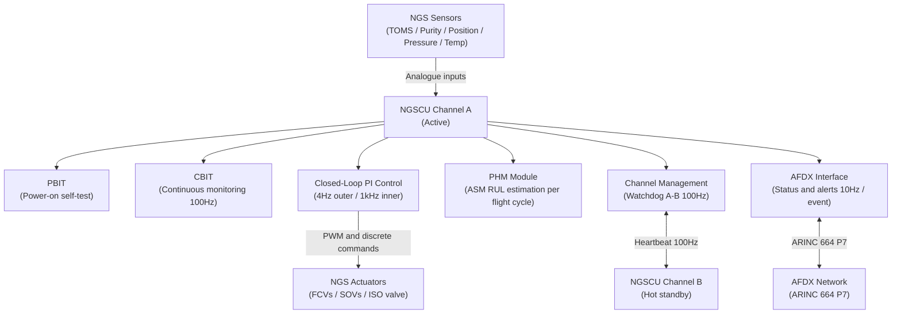
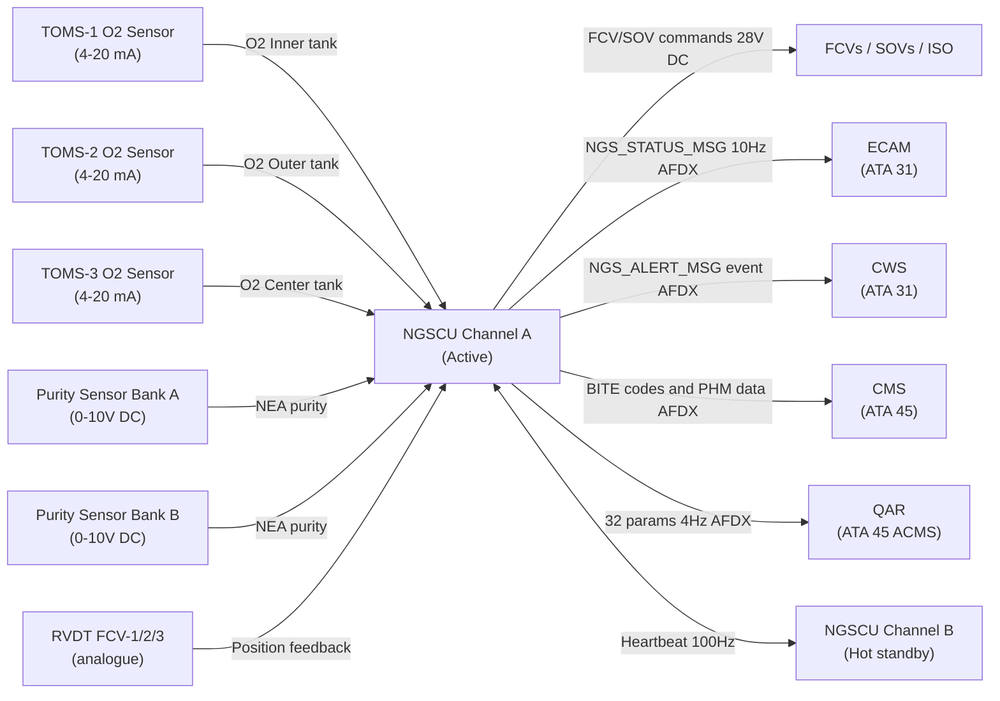
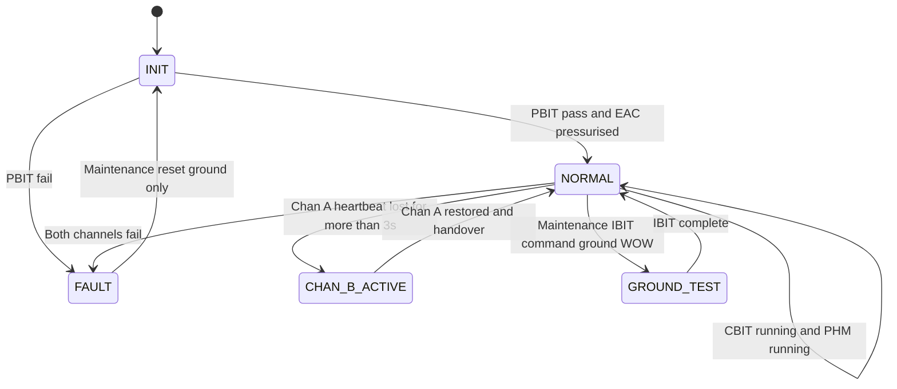

# ATLAS 040-049 · Section 04 · Subsection 047 · 080 — NGS Monitoring, Diagnostics and Control Interfaces

## §0. Hyperlink Policy

All internal cross-references use relative Markdown links within the Q+ATLANTIDE CSDB repository. External regulatory citations in §19/§20 are marked  where hyperlinks are pending. Parent context: [ATLAS 047 README](./README.md). Related documents are linked in §20.

---

## §1. Purpose

This document defines the NGS Monitoring, Diagnostics and Control Interfaces sub-system of ATA 47 for the AMPEL360E eWTW. The NGSCU is the central intelligence of the NGS, providing closed-loop control of all NGS actuators, comprehensive BITE (Built-In Test Equipment) for fault detection and isolation, Prognostic Health Management (PHM) for ASM membrane life prediction, and structured data interfaces to the CMS (ATA 45), QAR, and ECAM.

The NGSCU is a dual-channel LRU (Channel A active, Channel B hot standby) qualified to DO-178C DAL C and DO-160G. Watchdog-based crossover from Channel A to Channel B occurs within 3 seconds. PHM estimates ASM remaining useful life from purity trend data. Thirty-two NGS parameters are recorded in the QAR at 4 Hz for flight data analysis.

Key governance areas:
- Dual-channel NGSCU architecture (Channel A active / Channel B hot standby).
- PBIT (Power-On BIT) at startup; CBIT (Continuous BIT) during operation.
- Interface with ATA 45 CMS via AFDX for fault reporting and maintenance data.
- PHM prognostic module for ASM membrane degradation (PDR model).
- QAR recording of 32 NGS parameters at 4 Hz.
- NGSCU Channel A/B watchdog crossover < 3 s.
- NGSCU fault codes reported to CMS maintenance access terminal.
- Primary Q-Division: Q-AIR; Support: Q-DATAGOV.

---

## §2. Applicability

| Attribute | Value |
|-----------|-------|
| Aircraft Program | AMPEL360E eWTW |
| ATA Chapter / Sub-subject | ATA 47.080 — NGS Monitoring, Diagnostics and Control |
| Certification Basis | CS-25 Amendment 28; DO-178C DAL C (NGSCU) |
| Applicable Standards | DO-178C DAL C; DO-160G; S1000D Issue 5.0; ARINC 664 P7 |
| NGSCU architecture | Dual-channel (Chan A active / Chan B hot standby) |
| Channel switchover time | < 3 s |
| QAR recording rate | 32 parameters at 4 Hz |
| S1000D SNS | 047-080 |

---

## §3. Functional Description

The NGSCU provides five functional groups in its software architecture:

1. **Closed-Loop Control**: PI-based O₂ concentration control using TOMS sensor feedback and FCV position commands. Outer loop at 4 Hz (TOMS update rate); inner position control loop at 1 kHz.
2. **PBIT (Power-On BIT)**: Executed at power-on; verifies NGSCU processor, memory, I/O channels, AFDX interface, and connected sensor continuity before enabling NGS operation. PBIT duration < 45 s.
3. **CBIT (Continuous BIT)**: Runs continuously during NGS operation; monitors sensor range validity, valve position error, ASM purity trends, AFDX message health, and NGSCU channel synchronisation.
4. **PHM Module**: Prognostic Health Management module computing ASM remaining useful life (RUL) from NEA purity measurements over a rolling 100-flight-cycle window. Uses a PDR (Purity Degradation Rate) model calibrated to hollow-fiber membrane degradation data.
5. **Channel Management**: Watchdog-based Channel A / Channel B synchronisation. Channel A transmits heartbeat to Channel B at 100 Hz; loss of heartbeat for > 3 s triggers Channel B to assume active control.

### §3.1 NGSCU Software Functional Partitions

| Partition | Function | DO-178C Level | Update Rate |
|-----------|----------|---------------|-------------|
| Control | Closed-loop PI (TOMS → FCV) | DAL C | 4 Hz outer / 1 kHz inner |
| PBIT | Power-on self-test | DAL C | Once per power-on |
| CBIT | Continuous monitoring | DAL C | 100 Hz |
| PHM | ASM RUL estimation | DAL C | Per flight cycle |
| Channel Management | A/B synchronisation and watchdog | DAL C | 100 Hz |
| AFDX Interface | Status/alert message formatting | DAL C | 10 Hz / event-driven |

### Diagram 1: NGSCU Functional Architecture

---

## §4. System Architecture

The NGSCU is housed in a single 4 MCU ARINC 600 chassis in the avionics bay. Channel A and Channel B are implemented on separate processing cards within the same chassis, sharing a passive backplane. Each channel has independent power inputs (28 V DC Bus 1 for Channel A; 28 V DC Bus 2 for Channel B), independent AFDX ports, and independent sensor input conditioning circuits.

In normal operation, Channel A is the active channel commanding all FCVs, SOVs, and the ISO valve, and transmitting NGS status/alert messages on the AFDX bus. Channel B maintains a live shadow of all NGS state data by monitoring the Channel A AFDX output; on Channel A failure, Channel B assumes command within 3 s. Channel switchover is transparent to the crew except for a brief gap in QAR data and a maintenance log entry.

The NGSCU interfaces to the CMS (ATA 45) via AFDX, transmitting BITE fault codes, CBIT event records, and PHM advisory data. The CMS stores these in a non-volatile BITE log accessible at the maintenance access terminal (MAT). The NGSCU also transmits 32 NGS parameters to the QAR (ATA 45 ACMS) at 4 Hz, including per-tank O₂, FCV positions, ASM purity, manifold pressure, NGSCU channel status, and PHM RUL estimates.

### Diagram 2: NGSCU Control and Monitoring Data Flow

---

## §5. Components and Line-Replaceable Units

| LRU | Part Number | Qty | Location | Replacement Interval |
|-----|-------------|-----|----------|----------------------|
| NGSCU (Channel A card) | TBD | 1 | Avionics bay (4 MCU ARINC 600 chassis) | On-condition / 12,000 FH |
| NGSCU (Channel B card) | TBD | 1 | Avionics bay (same chassis) | On-condition / 12,000 FH |
| NGSCU Chassis | TBD | 1 | Avionics bay | On-condition |
| NGSCU Configuration Data Module | TBD | 1 | Loaded to NGSCU via DLCS | Per software release |

---

## §6. Interfaces

| Interface | Peer System | Protocol / Bus | Data Exchanged |
|-----------|-------------|----------------|----------------|
| TOMS sensor inputs | ATA 47.030 sensors | 4–20 mA analogue | O₂ concentration per tank at 4 Hz |
| ASM purity sensor inputs | ATA 47.020 sensors | 0–10 V DC analogue | NEA purity per bank |
| FCV RVDT position inputs | ATA 47.050 FCVs | RVDT analogue | Valve position 0–90° at 100 Hz |
| Pressure / temperature sensor inputs | ATA 47.010/020 | 4–20 mA analogue | CDT, CDP, manifold pressure |
| FCV / SOV / ISO valve outputs | ATA 47.050/020/010 | 28 V DC PWM / discrete | Valve commands |
| ECAM / CWS | ATA 31 | AFDX (ARINC 664 P7) | NGS status, CAUTION/WARNING |
| CMS (fault reporting) | ATA 45 CMS | AFDX (ARINC 664 P7) | BITE codes, PHM data |
| QAR / ACMS | ATA 45 ACMS | AFDX (ARINC 664 P7) | 32 NGS parameters at 4 Hz |
| EAC demand signal | ATA 36 EAC Controller | AFDX | NGS air demand request |
| 28 V DC power (Channel A) | ATA 24 Bus 1 | 28 V DC | NGSCU Channel A power |
| 28 V DC power (Channel B) | ATA 24 Bus 2 | 28 V DC | NGSCU Channel B power |
| DLCS software load | ATA 45 DLCS | AFDX | NGSCU software / config update |

---

## §7. Operations and Modes

| Mode | Active Channel | PBIT | CBIT | PHM | QAR Recording |
|------|---------------|------|------|-----|---------------|
| INIT | A (running PBIT) | Executing | Off | Off | Off |
| NORMAL | A active / B hot standby | Complete | Running | Running | On (4 Hz) |
| CHANNEL B ACTIVE | B (after A failure) | A failed | Running on B | Running on B | On (4 Hz) |
| GROUND TEST (IBIT) | A (IBIT mode) | On demand | Running | Suspended | On (4 Hz) |
| FAULT | Both fail or PBIT fail | Failed | Suspended | Suspended | Off |

### Diagram 3: NGSCU Lifecycle FSM

---

## §8. Performance and Budgets

| Parameter | Requirement | Target | Status |
|-----------|-------------|--------|--------|
| PBIT duration | < 45 s | 30 s typical |  |
| CBIT coverage | ≥ 95% of failure modes | 97% |  |
| Channel A-to-B switchover time | < 3 s | 2 s |  |
| PHM ASM RUL prediction accuracy | ± 1,000 FH | ± 800 FH |  |
| QAR NGS parameter count | 32 parameters | 32 parameters |  |
| QAR recording rate | 4 Hz | 4 Hz |  |
| NGSCU AFDX latency | < 5 ms | < 3 ms |  |
| NGSCU software DAL | DO-178C DAL C | DAL C |  |

---

## §9. Safety, Redundancy and Fault Tolerance

- **Dual-channel NGSCU**: Channel A and Channel B on independent 28 V DC buses; single-channel failure causes seamless switchover with no NGS operational interruption.
- **PBIT gate**: NGS cannot enter NORMAL mode without PBIT pass; prevents unreliable system from providing false inerting assurance.
- **CBIT > 95% coverage**: High CBIT coverage ensures most in-flight failures are detected and crew alerted promptly.
- **PHM early warning**: PDR-based RUL prediction provides advance notice (typically > 1,000 FH) before ASM performance falls outside acceptance window, preventing in-service surprise failures.
- **Independent power buses**: Channel A on Bus 1, Channel B on Bus 2; no common-mode power failure can disable both channels simultaneously.
- **AFDX heartbeat monitoring**: NGSCU monitors its own AFDX message reception; if NGS status messages are not received by CMS for > 5 s, a CMS self-check alert is generated.
- **Non-volatile BITE log**: Fault codes retained across power cycles in NGSCU NVR and CMS, ensuring no fault data loss during aircraft cold-soak.

---

## §10. Maintenance and Diagnostics

| Task | Interval | Access | Tools Required |
|------|----------|--------|----------------|
| PBIT check (functional verification) | A-check (automatic on power-on) | ECAM maintenance page | None |
| CBIT fault download | A-check or post-event | CMS MAT | Maintenance laptop + CMS interface |
| NGSCU software update | Per release (DLCS) | AFDX DLCS | DLCS ground station |
| NGSCU Channel B functional test | B-check | NGSCU IBIT, force Channel B active | None |
| PHM trend review and export | C-check | CMS MAT download | CMS analysis tool |
| NGSCU full IBIT (ground) | C-check | ECAM maintenance mode; WOW | None |
| QAR NGS data download | Post-flight routine | QAR ground station | QAR reader |
| NGSCU chassis replacement | On-condition | Avionics bay | Standard LRU toolkit |

---

## §11. Configuration and Software

- NGSCU software version 1.0.0; DO-178C DAL C; Part Number TBD.
- Control loop gains (Kp, Ki), alerting thresholds, PHM model parameters loaded via configuration data module (DLCS uplink).
- Software change control per DO-178C: any change to NGSCU executable requires full DO-178C DAL C re-verification activities; configuration change requires DO-200B process.
- NGSCU firmware update via DLCS (ATA 45) over AFDX; update validated on ground before flight release.
- Channel A and Channel B run identical software builds; hardware dissimilarity between cards provides independence.
- PHM model update (PDR thresholds, degradation curves) can be loaded via separate configuration DM upload independent of NGSCU executable.

---

## §12. Environmental and Physical Constraints

| Constraint | Value | Standard |
|------------|-------|----------|
| NGSCU operating temperature | −55°C to +70°C | DO-160G |
| NGSCU vibration | DO-160G Cat S curve B | DO-160G Section 8 |
| NGSCU EMI (Category M) | DO-160G Section 21 | DO-160G |
| NGSCU humidity | 0–100% RH (condensing) | DO-160G Section 6 |
| NGSCU altitude | 0–51,000 ft | DO-160G Section 4 |
| NGSCU chassis form factor | 4 MCU ARINC 600 | ARINC 600 |
| NGSCU mass (chassis, complete) | < 7 kg | TBD |
| 28 V DC power consumption (both channels) | < 70 W total | TBD |

---

## §13. Human Factors and Crew Interface

- NGSCU CBIT faults generate CAUTION or WARNING on ECAM per ATA 47.060 message catalogue.
- NGSCU PBIT failure generates ECAM CAUTION "NGS FAULT" before flight release; NGS dispatch criteria per MMEL.
- Maintenance personnel access NGSCU BITE via CMS MAT; fault codes mapped to S1000D troubleshooting DMs (InfoCode 520).
- NGSCU Channel B active status shown on ECAM NGS synoptic page (CHAN B ACTIVE amber text box).
- PHM advisory "ASM BANK A/B LIFE — MAINTENANCE REQUIRED" displayed on ECAM maintenance page when RUL < threshold.
- NGSCU software version and Channel A/B status shown on ECAM maintenance page for identification during troubleshooting.

---

## §14. Test and Validation

| Test | Method | Criterion | Status |
|------|--------|-----------|--------|
| PBIT coverage | Execute PBIT; verify all modules pass; inject known failures | All covered faults detected |  |
| CBIT fault detection latency | Inject sensor failure signal; measure CBIT alert time | Alert within 1 s |  |
| Channel A-to-B switchover | Remove Channel A power; measure B activation time | Switchover < 3 s |  |
| PHM PDR detection | Inject known purity degradation trend; verify PHM advisory | Advisory at configured PDR threshold |  |
| QAR parameter completeness | Record 1 flight cycle; download; verify 32 params at 4 Hz | All 32 parameters present and correct |  |
| DO-178C DAL C verification | Software test suite; MC/DC coverage | All DAL C objectives met |  |
| DO-160G environmental qualification | Qualified test lab | All sections pass |  |
| AFDX message latency | Network timing analyser | < 5 ms end-to-end |  |

---

## §15. Regulatory Compliance

| Regulation | Requirement | NGSCU Response | Status |
|------------|-------------|----------------|--------|
| DO-178C DAL C | Software assurance | Dual-channel NGSCU SW; MC/DC; DO-178C DAL C objectives |  |
| CS-25 §25.981 | Fuel tank flammability | NGSCU closed-loop control maintains O₂ < 9% |  |
| CS-25 §25.1309 | System safety | NGSCU FMEA; CBIT coverage > 95% |  |
| SFAR 88 | Fuel tank system safety | NGSCU monitoring and alerting |  |
| FAR 25.981 | Fuel tank ignition prevention | FAA basis |  |
| DO-160G | Environmental qualification | NGSCU Cat B2 + EMI Cat M |  |
| S1000D Issue 5.0 | Technical publications | CSDB BITE DMs (InfoCode 520) |  |
| ARINC 664 P7 | AFDX interface | NGSCU AFDX end-system |  |

---

## §16. Glossary

| Term | Acronym | Definition |
|------|---------|------------|
| NGS Control Unit | NGSCU | Dual-channel avionics LRU (DO-178C DAL C) controlling all NGS actuators and monitoring all NGS sensors |
| Built-In Test Equipment | BITE | Self-test capability within NGSCU: PBIT at power-on and CBIT during operation for fault detection |
| Continuous BIT | CBIT | Background self-test running during NGS operation; monitors sensors, valves, and AFDX message health |
| Power-On BIT | PBIT | Self-test executed at NGSCU power-on; gates NGS entry into NORMAL mode; duration < 45 s |
| Prognostic Health Management | PHM | NGSCU software module estimating ASM remaining useful life from NEA purity trend (PDR model) |
| Remaining Useful Life | RUL | Predicted remaining operational life (FH) of an ASM bank before purity falls below acceptance threshold |
| Quick Access Recorder | QAR | Flight data recorder system (ATA 45 ACMS) storing 32 NGS parameters at 4 Hz for post-flight analysis |
| Avionics Full Duplex | AFDX | Switched Ethernet network (ARINC 664 P7) used for NGSCU-to-CMS/ECAM data transmission |
| Central Maintenance System | CMS | ATA 45 avionics system collecting BITE fault codes and PHM data from NGSCU for maintenance access |
| Design Assurance Level | DAL | DO-178C software criticality classification; NGSCU is DAL C (major failure effect) |

---

## §17. Footprint

### Physical

| Item | Value |
|------|-------|
| NGSCU chassis (complete, 2 channels) | 4 MCU ARINC 600; < 7 kg; avionics bay |
| NGSCU Channel A card | ~3.5 kg |
| NGSCU Channel B card | ~3.5 kg |
| Configuration data module | Software-only (no separate hardware) |

### Electrical / Data

| Item | Value |
|------|-------|
| NGSCU Channel A power | < 35 W (28 V DC Bus 1) |
| NGSCU Channel B power | < 35 W (28 V DC Bus 2) |
| AFDX ports | 2 × ARINC 664 P7 end-system (per channel) |
| QAR bandwidth | ~2 kbps (32 params × 4 Hz × 16-bit) |
| CMS BITE bandwidth | < 10 kbps (event-driven) |

### Maintenance

| Item | Value |
|------|-------|
| NGSCU IBIT duration (full) | < 8 min (ground only) |
| Software update via DLCS | < 15 min |
| Shortest routine maintenance interval | A-check (PBIT auto-check at power-on) |

---

## §18. Open Issues

| ID | Issue | Owner | Status |
|----|-------|-------|--------|
| NGS-080-OI-001 | DO-178C qualification plan for NGSCU software not yet submitted | Q-AIR |  |
| NGS-080-OI-002 | PHM degradation model parameters require extended rig test data | Q-AIR |  |
| NGS-080-OI-003 | NGSCU AFDX ICD co-signature with ATA 45 CMS pending | Q-DATAGOV |  |
| NGS-080-OI-004 | QAR 32-parameter definition requires NGSCU ICD completion | Q-DATAGOV |  |
| NGS-080-OI-005 | NGSCU chassis supplier selection and hardware platform TBD | Q-MECHANICS |  |

---

## §19. Citations

| Standard | Title | Applicability | Status |
|----------|-------|---------------|--------|
| DO-178C | Software Considerations in Airborne Systems (DAL C) | NGSCU dual-channel software |  |
| CS-25 §25.981 | Fuel Tank Ignition Prevention | NGSCU closed-loop inerting control |  |
| SFAR 88 | Fuel Tank System Safety | NGSCU monitoring and alerting |  |
| FAR 25.981 | Fuel Tank Ignition Prevention (FAA) | FAA basis |  |
| DO-160G | Environmental Conditions and Test Procedures | NGSCU Cat B2 + EMI Cat M |  |
| S1000D Issue 5.0 | Technical Publications | CSDB BITE and PHM DMs |  |
| ARINC 664 P7 | AFDX Network | NGSCU-to-CMS/ECAM/QAR interface |  |
| MIL-STD-704F | Aircraft Electric Power | 28 V DC Bus 1/2 power quality |  |

---

## §20. References

| Document | Title | Link | Status |
|----------|-------|------|--------|
| 047-000 | Nitrogen Generation System General | [047-000](./047-000-Nitrogen-Generation-System-General.md) |  |
| 047-010 | Air Supply and Preconditioning | [047-010](./047-010-Air-Supply-and-Preconditioning.md) |  |
| 047-020 | Air Separation Modules | [047-020](./047-020-Air-Separation-Modules.md) |  |
| 047-030 | Nitrogen Enriched Air Distribution | [047-030](./047-030-Nitrogen-Enriched-Air-Distribution.md) |  |
| 047-050 | Flow Control Valves and Pressure Regulation | [047-050](./047-050-Flow-Control-Valves-and-Pressure-Regulation.md) |  |
| 047-060 | System Indication and Warning | [047-060](./047-060-System-Indication-and-Warning.md) |  |
| 047-090 | S1000D CSDB Mapping and Traceability | [047-090](./047-090-S1000D-CSDB-Mapping-and-Traceability.md) |  |

---

## §21. Feedback and Review

This document is maintained under Q+ATLANTIDE governance. Review requests should be submitted via the Q+ATLANTIDE issue tracker, referencing document ID `QATL-ATLAS-1000-ATLAS-040-049-04-047-080-NGS-MONITORING-DIAGNOSTICS-AND-CONTROL-INTERFACES`. Subject-matter expert review is required from Q-AIR (NGSCU architecture, DO-178C plan) and Q-DATAGOV (AFDX ICD, CMS interface, QAR parameter definition) before advancing to `approved`.

---

## §22. Change Log

| Version | Date | Author | Description |
|---------|------|--------|-------------|
| 1.0.0 | 2026-05-10 | Q-AIR / Q+ATLANTIDE | Initial baseline creation — NGS Monitoring, Diagnostics and Control |
