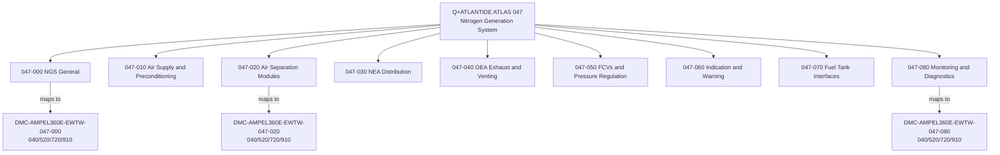
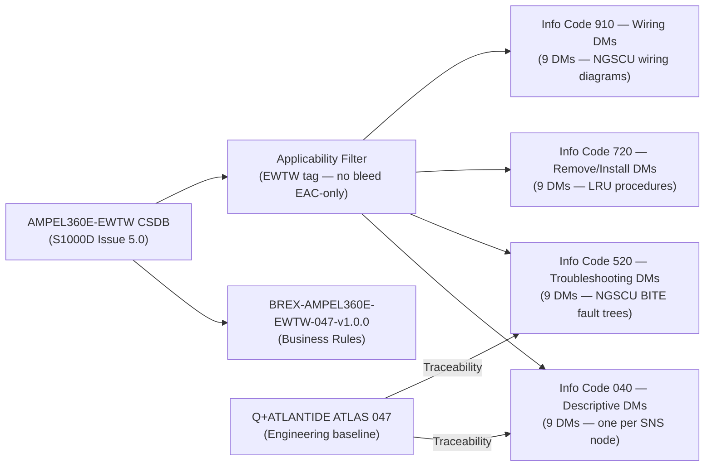
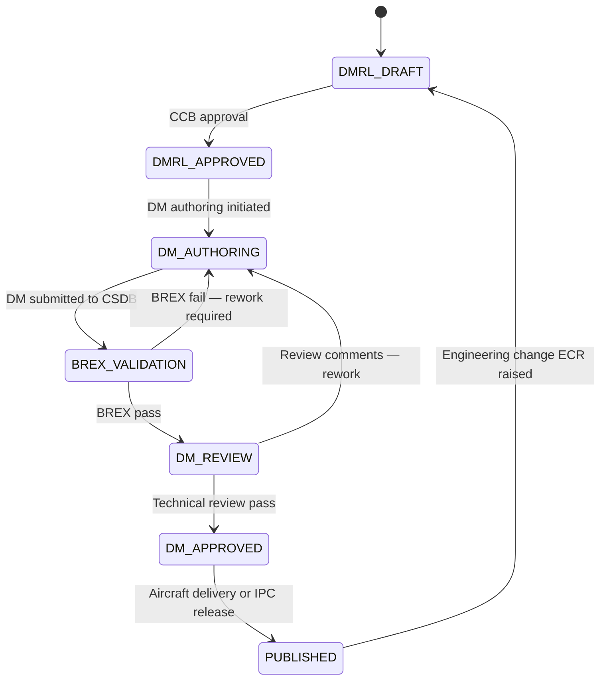

# ATLAS 040-049 · Section 04 · Subsection 047 · 090 — S1000D CSDB Mapping and Traceability

## §0. Hyperlink Policy

All internal cross-references use relative Markdown links within the Q+ATLANTIDE CSDB repository. External regulatory citations in §19/§20 are marked  where hyperlinks are pending. Parent context: [ATLAS 047 README](./README.md). All 047-NNN sibling documents are linked in §20.

---

## §1. Purpose

This document defines the S1000D CSDB Mapping and Traceability structure for ATA 47 NGS of the AMPEL360E eWTW. It provides the Data Module Requirements List (DMRL), the Data Module Code (DMC) schema, the BREX profile, and the regulatory traceability matrix linking CS-25 §25.981 / SFAR 88 / FAR 25.981 requirements to Q+ATLANTIDE ATLAS sub-subject files and the corresponding S1000D Data Modules in the CSDB.

This document has governance class `programme-controlled-publication-and-traceability-extension`, reflecting its role as a programme-level publication control artefact rather than a system engineering baseline document. It is the authoritative source for the NGS DMRL, applicability filtering (EWTW tag), and bi-directional requirement traceability for the AMPEL360E eWTW NGS documentation set.

Key governance areas:
- DMRL: 36 Data Modules across 9 SNS nodes (047-000 through 047-080), 4 Info Codes each.
- DMC schema: `DMC-AMPEL360E-EWTW-047-{NNN}-00A-{InfoCode}-A`.
- S1000D Info Codes used: 040 (Descriptive), 520 (Troubleshooting), 720 (Removal/Installation), 910 (Wiring Data).
- BREX profile: `BREX-AMPEL360E-EWTW-047-v1.0.0`.
- eWTW-specific applicability filter: `EWTW` tag on all NGS DMs (no bleed-air, EAC-only architecture).
- Regulatory traceability: CS-25.981 → ATLAS 047-000/020/030; SFAR 88 → ATLAS 047-040; FAR 25.981 → all 047-NNN.
- Primary Q-Division: Q-AIR; Support: Q-DATAGOV.

---

## §2. Applicability

| Attribute | Value |
|-----------|-------|
| Aircraft Program | AMPEL360E eWTW |
| ATA Chapter / Sub-subject | ATA 47.090 — S1000D CSDB Mapping and Traceability |
| Governance Class | programme-controlled-publication-and-traceability-extension |
| Certification Basis | CS-25 Amendment 28; FAR 25.981; SFAR 88 |
| Applicable Standards | S1000D Issue 5.0; DO-178C DAL C; DO-160G; ARINC 664 P7 |
| BREX Profile | BREX-AMPEL360E-EWTW-047-v1.0.0 |
| Applicability Tag | EWTW (all NGS DMs) |
| S1000D SNS | 047-090 |

---

## §3. Functional Description

The S1000D CSDB mapping function provides the structured link between the AMPEL360E eWTW NGS engineering baseline (Q+ATLANTIDE ATLAS 047-NNN documents) and the S1000D-compliant technical publications produced for operator, maintenance, and regulatory consumption. Every Q+ATLANTIDE ATLAS sub-subject maps to one or more S1000D Data Modules in the CSDB, addressable by their unique Data Module Code (DMC).

The eWTW aircraft-specific applicability filter `EWTW` is applied to all NGS DMs to distinguish them from bleed-air-based NGS documentation that may exist in legacy CSDB entries. The `EWTW` tag activates the BREX applicability rule: `BLEF=TRUE` (no engine bleed), `EAC_ONLY=TRUE`, `LH2=FALSE` for Jet-A baseline.

### §3.1 DMRL — Data Module Requirements List

| SNS Node | Q+ATLANTIDE Subsubject | DM InfoCode 040 (Descriptive) | DM InfoCode 520 (Troubleshooting) | DM InfoCode 720 (Remove/Install) | DM InfoCode 910 (Wiring) |
|----------|------------------------|-------------------------------|-----------------------------------|----------------------------------|--------------------------|
| 047-000 | NGS General | DMC-AMPEL360E-EWTW-047-000-00A-040-A | DMC-AMPEL360E-EWTW-047-000-00A-520-A | DMC-AMPEL360E-EWTW-047-000-00A-720-A | DMC-AMPEL360E-EWTW-047-000-00A-910-A |
| 047-010 | Air Supply and Preconditioning | DMC-AMPEL360E-EWTW-047-010-00A-040-A | DMC-AMPEL360E-EWTW-047-010-00A-520-A | DMC-AMPEL360E-EWTW-047-010-00A-720-A | DMC-AMPEL360E-EWTW-047-010-00A-910-A |
| 047-020 | Air Separation Modules | DMC-AMPEL360E-EWTW-047-020-00A-040-A | DMC-AMPEL360E-EWTW-047-020-00A-520-A | DMC-AMPEL360E-EWTW-047-020-00A-720-A | DMC-AMPEL360E-EWTW-047-020-00A-910-A |
| 047-030 | NEA Distribution | DMC-AMPEL360E-EWTW-047-030-00A-040-A | DMC-AMPEL360E-EWTW-047-030-00A-520-A | DMC-AMPEL360E-EWTW-047-030-00A-720-A | DMC-AMPEL360E-EWTW-047-030-00A-910-A |
| 047-040 | OEA Exhaust and Venting | DMC-AMPEL360E-EWTW-047-040-00A-040-A | DMC-AMPEL360E-EWTW-047-040-00A-520-A | DMC-AMPEL360E-EWTW-047-040-00A-720-A | DMC-AMPEL360E-EWTW-047-040-00A-910-A |
| 047-050 | FCVs and Pressure Regulation | DMC-AMPEL360E-EWTW-047-050-00A-040-A | DMC-AMPEL360E-EWTW-047-050-00A-520-A | DMC-AMPEL360E-EWTW-047-050-00A-720-A | DMC-AMPEL360E-EWTW-047-050-00A-910-A |
| 047-060 | System Indication and Warning | DMC-AMPEL360E-EWTW-047-060-00A-040-A | DMC-AMPEL360E-EWTW-047-060-00A-520-A | DMC-AMPEL360E-EWTW-047-060-00A-720-A | DMC-AMPEL360E-EWTW-047-060-00A-910-A |
| 047-070 | Fuel Tank Inerting Interfaces | DMC-AMPEL360E-EWTW-047-070-00A-040-A | DMC-AMPEL360E-EWTW-047-070-00A-520-A | DMC-AMPEL360E-EWTW-047-070-00A-720-A | DMC-AMPEL360E-EWTW-047-070-00A-910-A |
| 047-080 | NGS Monitoring and Diagnostics | DMC-AMPEL360E-EWTW-047-080-00A-040-A | DMC-AMPEL360E-EWTW-047-080-00A-520-A | DMC-AMPEL360E-EWTW-047-080-00A-720-A | DMC-AMPEL360E-EWTW-047-080-00A-910-A |

**Total DMs: 9 SNS nodes × 4 Info Codes = 36 Data Modules**

### §3.2 Regulatory Traceability Matrix

| Requirement | Regulation | ATLAS Document(s) | S1000D DMC(s) | Status |
|-------------|------------|-------------------|---------------|--------|
| Fuel tank flammability reduction | CS-25 §25.981 | 047-000, 047-020, 047-030 | DMC-AMPEL360E-EWTW-047-000/020/030-00A-040-A |  |
| OEA safe venting | SFAR 88 | 047-040 | DMC-AMPEL360E-EWTW-047-040-00A-040-A |  |
| Tank O₂ monitoring | FAR 25.981 | 047-030, 047-060 | DMC-AMPEL360E-EWTW-047-030/060-00A-040-A |  |
| NGS software assurance | DO-178C DAL C | 047-080 | DMC-AMPEL360E-EWTW-047-080-00A-040-A |  |
| Environmental qualification | DO-160G | 047-020, 047-050 | DMC-AMPEL360E-EWTW-047-020/050-00A-040-A |  |
| EAC-only air supply (no bleed) | CS-25 Amendment 28 | 047-010 | DMC-AMPEL360E-EWTW-047-010-00A-040-A |  |
| Technical publications | S1000D Issue 5.0 | 047-090 | All 047-NNN DMCs |  |
| Aircraft power quality | MIL-STD-704F | 047-050, 047-080 | DMC-AMPEL360E-EWTW-047-050/080-00A-040-A |  |

### Diagram 1: S1000D DMRL and ATLAS Mapping Hierarchy

---

## §4. System Architecture

The S1000D CSDB for ATA 47 NGS is structured as a sub-set of the AMPEL360E eWTW master CSDB, hosted in the Q+ATLANTIDE CSDB instance. The BREX file `BREX-AMPEL360E-EWTW-047-v1.0.0` enforces business rules specific to the eWTW NGS documentation:

- **EWTW applicability tag**: All NGS DMs carry `applicabilityRef=EWTW`; the BREX rules prevent application of any legacy bleed-air NGS DMs to the eWTW configuration.
- **DMC format**: `DMC-AMPEL360E-EWTW-047-{NNN}-00A-{InfoCode}-A` where `{NNN}` is the 3-digit SNS node (000–080) and `{InfoCode}` is the 3-digit S1000D information code.
- **Variant management**: `LH2=FALSE` for Jet-A baseline; future LH₂ variant will fork a parallel DMC set under `DMC-AMPEL360E-EWTW-LH2-047-...`.
- **Language**: English primary (en); Spanish (es) translations planned for Q+ATLANTIDE bilingual publication policy.

### Diagram 2: CSDB Structure and Applicability Flow

---

## §5. Components and Line-Replaceable Units

*This sub-subject does not define hardware LRUs. The DMRL and CSDB are software / data artefacts maintained under programme configuration control.*

| Artefact | Identifier | Custodian | Change Control |
|----------|------------|-----------|----------------|
| NGS DMRL (this document, §3.1) | QATL-ATLAS-1000-ATLAS-040-049-04-047-090 | Q-DATAGOV | Q+ATLANTIDE CCB |
| BREX file | BREX-AMPEL360E-EWTW-047-v1.0.0 | Q-DATAGOV | Programme release |
| CSDB DM set (36 DMs) | DMC-AMPEL360E-EWTW-047-{NNN}-00A-{InfoCode}-A | Q-DATAGOV | S1000D CCB |
| Traceability matrix (§3.2) | Embedded in this document | Q-AIR / Q-DATAGOV | Q+ATLANTIDE CCB |

---

## §6. Interfaces

| Interface | Peer System | Protocol | Data Exchanged |
|-----------|-------------|----------|----------------|
| CSDB (S1000D) | Q+ATLANTIDE CSDB instance | S1000D XML / IETP viewer | 36 NGS DMs; BREX; DMRL |
| ATLAS 047 engineering baseline | Q+ATLANTIDE repository | Markdown / Git | Sub-subject files (047-000 to 047-080) |
| Regulatory requirement database | CS-25 / FAR / SFAR registry | Reference | Traceability matrix entries |
| DO-178C SW artefacts | NGSCU SW verification authority | Document reference | Software DM (047-080 Info 040) |
| DO-160G test reports | LRU qualification authority | Document reference | Equipment qualification DMs |

---

## §7. Operations and Modes

| CSDB Activity | Trigger | Responsible | Output |
|---------------|---------|-------------|--------|
| DMRL baseline | ATLAS 047 baseline approval | Q-DATAGOV | Signed DMRL (this document §3.1) |
| DM authoring | DMRL approval | Technical writers | 36 S1000D XML DMs |
| BREX validation | DM authoring / each DM submission | CSDB validator | BREX-compliant DMs |
| Applicability filtering | Aircraft delivery configuration | Q-DATAGOV | EWTW-tagged DM set per aircraft |
| Traceability review | Regulatory audit | Q-AIR / Q-DATAGOV | Signed traceability matrix (§3.2) |
| DMRL amendment | Engineering change (ECR) | Q-DATAGOV / CCB | Updated DMRL; new/revised DMs |

### Diagram 3: CSDB Publication Lifecycle FSM

---

## §8. Performance and Budgets

| Parameter | Requirement | Target | Status |
|-----------|-------------|--------|--------|
| Total DMRL DM count | 36 DMs (9 nodes × 4 Info Codes) | 36 DMs |  |
| BREX conformance | 100% of submitted DMs pass BREX | 100% |  |
| Traceability matrix completeness | All CS-25.981 / SFAR 88 requirements traced | 8 requirements traced |  |
| ATLAS-to-DM coverage | Each ATLAS 047-NNN maps to ≥ 1 DM | 9/9 mapped |  |
| DM authoring completion | All 36 DMs authored and reviewed | 0 of 36 (TBD) |  |
| Applicability tag applied | EWTW tag on all 36 DMs | 36 DMs |  |
| Spanish translation | es-language DMs for bilingual publication | 0 of 36 (planned) |  |

---

## §9. Safety, Redundancy and Fault Tolerance

- **BREX validation as a gate**: No DM enters the CSDB without passing BREX validation; prevents malformed or inapplicable documentation reaching maintenance personnel.
- **Bi-directional traceability**: Regulatory requirements are traced forward to ATLAS documents and DMs; ATLAS documents are traced back to regulatory requirements. Both directions auditable.
- **Applicability filtering**: EWTW tag prevents legacy bleed-air NGS DMs from being served to AMPEL360E eWTW maintenance personnel, eliminating incorrect procedure risk.
- **CCB change control**: All DMRL and traceability matrix changes require CCB approval, preventing ad-hoc traceability breaks.
- **Version-locked ATLAS cross-references**: Each DM references the ATLAS sub-subject document ID and version at the time of DM authoring, providing a frozen link for regulatory audit.

---

## §10. Maintenance and Diagnostics

| Task | Interval | Responsible | Tools Required |
|------|----------|-------------|----------------|
| DMRL review and update | At each engineering change (ECR) | Q-DATAGOV / Q-AIR | Q+ATLANTIDE issue tracker |
| BREX file update | At each S1000D schema update | Q-DATAGOV | CSDB BREX editor |
| Traceability matrix review | At each certification review | Q-AIR / Q-DATAGOV | Traceability tool |
| DM review (all 36) | At each B-check AMM revision cycle | Technical writers | CSDB authoring tool |
| Applicability filter update | At aircraft delivery or config change | Q-DATAGOV | CSDB applicability editor |

---

## §11. Configuration and Software

- DMRL version: 1.0.0 (this document); change log in §22.
- BREX version: `BREX-AMPEL360E-EWTW-047-v1.0.0`; stored in Q+ATLANTIDE CSDB under Q-DATAGOV custodianship.
- DMC schema version: Issue 5.0 compliant; defined in BREX file.
- All 36 DMs are managed under configuration management with individual version numbers.
- ATLAS-to-DM traceability links stored as metadata in each DM XML header (`<remark applicRef="EWTW">ATLAS-{doc-id}</remark>`).
- Language: English (en) primary; Spanish (es) translation planned but not yet initiated.

---

## §12. Environmental and Physical Constraints

*This sub-subject does not define hardware with environmental constraints. All constraints apply to the CSDB infrastructure:*

| Constraint | Value |
|------------|-------|
| CSDB hosting | Q+ATLANTIDE repository (cloud / on-premise TBD) |
| DM format | S1000D Issue 5.0 XML schema |
| BREX schema | S1000D Issue 5.0 BREX XSD |
| Access control | Q+ATLANTIDE RBAC (role-based access control) per Q-DATAGOV policy |

---

## §13. Human Factors and Crew Interface

- This sub-subject does not have direct crew interface. The published DMs (Info Code 040) are consumed by maintenance personnel via the IETP viewer on the Maintenance Access Terminal (MAT).
- Info Code 720 (Remove/Install) DMs are the primary AMM procedures used by technicians; BREX compliance ensures consistent formatting.
- Info Code 520 (Troubleshooting) DMs are accessed via CMS fault code links on the MAT; BITE fault codes are cross-referenced to the relevant 520 DM.
- Bilingual publication (en/es) supports maintenance personnel in Q+ATLANTIDE programme geographies.

---

## §14. Test and Validation

| Test | Method | Criterion | Status |
|------|--------|-----------|--------|
| DMRL completeness check | Verify 36 DMs defined across all SNS nodes | 9 nodes × 4 Info Codes = 36 |  |
| BREX validation (automated) | CSDB validator on each DM submission | 100% BREX pass |  |
| Traceability matrix audit | Cross-check each CS-25.981 / SFAR 88 requirement to ATLAS doc and DMC | All requirements traced |  |
| Applicability filter test | Apply EWTW filter; verify only EWTW DMs returned | No legacy bleed-air DMs returned |  |
| DM content review | Technical review by subject-matter expert per DM | No ambiguous or incorrect procedures |  |
| IETP rendering check | Render DMs in IETP viewer; verify formatting | All DMs render correctly |  |

---

## §15. Regulatory Compliance

| Regulation | Requirement | Traceability Response | Status |
|------------|-------------|----------------------|--------|
| CS-25 §25.981 | Fuel tank flammability | Traced to ATLAS 047-000/020/030 and DMC-040-A |  |
| SFAR 88 | Fuel tank system safety | Traced to ATLAS 047-040 and DMC-040-A |  |
| FAR 25.981 | Fuel tank ignition prevention (FAA) | Traced to all 047-NNN ATLAS docs |  |
| DO-178C DAL C | NGSCU software assurance | Traced to ATLAS 047-080 and DMC-047-080-040-A |  |
| DO-160G | Environmental qualification | Traced to ATLAS 047-020/050 and DMC-040-A |  |
| S1000D Issue 5.0 | Technical publication standard | DMRL, BREX, DMC schema all S1000D Issue 5.0 |  |
| ARINC 664 P7 | AFDX interface | Referenced in ATLAS 047-080 and DM 910 (wiring) |  |
| MIL-STD-704F | Aircraft electric power | Referenced in ATLAS 047-050/080 |  |

---

## §16. Glossary

| Term | Acronym | Definition |
|------|---------|------------|
| Data Module Requirements List | DMRL | Comprehensive list of all S1000D Data Modules required for a system; defines SNS nodes, Info Codes, and quantity |
| Data Module Code | DMC | Unique alphanumeric identifier for an S1000D Data Module; follows defined schema per BREX |
| Common Source DataBase | CSDB | S1000D repository storing all Data Modules in XML format; the master source for technical publications |
| Information Code | InfoCode | S1000D code indicating the type of content in a DM: 040=Descriptive, 520=Troubleshooting, 720=Remove/Install, 910=Wiring |
| Business Rules Exchange Object | BREX | S1000D file defining document management rules for a specific programme; enforced by CSDB validator |
| System/Sub-system/Sub-sub-system Number | SNS | S1000D hierarchical coding system; for NGS: 047-{NNN} maps to ATA 47 sub-subjects |
| S1000D | — | International specification (ASD/AIA/ATA) for technical publications; Issue 5.0 used on AMPEL360E eWTW |
| ATLAS | — | Q+ATLANTIDE Aircraft Top Level Architecture Schema/System documentation baseline |
| Traceability | — | Bi-directional linkage between regulatory requirements, engineering documents (ATLAS), and publication DMs |
| Applicability filter | — | CSDB mechanism selecting DMs applicable to a specific aircraft configuration (e.g., EWTW tag for eWTW variant) |

---

## §17. Footprint

### Physical

*No physical hardware. All artefacts are data/software.*

### Electrical / Data

| Item | Value |
|------|-------|
| Total NGS DMRL DMs | 36 DMs |
| DM format | S1000D Issue 5.0 XML |
| BREX file size (estimated) | < 500 KB |
| Total DM XML file size (estimated) | < 10 MB (36 DMs at ~280 KB avg) |

### Maintenance

| Item | Value |
|------|-------|
| DMRL review frequency | At each engineering change (ECR) |
| Traceability matrix audit | Per certification review gate |
| DM revision cycle | Aligned to AMM revision cycle |

---

## §18. Open Issues

| ID | Issue | Owner | Status |
|----|-------|-------|--------|
| NGS-090-OI-001 | 36 DMs not yet authored — DM authoring programme to be initiated | Q-DATAGOV |  |
| NGS-090-OI-002 | BREX file BREX-AMPEL360E-EWTW-047-v1.0.0 not yet created in CSDB | Q-DATAGOV |  |
| NGS-090-OI-003 | Spanish (es) translation programme not yet scoped | Q-DATAGOV |  |
| NGS-090-OI-004 | CSDB hosting infrastructure selection pending programme decision | Q-DATAGOV |  |
| NGS-090-OI-005 | LH₂ variant DMRL fork — deferred to future programme phase | Q-DATAGOV / Q-GREENTECH |  |

---

## §19. Citations

| Standard | Title | Applicability | Status |
|----------|-------|---------------|--------|
| S1000D Issue 5.0 | International Specification for Technical Publications | DMRL, BREX, DMC schema, all 36 DMs |  |
| CS-25 §25.981 | Fuel Tank Ignition Prevention | Primary regulatory requirement — traced to ATLAS 047 |  |
| SFAR 88 | Fuel Tank System Safety | Regulatory requirement — traced to ATLAS 047-040 |  |
| FAR 25.981 | Fuel Tank Ignition Prevention (FAA) | FAA basis — traced to all 047-NNN |  |
| DO-178C | Software Considerations (DAL C) | Traced to ATLAS 047-080 |  |
| DO-160G | Environmental Conditions and Test Procedures | Traced to ATLAS 047-020/050 |  |
| ARINC 664 P7 | AFDX Network | Referenced in wiring DMs (910) |  |
| MIL-STD-704F | Aircraft Electric Power | Referenced in ATLAS 047-050/080 |  |

---

## §20. References

| Document | Title | Link | Status |
|----------|-------|------|--------|
| 047-000 | Nitrogen Generation System General | [047-000](./047-000-Nitrogen-Generation-System-General.md) |  |
| 047-010 | Air Supply and Preconditioning | [047-010](./047-010-Air-Supply-and-Preconditioning.md) |  |
| 047-020 | Air Separation Modules | [047-020](./047-020-Air-Separation-Modules.md) |  |
| 047-030 | Nitrogen Enriched Air Distribution | [047-030](./047-030-Nitrogen-Enriched-Air-Distribution.md) |  |
| 047-040 | Oxygen Enriched Air Exhaust and Venting | [047-040](./047-040-Oxygen-Enriched-Air-Exhaust-and-Venting.md) |  |
| 047-050 | Flow Control Valves and Pressure Regulation | [047-050](./047-050-Flow-Control-Valves-and-Pressure-Regulation.md) |  |
| 047-060 | System Indication and Warning | [047-060](./047-060-System-Indication-and-Warning.md) |  |
| 047-070 | Fuel Tank Inerting Interfaces | [047-070](./047-070-Fuel-Tank-Inerting-Interfaces.md) |  |
| 047-080 | NGS Monitoring, Diagnostics and Control Interfaces | [047-080](./047-080-NGS-Monitoring-Diagnostics-and-Control-Interfaces.md) |  |

---

## §21. Feedback and Review

This document is maintained under Q+ATLANTIDE governance at governance class `programme-controlled-publication-and-traceability-extension`. Review requests should be submitted via the Q+ATLANTIDE issue tracker, referencing document ID `QATL-ATLAS-1000-ATLAS-040-049-04-047-090-S1000D-CSDB-MAPPING-AND-TRACEABILITY`. Review is required from Q-DATAGOV (CSDB/BREX/DMRL authority) and Q-AIR (regulatory traceability sign-off) before advancing to `approved`. CCB approval is required for any change to the DMRL (§3.1) or traceability matrix (§3.2).

---

## §22. Change Log

| Version | Date | Author | Description |
|---------|------|--------|-------------|
| 1.0.0 | 2026-05-10 | Q-AIR / Q-DATAGOV / Q+ATLANTIDE | Initial baseline creation — S1000D CSDB Mapping and Traceability; DMRL 36 DMs; regulatory traceability matrix |
