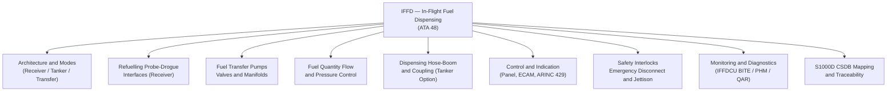
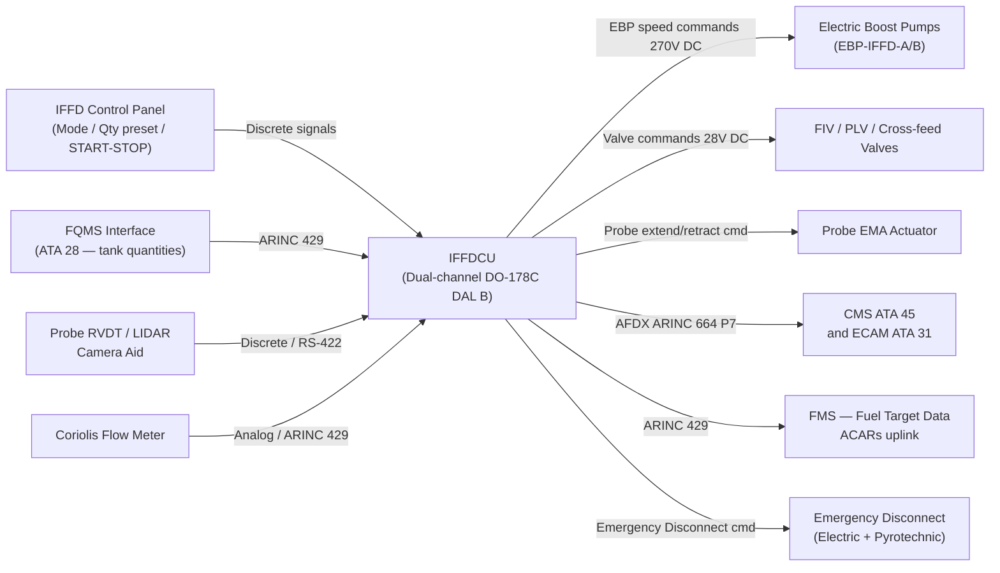
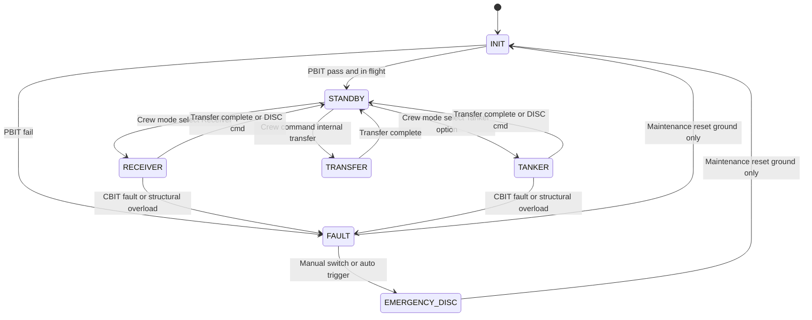

# ATLAS 040-049 · Section 04 · Subsection 048 · 000 — In-Flight Fuel Dispensing General

## §0. Hyperlink Policy

All internal cross-references use relative Markdown links within the Q+ATLANTIDE CSDB repository. External regulatory citations in §19/§20 are marked  where hyperlinks are pending. Parent context: [ATLAS 048 README](./README.md). Sub-system documents are linked in §20.

---

## §1. Purpose

ATA 48 — In-Flight Fuel Dispensing (IFFD) defines the architecture, functionality, and integration of the on-board aerial refuelling system for the AMPEL360E eWTW all-electric wide-twin-wing aircraft. The AMPEL360E eWTW operates with **no hydraulic system** and **no engine bleed-air**; all IFFD actuation is provided by electric actuators and electric-driven fuel transfer pumps.

The IFFD system enables the aircraft to operate as a **receiver** (standard configuration — refuelling from a tanker via probe-drogue) or as a **tanker** (optional configuration — dispensing fuel to a receiver via hose-drogue or boom). The In-Flight Fuel Dispensing Control Unit (IFFDCU) is a dual-channel unit qualified to DO-178C DAL B, reflecting the higher safety criticality of aerial refuelling operations compared to ground systems.

Key governance areas:
- IFFDCU dual-channel DO-178C DAL B with hot-standby crossover.
- Receiver mode: electrically-actuated retractable refuelling probe with probe-drogue engagement.
- Tanker mode (optional): electric hose-reel assembly, drogue deployment actuator, and coupling interfaces.
- Electric Boost Pumps (EBP) for in-flight fuel transfer — no hydraulic actuation.
- Emergency disconnect: dual-coil electric actuator with pyrotechnic backup (single-shot, < 100 ms).
- CMS/ECAM integration via AFDX (ARINC 664 P7).
- Primary Q-Division: Q-AIR; Support: Q-MECHANICS, Q-DATAGOV, Q-GREENTECH, Q-GROUND.

---

## §2. Applicability

| Attribute | Value |
|-----------|-------|
| Aircraft Program | AMPEL360E eWTW |
| ATA Chapter | ATA 48 — In-Flight Fuel Dispensing |
| Certification Basis | CS-25 Amendment 28; FAR 25.975; SFAR 88; MIL-STD-1760 (tanker option) |
| Applicable Standards | DO-178C DAL B; DO-160G; S1000D Issue 5.0; ARINC 664 P7; ARINC 429 |
| Actuation Architecture | All-electric — no hydraulic actuation |
| IFFD Control Software DAL | DO-178C DAL B (IFFDCU dual-channel) |
| S1000D SNS | 048-000 |
| Flow Rate (receiver, typical) | Up to 3,000 lb/min |
| Emergency Disconnect Activation | < 100 ms (electric + pyrotechnic backup) |

---

## §3. Functional Description

The AMPEL360E eWTW In-Flight Fuel Dispensing system provides a fully electric aerial refuelling capability for both receiver and tanker roles. Unlike conventional tanker/receiver aircraft that rely on hydraulic actuation for probe extension, hose-reel deployment, and coupling mechanisms, the AMPEL360E eWTW replaces all hydraulic actuators with electromechanical actuators (EMA) and electrically-driven fuel transfer boost pumps.

In **Receiver Mode**, the retractable refuelling probe extends forward of the nose section via an EMA telescoping mechanism. The probe alignment system uses LIDAR and camera-aided guidance to assist the crew in locating the tanker drogue basket. Once engaged, the IFFDCU manages fuel flow via the Electric Boost Pumps on the tanker side (flow path), controlling the fuel inlet isolation valve and distributing received fuel to the selected onboard tanks. A Coriolis-type flow meter measures the mass flow rate in real time.

In **Tanker Mode** (optional fit), an under-fuselage or wing-mounted hose-reel assembly deploys a fuel hose with a drogue basket. The drogue is maintained in position by aerodynamic drag. Receiver aircraft engage the drogue probe and fuel is transferred from the dispensing tanks through the cross-feed manifold and hose assembly. The coupling lock mechanism is electrically actuated and features a breakaway coupling at 600 lb pull force.

The IFFDCU executes Power-On BIT (PBIT) at every startup and Continuous BIT (CBIT) during flight, monitoring all sensor inputs, actuator feedback, and channel cross-comparison. Fault data is transmitted to ATA 45 CMS via AFDX for maintenance access and QAR recording.

### §3.1 Functional Breakdown

| Function | Sub-system | ATA Reference |
|----------|-----------|---------------|
| IFFD architecture and modes | IFFDCU, mode selection panel | ATA 48.010 |
| Refuelling probe-drogue interfaces | Probe assembly, RVDT, LIDAR | ATA 48.020 |
| Fuel transfer pumps, valves, manifolds | EBP, cross-feed manifold, FIV | ATA 48.030 |
| Fuel quantity, flow and pressure control | FQMS interface, PID loop, flow meter | ATA 48.040 |
| Dispensing hose-boom and coupling | Hose-reel, drogue, boom, coupling | ATA 48.050 |
| Control and indication | IFFD panel, ECAM synoptic, ARINC 429 | ATA 48.060 |
| Safety interlocks, emergency disconnect | Pyrotechnic disconnect, jettison valve | ATA 48.070 |
| IFFD monitoring, diagnostics, control | IFFDCU BITE, PHM, QAR, ACARS AHM | ATA 48.080 |
| S1000D CSDB mapping and traceability | DMRL, DMC schema, regulatory matrix | ATA 48.090 |

### Diagram 1: IFFD Functional Hierarchy

---

## §4. System Architecture

The IFFD architecture is built around the dual-channel IFFDCU, which serves as the central processing and control unit for all IFFD functions. The IFFDCU is hosted in the avionics bay and interfaces with the aircraft AFDX network (ARINC 664 P7), providing data services to CMS (ATA 45), ECAM (ATA 31/42), and the IFFD Control Panel.

Channel A is the active channel under normal operation; Channel B remains in hot standby. On detection of a Channel A fault (via internal cross-comparison at 50 ms intervals), Channel B assumes control within 150 ms. Both channels execute the same certified software build (DO-178C DAL B) on dissimilar hardware partitions to guard against common-cause failures.

The electric fuel transfer architecture comprises two Electric Boost Pumps (EBP-IFFD-A and EBP-IFFD-B) on the IFFD supply circuit, powered from the 270 V DC bus (ATA 24). The IFFD fuel flow path is isolated from the main aircraft fuel distribution circuit by Fuel Inlet Isolation Valves (FIV). This prevents contamination of the main fuel system during aerial refuelling. Overpressure protection is provided by a Pressure Limiting Valve (PLV) set to 65 psig burst limit.

### Diagram 2: IFFD System Data and Signal Flow

---

## §5. Components and Line-Replaceable Units

| LRU | Part Number | Qty | Location | Replacement Interval |
|-----|-------------|-----|----------|----------------------|
| IFFDCU (Channel A) |  | 1 | Avionics bay | On-condition / 15,000 FH |
| IFFDCU (Channel B) |  | 1 | Avionics bay | On-condition / 15,000 FH |
| Retractable Refuelling Probe Assembly |  | 1 | Nose section (retractable) | On-condition / 5,000 cycles |
| Probe EMA Actuator |  | 1 | Probe housing | On-condition / 8,000 FH |
| Electric Boost Pump IFFD-A |  | 1 | Center tank / sump | On-condition / 12,000 FH |
| Electric Boost Pump IFFD-B |  | 1 | Center tank / sump | On-condition / 12,000 FH |
| Fuel Inlet Isolation Valve (FIV) |  | 2 | IFFD manifold | On-condition / 10,000 FH |
| Coriolis Flow Meter |  | 1 | IFFD supply line | On-condition / 10,000 FH |
| IFFD Control Panel |  | 1 | Center console | On-condition |
| Emergency Disconnect Unit (EDU) |  | 1 | Probe coupling interface | Single-shot (replace after actuation) |
| Hose-Reel Assembly (Tanker option) |  | 1 | Aft fuselage / wing pod | On-condition / 3,000 deployments |

---

## §6. Interfaces

| Interface | Peer System | Protocol / Bus | Data Exchanged |
|-----------|-------------|----------------|----------------|
| Fuel quantity data | ATA 28 Fuel System (FQMS) | ARINC 429 | Tank quantities, fuel density, CG |
| 270 V DC power (EBP) | ATA 24 Electrical | 270 V DC bus | EBP drive power |
| 28 V DC power (valves / control) | ATA 24 Electrical | 28 V DC bus | Valve actuation, IFFDCU control |
| CMS fault reporting | ATA 45 CMS | AFDX (ARINC 664 P7) | Fault codes, maintenance data |
| IMA data services | ATA 42 IMA | AFDX (ARINC 664 P7) | IFFD health parameters |
| ECAM / MFD synoptic | ATA 31 Indicating | ARINC 664 P7 | Probe status, flow rate, coupling lock |
| FMS fuel target data | ATA 22 FMS | ARINC 429 | Target fuel quantity, transfer schedule |
| QAR / ACMS recording | ATA 45 ACMS | AFDX | 48 IFFD parameters at 4 Hz |
| ACARS AHM uplink | ATA 46 Information | ACARS / VHF | Fleet fuel state, AHM data |
| Radio altimeter (WOW inhibit) | ATA 34 Navigation | Discrete (28 V DC) | Ground proximity < 100 ft inhibit |

---

## §7. Operations and Modes

| Mode | Trigger | IFFDCU State | Fuel Flow | Action |
|------|---------|-------------|-----------|--------|
| INIT | Power-on | PBIT executing | Off | Sensors and actuators initialising |
| STANDBY | PBIT pass, in flight | Both channels armed | Off | Awaiting mode selection |
| RECEIVER | Crew mode select + Probe extend | Active — Receiver path | Inbound (tanker→aircraft) | Probe extends, FIV open, EBP arm |
| TANKER | Crew mode select + Hose deploy (option) | Active — Tanker path | Outbound (aircraft→receiver) | Hose deploys, EBP pump, coupling arm |
| TRANSFER | Internal fuel transfer command | Transfer sub-mode | Internal (wing↔center) | Cross-feed open, EBP pump |
| GROUND BYPASS | Ground maintenance | Maintenance mode | Ground refuel path | IFFD isolated, ground refuel active |
| FAULT | CBIT detected fault or crew DISC | Fault state | Off | ECAM WARNING, EDU armed |
| EMERGENCY DISC | Manual switch or structural overload | Emergency state | Off | EDU fires (< 100 ms), jettison valve |

### Diagram 3: IFFD Finite State Machine

---

## §8. Performance and Budgets

| Parameter | Requirement | Target | Status |
|-----------|-------------|--------|--------|
| Fuel flow rate (receiver, max) | ≤ 3,000 lb/min | 2,800 lb/min typical |  |
| Probe extension time | < 8 s | 6 s typical |  |
| Probe retraction time | < 8 s | 6 s typical |  |
| Emergency disconnect activation | < 100 ms | 80 ms typical |  |
| IFFDCU channel switchover time | < 150 ms | 120 ms |  |
| Coupling pressure at receiver | 45–55 psig | 50 psig nominal |  |
| IFFDCU PBIT coverage | > 97% failure detection | 98% target |  |
| Total quantity transfer accuracy | ± 0.5% of transferred qty | ± 0.3% |  |
| DO-160G environmental qualification | Full qualification | All categories |  |

---

## §9. Safety, Redundancy and Fault Tolerance

- **Dual-channel IFFDCU**: Channel A active, Channel B hot standby; automatic switchover within 150 ms on channel fault. Both channels cross-compare at 50 ms intervals.
- **DO-178C DAL B software**: Higher DAL than NGS (DAL C) due to safety criticality of aerial refuelling — a single failure must not result in a catastrophic outcome.
- **Emergency disconnect — dual mechanism**: Primary electric actuator (dual-coil) plus pyrotechnic backup (single-shot). Both paths independently trigger within 100 ms of command.
- **Weight-on-wheels (WOW) inhibit**: IFFD activation is inhibited below radio altimeter 100 ft above ground to prevent inadvertent ground operation.
- **CS-25 §25.975 jettison path**: Overboard fuel jettison vent positioned in non-engine, non-ignition-source zone; compliant with CS-25 fuel venting requirements.
- **Fail-safe FIV design**: Fuel Inlet Isolation Valves are spring-return-to-closed; loss of electrical power closes the IFFD fuel path and protects the main fuel system.
- **Structural overload sensor**: Coupling force sensor triggers automatic emergency disconnect at > 600 lb pull force (tanker mode).
- **SFAR 88 compliance**: Fuel tank venting and jettison path design reviewed per SFAR 88 fuel tank safety requirements.
- **No hydraulic lines in IFFD path**: Elimination of hydraulic actuation removes a class of fluid contamination and fire hazard risks present on conventional IFFD systems.

---

## §10. Maintenance and Diagnostics

| Task | Interval | Access | Tools Required |
|------|----------|--------|----------------|
| IFFDCU IBIT (ground) | A-check | Avionics bay / ECAM maintenance mode | None (software-driven) |
| Probe EMA actuator functional test | 3,000 FH | Nose section access panel | IFFD panel / IBIT |
| Probe seal integrity check | 1,000 FH or B-check | Nose probe housing | Pressure decay test kit |
| FIV functional test (open/close) | B-check | IFFD manifold | IFFDCU IBIT |
| Coriolis flow meter calibration | 5,000 FH | IFFD supply line | Calibration flow bench |
| EBP IFFD-A/B functional check | C-check | Tank sump access | Electrical test set |
| Emergency Disconnect Unit (EDU) replacement | After each pyro actuation | Probe coupling interface | Standard LRU toolkit |
| Hose-reel assembly inspection (tanker) | 500 deployments | Aft fuselage / wing pod | Visual + NDT |
| IFFDCU software update | As released | Avionics bay | DLCS / ACARS |
| ACARS AHM data review | Per operator schedule | Ground station | ACARS data link |

---

## §11. Configuration and Software

- IFFDCU software qualified to **DO-178C DAL B**; Part Number , Version 1.0.0.
- Dual-channel software architecture: Channel A and Channel B run identical certified software builds on dissimilar hardware partitions (different processor families to guard common-cause).
- PHM prognostic module embedded in IFFDCU firmware; probe actuator, hose-reel, and pump degradation models updated via DLCS ground uplink.
- Loadable Software Parts (LSP) managed per DO-200B; IFFDCU configuration data loaded via AFDX DLCS interface.
- Aircraft-specific IFFD configuration file (eWTW variant — receiver standard / tanker option) loaded at aircraft delivery and tracked in aircraft technical log.
- Tanker mode capability enabled/disabled via a controlled aircraft configuration pin and software enable flag in the IFFDCU configuration data module.

---

## §12. Environmental and Physical Constraints

| Constraint | Specification | Standard |
|-----------|--------------|---------|
| Operating temperature | −55 °C to +70 °C | DO-160G Section 4 |
| Humidity | 95% RH non-condensing | DO-160G Section 6 |
| Vibration (probe assembly) | 10–2,000 Hz, 6 g | DO-160G Section 8 |
| Shock | 6 g, 11 ms half-sine | DO-160G Section 7 |
| EMI / EMC | Cat M — high-power transmitters | DO-160G Section 20/21 |
| Lightning direct effects (probe) | Zone 1A (direct strike attachment) | DO-160G Section 22 |
| Altitude | Sea level to 45,000 ft | DO-160G Section 4 |
| Icing (probe nose seal) | RTCA/DO-160G Section 24 | DO-160G Section 24 |
| Fluid susceptibility | Jet-A, Jet A-1, SAF blends | DO-160G Section 11 |
| Fire protection | CS-25 §25.863 / §25.979 | CS-25 Amendment 28 |

---

## §13. Human Factors and Crew Interface

- **IFFD Control Panel** (dedicated panel below center console): Mode selector rotary (OFF / RECEIVER / TANKER / TRANSFER), quantity preset dial (×100 lb), START / STOP pushbuttons, DISC (emergency disconnect) guard-covered red pushbutton.
- **ECAM IFFD synoptic page**: Displays probe position (STOWED / EXTENDING / EXTENDED / LOCKED), flow rate (lb/min), total quantity transferred (lb), coupling lock status (LOCKED / UNLOCKED), tank levels post-transfer, EBP status, FIV status.
- **Crew alerting**: CAUTION level — probe position disagree, flow rate deviation ± 10%. WARNING level — emergency disconnect triggered, coupling structural overload, IFFDCU fault (channel A + B).
- **MCDU / CDU data entry**: Tanker scheduling data entry (receiver aircraft callsign, transfer quantity, time window) via FMS CDU page IFFD.
- **ACARS uplink confirmation**: Fuel received quantity transmitted to ground via ACARS at transfer completion for reconciliation with tanker records.

---

## §14. Test and Validation

| Test | Method | Acceptance Criterion | Status |
|------|--------|---------------------|--------|
| IFFDCU PBIT / CBIT coverage | Software simulation + hardware injection | > 97% failure detection |  |
| Probe extension / retraction cycle | Ground functional test | < 8 s, no binding |  |
| Emergency disconnect (electric path) | Ground test (no pyro) | < 100 ms activation |  |
| Emergency disconnect (pyro path) | Qualification test | < 100 ms activation |  |
| Flow rate accuracy | Calibration flow bench | ± 0.5% of reading |  |
| FIV fail-safe (power loss) | Ground test | Valve closes within 2 s |  |
| DO-160G full qualification (IFFDCU) | Environmental test lab | All categories passed |  |
| Aerial refuelling flight test (receiver) | Flight test campaign | Flow rate ≥ 2,500 lb/min |  |
| WOW inhibit verification | Ground test | IFFD inhibited < 100 ft RA |  |
| CS-25 §25.975 jettison compliance | Analysis + test | Compliant vent location |  |

---

## §15. Regulatory Compliance

| Regulation | Requirement | Compliance Method | Status |
|-----------|-------------|------------------|--------|
| CS-25 §25.975 | Fuel jettison system | Analysis + flight test |  |
| CS-25 §25.979 | Pressure fuelling system | Design analysis + test |  |
| CS-25 §25.863 | Flammable fluid fire protection | Zonal safety analysis |  |
| SFAR 88 | Fuel tank safety | Fuel tank flammability analysis |  |
| DO-178C DAL B | IFFDCU software | Software lifecycle evidence |  |
| DO-160G | Hardware environmental qualification | Environmental test report |  |
| MIL-STD-1760 | Tanker/receiver interfaces (option) | Interface compliance matrix |  |
| ARINC 664 P7 | AFDX network interface | ICD compliance review |  |

---

## §16. Certification Evidence

-  IFFDCU Software Accomplishment Summary (SAS) — DO-178C DAL B
-  IFFDCU Hardware Design Assurance Plan (HDAP) — DO-254
-  IFFD System Safety Assessment (SSA) — CS-25 §25.975/§25.979
-  IFFD Fault Tree Analysis (FTA) — top event: inadvertent fuel jettison
-  IFFD Failure Mode and Effects Analysis (FMEA)
-  DO-160G Environmental Test Report (IFFDCU, probe assembly)
-  Emergency Disconnect Unit (EDU) qualification test report (pyrotechnic)
-  Aerial Refuelling Flight Test Report (receiver mode)
-  SFAR 88 Fuel Tank Safety Compliance Summary

---

## §17. Open Issues

| ID | Description | Owner | Target | Status |
|----|-------------|-------|--------|--------|
| IFFD-OI-001 | Confirm flow rate achievable at max altitude (FL350) with EBP only | Q-AIR |  |  |
| IFFD-OI-002 | Define tanker mode certification path (military vs civil authority) | Q-AIR / ORB-LEG |  |  |
| IFFD-OI-003 | Pyrotechnic disconnect EDU certification authority approval (ATF/EASA) | Q-MECHANICS |  |  |
| IFFD-OI-004 | Confirm LIDAR/camera probe alignment system DO-254 DAL | Q-AIR |  |  |
| IFFD-OI-005 | SAF (Sustainable Aviation Fuel) compatibility verification for probe seals | Q-GREENTECH |  |  |

---

## §18. Glossary

| Acronym / Term | Definition |
|---------------|-----------|
| IFFD | In-Flight Fuel Dispensing — the aerial refuelling system capability of the aircraft |
| IFFDCU | In-Flight Fuel Dispensing Control Unit — dual-channel DO-178C DAL B controller |
| EBP | Electric Boost Pump — electrically-driven fuel pump replacing hydraulic pump in IFFD circuit |
| FIV | Fuel Inlet Isolation Valve — fail-safe closed valve isolating IFFD path from main fuel system |
| EDU | Emergency Disconnect Unit — dual-path (electric + pyrotechnic) probe/hose disconnect device |
| EMA | Electromechanical Actuator — electric motor-driven actuator replacing hydraulic cylinder |
| FQMS | Fuel Quantity Measurement System — system measuring fuel mass per tank (ATA 28) |
| PLV | Pressure Limiting Valve — overpressure protection valve in IFFD fuel supply line |
| RVDT | Rotary Variable Differential Transducer — position sensor for probe stow/deploy state |
| WOW | Weight-on-Wheels — landing gear compression sensor used as ground proximity safety inhibit |

---

## §19. Citations

| Standard | Title | Issuer | Applicability |
|---------|-------|--------|--------------|
| CS-25 Amendment 28 §25.975 | Fuel jettison system | EASA | Jettison path compliance |
| CS-25 Amendment 28 §25.979 | Pressure fuelling system | EASA | Fuelling system design |
| SFAR 88 | Fuel Tank Safety | FAA | Fuel tank venting and flammability |
| DO-178C | Software Considerations in Airborne Systems | RTCA / EUROCAE ED-12C | IFFDCU software DAL B |
| DO-160G | Environmental Conditions and Test Procedures | RTCA | IFFDCU and probe hardware qualification |
| DO-254 | Design Assurance Guidance for Airborne Electronic Hardware | RTCA | IFFDCU hardware |
| DO-200B | Standards for Processing Aeronautical Data | RTCA | Loadable software management |
| S1000D Issue 5.0 | International Specification for Technical Publications | ASD/AIA/ATA | CSDB documentation |
| ARINC 664 P7 | Aircraft Data Network, Part 7 — AFDX | ARINC | IFFDCU-to-CMS/ECAM data bus |
| MIL-STD-1760 | Aircraft/Store Electrical Interconnection System | US DoD | Tanker/receiver interfaces (option) |

---

## §20. References

| Document | Path | Relation |
|---------|------|---------|
| ATLAS 048 README | [./README.md](./README.md) | Subsection index |
| ATLAS 048-010 | [./048-010-Fuel-Dispensing-Architecture-and-Modes.md](./048-010-Fuel-Dispensing-Architecture-and-Modes.md) | IFFD architecture detail |
| ATLAS 048-020 | [./048-020-Refuelling-Probe-Drogue-and-Receptacle-Interfaces.md](./048-020-Refuelling-Probe-Drogue-and-Receptacle-Interfaces.md) | Probe-drogue interfaces |
| ATLAS 048-030 | [./048-030-Fuel-Transfer-Pumps-Valves-and-Manifolds.md](./048-030-Fuel-Transfer-Pumps-Valves-and-Manifolds.md) | Pumps, valves, manifolds |
| ATLAS 048-040 | [./048-040-Fuel-Quantity-Flow-and-Pressure-Control.md](./048-040-Fuel-Quantity-Flow-and-Pressure-Control.md) | Fuel qty and flow control |
| ATLAS 048-050 | [./048-050-Dispensing-Hose-Boom-and-Coupling-Interfaces.md](./048-050-Dispensing-Hose-Boom-and-Coupling-Interfaces.md) | Hose-boom interfaces |
| ATLAS 048-060 | [./048-060-In-Flight-Fuel-Dispensing-Control-and-Indication.md](./048-060-In-Flight-Fuel-Dispensing-Control-and-Indication.md) | Control and indication |
| ATLAS 048-070 | [./048-070-Safety-Interlocks-Emergency-Disconnect-and-Jettison.md](./048-070-Safety-Interlocks-Emergency-Disconnect-and-Jettison.md) | Safety and emergency systems |
| ATLAS 048-080 | [./048-080-IFFD-Monitoring-Diagnostics-and-Control-Interfaces.md](./048-080-IFFD-Monitoring-Diagnostics-and-Control-Interfaces.md) | Monitoring and diagnostics |
| ATLAS 048-090 | [./048-090-S1000D-CSDB-Mapping-and-Traceability.md](./048-090-S1000D-CSDB-Mapping-and-Traceability.md) | S1000D CSDB mapping |
| ATLAS 028 Fuel System | [../../../000-099_ATLAS/020-029_Fuel-System/028_Fuel-System/README.md](../../../000-099_ATLAS/020-029_Fuel-System/028_Fuel-System/README.md) | Fuel system peer interface |
| ATLAS 045 CMS | [../045_Central-Maintenance-System/README.md](../045_Central-Maintenance-System/README.md) | CMS integration |
| Q+ATLANTIDE Baseline | [../../../../organization/Q+ATLANTIDE.md](../../../../organization/Q+ATLANTIDE.md) | Governance |

---

## §21. Footprint

| Metric | Value |
|--------|-------|
| Architecture | `ATLAS` — Aircraft Top Level Architecture Schema/System |
| Master range | `000–099` |
| Code range | `040-049` |
| Section | `04` — Aviónica, Información & APU |
| Subsection | `048` — In-Flight Fuel Dispensing |
| Subsubject | `000` — In-Flight Fuel Dispensing General |
| Primary Q-Division | Q-AIR |
| Support Q-Divisions | Q-MECHANICS, Q-DATAGOV, Q-GREENTECH, Q-GROUND |
| ORB support | ORB-PMO, ORB-LEG |
| Governance class | `baseline` |
| Document ID | `QATL-ATLAS-1000-ATLAS-040-049-04-048-000-IN-FLIGHT-FUEL-DISPENSING-GENERAL` |
| Version | 1.0.0 |
| Status | active |
| Created | 2026-05-10 |
| Updated | 2026-05-10 |

---

## §22. Change Log

| Version | Date | Author | Change Description |
|---------|------|--------|--------------------|
| 1.0.0 | 2026-05-10 | Q-AIR / ATLAS Working Group | Initial baseline release — ATA 48 IFFD General overview for AMPEL360E eWTW |
